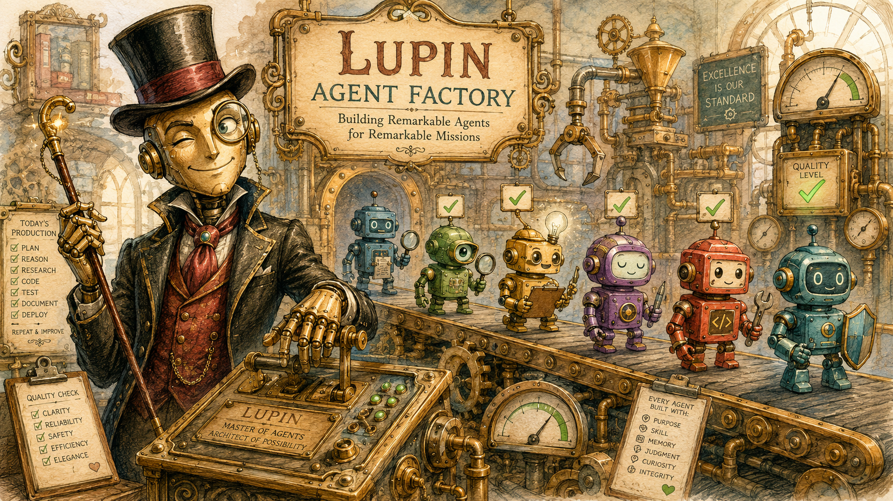
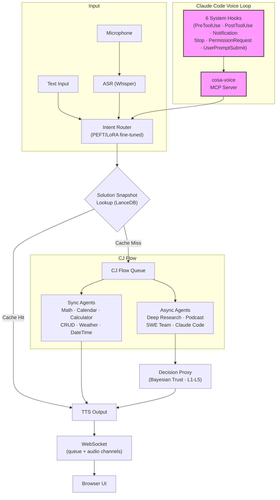

<p align="center">
  
</p>

# Lupin AF

*Named after Arsène Lupin, the gentleman thief. The **AF** is **Agent Factory** -- and, yes, the other thing too.*

> **Lupin AF (Agent Factory) is a voice-driven, human-in-the-loop harness that wraps Claude Code so a person who can't type can still drive an agentic coding session as a first-class UX citizen -- not just ride along as a passenger. And that's cool AF.**
>
> -- R.P. Ruiz, *[Lupin AF: How I Turned Claude Code Into an Agent Factory That Proves Itself](https://medium.com/@ricardo.felipe.ruiz/lupin-af-how-i-turned-claude-code-into-an-agent-factory-that-proves-itself-fc6f09bafadd)*

**A voice-first AI agent platform that closes the voice loop from browser UI through agent execution into developer tooling and back -- with Bayesian trust learning, fine-tuned intent routing, and solution caching built in.**

`FastAPI` | `Voice I/O` | `PEFT/LoRA` | `PostgreSQL + pgvector` | `Claude Agent SDK` | `Bayesian Trust` | `MCP Protocol`

Current version: **v0.2.0** (dev) | License: [Apache 2.0](LICENSE)

---

## What's New in v0.2.0 (dev) — the demo that had to survive a real room

v0.2.0 (August 2026, in progress on `wip-v0.2.0-2026.08.03-present-and-demo`) pointed the whole platform at one question: **can you hand Lupin a vague spoken request and get a finished artifact back, live, in front of people?**

Rehearsal answered "not yet" repeatedly, and that was the value. Nearly every item below was found by *driving the path*, not by reading the code.

- **The vague-request demo path, driven end to end.** Say "make me a podcast about that thing I was researching" and the Runtime Argument Expeditor notices what you didn't say and asks by voice. Document disambiguation now fires on the **first** turn when two documents match, rather than after a wasted round trip. The fuzzy matcher got a shared keyword pre-filter and a hard cap; the search-paths key was emptied after `/src` was found to be drowning the matcher with 6,670 candidates before it ever read the description.
- **Human approval gates that fail open, and say so.** Podcast and presentation gates now wait 600 seconds and then resolve to their default, with the prompt disclosing up front that silence continues. Proven live on `:8000` in both directions — human-answered and silent-timeout — with a harness that refuses to fire into a monopolizer-locked server and reports a job's real state on timeout instead of a bare "timed out".
- **Listen where you are.** A floating in-tab podcast overlay ("Play Here") plays a finished episode without leaving presentation mode, with real audio playback asserted under a genuine click gesture rather than mere element presence.
- **Presentation slide-count control.** An author-set slide count now overrides the duration formula; large decks are chunked up front behind a pinned progress bubble. A truncation detector was found **failing open** — an unknown `stop_reason` was being read as "completed", so a clipped deck reported success.
- **Cross-session message compression (arm 4).** The fleet's own DM traffic became the subject: a two-arm verbosity pilot (blind vs. rejecting at 150 words), a quality judge, and then a **literal freeze protocol** — extract, placehold, validate, restore — so a lossy rewrite can never corrupt a line number or a commit sha. 494 tests, identity round-trip byte-exact on all 2,951 real messages, and every guard proven by reverting it and watching the suite go red. The plan's original placeholder format was measured and rejected: it would have *added* 36,921 tokens before compressing a word.
- **Root causes that were not where anyone looked.** An empty podcast script traced to a curly brace in the model's closing remarks. A demo-line crash traced to that same morning's label fix. Spanish prosody was **refuted** as marker loss — it was a measurement bug. A "safety net that had never run" and a "bug that was never in the code" both got written up, because a wrong premise costs more than a wrong fix.
- **Ungated tests, found and closed.** 24 disambiguation tests were guarded by nobody. Three permanently-red tests were closed along with a catalogue that had been teaching the wrong cause. An unrestored `importlib.reload` was contained after it 500'd tests roughly 150 files later.
- **Fleet housekeeping.** 33 stray heartbeat holds were swept — and the rule against them was already written; the arbiter was fixed so it can see the hold it is poking through; a DM pilot that looked dead turned out to have an expired schedule.

---

*Highlights for earlier releases (v0.1.9, v0.1.8, v0.1.7) have moved to [WHATS-NEW.md](WHATS-NEW.md).*

---

## Human in the loop, reimagined

Every agentic AI platform needs human oversight. Most implement it as a modal dialog: click approve, type feedback, wait. Lupin takes a fundamentally different approach -- **voice-first human-in-the-loop**.

Agents speak to you. You speak back. A Bayesian trust engine learns your preferences over time, escalating only when confidence is low and auto-approving when it has earned your trust. The result: human oversight that works **from across the room**, while you're multitasking, or even from your phone -- no screen required.

This is the missing piece in agentic AI: not just making agents smarter, but making **human oversight effortless**.

---

## The dream

Talk to the computer, and it tells you, or does, something useful.

### The problem

Currently, AI agents and chatbots are [slow and expensive](https://www.linkedin.com/pulse/langchains-dataframe-agent-why-you-so-slow-r-p-ruiz).
They [make silly mistakes](https://www.linkedin.com/pulse/meet-my-idiot-savant-intern-chatgpts-advanced-data-analysis-ruiz/).
They're forgetful. And they work too hard reinventing the wheel.

### What most people probably don't realize

Even the simplest vox-in and vox-out UX -- especially when coupled with agentic behaviors -- is **_hard_**. It's asynchronous, and usually frustratingly slow. It's a new way of interacting with computers, which requires a global rethinking of how different the UI control and display modalities interact.

### Lupin's approach

Fine-tune small models for cheap, fast intent routing -- not prompt engineering, actual PEFT/LoRA fine-tuning. Escalate to frontier models only when complexity demands it. Cache solutions via vector search so agents never solve the same problem twice. Layer Bayesian trust learning so the system earns autonomy over time, minimizing human interruptions without sacrificing oversight. And voice-enable *everything* -- from the browser UI, through agent execution, into [Claude Code developer sessions](https://www.linkedin.com/pulse/slow-expensive-erratic-problem-whats-solution-r-p-ruiz/) via 6 system hooks and an MCP voice server, and back again.

---

## Architecture



Voice flows end-to-end: browser microphone through agent execution into Claude Code sessions and back via dual-channel WebSocket audio streaming.

---

## Agent ecosystem

**21 specialized agents** -- from sub-second sync responders to long-running autonomous research pipelines -- all routed through fine-tuned small models and unified by a single voice-first queue system.

### Synchronous agents (respond in <1s via PEFT routing)

| Agent | Purpose |
|-------|---------|
| MathAgent | Symbolic math via LLM |
| CalendarAgent | Date-aware scheduling |
| DateTimeAgent | Time queries and conversions |
| WeatherAgent | Weather lookups |
| TodoListAgent | Persistent task management |
| CalculatorAgent | Natural language calculator (508 LoRA templates), MathAgent fallback |
| CRUDAgent | Voice-controlled DataFrame create/read/update/delete |
| ReceptionistAgent | Top-level intent router |
| RuntimeArgumentExpeditor | LLM-powered gap analysis -- asks for missing arguments via voice |

### Long-running agents (async via CJ Flow queue)

| Agent | Purpose |
|-------|---------|
| DeepResearchAgent | Background research with automatic report generation |
| PodcastGeneratorAgent | Convert documents to audio podcast format |
| ResearchToPodcastAgent | Chained research-to-podcast pipeline |
| PresentationGeneratorAgent | Multi-phase pipeline: outline → elaborate → render → deliver (Phases 1-8) |
| ResearchToPresentationAgent | Chained research-to-presentation pipeline |
| ClaudeCodeAgent | Claude Agent SDK tasks (BOUNDED or INTERACTIVE mode) |
| SWETeamAgent | 4-phase dev team: Lead, Coder, Tester, Trust Proxy |

### Auto-recovery agents (self-healing via Claude Agent SDK + worktree isolation)

| Agent | Purpose |
|-------|---------|
| BugFixExpediter (BFE) | Dead-job auto-recovery: diagnose → propose → fix → git → retry |
| TestFixExpediter (TFE) | Test-failure auto-fix: cluster → diagnose → propose → fix → git → rerun |
| TestSuiteJob | Scheduled test-suite runs via CJ Flow with watchdog-triggered TFE handoff |

### Infrastructure agents

| Agent | Purpose |
|-------|---------|
| NotificationProxyAgent | Phi-4 fuzzy script matching for automated interactive testing |
| DecisionProxyAgent | Universal Prediction Engine (7 slices) · Bayesian Beta-Bernoulli trust · Thompson Sampling · Conformal prediction · L1-L5 escalation · Circuit breaker |
| HeartbeatArbiter | Fleet liveness detectors — session staleness, tap-ACK, whole-fleet stall — with per-family advisory cooldown |
| DMQualityJudge | Scores peer-to-peer session messages to drive down cross-session token burn |

---

## Key capabilities

### Voice-first everywhere -- browser to agents to developer tooling

No other platform closes the voice loop this completely:

- **Browser to agents**: Dual-channel WebSocket architecture (queue events + audio streaming) with ASR (Whisper) to TTS pipeline, end to end
- **Agents to developer tools**: 6 Claude Code system hooks (`PreToolUse`, `PostToolUse`, `Notification`, `Stop`, `PermissionRequest`, `UserPromptSubmit`) bridge voice into every coding session
- **Developer tools back to browser**: cosa-voice MCP server provides 5 voice tools (`notify`, `converse`, `ask_yes_no`, `ask_multiple_choice`, `ask_open_ended_batch`)
- **Session continuity**: Stable session IDs survive context clears via write-once atomic lockfile -- no identity drift
- **Stop hook gisting**: Ultra-short TTS summaries of completed work via frontier model distillation
- **Voice injection**: tmux-based voice input into idle Claude Code sessions -- speak and it types

### Intent routing via fine-tuned small models -- not prompt engineering

While most platforms route via system prompts or keyword matching, Lupin fine-tunes:

- 39,871 training examples across 35 command intents
- PEFT/LoRA on Phi-4, Qwen, and Llama -- local GPU inference, zero API calls for routing
- Sub-second classification with GSM8K-validated post-quantization math reasoning
- Result: routing that is faster, cheaper, and more reliable than prompt-based alternatives

### Solution snapshot memory -- agents that learn from their own work

When an agent solves a problem, the solution is embedded and cached in the vector store. Next time the same (or similar) question arrives, the answer comes from vector search -- not from re-running the agent.

**As of v0.1.9 the backend is PostgreSQL + pgvector** (cutover 2026-07-07; ~202,000 vectors backfilled, dual-engine equivalence proven, exact scan chosen over HNSW). The LanceDB path remains behind a one-flag rollback. The speedup numbers below are the original file-based → LanceDB benchmark that motivated a real vector store in the first place:

| Operation | File-Based | Vector store | Speedup |
|-----------|------------|--------------|---------|
| Search (exact) | 96 ms | 0.1 ms | **960x** |
| Add snapshot | 827 ms | 15 ms | **55x** |
| Search (fuzzy) | 120 ms | 0.3 ms | **400x** |

Local GPU embeddings (CodeRankEmbed + nomic-embed-text-v1.5) vs OpenAI API:

| Operation | Content | Local GPU | OpenAI API | Speedup |
|-----------|---------|-----------|------------|---------|
| Single embed | prose | 164 ms | 1,146 ms | **7x** |
| Single embed | code | 70 ms | 1,211 ms | **17x** |
| Batch (3) | prose | 8 ms | 2,989 ms | **374x** |
| Batch (3) | code | 8 ms | 3,183 ms | **398x** |

### Trust-aware decision proxy -- Bayesian autonomy that earns your confidence

The first decision proxy for AI agents with academic-grade statistical rigor:

- **Universal Prediction Engine**: 7 prediction slices with 87 unit tests and 21 end-to-end tests
- **Bayesian Beta-Bernoulli trust model**: Per-agent trust learning with conjugate prior updates
- **Thompson Sampling**: Exploration-exploitation balance for when to auto-approve vs. escalate
- **Conformal prediction**: Calibrated confidence intervals -- not guesses, statistical guarantees
- **LanceDB-backed preference embeddings**: Semantic similarity with response_type filtering
- **L1-L5 trust escalation**: Five trust levels from "always ask" to "full autonomy" with circuit breaker pattern
- **Morning coffee batch review**: Non-urgent decisions queued for human review at your convenience
- **Ratification API**: Post-hoc approval with trust feedback loop

### Battle-tested -- 24,500+ automated tests

| Suite | Count | Coverage |
|-------|-------|----------|
| Unit tests (Python) | 20,600 | Core logic, trust engine, hooks, credentials, prediction engine, agentic orchestrators, task store, arbiter -- 11,571 in the app tree, 9,029 in the in-tree CoSA framework |
| Unit tests (TypeScript) | 2,307 | Multiplexer audio, transport, stores, render — behind a hard 100% c8 gate |
| E2E UI (Playwright) | 678 | Full browser-driven flows including 12-page visual regression |
| Smoke tests | 437 | Fast sanity sweeps across the app and the Lupin smoke suite |
| Integration tests | 432 | End-to-end API workflows against dedicated dual-container test server |
| Parity oracle, cutover E2E, and other suites | 50 | Multiplexer-vs-legacy parity, store-owed cutover, targeted end-to-end checks |
| WebSocket tests | 43 | Connection, auth, event routing, session management |
| **Total authored test cases** | **24,547** | 22,240 Python + 2,307 TypeScript |
| Interactive proxy scenarios | 12 | Calculator, CRUD, and Expediter agents via auto-proxy (script-driven, not counted above) |

Counts are of authored test functions (`def test_*` / `it(` / `test(`) across `src/tests/` and `src/cosa/tests/`, as of 2026-08-07. A repo-wide grep returns a slightly larger number; the extra matches are self-test functions embedded in production modules, which are not part of any suite. **The suite figure is the one to quote.**

Built and maintained by a single engineer. Every PR must pass all tiers before merge, at 100% line, branch, and function coverage. A hash-chained attestation ledger records that each tier actually ran -- a green report that cannot prove it executed is not a green report.

**The rule behind all of it: the human is the designer and the user -- never the tester.** "Please try it and tell me if it works" is a prohibited sentence. That is not a preference. For a user who cannot type, manual QA is not an inconvenient fallback -- it is a fallback that does not exist. So the pyramid had to go all the way up. The test suite is an accessibility affordance: it is what lets one person who cannot manually click through a UI still know the software works.

---

## Quick start

```bash
# Prerequisites: Python 3.11+, GPU recommended, PostgreSQL
export LUPIN_ROOT=/path/to/lupin

# Configure credentials
src/scripts/lupin_config.py init

# Start the server
src/scripts/run-fastapi-lupin.sh          # FastAPI on port 7999
src/scripts/run-lupin-gui.sh              # Browser GUI client

# Run tests
pytest src/tests/unit/                     # 12,436 unit tests
src/scripts/run-websocket-smoke-tests.sh   # 50 WebSocket tests
src/tests/run-integration-tests.sh --bg -v # Integration gate (dual-container, :8000)
src/scripts/run-e2e-ui-tests.sh --bg -v    # 678 Playwright tests incl. visual regression

# Install cosa-voice MCP server (for Claude Code voice I/O)
claude mcp add cosa-voice -- python ${LUPIN_ROOT}/src/lupin_mcp/cosa_voice_mcp.py
```

**Config**: `src/conf/lupin-app.ini` | **Docker**: `docker build -f docker/lupin/Dockerfile .` | **GSM8K**: `src/scripts/run-gsm8k.sh --help`

---

## Documentation

### For developers

- [REST API Reference](src/docs/rest-api-reference.md) — all HTTP and WebSocket endpoints
- [WebSocket Architecture](src/docs/websocket-architecture.md) — dual-session design and event system
- [Notification API](src/docs/notification-api.md) — comprehensive notification reference with Mermaid diagrams
- [CJ Flow Packaging Guide](src/rnd/v0.1.4/2026.02.12-cj-flow-bounded-job-packaging-guide.md) — how to add new QueueableJob types
- [Durable Submit-Queue Restore](src/rnd/v0.2.0/2026.08.15-durable-submit-queue-restore.md) — why immediate queued jobs survive a container bounce (row 2817b0f5)
- [Flash-Lite on the GCP VM, and the Seed That Was Never Set](src/rnd/v0.2.0/2026.08.17-flash-lite-on-the-gcp-vm-and-the-missing-seed.md) — temperature was always 0.0, the seed did not exist and the client would have rejected one, and nothing on the VM supplied the GCP project id (row ae43a37c)
- [cosa-voice MCP Server](src/lupin_mcp/README.md) — MCP server setup and tool reference
- [Agentic Voice Workflow](src/workflow/agentic-voice-workflow.md) — building new agents with voice I/O
- [Fleet Liveness & Task-Store Architecture](src/docs/fleet-liveness-and-task-store-architecture.md) — one store, three readers; heartbeat holds; the arbiter and how to bounce it
- [The Worker-Poke Flag Is On and Cannot Fire](src/rnd/v0.2.0/2026.08.15-worker-poke-flag-cannot-fire.md) — why enabling worker pokes changed nothing: `stuck` means repeated cap-reached, and the staleness tier is manager-only
- [v1 Baseline Standalone Server Design](src/rnd/v0.2.0/2026.08.15-v1-baseline-standalone-server-design.md) — measure pinned sha `b0735467` on its own server + own DB, not a `:8000` job that measures today's main tree (row d212f54b)
- [Cost Model: Bounded CC vs Firewalled SDK](src/docs/cost-model-bounded-cc-vs-firewalled-sdk.md) — which LLM path an agent lands on, and why
- [Credential Detector Depth Fix](src/rnd/v0.2.0/2026.08.17-credential-detector-depth-fix.md) — the doc-viewer check read only the top level of a JSON file, so six shapes still served, the GCP console's own `client_secret` download among them (row 2d57a998)
- [Cascade Review: v2 as the Brain in the Todo Queue](src/rnd/v0.2.0/2026.08.15-cascade-review-v2-brain-in-todo-queue.md) — 19 findings against the v2-brain plan; the design held, most of the receipts did not. Includes the `needs_input` path that was dead-ended twice (since fixed) and a five-site routing inventory the plan counted as four
- [Cascade §4 Findings](src/rnd/v0.2.0/2026.08.15-cascade-section4-findings.md) — Krishna's line-by-line trace of v1's argument interview against v2's `needs_input`
- [The Unauthorized Branch Fork of 2026-08-15](src/rnd/v0.2.0/2026.08.15-unauthorized-branch-fork-and-reconciliation.md) — one `checkout -b` in the shared working copy silently moved the whole fleet off `wip-v0.2.0-2026.08.03-present-and-demo`; the divergence, the clean-merge proof, and why branch creation in the main tree should be a gated action
- [v2 as the Brain in the Todo Queue](src/rnd/v0.2.0/2026.08.15-v2-as-the-brain-in-todo-queue.md) — María's plan for v2 owning the todo queue; the document Clayton's three-round cascade reviewed
- [Cascade R1 Findings](src/rnd/v0.2.0/2026.08.15-cascade-r1-findings.md) · [R2](src/rnd/v0.2.0/2026.08.15-cascade-r2-findings.md) · [R3](src/rnd/v0.2.0/2026.08.15-cascade-r3-findings.md) — the three review rounds against that plan
- [Cascade Consolidation and Re-check](src/rnd/v0.2.0/2026.08.15-cascade-consolidation-and-recheck.md) — the merged verdict across all three rounds
- [Persona-Chain Allocator](src/rnd/v0.2.0/2026.08.15-persona-chain-allocator.md) — how a spawn walks its persona chain, and what a chain with no `*` fallback costs
- [Phase 2 Falsifiability Mutations](src/rnd/v0.2.0/2026.08.15-phase2-falsifiability-mutations.md) — the mutations each phase-2 guard must fail on, so a green gate proves something
- [Self-Re-Spin: 8-Gate Verification](src/rnd/v0.2.0/2026.08.15-arnold-self-respin-8-gate-verification.md) — all 8 spec gates verified as code properties; gate 5's "the proxy cannot answer no" was false and is fixed by `3f8cec99`. Three findings were spec defects rather than code defects
- [v2-Arm Adversarial Review](src/rnd/v0.2.0/2026.08.15-extra2-v2-arm-adversarial-review.md) — v2's own instruments are honest; the paired gate is defined, tested, and wired into nothing
- [v2 Ask Slowdown Investigation](src/rnd/v0.2.0/2026.08.17-v2-ask-slowdown-investigation.md) — the calls that looked like a degrading model server are the todo agent's normal ~65s cost; why the run died at the 120s read wall, and what the re-run actually costs
- [Adversarial Check on the Credential Detector](src/rnd/v0.2.0/2026.08.17-clayton-adversarial-check-tiffany-credential-fix.md) — the lead-in fix holds against 15 attacks, but the check is depth-blind: six shapes still serve, led by the `client_secret_*.json` file the GCP console hands you
- [Review of the Credential Depth Fix](src/rnd/v0.2.0/2026.08.17-tiffany-review-of-the-depth-fix.md) — the depth fix passes and every guard is proven by deletion; what its placeholder rule costs, and why the merge conflicted on a fix that was committed twice on two lineages (row 2d57a998)
- [Eight Instruments That Reported Clean Because They Could Not See](src/rnd/v0.2.0/2026.08.17-instruments-that-cannot-see.md) — one day, eight guards whose silence was indistinguishable from success; where the blindness comes from, the two tests that catch it, and why a lint cannot (row e28970ae)
- [Review: the Secret Scanner as a Pre-Commit Control](src/rnd/v0.2.0/2026.08.17-review-of-the-secret-scanner-precommit-control.md) — the instrument is sound and the pasted-hash hole is already closed; what is left is that the standing scan reads a ref 645 commits behind the branch we commit to, and that the scanner and the doc-viewer detector no longer agree on what a secret is (row 85959aaf)
- [Credential Detector Payload Fix](src/rnd/v0.2.0/2026.08.17-credential-detector-payload-shapes.md) — the depth walk stopped at a string and at a list, so a key carried as JSON text (terraform tfvars, k8s, compose) and a key written as an array of lines both served; the bounded re-parse, the costs it buys, and why the "one line" fix belongs one function up (rows b17ffefd, 0cbf69c0)
- [Novelty-Check Casefold: Premise Check](src/rnd/v0.2.0/2026.08.17-novelty-check-casefold-premise-check.md) — the check was already case-insensitive, so casefolding drops zero rejections; the words being flagged as invented names are ordinary English, and excluding them takes Flash-Lite from 130 blocks to 40
- [Lane-2 Harness Observability](src/rnd/v0.2.0/2026.08.17-lane2-harness-observability-row-1cd30181.md) — the E2E harness stopped watching 13 seconds before the product finished and called it a failure; stages now start INCONCLUSIVE so a red has to be earned too
- [A Collection Error Is Silence](src/rnd/v0.2.0/2026.08.17-pytest-collection-error-is-silence-row-bc83f2df.md) — two shapes wearing one word: an error in a test module read as a plain FAILED, while one in a conftest fired no hook at all and only the exit code could see it
- [Bounded Retry: One Helper, and the Seven Loops That Could Use It](src/rnd/v0.2.0/2026.08.20-bounded-retry-helper-and-migration-candidates.md) — a shared sync+async bounded-retry primitive built from the union of seven hand-rolled loops, wired to the one call that had none (the Kagi search behind the weather agent), plus the migration candidates and what makes each one risky (row 3598c1d3)

### Agentic jobs, recovery & test scheduling

Bug Fix Expediter (dead-job auto-recovery), Test Fix Expediter (test-failure auto-fix), and the TestSuiteJob scheduler share a common foundation in `src/cosa/agents/shared/`. See the **[Agents subsystem documentation](src/docs/agents/README.md)** for the full subsystem:

- [Bug Fix Expediter Guide](src/docs/agents/bug-fix-expediter-guide.md) — diagnose → propose → fix → git → retry pipeline
- [Test Fix Expediter Guide](src/docs/agents/test-fix-expediter-guide.md) — cluster → diagnose → propose → fix → git → rerun pipeline
- [Test-Suite Scheduling Guide](src/docs/agents/test-suite-scheduling-guide.md) — TestSuiteJob + `/schedule-tests` skill
- [Shared Fix Primitives Reference](src/docs/agents/shared-fix-primitives-reference.md) — PlanWriter, GitStrategist, FixExecutor

### For operators

- [Decision Proxy Admin Guide](src/docs/proxy-admin-guide.md) — Trust Dashboard and ratification how-to
- [Automated Interactive Testing](src/docs/automated-interactive-testing.md) — proxy auto-answer testing guide
- [WebSocket Troubleshooting](src/docs/websocket-troubleshooting.md) — common issues and debugging procedures

### R&D archive

Over 1,000 dated planning and research documents in [`src/rnd/`](src/rnd/README.md).

**Codebase metrics**: [Lupin parent vs CoSA comparison](src/rnd/v0.1.6/2026.04.12-codebase-analysis-lupin-vs-cosa.md) — 2026-04-12 snapshot of LoC distribution with mermaid diagram, 60/40 Python split, docstring-ratio observations, and operational implications of the CoSA-never-commit rule.

---

## Version history

**v0.2.0** (August 2026, in progress) — The demo that had to survive a real room. A vague spoken request ("make me a podcast about that thing I was researching") driven end to end through the Runtime Argument Expeditor, with first-turn document disambiguation, a shared keyword pre-filter and hard cap on the fuzzy matcher, and the search-paths key emptied after `/src` was found flooding the matcher with 6,670 candidates. Human approval gates for podcast and presentation now **fail open** — 600-second wait, timeout resolves the default, and the prompt discloses that silence continues — proven live on `:8000` in both the human-answered and silent-timeout directions. A floating in-tab podcast overlay ("Play Here") plays a finished episode without leaving presentation mode, with real playback asserted under a genuine click gesture. Presentation gained author-set slide-count override, up-front chunking of large decks behind a pinned progress bubble, and a fix for a truncation detector that was failing open on an unknown `stop_reason`. Cross-session DM verbosity became its own experiment: a two-arm pilot, a quality judge, and a **literal freeze protocol** (extract → placehold → validate → restore) with 494 tests, byte-exact identity round-trip across all 2,951 real messages, and every guard falsified by revert. Root causes that were not where anyone looked: an empty podcast script from a curly brace in the model's closing remarks; a demo crash caused by that morning's own label fix; Spanish prosody **refuted** as marker loss when it was a measurement bug. 24 ungated disambiguation tests found and closed; 33 stray heartbeat holds swept. 24,547 tests.

*Earlier releases (v0.1.9 back to v0.1.3) have moved to [VERSION-HISTORY.md](VERSION-HISTORY.md).*

[Full changelog](CHANGELOG.md)

---

## Project status

Lupin is an active research platform at v0.2.0 (dev). Developed by a solo engineer, it combines voice-first agent orchestration, PEFT fine-tuning, and Bayesian decision theory into a production-grade stack backed by 24,547 automated tests across seven tiers (Python unit, TypeScript unit, WebSocket, smoke, integration, Playwright E2E, parity oracle), full CI discipline, and a FastAPI + PostgreSQL + pgvector architecture. Through a series of ambitious refactorings made possible by Claude Code and the [Planning is Prompting](https://github.com/deepily/planning-is-prompting) methodology, Lupin has evolved from single-user PoC sketches into a multi-user platform running on GCP.

---

## The wall of technologies

Fifteen months, two repositories, 1,199 research and design documents. This is not a
capability boast — it's a map of the talks that aren't being given. **Every item on it is
something that had to be learned, chosen, measured, or thrown away.**

Semantic Caching · Mimetic Drift · PEFT/LoRA fine-tuning · Synthetic Training Data
Generation · Phi-4 · Qwen · Llama · Ministral · Human in the Loop · vLLM ·
GSM8K-validated quantization · Whisper ASR · streaming TTS · dual-channel WebSockets ·
server-sent events (SSE) · FastAPI · PostgreSQL · pgvector · LanceDB · CodeRankEmbed ·
nomic-embed · Bayesian Beta-Bernoulli trust · Thompson Sampling · conformal prediction ·
circuit breakers · Claude Agent SDK · MCP servers · six Claude Code system hooks · tmux
orchestration · git worktree isolation · Playwright visual regression · Docker · Cloud Run ·
Cloud SQL · GCS · Terraform · GitHub Actions · Firebase push · Marp rendering ·
hash-chained attestation ledgers · Alembic migrations · JWT/OAuth · Phi-4 fuzzy script
matching · **the automate-everything test pyramid**

### Breadth inventory

Each band below is a talk that could exist.

**Voice I/O foundations** — WebSocket TTS streaming · progressive TTS streaming · TTS mode
switching · sequential audio chunk playback · audio caching · ASR via Whisper ·
dual-channel WebSocket (queue events + audio) · voice injection into idle developer
sessions via tmux

**Notification and question architecture** — Three-level question representation ·
server-sent events · sender-aware notification routing · notification authentication ·
progressive-disclosure job cards · notification API with markdown and confidence rendering ·
the interrogation framework (yes/no/neither, open-ended, multiple choice inclusive and
exclusive, batched)

**Intent routing with small models** — PEFT / LoRA fine-tuning on Phi-4, Qwen, and Llama ·
39,871 training examples across 35 command intents · sub-second local-GPU classification
with zero API calls · GSM8K-validated post-quantization math reasoning · vLLM latency
analysis · dual-quant multi-LLM trainer · three-model comparative studies ·
resume-from-merged and OOM allocator work

**Memory and retrieval** — Solution snapshots, agents that cache their own solved problems ·
file-based → LanceDB → PostgreSQL + pgvector migration (~202,000 vectors, dual-engine
equivalence proven) · local GPU embeddings vs. hosted API (7×–398× measured) ·
CodeRankEmbed and nomic-embed for code vs. prose · exact scan chosen over HNSW, with
receipts

**The agentic job system** — CJ Flow queue · 21 specialized agents · synchronous
sub-second responders (math, calendar, CRUD, calculator, weather, receptionist) ·
long-running async agents (deep research, podcast generation, presentation generation,
chained research-to-artifact pipelines) · the Runtime Argument Expeditor, which notices
what you didn't tell it and asks by voice · scheduled jobs surviving server bounces

**Trust and autonomy** — Bayesian Beta-Bernoulli trust model with conjugate prior updates ·
Thompson Sampling for explore/exploit · conformal prediction for calibrated confidence ·
L1–L5 escalation with circuit breaker · Universal Prediction Engine across seven slices ·
morning-coffee batch review of non-urgent decisions · post-hoc ratification with a trust
feedback loop

**Self-healing** — Bug Fix Expediter (diagnose, propose, fix, commit, retry) · Test Fix
Expediter (cluster, diagnose, fix, rerun) · git worktree isolation per repair ·
watchdog-triggered handoff from a scheduled test run

**The multi-session fleet** — Per-session voice personas · solo and chorus TTS modes ·
inter-session commons · direct messages between sessions · broadcasts · the heartbeat
arbiter and its liveness detectors · the unified task store · focus bar and multiplexer UI ·
memento-and-respin continuity across context clears · manager spawn/harvest autonomy ·
proactive-manager mechanism

**Workflow as infrastructure** ([planning-is-prompting](https://github.com/deepily/planning-is-prompting))
— 53 canonical workflow documents · cascaded plan review and cascaded plan authoring ·
SWE-team spin-up · post-game retrospectives · session start / checkpoint / end rituals ·
history archival with velocity forecasting · bug-fix mode · skills management · the
installation wizard · the KISS brevity mandate

**The automate-everything test pyramid** — 24,547 authored test cases across seven tiers ·
Python unit · TypeScript unit · integration · smoke · end-to-end UI · WebSocket · parity
oracle · 100% line, branch, and function coverage gates · Playwright with 12-page visual
regression · interactive proxy testing driven by a Phi-4 fuzzy script matcher · hash-chained
attestation ledger · neutral-directory execution to defeat false greens · revert-to-verify
discipline (**an assertion isn't a guard until you delete what it guards and watch it go
red**) · self-healing repair agents that fix their own red tests

**Cloud and infrastructure** — GCP migration · Cloud Run · Cloud SQL · GCS-backed storage ·
Docker non-root hardening · CUDA/torch version pinning · GPU model-server split · CI/CD via
GitHub Actions · Firebase push provisioning

---

## License

[Apache 2.0](LICENSE)
