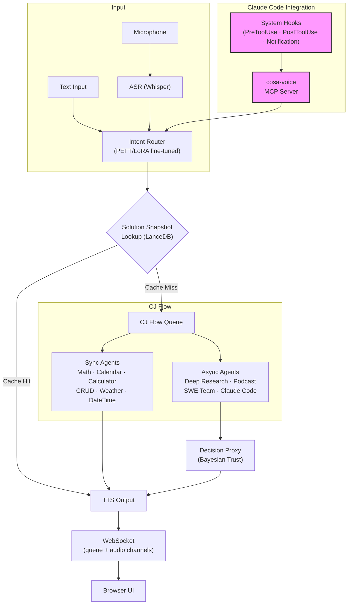

# Lupin

*Named after Arsene Lupin, the gentleman thief. More on that front once Lupin enters multi-user testing on Google Cloud*

**A voice-first AI agent platform that routes spoken commands to specialized agents, remembers what it has already solved, and talks back.**

`FastAPI` | `Voice I/O` | `PEFT/LoRA` | `LanceDB` | `Claude Agent SDK`

Current version: **v0.1.4** (v0.1.5 in progress) | License: [Apache 2.0](LICENSE)

---

## The dream

Talk to the computer, and it tells you, or does, something useful.

### The problem

Currently, AI agents and chatbots are [slow and expensive](https://www.linkedin.com/pulse/langchains-dataframe-agent-why-you-so-slow-r-p-ruiz).
They [make silly mistakes](https://www.linkedin.com/pulse/meet-my-idiot-savant-intern-chatgpts-advanced-data-analysis-ruiz/).
They're forgetful. And they work too hard reinventing the wheel.

### What most people probably don't realize

Even the simplest vox-in and vox-out UX -- especially when coupled with agentic behaviors -- is **_hard_**. It's asynchronous, and usually frustratingly slow. It's a new way of interacting with computers, which requires a global rethinking of how different the UI control and display modalities interact.

### Lupin's approach

Fine-tune small models for cheap, fast intent routing. Escalate to frontier models only for complex tasks. Cache prior solutions via vector search so agents stop reinventing the wheel. And voice-enable everything -- from the browser UI all the way into [developer tooling sessions](https://www.linkedin.com/pulse/slow-expensive-erratic-problem-whats-solution-r-p-ruiz/).

---

## Architecture



The highlighted path at the bottom is the **v0.1.5 novelty** -- it closes the voice loop *inside* Claude Code sessions via system hooks and the cosa-voice MCP server.

---

## Agent ecosystem

### Synchronous agents (respond in <1s via PEFT routing)

| Agent | Purpose |
|-------|---------|
| MathAgent | Symbolic math via LLM |
| CalendarAgent | Date-aware scheduling |
| DateTimeAgent | Time queries and conversions |
| WeatherAgent | Weather lookups |
| TodoListAgent | Persistent task management |
| CalculatorAgent | Natural language calculator (508 LoRA templates), MathAgent fallback |
| CRUDAgent | Voice-controlled DataFrame create/read/update/delete |
| ReceptionistAgent | Top-level intent router |
| RuntimeArgumentExpeditor | LLM-powered gap analysis -- asks for missing arguments via voice |

### Long-running agents (async via CJ Flow queue)

| Agent | Purpose |
|-------|---------|
| DeepResearchAgent | Background research with automatic report generation |
| PodcastGeneratorAgent | Convert documents to audio podcast format |
| ResearchToPodcastAgent | Chained research-to-podcast pipeline |
| ClaudeCodeAgent | Claude Agent SDK tasks (BOUNDED or INTERACTIVE mode) |
| SWETeamAgent | 4-phase dev team: Lead, Coder, Tester, Trust Proxy |

### Infrastructure agents

| Agent | Purpose |
|-------|---------|
| NotificationProxyAgent | Phi-4 fuzzy script matching for automated interactive testing |
| DecisionProxyAgent | Bayesian trust (L1-L5) + conformal prediction + circuit breaker |

---

## Key capabilities

### Voice-first throughout

- Dual-channel WebSocket architecture (queue events + audio streaming)
- ASR (Whisper) to intent routing to TTS pipeline, end to end
- Claude Code system hooks integration closes the voice loop inside developer sessions (v0.1.5)
- cosa-voice MCP server provides `notify`, `converse`, `ask_yes_no`, `ask_multiple_choice`, `ask_open_ended_batch`

### Intent routing via fine-tuned small models

- 39,871 training examples across 35 command intents
- PEFT/LoRA fine-tuning on Phi-4, Qwen, and Llama base models
- Local GPU inference via vLLM -- no API calls for routing
- GSM8K benchmarking to validate post-quantization math reasoning

### Solution snapshot memory

LanceDB vector search replaces file-based lookups for massive speedups:

| Operation | File-Based | LanceDB | Speedup |
|-----------|------------|---------|---------|
| Search (exact) | 96 ms | 0.1 ms | **960x** |
| Add snapshot | 827 ms | 15 ms | **55x** |
| Search (fuzzy) | 120 ms | 0.3 ms | **400x** |

Local GPU embeddings (CodeRankEmbed + nomic-embed-text-v1.5) vs OpenAI API:

| Operation | Content | Local GPU | OpenAI API | Speedup |
|-----------|---------|-----------|------------|---------|
| Single embed | prose | 164 ms | 1,146 ms | **7x** |
| Single embed | code | 70 ms | 1,211 ms | **17x** |
| Batch (3) | prose | 8 ms | 2,989 ms | **374x** |
| Batch (3) | code | 8 ms | 3,183 ms | **398x** |

### Trust-aware decision proxy

- L1-L5 trust levels learned per agent via Bayesian Beta-Bernoulli model
- Conformal prediction wrapper for calibrated confidence intervals
- Circuit breaker pattern -- auto-escalates to human review on trust degradation
- "Morning coffee" batch review model for non-urgent decisions
- Ratification API for post-hoc human approval with trust feedback loop

### cosa-voice MCP integration

- Voice I/O for Claude Code via MCP server protocol
- System hooks (`PreToolUse`, `PostToolUse`, `Notification`) bridge voice into every session
- Session bridge for automatic registration and lifecycle management
- Blocking and non-blocking notification patterns with priority routing

---

## Quick start

```bash
# Prerequisites: Python 3.11+, GPU recommended, PostgreSQL or SQLite
export LUPIN_ROOT=/path/to/lupin

# Start the server
src/scripts/run-fastapi-lupin.sh          # FastAPI on port 7999
src/scripts/run-lupin-gui.sh              # Browser GUI client

# Run tests
pytest src/tests/unit/                     # 915+ unit tests
src/scripts/run-websocket-smoke-tests.sh   # 50 WebSocket tests
src/tests/run-integration-tests.sh -v      # Integration gate

# Install cosa-voice MCP server (for Claude Code voice I/O)
claude mcp add cosa-voice -- python ${LUPIN_ROOT}/src/lupin_mcp/cosa_voice_mcp.py
```

**Config**: `src/conf/lupin-app.ini` | **Docker**: `docker build -f docker/lupin/Dockerfile .` | **GSM8K**: `src/scripts/run-gsm8k.sh --help`

---

## Documentation

### For developers

- [REST API Reference](src/docs/rest-api-reference.md) — all HTTP and WebSocket endpoints
- [WebSocket Architecture](src/docs/websocket-architecture.md) — dual-session design and event system
- [Notification API](src/docs/notification-api.md) — comprehensive notification reference with Mermaid diagrams
- [CJ Flow Packaging Guide](src/rnd/2026.02.12-cj-flow-bounded-job-packaging-guide.md) — how to add new QueueableJob types
- [cosa-voice MCP Server](src/lupin_mcp/README.md) — MCP server setup and tool reference
- [Agentic Voice Workflow](src/workflow/agentic-voice-workflow.md) — building new agents with voice I/O

### For operators

- [Decision Proxy Admin Guide](src/docs/proxy-admin-guide.md) — Trust Dashboard and ratification how-to
- [Automated Interactive Testing](src/docs/automated-interactive-testing.md) — proxy auto-answer testing guide
- [WebSocket Troubleshooting](src/docs/websocket-troubleshooting.md) — common issues and debugging procedures

### R&D archive

Over 130 dated planning and research documents in [`src/rnd/`](src/rnd/README.md).

---

## Version history

**v0.1.5** (in progress) — Claude Code system hooks for voice I/O, session bridge, hook library infrastructure

**v0.1.4** — cosa-voice MCP server, SWE Team Agent, Calculator Agent, CRUD Agent, Notification Proxy, 881 to 1170 unit tests, 39,871 training examples, local GPU embeddings

**v0.1.3** — CJ Flow agentic job system, Deep Research + Podcast agents, Claude Agent SDK integration, JWT WebSocket auth, 100% test coverage

[Full changelog](CHANGELOG.md)

---

## Project status

Lupin is an active research platform at v0.1.4, with v0.1.5 in progress. It is developed by a solo engineer as an ongoing exploration of voice-first agent architectures, PEFT fine-tuning pipelines, and autonomous decision systems.

The codebase reflects real engineering: 915+ tests, full CI discipline, and a production-grade FastAPI + PostgreSQL + LanceDB stack. Through a series of massive refactorings made possible by Claude Code and the [Planning is Prompting](https://github.com/deepily/planning-is-prompting) repo, Lupin has evolved from a series of single-user PoC sketches to a multi-user GCP-based package entering testing phase RealSoonNow.

---

## License

[Apache 2.0](LICENSE)
