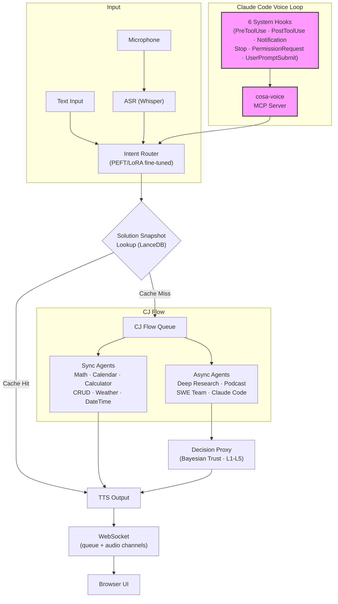

# Lupin AF

*Named after Arsene Lupin, the gentleman thief. More about the AF part when the v0.1.6 branch lands in mid-to-late April.*

**A voice-first AI agent platform that closes the voice loop from browser UI through agent execution into developer tooling and back -- with Bayesian trust learning, fine-tuned intent routing, and solution caching built in.**

`FastAPI` | `Voice I/O` | `PEFT/LoRA` | `LanceDB` | `Claude Agent SDK` | `Bayesian Trust` | `MCP Protocol`

Current version: **v0.1.7** | License: [Apache 2.0](LICENSE)

---

## What's New in v0.1.7 — the multi-session voice cockpit

Lupin's voice loop grew from a single session into a **chorus of named AI collaborators working side by side**:

- **Per-session voice personas + chorus mode** — every Claude Code session is allocated a distinct named voice (Mr. Radio, Rio, Tiberius, María, Krishna...). In chorus mode the voice *is* the disambiguator: you hear which session is speaking. Personas survive `/clear`, `/compact`, and resume; an overflow pool covers more sessions than named slots; the new `request_persona` MCP tool lets a session reclaim its identity.
- **Inter-session commons** — concurrent sessions now talk to each other: a shared blackboard (`commons_post` / `commons_read` / `commons_who`), direct messages (`commons_send_to`), and cross-session questions (`commons_ask_async` / `commons_ask_sync`) — all surfaced in a live Recent Activity stream and broadcast panel in the browser.
- **Manager-spawned headless reviewers** — one session can spin up N headless Claude Code reviewer sessions on demand (`spawn_sessions` / `dismiss_sessions` / `list_spawned_sessions`), automating the cascaded plan-review workflow with idle-TTL reaping and manifest lineage.
- **Speakerphone mode (solo / chorus)** — the renamed, hardened successor to conversation mode, driven by a per-turn hook rider that adapts TTS brevity and interactive-tool routing to the live session state.
- **Notifications UI rebuilt in TypeScript** — the notifications surface was re-implemented as a typed, esbuild-bundled multiplexer behind a hard **100% c8 coverage gate** (lines + branches + functions), with a dedicated Jobs pane.
- **Multi-repo document viewer** — the in-browser doc viewer now serves whitelisted files from N registered repos via path-prefix routing, JWT-gated, with a universal secrets blocklist and inline source-code + image rendering.
- **CJ Flow async multi-lane** — long-running agentic jobs now run in a dedicated `ThreadPoolExecutor` pool with a ghost-job sweeper, a centralized `ApiResourceManager` for per-provider rate limiting, and a `GET /api/queue/pool-status` observability endpoint — fast-lane sync agents are never blocked.
- **Bounded Claude Code = zero per-token cost** — empirically confirmed (2026-05-12): bounded `ClaudeCodeJob` work runs on Max-plan OAuth at zero metered cost. BFE and TFE migrated, with a documented cost model for choosing bounded-CC vs. firewalled SDK.
- **Heartbeat-poker** — a generic liveness / keep-alive abstraction for long-running jobs, riding the commons for cross-session check-ins.
- **100% coverage mandate, Lupin-wide** — line + branch + function coverage is now a hard merge gate across the entire Lupin codebase.

Lupin is now a **multi-user platform preparing for GCP deployment**.

---

## Human in the loop, reimagined

Every agentic AI platform needs human oversight. Most implement it as a modal dialog: click approve, type feedback, wait. Lupin takes a fundamentally different approach -- **voice-first human-in-the-loop**.

Agents speak to you. You speak back. A Bayesian trust engine learns your preferences over time, escalating only when confidence is low and auto-approving when it has earned your trust. The result: human oversight that works **from across the room**, while you're multitasking, or even from your phone -- no screen required.

This is the missing piece in agentic AI: not just making agents smarter, but making **human oversight effortless**.

---

## The dream

Talk to the computer, and it tells you, or does, something useful.

### The problem

Currently, AI agents and chatbots are [slow and expensive](https://www.linkedin.com/pulse/langchains-dataframe-agent-why-you-so-slow-r-p-ruiz).
They [make silly mistakes](https://www.linkedin.com/pulse/meet-my-idiot-savant-intern-chatgpts-advanced-data-analysis-ruiz/).
They're forgetful. And they work too hard reinventing the wheel.

### What most people probably don't realize

Even the simplest vox-in and vox-out UX -- especially when coupled with agentic behaviors -- is **_hard_**. It's asynchronous, and usually frustratingly slow. It's a new way of interacting with computers, which requires a global rethinking of how different the UI control and display modalities interact.

### Lupin's approach

Fine-tune small models for cheap, fast intent routing -- not prompt engineering, actual PEFT/LoRA fine-tuning. Escalate to frontier models only when complexity demands it. Cache solutions via vector search so agents never solve the same problem twice. Layer Bayesian trust learning so the system earns autonomy over time, minimizing human interruptions without sacrificing oversight. And voice-enable *everything* -- from the browser UI, through agent execution, into [Claude Code developer sessions](https://www.linkedin.com/pulse/slow-expensive-erratic-problem-whats-solution-r-p-ruiz/) via 6 system hooks and an MCP voice server, and back again.

---

## Architecture



Voice flows end-to-end: browser microphone through agent execution into Claude Code sessions and back via dual-channel WebSocket audio streaming.

---

## Agent ecosystem

**17 specialized agents** -- from sub-second sync responders to long-running autonomous research pipelines -- all routed through fine-tuned small models and unified by a single voice-first queue system.

### Synchronous agents (respond in <1s via PEFT routing)

| Agent | Purpose |
|-------|---------|
| MathAgent | Symbolic math via LLM |
| CalendarAgent | Date-aware scheduling |
| DateTimeAgent | Time queries and conversions |
| WeatherAgent | Weather lookups |
| TodoListAgent | Persistent task management |
| CalculatorAgent | Natural language calculator (508 LoRA templates), MathAgent fallback |
| CRUDAgent | Voice-controlled DataFrame create/read/update/delete |
| ReceptionistAgent | Top-level intent router |
| RuntimeArgumentExpeditor | LLM-powered gap analysis -- asks for missing arguments via voice |

### Long-running agents (async via CJ Flow queue)

| Agent | Purpose |
|-------|---------|
| DeepResearchAgent | Background research with automatic report generation |
| PodcastGeneratorAgent | Convert documents to audio podcast format |
| ResearchToPodcastAgent | Chained research-to-podcast pipeline |
| PresentationGeneratorAgent | Multi-phase pipeline: outline → elaborate → render → deliver (Phases 1-8) |
| ResearchToPresentationAgent | Chained research-to-presentation pipeline |
| ClaudeCodeAgent | Claude Agent SDK tasks (BOUNDED or INTERACTIVE mode) |
| SWETeamAgent | 4-phase dev team: Lead, Coder, Tester, Trust Proxy |

### Auto-recovery agents (self-healing via Claude Agent SDK + worktree isolation)

| Agent | Purpose |
|-------|---------|
| BugFixExpediter (BFE) | Dead-job auto-recovery: diagnose → propose → fix → git → retry |
| TestFixExpediter (TFE) | Test-failure auto-fix: cluster → diagnose → propose → fix → git → rerun |
| TestSuiteJob | Scheduled test-suite runs via CJ Flow with watchdog-triggered TFE handoff |

### Infrastructure agents

| Agent | Purpose |
|-------|---------|
| NotificationProxyAgent | Phi-4 fuzzy script matching for automated interactive testing |
| DecisionProxyAgent | Universal Prediction Engine (7 slices) · Bayesian Beta-Bernoulli trust · Thompson Sampling · Conformal prediction · L1-L5 escalation · Circuit breaker |

---

## Key capabilities

### Voice-first everywhere -- browser to agents to developer tooling

No other platform closes the voice loop this completely:

- **Browser to agents**: Dual-channel WebSocket architecture (queue events + audio streaming) with ASR (Whisper) to TTS pipeline, end to end
- **Agents to developer tools**: 6 Claude Code system hooks (`PreToolUse`, `PostToolUse`, `Notification`, `Stop`, `PermissionRequest`, `UserPromptSubmit`) bridge voice into every coding session
- **Developer tools back to browser**: cosa-voice MCP server provides 5 voice tools (`notify`, `converse`, `ask_yes_no`, `ask_multiple_choice`, `ask_open_ended_batch`)
- **Session continuity**: Stable session IDs survive context clears via write-once atomic lockfile -- no identity drift
- **Stop hook gisting**: Ultra-short TTS summaries of completed work via frontier model distillation
- **Voice injection**: tmux-based voice input into idle Claude Code sessions -- speak and it types

### Intent routing via fine-tuned small models -- not prompt engineering

While most platforms route via system prompts or keyword matching, Lupin fine-tunes:

- 39,871 training examples across 35 command intents
- PEFT/LoRA on Phi-4, Qwen, and Llama -- local GPU inference, zero API calls for routing
- Sub-second classification with GSM8K-validated post-quantization math reasoning
- Result: routing that is faster, cheaper, and more reliable than prompt-based alternatives

### Solution snapshot memory -- agents that learn from their own work

When an agent solves a problem, the solution is embedded and cached in LanceDB. Next time the same (or similar) question arrives, the answer comes from vector search -- not from re-running the agent.

| Operation | File-Based | LanceDB | Speedup |
|-----------|------------|---------|---------|
| Search (exact) | 96 ms | 0.1 ms | **960x** |
| Add snapshot | 827 ms | 15 ms | **55x** |
| Search (fuzzy) | 120 ms | 0.3 ms | **400x** |

Local GPU embeddings (CodeRankEmbed + nomic-embed-text-v1.5) vs OpenAI API:

| Operation | Content | Local GPU | OpenAI API | Speedup |
|-----------|---------|-----------|------------|---------|
| Single embed | prose | 164 ms | 1,146 ms | **7x** |
| Single embed | code | 70 ms | 1,211 ms | **17x** |
| Batch (3) | prose | 8 ms | 2,989 ms | **374x** |
| Batch (3) | code | 8 ms | 3,183 ms | **398x** |

### Trust-aware decision proxy -- Bayesian autonomy that earns your confidence

The first decision proxy for AI agents with academic-grade statistical rigor:

- **Universal Prediction Engine**: 7 prediction slices with 87 unit tests and 21 end-to-end tests
- **Bayesian Beta-Bernoulli trust model**: Per-agent trust learning with conjugate prior updates
- **Thompson Sampling**: Exploration-exploitation balance for when to auto-approve vs. escalate
- **Conformal prediction**: Calibrated confidence intervals -- not guesses, statistical guarantees
- **LanceDB-backed preference embeddings**: Semantic similarity with response_type filtering
- **L1-L5 trust escalation**: Five trust levels from "always ask" to "full autonomy" with circuit breaker pattern
- **Morning coffee batch review**: Non-urgent decisions queued for human review at your convenience
- **Ratification API**: Post-hoc approval with trust feedback loop

### Battle-tested -- 4,180+ automated tests

| Suite | Count | Coverage |
|-------|-------|----------|
| Unit tests | 3,549+ | Core logic, trust engine, hooks, credentials, prediction engine, agentic orchestrators |
| WebSocket tests | 50 | Connection, auth, event routing, session management |
| Integration tests | 228+ | End-to-end API workflows against dedicated dual-container test server |
| E2E UI (Playwright) | 357+ | Full browser-driven flows including 12-page visual regression |
| Interactive proxy tests | 12 scenarios | Calculator, CRUD, and Expediter agents via auto-proxy |

Built and maintained by a single engineer. Every PR must pass all five tiers before merge.

---

## Quick start

```bash
# Prerequisites: Python 3.11+, GPU recommended, PostgreSQL
export LUPIN_ROOT=/path/to/lupin

# Configure credentials
src/scripts/lupin_config.py init

# Start the server
src/scripts/run-fastapi-lupin.sh          # FastAPI on port 7999
src/scripts/run-lupin-gui.sh              # Browser GUI client

# Run tests
pytest src/tests/unit/                     # 3,549+ unit tests
src/scripts/run-websocket-smoke-tests.sh   # 50 WebSocket tests
src/tests/run-integration-tests.sh --bg -v # Integration gate (dual-container, :8000)
src/scripts/run-e2e-ui-tests.sh --bg -v    # 357+ Playwright tests incl. visual regression

# Install cosa-voice MCP server (for Claude Code voice I/O)
claude mcp add cosa-voice -- python ${LUPIN_ROOT}/src/lupin_mcp/cosa_voice_mcp.py
```

**Config**: `src/conf/lupin-app.ini` | **Docker**: `docker build -f docker/lupin/Dockerfile .` | **GSM8K**: `src/scripts/run-gsm8k.sh --help`

---

## Documentation

### For developers

- [REST API Reference](src/docs/rest-api-reference.md) — all HTTP and WebSocket endpoints
- [WebSocket Architecture](src/docs/websocket-architecture.md) — dual-session design and event system
- [Notification API](src/docs/notification-api.md) — comprehensive notification reference with Mermaid diagrams
- [CJ Flow Packaging Guide](src/rnd/2026.02.12-cj-flow-bounded-job-packaging-guide.md) — how to add new QueueableJob types
- [cosa-voice MCP Server](src/lupin_mcp/README.md) — MCP server setup and tool reference
- [Agentic Voice Workflow](src/workflow/agentic-voice-workflow.md) — building new agents with voice I/O

### Agentic jobs, recovery & test scheduling

Bug Fix Expediter (dead-job auto-recovery), Test Fix Expediter (test-failure auto-fix), and the TestSuiteJob scheduler share a common foundation in `src/cosa/agents/shared/`. See the **[Agents subsystem documentation](src/docs/agents/README.md)** for the full subsystem:

- [Bug Fix Expediter Guide](src/docs/agents/bug-fix-expediter-guide.md) — diagnose → propose → fix → git → retry pipeline
- [Test Fix Expediter Guide](src/docs/agents/test-fix-expediter-guide.md) — cluster → diagnose → propose → fix → git → rerun pipeline
- [Test-Suite Scheduling Guide](src/docs/agents/test-suite-scheduling-guide.md) — TestSuiteJob + `/schedule-tests` skill
- [Shared Fix Primitives Reference](src/docs/agents/shared-fix-primitives-reference.md) — PlanWriter, GitStrategist, FixExecutor

### For operators

- [Decision Proxy Admin Guide](src/docs/proxy-admin-guide.md) — Trust Dashboard and ratification how-to
- [Automated Interactive Testing](src/docs/automated-interactive-testing.md) — proxy auto-answer testing guide
- [WebSocket Troubleshooting](src/docs/websocket-troubleshooting.md) — common issues and debugging procedures

### R&D archive

Over 130 dated planning and research documents in [`src/rnd/`](src/rnd/README.md).

**Codebase metrics**: [Lupin parent vs CoSA comparison](src/rnd/v0.1.6/2026.04.12-codebase-analysis-lupin-vs-cosa.md) — 2026-04-12 snapshot of LoC distribution with mermaid diagram, 60/40 Python split, docstring-ratio observations, and operational implications of the CoSA-never-commit rule.

---

## Version history

**v0.1.7** (April–May 2026) — Multi-session voice cockpit. Per-session voice personas with chorus-mode disambiguation, overflow pool, `/clear`+`/compact` preservation, and `request_persona` MCP tool. Inter-session commons: cross-session blackboard, DMs, and async/sync questions surfaced in a live Recent Activity stream + broadcast panel. Manager-spawned headless reviewer sessions (`spawn_sessions` / `dismiss_sessions` / `list_spawned_sessions`) automating cascaded plan-review. Speakerphone mode (solo/chorus) replacing conversation mode with a per-turn hook rider. Notifications UI rebuilt as a TypeScript multiplexer behind a 100% c8 coverage gate. Multi-repo doc viewer with path-prefix scope routing, JWT gate, secrets blocklist, and source-code + image rendering. CJ Flow async multi-lane: agentic ThreadPoolExecutor pool, ghost-job sweeper, ApiResourceManager rate limiting, and `pool-status` endpoint. Bounded-CC zero-per-token billing empirically confirmed; BFE/TFE migrated. Heartbeat-poker liveness abstraction. WS reconnect circuit-breaker. 100% line+branch+function coverage adopted as a Lupin-wide merge gate.

**v0.1.6** (April 2026) — Presentation Generator agent (multi-phase outline → elaborate → render → deliver, 8 phases). CJ Flow persistence: PostgreSQL write-through for todo/running/done queues with startup recovery, timed execution + monopolize + pause flags, and Job History UI (5th collapsible section with time-window filter). Auto-recovery agent family: Bug Fix Expediter and Test Fix Expediter with Claude Agent SDK worktree isolation and Resume-with-overrides UI. Playwright E2E suite expanded from ~100 to 357 tests across 8 phases, including 12-page visual regression with deterministic font rendering. Dual-container test architecture (`lupin-rest-test` on `:8000`). `set_session_topic()` MCP tool for stop-hook context. Graceful STT degradation (server starts without GPU). Claude Agent SDK config migration to INI keys. 3,549+ unit tests.

**v0.1.5** (March 2026) — Voice-first human-in-the-loop. Full voice loop inside Claude Code via 6 system hooks + cosa-voice MCP. Trust-aware Decision Proxy with Universal Prediction Engine, Bayesian Beta-Bernoulli trust, Thompson Sampling, and conformal prediction. Credential consolidation. Stable session identity architecture. 2,075+ tests.

**v0.1.4** — cosa-voice MCP server, SWE Team Agent, Calculator Agent, CRUD Agent, Notification Proxy, 881 to 1170 unit tests, 39,871 training examples, local GPU embeddings

**v0.1.3** — CJ Flow agentic job system, Deep Research + Podcast agents, Claude Agent SDK integration, JWT WebSocket auth, 100% test coverage

[Full changelog](CHANGELOG.md)

---

## Project status

Lupin is an active research platform at v0.1.7. Developed by a solo engineer, it combines voice-first agent orchestration, PEFT fine-tuning, and Bayesian decision theory into a production-grade stack backed by 4,180+ automated tests across five tiers (unit, WebSocket, integration, Playwright E2E, interactive proxy), full CI discipline, and a FastAPI + PostgreSQL + LanceDB architecture. Through a series of ambitious refactorings made possible by Claude Code and the [Planning is Prompting](https://github.com/deepily/planning-is-prompting) methodology, Lupin has evolved from single-user PoC sketches into a multi-user platform entering GCP testing.

---

## License

[Apache 2.0](LICENSE)
