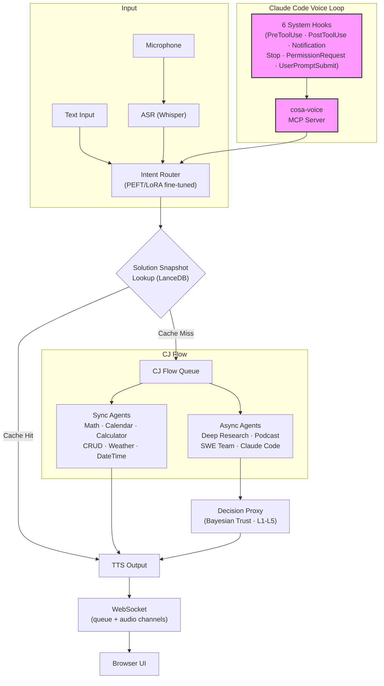

<p align="center">
  
</p>

# Lupin AF

*Named after Arsène Lupin, the gentleman thief. The **AF** is **Agent Factory** -- and, yes, the other thing too.*

> **Lupin AF (Agent Factory) is a voice-driven, human-in-the-loop harness that wraps Claude Code so a person who can't type can still drive an agentic coding session as a first-class UX citizen -- not just ride along as a passenger. And that's cool AF.**
>
> -- R.P. Ruiz, *[Lupin AF: How I Turned Claude Code Into an Agent Factory That Proves Itself](https://medium.com/@ricardo.felipe.ruiz/lupin-af-how-i-turned-claude-code-into-an-agent-factory-that-proves-itself-fc6f09bafadd)*

**A voice-first AI agent platform that closes the voice loop from browser UI through agent execution into developer tooling and back -- with Bayesian trust learning, fine-tuned intent routing, and solution caching built in.**

`FastAPI` | `Voice I/O` | `PEFT/LoRA` | `PostgreSQL + pgvector` | `Claude Agent SDK` | `Bayesian Trust` | `MCP Protocol`

Current version: **v0.2.0** (dev) | License: [Apache 2.0](LICENSE)

---

## What's New in v0.2.0 (dev) — the demo that had to survive a real room

v0.2.0 (August 2026, in progress on `wip-v0.2.0-2026.08.03-present-and-demo`) pointed the whole platform at one question: **can you hand Lupin a vague spoken request and get a finished artifact back, live, in front of people?**

Rehearsal answered "not yet" repeatedly, and that was the value. Nearly every item below was found by *driving the path*, not by reading the code.

- **The vague-request demo path, driven end to end.** Say "make me a podcast about that thing I was researching" and the Runtime Argument Expeditor notices what you didn't say and asks by voice. Document disambiguation now fires on the **first** turn when two documents match, rather than after a wasted round trip. The fuzzy matcher got a shared keyword pre-filter and a hard cap; the search-paths key was emptied after `/src` was found to be drowning the matcher with 6,670 candidates before it ever read the description.
- **Human approval gates that fail open, and say so.** Podcast and presentation gates now wait 600 seconds and then resolve to their default, with the prompt disclosing up front that silence continues. Proven live on `:8000` in both directions — human-answered and silent-timeout — with a harness that refuses to fire into a monopolizer-locked server and reports a job's real state on timeout instead of a bare "timed out".
- **Listen where you are.** A floating in-tab podcast overlay ("Play Here") plays a finished episode without leaving presentation mode, with real audio playback asserted under a genuine click gesture rather than mere element presence.
- **Presentation slide-count control.** An author-set slide count now overrides the duration formula; large decks are chunked up front behind a pinned progress bubble. A truncation detector was found **failing open** — an unknown `stop_reason` was being read as "completed", so a clipped deck reported success.
- **Cross-session message compression (arm 4).** The fleet's own DM traffic became the subject: a two-arm verbosity pilot (blind vs. rejecting at 150 words), a quality judge, and then a **literal freeze protocol** — extract, placehold, validate, restore — so a lossy rewrite can never corrupt a line number or a commit sha. 494 tests, identity round-trip byte-exact on all 2,951 real messages, and every guard proven by reverting it and watching the suite go red. The plan's original placeholder format was measured and rejected: it would have *added* 36,921 tokens before compressing a word.
- **Root causes that were not where anyone looked.** An empty podcast script traced to a curly brace in the model's closing remarks. A demo-line crash traced to that same morning's label fix. Spanish prosody was **refuted** as marker loss — it was a measurement bug. A "safety net that had never run" and a "bug that was never in the code" both got written up, because a wrong premise costs more than a wrong fix.
- **Ungated tests, found and closed.** 24 disambiguation tests were guarded by nobody. Three permanently-red tests were closed along with a catalogue that had been teaching the wrong cause. An unrestored `importlib.reload` was contained after it 500'd tests roughly 150 files later.
- **Fleet housekeeping.** 33 stray heartbeat holds were swept — and the rule against them was already written; the arbiter was fixed so it can see the hold it is poking through; a DM pilot that looked dead turned out to have an expired schedule.

---

## What's New in v0.1.9 — off LanceDB, onto the cloud, and instruments you can believe

v0.1.9 (June–August 2026) replaced the vector store under the whole platform, moved Lupin onto a real GCP deployment, and spent a lot of its effort on a less glamorous question: **how do you know a green test is telling the truth?**

- **LanceDB → PostgreSQL + pgvector, live.** The vector store was swapped out in four lanes — ORM models + Alembic migration, eight per-table repositories behind a runtime backend flag, consumer routing, then the backfill. Cutover ran 2026-07-07: ~202,000 vectors backfilled, dual-engine equivalence proven against the legacy call sites, and exact scan chosen over HNSW once the keystone table turned out to be 97.2% duplicate vectors. `vector store backend = postgres` is live on both servers with a one-flag rollback still in place. Beforehand, the 90.46 GB LanceDB table with the broken version chain was rebuilt to 1.07 GB — ~89 GB reclaimed, all 176,877 rows preserved.
- **GCP deployment went from "validated" to operator-usable.** The CPU-VM app-restore arc completed and was verified end to end (an MTU 1500→1460 mismatch was the last blocker); the GPU model server was costed and split onto Cloud Run; the VM got an IAP browser tunnel, a live fleet arbiter, repo-sync tooling, its own pgvector bring-up, and a written bring-up runbook. A 38-hour `/embeddings/generate` outage was closed by separating one key file that had been serving two consumers with incompatible authorities — a defect that was invisible on the dev box precisely because dev's two values coincided by accident.
- **Fleet liveness, hardened by measurement rather than by guessing.** A 3,000-notification flood, a tmux fleet-killer, a Claude Code Stop-phase wedge (a fire-and-forget `notify()` that hung a turn for 54 minutes), arbiter double-delivery, DM double-stamping, ping storms, phantom blocks, and advisory loop-fire were each root-caused and fixed. The heartbeat-hold janitor's sweep reach went from 4 holds to 44 once it was pointed at the right root.
- **The unified task store grew verbs and guards.** `task_edit` and `task_reassign` shipped; a closed row can now carry a post-terminal addendum so a gate verdict written after a worker self-closes has somewhere to go; rows can be *parked* with a self-expiring chase so the owed-work count stops being fiction; and a bare unscoped board query now hard-fails with an educational error instead of dragging the whole fleet's history back.
- **The TypeScript multiplexer reached parity and shipped.** An adversarial gap matrix, a layout-parity oracle, and focus-bar parity work closed the distance to the legacy notifications UI — 724 TypeScript test cases across 114 files, still behind a hard 100% c8 gate on lines, branches, and functions.
- **Instrument rigor became a first-class discipline.** A hash-chained, append-only tier-run attestation ledger now answers "did this tier actually run?"; the first execution of 8,799 previously-ungated CoSA tests found 4 real failures behind two years of assumed health; a bridge-contact guard and an import-discipline detector caught guards that fired without saying what to fix. The running rule this milestone earned: **a null is not evidence until the instrument is proven, and a green tier cannot vouch for an ungated twin.**
- **Model and data plumbing.** Mistral Small 3.2 24B stood up on GPU1 (vLLM pinned at 0.16.0 — 0.26.0 is CUDA-13-only and this driver can't run it); `DEEPILY_DATA_DIR` moved 449 runtime files out of the repo and out of `git clean -xdf`'s reach; and an embedding-regeneration pipeline was built for all 578,364 logged texts with an adaptive GPU batch budget — gated, with zero live rows written.
- **The test suite roughly tripled** — 12,436 unit tests (from 3,549), 432 integration, 678 Playwright E2E, 724 TypeScript.

---

## What's New in v0.1.8 — the self-managing fleet, ready for the cloud

v0.1.8 turns the multi-session voice cockpit into a **self-coordinating engineering fleet** and prepares Lupin for GCP deployment:

- **Unified task-store + fleet liveness** — a single durable task store (`task_create` / `task_query` / `task_transition`) is now the one source of truth for owed work across every session, read by three consumers (the Stop-hook self-poke, the `:8001` fleet arbiter, and a human UI card). Sessions declare honored heartbeat *holds* so a parked worker is never falsely re-poked; the store-only cutover retired the legacy transcript mirror. Full design: `src/docs/fleet-liveness-and-task-store-architecture.md`.
- **Manager / worker fleet lifecycle** — managers spawn worker crews into isolated git worktrees, drive a review queue (fresh-critical, reproduce-don't-trust), merge reviewer-approved work held on the branch, and reap workers at steady state with continuity-preserving mementos and re-spin.
- **Notification-native AI↔AI messaging** — peer sessions now DM each other over `dm_send` with the body delivered inline (~18× cheaper than the retired commons-DM claim-check path), a major step in the cosa-voice token-reduction endgame.
- **JS→TS multiplexer migration** — the notifications client is being ported to a typed, esbuild-bundled multiplexer behind a hard 100% c8 gate: the audio cluster (`SequentialAudioManager`, `TtsAudioCache`, `JobCompletionCache`), `lupin-nav`, and `websocket-diagnostic` ported via a reusable standalone-entry pattern; reconnect-parity and an auth-handshake-timeout watchdog brought to legacy parity.
- **Bounded-CC agent migrations** — Podcast, Presentation, and Deep Research generators migrated from the firewalled Anthropic SDK to in-process bounded Claude Code (`sdk_query`), shifting metered per-token spend onto already-paid Max-plan fixed cost.
- **Alembic migration integrity** — a true baseline migration (empty-DB `upgrade head` works without a stamp), all-column NULL/NOT-NULL ORM-drift reconciliation, and hermetic create_all→upgrade-head idempotency regression tests guarding the migration merge gate.
- **GCP cloud-test deployment validated** — model server, OAuth-backed bounded CC, and a 17-table Cloud-SQL round-trip proven end-to-end via IAP tunnel; runbooks under `src/rnd/v0.1.8/2026.05.30-gcp-deployment/`.

---

## What's New in v0.1.7 — the multi-session voice cockpit

Lupin's voice loop grew from a single session into a **chorus of named AI collaborators working side by side**:

- **Per-session voice personas + chorus mode** — every Claude Code session is allocated a distinct named voice (Mr. Radio, Rio, Tiberius, María, Krishna...). In chorus mode the voice *is* the disambiguator: you hear which session is speaking. Personas survive `/clear`, `/compact`, and resume; an overflow pool covers more sessions than named slots; the new `request_persona` MCP tool lets a session reclaim its identity.
- **Inter-session commons** — concurrent sessions now talk to each other: a shared blackboard (`commons_post` / `commons_read` / `commons_who`), direct messages (`commons_send_to`), and cross-session questions (`commons_ask_async` / `commons_ask_sync`) — all surfaced in a live Recent Activity stream and broadcast panel in the browser.
- **Manager-spawned headless reviewers** — one session can spin up N headless Claude Code reviewer sessions on demand (`spawn_sessions` / `dismiss_sessions` / `list_spawned_sessions`), automating the cascaded plan-review workflow with idle-TTL reaping and manifest lineage.
- **Speakerphone mode (solo / chorus)** — the renamed, hardened successor to conversation mode, driven by a per-turn hook rider that adapts TTS brevity and interactive-tool routing to the live session state.
- **Notifications UI rebuilt in TypeScript** — the notifications surface was re-implemented as a typed, esbuild-bundled multiplexer behind a hard **100% c8 coverage gate** (lines + branches + functions), with a dedicated Jobs pane.
- **Multi-repo document viewer** — the in-browser doc viewer now serves whitelisted files from N registered repos via path-prefix routing, JWT-gated, with a universal secrets blocklist and inline source-code + image rendering.
- **CJ Flow async multi-lane** — long-running agentic jobs now run in a dedicated `ThreadPoolExecutor` pool with a ghost-job sweeper, a centralized `ApiResourceManager` for per-provider rate limiting, and a `GET /api/queue/pool-status` observability endpoint — fast-lane sync agents are never blocked.
- **Bounded Claude Code = zero per-token cost** — empirically confirmed (2026-05-12): bounded `ClaudeCodeJob` work runs on Max-plan OAuth at zero metered cost. BFE and TFE migrated, with a documented cost model for choosing bounded-CC vs. firewalled SDK.
- **Heartbeat-poker** — a generic liveness / keep-alive abstraction for long-running jobs, riding the commons for cross-session check-ins.
- **100% coverage mandate, Lupin-wide** — line + branch + function coverage is now a hard merge gate across the entire Lupin codebase.

Lupin is now a **multi-user platform preparing for GCP deployment**.

---

## Human in the loop, reimagined

Every agentic AI platform needs human oversight. Most implement it as a modal dialog: click approve, type feedback, wait. Lupin takes a fundamentally different approach -- **voice-first human-in-the-loop**.

Agents speak to you. You speak back. A Bayesian trust engine learns your preferences over time, escalating only when confidence is low and auto-approving when it has earned your trust. The result: human oversight that works **from across the room**, while you're multitasking, or even from your phone -- no screen required.

This is the missing piece in agentic AI: not just making agents smarter, but making **human oversight effortless**.

---

## The dream

Talk to the computer, and it tells you, or does, something useful.

### The problem

Currently, AI agents and chatbots are [slow and expensive](https://www.linkedin.com/pulse/langchains-dataframe-agent-why-you-so-slow-r-p-ruiz).
They [make silly mistakes](https://www.linkedin.com/pulse/meet-my-idiot-savant-intern-chatgpts-advanced-data-analysis-ruiz/).
They're forgetful. And they work too hard reinventing the wheel.

### What most people probably don't realize

Even the simplest vox-in and vox-out UX -- especially when coupled with agentic behaviors -- is **_hard_**. It's asynchronous, and usually frustratingly slow. It's a new way of interacting with computers, which requires a global rethinking of how different the UI control and display modalities interact.

### Lupin's approach

Fine-tune small models for cheap, fast intent routing -- not prompt engineering, actual PEFT/LoRA fine-tuning. Escalate to frontier models only when complexity demands it. Cache solutions via vector search so agents never solve the same problem twice. Layer Bayesian trust learning so the system earns autonomy over time, minimizing human interruptions without sacrificing oversight. And voice-enable *everything* -- from the browser UI, through agent execution, into [Claude Code developer sessions](https://www.linkedin.com/pulse/slow-expensive-erratic-problem-whats-solution-r-p-ruiz/) via 6 system hooks and an MCP voice server, and back again.

---

## Architecture



Voice flows end-to-end: browser microphone through agent execution into Claude Code sessions and back via dual-channel WebSocket audio streaming.

---

## Agent ecosystem

**21 specialized agents** -- from sub-second sync responders to long-running autonomous research pipelines -- all routed through fine-tuned small models and unified by a single voice-first queue system.

### Synchronous agents (respond in <1s via PEFT routing)

| Agent | Purpose |
|-------|---------|
| MathAgent | Symbolic math via LLM |
| CalendarAgent | Date-aware scheduling |
| DateTimeAgent | Time queries and conversions |
| WeatherAgent | Weather lookups |
| TodoListAgent | Persistent task management |
| CalculatorAgent | Natural language calculator (508 LoRA templates), MathAgent fallback |
| CRUDAgent | Voice-controlled DataFrame create/read/update/delete |
| ReceptionistAgent | Top-level intent router |
| RuntimeArgumentExpeditor | LLM-powered gap analysis -- asks for missing arguments via voice |

### Long-running agents (async via CJ Flow queue)

| Agent | Purpose |
|-------|---------|
| DeepResearchAgent | Background research with automatic report generation |
| PodcastGeneratorAgent | Convert documents to audio podcast format |
| ResearchToPodcastAgent | Chained research-to-podcast pipeline |
| PresentationGeneratorAgent | Multi-phase pipeline: outline → elaborate → render → deliver (Phases 1-8) |
| ResearchToPresentationAgent | Chained research-to-presentation pipeline |
| ClaudeCodeAgent | Claude Agent SDK tasks (BOUNDED or INTERACTIVE mode) |
| SWETeamAgent | 4-phase dev team: Lead, Coder, Tester, Trust Proxy |

### Auto-recovery agents (self-healing via Claude Agent SDK + worktree isolation)

| Agent | Purpose |
|-------|---------|
| BugFixExpediter (BFE) | Dead-job auto-recovery: diagnose → propose → fix → git → retry |
| TestFixExpediter (TFE) | Test-failure auto-fix: cluster → diagnose → propose → fix → git → rerun |
| TestSuiteJob | Scheduled test-suite runs via CJ Flow with watchdog-triggered TFE handoff |

### Infrastructure agents

| Agent | Purpose |
|-------|---------|
| NotificationProxyAgent | Phi-4 fuzzy script matching for automated interactive testing |
| DecisionProxyAgent | Universal Prediction Engine (7 slices) · Bayesian Beta-Bernoulli trust · Thompson Sampling · Conformal prediction · L1-L5 escalation · Circuit breaker |
| HeartbeatArbiter | Fleet liveness detectors — session staleness, tap-ACK, whole-fleet stall — with per-family advisory cooldown |
| DMQualityJudge | Scores peer-to-peer session messages to drive down cross-session token burn |

---

## Key capabilities

### Voice-first everywhere -- browser to agents to developer tooling

No other platform closes the voice loop this completely:

- **Browser to agents**: Dual-channel WebSocket architecture (queue events + audio streaming) with ASR (Whisper) to TTS pipeline, end to end
- **Agents to developer tools**: 6 Claude Code system hooks (`PreToolUse`, `PostToolUse`, `Notification`, `Stop`, `PermissionRequest`, `UserPromptSubmit`) bridge voice into every coding session
- **Developer tools back to browser**: cosa-voice MCP server provides 5 voice tools (`notify`, `converse`, `ask_yes_no`, `ask_multiple_choice`, `ask_open_ended_batch`)
- **Session continuity**: Stable session IDs survive context clears via write-once atomic lockfile -- no identity drift
- **Stop hook gisting**: Ultra-short TTS summaries of completed work via frontier model distillation
- **Voice injection**: tmux-based voice input into idle Claude Code sessions -- speak and it types

### Intent routing via fine-tuned small models -- not prompt engineering

While most platforms route via system prompts or keyword matching, Lupin fine-tunes:

- 39,871 training examples across 35 command intents
- PEFT/LoRA on Phi-4, Qwen, and Llama -- local GPU inference, zero API calls for routing
- Sub-second classification with GSM8K-validated post-quantization math reasoning
- Result: routing that is faster, cheaper, and more reliable than prompt-based alternatives

### Solution snapshot memory -- agents that learn from their own work

When an agent solves a problem, the solution is embedded and cached in the vector store. Next time the same (or similar) question arrives, the answer comes from vector search -- not from re-running the agent.

**As of v0.1.9 the backend is PostgreSQL + pgvector** (cutover 2026-07-07; ~202,000 vectors backfilled, dual-engine equivalence proven, exact scan chosen over HNSW). The LanceDB path remains behind a one-flag rollback. The speedup numbers below are the original file-based → LanceDB benchmark that motivated a real vector store in the first place:

| Operation | File-Based | Vector store | Speedup |
|-----------|------------|--------------|---------|
| Search (exact) | 96 ms | 0.1 ms | **960x** |
| Add snapshot | 827 ms | 15 ms | **55x** |
| Search (fuzzy) | 120 ms | 0.3 ms | **400x** |

Local GPU embeddings (CodeRankEmbed + nomic-embed-text-v1.5) vs OpenAI API:

| Operation | Content | Local GPU | OpenAI API | Speedup |
|-----------|---------|-----------|------------|---------|
| Single embed | prose | 164 ms | 1,146 ms | **7x** |
| Single embed | code | 70 ms | 1,211 ms | **17x** |
| Batch (3) | prose | 8 ms | 2,989 ms | **374x** |
| Batch (3) | code | 8 ms | 3,183 ms | **398x** |

### Trust-aware decision proxy -- Bayesian autonomy that earns your confidence

The first decision proxy for AI agents with academic-grade statistical rigor:

- **Universal Prediction Engine**: 7 prediction slices with 87 unit tests and 21 end-to-end tests
- **Bayesian Beta-Bernoulli trust model**: Per-agent trust learning with conjugate prior updates
- **Thompson Sampling**: Exploration-exploitation balance for when to auto-approve vs. escalate
- **Conformal prediction**: Calibrated confidence intervals -- not guesses, statistical guarantees
- **LanceDB-backed preference embeddings**: Semantic similarity with response_type filtering
- **L1-L5 trust escalation**: Five trust levels from "always ask" to "full autonomy" with circuit breaker pattern
- **Morning coffee batch review**: Non-urgent decisions queued for human review at your convenience
- **Ratification API**: Post-hoc approval with trust feedback loop

### Battle-tested -- 24,500+ automated tests

| Suite | Count | Coverage |
|-------|-------|----------|
| Unit tests (Python) | 20,600 | Core logic, trust engine, hooks, credentials, prediction engine, agentic orchestrators, task store, arbiter -- 11,571 in the app tree, 9,029 in the in-tree CoSA framework |
| Unit tests (TypeScript) | 2,307 | Multiplexer audio, transport, stores, render — behind a hard 100% c8 gate |
| E2E UI (Playwright) | 678 | Full browser-driven flows including 12-page visual regression |
| Smoke tests | 437 | Fast sanity sweeps across the app and the Lupin smoke suite |
| Integration tests | 432 | End-to-end API workflows against dedicated dual-container test server |
| Parity oracle, cutover E2E, and other suites | 50 | Multiplexer-vs-legacy parity, store-owed cutover, targeted end-to-end checks |
| WebSocket tests | 43 | Connection, auth, event routing, session management |
| **Total authored test cases** | **24,547** | 22,240 Python + 2,307 TypeScript |
| Interactive proxy scenarios | 12 | Calculator, CRUD, and Expediter agents via auto-proxy (script-driven, not counted above) |

Counts are of authored test functions (`def test_*` / `it(` / `test(`) across `src/tests/` and `src/cosa/tests/`, as of 2026-08-07. A repo-wide grep returns a slightly larger number; the extra matches are self-test functions embedded in production modules, which are not part of any suite. **The suite figure is the one to quote.**

Built and maintained by a single engineer. Every PR must pass all tiers before merge, at 100% line, branch, and function coverage. A hash-chained attestation ledger records that each tier actually ran -- a green report that cannot prove it executed is not a green report.

**The rule behind all of it: the human is the designer and the user -- never the tester.** "Please try it and tell me if it works" is a prohibited sentence. That is not a preference. For a user who cannot type, manual QA is not an inconvenient fallback -- it is a fallback that does not exist. So the pyramid had to go all the way up. The test suite is an accessibility affordance: it is what lets one person who cannot manually click through a UI still know the software works.

---

## Quick start

```bash
# Prerequisites: Python 3.11+, GPU recommended, PostgreSQL
export LUPIN_ROOT=/path/to/lupin

# Configure credentials
src/scripts/lupin_config.py init

# Start the server
src/scripts/run-fastapi-lupin.sh          # FastAPI on port 7999
src/scripts/run-lupin-gui.sh              # Browser GUI client

# Run tests
pytest src/tests/unit/                     # 12,436 unit tests
src/scripts/run-websocket-smoke-tests.sh   # 50 WebSocket tests
src/tests/run-integration-tests.sh --bg -v # Integration gate (dual-container, :8000)
src/scripts/run-e2e-ui-tests.sh --bg -v    # 678 Playwright tests incl. visual regression

# Install cosa-voice MCP server (for Claude Code voice I/O)
claude mcp add cosa-voice -- python ${LUPIN_ROOT}/src/lupin_mcp/cosa_voice_mcp.py
```

**Config**: `src/conf/lupin-app.ini` | **Docker**: `docker build -f docker/lupin/Dockerfile .` | **GSM8K**: `src/scripts/run-gsm8k.sh --help`

---

## Documentation

### For developers

- [REST API Reference](src/docs/rest-api-reference.md) — all HTTP and WebSocket endpoints
- [WebSocket Architecture](src/docs/websocket-architecture.md) — dual-session design and event system
- [Notification API](src/docs/notification-api.md) — comprehensive notification reference with Mermaid diagrams
- [CJ Flow Packaging Guide](src/rnd/v0.1.4/2026.02.12-cj-flow-bounded-job-packaging-guide.md) — how to add new QueueableJob types
- [cosa-voice MCP Server](src/lupin_mcp/README.md) — MCP server setup and tool reference
- [Agentic Voice Workflow](src/workflow/agentic-voice-workflow.md) — building new agents with voice I/O
- [Fleet Liveness & Task-Store Architecture](src/docs/fleet-liveness-and-task-store-architecture.md) — one store, three readers; heartbeat holds; the arbiter and how to bounce it
- [Cost Model: Bounded CC vs Firewalled SDK](src/docs/cost-model-bounded-cc-vs-firewalled-sdk.md) — which LLM path an agent lands on, and why

### Agentic jobs, recovery & test scheduling

Bug Fix Expediter (dead-job auto-recovery), Test Fix Expediter (test-failure auto-fix), and the TestSuiteJob scheduler share a common foundation in `src/cosa/agents/shared/`. See the **[Agents subsystem documentation](src/docs/agents/README.md)** for the full subsystem:

- [Bug Fix Expediter Guide](src/docs/agents/bug-fix-expediter-guide.md) — diagnose → propose → fix → git → retry pipeline
- [Test Fix Expediter Guide](src/docs/agents/test-fix-expediter-guide.md) — cluster → diagnose → propose → fix → git → rerun pipeline
- [Test-Suite Scheduling Guide](src/docs/agents/test-suite-scheduling-guide.md) — TestSuiteJob + `/schedule-tests` skill
- [Shared Fix Primitives Reference](src/docs/agents/shared-fix-primitives-reference.md) — PlanWriter, GitStrategist, FixExecutor

### For operators

- [Decision Proxy Admin Guide](src/docs/proxy-admin-guide.md) — Trust Dashboard and ratification how-to
- [Automated Interactive Testing](src/docs/automated-interactive-testing.md) — proxy auto-answer testing guide
- [WebSocket Troubleshooting](src/docs/websocket-troubleshooting.md) — common issues and debugging procedures

### R&D archive

Over 1,000 dated planning and research documents in [`src/rnd/`](src/rnd/README.md).

**Codebase metrics**: [Lupin parent vs CoSA comparison](src/rnd/v0.1.6/2026.04.12-codebase-analysis-lupin-vs-cosa.md) — 2026-04-12 snapshot of LoC distribution with mermaid diagram, 60/40 Python split, docstring-ratio observations, and operational implications of the CoSA-never-commit rule.

---

## Version history

**v0.2.0** (August 2026, in progress) — The demo that had to survive a real room. A vague spoken request ("make me a podcast about that thing I was researching") driven end to end through the Runtime Argument Expeditor, with first-turn document disambiguation, a shared keyword pre-filter and hard cap on the fuzzy matcher, and the search-paths key emptied after `/src` was found flooding the matcher with 6,670 candidates. Human approval gates for podcast and presentation now **fail open** — 600-second wait, timeout resolves the default, and the prompt discloses that silence continues — proven live on `:8000` in both the human-answered and silent-timeout directions. A floating in-tab podcast overlay ("Play Here") plays a finished episode without leaving presentation mode, with real playback asserted under a genuine click gesture. Presentation gained author-set slide-count override, up-front chunking of large decks behind a pinned progress bubble, and a fix for a truncation detector that was failing open on an unknown `stop_reason`. Cross-session DM verbosity became its own experiment: a two-arm pilot, a quality judge, and a **literal freeze protocol** (extract → placehold → validate → restore) with 494 tests, byte-exact identity round-trip across all 2,951 real messages, and every guard falsified by revert. Root causes that were not where anyone looked: an empty podcast script from a curly brace in the model's closing remarks; a demo crash caused by that morning's own label fix; Spanish prosody **refuted** as marker loss when it was a measurement bug. 24 ungated disambiguation tests found and closed; 33 stray heartbeat holds swept. 24,547 tests.

**v0.1.9** (June–August 2026) — LanceDB → PostgreSQL + pgvector cutover across four lanes (models/Alembic, eight per-table repositories behind a runtime backend flag, consumer routing, ~202k-vector backfill), with dual-engine equivalence proven and exact scan chosen over HNSW; a 90.46 GB → 1.07 GB LanceDB rebuild reclaiming ~89 GB beforehand. GCP deployment made operator-usable: CPU-VM app restore verified end to end, GPU model server split onto Cloud Run, IAP browser tunnel, live fleet arbiter on the VM, bring-up runbook, and a 38-hour embeddings outage closed by decoupling one key file serving two incompatible authorities. Fleet liveness hardened against a notification flood, a tmux fleet-killer, a Stop-phase turn wedge, and a family of arbiter false positives. Task store gained `task_edit`, `task_reassign`, post-terminal amendment of closed rows, self-expiring row parking, and an unscoped-query guard. TypeScript multiplexer reached legacy parity (724 TS test cases, 100% c8). Instrument rigor formalized: hash-chained tier-run attestation ledger, first execution of 8,799 previously-ungated CoSA tests, bridge-contact and import-discipline guards. Mistral Small 3.2 24B stood up on GPU1; `DEEPILY_DATA_DIR` moved runtime state out of the repo; embedding-regeneration pipeline built for all 578,364 logged texts. 24,042 tests.

**v0.1.8** (May–June 2026) — Self-managing fleet, ready for the cloud. Unified task store as the single source of truth for owed work, read by the Stop-hook self-poke, the `:8001` fleet arbiter, and a human UI card, with honored heartbeat holds and the store-only cutover retiring the legacy transcript mirror. Manager/worker fleet lifecycle: worktree-isolated crews, a review queue, merge-on-approval, and continuity-preserving mementos. Notification-native AI↔AI DMs with inline bodies (~18× cheaper than the retired claim-check path). JS→TS multiplexer migration behind a hard 100% c8 gate. Podcast, Presentation, and Deep Research migrated from the firewalled Anthropic SDK to in-process bounded Claude Code. Alembic migration integrity: true baseline migration, ORM-drift reconciliation, hermetic idempotency regression tests. GCP cloud-test deployment validated end to end via IAP tunnel.

**v0.1.7** (April–May 2026) — Multi-session voice cockpit. Per-session voice personas with chorus-mode disambiguation, overflow pool, `/clear`+`/compact` preservation, and `request_persona` MCP tool. Inter-session commons: cross-session blackboard, DMs, and async/sync questions surfaced in a live Recent Activity stream + broadcast panel. Manager-spawned headless reviewer sessions (`spawn_sessions` / `dismiss_sessions` / `list_spawned_sessions`) automating cascaded plan-review. Speakerphone mode (solo/chorus) replacing conversation mode with a per-turn hook rider. Notifications UI rebuilt as a TypeScript multiplexer behind a 100% c8 coverage gate. Multi-repo doc viewer with path-prefix scope routing, JWT gate, secrets blocklist, and source-code + image rendering. CJ Flow async multi-lane: agentic ThreadPoolExecutor pool, ghost-job sweeper, ApiResourceManager rate limiting, and `pool-status` endpoint. Bounded-CC zero-per-token billing empirically confirmed; BFE/TFE migrated. Heartbeat-poker liveness abstraction. WS reconnect circuit-breaker. 100% line+branch+function coverage adopted as a Lupin-wide merge gate.

**v0.1.6** (April 2026) — Presentation Generator agent (multi-phase outline → elaborate → render → deliver, 8 phases). CJ Flow persistence: PostgreSQL write-through for todo/running/done queues with startup recovery, timed execution + monopolize + pause flags, and Job History UI (5th collapsible section with time-window filter). Auto-recovery agent family: Bug Fix Expediter and Test Fix Expediter with Claude Agent SDK worktree isolation and Resume-with-overrides UI. Playwright E2E suite expanded from ~100 to 357 tests across 8 phases, including 12-page visual regression with deterministic font rendering. Dual-container test architecture (`lupin-rest-test` on `:8000`). `set_session_topic()` MCP tool for stop-hook context. Graceful STT degradation (server starts without GPU). Claude Agent SDK config migration to INI keys. 3,549+ unit tests.

**v0.1.5** (March 2026) — Voice-first human-in-the-loop. Full voice loop inside Claude Code via 6 system hooks + cosa-voice MCP. Trust-aware Decision Proxy with Universal Prediction Engine, Bayesian Beta-Bernoulli trust, Thompson Sampling, and conformal prediction. Credential consolidation. Stable session identity architecture. 2,075+ tests.

**v0.1.4** — cosa-voice MCP server, SWE Team Agent, Calculator Agent, CRUD Agent, Notification Proxy, 881 to 1170 unit tests, 39,871 training examples, local GPU embeddings

**v0.1.3** — CJ Flow agentic job system, Deep Research + Podcast agents, Claude Agent SDK integration, JWT WebSocket auth, 100% test coverage

[Full changelog](CHANGELOG.md)

---

## Project status

Lupin is an active research platform at v0.2.0 (dev). Developed by a solo engineer, it combines voice-first agent orchestration, PEFT fine-tuning, and Bayesian decision theory into a production-grade stack backed by 24,547 automated tests across seven tiers (Python unit, TypeScript unit, WebSocket, smoke, integration, Playwright E2E, parity oracle), full CI discipline, and a FastAPI + PostgreSQL + pgvector architecture. Through a series of ambitious refactorings made possible by Claude Code and the [Planning is Prompting](https://github.com/deepily/planning-is-prompting) methodology, Lupin has evolved from single-user PoC sketches into a multi-user platform running on GCP.

---

## The wall of technologies

Fifteen months, two repositories, 1,199 research and design documents. This is not a
capability boast — it's a map of the talks that aren't being given. **Every item on it is
something that had to be learned, chosen, measured, or thrown away.**

Semantic Caching · Mimetic Drift · PEFT/LoRA fine-tuning · Synthetic Training Data
Generation · Phi-4 · Qwen · Llama · Ministral · Human in the Loop · vLLM ·
GSM8K-validated quantization · Whisper ASR · streaming TTS · dual-channel WebSockets ·
server-sent events (SSE) · FastAPI · PostgreSQL · pgvector · LanceDB · CodeRankEmbed ·
nomic-embed · Bayesian Beta-Bernoulli trust · Thompson Sampling · conformal prediction ·
circuit breakers · Claude Agent SDK · MCP servers · six Claude Code system hooks · tmux
orchestration · git worktree isolation · Playwright visual regression · Docker · Cloud Run ·
Cloud SQL · GCS · Terraform · GitHub Actions · Firebase push · Marp rendering ·
hash-chained attestation ledgers · Alembic migrations · JWT/OAuth · Phi-4 fuzzy script
matching · **the automate-everything test pyramid**

### Breadth inventory

Each band below is a talk that could exist.

**Voice I/O foundations** — WebSocket TTS streaming · progressive TTS streaming · TTS mode
switching · sequential audio chunk playback · audio caching · ASR via Whisper ·
dual-channel WebSocket (queue events + audio) · voice injection into idle developer
sessions via tmux

**Notification and question architecture** — Three-level question representation ·
server-sent events · sender-aware notification routing · notification authentication ·
progressive-disclosure job cards · notification API with markdown and confidence rendering ·
the interrogation framework (yes/no/neither, open-ended, multiple choice inclusive and
exclusive, batched)

**Intent routing with small models** — PEFT / LoRA fine-tuning on Phi-4, Qwen, and Llama ·
39,871 training examples across 35 command intents · sub-second local-GPU classification
with zero API calls · GSM8K-validated post-quantization math reasoning · vLLM latency
analysis · dual-quant multi-LLM trainer · three-model comparative studies ·
resume-from-merged and OOM allocator work

**Memory and retrieval** — Solution snapshots, agents that cache their own solved problems ·
file-based → LanceDB → PostgreSQL + pgvector migration (~202,000 vectors, dual-engine
equivalence proven) · local GPU embeddings vs. hosted API (7×–398× measured) ·
CodeRankEmbed and nomic-embed for code vs. prose · exact scan chosen over HNSW, with
receipts

**The agentic job system** — CJ Flow queue · 21 specialized agents · synchronous
sub-second responders (math, calendar, CRUD, calculator, weather, receptionist) ·
long-running async agents (deep research, podcast generation, presentation generation,
chained research-to-artifact pipelines) · the Runtime Argument Expeditor, which notices
what you didn't tell it and asks by voice · scheduled jobs surviving server bounces

**Trust and autonomy** — Bayesian Beta-Bernoulli trust model with conjugate prior updates ·
Thompson Sampling for explore/exploit · conformal prediction for calibrated confidence ·
L1–L5 escalation with circuit breaker · Universal Prediction Engine across seven slices ·
morning-coffee batch review of non-urgent decisions · post-hoc ratification with a trust
feedback loop

**Self-healing** — Bug Fix Expediter (diagnose, propose, fix, commit, retry) · Test Fix
Expediter (cluster, diagnose, fix, rerun) · git worktree isolation per repair ·
watchdog-triggered handoff from a scheduled test run

**The multi-session fleet** — Per-session voice personas · solo and chorus TTS modes ·
inter-session commons · direct messages between sessions · broadcasts · the heartbeat
arbiter and its liveness detectors · the unified task store · focus bar and multiplexer UI ·
memento-and-respin continuity across context clears · manager spawn/harvest autonomy ·
proactive-manager mechanism

**Workflow as infrastructure** ([planning-is-prompting](https://github.com/deepily/planning-is-prompting))
— 53 canonical workflow documents · cascaded plan review and cascaded plan authoring ·
SWE-team spin-up · post-game retrospectives · session start / checkpoint / end rituals ·
history archival with velocity forecasting · bug-fix mode · skills management · the
installation wizard · the KISS brevity mandate

**The automate-everything test pyramid** — 24,547 authored test cases across seven tiers ·
Python unit · TypeScript unit · integration · smoke · end-to-end UI · WebSocket · parity
oracle · 100% line, branch, and function coverage gates · Playwright with 12-page visual
regression · interactive proxy testing driven by a Phi-4 fuzzy script matcher · hash-chained
attestation ledger · neutral-directory execution to defeat false greens · revert-to-verify
discipline (**an assertion isn't a guard until you delete what it guards and watch it go
red**) · self-healing repair agents that fix their own red tests

**Cloud and infrastructure** — GCP migration · Cloud Run · Cloud SQL · GCS-backed storage ·
Docker non-root hardening · CUDA/torch version pinning · GPU model-server split · CI/CD via
GitHub Actions · Firebase push provisioning

---

## License

[Apache 2.0](LICENSE)
