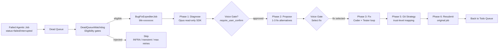

# Bug Fix Expediter (BFE) Guide

> **Audience**: Lupin operators enabling automated dead-job recovery, and developers maintaining or extending BFE
>
> **Scope**: `src/cosa/agents/bug_fix_expediter/`, `src/cosa/rest/dead_queue_watchdog.py`, BFE INI keys
>
> **Last Updated**: 2026-04-10
>
> **See Also**:
> - [Shared Fix Primitives Reference](shared-fix-primitives-reference.md) — `PlanWriter`, `GitStrategist`, `FixExecutor`
> - [Test Fix Expediter Guide](test-fix-expediter-guide.md) — sister agent for test-failure recovery
> - [Decision Proxy Admin Guide](../proxy-admin-guide.md) — trust levels BFE uses for Phase 5 git strategy
> - R&D: [BFE plan index](../../rnd/v0.1.6/2026.03.27-bug-fix-expediter/00-index.md)

---

## Table of Contents

1. [What BFE Does](#1-what-bfe-does)
2. [Architecture](#2-architecture)
3. [Six-Phase Pipeline](#3-six-phase-pipeline)
4. [INI Reference](#4-ini-reference)
5. [Trust-to-Git Mapping](#5-trust-to-git-mapping)
6. [How to Enable Auto-Fix](#6-how-to-enable-auto-fix)
7. [Observability](#7-observability)
8. [Troubleshooting](#8-troubleshooting)
9. [Code Map](#9-code-map)

---

## 1. What BFE Does

The **Bug Fix Expediter** is an agentic job that recovers from dead (failed or
interrupted) jobs in CJ Flow. When an agentic job — deep research, presentation
generator, podcast generator, etc. — crashes with an error and lands in the dead
queue, BFE picks it up, diagnoses the root cause, proposes fixes, applies the
best one, and (if configured) retries the original job.

**When BFE fires**: A job completes with `status="failed"` or `status="interrupted"`
and lands in the `jobs_dead_queue`. The `DeadQueueWatchdog` (running inside the
`RunningFifoQueue` consumer thread) evaluates the dead job against its eligibility
gates and, if everything checks out, dispatches a `BugFixExpediterJob` to the
`jobs_todo_queue`.

**What BFE produces**:

1. A **Markdown plan document** under `io/swe-team/plans/{user_email}/` capturing
   the diagnosis, proposed fixes, and implementation log.
2. **Code changes** on disk (applied by a Coder agent via the Claude Agent SDK).
3. A **git commit** (and, at higher trust levels, a branch + PR via `gh`).
4. **Voice notifications** to the user through cosa-voice MCP at each phase.
5. **Optionally**: a resubmission of the original failed job (Phase 6 auto-retry).

**What BFE does NOT do**: modify test files (fixes land only in production code),
run destructive commands (blocked by `SafetyGuard`), commit unrelated cleanup
(prompts enforce minimal-diff discipline), or act on transient errors classified
as infrastructure problems (rate limits, timeouts, OOMs — these skip BFE).

---

## 2. Architecture



The six phases are numbered historically — Phases 0 and 4 don't exist (Phase 0 was
reserved for upfront context gathering which got folded into the Packaging step,
and Phase 4 collapsed into Phase 3 during implementation). The numbering is
preserved because the R&D planning docs reference it.

---

## 3. Six-Phase Pipeline

### Phase 1: Diagnose

**Goal**: identify the root cause of the failure, classify it, and score confidence.

**Agent**: Opus lead (read-only SDK access: `Read`, `Glob`, `Grep`, `Bash`).
Matches the "forensic analyst" role defined in
`src/cosa/agents/bug_fix_expediter/prompts/diagnosis.py`.

**Input**: `DeadJobContext` built by `dead_job_packager.package_dead_job()`, which
queries `job_history` for the failed job and extracts error messages, stack traces,
metadata, the original user question, and timing info.

**Output**: `DiagnosisResult` with:
- `root_cause` — one-paragraph explanation
- `error_category` — `config` | `code_bug` | `dependency` | `timeout` | `resource` | `unknown`
- `confidence` — 0.0 to 1.0
- `evidence` — list of file:line observations
- `affected_components` — list of source files
- `is_transient` — true if the error is retry-eligible without code change (caller skips BFE)

**Iteration**: the Lead agent runs up to `max_diagnosis_iterations` rounds (default 3).
Each round re-prompts with the prior attempt's confidence and any user messages queued
via `orchestrator.queue_user_message()`. Iteration stops early when confidence
≥ `min_diagnosis_confidence` (default 0.7).

**INI tuning**:
- `bug fix expediter lead model` — default `claude-opus-4-6`
- `bug fix expediter max diagnosis iterations` — default 3
- `bug fix expediter min diagnosis confidence` — default 0.7

**Voice gate**: after diagnosis completes, `_voice_gate_diagnosis()` optionally asks
the user to confirm the diagnosis before proceeding to proposal. Gated by
`bug fix expediter require user confirm` (default `true`).

### Phase 2: Propose

**Goal**: generate 1-3 concrete fix alternatives ranked by confidence.

**Agent**: Opus lead (read-only, same model as Phase 1).

**Input**: the `DiagnosisResult` from Phase 1 + the original `DeadJobContext`.

**Output**: `list[ProposedFix]` where each fix has:
- `title` — short commit-message subject
- `description` — 1-2 paragraphs explaining what changes and why
- `fix_type` — `config_change` | `code_patch` | `retry` | `manual`
- `confidence` — 0.0-1.0
- `risk_level` — `low` | `medium` | `high`
- `estimated_effort` — `minutes` | `hours` | `session`
- `changes` — list of `{file, action, description}` dicts

**Plan document**: `PlanWriter.write_plan()` persists the diagnosis + proposed fixes
to `io/swe-team/plans/{user_email}/YYYY.MM.DD-{slug}-plan.md`. The document structure
is described in the [Shared Primitives Reference](shared-fix-primitives-reference.md#3-planwriter--markdown-plan-docs).

**Voice gate**: `_voice_gate_proposal()` presents the fix list to the user via
cosa-voice `present_choices()`. User selects exactly one fix (or rejects all). In
shadow/suggest trust modes the gate is always human-driven; in active mode with
high confidence the `_auto_select_fix()` helper may auto-select.

### Phase 3: Fix

**Goal**: apply the selected fix via a Coder agent, verify it via a Tester agent,
retry with feedback if verification fails.

This is where the **shared `FixExecutor`** takes over (see
[Shared Primitives Reference §5](shared-fix-primitives-reference.md#5-fixexecutor--polymorphic-codertester-loop)).
The BFE orchestrator's `run_fix()` is a thin shim that constructs a `FixExecutor`
with `prompt_builder_key="bfe"` and delegates.

**Agents**:
- **Coder**: Sonnet (`claude-sonnet-4-6`), edit-capable (`Read`, `Edit`, `Bash`).
  Applies the changes described in the selected `ProposedFix`.
- **Tester**: Sonnet, edit + read + bash. Writes targeted tests, runs them via
  `pytest`, reports PASS or FAIL. Independent `pytest` validation via
  `run_pytest()` overrides the tester's self-report when the tester touched a
  test file we can re-run.

**Retry loop**: up to `max_fix_attempts` iterations (default 2). On failure, the
orchestrator builds a redelegation prompt including the prior coder output and
tester feedback, then re-delegates. On max iterations, escalates via
`cosa_interface.present_choices()` asking "Accept without tests" or "Reject fix."

**Safety**: `SafetyGuard` (from `src/cosa/agents/swe_team/safety_limits.py`) enforces:
- `max_file_changes_per_fix` — default 20 file modifications per attempt
- `wall_clock_timeout_secs` — default 600 seconds for the whole BFE run
- `max_fix_attempts + 1` failure counter (extra attempt for escalation)

**Output**: `FixResult` with `applied`, `success`, `details`, `retry_eligible` plus
Phase 5 git fields (populated in the next phase).

### Phase 5: Trust Proxy + Git Strategy

**Goal**: commit the fix to git according to the earned trust level for the
Engineering category.

**Source of trust level**: the SWE Team Trust Proxy — same one documented in the
[Decision Proxy Admin Guide](../proxy-admin-guide.md). BFE reads
`proxy.trust_tracker.get_level("engineering")` to decide between `commit_only`
(L1-L2) and `branch_and_pr` (L3+).

**Git ops**: delegated to `shared.GitStrategist.commit_and_pr_single()` (see
[Shared Primitives Reference §4](shared-fix-primitives-reference.md#4-gitstrategist--trust-aware-git-operations)).
BFE's orchestrator builds the commit message and PR body; the strategist
handles the actual git/gh calls.

**Plan update**: `PlanWriter.update_implementation_log()` replaces the Phase 4
placeholder with real coder output + files changed; `update_git_references()`
replaces the Phase 5 placeholder with the branch/commit/PR metadata.

### Phase 6: Automated Repair Loop

**Goal**: resubmit the original failed job to prove the fix worked end-to-end.

**Status as of 2026-04-10**: code-complete with 58 unit tests passing. Live E2E
verification is in progress in a separate console.

**How it works**:

1. **DeadQueueWatchdog** — a background thread inside `RunningFifoQueue` that
   evaluates every job pushed to the dead queue. Source:
   `src/cosa/rest/dead_queue_watchdog.py`.
2. **Eligibility gates**: enabled-flag check, agentic-job-type match, classification
   heuristic (transient/infra errors skip BFE), not-a-BFE-recursion guard,
   `RepairAttemptTracker` limits (cost budget + iteration cap + wall-clock timeout
   keyed by `(job_id, routing_command)`).
3. **Dispatch**: constructs a `BugFixExpediterJob` with the dead job's `id_hash`,
   user identity, and pushes it to `jobs_todo_queue`. The watchdog sets
   `metadata["triggered_by_bfe"] = True` on the new job.
4. **Resubmit**: after a successful Phase 5 (fix applied + committed), the BFE
   job's `_resubmit_original_job()` method reconstructs the original job via
   `agentic_job_factory.create_agentic_job()` using the saved `routing_command` and
   `original_args` from `job_history`. The resubmitted job runs normally — if it
   succeeds, the fix is validated end-to-end; if it fails again, BFE's
   `RepairAttemptTracker` gates prevent an infinite loop.

**INI tuning for Phase 6**:
- `bug fix expediter auto retry on fix` — master switch, default `false`
- `bug fix expediter enabled` — dead-queue watchdog global enable, default `false`

**See the BFE R&D dir** for Phase 6 implementation details:
[`src/rnd/v0.1.6/2026.03.27-bug-fix-expediter/08-phase6-automated-repair-loop-plan.md`](../../rnd/v0.1.6/2026.03.27-bug-fix-expediter/08-phase6-automated-repair-loop-plan.md).

---

## 4. INI Reference

All BFE keys live in `src/conf/lupin-app.ini` under `[Lupin: Baseline]`. Splainer
entries live in `src/conf/lupin-app-splainer.ini`.

| Key | Default | Purpose |
|-----|---------|---------|
| `bug fix expediter enabled` | `false` | Master feature flag. When false, dead-queue watchdog skips BFE entirely and `/api/bug-fix-expediter/submit` returns 503. |
| `bug fix expediter lead model` | `claude-opus-4-6` | Opus model for Phase 1 diagnose and Phase 2 propose. |
| `bug fix expediter worker model` | `claude-sonnet-4-6` | Sonnet model for Phase 3 Coder and Tester agents. |
| `bug fix expediter max diagnosis iterations` | `3` | Upper bound on Phase 1 refinement rounds. |
| `bug fix expediter min diagnosis confidence` | `0.7` | Early-exit threshold for Phase 1 iteration. |
| `bug fix expediter max fix attempts` | `2` | Upper bound on Phase 3 Coder-Tester retry loop. |
| `bug fix expediter max file changes per fix` | `20` | SafetyGuard cap on file modifications per Coder delegation. |
| `bug fix expediter wall clock timeout seconds` | `600` | Overall pipeline timeout (all phases combined). |
| `bug fix expediter budget usd` | `2.00` | Max USD spend per BFE session (enforced by cost tracker). |
| `bug fix expediter feedback timeout seconds` | `300` | Timeout for blocking human feedback via voice gates. |
| `bug fix expediter narrate progress` | `true` | Voice breadcrumbs during each phase. Set false for silent overnight runs. |
| `bug fix expediter auto retry on fix` | `false` | Phase 6 auto-resubmit of the original job after a successful fix. |
| `bug fix expediter require user confirm` | `true` | Ask user confirmation at Phase 1 (diagnosis) and Phase 2 (fix selection) gates. |
| `bug fix expediter trust mode` | `shadow` | Trust proxy mode: `shadow` (L1, commit_only), `suggest` (L2, commit_only), `active` (L3+, branch_and_pr). |

**Config loading**: `BugFixExpediterConfig.from_config(config_mgr)` reads all keys
with type coercion (int/float/bool/string) based on dataclass field annotations.
See `src/cosa/agents/bug_fix_expediter/config.py`.

---

## 5. Trust-to-Git Mapping

Shared with TFE — see [Shared Primitives Reference §4](shared-fix-primitives-reference.md#4-gitstrategist--trust-aware-git-operations)
for the canonical table. In summary:

| Trust Level | `trust_mode` value | Git Strategy | Produces |
|-------------|---------------------|--------------|----------|
| L1 Shadow | `shadow` | `commit_only` | Commit on current branch |
| L2 Suggest | `suggest` | `commit_only` | Commit on current branch |
| L3+ Active | `active` | `branch_and_pr` | New `fix/YYYY-MM-DD-{slug}` branch + push + PR via `gh` |
| `gh` missing | any | `branch_only` (degraded) | Branch + commit + push; no PR |
| Proxy down | any | `commit_only` (fallback) | Commit on current branch |

The trust level is read at Phase 5 time via
`GitStrategist.resolve_trust_level(orchestrator.proxy)`. If the SWE Team Trust
Proxy isn't wired up (e.g., local dev without the proxy DB), the resolver returns
L1 and BFE operates in commit-only mode regardless of the `trust_mode` INI setting.

**Commit message format**: `[BFE] Fix: {first 60 chars of fix.details}` (or
`[BFE] Fix` if details is empty). PR title follows the same convention.

---

## 6. How to Enable Auto-Fix

### Step 1: Enable the feature flag

Edit `src/conf/lupin-app.ini`:

```ini
bug fix expediter enabled = true
```

This unblocks:
- The dead-queue watchdog's ability to dispatch BFE jobs
- The `/api/bug-fix-expediter/submit` endpoint
- BFE registration in the agent router

Restart the FastAPI server (`src/scripts/run-fastapi-lupin.sh`) or wait for
auto-reload if running in dev mode.

### Step 2: Choose your trust mode

Start with `shadow` (the default). In shadow mode, BFE will:
- Diagnose, propose, and fix as normal
- Commit to your current branch (no automatic branching)
- Never push or create PRs without your explicit intervention

Monitor BFE's behavior for a few runs before moving to `suggest` or `active`.

To graduate to `active` (L3+ branching + PR):

```ini
bug fix expediter trust mode = active
```

This requires a populated SWE Team Trust Proxy and functional `gh` CLI.
See the [Decision Proxy Admin Guide](../proxy-admin-guide.md) for how to earn
L3+ trust through the ratification workflow.

### Step 3: Enable Phase 6 auto-retry (optional)

To have BFE automatically resubmit the original failed job after a successful fix:

```ini
bug fix expediter auto retry on fix = true
```

Without this flag, BFE completes at Phase 5 and you manually re-submit the failed
job when you're satisfied with the fix.

### Step 4: Watch the dead queue

Once enabled, any agentic job that lands in the dead queue becomes a candidate for
BFE. Monitor via:

- **Queue UI** at `http://localhost:7999` — dead queue column shows failed jobs
- **cosa-voice notifications** — BFE sends voice breadcrumbs at every phase
- **Voice gates** — if `require_user_confirm=true`, BFE will ask you to approve the
  diagnosis and select a fix before applying it

### Step 5: Manually invoke BFE on a specific dead job

If you prefer to curate which dead jobs get BFE treatment rather than enabling the
automatic watchdog, submit via the REST API:

```bash
curl -X POST http://localhost:7999/api/bug-fix-expediter/submit \
  -H "Authorization: Bearer ${TOKEN}" \
  -H "Content-Type: application/json" \
  -d '{"dead_job_id": "dr-abc12345::user123", "extra_context": "Optional hint"}'
```

See [REST API Reference](../rest-api-reference.md) for the full endpoint schema.

---

## 7. Observability

### Queue UI

Failed agentic jobs appear in the dead queue card. When BFE picks one up, a new
`bfe-*` job appears in the todo → run → done pipeline. Clicking the BFE job card
in the Activity Log shows:

- Current phase badge (`diagnosing`, `proposing`, `fixing`, `committing`, `completed`)
- Voice notification history
- Interaction prompts (voice gates)

### Plan documents

Every BFE run produces a Markdown plan document at
`io/swe-team/plans/{user_email}/YYYY.MM.DD-{slug}-plan.md`. This is the canonical
audit trail — diagnosis, proposed fixes, the selected fix, implementation log,
and git references. Read it to understand what BFE did.

### Voice notifications

When `bug fix expediter narrate progress = true` (default), BFE fires cosa-voice
notifications at every phase transition and every Coder/Tester tool use. Messages
include the job_id for WebSocket routing to the Activity Log.

To silence voice notifications (e.g., overnight runs):

```ini
bug fix expediter narrate progress = false
```

### Git history

At L3+ trust, BFE creates branches named `fix/YYYY-MM-DD-{slug}`. Use `git branch --all`
to find them, or check the PR list on GitHub (`gh pr list --state all`).

At L1-L2, fixes land as new commits on your current branch with `[BFE] Fix:`
prefixes. Use `git log --grep="\[BFE\]"` to find them.

### Debug logging

Set `debug=True` on the `BugFixExpediterJob` constructor to enable verbose
`[BFEOrchestrator]` diagnostic prints. Debug output goes to the FastAPI server's
stdout (or `/tmp/lupin-fastapi.log` when running via the run script).

---

## 8. Troubleshooting

### BFE never fires on my failed jobs

**Check 1**: Is `bug fix expediter enabled = true` in `lupin-app.ini`? Restart the
server after editing.

**Check 2**: Is the failed job an agentic job (subclass of `AgenticJobBase`)? BFE
only processes agentic jobs — regular code-runner jobs and notifications are
skipped by the dead-queue watchdog.

**Check 3**: Was the error classified as transient/infra (timeout, OOM, rate limit)?
The `DeadQueueWatchdog` skips these on purpose — they're usually not code bugs. Check
the FastAPI log for `[DeadQueueWatchdog]` lines explaining why a job was skipped.

**Check 4**: Has the `RepairAttemptTracker` already exhausted its budget for this
`(job_id, routing_command)` key? BFE won't retry forever. Reset via restart or by
clearing the in-memory tracker state.

### Claude Agent SDK not installed

BFE's Phase 3 (Fix) requires `claude-agent-sdk`. If you see
`Claude Agent SDK not available` in the logs, install it:

```bash
pip install claude-agent-sdk
```

The `SDK_AVAILABLE` flag at the top of `orchestrator.py` gates all SDK-dependent
code. Without it, Phase 3 gracefully returns `FixResult(applied=False, success=False)`
and the job completes without crashing.

### Diagnosis confidence is always low

Possible causes:

1. **Insufficient stack trace**: the dead job didn't capture a full traceback, so
   the Lead agent has nothing to reason about. Check `metadata_json.stack_trace`
   on the dead job in `job_history`.
2. **Model rate limited**: the Lead agent hit rate limits during iteration. Check
   for `RateLimitEvent` warnings in the log.
3. **Budget exhausted**: `bug fix expediter budget usd` was hit mid-run. Check the
   cost tracker summary in the plan doc footer.
4. **Root cause genuinely obscure**: some bugs need human investigation.
   Lowering `bug fix expediter min diagnosis confidence` (e.g., 0.5) lets BFE
   proceed with lower-confidence diagnoses, but the fix success rate drops.

### Fix phase keeps failing verification

The Coder keeps producing changes but the Tester rejects them. This often indicates:

1. **Tests exist and are running correctly** — good, the Coder just hasn't found
   the right fix yet. Let the retry loop continue up to `max_fix_attempts`.
2. **Tests don't exist** — the Coder has nothing to verify against. The Tester will
   try to write targeted tests first; if it can't, verification is weak.
3. **The diagnosis was wrong** — Phase 1 misidentified the root cause. The Coder is
   applying a well-formed but ineffective fix. Re-run with a higher
   `min_diagnosis_confidence` threshold, or cancel and fix manually.

### Git branch conflicts

L3+ mode creates branches named `fix/YYYY-MM-DD-{slug}`. If a branch with the same
name already exists from a prior BFE run, `create_fix_branch()` fails and the
strategy degrades. Options:

- Manually delete the stale branch: `git branch -D fix/2026-04-10-foo`
- Tune `GitStrategist._generate_slug()` to add a uniqueness suffix (not currently
  implemented — filed as a follow-up in the R&D dir)

### PR creation fails (`gh not found`)

The strategist degrades to `branch_only` mode automatically and emits a
high-priority notification. The fix branch still exists and has been pushed — you
can manually create the PR via `gh pr create` or the GitHub web UI. To prevent this,
install `gh` CLI on the host:

```bash
# Ubuntu
sudo apt install gh

# macOS
brew install gh

# Authenticate
gh auth login
```

### Voice gates never come back

If you approved a diagnosis but the fix phase never advances, check cosa-voice MCP
connectivity:

```bash
cd /tmp && claude mcp get cosa-voice
```

Should show `Scope: User config (available in all your projects)`. If missing, run
`bash $LUPIN_ROOT/src/scripts/install-cosa-voice.sh` and restart Claude Code.

Voice gate timeout is controlled by `bug fix expediter feedback timeout seconds`
(default 300s / 5 minutes). After timeout, the gate treats the absence of a response
as rejection.

---

## 9. Code Map

Use this table to find the implementation of any concept mentioned above:

| Concept | Source file | Key symbols |
|---------|-------------|-------------|
| Job class | `src/cosa/agents/bug_fix_expediter/job.py` | `BugFixExpediterJob`, `_resubmit_original_job` |
| Orchestrator | `src/cosa/agents/bug_fix_expediter/orchestrator.py` | `BFEOrchestrator`, `run_diagnosis`, `run_proposal`, `run_fix` (shim), `run_git_strategy` (shim), `_voice_gate_diagnosis`, `_voice_gate_proposal`, `_delegate_to_coder`, `_verify_fix` |
| Config | `src/cosa/agents/bug_fix_expediter/config.py` | `BugFixExpediterConfig` dataclass, `from_config()` |
| State | `src/cosa/agents/bug_fix_expediter/state.py` | `BFEPhase` enum, `DeadJobContext`, `DiagnosisResult`, `ProposedFix`, `FixResult`, `BFEState` |
| Dead-job packaging | `src/cosa/agents/bug_fix_expediter/dead_job_packager.py` | `package_dead_job(dead_job_id)` |
| Diagnosis prompts | `src/cosa/agents/bug_fix_expediter/prompts/diagnosis.py` | `DIAGNOSIS_SYSTEM_PROMPT`, `build_diagnosis_prompt` |
| Proposal prompts | `src/cosa/agents/bug_fix_expediter/prompts/proposal.py` | `PROPOSAL_SYSTEM_PROMPT`, `build_proposal_prompt` |
| Fix prompts | `src/cosa/agents/bug_fix_expediter/prompts/fix.py` | `CODER_SYSTEM_PROMPT`, `TESTER_SYSTEM_PROMPT`, prompt builders, `register_fix_prompts("bfe", ...)` |
| Git operations | `src/cosa/agents/bug_fix_expediter/git_ops.py` | `GitOps` async wrapper around git + gh CLI |
| Dead-queue watchdog | `src/cosa/rest/dead_queue_watchdog.py` | `DeadQueueWatchdog`, `init_watchdog`, `RepairAttemptTracker` |
| Shared primitives | `src/cosa/agents/shared/` | `PlanWriter`, `GitStrategist`, `FixExecutor`, `FIX_PROMPT_BUILDERS` |

### R&D archive

Historical planning documents live under
[`src/rnd/v0.1.6/2026.03.27-bug-fix-expediter/`](../../rnd/v0.1.6/2026.03.27-bug-fix-expediter/00-index.md):

- `00-index.md` — navigation
- `01-implementation-plan.md` — original end-to-end plan
- `02-agentic-job-consistency-audit.md` — Phase 0 prerequisite audit
- `03-phase2-diagnose-orchestrator-plan.md` through `08-phase6-automated-repair-loop-plan.md` — per-phase detailed plans
- `07-phase5-execution-log.md` — Phase 5 implementation log (actual work done)

These are frozen planning artifacts — they explain WHY BFE is designed the way it
is. The guide you're reading now explains HOW to use and maintain it.

---

## Related Documentation

- **[Shared Fix Primitives Reference](shared-fix-primitives-reference.md)** — `PlanWriter`, `GitStrategist`, `FixExecutor` details
- **[Test Fix Expediter Guide](test-fix-expediter-guide.md)** — sister agent for test-failure recovery, shares the same Phase 3 and Phase 5 engines
- **[Decision Proxy Admin Guide](../proxy-admin-guide.md)** — trust levels and ratification workflow
- **[REST API Reference](../rest-api-reference.md)** — `/api/bug-fix-expediter/submit` endpoint schema
- **[Agentic Voice Workflow Skill](../../workflow/agentic-voice-workflow.md)** — conventions for building any new agentic job
