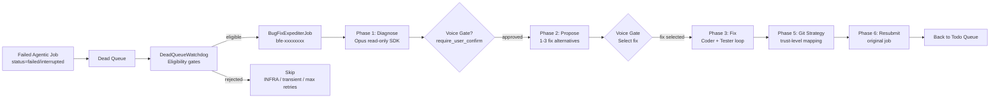

> Part 1 of 3 of the [Bug Fix Expediter (BFE) Guide](../bug-fix-expediter-guide.md): sections 1 to 3, what BFE does, architecture and the pipeline.

# Bug Fix Expediter (BFE) Guide

**Audience**: Lupin operators enabling automated dead-job recovery, and developers maintaining or extending BFE.

**Scope**: `src/cosa/agents/bug_fix_expediter/`, `src/cosa/rest/dead_queue_watchdog.py`, BFE INI keys.

**Last Updated**: 2026-04-10.

**See Also**:

- [Shared Fix Primitives Reference](../shared-fix-primitives-reference.md) — `PlanWriter`, `GitStrategist`, `FixExecutor`
- [Test Fix Expediter Guide](../test-fix-expediter-guide.md) — sister agent for test-failure recovery
- [Decision Proxy Admin Guide](../../proxy-admin-guide.md) — trust levels BFE uses for Phase 5 git strategy
- R&D: [BFE plan index](../../../rnd/v0.1.6/2026.03.27-bug-fix-expediter/00-index.md)

---

## Table of Contents

1. [What BFE Does](#1-what-bfe-does)
2. [Architecture](#2-architecture)
3. [Six-Phase Pipeline](#3-six-phase-pipeline)
4. [INI Reference](02-ini-trust-enabling-and-observability.md#4-ini-reference)
5. [Trust-to-Git Mapping](02-ini-trust-enabling-and-observability.md#5-trust-to-git-mapping)
6. [How to Enable Auto-Fix](02-ini-trust-enabling-and-observability.md#6-how-to-enable-auto-fix)
7. [Observability](02-ini-trust-enabling-and-observability.md#7-observability)
8. [Troubleshooting](03-troubleshooting-and-code-map.md#8-troubleshooting)
9. [Code Map](03-troubleshooting-and-code-map.md#9-code-map)

---

## 1. What BFE Does

The **Bug Fix Expediter** is an agentic job that recovers from dead (failed or
interrupted) jobs in CJ Flow. An agentic job (deep research, presentation
generator, podcast generator and so on) can crash with an error and land in the
dead queue. BFE then picks it up and diagnoses the root cause. It proposes fixes
and applies the best one. If configured, it retries the original job.

**When BFE fires**: A job completes with `status="failed"` or `status="interrupted"`
and lands in the `jobs_dead_queue`. The `DeadQueueWatchdog` runs inside the
`RunningFifoQueue` consumer thread. It evaluates the dead job against its eligibility
gates. If everything checks out, it dispatches a `BugFixExpediterJob` to the
`jobs_todo_queue`.

**What BFE produces**:

1. A **Markdown plan document** under `io/swe-team/plans/{user_email}/` capturing
   the diagnosis, proposed fixes, and implementation log.
2. **Code changes** on disk (applied by a Coder agent via the Claude Agent SDK).
3. A **git commit** (and, at higher trust levels, a branch + PR via `gh`).
4. **Voice notifications** to the user through cosa-voice MCP at each phase.
5. **Optionally**: a resubmission of the original failed job (Phase 6 auto-retry).

**What BFE does not do**:

- Modify test files (fixes land only in production code).
- Run destructive commands (blocked by `SafetyGuard`).
- Commit unrelated cleanup (prompts enforce minimal-diff discipline).
- Act on transient errors classified as infrastructure problems (rate limits, timeouts, OOMs); these skip BFE.

---

## 2. Architecture

The six phases are numbered historically, and the numbers zero and four are unused.
Zero was reserved for upfront context gathering, which got folded into the Packaging step.
The fourth phase collapsed into Phase 3 during implementation. The numbering is
preserved because the R&D planning docs reference it.

---

## 3. Six-Phase Pipeline

### Phase 1: Diagnose

**Goal**: identify the root cause of the failure, classify it, and score confidence.

**Agent**: Opus lead (read-only SDK access: `Read`, `Glob`, `Grep`, `Bash`).
Matches the "forensic analyst" role defined in
`src/cosa/agents/bug_fix_expediter/prompts/diagnosis.py`.

**Input**: `DeadJobContext` built by `dead_job_packager.package_dead_job()`. It
queries `job_history` for the failed job and extracts error messages, stack traces,
metadata, the original user question, and timing info.

**Output**: `DiagnosisResult` with:
- `root_cause` — one-paragraph explanation
- `error_category` — `config` | `code_bug` | `dependency` | `timeout` | `resource` | `unknown`
- `confidence` — 0.0 to 1.0
- `evidence` — list of file:line observations
- `affected_components` — list of source files
- `is_transient` — true if the error is retry-eligible without code change (caller skips BFE)

**Iteration**: the Lead agent runs up to `max_diagnosis_iterations` rounds (default 3).
Each round re-prompts with the prior attempt's confidence and any user messages queued
via `orchestrator.queue_user_message()`. Iteration stops early when confidence
≥ `min_diagnosis_confidence` (default 0.7).

**INI tuning**:
- `bug fix expediter lead model` — default `claude-opus-4-6`
- `bug fix expediter max diagnosis iterations` — default 3
- `bug fix expediter min diagnosis confidence` — default 0.7

**Voice gate**: after diagnosis completes, `_voice_gate_diagnosis()` optionally asks
the user to confirm the diagnosis before proceeding to proposal. Gated by
`bug fix expediter require user confirm` (default `true`).

### Phase 2: Propose

**Goal**: generate 1-3 concrete fix alternatives ranked by confidence.

**Agent**: Opus lead (read-only, same model as Phase 1).

**Input**: the `DiagnosisResult` from Phase 1 + the original `DeadJobContext`.

**Output**: `list[ProposedFix]` where each fix has:
- `title` — short commit-message subject
- `description` — 1-2 paragraphs explaining what changes and why
- `fix_type` — `config_change` | `code_patch` | `retry` | `manual`
- `confidence` — 0.0-1.0
- `risk_level` — `low` | `medium` | `high`
- `estimated_effort` — `minutes` | `hours` | `session`
- `changes` — list of `{file, action, description}` dicts

**Plan document**: `PlanWriter.write_plan()` persists the diagnosis + proposed fixes
to `io/swe-team/plans/{user_email}/YYYY.MM.DD-{slug}-plan.md`. The document structure
is described in the [Shared Primitives Reference](../shared-fix-primitives-reference/01-planwriter-gitstrategist-fixexecutor.md#3-planwriter--markdown-plan-docs).

**Voice gate**: `_voice_gate_proposal()` presents the fix list to the user via
cosa-voice `present_choices()`. User selects exactly one fix (or rejects all). In
shadow/suggest trust modes the gate is always human-driven; in active mode with
high confidence the `_auto_select_fix()` helper may auto-select.

### Phase 3: Fix

**Goal**: apply the selected fix via a Coder agent, verify it via a Tester agent,
retry with feedback if verification fails.

This is where the **shared `FixExecutor`** takes over (see
[Shared Primitives Reference §5](../shared-fix-primitives-reference/01-planwriter-gitstrategist-fixexecutor.md#5-fixexecutor--polymorphic-codertester-loop)).
The BFE orchestrator's `run_fix()` is a thin shim that constructs a `FixExecutor`
with `prompt_builder_key="bfe"` and delegates.

**Agents**:
- **Coder**: Sonnet (`claude-sonnet-4-6`), edit-capable (`Read`, `Edit`, `Bash`).
  Applies the changes described in the selected `ProposedFix`.
- **Tester**: Sonnet, edit + read + bash. Writes targeted tests, runs them via
  `pytest`, reports `PASS` or `FAIL`. Independent `pytest` validation via
  `run_pytest()` overrides the tester's self-report when the tester touched a
  test file we can re-run.

**Retry loop**: up to `max_fix_attempts` iterations (default 2). On failure, the
orchestrator builds a redelegation prompt including the prior coder output and
tester feedback, then re-delegates. On max iterations, escalates via
`cosa_interface.present_choices()` asking "Accept without tests" or "Reject fix."

**Safety**: `SafetyGuard` (from `src/cosa/agents/swe_team/safety_limits.py`) enforces:
- `max_file_changes_per_fix` — default 20 file modifications per attempt
- `wall_clock_timeout_secs` — default 600 seconds for the whole BFE run
- `max_fix_attempts + 1` failure counter (extra attempt for escalation)

**Output**: `FixResult` with `applied`, `success`, `details`, `retry_eligible` plus
Phase 5 git fields (populated in the next phase).

### Phase 5: Trust Proxy + Git Strategy

**Goal**: commit the fix to git according to the earned trust level for the
Engineering category.

**Source of trust level**: the SWE Team Trust Proxy — same one documented in the
[Decision Proxy Admin Guide](../../proxy-admin-guide.md). BFE reads
`proxy.trust_tracker.get_level("engineering")` to decide between `commit_only`
(trust levels 1 and 2) and `branch_and_pr` (level 3 and above).

**Git ops**: delegated to `shared.GitStrategist.commit_and_pr_single()` (see
[Shared Primitives Reference §4](../shared-fix-primitives-reference/01-planwriter-gitstrategist-fixexecutor.md#4-gitstrategist--trust-aware-git-operations)).
BFE's orchestrator builds the commit message and PR body; the strategist
handles the actual git/gh calls.

**Plan update**: `PlanWriter.update_implementation_log()` replaces the placeholder
of the collapsed fourth phase with real coder output + files changed. `update_git_references()`
replaces the Phase 5 placeholder with the branch/commit/PR metadata.

### Phase 6: Automated Repair Loop

**Goal**: resubmit the original failed job to prove the fix worked end-to-end.

**Status as of 2026-04-10**: code-complete with 58 unit tests passing. Live E2E
verification is in progress in a separate console.

**How it works**:

1. **DeadQueueWatchdog** — a background thread inside `RunningFifoQueue` that
   evaluates every job pushed to the dead queue. Source:
   `src/cosa/rest/dead_queue_watchdog.py`.
2. **Eligibility gates**: enabled-flag check, agentic-job-type match, classification
   heuristic (transient/infra errors skip BFE) and not-a-BFE-recursion guard.
   The `RepairAttemptTracker` limits also apply: cost budget, iteration cap and
   wall-clock timeout, keyed by `(job_id, routing_command)`.
3. **Dispatch**: constructs a `BugFixExpediterJob` with the dead job's `id_hash`,
   user identity, and pushes it to `jobs_todo_queue`. The watchdog sets
   `metadata["triggered_by_bfe"] = True` on the new job.
4. **Resubmit**: after a successful Phase 5 (fix applied + committed), the BFE
   job's `_resubmit_original_job()` method reconstructs the original job.
   It calls `agentic_job_factory.create_agentic_job()` with the saved `routing_command` and
   `original_args` from `job_history`. The resubmitted job runs normally — if it
   succeeds, the fix is validated end-to-end; if it fails again, BFE's
   `RepairAttemptTracker` gates prevent an infinite loop.

**INI tuning for Phase 6**:
- `bug fix expediter auto retry on fix` — master switch, default `false`
- `bug fix expediter enabled` — BFE feature flag (agent router + REST endpoint), default `false`
- `auto fix enabled` — `DeadQueueWatchdog` master switch (the actual auto-dispatch toggle), default `true` (run unless told otherwise). BFE is INI-only — there is no per-run override surface.

**Resuming a stalled job**: a voice gate that times out or cannot reach a human stalls the job with a checkpoint. The checkpoint's phase is the phase that was gated (`diagnosing` or `proposing`), never `waiting_confirmation`. A resumed job reuses the stored diagnosis and proposals instead of running the Lead agent again, and asks the gate that stalled again. A timeout checkpoint taken before this change holds ordinal -1 and re-runs from the start. The skip test is `resume_covers` in `src/cosa/agents/shared/resume_guard.py`, shared with TFE.

**See the BFE R&D dir** for Phase 6 implementation details:
[`src/rnd/v0.1.6/2026.03.27-bug-fix-expediter/08-phase6-automated-repair-loop-plan.md`](../../../rnd/v0.1.6/2026.03.27-bug-fix-expediter/08-phase6-automated-repair-loop-plan.md).

---

