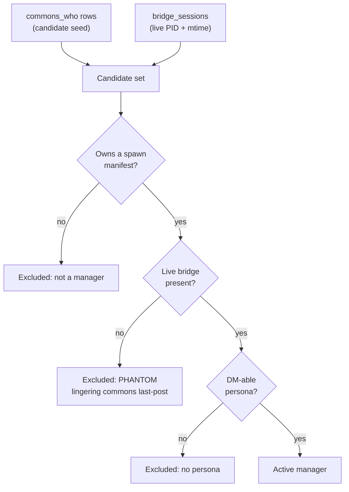
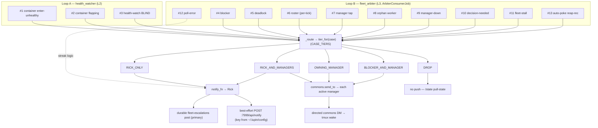

# Heartbeat-Arbiter Routing & Recipients Guide

> **Audience**: Lupin operators reasoning about who the fleet arbiter contacts (and why), and developers maintaining or extending the arbiter's routing logic
>
> **Scope**: `src/cosa/agents/heartbeat_arbiter/` (routing table, consumer job, manager resolver) + `src/lupin_arbiter_app/` (the :8001 service that wires the two loops to their delivery sinks)
>
> **Last Updated**: 2026-06-09 — verified against `arbiter_routing.py`, `arbiter_job.py`, `manager_resolver.py`, `fleet_arbiter_loop.py`, `app.py`, `arbiter_live_notify.py`, `health_watcher.py`
>
> **See Also**:
> - R&D origin: [Arbiter routing & recipients summary](../../rnd/v0.1.8/2026.06.04-heartbeat-hook/2026.06.09-arbiter-routing-and-recipients-summary.md) — the one-page distillation this guide formalizes
> - R&D design: [Arbiter consumption gap & operator loop](../../rnd/v0.1.8/2026.06.04-heartbeat-hook/2026.06.08-arbiter-consumption-gap-and-operator-loop.md) **Part 6** — the ratified 12-case routing model (Rick's judgment calls, 2026-06-08)
> - [Agentic Jobs & Recovery README](README.md) — sibling agent guides (BFE, TFE)

---

## Table of Contents

1. [What This Guide Answers](#1-what-this-guide-answers)
2. [Two Loops, One Routing Model](#2-two-loops-one-routing-model)
3. [The 13-Case → 6-Tier Routing Table](#3-the-13-case--6-tier-routing-table)
4. [How `_route` Executes a Tier (the Non-Actuation Redline)](#4-how-_route-executes-a-tier-the-non-actuation-redline)
5. [Who Counts as an "Active Manager"? (Resolver + Phantom Guard)](#5-who-counts-as-an-active-manager-resolver--phantom-guard)
6. [The Two Delivery Mechanisms](#6-the-two-delivery-mechanisms)
7. [Does the Health-Check Loop Notify? — YES (Loop A → Rick-Only)](#7-does-the-health-check-loop-notify--yes-loop-a--rick-only)
8. [End-to-End Flow Diagram](#8-end-to-end-flow-diagram)
9. [Operational Notes](#9-operational-notes)
10. [Code Map](#10-code-map)

---

## 1. What This Guide Answers

The heartbeat-arbiter is the fleet's out-of-band observer. It watches the local
Heartbeat Hook's event exhaust, the commons gateway, and Docker container health,
then **escalates** — it *senses and recommends*, it never *actuates*. This guide
answers three operator questions exactly:

1. **How does the arbiter determine WHO to contact?** — via a pure, auditable
   table (`CASE_TIERS`) that maps every distinct arbiter output to exactly one of
   six recipient tiers.
2. **How is contact accomplished across all scenarios & recipients?** — via two
   non-destructive channels only: a Rick-bound `notify_fn` and a directed
   `commons.send_to` manager/blocker DM.
3. **Does the health-check loop also issue notifications?** — **Yes.** It routes
   container/self-health alerts to **Rick only**, through the **same** escalation
   sink (see [§7](#7-does-the-health-check-loop-notify--yes-loop-a--rick-only)).

> This guide covers the **routing & recipients** facet specifically. For the
> broader arbiter design (event tailing, fleet-view construction, dependency
> graph, idle roster, the v2.1 direct-state snapshot), see the R&D directory
> linked above.

---

## 2. Two Loops, One Routing Model

The arbiter functionality runs as two independent loops inside the standalone
`lupin-arbiter-app` service on **:8001**, and both feed a single recipient-routing
model.

| Loop | Name | Layer | Source | Responsibility |
|------|------|-------|--------|----------------|
| **Loop A** | `health_watcher` | L2 | `lupin_arbiter_app/health_watcher.py` | Per-container Docker health + self-watch ("am I blind?") |
| **Loop B** | `fleet_arbiter` | L3 | `cosa/agents/heartbeat_arbiter/arbiter_job.py` (`ArbiterConsumerJob`) | The fleet operator loop — tail events → fleet view → dependency graph → blocked/stuck/deadlock/decision detection |

Both loops emit outputs that are **numbered cases**, and each case maps to exactly
**one recipient tier** in the pure table `arbiter_routing.CASE_TIERS`. The two
loops differ only in *which* cases they raise:

- **Loop A** raises cases **#1 / #2 / #3** — all hard-wired to **Rick-only**
  (infra is the human's domain; managers don't act on containers).
- **Loop B** raises cases **#4 … #13** — routed **per-case across all six tiers**.

The single shared idea: a case number is the contract; the tier is the answer to
"who?"; the executor (`_route`) is the answer to "how?".

---

## 3. The 13-Case → 6-Tier Routing Table

The contract lives as a **pure leaf** in `arbiter_routing.py` — no I/O, no seams —
so the routing is auditable and 100%-testable in isolation. `CASE_TIERS` is the
runtime dictionary; `tier_for(case)` is the lookup (it raises `KeyError` on an
unknown case — a new output **must** be routed explicitly, never silently
defaulted).

### The six recipient tiers

| Tier constant | Reaches | Channels used |
|---------------|---------|---------------|
| `TIER_RICK_ONLY` | Rick only, no managers | `notify_fn` |
| `TIER_RICK_AND_MANAGERS` | Rick + every active manager | `notify_fn` + `send_to` (each active manager) |
| `TIER_OWNING_MANAGER` | the resolved owning manager | `send_to` |
| `TIER_BLOCKER_AND_MANAGER` | the blocker + cc its owning manager | `send_to` (blocker) + `send_to` (manager) |
| `TIER_DROP` | nobody — pull-state via `/state` | (none) |
| `TIER_LOG_THEN_RICK` | log; escalate to Rick only if persistent | `notify_fn` (only past a streak threshold) |

### The full case → tier table (`CASE_TIERS`)

| # | Case | Loop | Tier | Why |
|---|------|------|------|-----|
| 1 | container enter-unhealthy | A | `RICK_ONLY` | infra; managers don't act on containers |
| 2 | container flapping | A | `RICK_ONLY` | ops alert |
| 3 | health-watch BLIND | A | `RICK_ONLY` | "the arbiter's eyes are out" (e.g. docker daemon down) |
| 4 | blocker holding up a worker | B | `BLOCKER_AND_MANAGER` | direct nudge to the blocker + manager looped in |
| 5 | deadlock cycle | B | `RICK_AND_MANAGERS` | a human/manager breaks it; resilient to owning-mgr-down |
| 6 | fleet roster (per-tick) | B | `DROP` | roster is pull-state, served by `/state` — broadcast cut |
| 7 | manager tap | B | `OWNING_MANAGER` | the core per-worker actionable nudge |
| 8 | unresolved-manager (orphan) worker | B | `RICK_AND_MANAGERS` | any manager could adopt it |
| 9 | manager-down + HOLD | B | `RICK_AND_MANAGERS` | leaderless crew; re-staff |
| 10 | decision-needed | B | `RICK_ONLY` (+ owning mgr cc if known) | decisions are the human's domain |
| 11 | whole-fleet-stall | B | `RICK_AND_MANAGERS` | calibrated; rare + severe |
| 12 | arbiter poll-error | B | `LOG_THEN_RICK` | demoted from a per-error ping; escalate only if persistent |
| 13 | auto-poke reap-**recommendation** | B | `RICK_AND_MANAGERS` | post-Part-6 (2b-3) addition; **recommendation only** |

**Cases #1–#12** are the ratified **Part-6** model (Rick's judgment calls,
2026-06-08). **Case #13** (`CASE_AUTO_POKE_REAP_REC`) is a post-Part-6 (2b-3)
addition routed through the same dispatcher: after a stuck **live** session
absorbs ≤N bounded non-destructive pokes with no recovery, the arbiter recommends
a reap/replace to Rick + all active managers — but **never executes it** (the
redline; see [§4](#4-how-_route-executes-a-tier-the-non-actuation-redline)).

### Two important precision points

- **#10 (decision-needed)** routes to **Rick-only via the tier**. The owning
  manager is cc'd by a *separate* side-call (`_cc_decision_manager`), **outside**
  the tier dispatch, and only when the post's `sender_session_id` resolves to a
  DM-able manager. No resolution → Rick-only, no-op cc.
- **#12 (poll-error)** is **not** dispatched through `_route`. It is handled by
  `_on_poll_error`'s streak logic: a transient one-off hiccup is logged; only
  `≥ poll_error_escalate_threshold` consecutive failures escalate (once) to Rick
  via `notify_fn` ("arbiter effectively down"). A clean poll resets the streak.

---

## 4. How `_route` Executes a Tier (the Non-Actuation Redline)

`ArbiterConsumerJob._route(case, message, …)` is the single dispatcher. It looks
up `tier_for(case)` and executes the tier using **only two seams**:

- `self._notify_fn(message)` → **Rick** (durable post + best-effort live push)
- `self._commons.send_to(recipient, message)` → **a directed manager/blocker DM**

```python
tier = tier_for( case )
if   tier == TIER_RICK_ONLY:           self._notify_fn( message )
elif tier == TIER_RICK_AND_MANAGERS:   self._notify_fn( message )
                                       # + send_to each active manager
elif tier == TIER_OWNING_MANAGER:      self._commons.send_to( owning_manager, message )
elif tier == TIER_BLOCKER_AND_MANAGER: self._commons.send_to( blocker, message )
                                       # + send_to( owning_manager, cc_message )
# TIER_DROP → intentional no-op (#6 roster broadcast is cut)
```

**The redline (standing invariant):** the arbiter **never actuates** — no reap,
kill, replace, spawn, or auto-assign. It calls only `{notify_fn, send_to}` (plus
read-only `who`/`read`). This is enforced **structurally** by an AST-scan test
(`test_arbiter_redline`), not merely by convention. Even the auto-poke (#13)
sends a *non-destructive wake-nudge* and then a *recommendation* — it takes no
destructive action.

**Degrade-safe absence of recipients:** missing optional recipients degrade
silently. `TIER_OWNING_MANAGER` with no resolved manager → no-op;
`TIER_RICK_AND_MANAGERS` with an empty active-manager set → Rick still gets the
escalation. No escalation is ever lost because a manager couldn't be resolved.

---

## 5. Who Counts as an "Active Manager"? (Resolver + Phantom Guard)

The `RICK_AND_MANAGERS` tier fans out to "every active manager on duty." That set
is computed by `resolve_active_managers` (`manager_resolver.py`), wired into the
job as `_active_managers(who_rows, bridge_sessions)`.

A persona is an **active manager** iff it satisfies **both**:

1. **MANAGER-ROLE** — its session owns a spawn-lineage manifest (it spawned ≥1
   child; via `list_manager_session_ids`, which trusts a manifest filename only if
   it round-trips the exact slugify transform that produced it).
2. **PROCESS-ALIVE (the phantom guard)** — its session is present in
   `bridge_sessions`, the PID + mtime-filtered live-bridge discovery
   (`find_active_voice_persona_sessions`).



**Why the phantom guard matters:** raw `commons_who` is phantom-prone — a reaped
manager's `last_post_ts` can *linger* on the board after the process is gone. The
live-bridge presence check is the authoritative process-liveness axis: a manager
with a dead bridge is excluded even if its commons row is still visible.

**Empty-set degrade-to-Rick:** if the resolver returns an empty set (or throws —
`_active_managers` swallows any hiccup to `[]`), `RICK_AND_MANAGERS` cleanly
degrades to **Rick-only**. No crash, no lost escalation.

> The **owning manager** for per-worker cases (#7 tap, #4 blocker cc, #10 decision
> cc) is resolved separately by `resolve_manager(worker_session_id)`, which walks
> the spawn-lineage join (worker → bridge tmux_session → manifest → manager id →
> persona) with a round-trip guard and a multi-match guard. It **prefers
> UNRESOLVED over a wrong-manager DM**: any brittle/ambiguous hop returns
> `unresolved`, and the caller escalates to Rick instead of guessing.

---

## 6. The Two Delivery Mechanisms

### Mechanism A — to Rick (`notify_fn`)

In production the job's `notify_fn` is `make_escalation_notify_fn`
(`fleet_arbiter_loop.py`), wrapped in a per-job **warm-up suppressor**. It does
two things on every Rick-bound escalation:

1. **Durable (primary):** `gateway.post("fleet-escalations", message)` — always
   posts to the durable `fleet-escalations` commons topic. A write failure is
   swallowed + logged (`escalation_post_error`); the primary channel must not kill
   the loop.
2. **Live push (best-effort):** if a `live_notify_fn` is wired, it fires the 2b-1
   live hop — a `POST :7999/api/notify` so the alert actually reaches Rick instead
   of rotting on a topic nobody polls. A failure is swallowed + logged
   (`escalation_live_notify_error`).

The live hop (`arbiter_live_notify.py`) is the **only** :7999-capable hop and is
**escalation-path only** — the detection path stays :7999-free (R4 independence).
It carries:

- a **content+window dedup guard** (`make_live_notify_fn`) so N identical
  escalations in `dedup_window_seconds` push exactly once;
- a request shape (`build_notify_request`) sending `message / type=alert /
  priority=high / target_user / sender_id / title` as query params, with the
  `X-API-Key` header;
- a **degrade-safe key resolver** (`resolve_arbiter_api_key`) that reads the
  `X-API-Key` from **`~/.lupin/config`** (via `cosa.utils.config_loader`). A
  missing/bad credential **disables live push** (escalations still land durably on
  the commons topic) rather than crashing startup or spamming failed POSTs.

> Both channels are degrade-safe by design: a failure on either is swallowed and
> logged, never propagated to the poll loop.

### Mechanism B — to managers / blockers (`commons.send_to`)

A directed commons DM via `gateway.send_to(recipient_persona, body)`. This
**pushes/wakes** the recipient's tmux session (the recipient sees a
`COMMONS PEER MESSAGE` system-reminder on its next turn). Used by:

- **#7 manager tap** — the advisory crew summary ("I observe … / I recommend …";
  the manager actuates, the arbiter never assigns), throttled tap-on-change +
  min-interval;
- **#4 blocker** — DM the blocker naming the blocked worker + the ask, then cc its
  owning manager;
- **#10 decision cc** — cc the owning manager when resolvable;
- the **#13 auto-poke** wake-nudge to the stuck live session.

---

## 7. Does the Health-Check Loop Notify? — YES (Loop A → Rick-Only)

**Yes.** The health watcher (Loop A, `health_watcher.py`) issues notifications.
Its escalation function is built by `_make_health_notify_fn` (`app.py`), and it
covers **three cases**:

| # | Health event | Trigger |
|---|--------------|---------|
| 1 | **container enter-unhealthy** | a watched container transitions `(starting\|healthy) → unhealthy` (once per episode) |
| 2 | **container flapping** | ≥ `flap_threshold` status transitions within `flap_window` (once per episode; `flap_exclude` containers — default `lupin-rest-dev` — are never flap-paged but still get enter-unhealthy alerts) |
| 3 | **health-watch BLIND** | every container's `docker inspect` fails for K consecutive polls — the watcher noticing its own eyes are out |

**Recipient: RICK ONLY — hard-wired, no manager fanout.** Containers are infra;
managers don't act on them. This is enforced by the tier (`#1/#2/#3 → RICK_ONLY`)
*and* by `_make_health_notify_fn` itself, which never resolves or fans out to
managers.

**Mechanism: the SAME shared escalation sink as Loop B.** `_make_health_notify_fn`
wraps `make_escalation_notify_fn` — so a health escalation also lands on the
durable `fleet-escalations` topic + best-effort :7999 live push. It additionally
emits a structured **`health_escalation`** log line before escalating. It never
raises (the sink is degrade-safe).

```python
def notify( message ):
    log_fn( "health_escalation", message=message )
    escalate( message )   # Part-6 #1/2/3 → Rick only (no managers)
```

**So both loops converge on one Rick sink.** The difference: **Loop A is fixed to
Rick-only** (infra/self-health), while **Loop B routes per-case across all six
tiers**.

---

## 8. End-to-End Flow Diagram



---

## 9. Operational Notes

- **Service & supervision:** the arbiter runs in `lupin-arbiter-app` on **:8001**.
  `FleetArbiterLoop` relaunches a fresh `ArbiterConsumerJob` on each clean
  12h-cap exit (single-instance by construction — sequential recycle). The health
  watcher runs on its own background thread; `GET /health` never touches docker.
- **Warm-up suppression:** each fresh job suppresses escalations while
  `(now − job_start) < start_period_seconds` (default 120s) — so cold boot,
  restart, and recycle never false-fire.
- **Roster is pull-state:** there is no per-tick roster broadcast (#6 DROP). The
  fleet roster + per-session liveness are served by `GET /state` (the single-pane
  composite, read from the :8001-local store; the :7999 reverse-proxy pulls from
  here). A cold loop returns an explicit `"awaiting"` placeholder, never a bare
  null.
- **Anti-storm guarantees:** manager taps fire only on crew-summary *change* +
  min-interval; manager-down escalates once per un-acked tap; fleet-stall
  escalates once per stall episode; auto-poke is capped per stall episode (≤N
  pokes → one reap-recommendation → silence). The live-push dedup guard is
  belt-and-suspenders on top of these.
- **Config knobs** (all under `[Lupin: …]`, read in `assemble_app` /
  `_build_live_notify_fn`): `arbiter poll seconds`, `arbiter alive/quiet threshold
  seconds`, `arbiter tap min interval seconds`, `arbiter manager ack window
  seconds`, `arbiter fleet stall window seconds`, `arbiter poll error escalate
  threshold`, `arbiter auto poke enabled`, `arbiter poke stall threshold seconds`,
  `arbiter poke max per episode`, `arbiter start period seconds`, `arbiter health
  watch enabled` (+ the `arbiter health …` watch knobs), and the `arbiter live
  notify …` keys (enabled / config env / url / target user / sender id / dedup
  window / timeout).

---

## 10. Code Map

| Concern | File |
|---------|------|
| The 13-case → 6-tier contract (pure table, `CASE_TIERS`, `tier_for`) | `src/cosa/agents/heartbeat_arbiter/arbiter_routing.py` |
| `_route` dispatcher + per-case detectors + auto-poke + poll-error streak | `src/cosa/agents/heartbeat_arbiter/arbiter_job.py` |
| Active-manager resolver (phantom guard) + owning-manager lineage resolver | `src/cosa/agents/heartbeat_arbiter/manager_resolver.py` |
| Rick escalation sink (durable post + best-effort live push) + warm-up + recycle | `src/lupin_arbiter_app/fleet_arbiter_loop.py` |
| Loop A (`health_watcher`) → Rick-only wiring; `assemble_app` config branching | `src/lupin_arbiter_app/app.py` |
| Live-push :7999 hop (request shape, dedup guard, key resolver) | `src/lupin_arbiter_app/arbiter_live_notify.py` |
| Health watcher decision logic (enter-unhealthy / flapping / blind) | `src/lupin_arbiter_app/health_watcher.py` |

**Design origin:** Part 6 of
[`src/rnd/v0.1.8/2026.06.04-heartbeat-hook/2026.06.08-arbiter-consumption-gap-and-operator-loop.md`](../../rnd/v0.1.8/2026.06.04-heartbeat-hook/2026.06.08-arbiter-consumption-gap-and-operator-loop.md)
(judgment calls ratified by Rick 2026-06-08), distilled in
[`2026.06.09-arbiter-routing-and-recipients-summary.md`](../../rnd/v0.1.8/2026.06.04-heartbeat-hook/2026.06.09-arbiter-routing-and-recipients-summary.md).
</content>
</invoke>
