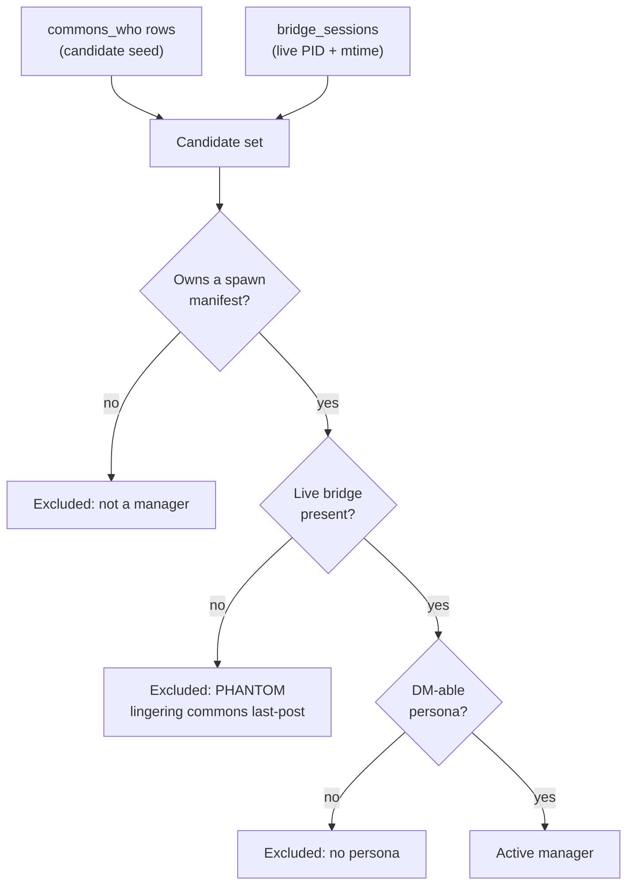
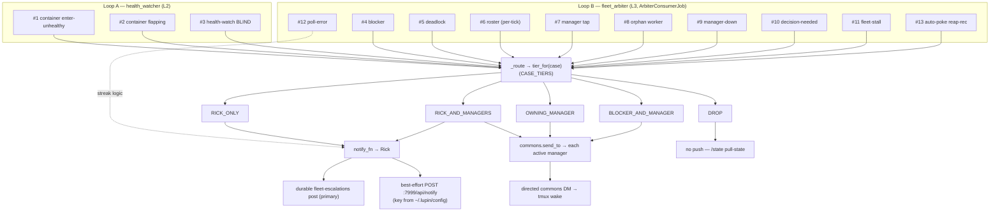

> Part 2 of 2 of the [Heartbeat-Arbiter Routing & Recipients Guide](../heartbeat-arbiter-routing-guide.md): sections 5 to 10, the resolver, delivery, health loop and code map.

## 5. Who Counts as an "Active Manager"? (Resolver + Phantom Guard)

The `RICK_AND_MANAGERS` tier fans out to "every active manager on duty." That set
is computed by `resolve_active_managers` (`manager_resolver.py`), wired into the
job as `_active_managers(who_rows, bridge_sessions)`.

A persona is an **active manager** iff it satisfies **both**:

1. **MANAGER-ROLE** — its session owns a spawn-lineage manifest (it spawned ≥1
   child). This is checked via `list_manager_session_ids`, which trusts a manifest
   filename only if it round-trips the exact slugify transform that produced it.
2. **PROCESS-ALIVE (the phantom guard)** — its session is present in
   `bridge_sessions`, the PID + mtime-filtered live-bridge discovery
   (`find_active_voice_persona_sessions`).



**Why the phantom guard matters:** raw `commons_who` is phantom-prone — a reaped
manager's `last_post_ts` can *linger* on the board after the process is gone. The
live-bridge presence check is the authoritative process-liveness axis: a manager
with a dead bridge is excluded even if its commons row is still visible.

**Empty-set degrade-to-Rick:** if the resolver returns an empty set (or throws —
`_active_managers` swallows any hiccup to `[]`), `RICK_AND_MANAGERS` cleanly
degrades to **Rick-only**. No crash, no lost escalation.

The **owning manager** for per-worker cases (#7 tap, #4 blocker cc, #10 decision
cc) is resolved separately by `resolve_manager(worker_session_id)`. It walks
the spawn-lineage join (worker → bridge tmux_session → manifest → manager id →
persona) with a round-trip guard and a multi-match guard. It **prefers
`unresolved` over a wrong-manager DM**: any brittle/ambiguous hop returns
`unresolved`, and the caller escalates to Rick instead of guessing.

---

## 6. The Two Delivery Mechanisms

### Mechanism A — to Rick (`notify_fn`)

In production the job's `notify_fn` is `make_escalation_notify_fn`
(`fleet_arbiter_loop.py`), wrapped in a per-job **warm-up suppressor**. It does
two things on every Rick-bound escalation:

1. **Durable (primary):** `gateway.post("fleet-escalations", message)` — always
   posts to the durable `fleet-escalations` commons topic. A write failure is
   swallowed + logged (`escalation_post_error`); the primary channel must not kill
   the loop.
2. **Live push (best-effort):** if a `live_notify_fn` is wired, it fires the 2b-1
   live hop, a `POST :7999/api/notify`. This lets the alert actually reach Rick instead
   of rotting on a topic nobody polls. A failure is swallowed + logged
   (`escalation_live_notify_error`).

The live hop (`arbiter_live_notify.py`) is the **only** :7999-capable hop and is
**escalation-path only**. The detection path stays :7999-free.
It carries:

- a **content+window dedup guard** (`make_live_notify_fn`) so N identical
  escalations in `dedup_window_seconds` push exactly once;
- a request shape (`build_notify_request`) sending `message / type=alert /
  priority=high / target_user / sender_id / title` as query params, with the
  `X-API-Key` header;
- a **degrade-safe key resolver** (`resolve_arbiter_api_key`) that reads the
  `X-API-Key` from **`~/.lupin/config`** (via `cosa.utils.config_loader`). A
  missing/bad credential **disables live push** (escalations still land durably on
  the commons topic) rather than crashing startup or spamming failed POSTs.

> Both channels are degrade-safe by design: a failure on either is swallowed and
> logged, never propagated to the poll loop.

### Mechanism B — to managers / blockers (`commons.send_to`)

A directed commons DM via `gateway.send_to(recipient_persona, body)`. This
**pushes/wakes** the recipient's tmux session (the recipient sees a
`COMMONS PEER MESSAGE` system-reminder on its next turn). Used by:

- **#7 manager tap** — the advisory crew summary ("I observe … / I recommend …").
  The manager actuates and the arbiter never assigns. Taps are throttled:
  tap-on-change + min-interval;
- **#4 blocker** — DM the blocker naming the blocked worker + the ask, then cc its
  owning manager;
- **#10 decision cc** — cc the owning manager when resolvable;
- the **#13 auto-poke** wake-nudge to the stuck live session.

---

## 7. Does the Health-Check Loop Notify? — Yes (Loop A → Rick-Only)

**Yes.** The health watcher (Loop A, `health_watcher.py`) issues notifications.
Its escalation function is built by `_make_health_notify_fn` (`app.py`), and it
covers **three cases**:

| # | Health event | Trigger |
|---|--------------|---------|
| 1 | **container enter-unhealthy** | a watched container transitions `(starting\|healthy) → unhealthy` (once per episode) |
| 2 | **container flapping** | ≥ `flap_threshold` status transitions within `flap_window` (once per episode; `flap_exclude` containers — default `lupin-rest-dev` — are never flap-paged but still get enter-unhealthy alerts) |
| 3 | **health-watch `BLIND`** | every container's `docker inspect` fails for K consecutive polls — the watcher noticing its own eyes are out |

**Recipient: Rick only — hard-wired, no manager fanout.** Containers are infra;
managers don't act on them. This is enforced by the tier (`#1/#2/#3 → RICK_ONLY`)
*and* by `_make_health_notify_fn` itself, which never resolves or fans out to
managers.

**Mechanism: the same shared escalation sink as Loop B.**

`_make_health_notify_fn`
wraps `make_escalation_notify_fn`, so a health escalation also lands on the
durable `fleet-escalations` topic + best-effort :7999 live push. It additionally
emits a structured **`health_escalation`** log line before escalating. It never
raises (the sink is degrade-safe).

```python
def notify( message ):
    log_fn( "health_escalation", message=message )
    escalate( message )   # Part-6 #1/2/3 → Rick only (no managers)
```

**So both loops converge on one Rick sink.**

The difference: **Loop A is fixed to
Rick-only** (infra/self-health), while **Loop B routes per-case across all six
tiers**.

---

## 8. End-to-End Flow Diagram



---

## 9. Operational Notes

- **Service & supervision:** the arbiter runs in `lupin-arbiter-app` on **:8001**.
  `FleetArbiterLoop` relaunches a fresh `ArbiterConsumerJob` on each clean
  12h-cap exit (single-instance by construction — sequential recycle). The health
  watcher runs on its own background thread; `GET /health` never touches docker.
- **Warm-up suppression:** each fresh job suppresses escalations while
  `(now − job_start) < start_period_seconds` (default 120s) — so cold boot,
  restart, and recycle never false-fire.
- **Roster is pull-state:** there is no per-tick roster broadcast (#6 `DROP`). The
  fleet roster + per-session liveness are served by `GET /state` (the single-pane
  composite, read from the :8001-local store; the :7999 reverse-proxy pulls from
  here). A cold loop returns an explicit `"awaiting"` placeholder, never a bare
  null.
- **Anti-storm guarantees:** manager taps fire only on crew-summary *change* +
  min-interval. Manager-down escalates once per un-acked tap. Fleet-stall
  escalates once per stall episode. Auto-poke is capped per stall episode (≤N
  pokes → one reap-recommendation → silence). The live-push dedup guard is
  belt-and-suspenders on top of these.
- **Config knobs** (all under `[Lupin: …]`, read in `assemble_app` /
  `_build_live_notify_fn`):
  - `arbiter poll seconds`
  - `arbiter alive/quiet threshold seconds`
  - `arbiter tap min interval seconds`
  - `arbiter manager ack window seconds`
  - `arbiter fleet stall window seconds`
  - `arbiter poll error escalate threshold`
  - `arbiter auto poke enabled`
  - `arbiter poke stall threshold seconds`
  - `arbiter poke max per episode`
  - `arbiter start period seconds`
  - `arbiter health watch enabled` (+ the `arbiter health …` watch knobs)
  - the `arbiter live notify …` keys (enabled / config env / url / target user / sender id / dedup window / timeout)

---

## 10. Code Map

| Concern | File |
|---------|------|
| The 13-case → 6-tier contract (pure table, `CASE_TIERS`, `tier_for`) | `src/cosa/agents/heartbeat_arbiter/arbiter_routing.py` |
| `_route` dispatcher + per-case detectors + auto-poke + poll-error streak | `src/cosa/agents/heartbeat_arbiter/arbiter_job.py` |
| Active-manager resolver (phantom guard) + owning-manager lineage resolver | `src/cosa/agents/heartbeat_arbiter/manager_resolver.py` |
| Rick escalation sink (durable post + best-effort live push) + warm-up + recycle | `src/lupin_arbiter_app/fleet_arbiter_loop.py` |
| Loop A (`health_watcher`) → Rick-only wiring; `assemble_app` config branching | `src/lupin_arbiter_app/app.py` |
| Live-push :7999 hop (request shape, dedup guard, key resolver) | `src/lupin_arbiter_app/arbiter_live_notify.py` |
| Health watcher decision logic (enter-unhealthy / flapping / blind) | `src/lupin_arbiter_app/health_watcher.py` |

**Design origin:** Part 6 of
[`src/rnd/v0.1.8/2026.06.04-heartbeat-hook/2026.06.08-arbiter-consumption-gap-and-operator-loop.md`](../../../rnd/v0.1.8/2026.06.04-heartbeat-hook/2026.06.08-arbiter-consumption-gap-and-operator-loop.md)
(judgment calls ratified by Rick 2026-06-08), distilled in
[`2026.06.09-arbiter-routing-and-recipients-summary.md`](../../../rnd/v0.1.8/2026.06.04-heartbeat-hook/2026.06.09-arbiter-routing-and-recipients-summary.md).
