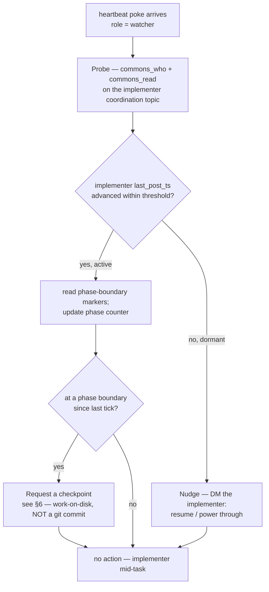

# Implementer-Watch Protocol — Watcher-mode Layer-2 Doctrine

| Field | Value |
|---|---|
| **Status** | 🟢 Active doctrine — Lupin-first (γ ratification, 2026-05-21) |
| **Doctrine home** | `lupin/src/docs/agents/implementer-watch-protocol.md` *(here)* |
| **PIP-promotion target** | `planning-is-prompting/workflow/implementer-watch-protocol.md` *(on trigger — see below)* |
| **Layer** | Layer-2 per-recipient doctrine for the generic Heartbeat Poker (`HeartbeatPokerJob`) |
| **Authored by** | Task I3, per the D2 spec `src/rnd/v0.1.7/2026.05.22-heartbeat-poker-d2-watcher-protocol-spec.md` |
| **Design doc** | `src/rnd/v0.1.7/2026.05.20-generic-heartbeat-poker-abstraction-design.md` |

## PIP-promotion triggers

This doctrine stays **Lupin-first** until cross-project reach is proven. Promote it
(move to `planning-is-prompting/workflow/implementer-watch-protocol.md`) when **EITHER**:

1. ≥1 non-Lupin project lands an implementer-keep-alive-shaped use case, **OR**
2. ≥2 distinct Lupin use cases require Watcher-mode.

Judging whether a trigger has fired is `EXECUTOR: AI`. The promotion itself — the
doc-move — is `EXECUTOR: AI`, a git operation performed **only on explicit user
authorization** (never-auto-commit policy).

---

## 1. Role

A **Watcher** is a peer Claude Code session, external to an *implementer* session,
whose job is to keep that implementer **powering through** a multi-task implementation
run without going dormant at task boundaries.

The motivating failure (design doc §1): an implementer that pauses ~12 times overnight,
going idle at each boundary instead of self-chaining to the next task. The Watcher,
poked on a cadence by a `HeartbeatPokerJob`, probes the implementer and nudges it back
into motion — converting turn-boundary idle gaps into continuous progress.

The Watcher is one of three Layer-2 recipient roles (Observer / Manager / Watcher). The
generic poker never branches on role — it stamps `role: "watcher"` into the poke and the
recipient session dispatches on it. This protocol IS that dispatch doctrine.

---

## 2. Activation

This protocol is loaded into the Watcher session at **cold-cast** — before the first
poke lands (design doc §3 cold-cast sequence; the launch runbook is D3 §7). A poke that
reaches a session not yet doctrine-loaded is wasted.

Each `HeartbeatPokerJob` tick delivers a `poke_body`:

```json
{ "kind": "heartbeat", "workstream": "<impl-id>", "role": "watcher" }
```

The arrival of a `role: "watcher"` poke is the **per-tick trigger** for the behavior
in §3.

---

## 3. Per-tick behavior

On each heartbeat poke the Watcher executes the following — every step `EXECUTOR: AI`
(the Watcher is a CC session; the one `EXECUTOR: HUMAN` step in the broader system,
spawning a recipient session, is a launch prerequisite owned by D3, not a per-tick
behavior):



1. **Probe** — `EXECUTOR: AI` — call `commons_who()` and `commons_read()` on the
   implementer's coordination topic to assess current activity.
2. **Nudge-if-dormant** — `EXECUTOR: AI` — if the implementer is dormant (§4), DM it
   (`commons_send_to`) with a short, specific nudge to resume the next task.
3. **Request-checkpoint-at-boundary** — `EXECUTOR: AI` — if the implementer has crossed
   a phase boundary since the previous tick (§5), request a checkpoint (§6).

---

## 4. Dormancy detection

Reuse the existing liveness surface — **no new state primitive** (design doc Q1
prior-art). The Watcher reads `commons_who().last_post_ts` for the implementer's session.

"Dormant" = `last_post_ts` has not advanced across a threshold the Watcher applies.
**Recommended threshold: ≥2 missed cadence intervals** before nudging — a single missed
interval is more likely a heads-down implementer mid-task than a genuine stall, and a
false nudge is noise.

---

## 5. Phase-boundary-marker contract (finding F-Rio-E3)

The Watcher can derive *phase boundaries* — needed for §3 step 3 — **only if the
implementer emits phase-boundary markers**. This is a hard, two-sided contract:

- **Implementer side** `EXECUTOR: AI` *(prerequisite)* — at every task/phase boundary
  the implementer MUST emit a phase-boundary marker: a structured `commons_post` to its
  coordination topic carrying machine-parseable metadata, e.g.:

  ```json
  { "kind": "progress", "phase_boundary": true, "task_done": "<id>", "task_next": "<id>" }
  ```

- **Watcher side** `EXECUTOR: AI` — read the coordination topic, filter on
  `metadata.phase_boundary == true`, and count markers to maintain the phase counter.

Without the implementer-side emission the Watcher's phase counter is **blind** — it
cannot know a boundary was crossed. The implementer-side emission is therefore a
non-optional precondition of Watcher-mode, stated here so neither side assumes it
silently.

---

## 6. "Checkpoint" — definition (never-auto-commit)

When §3 step 3 says the Watcher *requests a checkpoint*, **"checkpoint" does NOT mean a
git commit.** An autonomous git commit violates the never-auto-commit policy — commits
require explicit user authorization.

A **checkpoint** is:

1. The implementer leaves its work **complete, documented, and reviewable ON DISK**, and
2. The implementer **emits the phase-boundary marker / progress note** (§5).

That is the whole checkpoint. Git commits remain a **separate, explicit, user-authorized
step** — never something the Watcher instructs the implementer to do autonomously.

The `/plan-session-checkpoint` skill is referenced here for its **work-organization
shape** — a clean mid-run stopping point — NOT as an authorization to commit.

---

## 7. Post-escalation path

The `HeartbeatPokerJob`'s dead-man's-switch fires a `notify()` to the user after a
recipient goes silent for 3 consecutive pokes. That escalation is the **poker's**
action, not the Watcher's.

On escalation the Watcher **does NOT stand down** — `EXECUTOR: AI`. It keeps probing and
keeps nudging the implementer. The dead-man's-switch *escalates*, it never *terminates*
(design doc §4) — and neither does the Watcher. The Watcher continues its per-tick
behavior until the poker run ends on a clean termination signal or the hard cap.

---

## 8. Cross-references

| Reference | Purpose |
|---|---|
| `plan-review-cascaded-common.md` §Observer-mode Probe Protocol | Sibling Layer-2 doctrine; structural template |
| `src/rnd/v0.1.7/2026.05.20-...-design.md` §2 use case 3, §5 γ | Watcher role + doctrine-home ratification |
| `src/rnd/v0.1.7/2026.05.22-heartbeat-poker-d2-watcher-protocol-spec.md` | The D2 spec this protocol body was authored from |
| `src/rnd/v0.1.7/2026.05.22-heartbeat-poker-d1d4-class-spec.md` | The Layer-1 poker this doctrine pairs with |
| `/plan-session-checkpoint` skill | Work-organization shape for the checkpoint (§6) — not a commit mandate |

---

*Layer-2 doctrine — authored 2026-05-22 (task I3). The Layer-1 poker code lives in
`src/cosa/agents/heartbeat_poker_job.py` and never migrates; only this doctrine is
PIP-promotable.*
