# Test Fix Expediter (TFE) Guide

> **Audience**: Lupin operators running automated test suites and developers maintaining or extending TFE
>
> **Scope**: `src/cosa/agents/test_fix_expediter/`, `src/cosa/rest/test_suite_completion_watchdog.py`, TFE INI keys
>
> **Last Updated**: 2026-04-10
>
> **See Also**:
> - [Shared Fix Primitives Reference](shared-fix-primitives-reference.md) — shared `FixExecutor`, `GitStrategist`, `PlanWriter`
> - [Bug Fix Expediter Guide](bug-fix-expediter-guide.md) — sister agent for dead-job recovery
> - [Test-Suite Scheduling Guide](test-suite-scheduling-guide.md) — how TestSuiteJob produces the remediation snapshots TFE consumes
> - R&D: [TFE plan index](../../rnd/v0.1.6/2026.04.10-test-fix-expediter/00-index.md)

---

## Table of Contents

1. [What TFE Does](#1-what-tfe-does)
2. [How TFE Differs from BFE](#2-how-tfe-differs-from-bfe)
3. [Architecture](#3-architecture)
4. [Six-Phase Pipeline](#4-six-phase-pipeline)
5. [TestSuiteCompletionWatchdog](#5-testsuitecompletionwatchdog)
6. [INI Reference](#6-ini-reference)
7. [How to Enable Auto-Fix](#7-how-to-enable-auto-fix)
8. [Troubleshooting](#8-troubleshooting)
9. [Code Map](#9-code-map)

---

## 1. What TFE Does

The **Test Fix Expediter** is an agentic job that recovers from test failures. When
a `TestSuiteJob` finishes with a non-empty failures list in its remediation snapshot,
TFE clusters the failures by root cause, diagnoses each cluster, proposes fixes,
applies them through a shared Coder+Tester loop, commits the results as one branch
with N commits and one PR, and then schedules a validation rerun.

**When TFE fires**: A `TestSuiteJob` completes (successfully — the job itself didn't
crash, but tests inside it failed) and lands in the done queue with
`summary.all_passed == false` in its remediation snapshot artifact. The
`TestSuiteCompletionWatchdog` evaluates the completed job against six eligibility
gates and, if all pass, dispatches a `TestFixExpediterJob` to `jobs_todo_queue`.

**What TFE produces**:

1. A **multi-section plan document** under `io/swe-team/plans/{user_email}/` listing
   every cluster, its diagnosis, and its proposed fix.
2. **Code changes** on disk (production code, test code, fixtures, or config —
   whatever each cluster's fix calls for).
3. **N git commits on one branch**, one commit per cluster, plus a single PR
   bundling the whole batch.
4. **Voice notifications** to the user with aggregated (not per-cluster) gates at
   Phase 1 and Phase 2.
5. **An async validation rerun** — a new `TestSuiteJob` queued to re-run just the
   affected suites, carrying a recursion-guard metadata flag so the watchdog
   refuses to re-trigger TFE on the rerun's completion.

**What TFE does NOT do**: rerun forever (the recursion guard is strict), operate on
test_suite jobs that crashed rather than completed (those land in the dead queue
and fall to BFE), or modify tests outside the cluster it's fixing (the Tester
agent's `pytest -k` filter is narrowed to the cluster's failing test names).

---

## 2. How TFE Differs from BFE

BFE and TFE share the same Phase 3 (Fix) engine via the [shared `FixExecutor`](shared-fix-primitives-reference.md#5-fixexecutor--polymorphic-codertester-loop).
But they differ on every other axis:

| Aspect | BFE | TFE |
|--------|-----|-----|
| **Input shape** | One `DeadJobContext` (one crashed job) | One `TestRemediationContext` (N failures → K clusters) |
| **Cardinality** | 1 bug → 1 fix → 1 commit | K clusters → N fixes → N commits on 1 branch |
| **Trigger queue** | Dead queue (jobs with `status=failed`) | Done queue (successful jobs with `all_passed=false`) |
| **Watchdog** | `DeadQueueWatchdog` in `running_fifo_queue.py` error path | `TestSuiteCompletionWatchdog` in `running_fifo_queue.py` success path |
| **Phase 0** | Packaging (build DeadJobContext) | Clustering (group N failures into K clusters) |
| **Phase 1** | Diagnose the crash stack trace | Diagnose each cluster from `classname::name[param]` + traceback |
| **Voice gates** | Per-fix (1 diagnosis + 1 proposal gate) | Aggregated (1 diagnosis + 1 multi-select proposal gate for ALL clusters) |
| **Phase 5 git** | `commit_and_pr_single` (one fix → one commit/PR) | `commit_and_pr_multi` (N fixes → one branch, N commits, one PR) |
| **Phase 6 validate** | Resubmit the original dead job | Queue a new TestSuiteJob targeting affected suites |
| **Recursion guard** | `metadata["triggered_by_bfe"]` | `metadata["triggered_by_tfe"]` |

The **shared** pieces are Phase 3 (the Coder+Tester retry loop) and Phase 5 (the
trust-level → git-strategy mapping). Both live in
[`src/cosa/agents/shared/`](shared-fix-primitives-reference.md).

---

## 3. Architecture

```mermaid
flowchart LR
    TS[TestSuiteJob<br/>runs pytest via subprocess] --> Snapshot[Remediation Snapshot<br/>schema v1.0 JSON]
    Snapshot --> Done[Done Queue]
    Done --> Watchdog[TestSuiteCompletionWatchdog<br/>6 eligibility gates]
    Watchdog -->|all_passed false| TFE[TestFixExpediterJob<br/>tfe-xxxxxxxx]
    Watchdog -->|all_passed true| Skip[Skip — nothing to fix]

    TFE --> P0[Phase 0: Cluster<br/>heuristic + LLM refine]
    P0 --> P1[Phase 1: Diagnose<br/>per-cluster Opus]
    P1 --> Gate1{Aggregate Gate<br/>K clusters analyzed<br/>Proceed?}
    Gate1 -->|yes| P2[Phase 2: Propose<br/>K cluster fixes]
    P2 --> Gate2{Multi-select Gate<br/>Select subset}
    Gate2 -->|fixes selected| P3[Phase 3: Fix<br/>shared FixExecutor<br/>one per cluster]
    P3 --> P5[Phase 5: Git<br/>shared GitStrategist<br/>commit_and_pr_multi]
    P5 --> P6[Phase 6: Rerun<br/>async TestSuiteJob<br/>metadata recursion guard]
    P6 --> Todo[Validation run → todo queue]
```



The **key architectural decision**: TFE fires on the **done queue success path**,
not the dead queue. `TestSuiteJob` completes successfully from a queue perspective
even when the tests it ran have failures — the test runner returns a result object
with pass/fail counts; the job itself didn't crash. BFE's `DeadQueueWatchdog` is
therefore the wrong hook. TFE has its own `TestSuiteCompletionWatchdog` that runs
on the success-path push, checks `artifacts["remediation_snapshot"]` for
`all_passed=false`, and dispatches TFE when a remediation snapshot is present
and actionable.

---

## 4. Six-Phase Pipeline

### Phase 0: Cluster

**Goal**: group the N failures in the remediation snapshot into K ≤ `max_clusters`
clusters, each representing one root cause.

**Implementation**: `src/cosa/agents/test_fix_expediter/cluster.py::heuristic_seed()`
does a pure-Python first pass. For each failure, it computes a key of
`(normalized_classname, first_non_pytest_traceback_frame)`. Failures sharing a key
get grouped together. Parametrized tests (`test_foo[param1]`, `test_foo[param2]`)
collapse to one cluster because they share the classname AND the first non-pytest
frame in the traceback.

```python
# Simplified example
failures = [
    {"classname": "TestVisual", "name": "test_page[login]",    "traceback": "...visual.py:88..."},
    {"classname": "TestVisual", "name": "test_page[register]", "traceback": "...visual.py:88..."},
    {"classname": "TestAuth",   "name": "test_refresh",        "traceback": "...auth.py:42..."},
]
# heuristic_seed() produces:
# C1 = failures[0, 1]  (TestVisual @ visual.py:88)
# C2 = failures[2]     (TestAuth @ auth.py:42)
```

**LLM refinement (`llm_refine()`)**: an optional second pass that accepts an async
callback `refine_fn`. When provided, the function runs a Lead agent pass to
merge/split/relabel the heuristic clusters with agent-level understanding. When not
provided (MVP default), `llm_refine()` enforces `max_clusters` via a pure-Python
`_cap_enforce()` helper that consolidates the smallest clusters into a tail "Mixed"
cluster.

**INI tuning**:
- `test fix expediter max clusters` — default 8
- `test fix expediter max cluster seed failures` — default 50 (watchdog cap, not cluster cap)

**No voice gate at Phase 0** — clusters are shown to the user in the Phase 2
proposal gate.

**Output**: `list[FailureCluster]` where each cluster has `cluster_id`, `failure_indices`
(pointers into the flat failure list), `shared_error_signature`, `hypothesis`,
`affected_files_guess`, and `confidence`.

### Phase 1: Diagnose

**Goal**: for each cluster, produce a structured `TestDiagnosisResult` explaining
the shared root cause.

**Agent**: Opus lead with read-only SDK tools (`Read`, `Glob`, `Grep`, `Bash`).
System prompt lives in
`src/cosa/agents/test_fix_expediter/prompts/diagnosis.py`.

**Critical difference from BFE's diagnosis**: TFE's prompt teaches the agent how
to parse `classname::name[param]` test IDs into source file paths and how to
recognize four failure mode categories:

- **`code_bug`** — production code under test is wrong. Fix in `src/cosa/` or `src/lupin_app/`.
- **`test_bug`** — test itself is wrong (stale assertion, bad mock). Fix in `src/tests/`.
- **`fixture_bug`** — shared fixture is broken, affecting many tests. Fix in `conftest.py`.
- **`env_bug`** — environment/config issue. Fix in `src/conf/` or infra.

**Iteration**: per cluster, up to `max_diagnosis_iterations` (default 4) rounds.
Stop early when confidence ≥ `min_diagnosis_confidence` (default 0.65). Each
iteration re-prompts with the prior attempt's confidence; the prompt explicitly
tells the agent to discard bad hypotheses rather than incrementally patch them.

**Processing order**: serial in MVP. Future optimization would parallelize via
`asyncio.gather()` with a semaphore; deferred because per-cluster diagnoses are
cheap enough (~30s each) that serial execution is fine for K ≤ 8.

**Voice gate**: aggregated — one `ask_yes_no()` gate after ALL clusters have been
diagnosed. Summary markdown lists each cluster ID + error_category + confidence.
User approves to proceed to Phase 2, or rejects to cancel the whole run.

**INI tuning**:
- `test fix expediter max diagnosis iterations` — default 4
- `test fix expediter min diagnosis confidence` — default 0.65
- `test fix expediter voice gate mode` — `aggregate` (default) or `per_cluster`

### Phase 2: Propose

**Goal**: for each cluster, generate 1-3 fix alternatives; consolidate into a
multi-select voice gate.

**Agent**: Opus lead (read-only SDK, same model as Phase 1).

**Per-cluster behavior**: for each cluster's `TestDiagnosisResult`, the agent
produces a list of `TFEProposedFix` objects. Each proposal ranks a specific
approach: `code_patch`, `test_patch`, `config_change`, `retry`, or `manual`. The
proposal prompt caps each fix at 5 file changes — larger scopes get rejected as
"diagnosis too broad."

**Plan document**: `PlanWriter.write_plan()` (from the shared package) writes ONE
multi-section Markdown document listing every cluster + its proposals. Each
cluster becomes a `## Cluster C1: ...` section. The document lives at
`io/swe-team/plans/{user_email}/YYYY.MM.DD-{slug}-plan.md`.

**Aggregated voice gate**: `ask_multiple_choice()` with `multiSelect=True`. The
user sees a checklist of every proposed fix across every cluster, each row
labeled `{cluster_id}: {title}`. Selecting a subset lets the user cherry-pick
which cluster fixes to apply. Selecting nothing cancels Phase 3.

```
✅ C1: Re-baseline visual snapshots           [test_patch, 95% confidence, low risk]
⬜ C2: Add mutex to token refresh              [code_patch, 85% confidence, medium risk]
✅ C3: Fix queue size counter                  [code_patch, 90% confidence, low risk]
```

**Alternative mode**: `test fix expediter voice gate mode = per_cluster` switches
to K+1 sequential gates (one per proposal + one final confirm), which is high-touch
but preserves finer-grained control for high-risk fix batches.

**INI tuning**:
- `test fix expediter voice gate mode` — `aggregate` (default) or `per_cluster`

### Phase 3: Fix

**Goal**: apply each selected fix through the shared `FixExecutor`.

This is where TFE plugs into the shared Coder+Tester engine. See
[Shared Primitives Reference §5](shared-fix-primitives-reference.md#5-fixexecutor--polymorphic-codertester-loop).
TFE's `run_phase3_fix()` iterates the selected fixes and, for each one, constructs
a `FixExecutor(prompt_builder_key="tfe", ...)` and calls `execute_fix()`.

**TFE-specific prompts**: registered into `FIX_PROMPT_BUILDERS["tfe"]` at import
time from `src/cosa/agents/test_fix_expediter/prompts/fix.py`. The Tester's system
prompt instructs it to use `pytest -k` filtered by the cluster's failing test
names — not to run the whole suite. Verification success means only "these
specific tests pass now."

**`continue_on_cluster_failure`**: when a cluster fix fails verification and
exhausts `max_fix_attempts`, TFE decides whether to abort the rest of the batch or
continue with remaining clusters. Default: `true` (continue). Rationale: cluster
fixes are independent by construction (Phase 0 clustering ensures distinct root
causes), so a failed C2 shouldn't block C1 or C3.

**Dry-run mode**: when `dry_run=True` on the TFE job, Phase 3 synthesizes success
results from the proposals without invoking the Coder/Tester agents. Files are
extracted from the `proposal.changes` list so Phase 5 can still walk the happy
path (synthetic commits) without real code changes.

**INI tuning**:
- `test fix expediter max fix attempts` — default 2 (per cluster)
- `test fix expediter continue on cluster failure` — default `true`
- `test fix expediter cost cap usd` — default 15.00 (whole-run budget, aliased as `budget_usd` for the shared `FixExecutor`)

### Phase 5: Git

**Goal**: commit the fixes as one branch with N commits and one PR.

Delegates to `shared.GitStrategist.commit_and_pr_multi()` — see
[Shared Primitives Reference §4](shared-fix-primitives-reference.md#4-gitstrategist--trust-aware-git-operations).
TFE's `run_phase5_git()` builds the `(cluster_id, title, files, commit_message)`
tuples and hands them to the strategist.

**Commit message format**: `fix(tfe): {cluster_id} {title}` with a body containing
the fix type, confidence, risk, and description. Example:

```
fix(tfe): C1 Re-baseline visual snapshots

Root cause category: test_patch
Confidence: 95%
Risk: low

Update the 4 stale PNGs for pages affected by the Session 383 layout width change.
```

**Branch naming**: `fix/YYYY-MM-DD-tfe-{suite_abbrev}-{K}-clusters`. For single-suite
runs, `suite_abbrev` is the suite name (`unit`, `e2e`, etc.); for multi-suite, it's
`mixed`. Example: `fix/2026-04-10-tfe-e2e-3-clusters`.

**Trust level**: read via `_resolve_tfe_trust_level()`. The `test fix expediter trust mode`
INI key supports four modes:

- `inherit` (default) — read from the global SWE trust proxy, same as BFE
- `fixed_l1` — force L1 (commit_only) regardless of earned trust
- `fixed_l3` — force L3 (branch_and_pr) for testing
- `shadow` — passive, compute but don't escalate

**Partial-progress semantics**: if the Coder broke the build mid-batch, the
strategist's `commit_and_pr_multi()` leaves the successful commits in place and
surfaces the failure in the returned `error` field. TFE reports the partial state
in its final status notification.

### Phase 6: Rerun Validation

**Goal**: schedule a new `TestSuiteJob` targeting the affected suites to verify
the fixes end-to-end.

**Async, not waiting**: TFE does NOT block on the validation rerun. It queues a
new `TestSuiteJob` via `create_agentic_job("agent router go to test suite", ...)`,
sets `metadata["triggered_by_tfe"] = self.job_id` on the new job, pushes to
`jobs_todo_queue`, and then completes itself. The user watches the rerun's
progress in the Activity Log separately.

**Recursion guard — critical**: the `metadata["triggered_by_tfe"]` flag is
checked by `TestSuiteCompletionWatchdog._evaluate_inner()` on every done-queue
push. If the flag is set, the watchdog refuses to dispatch another TFE job, no
matter what. This prevents an infinite loop where TFE's rerun produces new
failures which trigger TFE which produces a new rerun...

**Rerun scope**: `test fix expediter rerun scope` controls whether the validation
run targets:

- `affected` (default) — only the suites the original TestSuiteJob ran. Fast,
  narrow, catches regressions in the same scope.
- `full` — the full test pyramid via `test_types = ["all"]`. Exhaustive,
  but adds 35-60 minutes to each TFE run.

**Dry-run**: when `dry_run=True`, Phase 6 sets
`self.validation_run_job_id = "dry-run-skipped"` and emits a breadcrumb. No
actual TestSuiteJob is queued.

**INI tuning**:
- `test fix expediter rerun scope` — `affected` (default) or `full`

---

## 5. TestSuiteCompletionWatchdog

Source: `src/cosa/rest/test_suite_completion_watchdog.py`.

The watchdog is a singleton instantiated at FastAPI startup via
`init_watchdog(config_mgr, todo_queue, repair_tracker, ...)`. Its
`evaluate(completed_job)` method is called from
`src/cosa/rest/running_fifo_queue.py` in the success-path `jobs_done_queue.push()`
block (around line 401), parallel to how `DeadQueueWatchdog` fires on the failure
path.

### Six eligibility gates

All must pass for dispatch:

| Gate | Check | Rejection reason |
|------|-------|------------------|
| **1. Enabled** | `self.enabled` from INI | Feature flag off |
| **2. Job type** | `completed_job.JOB_TYPE == "test_suite"` | Not a TestSuiteJob |
| **3. Snapshot valid** | `artifacts["remediation_snapshot"]` is dict, schema v1.0, `all_passed=false`, non-empty failures | No snapshot to consume |
| **4. Recursion guard** | `metadata.get("triggered_by_tfe")` is None | Prevents infinite rerun loops |
| **5. Failure cap** | `len(failures) <= max_cluster_seed_failures` (default 50) | Defer mega-failure runs to humans |
| **6. Repair tracker** | `RepairAttemptTracker.allow()` (or equivalent method) returns True | Cost/iteration/wall-clock budget for this job-suite combo |

**Dispatch**: when all gates pass, the watchdog constructs a `TestFixExpediterJob`
inheriting the user identity from the original TestSuiteJob and pushes it to
`jobs_todo_queue`.

**Never raises**: `evaluate()` wraps all its logic in try/except. Errors are
logged via `logger.error()` and the method returns `None`. This is critical —
the watchdog runs inside the queue consumer thread, and any exception would
crash the whole consumer.

### Repair attempt tracker

Reuses BFE's `RepairAttemptTracker` from `src/cosa/rest/dead_queue_watchdog.py`.
Keyed by `(source_test_suite_job_id, tuple(sorted(suites_run)))` so repeatedly
submitting the same broken suite doesn't burn through budget on every push.

The watchdog is defensive about method name detection — it tries `allow()`,
`is_allowed()`, `check()`, and `can_attempt()` on the tracker before giving up.
Same for recording attempts (`record_attempt()`, `record()`, `track()`). This lets
TFE work against future tracker implementations without modification.

---

## 6. INI Reference

All TFE keys live in `src/conf/lupin-app.ini` under `[Lupin: Baseline]`. Splainer
entries live in `src/conf/lupin-app-splainer.ini`.

| Key | Default | Purpose |
|-----|---------|---------|
| `test fix expediter lead model` | `claude-opus-4-6` | Opus model for Phase 0 refinement, Phase 1 diagnose, Phase 2 propose |
| `test fix expediter worker model` | `claude-sonnet-4-6` | Sonnet model for Phase 3 Coder and Tester agents |
| `test fix expediter auto fix enabled` | `true` | Master kill switch for `TestSuiteCompletionWatchdog`. Default behavior is now "run unless told otherwise" — flip to `false` to disable globally, or use the per-run override (UI checkbox / `auto_fix_on_failure` field on `/api/test-suite/submit`) to disable on a single submission only. |
| `test fix expediter max clusters` | `8` | Upper bound K — LLM refinement consolidates seed clusters down to this cap |
| `test fix expediter max cluster seed failures` | `50` | Watchdog failure count cap — beyond this, defer to humans |
| `test fix expediter max diagnosis iterations` | `4` | Per-cluster Phase 1 refinement rounds |
| `test fix expediter min diagnosis confidence` | `0.65` | Early-exit threshold for Phase 1 iteration |
| `test fix expediter max fix attempts` | `2` | Per-cluster Phase 3 Coder-Tester retry loop cap |
| `test fix expediter cost cap usd` | `15.00` | Per-run USD ceiling (aliased as `budget_usd` for the shared `FixExecutor`) |
| `test fix expediter wall clock timeout secs` | `2400` | Whole-pipeline timeout (40 min covers cluster → diagnose → propose → fix → git → rerun dispatch) |
| `test fix expediter trust mode` | `inherit` | Trust proxy mode: `inherit`, `fixed_l1`, `fixed_l3`, `shadow` |
| `test fix expediter rerun scope` | `affected` | Phase 6 rerun scope: `affected` (original suites) or `full` (all) |
| `test fix expediter continue on cluster failure` | `true` | Phase 3: continue remaining clusters after a failure (`true`) or abort whole batch (`false`) |
| `test fix expediter voice gate mode` | `aggregate` | Phase 1+2 gate UX: `aggregate` (2 total gates, multi-select for Phase 2) or `per_cluster` (K+1 gates) |
| `test fix expediter feedback timeout seconds` | `300` | Voice gate human response timeout |
| `test fix expediter narrate progress` | `true` | Voice breadcrumbs at every phase transition |

**Config loading**: `TestFixExpediterConfig.from_config(config_mgr)` reads all keys
with type coercion. Source: `src/cosa/agents/test_fix_expediter/config.py`. The
dataclass exposes `budget_usd` as a post-init alias over `cost_cap_usd` so the
shared `FixExecutor` (which reads `config.budget_usd`) works unchanged.

### Per-invocation model overrides

`lead model` and `worker model` can be overridden per job submission via
`args.lead_model_override` / `args.worker_model_override`. The job class
stores them as `self.lead_model_override` / `self.worker_model_override`
and applies them in `_execute()` after `from_config()` loads the INI defaults.

Unlike BFE (which gets spawned by a watchdog), TFE is typically submitted
directly via `/api/push` (or by `TestSuiteCompletionWatchdog` during auto-fix).
Either path can include the override keys in `args_dict`, and the factory
(`agentic_job_factory.py`) passes them straight to the constructor.

**Primary use case**: `./src/tests/e2e/run-tfe-live-e2e.sh --live --cheap`
runs TFE with Sonnet lead + Sonnet worker for ~60-75% cost reduction on
trivially-fixable E2E fixtures. Watchdog-dispatched TFE (real test-suite
failures) leaves overrides unset → use INI defaults.

---

## 7. How to Enable / Disable Auto-Fix

### Step 1: Master switch (INI default)

As of Session 1cfcdf73 (2026-04-10), auto-fix is **enabled by default**:

```ini
# src/conf/lupin-app.ini
test fix expediter auto fix enabled = true
```

The `TestSuiteCompletionWatchdog` is initialized at server startup via the
unified facade `init_watchdogs()` in `src/cosa/rest/watchdogs.py`, called from
`src/lupin_app/main.py`.

To disable auto-fix globally, flip the key to `false` and restart the server.

### Per-run override (no INI round-trip)

For a single submission, override the INI default without changing it:

- **UI**: Check or uncheck the **🛠️ Auto-fix on failure (TFE)** checkbox in the
  test runner card on the notifications dashboard. The checkbox's initial state
  mirrors the INI default (read from `/api/config/client`); toggling it applies
  only to the next submission.
- **API**: Pass `auto_fix_on_failure` in the `/api/test-suite/submit` body:
  - `true` → force-enable for this run
  - `false` → force-disable for this run
  - omitted/`null` → use the INI default

The override is honored by Gate 1 of `_evaluate_inner` and never mutates the
INI file.

### Step 2: Start conservative

Leave these at their defaults for your first few TFE runs:

```ini
test fix expediter trust mode       = inherit   # uses global SWE proxy, defaults to L1
test fix expediter voice gate mode  = aggregate # 2 gates, you stay in control
test fix expediter rerun scope      = affected  # fast validation
```

This gives you BFE-equivalent trust semantics: commit on your current branch, no
auto-branching, no auto-PR. Watch a few runs in the Activity Log before escalating.

### Step 3: Monitor the first few runs

Submit a test suite that you know will fail (e.g., inject a broken test via
`bug_injector.py` — see `src/tests/e2e/run-tfe-live-e2e.sh` for the scripted
recipe). When the TestSuiteJob completes:

1. The done-queue watchdog fires
2. A `tfe-*` job appears in the todo → run → done pipeline
3. cosa-voice sends a breadcrumb "Clustering N failures into K groups..."
4. At Phase 1's aggregate gate, you see a summary of all K clusters + confidences
5. Approve to proceed to Phase 2
6. At Phase 2's multi-select gate, you see a checklist of every proposed fix
7. Pick a subset (or all) and proceed
8. Phase 3 applies the fixes through the Coder+Tester loop
9. Phase 5 commits them as N commits on one branch
10. Phase 6 queues a validation rerun

Check the plan document at
`io/swe-team/plans/{your_email}/YYYY.MM.DD-tfe-{slug}-plan.md` for the full audit
trail.

### Step 4: Graduate to active mode (optional)

Once you trust TFE's behavior in shadow/L1 mode, graduate to `active` — real
branch creation + PR via `gh`:

```ini
test fix expediter trust mode = inherit  # leave at inherit; SWE proxy manages the level
```

The SWE Team Trust Proxy must be populated with L3+ earned trust via the
ratification workflow. See the
[Decision Proxy Admin Guide](../proxy-admin-guide.md) for how to earn trust levels.

Alternatively, for testing only: force L3 via

```ini
test fix expediter trust mode = fixed_l3
```

This bypasses the proxy and unconditionally uses branch+PR. **Do not use
`fixed_l3` in production** — it skips the earned-trust safety check.

### Step 5: Disable the aggregate gate for overnight runs

Full autonomy requires removing the voice gates. Set:

```ini
test fix expediter voice gate mode       = aggregate   # still the default
test fix expediter feedback timeout seconds = 10       # fail fast on no response
```

Then the gates still fire but time out quickly to fallback behavior. (Full
autonomous operation — skipping gates entirely — is not currently supported;
this is by design. Gates are a safety feature.)

---

## 8. Troubleshooting

### TFE never fires on my failed test suites

**Check 1**: `test fix expediter auto fix enabled = true` in
`src/conf/lupin-app.ini`? Server restarted after the edit?

**Check 2**: Does the TestSuiteJob actually have a remediation snapshot? The
snapshot is only produced when `summary.all_passed == false`. Inspect
`job.artifacts` after the run.

**Check 3**: Is the recursion guard tripped? If you're manually resubmitting the
same broken TestSuiteJob repeatedly, check the `metadata` field — leftover
`triggered_by_tfe` from a prior run will make the watchdog skip dispatch.

**Check 4**: Failure count over the cap? If the TestSuiteJob reports more than
`test fix expediter max cluster seed failures` (default 50), the watchdog defers
to a human. Lower the cap or split the test run.

**Check 5**: Repair tracker exhausted budget for this `(job_id, suites)` key?
Check FastAPI logs for `[TestSuiteCompletionWatchdog] skip: repair tracker blocked`.
Restart the server to reset in-memory tracker state.

### Clustering produces too many or too few clusters

Phase 0's heuristic is based on `(classname, first_non_pytest_frame)`. It handles
~80% of realworld cases but can over-cluster when multiple root causes share a
classname, or under-cluster when parametrized tests' tracebacks differ subtly.

**Fix 1**: Lower `test fix expediter max clusters` to force consolidation.

**Fix 2**: Wire a real LLM refinement callback via `llm_refine(ctx, seeds, refine_fn=...)`.
The MVP uses pure-Python cap enforcement; real LLM refinement is the future
optimization.

**Fix 3**: Inspect the 6 fixture snapshots at `src/tests/fixtures/tfe/` for
comparison — each fixture targets a specific clustering pattern.

### Diagnosis exhausts iterations with low confidence

Per-cluster diagnosis may exhaust `max_diagnosis_iterations` without reaching
`min_diagnosis_confidence`. The fallback behavior is to accept the highest-confidence
attempt and proceed. The aggregate Phase 1 voice gate will show you the low
confidence — you can approve anyway or cancel.

**Fix 1**: Increase `max_diagnosis_iterations` if budget allows.

**Fix 2**: Lower `min_diagnosis_confidence` to accept more marginal diagnoses.

**Fix 3**: Provide more context via the prompt: the Phase 1 prompt builder in
`src/cosa/agents/test_fix_expediter/prompts/diagnosis.py` already teaches the agent
how to read test files and trace to production code, but obscure bugs may need
manual investigation.

### Fix phase keeps failing verification

The Coder applies changes but the Tester's `pytest -k` filter still shows
failures. Possible causes:

1. **Diagnosis was wrong** — the Coder is fixing the wrong thing. Cancel TFE and
   investigate manually.
2. **Fix is correct but tests depend on side effects** — fixture state, cached
   objects, flaky timing. Consider if the test itself should be marked `@pytest.mark.flaky`.
3. **`pytest -k` filter too narrow** — the fix affects tests outside the cluster.
   Broaden the filter manually via a redelegation prompt, or accept the
   "Accept without tests" escalation.

### Phase 5 commits succeeded but no PR appeared

`commit_and_pr_multi()` degrades to `branch_only` when `gh` CLI is missing or
fails. The commits + branch exist; the PR just wasn't opened. Create it manually:

```bash
gh pr create --base main --head fix/2026-04-10-tfe-e2e-3-clusters \
  --title "TFE fix: 3 clusters from e2e test run"
```

Or install `gh` CLI:

```bash
sudo apt install gh
gh auth login
```

### Infinite rerun loop (should never happen)

If you see TFE dispatching on the completion of its own validation rerun, the
recursion guard is broken. Immediately disable the feature:

```ini
test fix expediter auto fix enabled = false
```

Then investigate:
- Is `metadata["triggered_by_tfe"]` being set on the resubmitted TestSuiteJob?
  Check `TFEOrchestrator.run_phase6_validation()` in
  `src/cosa/agents/test_fix_expediter/orchestrator.py`.
- Is `TestSuiteCompletionWatchdog._evaluate_inner()` actually checking the
  metadata? Unit test: `test_test_suite_completion_watchdog.py::TestGate4RecursionGuard`.
- Is the metadata surviving the `agentic_job_factory` round-trip? The factory
  preserves all keyword args on the reconstructed job.

### Voice gates never come back

Same as BFE — check cosa-voice MCP connectivity via `claude mcp get cosa-voice`
at the command line. The gate timeout is `test fix expediter feedback timeout seconds`
(default 300s). After timeout, the gate treats the absence of a response as
rejection (cancels Phase 3 / Phase 5 / Phase 6).

---

## 9. Code Map

| Concept | Source file | Key symbols |
|---------|-------------|-------------|
| Job class | `src/cosa/agents/test_fix_expediter/job.py` | `TestFixExpediterJob`, `do_all()`, `_execute()` |
| Orchestrator | `src/cosa/agents/test_fix_expediter/orchestrator.py` | `TFEOrchestrator`, `run_phase0_cluster`, `run_phase1_diagnose`, `run_phase2_propose`, `run_phase3_fix`, `run_phase5_git`, `run_phase6_validation` |
| Config | `src/cosa/agents/test_fix_expediter/config.py` | `TestFixExpediterConfig` dataclass, `from_config()`, `budget_usd` post-init alias |
| State | `src/cosa/agents/test_fix_expediter/state.py` | `TFEPhase` enum, `TestRemediationContext`, `FailureCluster`, `TestDiagnosisResult`, `TFEProposedFix`, `TFEState` |
| Snapshot loader | `src/cosa/agents/test_fix_expediter/snapshot_loader.py` | `load_from_path`, `load_from_artifacts`, `SnapshotLoadError`, PII redaction |
| Phase 0 clustering | `src/cosa/agents/test_fix_expediter/cluster.py` | `heuristic_seed`, `llm_refine`, `_cap_enforce`, `_validate_refined` |
| Diagnosis prompts | `src/cosa/agents/test_fix_expediter/prompts/diagnosis.py` | `DIAGNOSIS_SYSTEM_PROMPT`, `build_diagnosis_prompt` |
| Proposal prompts | `src/cosa/agents/test_fix_expediter/prompts/proposal.py` | `PROPOSAL_SYSTEM_PROMPT`, `build_proposal_prompt` |
| Fix prompts | `src/cosa/agents/test_fix_expediter/prompts/fix.py` | `CODER_SYSTEM_PROMPT`, `TESTER_SYSTEM_PROMPT`, prompt builders, `register_fix_prompts("tfe", ...)` |
| Watchdog | `src/cosa/rest/test_suite_completion_watchdog.py` | `TestSuiteCompletionWatchdog`, `init_watchdog`, `get_watchdog` |
| Queue hook | `src/cosa/rest/running_fifo_queue.py` | Done-queue push path invokes `get_watchdog().evaluate()` |
| Shared primitives | `src/cosa/agents/shared/` | `PlanWriter`, `GitStrategist.commit_and_pr_multi`, `FixExecutor`, `FIX_PROMPT_BUILDERS["tfe"]` |
| Fixture snapshots | `src/tests/fixtures/tfe/` | 6 remediation snapshots: 1cluster, kcluster, parametrized, fixture_error, collection_error, startup_crash |
| Live E2E driver | `src/tests/e2e/run-tfe-live-e2e.sh` | Bash script with `--dry-run` and `--live` modes |

### R&D archive

Historical planning documents live under
[`src/rnd/v0.1.6/2026.04.10-test-fix-expediter/`](../../rnd/v0.1.6/2026.04.10-test-fix-expediter/00-index.md)
— 14 design docs + 6 execution logs. Useful when debugging WHY TFE is designed
the way it is.

### Test coverage

197 TFE test methods across 13 files:

| Test file | Tests | Focus |
|-----------|-------|-------|
| `test_tfe_config.py` | 6 | INI loading, `budget_usd` alias |
| `test_tfe_state.py` | 9 | Pydantic model validation |
| `test_tfe_snapshot_loader.py` | 14 | Schema gate, PII redaction, load paths |
| `test_tfe_cluster.py` | 29 | Heuristic seeding, cap enforcement, fixture snapshots |
| `test_tfe_diagnose.py` | 17 | Per-cluster iteration, parse errors, mock SDK |
| `test_tfe_propose.py` | 21 | Multi-cluster proposals, voice gate modes |
| `test_tfe_phase3_fix.py` | 13 | FixExecutor delegation, prompt registration |
| `test_tfe_phase5_git.py` | 18 | `commit_and_pr_multi` L1/L3 paths |
| `test_tfe_phase6_rerun.py` | 14 | Async dispatch, recursion guard, scope modes |
| `test_test_suite_completion_watchdog.py` | 30 | All 6 gates, dispatch, exception safety |
| `test_tfe_job.py` | 9 | Instantiation, factory routing |
| `test_tfe_training_data.py` | 12 | PEFT template validation |
| `test_tfe_live_pipeline.py` (smoke) | 5 | Offline-safe full pipeline walk |

Run the full TFE suite:

```bash
pytest src/tests/unit/test_tfe_*.py src/tests/unit/test_test_suite_completion_watchdog.py -v
```

---

## Related Documentation

- **[Shared Fix Primitives Reference](shared-fix-primitives-reference.md)** — `PlanWriter`, `GitStrategist.commit_and_pr_multi`, `FixExecutor`, `FIX_PROMPT_BUILDERS`
- **[Bug Fix Expediter Guide](bug-fix-expediter-guide.md)** — sister agent for dead-job recovery
- **[Test-Suite Scheduling Guide](test-suite-scheduling-guide.md)** — how TestSuiteJob produces the remediation snapshots TFE consumes
- **[Decision Proxy Admin Guide](../proxy-admin-guide.md)** — SWE Team Trust Proxy that Phase 5 reads
- **[REST API Reference](../rest-api-reference.md)** — `/api/push` with `"agent router go to test fix expediter"` command
