> Part 1 of 4 of the [Test Fix Expediter (TFE) Guide](../test-fix-expediter-guide.md): sections 1 to 3, what TFE does, how it differs from BFE, architecture.

# Test Fix Expediter (TFE) Guide

**Audience**: Lupin operators running automated test suites and developers maintaining or extending TFE.

**Scope**: `src/cosa/agents/test_fix_expediter/`, `src/cosa/rest/test_suite_completion_watchdog.py`, TFE INI keys.

**Last Updated**: 2026-04-10.

**See Also**:

- [Shared Fix Primitives Reference](../shared-fix-primitives-reference.md) — shared `FixExecutor`, `GitStrategist`, `PlanWriter`
- [Bug Fix Expediter Guide](../bug-fix-expediter-guide.md) — sister agent for dead-job recovery
- [Test-Suite Scheduling Guide](../test-suite-scheduling-guide.md) — how TestSuiteJob produces the remediation snapshots TFE consumes
- R&D: [TFE plan index](../../../rnd/v0.1.6/2026.04.10-test-fix-expediter/00-index.md)

---

## Table of Contents

1. [What TFE Does](#1-what-tfe-does)
2. [How TFE Differs from BFE](#2-how-tfe-differs-from-bfe)
3. [Architecture](#3-architecture)
4. [Six-Phase Pipeline](02-six-phase-pipeline.md#4-six-phase-pipeline)
5. [TestSuiteCompletionWatchdog](03-watchdog-ini-and-enabling.md#5-testsuitecompletionwatchdog)
6. [INI Reference](03-watchdog-ini-and-enabling.md#6-ini-reference)
7. [How to Enable Auto-Fix](#7-how-to-enable-auto-fix)
8. [Troubleshooting](04-troubleshooting-and-code-map.md#8-troubleshooting)
9. [Code Map](04-troubleshooting-and-code-map.md#9-code-map)

---

## 1. What TFE Does

The **Test Fix Expediter** is an agentic job that recovers from test failures. When
a `TestSuiteJob` finishes with a non-empty failures list in its remediation snapshot,
TFE clusters the failures by root cause and diagnoses each cluster.
It proposes fixes and applies them through a shared Coder+Tester loop.
It commits the results as one branch with N commits and one PR, and then schedules a validation rerun.

**When TFE fires**: A `TestSuiteJob` completes successfully (the job itself didn't
crash, but tests inside it failed). It lands in the done queue with
`summary.all_passed == false` in its remediation snapshot artifact. The
`TestSuiteCompletionWatchdog` evaluates the completed job against six eligibility
gates and, if all pass, dispatches a `TestFixExpediterJob` to `jobs_todo_queue`.

**What TFE produces**:

1. A **multi-section plan document** under `io/swe-team/plans/{user_email}/` listing
   every cluster, its diagnosis, and its proposed fix.
2. **Code changes** on disk (production code, test code, fixtures, or config —
   whatever each cluster's fix calls for).
3. **N git commits on one branch**, one commit per cluster, plus a single PR
   bundling the whole batch.
4. **Voice notifications** to the user with aggregated (not per-cluster) gates at
   Phase 1 and Phase 2.
5. **An async validation rerun** — a new `TestSuiteJob` queued to re-run just the
   affected suites. It carries a recursion-guard metadata flag, so the watchdog
   refuses to re-trigger TFE on the rerun's completion.

**What TFE does not do**:

- Rerun forever (the recursion guard is strict).
- Operate on test_suite jobs that crashed rather than completed (those land in the dead queue and fall to BFE).
- Modify tests outside the cluster it's fixing (the Tester agent's `pytest -k` filter is narrowed to the cluster's failing test names).

---

## 2. How TFE Differs from BFE

BFE and TFE share the same Phase 3 (Fix) engine via the [shared `FixExecutor`](../shared-fix-primitives-reference/01-planwriter-gitstrategist-fixexecutor.md#5-fixexecutor--polymorphic-codertester-loop).
But they differ on every other axis:

| Aspect | BFE | TFE |
|--------|-----|-----|
| **Input shape** | One `DeadJobContext` (one crashed job) | One `TestRemediationContext` (N failures → K clusters) |
| **Cardinality** | 1 bug → 1 fix → 1 commit | K clusters → N fixes → N commits on 1 branch |
| **Trigger queue** | Dead queue (jobs with `status=failed`) | Done queue (successful jobs with `all_passed=false`) |
| **Watchdog** | `DeadQueueWatchdog` in `running_fifo_queue.py` error path | `TestSuiteCompletionWatchdog` in `running_fifo_queue.py` success path |
| **Phase 0** | Packaging (build DeadJobContext) | Clustering (group N failures into K clusters) |
| **Phase 1** | Diagnose the crash stack trace | Diagnose each cluster from `classname::name[param]` + traceback |
| **Voice gates** | Per-fix (1 diagnosis + 1 proposal gate) | Aggregated (1 diagnosis + 1 multi-select proposal gate for all clusters) |
| **Phase 5 git** | `commit_and_pr_single` (one fix → one commit/PR) | `commit_and_pr_multi` (N fixes → one branch, N commits, one PR) |
| **Phase 6 validate** | Resubmit the original dead job | Queue a new TestSuiteJob targeting affected suites |
| **Recursion guard** | `metadata["triggered_by_bfe"]` | `metadata["triggered_by_tfe"]` |

The **shared** pieces are Phase 3 (the Coder+Tester retry loop) and Phase 5 (the
trust-level → git-strategy mapping). Both live in
[`src/cosa/agents/shared/`](../shared-fix-primitives-reference.md).

---

## 3. Architecture

```mermaid
flowchart LR
    TS[TestSuiteJob<br/>runs pytest via subprocess] --> Snapshot[Remediation Snapshot<br/>schema v1.0 JSON]
    Snapshot --> Done[Done Queue]
    Done --> Watchdog[TestSuiteCompletionWatchdog<br/>6 eligibility gates]
    Watchdog -->|all_passed false| TFE[TestFixExpediterJob<br/>tfe-xxxxxxxx]
    Watchdog -->|all_passed true| Skip[Skip — nothing to fix]

    TFE --> P0[Phase 0: Cluster<br/>heuristic + LLM refine]
    P0 --> P1[Phase 1: Diagnose<br/>per-cluster Opus]
    P1 --> Gate1{Aggregate Gate<br/>K clusters analyzed<br/>Proceed?}
    Gate1 -->|yes| P2[Phase 2: Propose<br/>K cluster fixes]
    P2 --> Gate2{Multi-select Gate<br/>Select subset}
    Gate2 -->|fixes selected| P3[Phase 3: Fix<br/>shared FixExecutor<br/>one per cluster]
    P3 --> P5[Phase 5: Git<br/>shared GitStrategist<br/>commit_and_pr_multi]
    P5 --> P6[Phase 6: Rerun<br/>async TestSuiteJob<br/>metadata recursion guard]
    P6 --> Todo[Validation run → todo queue]
```

The **key architectural decision**: TFE fires on the **done queue success path**,
not the dead queue. `TestSuiteJob` completes successfully from a queue perspective
even when the tests it ran have failures. The test runner returns a result object
with pass/fail counts, and the job itself didn't crash. BFE's `DeadQueueWatchdog` is
therefore the wrong hook. TFE has its own `TestSuiteCompletionWatchdog`. It runs
on the success-path push, checks `artifacts["remediation_snapshot"]` for
`all_passed=false`, and dispatches TFE when a remediation snapshot is present
and actionable.

---

