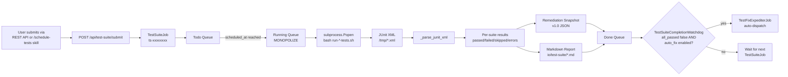

# Test-Suite Scheduling Guide

> **Audience**: Lupin operators scheduling test runs and developers integrating with `/api/test-suite/submit`
>
> **Scope**: `src/cosa/agents/test_suite/`, the `/schedule-tests` skill, `POST /api/test-suite/submit`, remediation snapshot schema v1.0
>
> **Last Updated**: 2026-04-10
>
> **See Also**:
> - [Test Fix Expediter Guide](test-fix-expediter-guide.md) — TFE consumes the remediation snapshots TestSuiteJob produces
> - [Bug Fix Expediter Guide](bug-fix-expediter-guide.md) — if a TestSuiteJob crashes rather than completes, BFE picks it up from the dead queue
> - [Shared Fix Primitives Reference](shared-fix-primitives-reference.md) — shared machinery across both expediters
> - Skill: `~/.claude/skills/schedule-tests/SKILL.md` — voice-driven scheduling workflow (user-global Claude Code skill, outside the project tree)

---

## Table of Contents

1. [What the TestSuiteJob Does](#1-what-the-testsuitejob-does)
2. [Supported Suite Types](#2-supported-suite-types)
3. [Architecture](#3-architecture)
4. [The `/schedule-tests` Skill](#4-the-schedule-tests-skill)
5. [REST API: `/api/test-suite/submit`](#5-rest-api-apitest-suitesubmit)
6. [Remediation Snapshot Schema (v1.0)](#6-remediation-snapshot-schema-v10)
7. [Monopolize Mode](#7-monopolize-mode)
8. [Cost Model](#8-cost-model)
9. [Interaction with TFE](#9-interaction-with-tfe)
10. [Troubleshooting](#10-troubleshooting)

---

## 1. What the TestSuiteJob Does

The **`TestSuiteJob`** is an agentic job that wraps the existing shell-script-based
test runners (`run-unit-tests.sh`, `run-integration-tests.sh`, `run-e2e-ui-tests.sh`,
etc.) into the CJ Flow queue system. It handles:

- **Scheduling**: cron-like future execution via the `scheduled_at` field
- **Monopolize mode**: exclusive access to the database during hot-swapped test config
- **Cancellation**: graceful subprocess termination mid-run
- **Voice notifications**: cosa-voice breadcrumbs + completion announcements
- **JUnit XML parsing**: structured result aggregation from the pytest `--junit-xml` output
- **Remediation snapshot emission**: schema-v1.0 JSON artifact listing every failure for downstream consumption (primarily by TFE)
- **Markdown test report**: human-readable Markdown summary at `io/test-suite/YYYY.MM.DD-at-HH:MM-EST-{suites}-results.md`

**Source**: `src/cosa/agents/test_suite/job.py` defines `TestSuiteJob(AgenticJobBase)`
with `JOB_TYPE = "test_suite"`, `JOB_PREFIX = "ts"`.

**Why a dedicated job type?** Before the TestSuiteJob, running the test pyramid
required manual `pytest` invocations or ad-hoc cron entries. Now the test runner
is a first-class citizen in CJ Flow: it reports progress via WebSocket, can be
cancelled from the Activity Log, produces structured result artifacts, and — via
TFE — can trigger automated remediation on failure.

---

## 2. Supported Suite Types

| Type | Script path | Default timeout | Typical runtime | Test count |
|------|-------------|-----------------|-----------------|------------|
| `unit` | `src/tests/run-unit-tests.sh` | 300s (5 min) | ~3 min | ~6700 tests |
| `smoke` | `src/tests/run-smoke-tests.sh` | 3600s (60 min) | ~40 min | ~340 tests (excludes destructive `test_proxy_integration.py` — own :8000 venue) |
| `smoke_direct` | `src/tests/run-smoke-direct.sh` | 1200s (20 min) | ~10-20 min | Phase D live pipeline |
| `websocket` | `src/scripts/run-websocket-smoke-tests.sh` | 300s (5 min) | ~3 min | ~50 tests |
| `integration` | `src/tests/run-integration-tests.sh` | 2000s (33 min) | ~17 min | ~358 tests (320 passed + 38 skipped on ts-b51e63c9) |
| `e2e` | `src/scripts/run-e2e-ui-tests.sh` | 3000s (50 min) | ~34 min | ~593 tests |
| `all` | `src/tests/run-all-tests.sh` | 3600s (60 min) | ~1.5-2 h across legs | Full pyramid (expands into per-leg runs, each with its own budget) |
| `presentation` | `src/tests/run-presentation-regression.sh` | 1800s (30 min) | ~10-30 min | Presentation regression |

**Source**: `SUITE_SCRIPTS` and `SUITE_TIMEOUTS_SECONDS` dicts at the top of
`src/cosa/agents/test_suite/job.py`.

**Multi-suite runs**: the `test_types` parameter is a list. Pass
`["integration", "e2e"]` to run both sequentially; the job aggregates results
across all requested suites in a single Markdown report and a single remediation
snapshot.

**The `all` suite**: internally runs a curated pyramid (unit → smoke → websocket →
integration → e2e) via `run-all-tests.sh`. Prefer `all` over manually passing
`["unit", "smoke", "websocket", "integration", "e2e"]` because `all` uses a
single optimized invocation path.

### Cancellation

`TestSuiteJob` supports cancellation mid-run. When a cancel request comes in via
the queue (e.g., user clicks "Cancel" on the Activity Log card or submits another
monopolize request that conflicts), the subprocess running pytest is sent SIGTERM,
waited on with a 10-second grace period, then SIGKILLed if still alive.
Cancellation produces a partial result dict with `exit_code=-1` and
`error="Cancelled by user"`.

---

## 3. Architecture



### Between-suites DB isolation (invariant — bug 8bd20375)

When a single `TestSuiteJob` runs **multiple** suites (`test_types=["all"]` →
`unit → smoke → websocket → integration → e2e`, or any explicit multi-suite
list), all legs execute back-to-back against **one shared** `lupin_db_test`.
The per-test `clean_test_db` fixture cannot defend a later suite against the
**residue** an earlier suite left in the DB — most acutely `refresh_tokens`,
whose duplicate `jti` makes the next suite's login fail `500 "Token already
exists"` (the e2e→integration flood, RED `ts-2230937c`).

**Invariant**: the sweep loop (`_execute`) calls `_reset_state_between_suites()`
**in every gap between adjacent suites — before each suite after the first,
never before the first, never after the last, and never at all for a
single-suite run** (`_between_suite_pairs()` yields exactly `len(suites)-1`
seams). Each reset deletes non-protected users and TRUNCATEs the residue tables
(the `_BETWEEN_SUITE_TRUNCATE_TABLES` superset, which **includes
`refresh_tokens`**); protected companion rows survive.

A literal container bounce is impossible here — the sweep runs *inside* the
test container, so bouncing it would self-kill the job. The reset is therefore
an **in-process** truncate against the hot-swapped test engine, guarded by the
same `lupin_db_test`-only safety assert as `clean_test_db`: on any non-test DB
(e.g. a multi-suite run submitted to the `:7999` dev server) it is a logged
**NO-OP**, never a destructive op on dev data. A reset failure is non-fatal —
the per-test `clean_test_db` (which also TRUNCATEs `refresh_tokens`) is the
finer-grained backstop.

> The concurrent-fleet-writer class — other agentic jobs writing
> `lupin_db_test` *during* a suite (not at the seam) — is a **separate** bug
> (`caf58f71`); between-suites isolation does not close it.

---

## 4. The `/schedule-tests` Skill

The `/schedule-tests` skill at `~/.claude/skills/schedule-tests/SKILL.md` is the
canonical voice-driven entry point for scheduled test runs. The user says
something like "run the tests at 11pm" and the skill:

1. **Parses the time and scope** from the user's utterance
2. **Resolves the time to ISO datetime** in the project timezone (`app timezone`
   INI key, default `America/New_York`)
3. **Confirms via cosa-voice** with a `ask_yes_no()` gate
4. **Authenticates** against the Lupin FastAPI server using
   `LUPIN_TEST_INTERACTIVE_MOCK_JOBS_EMAIL` / `LUPIN_TEST_INTERACTIVE_MOCK_JOBS_PASSWORD`
   env vars (same credentials as the smoke tests)
5. **Submits** a POST to `/api/test-suite/submit` with `test_types`, `scheduled_at`,
   and `monopolize=True`
6. **Confirms scheduling** via a `notify()` call announcing the job ID and scheduled
   time

### Typical user phrases

| User says | Skill parses |
|-----------|--------------|
| "Schedule tests for 11pm" | scope=`all`, time=23:00 tonight (or tomorrow if past) |
| "Run E2E tests at midnight" | scope=`e2e`, time=00:00 tomorrow |
| "Schedule integration tests in 2 hours" | scope=`integration`, time=now+2h |
| "Run the full suite tonight" | scope=`all`, time=23:00 (default "tonight") |
| "Test at midnight" | scope=`all`, time=00:00 tomorrow |

### Credentials

The skill reads credentials from (in priority order):

1. Environment variables: `LUPIN_TEST_INTERACTIVE_MOCK_JOBS_EMAIL`,
   `LUPIN_TEST_INTERACTIVE_MOCK_JOBS_PASSWORD`
2. Fallback: `~/.lupin/config` with `[lupin]` section

See `src/tests/AUTH-TESTING-GUIDE.md` for credential setup.

### Why a skill, not a REST endpoint alone?

The skill is a **Claude Code workflow**, not a deployable agent. It's meant to be
invoked interactively by the user via voice (e.g., during a wrap-up session) to
schedule a scheduled run without manually constructing the JSON payload. The
underlying mechanism is still the REST API — the skill is just friendlier
glue-code for the common case.

For programmatic/non-Claude-Code invocation, use the REST API directly (next section).

---

## 5. REST API: `/api/test-suite/submit`

**Endpoint**: `POST /api/test-suite/submit`

**Auth**: Bearer token via `/auth/login`. Same credentials as any other
authenticated Lupin API.

**Request body**:

```json
{
  "test_types":   "integration,e2e",
  "pytest_args":  "-v -k test_auth",
  "scheduled_at": "2026-04-10T23:00:00-04:00",
  "monopolize":   true,
  "dry_run":      false
}
```

| Field | Type | Required | Default | Purpose |
|-------|------|----------|---------|---------|
| `test_types` | string (comma-separated) or list | Yes | — | Suite types to run. See [Section 2](#2-supported-suite-types). |
| `pytest_args` | string or list | No | `""` | Extra pytest args passed through to the script. `--bg` flag is stripped (harmful for subprocess runs). |
| `scheduled_at` | ISO datetime string | No | now | When to run the job. Past times run immediately. Honors project timezone. |
| `monopolize` | bool | No | `true` | Exclusive DB access — only one monopolize job runs at a time. Required for most test suites due to DB hot-swap. |
| `dry_run` | bool | No | `false` | Simulate execution without running tests. Returns synthetic success. |

**Response**:

```json
{
  "job_id": "ts-abc12345",
  "status": "queued",
  "scheduled_at": "2026-04-10T23:00:00-04:00",
  "test_types": ["integration", "e2e"],
  "monopolize": true
}
```

**Polling**: Use `GET /api/get-queue/{queue}` where `queue ∈ {todo, run, done, dead}`
to find your job. Or watch the Activity Log in the web UI for real-time updates.

**Full endpoint schema**: available via the interactive Swagger UI at `/docs` on
the running server. The schema lives in `src/lupin_app/main.py`'s router
registration.

### Direct invocation via `/api/push`

The TestSuiteJob can also be submitted via the generic agentic job submission
endpoint:

```bash
curl -X POST http://localhost:7999/api/push \
  -H "Authorization: Bearer ${TOKEN}" \
  -H "Content-Type: application/json" \
  -d '{
    "question": "agent router go to test suite",
    "args": {
      "test_types": "all",
      "dry_run": "false"
    }
  }'
```

This is what the live E2E driver at `src/tests/e2e/run-tfe-live-e2e.sh` uses to
bootstrap its test runs.

---

## 6. Remediation Snapshot Schema (v1.0)

When a `TestSuiteJob` completes with any failures, it writes a structured JSON
artifact that describes every failure. This artifact is what TFE consumes.

**File location**: `io/test-suite/YYYY.MM.DD-at-HH:MM-TZ-{suites}-remediation.json`

**Schema**:

```json
{
  "schema_version": "1.0",
  "timestamp":      "2026.04.10-at-14:53-EDT",
  "suites_run":     ["integration", "e2e"],
  "summary": {
    "total_passed":   523,
    "total_failed":   12,
    "total_skipped":  3,
    "total_errors":   0,
    "all_passed":     false
  },
  "failures": [
    {
      "classname": "src.tests.e2e_ui.test_visual_regression.TestVisualRegression",
      "name":      "test_visual_page[login]",
      "type":      "FAILED",
      "message":   "Snapshots DO NOT match: login.png",
      "traceback": "File \"src/tests/e2e_ui/test_visual_regression.py\", line 42, in test_visual_page\n    ...",
      "suite":     "e2e"
    },
    ...
  ]
}
```

### Field reference

| Field | Type | Purpose |
|-------|------|---------|
| `schema_version` | string | Always `"1.0"`. TFE's snapshot loader checks this — other versions are rejected. |
| `timestamp` | string | When the run started (filename-safe format). |
| `suites_run` | list[string] | Suite types actually executed. Usually matches the `test_types` input but may differ if some were skipped. |
| `summary.total_passed` | int | Total passing tests across all suites. |
| `summary.total_failed` | int | Total failed tests across all suites. |
| `summary.total_skipped` | int | Total skipped tests. |
| `summary.total_errors` | int | Errors (fixture failures, collection errors) — distinct from failed. |
| `summary.all_passed` | bool | `true` iff failed+errors == 0. TFE's watchdog only fires when this is `false`. |
| `failures` | list[dict] | One entry per failing test. Empty list when `all_passed=true`. |
| `failures[].classname` | string | Dotted Python path to the test class (or module for free functions). |
| `failures[].name` | string | Test function name, including `[param]` suffix for parametrized tests. |
| `failures[].type` | string | `"FAILED"` (assertion) or `"ERROR"` (fixture/setup/collection). |
| `failures[].message` | string | Pytest failure message (first line of the traceback). |
| `failures[].traceback` | string | Full Python traceback as emitted by pytest. |
| `failures[].suite` | string | Which of `suites_run` this failure came from. |

### Producer

The snapshot is built by `TestSuiteJob._execute()` after all suites have finished.
The JUnit XML emitted by pytest (via `--junit-xml=/tmp/{suite}-junit-{timestamp}.xml`)
is parsed by `_parse_junit_xml()` into per-suite result dicts, then aggregated into
the top-level snapshot structure.

### Consumer

The `TestSuiteCompletionWatchdog` reads the snapshot from `job.artifacts["remediation_snapshot"]`
immediately after the TestSuiteJob is pushed to the done queue. If the snapshot is
valid and `all_passed=false`, it dispatches a TFE job with a pointer to the
snapshot file path.

TFE's `snapshot_loader.load_from_artifacts()` then re-reads the snapshot, validates
the schema version, strips PII from tracebacks, and builds a `TestRemediationContext`
that Phase 0 clustering consumes. See the [TFE guide Phase 0 section](test-fix-expediter-guide.md#phase-0-cluster).

---

## 7. Monopolize Mode

**What it is**: `monopolize=True` declares that the job needs exclusive DB access
during its run. The `RunningFifoQueue` consumer enforces this — only one
monopolize job runs at a time, and other monopolize jobs wait in the todo queue
even if regular (non-monopolize) jobs could otherwise run in parallel.

**Why tests need it**: Lupin's test suites hot-swap the database configuration at
startup. The `run-integration-tests.sh` and `run-e2e-ui-tests.sh` scripts
temporarily reconfigure `lupin-app.ini` to point at the test DB, run pytest, then
restore the original config. If two test runs overlapped, they'd race on the
config file and produce non-deterministic results.

**When it's set**: `TestSuiteJob.__init__()` always passes `monopolize=True` to
the parent `AgenticJobBase`. You can't turn it off — it's a hard requirement for
test runs. Non-monopolize jobs (deep research, podcast generator, etc.) coexist
with a running TestSuiteJob, but NO other monopolize job can start until the
TestSuiteJob finishes.

**Scheduling conflicts**: if you schedule two TestSuiteJobs for 23:00, they'll run
sequentially — the second one starts when the first finishes. The queue consumer
doesn't try to split them or warn you; it just serializes them.

**User-facing implications**:

- Schedule monopolize-heavy runs for off-hours (overnight, weekends)
- Cancel rather than submit a second monopolize job if you realize the first
  will be wrong
- Avoid scheduling an `e2e` run that will overlap with a known long-running
  integration test

---

## 8. Cost Model

Test suites are **pytest subprocess** workloads — they don't invoke Claude API
unless your tests themselves do. Direct Claude API cost of a TestSuiteJob is
effectively **zero**.

However, there are indirect costs:

1. **Compute time** on your machine — the subprocess runs locally; you pay CPU +
   disk I/O but no cloud bill.
2. **TFE auto-fix** (if enabled) — when a test suite fails and TFE takes over,
   TFE's Phase 1/2/3 consume Claude API budget up to
   `test fix expediter cost cap usd` (default $15 per TFE run). See the
   [TFE guide §8 Cost Model](test-fix-expediter-guide.md#6-ini-reference).
3. **Validation rerun** triggered by TFE Phase 6 — this submits a *new*
   TestSuiteJob targeting the affected suites, which itself has the same cost
   profile (nearly $0 direct, risk of triggering TFE again if clusters remain
   unfixed — though the recursion guard prevents cascading).

**Typical cost per scheduled run**: $0 if tests pass, up to $15 if TFE fires.
Auto-fix is **on by default** as of Session 1cfcdf73 (`test fix expediter auto
fix enabled = true`); set the per-run `auto_fix_on_failure: false` override on
`/api/test-suite/submit` (or uncheck the test runner UI checkbox) to suppress
TFE for an individual run without changing the INI.

**Budget discipline**: if you're running the full pyramid nightly, you're looking
at $0 per run on green days and up to $15 on red days. Over a month of 30
nightly runs averaging 2 red days: $30 per month. Tune
`test fix expediter cost cap usd` downward if that's too high for your budget.

---

## 9. Interaction with TFE

As of Session 1cfcdf73 (2026-04-10), `test fix expediter auto fix enabled = true`
is the default. Every TestSuiteJob that lands in the done queue is evaluated by
`TestSuiteCompletionWatchdog`. If the job's remediation snapshot shows failures,
the watchdog auto-dispatches a TFE job. The TFE job then walks Phases 0-6 as
described in the [TFE guide](test-fix-expediter-guide.md).

**Per-run override**: pass `auto_fix_on_failure: false` in the
`/api/test-suite/submit` body (or uncheck the test runner UI checkbox) to skip
TFE on a single submission without changing the INI default. Pass
`auto_fix_on_failure: true` to force-enable TFE for one run when the INI default
is `false`. Omitting the field uses the INI default.

**The recursion guard** is critical: TFE's Phase 6 validation rerun creates a new
TestSuiteJob with `metadata["triggered_by_tfe"] = <tfe_job_id>`. When the rerun
completes, the watchdog sees the metadata flag and refuses to dispatch another
TFE. This is the ONLY thing preventing an infinite rerun loop.

**What if I want manual control?** Either flip
`test fix expediter auto fix enabled = false` globally in the INI, or use the
per-run `auto_fix_on_failure: false` override on individual submissions. To
trigger a TFE run manually after suppressing the watchdog, submit it directly
via the REST API:

```bash
curl -X POST http://localhost:7999/api/push \
  -H "Authorization: Bearer ${TOKEN}" \
  -H "Content-Type: application/json" \
  -d '{
    "question": "agent router go to test fix expediter",
    "args": {
      "remediation_snapshot_path": "io/test-suite/2026.04.10-at-14:53-EDT-e2e-remediation.json",
      "source_test_suite_job_id":  "ts-abc12345",
      "original_test_types":       "e2e",
      "dry_run":                   "false"
    }
  }'
```

Manual submission bypasses the watchdog entirely. Useful for:

- **Curated fixes**: review the snapshot first, decide whether to let TFE try
- **Retry after a failed TFE run**: if TFE failed Phase 3 once, you can re-submit
  manually after investigating
- **Testing TFE in isolation**: submit against a known-good snapshot fixture from
  `src/tests/fixtures/tfe/`

**What if a TestSuiteJob crashes rather than completes?** Then it lands in the
dead queue and **BFE** (not TFE) picks it up. The dead queue path is for agentic
jobs that crashed; the done queue path is for agentic jobs that completed with
failures. These are distinct code paths with distinct watchdogs.

---

## 10. Troubleshooting

### TestSuiteJob is queued but never runs

**Check 1**: Is there another monopolize job ahead of it? Check the run queue for
anything with `monopolize=true`. If yes, wait for it to finish.

**Check 2**: Is the `scheduled_at` in the future? Jobs wait in the todo queue
until the clock catches up.

**Check 3**: Is the FastAPI server actually running? `curl http://localhost:7999/health`.

### TestSuiteJob crashes at startup

The shell script may be missing or the pytest invocation may fail before running
any tests. Check `/tmp/{suite}-junit-*.xml` for partial output. Check the FastAPI
log for `[TestSuiteJob] Running: bash ...` lines showing the exact command.

Common causes:
- **Script path wrong**: `SUITE_SCRIPTS` dict in `job.py` points at a moved script
- **Permissions**: script not executable (`chmod +x`)
- **Missing dependencies**: pytest plugins uninstalled, Playwright browsers missing

### Remediation snapshot is empty when tests clearly failed

**Check 1**: Is the JUnit XML being produced? `/tmp/{suite}-junit-*.xml` should
exist. If not, `--junit-xml` arg isn't being passed — check `_run_suite()` in
`job.py`.

**Check 2**: Is `_parse_junit_xml()` finding the `<testsuite>` elements?
Malformed XML can cause silent parse failures. Inspect the file manually.

**Check 3**: Is the snapshot being persisted to `artifacts["remediation_snapshot"]`?
Check the job instance after completion: `job.artifacts.get("remediation_snapshot")`.

### Test suites are running but TFE never fires

**Check 1**: `test fix expediter auto fix enabled = true`? And was the
submission's `auto_fix_on_failure` field omitted (or set to `true`)? Passing
`auto_fix_on_failure: false` on the submission disables TFE for that run only,
even when the INI default is `true`.

**Check 2**: Is the snapshot `all_passed = false`? If all tests actually passed,
there's nothing for TFE to fix.

**Check 3**: Are both watchdogs initialized? Look for the unified summary at
server startup: `[Watchdogs] BFE=ENABLED, TFE=ENABLED`. Absent or showing
`DISABLED` → `init_watchdogs()` in `src/cosa/rest/watchdogs.py` wasn't reached
or one of the watchdog constructors raised. Check the FastAPI startup log.

**Check 4**: Is the metadata recursion guard tripped? Check
`completed_job.metadata.get("triggered_by_tfe")` — if set, the watchdog skips.

See also [TFE guide §8 troubleshooting](test-fix-expediter-guide.md#8-troubleshooting).

### Overlapping scheduled runs

Two TestSuiteJobs scheduled for 23:00 run **sequentially**, not in parallel. The
second one starts when the first finishes. If both take 30 minutes, the second
finishes around 23:30-0:00.

**Fix**: Stagger your scheduled times. Use `scheduled_at` with explicit timestamps
rather than relative times like "in 2 hours" that might collide.

### Timezone confusion

All times are stored as **ISO datetime strings with explicit timezone offsets**
(e.g., `2026-04-10T23:00:00-04:00`). The `/schedule-tests` skill reads
`app timezone` from `lupin-app.ini` (default `America/New_York`) when parsing
user utterances like "11pm."

If you see jobs running at unexpected times, check:
1. Is `app timezone` set correctly in `lupin-app.ini`?
2. Is your laptop's timezone correct?
3. Did daylight saving time just change? EDT vs EST matters.

Report filenames use EST/EDT via `ZoneInfo("America/New_York")` with the `%Z`
format specifier, so you can tell the suffix from filenames directly.

### Cancellation hangs

If you click "Cancel" on a running TestSuiteJob and nothing happens for more than
10 seconds, the subprocess may be ignoring SIGTERM. The poll loop in `_run_suite()`
sends `process.terminate()`, waits 10s, then `process.kill()`. If it's stuck,
`ps` for the PID manually and kill it:

```bash
ps -ef | grep run-e2e-ui-tests
kill -9 <pid>
```

The TestSuiteJob will then return a cancelled result dict.

---

## Related Documentation

- **[Test Fix Expediter Guide](test-fix-expediter-guide.md)** — TFE consumes remediation snapshots produced here
- **[Bug Fix Expediter Guide](bug-fix-expediter-guide.md)** — BFE handles crashed TestSuiteJobs (dead queue path)
- **[Shared Fix Primitives Reference](shared-fix-primitives-reference.md)** — shared expediter machinery
- **[REST API Reference](../rest-api-reference.md)** — `/api/test-suite/submit` and `/api/push` endpoints
- **`/schedule-tests` skill**: `~/.claude/skills/schedule-tests/SKILL.md` — voice-driven scheduling
- **`src/tests/AUTH-TESTING-GUIDE.md`** — test credentials + env var setup
- **Live E2E driver**: `src/tests/e2e/run-tfe-live-e2e.sh` — bash script that exercises TestSuiteJob → TFE end-to-end
- **R&D**: [`src/rnd/v0.1.6/2026.03.31-test-suite-agentic-job-plan.md`](../../rnd/v0.1.6/2026.03.31-test-suite-agentic-job-plan.md) — original design doc
