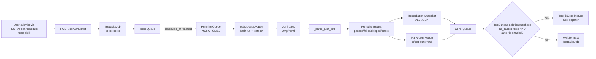

> Part 2 of 5 of the [Test-Suite Scheduling Guide](../test-suite-scheduling-guide.md): architecture and the /schedule-tests skill.

## 3. Architecture

### Between-suites DB isolation (invariant)

A single `TestSuiteJob` can run **multiple** suites. One case is `test_types=["all"]` →
`smoke → websocket → integration → e2e`, after the unit tier that a container leaves to the host.
The other is any explicit multi-suite list. All legs execute back-to-back against **one shared** `lupin_db_test`.
The per-test `clean_test_db` fixture cannot defend a later suite against the
**residue** an earlier suite left in the DB. Most acutely `refresh_tokens`,
whose duplicate `jti` makes the next suite's login fail `500 "Token already
exists"` (the e2e→integration flood, red).

**Invariant**: the sweep loop (`_execute`) calls `_reset_state_between_suites()`
**in every gap between adjacent suites**. It runs before each suite after the first,
never before the first and never after the last. It never runs for a
single-suite run (`_between_suite_pairs()` yields exactly `len(suites)-1`
seams). Each reset deletes non-protected users and TRUNCATEs the residue tables
(the `_BETWEEN_SUITE_TRUNCATE_TABLES` superset, which **includes
`refresh_tokens`**); protected companion rows survive.

`job_history` is not in that truncate. It is cleared by row. The rule lives in
`cosa.rest.job_history_cleanup`, which the two `clean_test_db` fixtures use as well.

**What survives a seam:** a row that is `pending` and whose `scheduled_at` is still in the future.
That is a job scheduled behind the sweep and waiting for a restart to restore it.

**What does not:** a pending row with no, past or unreadable `scheduled_at`, and any `running`,
`completed` or `failed` row, including the sweep's own row. The table is locked for the
read and the delete. A lock that cannot be had within 15 seconds fails the reset.

A literal container bounce is impossible here. The sweep runs *inside* the
test container, so bouncing it would self-kill the job. The reset is therefore
an **in-process** truncate against the hot-swapped test engine. It is guarded by the
same `lupin_db_test`-only safety assert as `clean_test_db`. On any non-test DB it is a logged
**no-op**, never a destructive op on dev data. An example is a multi-suite run submitted to the `:7999` dev server. A reset failure is **fatal**. It
raises `BetweenSuiteResetError` and the sweep stops before the next suite. A
suite on an unreset database would report on the previous suite's rows. The truncate
set must also be closed under foreign keys. Postgres refuses to truncate a
table another table references unless that table is in the same statement. The
unit test `test_the_truncate_set_is_closed_under_foreign_keys` fails when a table
with a foreign key into the set is missing from it.

> The concurrent-fleet-writer class — other agentic jobs writing
> `lupin_db_test` *during* a suite (not at the seam) — is a **separate** bug
>. Between-suites isolation does not close it.

---

## 4. The `/schedule-tests` Skill

The `/schedule-tests` skill at `~/.claude/skills/schedule-tests/SKILL.md` is the
canonical voice-driven entry point for scheduled test runs. The user says
something like "run the tests at 11pm" and the skill:

1. **Parses the time and scope** from the user's utterance
2. **Resolves the time to ISO datetime** in the project timezone (`app timezone`
   INI key, default `America/New_York`)
3. **Confirms via cosa-voice** with a `ask_yes_no()` gate
4. **Authenticates** against the Lupin FastAPI server using
   `LUPIN_TEST_INTERACTIVE_MOCK_JOBS_EMAIL` / `LUPIN_TEST_INTERACTIVE_MOCK_JOBS_PASSWORD`
   env vars (same credentials as the smoke tests)
5. **Submits** a POST to `/api/v2/submit` (test-suite command) with `test_types`, `scheduled_at`. And `monopolize=True`
6. **Confirms scheduling** via a `notify()` call announcing the job ID and scheduled
   time

### Typical user phrases

| User says | Skill parses |
|-----------|--------------|
| "Schedule tests for 11pm" | scope=`all`, time=23:00 tonight (or tomorrow if past) |
| "Run E2E tests at midnight" | scope=`e2e`, time=00:00 tomorrow |
| "Schedule integration tests in 2 hours" | scope=`integration`, time=now+2h |
| "Run the full suite tonight" | scope=`all`, time=23:00 (default "tonight") |
| "Test at midnight" | scope=`all`, time=00:00 tomorrow |

### Credentials

The skill reads credentials from (in priority order):

1. Environment variables: `LUPIN_TEST_INTERACTIVE_MOCK_JOBS_EMAIL`,
   `LUPIN_TEST_INTERACTIVE_MOCK_JOBS_PASSWORD`
2. Fallback: `~/.lupin/config` with `[lupin]` section

See `src/tests/AUTH-TESTING-GUIDE.md` for credential setup.

### Why a skill, not a REST endpoint alone?

The skill is a **Claude Code workflow**, not a deployable agent. It's meant to be
invoked interactively by the user via voice (e.g., during a wrap-up session). It
schedules a run without the user constructing the JSON payload. The
underlying mechanism is still the REST API — the skill is just friendlier
glue-code for the common case.

For programmatic/non-Claude-Code invocation, use the REST API directly (next section).

---
