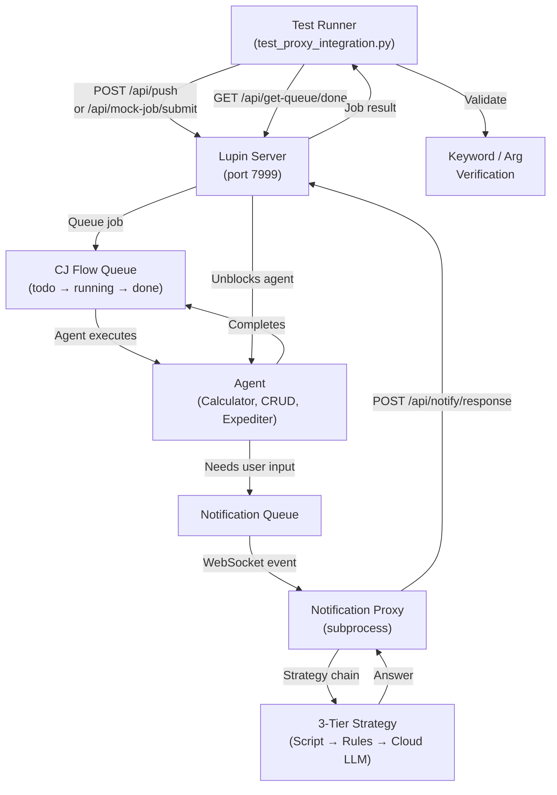
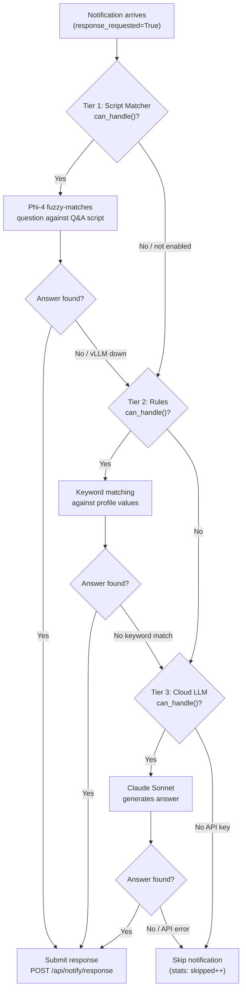
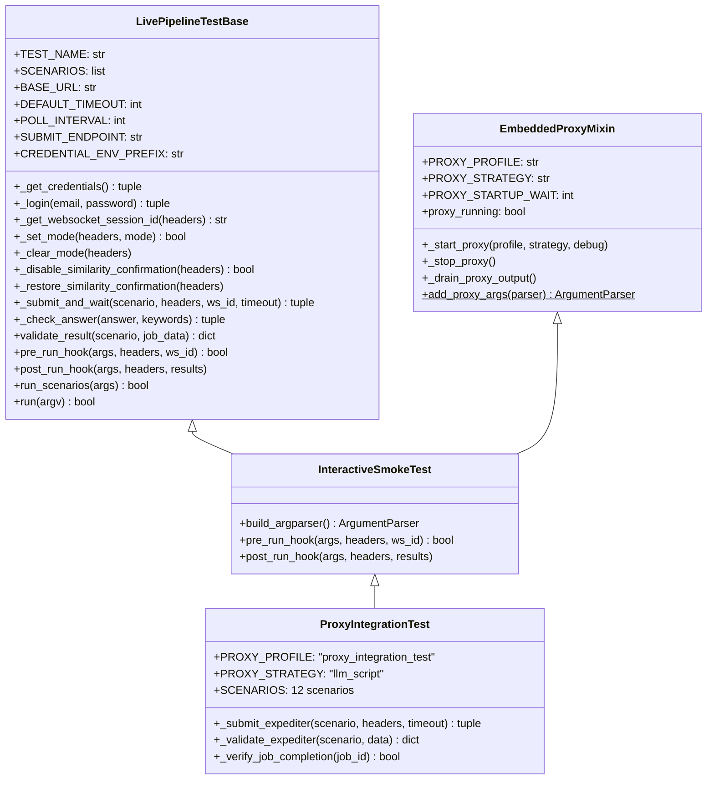
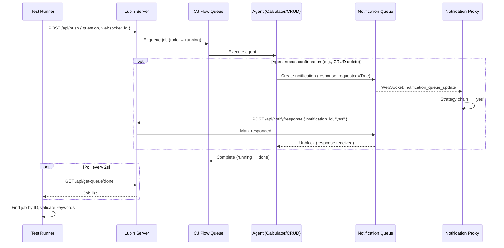
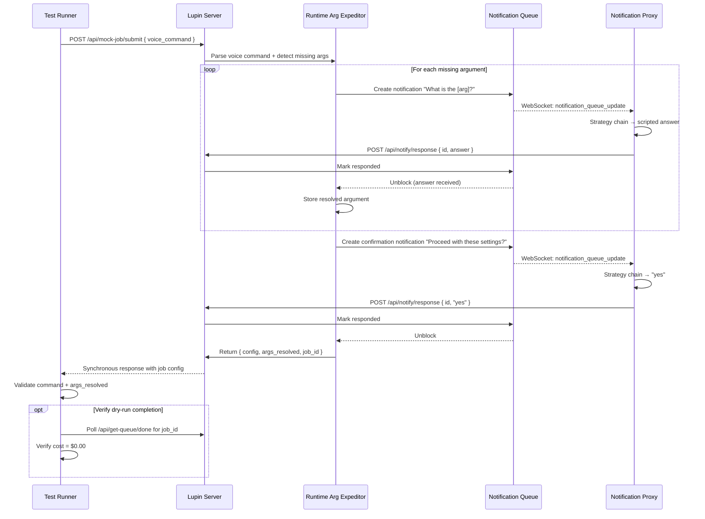

# Automated Interactive Testing Guide

> Comprehensive reference for Lupin's notification proxy testing system.
> Covers architecture, strategy chain, test profiles, Q&A scripts, base classes,
> scenario authoring, CLI reference, and troubleshooting.
>
> **Last Updated**: 2026-02-14
> **Status**: Current

---

## Table of Contents

1. [Overview & Purpose](#1-overview--purpose)
2. [Architecture](#2-architecture)
3. [Strategy Chain (3-Tier)](#3-strategy-chain-3-tier)
4. [Test Profiles](#4-test-profiles)
5. [Q&A Scripts (JSON Format)](#5-qa-scripts-json-format)
6. [Response Type Handling](#6-response-type-handling)
7. [Base Classes & Mixins](#7-base-classes--mixins)
8. [Writing New Scenarios](#8-writing-new-scenarios)
9. [The Integration Test (test_proxy_integration.py)](#9-the-integration-test-test_proxy_integrationpy)
10. [CLI Reference](#10-cli-reference)
11. [Environment Variables](#11-environment-variables)
12. [Execution Flow (End-to-End)](#12-execution-flow-end-to-end)
13. [Troubleshooting](#13-troubleshooting)
14. [Related Documentation](#14-related-documentation)

---

## 1. Overview & Purpose

### What Problem Automated Interactive Testing Solves

Agentic jobs (deep research, podcast generation, CRUD operations) interact with
users through **response-required notifications**: "What topic should I research?",
"Are you sure you want to delete this?" These prompts block until a human responds.

Manual testing of these flows is slow, non-repeatable, and requires a human operator
per run. The **notification proxy** + **test framework** solve this by:

1. **Auto-answering notifications** — A proxy agent connects via WebSocket, intercepts
   response-required notifications, and submits scripted answers automatically.
2. **Submit-and-poll validation** — Test runners submit queries via REST API, poll the
   done queue for results, and validate outputs against expected keywords.
3. **End-to-end coverage** — From voice command parsing through argument resolution,
   job execution, and result verification — all without a human in the loop.

### When You Need It

| Scenario | Example |
|----------|---------|
| Agentic jobs with user prompts | Deep research asks "What topic?" before starting |
| CRUD confirmations | Delete operation asks "Are you sure?" before proceeding |
| Expediter argument resolution | Runtime Argument Expeditor asks for missing CLI args |
| Multi-agent pipelines | Research-to-Podcast chains two agents, each with prompts |

### How It Fits into the 5-Surface Validation Ladder

The automated interactive testing system maps to **Surface 2** and **Surface 3** of the
agentic voice workflow's testing ladder (see `src/workflow/agentic-voice-workflow.md`):

| Surface | What It Tests | Proxy Needed? |
|---------|---------------|---------------|
| Surface 1: Unit + Smoke | Individual functions, strategy logic | No |
| **Surface 2: Mock Job Endpoint** | **Expediter arg resolution via `/api/mock-job/submit`** | **Yes** |
| **Surface 3: Live Pipeline** | **Full submit → queue → agent → result cycle** | **Yes (for interactive agents)** |
| Surface 4: PEFT Training | LORA classifier accuracy | No |
| Surface 5: Voice Routing | ASR → LORA → Queue | No (but proxy helps for interactive agents) |

---

## 2. Architecture

### System Diagram



### Component Map

| Component | File | Purpose |
|-----------|------|---------|
| Notification Proxy CLI | `src/cosa/agents/notification_proxy/__main__.py` | Standalone proxy agent entry point |
| Proxy Config | `src/cosa/agents/notification_proxy/config.py` | Profiles, defaults, credentials, LLM config |
| Responder | `src/cosa/agents/notification_proxy/responder.py` | Strategy routing + REST response submission |
| Script Matcher Strategy | `src/cosa/agents/notification_proxy/strategies/llm_script_matcher.py` | Tier 1: Phi-4 fuzzy matching |
| Rules Strategy | `src/cosa/agents/notification_proxy/strategies/expediter_rules.py` | Tier 2: Keyword-based rules |
| LLM Fallback Strategy | `src/cosa/agents/notification_proxy/strategies/llm_fallback.py` | Tier 3: Claude Sonnet cloud LLM |
| XML Models | `src/cosa/agents/notification_proxy/xml_models.py` | Pydantic XML response parsing |
| WebSocket Listener | `src/cosa/agents/notification_proxy/listener.py` | WebSocket connection + event dispatch |
| Voice IO | `src/cosa/agents/notification_proxy/voice_io.py` | Voice notification helpers |
| Verification | `src/cosa/agents/notification_proxy/verification.py` | LLM answer verification |
| Live Pipeline Base | `src/tests/smoke/utilities/live_pipeline_base.py` | Auth, session, submit/poll, validation framework |
| Embedded Proxy Mixin | `src/tests/smoke/utilities/embedded_proxy.py` | Auto-launch proxy as subprocess |
| Interactive Smoke Test | `src/tests/smoke/utilities/interactive_smoke_test.py` | Combined base class (pipeline + proxy) |
| Integration Test | `src/tests/smoke/test_proxy_integration.py` | 12-scenario integration test |
| Q&A Scripts | `src/conf/notification-proxy-scripts/*.json` | Scripted answers per agent profile |
| Prompt Templates | `src/conf/prompts/notification-proxy-*.txt` | LLM prompt templates for script matching |

### How the Embedded Proxy Subprocess Works

When `--auto-proxy` is passed to a test, the `EmbeddedProxyMixin`:

1. Builds the command: `python -m cosa.agents.notification_proxy --profile <p> --strategy <s>`
2. Launches via `subprocess.Popen` with `os.setsid()` for process group isolation
3. Waits `PROXY_STARTUP_WAIT` seconds (default: 5) for the proxy to authenticate
4. Checks that the process didn't exit prematurely
5. After all scenarios complete, sends `SIGINT` → waits 10s → `SIGTERM` → `SIGKILL`
6. Drains proxy stdout for statistics summary

---

## 3. Strategy Chain (3-Tier)

The notification proxy uses a 3-tier strategy chain to generate answers. Each tier
implements the same interface: `can_handle( notification )` → `bool` and
`respond( notification )` → `str | dict | None`.

### Decision Flow



### Tier Details

| Tier | Strategy | Model | Speed | Deterministic? | When Used |
|------|----------|-------|-------|----------------|-----------|
| 1 | `LlmScriptMatcherStrategy` | Phi-4 14B (local vLLM) | ~200ms | Semi (LLM selects from script) | Default for testing |
| 2 | `ExpediterRuleStrategy` | None (keyword matching) | <1ms | Yes | Fallback when vLLM unavailable |
| 3 | `LLMFallbackStrategy` | Claude Sonnet 4.5 (Anthropic API) | ~1-3s | No (generative) | Last resort / unknown questions |

### Strategy Selection Modes

| Mode | Tier 1 | Tier 2 | Tier 3 | Use Case |
|------|--------|--------|--------|----------|
| `llm_script` (default) | Yes | No | Yes | Testing with local vLLM available |
| `rules` | No | Yes | Yes | Testing without vLLM (lighter weight) |
| `auto` | Yes (if available) | Yes (fallback) | Yes | Production proxy — graceful degradation |

---

## 4. Test Profiles

### What Profiles Are

A test profile is a named dictionary in `config.py:TEST_PROFILES` that maps argument
names to default responses. The rules strategy uses profiles directly for keyword-matched
answers. The script matcher strategy uses the profile name to locate Q&A script files.

### Profile Location

```python
# src/cosa/agents/notification_proxy/config.py
TEST_PROFILES = {
    "deep_research"          : { ... },
    "podcast"                : { ... },
    "research_to_podcast"    : { ... },
    "all_agents"             : { ... },
    "expeditor_smoke"        : { ... },
    "minimal"                : { ... },
    "crud"                   : { ... },
    "proxy_integration_test" : { ... },
}
```

### Complete Profile Reference

| Profile | Description | Key Arguments |
|---------|-------------|---------------|
| `deep_research` | Deep research agent expediter questions | query, budget, audience, audience_context |
| `podcast` | Podcast generator expediter questions | research, audience, audience_context, languages |
| `research_to_podcast` | Chained research + podcast workflow | query, budget, audience, audience_context, languages |
| `all_agents` | Union profile for multi-agent testing | Superset of all above |
| `expeditor_smoke` | 13-scenario smoke test matrix | Superset with agent-scoped entries |
| `minimal` | Required arguments only | query, research, confirmation |
| `crud` | CRUD operation confirmations | confirmation (yes/no) |
| `proxy_integration_test` | Integration test union profile | Superset for Calculator + CRUD + Expediter |

### How to Create a New Profile

1. **Add the profile dict** to `TEST_PROFILES` in `config.py`:

```python
"your_agent" : {
    "description" : "Auto-answer for your agent's expediter questions",
    "arg_name_1"  : "default answer 1",
    "arg_name_2"  : "default answer 2",
}
```

2. **Create the Q&A script** at `src/conf/notification-proxy-scripts/your-agent.json`
   (see [Section 5](#5-qa-scripts-json-format))

3. **Optionally add entries** to `all-agents.json` for combined testing

### Profile → Q&A Script Mapping Convention

The `--profile` CLI flag maps to a script filename by replacing underscores with dashes:

```
--profile deep_research       → deep-research.json
--profile podcast             → podcast.json
--profile research_to_podcast → research-to-podcast.json
--profile all_agents          → all-agents.json
--profile proxy_integration_test → proxy-integration-test.json
```

This conversion is handled by `resolve_script_path()` in the script matcher strategy.

---

## 5. Q&A Scripts (JSON Format)

Q&A scripts are JSON files that define question-answer pairs for the Phi-4 script
matcher. They live in `src/conf/notification-proxy-scripts/`.

### Schema Reference

```json
{
    "profile_name" : "your_agent",
    "description"  : "Human-readable description of this script",
    "sender_ids"   : [ "arg.expeditor@lupin.deepily.ai" ],
    "entries"      : [
        {
            "question_pattern" : "What topic would you like me to research?",
            "answer"           : "quantum computing breakthroughs 2026",
            "arg_name"         : "query",
            "response_types"   : [ "open_ended", "open_ended_batch" ],
            "agents"           : [ "deep_research" ]
        }
    ]
}
```

### Entry Fields

| Field | Type | Required | Description |
|-------|------|----------|-------------|
| `question_pattern` | string | Yes | Question text to match (semantic, not exact) |
| `answer` | string | Yes | Scripted answer to return when matched |
| `arg_name` | string | Yes | CLI argument name this answer corresponds to |
| `response_types` | array | Yes | Which response types this entry handles |
| `agents` | array | No | Agent names this entry applies to (multi-agent scripts only) |
| `_comment` | string | No | Internal note (stripped before use) |

### The `_template.json` Starter

Copy `src/conf/notification-proxy-scripts/_template.json` to create new scripts:

```bash
cp src/conf/notification-proxy-scripts/_template.json \
   src/conf/notification-proxy-scripts/your-agent.json
```

Then fill in the profile name, sender IDs, and entries.

### How Multi-Agent Scripts Work

When testing multiple agents in a single proxy session, the optional `agents` field
scopes entries to specific agents:

**Universal entries** (no `agents` field) apply to any agent:

```json
{
    "question_pattern" : "Who is the target audience?",
    "answer"           : "academic",
    "arg_name"         : "audience",
    "response_types"   : [ "open_ended", "open_ended_batch", "multiple_choice" ]
}
```

**Agent-scoped entries** apply only to the listed agents:

```json
{
    "question_pattern" : "What topic would you like me to research?",
    "answer"           : "quantum computing breakthroughs 2026",
    "arg_name"         : "query",
    "response_types"   : [ "open_ended", "open_ended_batch" ],
    "agents"           : [ "deep_research" ]
}
```

The proxy extracts the agent name from the notification's `abstract` field (pattern:
`"**Agent**: Deep Research"`) and filters entries accordingly. When no agent context is
detected, all entries (universal + agent-scoped) are considered.

### Available Script Files

| File | Entries | Senders | Purpose |
|------|---------|---------|---------|
| `_template.json` | 3 | expeditor | Template for new scripts |
| `minimal.json` | 3 | expeditor | Required args only |
| `deep-research.json` | 5 | expeditor | Deep research agent |
| `podcast.json` | 5 | expeditor | Podcast generator |
| `research-to-podcast.json` | 6 | expeditor | Chained workflow |
| `expeditor-smoke.json` | 8 | expeditor | 13-scenario smoke matrix |
| `crud.json` | 2 | crud.agent | CRUD confirmations |
| `all-agents.json` | 10 | expeditor + crud.agent | Multi-agent union |
| `proxy-integration-test.json` | 10 | expeditor + crud.agent | Integration test union |

### How to Add Entries for New Agent Types

1. **Find the agent's questions** in `src/cosa/agents/runtime_argument_expeditor/agent_registry.py`
   (look at `fallback_questions` for each agent)
2. **Create one entry per question** in a new JSON script file
3. **Always include a confirmation entry** (`yes_no` type)
4. **Register the profile** in `config.py:TEST_PROFILES`
5. **Optionally duplicate entries** into `all-agents.json` with the `agents` field

---

## 6. Response Type Handling

### Response Types

| Type | Description | Example Question |
|------|-------------|------------------|
| `yes_no` | Binary yes/no decision | "Are you sure you want to delete this?" |
| `open_ended` | Free-form text input | "What topic would you like to research?" |
| `open_ended_batch` | Multiple questions on one screen | "Topic? Budget? Audience?" (all at once) |
| `multiple_choice` | Select from predefined options | "Who is the target audience? [academic/general/technical]" |

### How Each Type Maps Through Each Strategy Tier

| Response Type | Tier 1 (Script Matcher) | Tier 2 (Rules) | Tier 3 (Cloud LLM) |
|---------------|-------------------------|-----------------|---------------------|
| `yes_no` | LLM selects from script entries | Always returns `"yes"` | LLM generates `"yes"` or `"no"` |
| `open_ended` | LLM matches question to script entry | Keyword → profile value lookup | LLM generates 1-2 sentence answer |
| `open_ended_batch` | Batch prompt with all questions | JSON `{"answers": {...}}` from profile | Not supported (skipped) |
| `multiple_choice` | LLM selects from options + script | First available option selected | LLM selects option label |

### Sender ID Validation

All strategies use **prefix-based matching** with `#session` suffix stripping:

```
Incoming:  "arg.expeditor@lupin.deepily.ai#wise-penguin"
Stripped:  "arg.expeditor@lupin.deepily.ai"
Matches:   DEFAULT_ACCEPTED_SENDERS = [ "arg.expeditor@lupin.deepily.ai" ]
```

The `#session` suffix is appended by conversation identity routing and is ignored for
matching purposes. This allows the proxy to work regardless of which session originated
the notification.

---

## 7. Base Classes & Mixins

### Class Hierarchy



### LivePipelineTestBase API

**File**: `src/tests/smoke/utilities/live_pipeline_base.py` (876 lines)

Provides the complete infrastructure for live pipeline testing:

| Category | Methods |
|----------|---------|
| **Authentication** | `_get_credentials()`, `_login()` |
| **Session** | `_get_websocket_session_id()` |
| **Mode management** | `_set_mode()`, `_clear_mode()` |
| **Config management** | `_disable_similarity_confirmation()`, `_restore_similarity_confirmation()` |
| **Submit + poll** | `get_submit_endpoint()`, `get_submit_payload()`, `_submit_and_wait()` |
| **Validation** | `_check_answer()`, `validate_result()` |
| **Reporting** | `get_table_columns()`, `_print_results_table()` |
| **Hooks** | `pre_run_hook()`, `post_run_hook()`, `get_scenario_indices()`, `get_mode_for_scenario()` |
| **Orchestration** | `run_scenarios()`, `run()` |

**Key design pattern**: Template Method — subclasses override hooks to customize behavior
while the base class manages the execution skeleton.

### EmbeddedProxyMixin API

**File**: `src/tests/smoke/utilities/embedded_proxy.py` (231 lines)

| Method | Returns | Description |
|--------|---------|-------------|
| `proxy_running` (property) | `bool` | Whether the proxy subprocess is alive |
| `_start_proxy( profile, strategy, debug )` | `None` | Launch proxy as subprocess with process group isolation |
| `_stop_proxy()` | `None` | Graceful shutdown: SIGINT → SIGTERM → SIGKILL |
| `_drain_proxy_output()` | `None` | Read remaining stdout, print proxy statistics |
| `add_proxy_args( parser )` (static) | `parser` | Add `--auto-proxy` and `--proxy-debug` flags |

**Subclass configuration** (override these class attributes):

```python
PROXY_PROFILE      = "deep_research"   # Which notification profile to use
PROXY_STRATEGY     = "llm_script"      # Strategy mode for the proxy
PROXY_STARTUP_WAIT = 5                 # Seconds to wait for proxy authentication
```

### InteractiveSmokeTest

**File**: `src/tests/smoke/utilities/interactive_smoke_test.py` (85 lines)

Trivial bridge class combining both parents:

```python
class InteractiveSmokeTest( LivePipelineTestBase, EmbeddedProxyMixin ):
    def pre_run_hook( self, args, headers, ws_id ):
        if getattr( args, "auto_proxy", False ):
            self._start_proxy( debug=getattr( args, "proxy_debug", False ) )
        return True

    def post_run_hook( self, args, headers, results ):
        self._stop_proxy()
```

---

## 8. Writing New Scenarios

### Scenario Dict Schema

Each scenario is a Python dict in the `SCENARIOS` list:

```python
{
    "id"                : "calc_unit_convert",      # Unique identifier
    "group"             : "calculator",              # Group name for filtering
    "query"             : "How many miles is 10 km?", # Text to submit (Calculator/CRUD)
    "voice_command"     : "...",                      # Voice command text (Expediter)
    "mode"              : "calculator",               # Mode to set before submission
    "expected_keywords" : [ "6.21", "6.2" ],          # Keywords to find in response
    "expected_args"     : { "query" : "..." },        # Expected resolved args (Expediter)
    "expected_status"   : [ "added", "duplicate" ],   # Acceptable status values (CRUD)
    "needs_confirm"     : True,                       # Whether proxy must auto-confirm
    "expect_cancel"     : False,                      # Whether cancellation is expected
    "timeout"           : 120,                        # Override default timeout
    "instructions"      : "...",                      # Human-readable test description
}
```

Not all fields are required — they depend on the scenario group.

### Calculator / CRUD Pattern (Submit-and-Poll)

```python
{
    "id"                : "crud_add_todo",
    "group"             : "crud",
    "query"             : "Add buy groceries to my to do list",
    "mode"              : "todo",
    "expected_keywords" : [ "groceries", "added" ],
    "expected_status"   : [ "added", "duplicate" ],
}
```

**Flow**: POST `/api/push` → poll `/api/get-queue/done` → keyword validation

### Expediter Pattern (Synchronous)

```python
{
    "id"             : "exp_deep_research",
    "group"          : "expediter",
    "voice_command"  : "Do deep research on quantum computing breakthroughs in 2026",
    "expected_args"  : { "query" : "quantum computing breakthroughs 2026" },
    "expect_cancel"  : False,
    "instructions"   : "Tests deep research arg extraction + proxy auto-answer",
}
```

**Flow**: POST `/api/mock-job/submit` → synchronous response with config + args → arg
validation → optional job completion polling

### Idempotency Considerations

CRUD operations may encounter "already exists" responses on repeated runs. The
`expected_status` field accepts multiple values to handle this:

```python
"expected_status" : [ "added", "duplicate" ]  # Both are acceptable
```

---

## 9. The Integration Test (test_proxy_integration.py)

### 12-Scenario Matrix

| # | ID | Group | Query / Voice Command | Validation |
|---|-----|-------|----------------------|------------|
| 0 | `calc_unit_convert` | calculator | "How many miles is 10 km?" | Keyword: "6.21" |
| 1 | `calc_mortgage` | calculator | "Monthly payment on $300k mortgage..." | Keyword: "mortgage" |
| 2 | `calc_price_compare` | calculator | "Compare prices: 12oz for $3.99..." | Keyword: "per" |
| 3 | `crud_add_todo` | crud | "Add buy groceries to my to do list" | Status: added/duplicate |
| 4 | `crud_add_calendar` | crud | "Add dentist appointment to my calendar..." | Status: added/duplicate |
| 5 | `crud_list_todo` | crud | "Show me my to do list" | Keyword: "groceries" |
| 6 | `crud_delete_todo` | crud | "Delete buy groceries from my to do list" | Keyword: "deleted" |
| 7 | `crud_list_calendar` | crud | "Show me my calendar" | Keyword: "dentist" |
| 8 | `exp_deep_research` | expediter | "Do deep research on quantum computing..." | Args: query matched |
| 9 | `exp_podcast` | expediter | "Generate a podcast from the latest research" | Args: research matched |
| 10 | `exp_research_to_podcast` | expediter | "Research AI safety and turn it into a podcast" | Args: query matched |
| 11 | `exp_deep_research_full` | expediter | "Research renewable energy breakthroughs" | Args: query + all resolved |

### Group Filtering

```python
GROUP_SCENARIOS = {
    "calculator" : [ 0, 1, 2 ],
    "crud"       : [ 3, 4, 5, 6, 7 ],
    "expediter"  : [ 8, 9, 10, 11 ],
    "all"        : list( range( 12 ) ),
}
```

Use `--group` or `--scenarios` to select which scenarios to run (see
[Section 10](#10-cli-reference)).

### The Incremental Execution Strategy

When testing iteratively, run scenarios in this order:

| Step | Command | What It Validates |
|------|---------|-------------------|
| 1 | `--group calculator --no-confirm` | Basic pipeline (no proxy needed) |
| 2 | `--group crud --auto-proxy --no-confirm` | CRUD + proxy auto-confirmation |
| 3 | `--scenarios 6 --auto-proxy --no-confirm` | Delete operation specifically |
| 4 | `--group expediter --auto-proxy --no-confirm` | Expediter arg resolution + proxy |
| 5 | `--group all --auto-proxy --no-confirm` | Full integration |
| 6 | (via pytest) `pytest test_proxy_integration.py` | CI/CD gate |

### How `LUPIN_INTERACTIVE_TESTS` Gates Expediter Scenarios

Expediter scenarios (indices 8-11) require `LUPIN_INTERACTIVE_TESTS=true` in the
environment. Without it:

- The test prints a warning about skipped scenarios
- Expediter indices are filtered out of the run
- Only calculator + CRUD scenarios execute

This prevents CI/CD pipelines from accidentally running expensive LLM-dependent tests.

---

## 10. CLI Reference

### test_proxy_integration.py Flags

| Flag | Short | Default | Description |
|------|-------|---------|-------------|
| `--group` | `-g` | `all` | Scenario group: `calculator`, `crud`, `expediter`, `all` |
| `--scenarios` | `-s` | (all) | Comma-separated scenario indices (overrides `--group`) |
| `--auto-proxy` | | `False` | Auto-launch notification proxy as subprocess |
| `--proxy-debug` | | `False` | Enable debug output for the embedded proxy |
| `--no-confirm` | `-nc` | `False` | Disable similarity confirmation (faster execution) |
| `--debug` | `-d` | `False` | Enable test runner debug output |
| `--verbose` | `-v` | `False` | Enable verbose output (implies debug) |

### Notification Proxy CLI Flags

| Flag | Default | Description |
|------|---------|-------------|
| `--host` | `localhost` | Server hostname |
| `--port` | `7999` | Server port |
| `--email` | (env var) | Login email |
| `--password` | (env var) | Login password |
| `--session-id` | `"auto proxy"` | WebSocket session ID |
| `--profile` | `deep_research` | Test profile (from `TEST_PROFILES.keys()`) |
| `--strategy` | `llm_script` | Strategy mode: `llm_script`, `rules`, `auto` |
| `--debug` | `False` | Enable debug output |
| `--verbose` | `False` | Enable verbose output |
| `--dry-run` | `False` | Display notifications without answering |

### Complete Command Examples

```bash
# Calculator only (no proxy needed)
python src/tests/smoke/test_proxy_integration.py --group calculator --no-confirm

# CRUD with auto-proxy
python src/tests/smoke/test_proxy_integration.py --group crud --auto-proxy --no-confirm

# Full integration (requires LUPIN_INTERACTIVE_TESTS=true for expediter)
LUPIN_INTERACTIVE_TESTS=true \
python src/tests/smoke/test_proxy_integration.py --group all --auto-proxy --no-confirm

# Specific scenarios only
python src/tests/smoke/test_proxy_integration.py --scenarios 0,3,8 --auto-proxy

# With proxy debug output
python src/tests/smoke/test_proxy_integration.py --group expediter --auto-proxy --proxy-debug

# Standalone proxy (manual mode, separate terminal)
python -m cosa.agents.notification_proxy --profile proxy_integration_test --strategy llm_script

# Proxy with rules strategy (no vLLM needed)
python -m cosa.agents.notification_proxy --profile deep_research --strategy rules

# Proxy dry-run mode (display without answering)
python -m cosa.agents.notification_proxy --profile all_agents --dry-run

# Via pytest (CI/CD)
pytest src/tests/smoke/test_proxy_integration.py -v
```

---

## 11. Environment Variables

| Variable | Purpose | Required When |
|----------|---------|---------------|
| `LUPIN_ROOT` | Project root directory | Always (for PYTHONPATH setup) |
| `LUPIN_TEST_INTERACTIVE_MOCK_JOBS_EMAIL` | Unified test account email | All test types |
| `LUPIN_TEST_INTERACTIVE_MOCK_JOBS_PASSWORD` | Unified test account password | All test types |
| `LUPIN_INTERACTIVE_TESTS` | Set to `"true"` to enable expediter scenarios | Expediter tests |
| `ANTHROPIC_API_KEY` | Anthropic API key (for Tier 3 cloud LLM fallback) | Only if Tier 3 needed |

**Credential priority** for proxy authentication: CLI args → environment variables → config defaults.

**Unified credentials** (Session 267): All test types — Calculator, CRUD, Expediter, and proxy — use the
`LUPIN_TEST_INTERACTIVE_MOCK_JOBS_*` prefix. This ensures test runner and proxy authenticate as the same user
(same WebSocket channel), preventing proxy notification delivery failures.

---

## 12. Execution Flow (End-to-End)

### Calculator / CRUD Path



### Expediter Path (with Arg Resolution)



### Proxy Statistics Interpretation

After each test run, the proxy prints statistics:

```
╔═══════════════════════════════════════════╗
║          Proxy Statistics                 ║
╠═══════════════════════════════════════════╣
║  Notifications received:  8              ║
║  Responses sent:          8              ║
║  Script matcher used:     6              ║
║  Rules used:              0              ║
║  LLM used:                2              ║
║  Skipped:                 0              ║
║  Errors:                  0              ║
╚═══════════════════════════════════════════╝
```

| Metric | Meaning | Concern If |
|--------|---------|------------|
| `notifications_received` | Total events processed | 0 → proxy not receiving (auth/sender mismatch) |
| `responses_sent` | Successful submissions | < received → some answers failed to submit |
| `script_matcher_used` | Tier 1 answered | 0 when using `llm_script` strategy → vLLM likely down |
| `rules_used` | Tier 2 answered | Should be 0 with `llm_script` strategy |
| `llm_used` | Tier 3 answered | High count → script entries may be insufficient |
| `skipped` | No strategy matched | > 0 → missing script entries or unknown question type |
| `errors` | Failed API submissions | > 0 → server connectivity or auth issue |

---

## 13. Troubleshooting

### Proxy Received 0 Notifications

**Symptom**: Proxy starts successfully but `notifications_received` stays at 0.

**Causes**:
1. **Sender ID mismatch** — The proxy's `accepted_senders` don't match the notification
   sender. Check `config.py:DEFAULT_ACCEPTED_SENDERS` and the Q&A script's `sender_ids`.
2. **Wrong profile** — The profile's script doesn't include the sender for the agent
   type being tested. Use `proxy_integration_test` or `all_agents` for multi-agent tests.
3. **Authentication failure** — Proxy logged in with wrong credentials. Check
   `LUPIN_TEST_INTERACTIVE_MOCK_JOBS_EMAIL` and `_PASSWORD`.
4. **WebSocket not connected** — Check proxy startup output for "connected" message.
5. **Different user context** — Notifications are user-scoped; the proxy must be logged
   in as the same user (or same email) that the test submits jobs under.

### Delete Cancelled Instead of Confirmed

**Symptom**: CRUD delete scenario returns "cancelled" instead of "deleted".

**Causes**:
1. **CRUD routing issue** — The Q&A script's `sender_ids` may not include
   `crud.agent@lupin.deepily.ai`. Check `crud.json` or `proxy-integration-test.json`.
2. **Script entry mismatch** — The delete confirmation question doesn't match any script
   entry. Add: `"Are you sure you want to delete"` to the script.
3. **Notification timeout** — The proxy was too slow to respond and the notification
   timed out with a default "no" / cancel. Increase timeout on the server side.

### Script Matcher Low Confidence

**Symptom**: Tier 1 (script matcher) falls through to Tier 2 or 3 more than expected.

**Causes**:
1. **Entry patterns too vague** — Make `question_pattern` entries more specific and closer
   to the actual question text the agent sends.
2. **Missing entries** — The agent is asking questions not covered by the script. Check
   `agent_registry.py:fallback_questions` for the agent and add matching entries.
3. **vLLM overloaded** — High latency causes timeouts. Check vLLM server health.

### Timeout Waiting for Job

**Symptom**: Test times out polling `/api/get-queue/done`.

**Causes**:
1. **Server not running** — Verify Lupin is running on port 7999.
2. **LLM server down** — Agents that use vLLM (calculator, CRUD intent extraction) need
   the local LLM server running. Check vLLM health.
3. **Proxy not answering** — If the agent is blocked on a notification and the proxy isn't
   responding, the job will never complete. Check proxy statistics.
4. **Wrong mode** — Calculator queries need "calculator" mode; CRUD needs "todo" or
   "calendar" mode. Verify `get_mode_for_scenario()` returns the correct mode.

### Expediter Health Check Failed

**Symptom**: `GET /api/mock-job/health` returns non-200 or `available: false`.

**Causes**:
1. **Missing mock job endpoint** — The `/api/mock-job/submit` router may not be registered.
   Check that `mock_job.py` is imported in the FastAPI app.
2. **LLM server down** — The expediter uses vLLM for argument extraction. If unavailable,
   the health check may report `available: false`.

---

## 14. Related Documentation

| Document | Description |
|----------|-------------|
| [`src/docs/notification-api.md`](notification-api.md) | One-stop reference for the notification system — architecture, REST API, WebSocket events, proxy overview |
| [`src/workflow/agentic-voice-workflow.md`](../workflow/agentic-voice-workflow.md) | Complete lifecycle guide for building agentic background jobs with voice I/O |
| [`src/tests/AUTH-TESTING-GUIDE.md`](../tests/AUTH-TESTING-GUIDE.md) | Test credential management patterns |
| [`src/tests/smoke/README.md`](../tests/smoke/README.md) | Quick-start guide for all smoke tests |
| [`src/tests/README.md`](../tests/README.md) | Lupin testing strategy overview (5 tiers) |
| [`src/rnd/2026.02.14-proxy-integration-test-plan.md`](../rnd/2026.02.14-proxy-integration-test-plan.md) | Original test plan for the 12-scenario integration test |
| [`src/rnd/2026.02.10-notification-proxy-agent-design.md`](../rnd/2026.02.10-notification-proxy-agent-design.md) | Original notification proxy design document |
| [`src/rnd/2026.02.13-unified-smoke-test-framework.md`](../rnd/2026.02.13-unified-smoke-test-framework.md) | Unified smoke test framework extraction plan |
| [`src/conf/notification-proxy-scripts/README.md`](../conf/notification-proxy-scripts/README.md) | Q&A script directory documentation |
