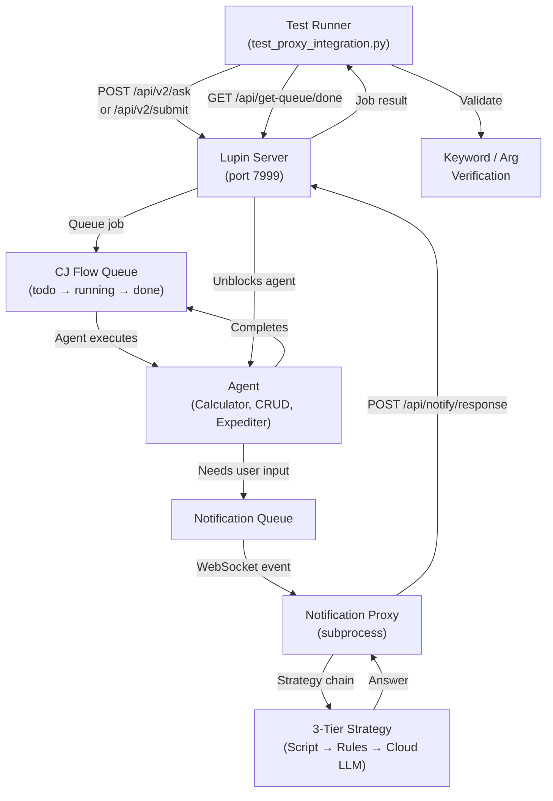
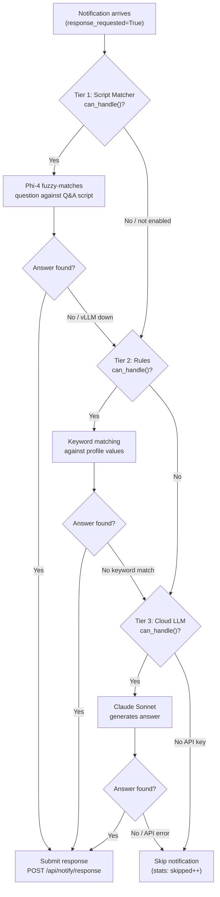

> Part 1 of 3 of the [Automated Interactive Testing Guide](../automated-interactive-testing.md): sections 1 to 4, overview, architecture, strategy chain and profiles.

# Automated Interactive Testing Guide

Comprehensive reference for Lupin's notification proxy testing system.
Covers architecture, strategy chain, test profiles, Q&A scripts, base classes,
scenario authoring, CLI reference, and troubleshooting.

**Last Updated**: 2026-02-14
**Status**: Current

---

## Table of Contents

1. [Overview & Purpose](#1-overview--purpose)
2. [Architecture](#2-architecture)
3. [Strategy Chain (3-Tier)](#3-strategy-chain-3-tier)
4. [Test Profiles](#4-test-profiles)
5. [Q&A Scripts (JSON Format)](02-scripts-responses-and-scenarios.md#5-qa-scripts-json-format)
6. [Response Type Handling](02-scripts-responses-and-scenarios.md#6-response-type-handling)
7. [Base Classes & Mixins](02-scripts-responses-and-scenarios.md#7-base-classes--mixins)
8. [Writing New Scenarios](02-scripts-responses-and-scenarios.md#8-writing-new-scenarios)
9. [The Integration Test (test_proxy_integration.py)](02-scripts-responses-and-scenarios.md#9-the-integration-test-test_proxy_integrationpy)
10. [CLI Reference](03-cli-environment-and-troubleshooting.md#10-cli-reference)
11. [Environment Variables](03-cli-environment-and-troubleshooting.md#11-environment-variables)
12. [Execution Flow (End-to-End)](03-cli-environment-and-troubleshooting.md#12-execution-flow-end-to-end)
13. [Troubleshooting](03-cli-environment-and-troubleshooting.md#13-troubleshooting)
14. [Related Documentation](03-cli-environment-and-troubleshooting.md#14-related-documentation)

---

## 1. Overview & Purpose

### What Problem Automated Interactive Testing Solves

Agentic jobs (deep research, podcast generation, CRUD operations) interact with
users through **response-required notifications**. Examples are "What topic should I research?"
and "Are you sure you want to delete this?" These prompts block until a human responds.

Manual testing of these flows is slow, non-repeatable, and requires a human operator
per run. The **notification proxy** + **test framework** solve this by:

1. **Auto-answering notifications** — A proxy agent connects via WebSocket, intercepts
   response-required notifications, and submits scripted answers automatically.
2. **Submit-and-poll validation** — Test runners submit queries via REST API, poll the
   done queue for results, and validate outputs against expected keywords.
3. **End-to-end coverage** — From voice command parsing through argument resolution,
   job execution, and result verification — all without a human in the loop.

### When You Need It

| Scenario | Example |
|----------|---------|
| Agentic jobs with user prompts | Deep research asks "What topic?" before starting |
| CRUD confirmations | Delete operation asks "Are you sure?" before proceeding |
| Expediter argument resolution | Runtime Argument Expeditor asks for missing CLI args |
| Multi-agent pipelines | Research-to-Podcast chains two agents, each with prompts |

### How It Fits into the 5-Surface Validation Ladder

The automated interactive testing system maps to **Surface 2** and **Surface 3** of the
agentic voice workflow's testing ladder (see `src/workflow/agentic-voice-workflow.md`):

| Surface | What It Tests | Proxy Needed? |
|---------|---------------|---------------|
| Surface 1: Unit + Smoke | Individual functions, strategy logic | No |
| **Surface 2: Mock Job Endpoint** | **Expediter arg resolution via `/api/v2/submit` (`agent router go to mock job`)** | **Yes** |
| **Surface 3: Live Pipeline** | **Full submit → queue → agent → result cycle** | **Yes (for interactive agents)** |
| Surface 4: PEFT Training | LORA classifier accuracy | No |
| Surface 5: Voice Routing | ASR → LORA → Queue | No (but proxy helps for interactive agents) |

---

## 2. Architecture

### System Diagram



### Component Map

| Component | File | Purpose |
|-----------|------|---------|
| Notification Proxy CLI | `src/cosa/agents/notification_proxy/__main__.py` | Standalone proxy agent entry point |
| Proxy Config | `src/cosa/agents/notification_proxy/config.py` | Profiles, defaults, credentials, LLM config |
| Responder | `src/cosa/agents/notification_proxy/responder.py` | Strategy routing + REST response submission |
| Script Matcher Strategy | `src/cosa/agents/notification_proxy/strategies/llm_script_matcher.py` | Tier 1: Phi-4 fuzzy matching |
| Rules Strategy | `src/cosa/agents/notification_proxy/strategies/expediter_rules.py` | Tier 2: Keyword-based rules |
| LLM Fallback Strategy | `src/cosa/agents/notification_proxy/strategies/llm_fallback.py` | Tier 3: Claude Sonnet cloud LLM |
| XML Models | `src/cosa/agents/notification_proxy/xml_models.py` | Pydantic XML response parsing |
| WebSocket Listener | `src/cosa/agents/notification_proxy/listener.py` | WebSocket connection + event dispatch |
| Voice IO | `src/cosa/agents/notification_proxy/voice_io.py` | Voice notification helpers |
| Verification | `src/cosa/agents/notification_proxy/verification.py` | LLM answer verification |
| Live Pipeline Base | `src/tests/smoke/utilities/live_pipeline_base.py` | Auth, session, submit/poll, validation framework |
| Embedded Proxy Mixin | `src/tests/smoke/utilities/embedded_proxy.py` | Auto-launch proxy as subprocess |
| Interactive Smoke Test | `src/tests/smoke/utilities/interactive_smoke_test.py` | Combined base class (pipeline + proxy) |
| Integration Test | `src/tests/smoke/test_proxy_integration.py` | 12-scenario integration test |
| Q&A Scripts | `src/conf/notification-proxy-scripts/*.json` | Scripted answers per agent profile |
| Prompt Templates | `src/conf/prompts/notification-proxy-*.txt` | LLM prompt templates for script matching |

### How the Embedded Proxy Subprocess Works

When `--auto-proxy` is passed to a test, the `EmbeddedProxyMixin`:

1. Builds the command: `python -m cosa.agents.notification_proxy --profile <p> --strategy <s>`
2. Launches via `subprocess.Popen` with `os.setsid()` for process group isolation
3. Waits `PROXY_STARTUP_WAIT` seconds (default: 5) for the proxy to authenticate
4. Checks that the process didn't exit prematurely
5. After all scenarios complete, sends `SIGINT` → waits 10s → `SIGTERM` → `SIGKILL`
6. Drains proxy stdout for statistics summary

---

## 3. Strategy Chain (3-Tier)

The notification proxy uses a 3-tier strategy chain to generate answers. Each tier
implements the same interface: `can_handle( notification )` → `bool` and
`respond( notification )` → `str | dict | None`.

### Decision Flow



### Tier Details

| Tier | Strategy | Model | Speed | Deterministic? | When Used |
|------|----------|-------|-------|----------------|-----------|
| 1 | `LlmScriptMatcherStrategy` | Phi-4 14B (local vLLM) | ~200ms | Semi (LLM selects from script) | Default for testing |
| 2 | `ExpediterRuleStrategy` | None (keyword matching) | <1ms | Yes | Fallback when vLLM unavailable |
| 3 | `LLMFallbackStrategy` | Claude Sonnet 4.5 (Anthropic API) | ~1-3s | No (generative) | Last resort / unknown questions |

### Strategy Selection Modes

| Mode | Tier 1 | Tier 2 | Tier 3 | Use Case |
|------|--------|--------|--------|----------|
| `llm_script` (default) | Yes | No | Yes | Testing with local vLLM available |
| `rules` | No | Yes | Yes | Testing without vLLM (lighter weight) |
| `auto` | Yes (if available) | Yes (fallback) | Yes | Production proxy — graceful degradation |

---

## 4. Test Profiles

### What Profiles Are

A test profile is a named dictionary in `config.py:TEST_PROFILES` that maps argument
names to default responses. The rules strategy uses profiles directly for keyword-matched
answers. The script matcher strategy uses the profile name to locate Q&A script files.

### Profile Location

```python
# src/cosa/agents/notification_proxy/config.py
TEST_PROFILES = {
    "deep_research"          : { ... },
    "podcast"                : { ... },
    "research_to_podcast"    : { ... },
    "all_agents"             : { ... },
    "expeditor_smoke"        : { ... },
    "minimal"                : { ... },
    "crud"                   : { ... },
    "proxy_integration_test" : { ... },
}
```

### Complete Profile Reference

| Profile | Description | Key Arguments |
|---------|-------------|---------------|
| `deep_research` | Deep research agent expediter questions | query, budget, audience, audience_context |
| `podcast` | Podcast generator expediter questions | research, audience, audience_context, languages |
| `research_to_podcast` | Chained research + podcast workflow | query, budget, audience, audience_context, languages |
| `all_agents` | Union profile for multi-agent testing | Superset of all above |
| `expeditor_smoke` | 13-scenario smoke test matrix | Superset with agent-scoped entries |
| `minimal` | Required arguments only | query, research, confirmation |
| `crud` | CRUD operation confirmations | confirmation (yes/no) |
| `proxy_integration_test` | Integration test union profile | Superset for Calculator + CRUD + Expediter |

### How to Create a New Profile

1. **Add the profile dict** to `TEST_PROFILES` in `config.py`:

```python
"your_agent" : {
    "description" : "Auto-answer for your agent's expediter questions",
    "arg_name_1"  : "default answer 1",
    "arg_name_2"  : "default answer 2",
}
```

2. **Create the Q&A script** at `src/conf/notification-proxy-scripts/your-agent.json`
   (see [Section 5](02-scripts-responses-and-scenarios.md#5-qa-scripts-json-format))

3. **Optionally add entries** to `all-agents.json` for combined testing

### Profile → Q&A Script Mapping Convention

The `--profile` CLI flag maps to a script filename by replacing underscores with dashes:

```
--profile deep_research       → deep-research.json
--profile podcast             → podcast.json
--profile research_to_podcast → research-to-podcast.json
--profile all_agents          → all-agents.json
--profile proxy_integration_test → proxy-integration-test.json
```

This conversion is handled by `resolve_script_path()` in the script matcher strategy.

---

