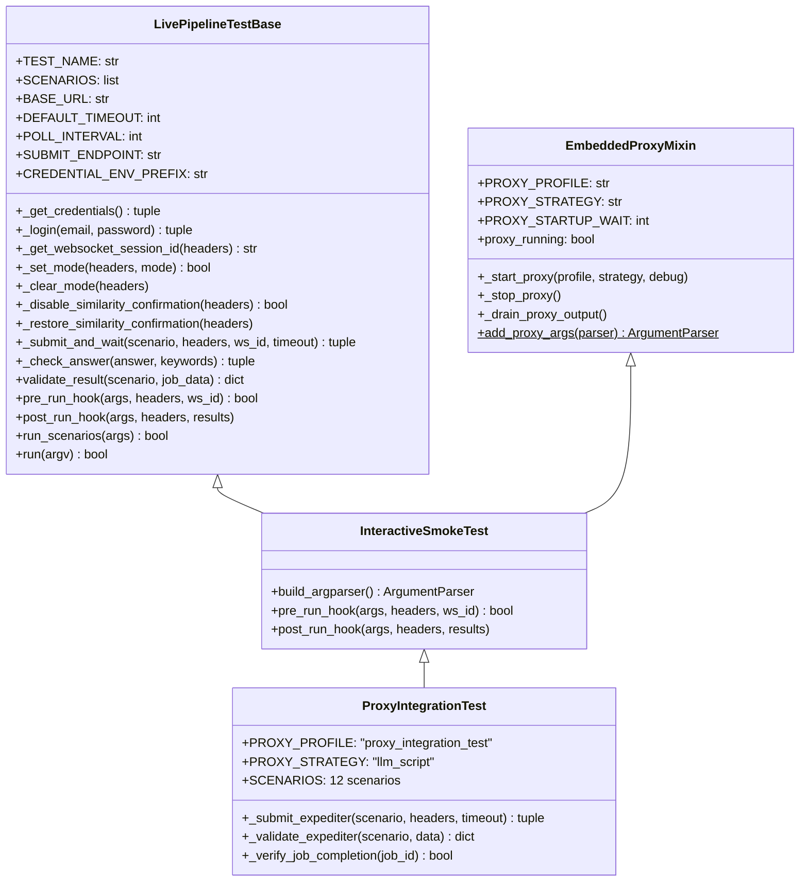

> Part 2 of 3 of the [Automated Interactive Testing Guide](../automated-interactive-testing.md): sections 5 to 9, Q&A scripts, responses, base classes and scenarios.

## 5. Q&A Scripts (JSON Format)

Q&A scripts are JSON files that define question-answer pairs for the Phi-4 script
matcher. They live in `src/conf/notification-proxy-scripts/`.

### Schema Reference

```json
{
    "profile_name" : "your_agent",
    "description"  : "Human-readable description of this script",
    "sender_ids"   : [ "arg.expeditor@lupin.deepily.ai" ],
    "entries"      : [
        {
            "question_pattern" : "What topic would you like me to research?",
            "answer"           : "quantum computing breakthroughs 2026",
            "arg_name"         : "query",
            "response_types"   : [ "open_ended", "open_ended_batch" ],
            "agents"           : [ "deep_research" ]
        }
    ]
}
```

### Entry Fields

| Field | Type | Required | Description |
|-------|------|----------|-------------|
| `question_pattern` | string | Yes | Question text to match (semantic, not exact) |
| `answer` | string | Yes | Scripted answer to return when matched |
| `arg_name` | string | Yes | CLI argument name this answer corresponds to |
| `response_types` | array | Yes | Which response types this entry handles |
| `agents` | array | No | Agent names this entry applies to (multi-agent scripts only) |
| `_comment` | string | No | Internal note (stripped before use) |

### The `_template.json` Starter

Copy `src/conf/notification-proxy-scripts/_template.json` to create new scripts:

```bash
cp src/conf/notification-proxy-scripts/_template.json \
   src/conf/notification-proxy-scripts/your-agent.json
```

Then fill in the profile name, sender IDs, and entries.

### How Multi-Agent Scripts Work

When testing multiple agents in a single proxy session, the optional `agents` field
scopes entries to specific agents:

**Universal entries** (no `agents` field) apply to any agent:

```json
{
    "question_pattern" : "Who is the target audience?",
    "answer"           : "academic",
    "arg_name"         : "audience",
    "response_types"   : [ "open_ended", "open_ended_batch", "multiple_choice" ]
}
```

**Agent-scoped entries** apply only to the listed agents:

```json
{
    "question_pattern" : "What topic would you like me to research?",
    "answer"           : "quantum computing breakthroughs 2026",
    "arg_name"         : "query",
    "response_types"   : [ "open_ended", "open_ended_batch" ],
    "agents"           : [ "deep_research" ]
}
```

The proxy extracts the agent name from the notification's `abstract` field (pattern:
`"**Agent**: Deep Research"`) and filters entries accordingly. When no agent context is
detected, all entries (universal + agent-scoped) are considered.

### Available Script Files

| File | Entries | Senders | Purpose |
|------|---------|---------|---------|
| `_template.json` | 3 | expeditor | Template for new scripts |
| `minimal.json` | 3 | expeditor | Required args only |
| `deep-research.json` | 5 | expeditor | Deep research agent |
| `podcast.json` | 5 | expeditor | Podcast generator |
| `research-to-podcast.json` | 6 | expeditor | Chained workflow |
| `expeditor-smoke.json` | 8 | expeditor | 13-scenario smoke matrix |
| `crud.json` | 2 | crud.agent | CRUD confirmations |
| `all-agents.json` | 10 | expeditor + crud.agent | Multi-agent union |
| `proxy-integration-test.json` | 10 | expeditor + crud.agent | Integration test union |

### How to Add Entries for New Agent Types

1. **Find the agent's questions** in `src/cosa/agents/runtime_argument_expeditor/agent_registry.py`
   (look at `fallback_questions` for each agent)
2. **Create one entry per question** in a new JSON script file
3. **Always include a confirmation entry** (`yes_no` type)
4. **Register the profile** in `config.py:TEST_PROFILES`
5. **Optionally duplicate entries** into `all-agents.json` with the `agents` field

---

## 6. Response Type Handling

### Response Types

| Type | Description | Example Question |
|------|-------------|------------------|
| `yes_no` | Binary yes/no decision | "Are you sure you want to delete this?" |
| `open_ended` | Free-form text input | "What topic would you like to research?" |
| `open_ended_batch` | Multiple questions on one screen | "Topic? Budget? Audience?" (all at once) |
| `multiple_choice` | Select from predefined options | "Who is the target audience? [academic/general/technical]" |

#### The document choice card: its options do not exist until run time

Warning: most `multiple_choice` questions have a fixed option set you can write an answer
against. The expeditor's **document choice card** is different. It asks "Which document should I use for
the …?" and is shown when the file matcher finds 2-to-cap candidates. Its options do not exist until
run time. The option labels are the basenames of whatever documents the user happens to have, discovered
during the run.

**An `answer` naming a file can therefore never match a label.**

The script matcher is told to *"pick the option label that best aligns with the Q&A
script's answer"*, so the entry carries a **directive** instead:

```json
{
  "question_pattern" : "Which document should I use for the presentation?",
  "answer"           : "Pick the first document option in the list — never 'Let me describe it' and never 'Cancel'.",
  "arg_name"         : "source",
  "response_types"   : [ "multiple_choice" ]
}
```

**A missing entry does not error — the run cancels at the card**, which is
indistinguishable from a user declining. That is exactly what happened to a live
presentation job on 2026-08-21 (`[Expeditor] User cancelled at arg 'source'`).
Podcast had been able to show the same card with no
entry either, and simply never landed on 2+ matches in an automated run.

**The `question_pattern` is a key into the code.**

It must stay byte-identical to what
`RuntimeArgumentExpeditor._document_choice_question()` returns for that agent.
`src/tests/unit/test_proxy_scripts_answer_the_choice_card.py` derives the question from
the code and fails if the file disagrees, so the two cannot drift apart in silence.
Any new agent whose args use the `fuzzy_file_match` handler needs an entry here, and
that test is where you add it.

### How Each Type Maps Through Each Strategy Tier

| Response Type | Tier 1 (Script Matcher) | Tier 2 (Rules) | Tier 3 (Cloud LLM) |
|---------------|-------------------------|-----------------|---------------------|
| `yes_no` | LLM selects from script entries | Always returns `"yes"` | LLM generates `"yes"` or `"no"` |
| `open_ended` | LLM matches question to script entry | Keyword → profile value lookup | LLM generates 1-2 sentence answer |
| `open_ended_batch` | Batch prompt with all questions | JSON `{"answers": {...}}` from profile | Not supported (skipped) |
| `multiple_choice` | LLM selects from options + script | First available option selected | LLM selects option label |

### Sender ID Validation

All strategies use **prefix-based matching** with `#session` suffix stripping:

```
Incoming:  "arg.expeditor@lupin.deepily.ai#wise-penguin"
Stripped:  "arg.expeditor@lupin.deepily.ai"
Matches:   DEFAULT_ACCEPTED_SENDERS = [ "arg.expeditor@lupin.deepily.ai" ]
```

The `#session` suffix is appended by conversation identity routing and is ignored for
matching purposes. This allows the proxy to work regardless of which session originated
the notification.

---

## 7. Base Classes & Mixins

### Class Hierarchy



### LivePipelineTestBase API

**File**: `src/tests/smoke/utilities/live_pipeline_base.py` (876 lines)

Provides the complete infrastructure for live pipeline testing:

| Category | Methods |
|----------|---------|
| **Authentication** | `_get_credentials()`, `_login()` |
| **Session** | `_get_websocket_session_id()` |
| **Mode management** | `_set_mode()`, `_clear_mode()` |
| **Config management** | `_disable_similarity_confirmation()`, `_restore_similarity_confirmation()` |
| **Submit + poll** | `get_submit_endpoint()`, `get_submit_payload()`, `_submit_and_wait()` |
| **Validation** | `_check_answer()`, `validate_result()` |
| **Reporting** | `get_table_columns()`, `_print_results_table()` |
| **Hooks** | `pre_run_hook()`, `post_run_hook()`, `get_scenario_indices()`, `get_mode_for_scenario()` |
| **Orchestration** | `run_scenarios()`, `run()` |

**Key design pattern**: Template Method — subclasses override hooks to customize behavior
while the base class manages the execution skeleton.

### EmbeddedProxyMixin API

**File**: `src/tests/smoke/utilities/embedded_proxy.py` (231 lines)

| Method | Returns | Description |
|--------|---------|-------------|
| `proxy_running` (property) | `bool` | Whether the proxy subprocess is alive |
| `_start_proxy( profile, strategy, debug )` | `None` | Launch proxy as subprocess with process group isolation |
| `_stop_proxy()` | `None` | Graceful shutdown: SIGINT → SIGTERM → SIGKILL |
| `_drain_proxy_output()` | `None` | Read remaining stdout, print proxy statistics |
| `add_proxy_args( parser )` (static) | `parser` | Add `--auto-proxy` and `--proxy-debug` flags |

**Subclass configuration** (override these class attributes):

```python
PROXY_PROFILE      = "deep_research"   # Which notification profile to use
PROXY_STRATEGY     = "llm_script"      # Strategy mode for the proxy
PROXY_STARTUP_WAIT = 5                 # Seconds to wait for proxy authentication
```

### InteractiveSmokeTest

**File**: `src/tests/smoke/utilities/interactive_smoke_test.py` (85 lines)

Trivial bridge class combining both parents:

```python
class InteractiveSmokeTest( LivePipelineTestBase, EmbeddedProxyMixin ):
    def pre_run_hook( self, args, headers, ws_id ):
        if getattr( args, "auto_proxy", False ):
            self._start_proxy( debug=getattr( args, "proxy_debug", False ) )
        return True

    def post_run_hook( self, args, headers, results ):
        self._stop_proxy()
```

---

## 8. Writing New Scenarios

### Scenario Dict Schema

Each scenario is a Python dict in the `SCENARIOS` list:

```python
{
    "id"                : "calc_unit_convert",      # Unique identifier
    "group"             : "calculator",              # Group name for filtering
    "query"             : "How many miles is 10 km?", # Text to submit (Calculator/CRUD)
    "voice_command"     : "...",                      # Voice command text (Expediter)
    "mode"              : "calculator",               # Mode to set before submission
    "expected_keywords" : [ "6.21", "6.2" ],          # Keywords to find in response
    "expected_args"     : { "query" : "..." },        # Expected resolved args (Expediter)
    "expected_status"   : [ "added", "duplicate" ],   # Acceptable status values (CRUD)
    "needs_confirm"     : True,                       # Whether proxy must auto-confirm
    "expect_cancel"     : False,                      # Whether cancellation is expected
    "timeout"           : 120,                        # Override default timeout
    "instructions"      : "...",                      # Human-readable test description
}
```

Not all fields are required — they depend on the scenario group.

### Calculator / CRUD Pattern (Submit-and-Poll)

```python
{
    "id"                : "crud_add_todo",
    "group"             : "crud",
    "query"             : "Add buy groceries to my to do list",
    "mode"              : "todo",
    "expected_keywords" : [ "groceries", "added" ],
    "expected_status"   : [ "added", "duplicate" ],
}
```

**Flow**: POST `/api/push` → poll `/api/get-queue/done` → keyword validation

### Expediter Pattern (Synchronous)

```python
{
    "id"             : "exp_deep_research",
    "group"          : "expediter",
    "voice_command"  : "Do deep research on quantum computing breakthroughs in 2026",
    "expected_args"  : { "query" : "quantum computing breakthroughs 2026" },
    "expect_cancel"  : False,
    "instructions"   : "Tests deep research arg extraction + proxy auto-answer",
}
```

**Flow**: POST `/api/v2/submit` (`agent router go to mock job`, `voice_command` in `args`). The response is synchronous, with `submit_details.config` + args.
Then arg validation, then optional job completion polling.

### Idempotency Considerations

CRUD operations may encounter "already exists" responses on repeated runs. The
`expected_status` field accepts multiple values to handle this:

```python
"expected_status" : [ "added", "duplicate" ]  # Both are acceptable
```

---

## 9. The Integration Test (test_proxy_integration.py)

### 12-Scenario Matrix

| # | ID | Group | Query / Voice Command | Validation |
|---|-----|-------|----------------------|------------|
| 0 | `calc_unit_convert` | calculator | "How many miles is 10 km?" | Keyword: "6.21" |
| 1 | `calc_mortgage` | calculator | "Monthly payment on $300k mortgage..." | Keyword: "mortgage" |
| 2 | `calc_price_compare` | calculator | "Compare prices: 12oz for $3.99..." | Keyword: "per" |
| 3 | `crud_add_todo` | crud | "Add buy groceries to my to do list" | Status: added/duplicate |
| 4 | `crud_add_calendar` | crud | "Add dentist appointment to my calendar..." | Status: added/duplicate |
| 5 | `crud_list_todo` | crud | "Show me my to do list" | Keyword: "groceries" |
| 6 | `crud_delete_todo` | crud | "Delete buy groceries from my to do list" | Keyword: "deleted" |
| 7 | `crud_list_calendar` | crud | "Show me my calendar" | Keyword: "dentist" |
| 8 | `exp_deep_research` | expediter | "Do deep research on quantum computing..." | Args: query matched |
| 9 | `exp_podcast` | expediter | "Generate a podcast from the latest research" | Args: research matched |
| 10 | `exp_research_to_podcast` | expediter | "Research AI safety and turn it into a podcast" | Args: query matched |
| 11 | `exp_deep_research_full` | expediter | "Research renewable energy breakthroughs" | Args: query + all resolved |

### Group Filtering

```python
GROUP_SCENARIOS = {
    "calculator" : [ 0, 1, 2 ],
    "crud"       : [ 3, 4, 5, 6, 7 ],
    "expediter"  : [ 8, 9, 10, 11 ],
    "all"        : list( range( 12 ) ),
}
```

Use `--group` or `--scenarios` to select which scenarios to run (see
[Section 10](03-cli-environment-and-troubleshooting.md#10-cli-reference)).

### The Incremental Execution Strategy

When testing iteratively, run scenarios in this order:

| Step | Command | What It Validates |
|------|---------|-------------------|
| 1 | `--group calculator --no-confirm` | Basic pipeline (no proxy needed) |
| 2 | `--group crud --auto-proxy --no-confirm` | CRUD + proxy auto-confirmation |
| 3 | `--scenarios 6 --auto-proxy --no-confirm` | Delete operation specifically |
| 4 | `--group expediter --auto-proxy --no-confirm` | Expediter arg resolution + proxy |
| 5 | `--group all --auto-proxy --no-confirm` | Full integration |
| 6 | (via pytest) `pytest test_proxy_integration.py` | CI/CD gate |

### How `LUPIN_INTERACTIVE_TESTS` Gates Expediter Scenarios

Expediter scenarios (indices 8-11) require `LUPIN_INTERACTIVE_TESTS=true` in the
environment. Without it:

- The test prints a warning about skipped scenarios
- Expediter indices are filtered out of the run
- Only calculator + CRUD scenarios execute

This prevents CI/CD pipelines from accidentally running expensive LLM-dependent tests.

---

