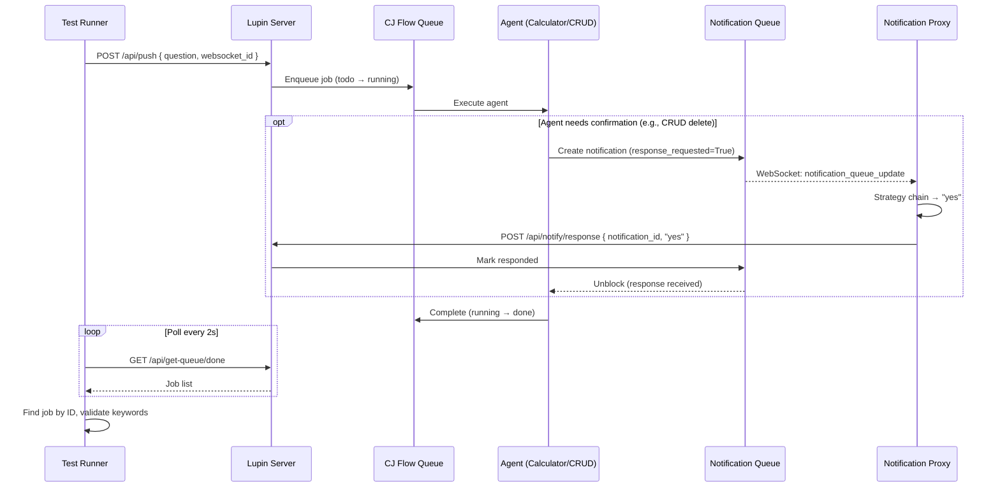
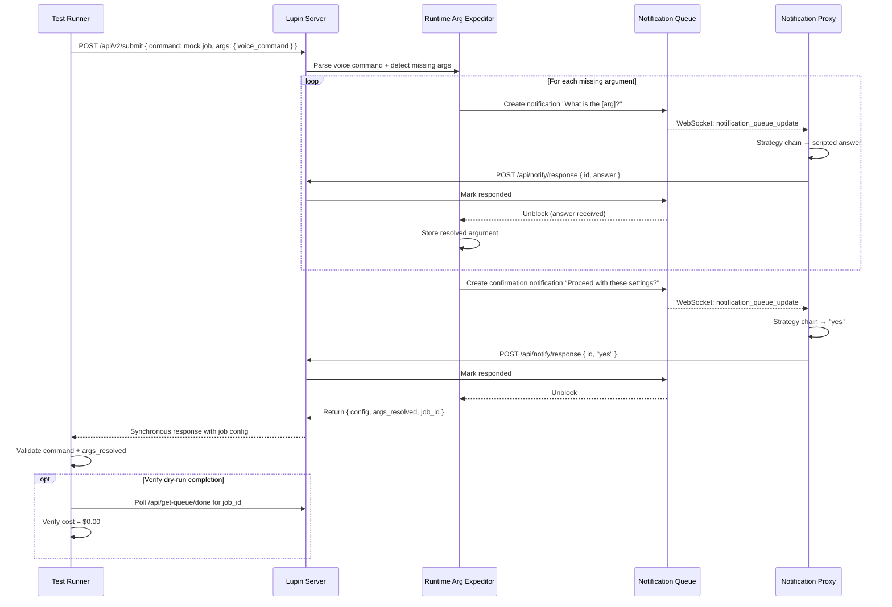

> Part 3 of 3 of the [Automated Interactive Testing Guide](../automated-interactive-testing.md): sections 10 to 14, CLI, environment, execution flow and troubleshooting.

## 10. CLI Reference

### test_proxy_integration.py Flags

| Flag | Short | Default | Description |
|------|-------|---------|-------------|
| `--group` | `-g` | `all` | Scenario group: `calculator`, `crud`, `expediter`, `all` |
| `--scenarios` | `-s` | (all) | Comma-separated scenario indices (overrides `--group`) |
| `--auto-proxy` | | `False` | Auto-launch notification proxy as subprocess |
| `--proxy-debug` | | `False` | Enable debug output for the embedded proxy |
| `--no-confirm` | `-nc` | `False` | Disable similarity confirmation (faster execution) |
| `--debug` | `-d` | `False` | Enable test runner debug output |
| `--verbose` | `-v` | `False` | Enable verbose output (implies debug) |

### Notification Proxy CLI Flags

| Flag | Default | Description |
|------|---------|-------------|
| `--host` | `localhost` | Server hostname |
| `--port` | `7999` | Server port |
| `--email` | (env var) | Login email |
| `--password` | (env var) | Login password |
| `--session-id` | `"auto proxy"` | WebSocket session ID |
| `--profile` | `deep_research` | Test profile (from `TEST_PROFILES.keys()`) |
| `--strategy` | `llm_script` | Strategy mode: `llm_script`, `rules`, `auto` |
| `--debug` | `False` | Enable debug output |
| `--verbose` | `False` | Enable verbose output |
| `--dry-run` | `False` | Display notifications without answering |

### Complete Command Examples

```bash
# Calculator only (no proxy needed)
python src/tests/smoke/test_proxy_integration.py --group calculator --no-confirm

# CRUD with auto-proxy
python src/tests/smoke/test_proxy_integration.py --group crud --auto-proxy --no-confirm

# Full integration (requires LUPIN_INTERACTIVE_TESTS=true for expediter)
LUPIN_INTERACTIVE_TESTS=true \
python src/tests/smoke/test_proxy_integration.py --group all --auto-proxy --no-confirm

# Specific scenarios only
python src/tests/smoke/test_proxy_integration.py --scenarios 0,3,8 --auto-proxy

# With proxy debug output
python src/tests/smoke/test_proxy_integration.py --group expediter --auto-proxy --proxy-debug

# Standalone proxy (manual mode, separate terminal)
python -m cosa.agents.notification_proxy --profile proxy_integration_test --strategy llm_script

# Proxy with rules strategy (no vLLM needed)
python -m cosa.agents.notification_proxy --profile deep_research --strategy rules

# Proxy dry-run mode (display without answering)
python -m cosa.agents.notification_proxy --profile all_agents --dry-run

# Via pytest (CI/CD)
pytest src/tests/smoke/test_proxy_integration.py -v
```

---

## 11. Environment Variables

| Variable | Purpose | Required When |
|----------|---------|---------------|
| `LUPIN_ROOT` | Project root directory | Always (for PYTHONPATH setup) |
| `LUPIN_TEST_INTERACTIVE_MOCK_JOBS_EMAIL` | Unified test account email | All test types |
| `LUPIN_TEST_INTERACTIVE_MOCK_JOBS_PASSWORD` | Unified test account password | All test types |
| `LUPIN_INTERACTIVE_TESTS` | Set to `"true"` to enable expediter scenarios | Expediter tests |
| `ANTHROPIC_API_KEY` | Anthropic API key (for Tier 3 cloud LLM fallback) | Only if Tier 3 needed |

**Credential priority** for proxy authentication: CLI args → environment variables → config defaults.

**Unified credentials** (Session 267): All test types — Calculator, CRUD, Expediter, and proxy — use the
`LUPIN_TEST_INTERACTIVE_MOCK_JOBS_*` prefix. This ensures test runner and proxy authenticate as the same user
(same WebSocket channel), preventing proxy notification delivery failures.

---

## 12. Execution Flow (End-to-End)

### Calculator / CRUD Path



### Expediter Path (with Arg Resolution)



### Proxy Statistics Interpretation

After each test run, the proxy prints statistics:

```
╔═══════════════════════════════════════════╗
║          Proxy Statistics                 ║
╠═══════════════════════════════════════════╣
║  Notifications received:  8              ║
║  Responses sent:          8              ║
║  Script matcher used:     6              ║
║  Rules used:              0              ║
║  LLM used:                2              ║
║  Skipped:                 0              ║
║  Errors:                  0              ║
╚═══════════════════════════════════════════╝
```

| Metric | Meaning | Concern If |
|--------|---------|------------|
| `notifications_received` | Total events processed | 0 → proxy not receiving (auth/sender mismatch) |
| `responses_sent` | Successful submissions | < received → some answers failed to submit |
| `script_matcher_used` | Tier 1 answered | 0 when using `llm_script` strategy → vLLM likely down |
| `rules_used` | Tier 2 answered | Should be 0 with `llm_script` strategy |
| `llm_used` | Tier 3 answered | High count → script entries may be insufficient |
| `skipped` | No strategy matched | > 0 → missing script entries or unknown question type |
| `errors` | Failed API submissions | > 0 → server connectivity or auth issue |

---

## 13. Troubleshooting

### Proxy Received 0 Notifications

**Symptom**: Proxy starts successfully but `notifications_received` stays at 0.

**Causes**:
1. **Sender ID mismatch** — The proxy's `accepted_senders` don't match the notification
   sender. Check `config.py:DEFAULT_ACCEPTED_SENDERS` and the Q&A script's `sender_ids`.
2. **Wrong profile** — The profile's script doesn't include the sender for the agent
   type being tested. Use `proxy_integration_test` or `all_agents` for multi-agent tests.
3. **Authentication failure** — Proxy logged in with wrong credentials. Check
   `LUPIN_TEST_INTERACTIVE_MOCK_JOBS_EMAIL` and `_PASSWORD`.
4. **WebSocket not connected** — Check proxy startup output for "connected" message.
5. **Different user context** — Notifications are user-scoped. The proxy must be logged
   in as the same user (or same email) that the test submits jobs under.

### Delete Cancelled Instead of Confirmed

**Symptom**: CRUD delete scenario returns "cancelled" instead of "deleted".

**Causes**:
1. **CRUD routing issue** — The Q&A script's `sender_ids` may not include
   `crud.agent@lupin.deepily.ai`. Check `crud.json` or `proxy-integration-test.json`.
2. **Script entry mismatch** — The delete confirmation question doesn't match any script
   entry. Add: `"Are you sure you want to delete"` to the script.
3. **Notification timeout** — The proxy was too slow to respond and the notification
   timed out with a default "no" / cancel. Increase timeout on the server side.

### Script Matcher Low Confidence

**Symptom**: Tier 1 (script matcher) falls through to Tier 2 or 3 more than expected.

**Causes**:
1. **Entry patterns too vague** — Make `question_pattern` entries more specific and closer
   to the actual question text the agent sends.
2. **Missing entries** — The agent is asking questions not covered by the script. Check
   `agent_registry.py:fallback_questions` for the agent and add matching entries.
3. **vLLM overloaded** — High latency causes timeouts. Check vLLM server health.

### Timeout Waiting for Job

**Symptom**: Test times out polling `/api/get-queue/done`.

**Causes**:
1. **Server not running** — Verify Lupin is running on port 7999.
2. **LLM server down** — Agents that use vLLM (calculator, CRUD intent extraction) need
   the local LLM server running. Check vLLM health.
3. **Proxy not answering** — If the agent is blocked on a notification and the proxy isn't
   responding, the job will never complete. Check proxy statistics.
4. **Wrong mode** — Calculator queries need "calculator" mode; CRUD needs "todo" or
   "calendar" mode. Verify `get_mode_for_scenario()` returns the correct mode.

### Expediter Health Check Failed

**Symptom**: `GET /api/mock-job/health` returns non-200 or `available: false`.

**Causes**:
1. **Missing mock job endpoint** — The `/api/mock-job/health` router may not be registered (`/api/mock-job/submit` itself is retired — the suites submit through `/api/v2/submit`).
   Check that `mock_job.py` is imported in the FastAPI app.
2. **LLM server down** — The expediter uses vLLM for argument extraction. If unavailable,
   the health check may report `available: false`.

---

## 14. Related Documentation

| Document | Description |
|----------|-------------|
| [`src/docs/notification-api.md`](../notification-api.md) | One-stop reference for the notification system — architecture, REST API, WebSocket events, proxy overview |
| [`src/workflow/agentic-voice-workflow.md`](../../workflow/agentic-voice-workflow.md) | Complete lifecycle guide for building agentic background jobs with voice I/O |
| [`src/tests/AUTH-TESTING-GUIDE.md`](../../tests/AUTH-TESTING-GUIDE.md) | Test credential management patterns |
| [`src/tests/smoke/README.md`](../../tests/smoke/README.md) | Quick-start guide for all smoke tests |
| [`src/tests/README.md`](../../tests/README.md) | Lupin testing strategy overview (5 tiers) |
| [`src/rnd/v0.1.4/2026.02.14-proxy-integration-test-plan.md`](../../rnd/v0.1.4/2026.02.14-proxy-integration-test-plan.md) | Original test plan for the 12-scenario integration test |
| [`src/rnd/v0.1.4/2026.02.10-notification-proxy-agent-design.md`](../../rnd/v0.1.4/2026.02.10-notification-proxy-agent-design.md) | Original notification proxy design document |
| [`src/rnd/v0.1.4/2026.02.13-unified-smoke-test-framework.md`](../../rnd/v0.1.4/2026.02.13-unified-smoke-test-framework.md) | Unified smoke test framework extraction plan |
| [`src/conf/notification-proxy-scripts/README.md`](../../conf/notification-proxy-scripts/README.md) | Q&A script directory documentation |
