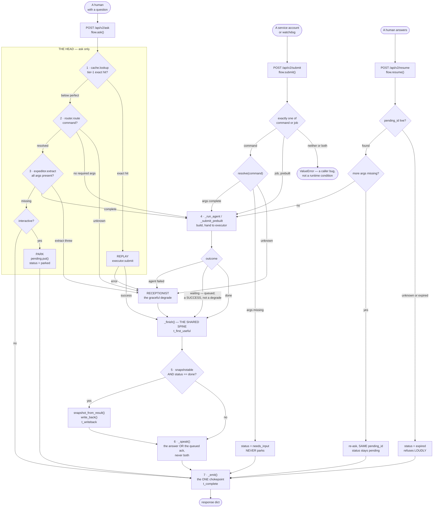
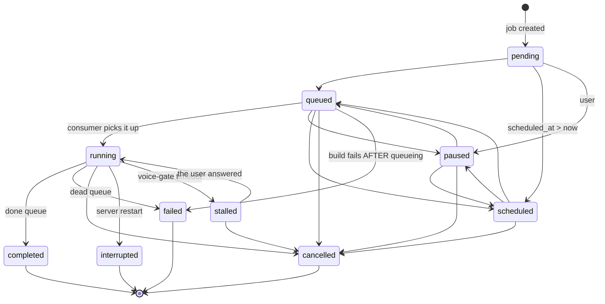

# Two doors, one spine — how a request moves through the v2 flow

**What this is**: a flowchart-ready explainer for the CJ Flow v2 request path — both entry points,
every route to a terminal result, where job-state events are emitted, and when a solution snapshot
is serialized. Written to be read on its own, and to be traced from when drawing.

**Audience**: anyone who needs to explain, draw, or review this design without reading the
1,780-line plan behind it.

**Source**: `src/rnd/v0.2.0/2026.08.20-brain-integration-cascade-review-plan.md`, plus the code as it
actually stands in `src/cosa/rest/v2/flow.py`. Where the two disagree, the code wins and §7 says so.

---

## 1. The one-sentence version

**Two verbs, and the contrast between them *is* the design.** `ask` takes a question and has to work
out what it is. `submit` takes work whose command is already decided. They skip different amounts of
head and then land on the same spine: build → run → guarded write-back → speak → emit.

Rick's ruling, 2026-08-21, verbatim:

> *"Submit is a great contrastive pair with the verb ask. Wonderful choice of words. Now I want to
> make sure that this new verb `submit` happens at the V2 level side by side with `ask`, and that
> simultaneously submit on all the other entry points is disabled. We really only want these paired
> entry points."*

| verb | the caller is saying | head runs? | may park? |
|---|---|---|---|
| **`ask`** | *"here is a question — decide what to do with it"* | **yes** — cache, route, extract args | **yes** |
| **`submit`** | *"here is work — the command is already decided"* | **no** — straight to the spine | **never** |

**Why `submit` never parks** is not a limitation, it is the definition. An `ask` caller is a human
waiting for an answer, so a missing argument can be asked back. A `submit` caller is usually a
service account or a background watchdog — parking a question there means storing a question nobody
will ever read and calling the request handled. `submit` returns `status="needs_input"` with
`args_missing` filled in: a refusal the caller can act on, not a suspension.

---

## 2. ASCII flowchart — the whole path

```
                    +----------------------+         +--------------------------+
   A HUMAN -------->|  POST /api/v2/ask    |         |   POST /api/v2/submit    |<---- A SERVICE
   with a question  |      flow.ask()      |         |      flow.submit()       |      or watchdog
                    +----------+-----------+         +------------+-------------+
                               |                                  |
                        t_recv *                           t_recv *
                               |                                  |
        +======================v======================+           |  exactly one of
        |          THE HEAD -- ask ONLY               |           |  (command | job)
        |  the part submit skips, because its caller  |           |  or ValueError
        |  already answered these questions           |           |
        +======================+======================+           +--------------+
                               |                                  |              |
                +--------------v--------------+          job -----+         command
                | 1. CACHE LOOKUP             |        (prebuilt)            + args
                |    cache.lookup(question)   |                |                |
                +------+---------------+------+                |                v
                       |               |                       |      +------------------+
             tier-1 EXACT hit      below perfect               |      | resolve(command) |
                       |               |                       |      +----+--------+----+
                       v               v                       |           |        |
            +----------------+  +--------------+               |      unknown    resolved
            | REPLAY         |  | 2. ROUTER    |               |           |        |
            | executor.submit|  | router.route |               |           |        v
            +---+--------+---+  +--+--------+--+               |           |  +-----------+
                |        |         |        |                  |           |  | required  |
             success   error   "unknown"  command              |           |  | args all  |
                |        |         |        |                  |           |  | present?  |
                |        |         |        v                  |           |  +--+-----+--+
                |        |         |   +--------------+        |           |     |     |
                |        |         |   | 3. ARGS      |        |           |    no    yes
                |        |         |   | expeditor    |        |           |     |     |
                |        |         |   |  .extract()  |        |           |     v     |
                |        |         |   +--+--------+--+        |           |  +------------------+
                |        |         |      |        |           |           |  | status =         |
                |        |         |  complete  missing        |           |  |  "needs_input"   |
                |        |         |      |        |           |           |  | ! NEVER parks    |
                |        |         |      |        v           |           |  +--------+---------+
                |        |         |      |  +--------------+  |           |           |
                |        |         |      |  | NEEDS INPUT  |  |           |           |
                |        |         |      |  | interactive? |  |           |           |
                |        |         |      |  +--+--------+--+  |           |           |
                |        |         |      |   yes        no    |           |           |
                |        |         |      |     |         |    |           |           |
                |        |         |      |     v         v    |           |           |
                |        |         |      |  +--------+ status |           |           |
                |        |         |      |  | PARK   | =needs |           |           |
                |        |         |      |  |pending | _input |           |           |
                |        |         |      |  | .put() |        |           |           |
                |        |         |      |  +---+----+        |           |           |
                |        |         |      | status="parked"    |           |           |
                |        |         |      |      |             |           |           |
                +----+   +----+----+------+------+-------------+-----------+           |
                     |        |           |      |             |                       |
                     |   +----v---------+ |      |             |                       |
                     |   | RECEPTIONIST | |      |             |                       |
                     |   | the graceful | |      |             |                       |
                     |   |   degrade    | |      |             |                       |
                     |   +------+-------+ |      |             |                       |
                     |          |         |      |             |                       |
                     |          |    +----v------+-------------v-----------------------v----+
                     |          |    |        4. _run_agent  /  _submit_prebuilt            |
                     |          |    |        build the agent, hand to executor             |
                     |          |    +----------------------+-------------------------------+
                     |          |                           |
                     |          |                      +----v-----+
                     |          |                      | EXECUTOR |
                     |          |                      +----+-----+
                     |          |                           |
                     |          |        +------------------+------------------+
                     |          |        |                  |                  |
                     |          |    "done"            "waiting"            error
                     |          |   answer now      queued, running       agent failed
                     |          |        |            behind the              |
                     |          |        |             response          fall back to
                     |          |        |                  |            RECEPTIONIST --+
                     |          |        +--------+---------+                           |
                     |          |                 |                                     |
                     v          v                 v                                     |
        +====================================================================+          |
        |                    _finish() -- THE SHARED SPINE                   |<---------+
        +================================+===================================+
                                         |
                          t_first_useful *
                                         |
                    +--------------------v--------------------+
                    | 5. _maybe_write_back()                  |
                    |    SERIALIZE A SOLUTION?                |
                    |                                         |
                    |    snapshotable AND status == "done"    |
                    +-------+-------------------------+-------+
                            |                         |
                           no                        yes
                            |                         |
                            |                         v
                            |        +--------------------------------+
                            |        | cache.snapshot_from_result(    |
                            |        |   question, answer,            |
                            |        |   routing_command,             |
                            |        |   agent_class_name )           |
                            |        | cache.write_back( snapshot )   |
                            |        |        t_writeback *           |
                            |        +---------------+----------------+
                            |                        |
                            +-----------+------------+
                                        |
                            +-----------v------------+
                            | 6. _speak()            |
                            |  the answer, OR v1's   |
                            |  ack when "waiting" -- |
                            |  never both            |
                            |    t_tts_dispatch *    |
                            +-----------+------------+
                                        |
                            +-----------v------------+
                            | 7. _emit()             |
                            |  THE ONE CHOKEPOINT.   |
                            |  Every terminal exit   |
                            |  funnels through here. |
                            |    t_complete *        |
                            +-----------+------------+
                                        |
                                        v
                            +------------------------+
                            |  response dict         |
                            |  status . answer .     |
                            |  job_id . snapshot_id  |
                            |  cache_hit . timings   |
                            +------------------------+


  -- THE SECOND TURN, and only ask can get here ------------------------------

   A HUMAN answers --> POST /api/v2/resume --> flow.resume( pending_id, answer )
                                                        |
                                    +-------------------+-------------------+
                                    |                                       |
                          pending_id unknown                        entry found
                             or expired                                     |
                                    |                          fill the first missing arg
                                    v                                       |
                          status="expired"                    +-------------+-------------+
                          route_reason=                       |                           |
                           "pending_expired"              more missing               all complete
                          (refuses LOUDLY --                   |                           |
                           never a 500,                        v                           v
                           never silent)               re-ask, SAME pending_id      run the agent,
                                    |                  status stays "pending"       join the spine
                                    |                           |                    at step 4
                                    +---------------------------+----------+              |
                                                                           v              v
                                                                        _emit()  <----  _finish()
```

**Reading the stars**: `*` marks a stage stamp written into the request's trace —
`t_recv`, `t_router`, `t_extract`, `t_first_useful`, `t_writeback`, `t_tts_dispatch`, `t_complete`.
`t_recv -> t_complete` is the span the paired evaluation harness measures.

---

## 3. Mermaid — the same thing, drawable



---

## 4. Where the job-state events come from

`emit_job_state_transition()` in `src/cosa/rest/queue_util.py` pushes a `job_state_transition`
event over the WebSocket — targeted at a user when one is known, broadcast otherwise. It
**validates every transition against the matrix first**, so an impossible move is refused rather
than announced.



**Two things worth knowing when you read a transition stream:**

1. **Only the `failed` emitter carries a real error message.** All five `completed` emitters
   hardcode `error = None`. A consumer looking for *why* something went wrong must read the
   `failed` transition — a completed job never carries one.
2. **`stalled` is resumable and `interrupted` is not.** `stalled -> running` is a legal edge;
   `interrupted` is terminal. A restart kills work; a voice-gate timeout only suspends it.

---

## 5. When a solution gets serialized

**One place, one condition.** `_maybe_write_back()` writes a snapshot if and only if:

```
snapshotable  AND  outcome.status == "done"
```

Everything else about the decision lives elsewhere on purpose — the kill-switch lives inside
`write_back`, so the flow only decides *snapshotable-and-done* and never re-implements the flag.

**Three rules that are easy to get wrong:**

| rule | why |
|---|---|
| **`"waiting"` does NOT write back** | the work is still running; there is no answer to store yet |
| **A question-less `submit` is NOT snapshotable** | `ask` looks rows up by *the user's words*. A row filed under `"agent router go to math"` can never be matched by anything a human says — it is landfill that still costs a read on every lookup |
| **The write happens BEFORE `_emit`** | so `t_complete` is always stamped after the snapshot lands, and the measured span never excludes the write |

---

## 6. What this replaces — the contrast, briefly

Not nostalgia; it explains why the two-door shape is the point.

**Eighteen doors put work on the queue.** They did it three different ways, and the difference was
never visible from the outside:

| mechanism | what the caller handed over | doors |
|---|---|---|
| `push_job` | **a question** — everything still to decide | 2 |
| `push_job_agentic` | a named command with args | 1 |
| raw `push` | an already-built job object | 12 |

⇒ **Sixteen of the eighteen either named their command outright or handed over a finished job.
Exactly one — `/api/push` — was question-shaped.** So the sprawl was never eighteen kinds of
request; it was **two kinds of request wearing eighteen different coats.** That is exactly what
`ask` and `submit` name.

**What the sprawl cost, concretely:**

- **A defect had to be fixed eighteen times, or it wasn't fixed.** The card that asks "which
  document?" hardcoded the word *"research"*. That was invisible while podcast was the only caller
  and surfaced the moment a second agent used it — a presentation user asked about the podcast.
- **Doors rotted unnoticed.** `/api/upload-and-transcribe-mp3` calls `push_job` with one of its four
  required parameters, so it raises `TypeError` every time it is reached. It sat there broken.
- **Nobody could answer "what happens to a request?"** without reading twelve routers.

**What replaces it**: the dying doors return **410 Gone** — not 404. A tombstone, deliberately: a
deleted route is invisible, and nothing would stop somebody re-adding it next year because the
product needs it. Each refusal **names its replacement** and carries **REMOVE BY 2026-12-31** in the
message body, not just in a comment — because the callers that still hit these paths live in
separately-managed repos whose owners will never open the file.

---

## 7. Built vs. planned — read this before drawing a promise

This document describes the design. Some of it is running code and some is not, and the difference
matters if you present it.

| piece | state as of 2026-08-21 |
|---|---|
| `flow.ask()` · `flow.submit()` · `flow.resume()` | **built** — `src/cosa/rest/v2/flow.py` |
| `_maybe_write_back` / snapshot serialization | **built** |
| `_emit` as the single chokepoint, all stage stamps | **built** |
| 410 tombstones | **two doors so far** — `/api/push` and `/api/job-history/{id}/retry`. The other fourteen wait for `/api/v2/submit` to exist, because *"a 410 that names a door that does not exist yet is a refusal pointing at nothing."* |
| Cache **confirmation** guard — never serve an unconfirmed row | **NOT built.** The lookup today gates on `is_replay_hit` only |
| Cache dump after the refactor | **NOT built** |
| lupin-mobile client cutover | **wave 1 done** (`98a3a40`) — off both tombstoned doors. Wave 2's eleven `submit`-shaped calls wait for `/api/v2/submit` |
| lupin-plugin-firefox cutover | **none needed** — it calls no dying door |

**Rick's two cache rulings, for whoever builds that guard:** guard **both** ends — *"the read at the
head end of the process, and the write after the agent executes"* — and the read guard **never
asks**: *"we want to keep unconfirmed answers from replaying until they are confirmed."* An
unconfirmed row is never served, not even once.

---

## Provenance

- Design: `src/rnd/v0.2.0/2026.08.20-brain-integration-cascade-review-plan.md`
- Code read for this document: `src/cosa/rest/v2/flow.py`, `src/cosa/rest/job_state.py`,
  `src/cosa/rest/queue_util.py`, `src/cosa/rest/routers/_retired_doors.py`
- Client cutover: `src/rnd/v0.2.0/2026.08.21-lupin-mobile-v2-cutover-plan.md` ·
  `src/rnd/v0.2.0/2026.08.21-lupin-plugin-firefox-v2-cutover-plan.md`
