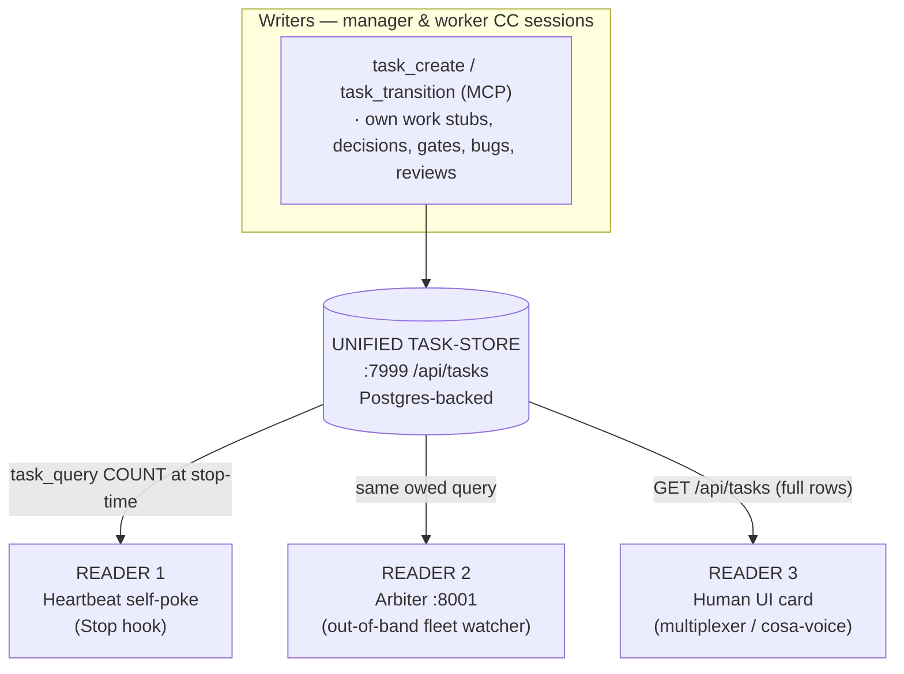

# Fleet Liveness & Unified Task-Store — Architecture (Top to Bottom)

**Status**: Canonical architecture reference. Established 2026-06-17 (immediately after the store-canonical cutover went live).
**Scope**: How the Lupin fleet tracks owed work and keeps multi-session ("fleet") agents alive and driven to completion — the **unified task-store**, the **heartbeat self-poke**, the **out-of-band arbiter**, the **human UI card**, and the **manager/worker lifecycle** that runs on top of them.
**Audience**: Any agent (or human) who needs the whole picture before touching the liveness path, the task store, or the arbiter.

> **One-sentence summary**: There is **one** durable task store (`:7999 /api/tasks`); **three** readers consume it (the Stop-hook self-poke, the `:8001` arbiter, and a human UI card); and a fleet of manager/worker Claude Code sessions writes to it and is kept alive by it.

---

## 1. Why this exists

The founding goal is a **token-efficient** way to track status + liveness so the fleet can **drive lazy / stuck / blocked / missing-something sessions to completion** — without long idle stalls and without burning context re-reading a task list every turn.

Every earlier liveness bug traced to **two sources of truth**: the native Claude Code harness task list (transcript-reconstructed, vocabulary-poor) *and* the unified store, kept in sync by a fragile mirror. The **store-canonical cutover (2026-06-17)** collapsed that to one source. The design record is `src/rnd/v0.1.8/2026.06.16-store-canonical-task-management.md` (plan) + `src/rnd/v0.1.8/2026.06.16-store-canonical-task-mgmt-cascade-review.md` (cascade review, build ACs, cutover log).

---

## 2. The core: one store, three readers

- **The store is the single source of truth.** Owed work — your tasks, work you assign, decisions, gates, bugs, review-requests — lives here and nowhere else. The native harness task list is **no longer** the liveness source (jettisoned at the 2026-06-17 cutover).
- The three readers cannot disagree about "who owes what," because they read the same store with the same query shape. (Bug `82e4eaf0` — two sources of truth — is eliminated *by construction*, not patched.)

### Data model (item shape)

Each item carries far richer vocabulary than the old harness list:

| Field | Meaning |
|---|---|
| `id` | server UUID (collision-safe) |
| `item_class` | `task` \| `decision` \| `gate` \| `bug` \| `review_request` |
| `status` | `queued` → `in_progress` → `blocked` → `done` \| `dropped` |
| `owner_persona` | who owes the work |
| `accountable_manager` | the chasing manager |
| `blocked_by` | typed refs `[{kind: item\|persona\|user, id}]` |
| `next_chase_ts` | when to re-chase a blocked item |
| `gate_class` | `none` \| `ricks_court` (awaiting the human's decision) |
| `priority`, `project`, `correlation_key`, `source_qid` | scoping / provenance |

**Discipline (enforced server-side):** `→done` REQUIRES a receipt (`commit` / `test_run` / `qid` / `doc_path` / `log_line`); `→blocked` REQUIRES a typed `blocked_by` AND a `next_chase_ts`. *No receipt → not done.*

**Persona-key invariant (single source of truth):** `owner_persona`, `accountable_manager`, and persona-typed `blocked_by` refs are stored as a **canonical key** — accent-stripped, punctuation-stripped, lowercased, internal spaces kept (`María` → `maria`, `Mr. Radio` → `mr radio`). Every seam that writes, queries, or compares a persona MUST route through the ONE root `lupin_mcp.persona_normalization.canonical_persona_key` (the WRITE seam, the `/api/tasks` boundary, the owed-oracle READ seam, the arbiter role-matchers, and `follow_through_escalation_watcher` all do). DM-topic / session-name derivation uses the sibling `persona_slug` (same root, internal spaces → separator → `dm-mr_radio`); noisy free-text human input resolves via `normalize_for_match` (root minus spaces). **Never** hand-roll a `.lower()` / `re.sub` persona normalizer — divergence here is the exact bug that produced the 2026-06-18 false-idle P0 (READ queried `maría`, store held `maria`, zero rows matched) and the split DM-topic (`dm-maría` vs `dm-maria`). Authority: `src/rnd/v0.1.9/2026.06.19-persona-name-normalization/01-centralized-persona-normalization-plan.md`.

### Store API + agent verbs

- **HTTP**: `:7999 /api/tasks` — `routers/tasks.py` (handler) backed by `task_repository.py`. `GET /api/tasks?owner_persona=&status=` returns full-fidelity rows; `count_only=true` returns `{count}` via `func.count` (no row serialization) for the cheap poke path.
- **MCP verbs** (what agents call): `task_create`, `task_query`, `task_transition` (cosa-voice server). `task_query` is the always-allowed owed-work read; `task_create` mints typed/cross-persona items; `task_transition` applies one state change with receipts.

---

## 3. Reader 1 — the heartbeat self-poke (Stop-hook liveness path)

**Goal**: when a session tries to Stop while it still owes work, nudge it to keep going instead of going dark. Token-cheap: a **count**, never the list, and **nothing is injected into context** beyond "you owe N items."

**Where**: `src/lupin_cli/claude_code/hooks/` — `stop.py` (the Stop hook), with libs:
- `lib/heartbeat_settings.py` — reads `~/.claude/settings.json` → `heartbeat` block (`enabled`, `poke_cap`, `count_inbound_questions_as_owed`, **`owed_source_from_store`**).
- `lib/heartbeat_work_owed.py` — pure `evaluate_work_owed(...)`: owns no source of truth; computes `work_owed` from injected signals.
- `lib/task_store_client.py` — `query_owed(owner, statuses)`: bounded-timeout (≤1–2s), never-raises urllib seam to `:7999`.
- `lib/heartbeat_hold.py` / `.heartbeat-hold-<stable_session_id>.json` — a session's "I'm intentionally holding, don't poke me" record (TTL'd).

**The owed signal is a UNION of three inputs** (do not regress this — it was hard-won):
1. **owed_items** — post-cutover, the COUNT from `query_owed` (the store) when `owed_source_from_store=True`; pre-cutover, transcript replay (`replay_task_state`, retained as the degraded fallback).
2. **outstanding delegations** — local manifest/bridge files (a manager owes a review/reap).
3. **unanswered inbound** — local commons board (a worker owes a DM reply).

Inputs 2 and 3 are **local / store-independent** and must keep poking even during a `:7999` outage. Only the owed_items COUNT fails safe.

**The cutover flag**: `heartbeat.owed_source_from_store` in `~/.claude/settings.json`. `False` = old transcript path; `True` = store-count path. Flipping it fleet-wide IS the cutover (every session's Stop hook reads it). **Reversible**: flip back to `False` to revert.

**Fail-safe (§C)**: store unreachable / timeout / malformed → owed_items contributes 0 + a distinct `heartbeat_store_unreachable` log phase, and the hook does **not** spurious-poke. Bounce-windows (Rick restarts `:7999` constantly under `--reload`) = no-poke windows by design.

> **Known limitation**: the self-poke *delivery/effect* path (Stop-hook `decision:block`) has not been confirmed to force a continuation turn (bug `f0d79d71`). The **reliable** wake path today is the arbiter's external tmux-injection (below), plus a session-run `/loop`.

---

## 4. Reader 2 — the arbiter (`:8001`, out-of-band fleet watcher)

**What**: a standalone host process (NOT in Docker) that watches the whole fleet and pokes/escalates. It is the **second line** of liveness (the Stop-hook self-poke is the first).

**Where**:
- App: `src/lupin_arbiter_app/` (FastAPI on `:8001`, `--factory create_production_app`, `reload=False`).
- Logic: `src/cosa/agents/heartbeat_arbiter/` — `arbiter_job.py` (the loops), `fleet_data_model.py` (roster + stuck detection).
- Launch: `src/scripts/run-lupin-arbiter-app.sh`, supervised by the systemd **`--user`** unit `lupin-arbiter-app.service` (`Restart=always`). **Bounce to deploy new arbiter code**: `systemctl --user restart lupin-arbiter-app.service` (it loads the **working-tree** code — no push needed; standing manager authority after a green review). Verify via `journalctl --user -u lupin-arbiter-app.service`.
- Routing/recipients doc: `src/docs/agents/heartbeat-arbiter-routing-guide.md`.

**Liveness signals it consumes** (a manager is "alive" if ANY is fresh): the heartbeat event stream (`~/.claude/heartbeat-events/*.jsonl`, the `work_owed` verdict the Stop hook emits), `commons_who` last-post timestamps, **bridge-mtime** (refreshed by *any* tool call — added by fix `9694fb11`), and live bridge presence.

**Detectors & their windows** (each has actuated a real or false alarm — know the thresholds):

| Detector | Window | What it checks |
|---|---|---|
| **Manager-staleness** | 2700s (45 min) | No liveness signal from a manager → advisory to Rick |
| **Manager tap-ACK** | 600s (10 min) | Arbiter "taps" a manager; expects activity (bridge-mtime ≥ tapped_at) within the window → else MANAGER-DOWN |
| **Whole-fleet-stall** | 1800s (30 min) | No fleet *progress* (commits / task-store transitions) while work is owed → escalate to Rick |
| **Stuck worker** | episodes | `cap_reached + work_owed` repeated in the event stream |

**Single-source guarantee (§D)**: the arbiter's owed signal flows from the **same** store query as the poke (via the Stop hook's emitted `work_owed`), so the poke and the arbiter cannot diverge once the flag is flipped. The `cap_reached` *episode* counter stays on the heartbeat **event stream** (the store has no `cap_reached` concept).

**Delivery**: the arbiter can inject directly into a dormant session's tmux (`cc_notification_listener._inject_via_tmux`) — this is the reliable external wake. It also posts advisories to the human (`live_notify`).

**Outreach idempotency + ack channel** (bug `ce13b134`): the Part-6 #4 blocker detector re-pings a silent blocker on an escalating backoff, but the owning-manager *cc* ("X is blocking worker Y") is deduped on a `(blocker, blocked_item, recipient)` cooldown (reusing the `58660c64` advisory-cooldown machinery) so a persistent block cc's the manager at most once per window, while a genuinely-new block (different `blocked_item`) still announces once. The arbiter is a **headless observer with no DM inbox** — the canonical channel for a chase-ack back to the arbiter is a **commons `system-events` post**, not a DM reply (ratified: no inbound inbox is added to the observe-only service).

> **Known gaps (follow-ups)**: the manager tap-ACK (600s) is tighter than any practical management loop, and neither tap-ACK nor whole-fleet-stall is **blocked-on-user / done-aware** — so an idle-but-finished or legitimately Rick-gated manager gets false MANAGER-DOWN / whole-fleet-stall escalations (relates `332af094`). Mitigations in use: keep management loops < 40 min; represent user-gated work as a `gate_class=ricks_court` item transitioned to `blocked_by:[{kind:user}]`.

---

## 5. Reader 3 — the human UI card

A **task-list card** in the multiplexer / cosa-voice UI, rendered from the store so the human (Rick) tracks his *own* court and the fleet's owed work — full fidelity (`blocked`, `blocked_by`, `next_chase_ts`, owner, accountable) the native widget never had.

**Implementation pattern** (Tiberius's lane, Step 4): clone the **fleet-status card** pattern — `FleetStatusStore` (poll-driven, in-flight debounce) + renderer + table template + `FleetApiClient` (handles JWT/401) → a `TaskListStore`/renderer. **Data path**: back it onto the **existing** `GET /api/tasks?owner_persona=&status=` (NOT `/api/arbiter/fleet-state`, which is a fleet-composite proxy of the wrong shape). The card is a read-only consumer. (TS variant banked for cutover; a JS-client variant landed in the in-service notifications client.)

---

## 6. Writers — the manager/worker session lifecycle

The fleet is a set of real Claude Code sessions (detached tmux), each with a voice **persona**. Roles: **manager** (coordinates, never self-implements the build) and **worker** (author/reviewer/tester).

**Spawn / reap** (cosa-voice MCP, host-side): `spawn_sessions(count, role, task_prompt, persona_preference, …)` launches headless `claude` sessions that boot a persona and read `task_prompt` as their brief; `dismiss_sessions` reaps them. Results flow back over DM threading to `dm-<manager-persona>`.

**The standing build loop** a manager runs:
1. Spawn a worker with a **baked brief** (null-persona workers can't be reliably DM'd inbound — bug `d57dbfea` — so the brief must be self-contained).
2. Worker builds in a **git worktree** (never the live tree — `stop.py` and the hook libs are *live enabled hooks*; editing them in-place runs unreviewed code on every trigger).
3. Worker reports **green** to `dm-<manager>`.
4. Manager spawns a **fresh-critical reviewer** (reproduce-not-trust).
5. On APPROVE → **commit + merge `--no-ff` HELD** to the working branch (standing authority once green + reviewed), close the matching store rows with the merge receipt, reap the workers.
6. **Push** is the human's gate (manager *executes* it on the human's word); commit + merge are not.

**Coordination**: managers DM each other (`dm_send`, body inline ≈ 200 tokens) and the human via `notify` / blocking `ask_*`. Two managers split a build by a **seam** (e.g. spine vs UI card) sharing only a stable read-contract.

---

## 7. The migration & cutover machinery

**Migration drain** — `src/lupin_cli/claude_code/hooks/lib/task_store_drain.py`: per **active session**, replays the transcript's owed native items and `task_create`s any missing ones (idempotent via `correlation_key` + `query_by_correlation_key`; dry-run by default, `--apply` to write). Includes a per-session **count-parity** check (store owed-count == transcript owed-count). Run before flipping the flag so no session goes dark at cutover.

**Cutover sequence (executed 2026-06-17, Rick-supervised)**:
1. `drain --apply` → parity 4/4.
2. verify parity (would_create = 0).
3. flip `heartbeat.owed_source_from_store=True` in `~/.claude/settings.json`; verify it reads `True`.
4. (lockstep) the doctrine (PIP surfaces + global `CLAUDE.md`) flips to "store-only / stop using native TaskCreate" **strictly after** the flag — no window where doctrine says store-only while the oracle still reads the transcript.

**The mirror (deprecated bridge)** — `post_tool_use.py` + `lib/task_store_mirror.py`: historically auto-copied harness `TaskCreate` → store. It is **retired in stages** (Step 5, evidence-gated): keep it a **logged no-op** until its fire-log goes quiet fleet-wide, THEN delete + drop the dead `TASK_STORE_WRITE_TOOLS` entries. (Pulling it early would silently dark not-yet-migrated sessions.) The collision fix `9b23d5bc` (generation-aware correlation keys) makes it safe during the interim.

---

## 8. File map / source-of-truth

| Concern | File(s) |
|---|---|
| Store API + repo | `src/cosa/rest/routers/tasks.py`, `…/db/repositories/task_repository.py` |
| Store MCP verbs | cosa-voice server `task_create` / `task_query` / `task_transition` |
| Stop-hook seam | `src/lupin_cli/claude_code/hooks/stop.py` (~`_run_heartbeat`) |
| Heartbeat libs | `…/hooks/lib/{heartbeat_settings,heartbeat_work_owed,task_store_client,heartbeat_hold}.py` |
| Migration drain | `…/hooks/lib/task_store_drain.py` |
| Mirror (deprecated) | `…/hooks/post_tool_use.py`, `…/hooks/lib/task_store_mirror.py` |
| Project resolution | `…/hooks/lib/session_bridge.py` `resolve_project_name()` (one-name, fix `9bf1dc4a`) |
| Arbiter | `src/cosa/agents/heartbeat_arbiter/{arbiter_job,fleet_data_model}.py`, `src/lupin_arbiter_app/` |
| Arbiter launch | `src/scripts/run-lupin-arbiter-app.sh` + systemd `--user` `lupin-arbiter-app.service` |
| Cutover flag | `~/.claude/settings.json` → `heartbeat.owed_source_from_store` |
| Spawn/reap | cosa-voice `spawn_sessions` / `dismiss_sessions` |
| Design record | `src/rnd/v0.1.8/2026.06.16-store-canonical-task-management.md` (plan), `…-store-canonical-task-mgmt-cascade-review.md` (review + cutover log) |
| Arbiter routing | `src/docs/agents/heartbeat-arbiter-routing-guide.md` |

---

## 9. Open follow-ups (see the dedicated plan)

Tracked separately in the follow-up plan (`src/rnd/v0.1.8/…-followups-plan.md`): **Step-5 mirror retirement** (evidence-gated), **poke-cap `c121037b`** (held, reviewed-green, awaiting merge/push), **arbiter detector gaps** (tap-ACK + whole-fleet-stall need done/blocked-on-user awareness, `332af094`), and minor residue (`count_only` adoption, connection reuse).
