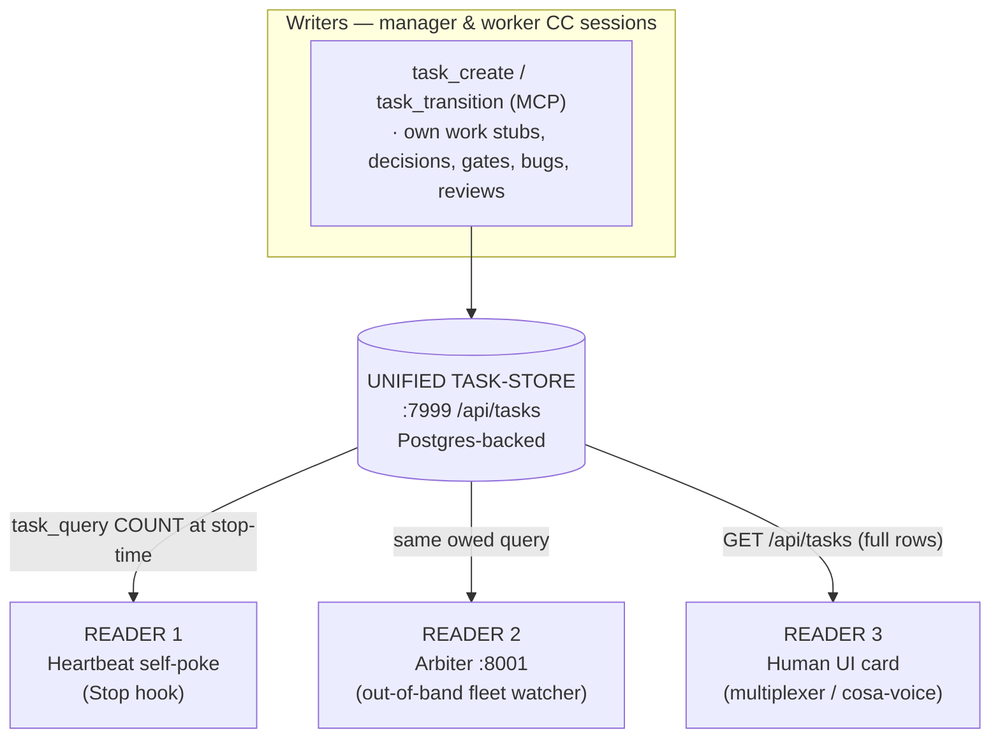

# Fleet Liveness & Unified Task-Store — Architecture (Top to Bottom)

**Status**: canonical architecture reference.
It was established 2026-06-17, right after the store-canonical cutover went live.

**Scope**: how the Lupin fleet tracks owed work and keeps multi-session ("fleet") agents alive and driven to completion.
It covers the **unified task-store**, the **heartbeat self-poke**, the **out-of-band arbiter** and the **human UI card**.
It also covers the **manager/worker lifecycle** that runs on top of them.

**Audience**. Any agent (or human) who needs the whole picture before touching the liveness path, the task store, or the arbiter.

**One-sentence summary**: There is **one** durable task store (`:7999 /api/tasks`); **three** readers consume it (the Stop-hook self-poke, the `:8001` arbiter, and a human UI card). A fleet of manager/worker Claude Code sessions writes to it and is kept alive by it.

---

## 1. Why this exists

The founding goal is a **token-efficient** way to track status and liveness.
It lets the fleet **drive lazy, stuck, blocked or missing-something sessions to completion**.
It does so without long idle stalls and without burning context re-reading a task list every turn.

Every earlier liveness bug traced to **two sources of truth**.
One was the native Claude Code harness task list, which is transcript-reconstructed and vocabulary-poor.
The other was the unified store, kept in sync by a fragile mirror.
The **store-canonical cutover (2026-06-17)** collapsed that to one source.
The design record is `src/rnd/v0.1.8/2026.06.16-store-canonical-task-mgmt-cascade-review.md` *(`REMOVED`; recover: `git show b113a3a7^:src/rnd/v0.1.8/2026.06.16-store-canonical-task-mgmt-cascade-review.md`)* (cascade review, build ACs, cutover log).
A separate plan document was intended and never authored.

---

## 2. The core: one store, three readers

```mermaid
flowchart TD
    subgraph WRITERS["Writers — manager & worker CC sessions"]
      MW["task_create / task_transition (MCP)\n· own work stubs, decisions, gates, bugs, reviews"]
    end
    STORE[("UNIFIED TASK-STORE\n:7999 /api/tasks\nPostgres-backed")]
    MW --> STORE
    STORE -->|"task_query COUNT at stop-time"| R1["READER 1\nHeartbeat self-poke\n(Stop hook)"]
    STORE -->|"same owed query"| R2["READER 2\nArbiter :8001\n(out-of-band fleet watcher)"]
    STORE -->|"GET /api/tasks (full rows)"| R3["READER 3\nHuman UI card\n(multiplexer / cosa-voice)"]
```

- **The store is the single source of truth**.
  Owed work lives here and nowhere else: your tasks, work you assign, decisions, gates, bugs and review-requests.
  The native harness task list is **no longer** the liveness source, because the 2026-06-17 cutover jettisoned it.
- The three readers cannot disagree about "who owes what", because they read the same store with the same query shape.
  The old two-sources-of-truth bug is eliminated *by construction*, not patched.

### Data model (item shape)

Each item carries far richer vocabulary than the old harness list:

| Field | Meaning |
|---|---|
| `id` | server UUID (collision-safe) |
| `item_class` | `task` \| `decision` \| `gate` \| `bug` \| `review_request` |
| `status` | `queued` → `in_progress` → `blocked` → `done` \| `dropped` |
| `owner_persona` | who owes the work |
| `accountable_manager` | the chasing manager |
| `blocked_by` | typed refs `[{kind: item\|persona\|user, id}]` |
| `next_chase_ts` | when to re-chase a blocked item |
| `gate_class` | `none` \| `ricks_court` (awaiting the human's decision) |
| `priority`, `project`, `correlation_key`, `source_qid` | scoping / provenance |

**Discipline (enforced server-side):** `→done` `REQUIRES` a receipt (`commit` / `test_run` / `qid` / `doc_path` / `log_line`). `→blocked` `REQUIRES` a typed `blocked_by` and a `next_chase_ts`. *No receipt → not done.*

**Persona-key invariant (single source of truth):** `owner_persona`, `accountable_manager` and persona-typed `blocked_by` refs are stored as a **canonical key**.
The key is accent-stripped, punctuation-stripped and lowercased, with internal spaces kept (`María` → `maria`, `Mr. Radio` → `mr radio`). Every seam that writes, queries or compares a persona must route through the one root, `lupin_mcp.persona_normalization.canonical_persona_key`.
The write seam, the `/api/tasks` boundary and the owed-oracle read seam all do.
So do the arbiter role-matchers and `follow_through_escalation_watcher`.

DM-topic and session-name derivation uses the sibling `persona_slug`.
It has the same root, with internal spaces turned into a separator (`dm-mr_radio`).
Noisy free-text human input resolves via `normalize_for_match`, which is the root minus spaces.

**Never** hand-roll a `.lower()` or `re.sub` persona normalizer.
Divergence here is the exact bug that produced the 2026-06-18 false-idle P0.
The read queried `maría`, the store held `maria`, and zero rows matched.
It also split the DM-topic (`dm-maría` vs `dm-maria`). Authority: `src/rnd/v0.1.9/2026.06.19-persona-name-normalization/01-centralized-persona-normalization-plan.md`.

### Store API + agent verbs

- **HTTP**: `:7999 /api/tasks` — `routers/tasks.py` (handler) backed by `task_repository.py`. `GET /api/tasks?owner_persona=&status=` returns full-fidelity rows. `count_only=true` returns `{count}` via `func.count` (no row serialization) for the cheap poke path.
- **MCP verbs** (what agents call): `task_create`, `task_query`, `task_transition` (cosa-voice server). `task_query` is the always-allowed owed-work read. `task_create` mints typed/cross-persona items. `task_transition` applies one state change with receipts.

### Un-parking on the operator's card

A park is the operator's own not-now, so un-parking is approver-only.
Rick ruled one exception.
A **manager** may move a row `parked -> queued`.
The operator must have answered **yes on a card the server made for that row and that move**.
Nothing else changes.
`parked -> in_progress` and `parked -> done` stay refused, and a worker is refused whatever it types.

- **Ask**: `POST /api/tasks/{task_id}/unpark-ask` (manager seat only; MCP verb `task_ask_unpark`).
  The server inserts the card itself and writes `payload = { kind: "unpark_ask", task_id, move: "parked->queued" }`.
  No public door can write that column on a question, and `test_the_files_that_write_a_notification_payload_are_pinned` holds that.
  The server pushes the card after the insert commits, and returns `card_id` with `pushed`. `pushed: false` means the card is saved but the operator was not shown it. A re-ask is refused with 409 until the card expires (600 s). One unanswered card per row and park. A second ask gets 409 naming the first, and a row with no recorded park time gets 409 and no card. The card text names the row id and title. And silence refuses.
- **Cite**: after the operator answers yes, the manager sends the ordinary transition `parked -> queued` with `receipt_refs = { "approval_card": "<card_id>" }`.
  The door reads the card from the notification table and judges it in `task_promotion_gate.unpark_card_refusal`.
  The card must exist, have asked a question, and be answered (not the timed-out default) with yes.
  It must be posted on the operator's own login (`answered_by`), with a payload naming this row and this move.
  It must be made after the row was parked, and never used.
  Only then does `refusal_for_admission( unpark_card_ok=True )` let the move through.
- **Record**: the server writes its own resolved card id onto the event, over whatever the caller typed.
  That event is the single-use record (`TaskRepository.approval_card_ids_used` counts `parked->queued` events only).
  The `approval_card` key is refused on every other move, and for every caller but a manager's valid un-park, with one text.
  So a card cannot be burned by citing it, and its existence is not disclosed.

---

## 3. Reader 1 — the heartbeat self-poke (Stop-hook liveness path)

**Goal**: when a session tries to Stop while it still owes work, nudge it to keep going instead of going dark. Token-cheap: a **count**, never the list, and **nothing is injected into context** beyond "you owe N items."

**Where**: `src/lupin_cli/claude_code/hooks/` — `stop.py` (the Stop hook), with libs:
- `lib/heartbeat_settings.py`. Reads `~/.claude/settings.json` → `heartbeat` block (`enabled`, `poke_cap`, `count_inbound_questions_as_owed`, **`owed_source_from_store`**).
- `lib/heartbeat_work_owed.py` — pure `evaluate_work_owed(...)`: owns no source of truth. Computes `work_owed` from injected signals.
- `lib/task_store_client.py` — `query_owed(owner, statuses)`: bounded-timeout (≤1–2s), never-raises urllib seam to `:7999`.
- `lib/heartbeat_hold.py` / `.heartbeat-hold-<stable_session_id>.json`. A session's "I'm intentionally holding, don't poke me" record (TTL'd).

**The owed signal is a union of three inputs** (do not regress this — it was hard-won):
1. **owed_items**. Post-cutover, the `COUNT` from `query_owed` (the store) when `owed_source_from_store=True`. Pre-cutover, transcript replay (`replay_task_state`, retained as the degraded fallback).
2. **outstanding delegations** — local manifest/bridge files (a manager owes a review/reap).
3. **unanswered inbound** — local commons board (a worker owes a DM reply).

Inputs 2 and 3 are **local / store-independent** and must keep poking even during a `:7999` outage. Only the owed_items `COUNT` fails safe.

**The cutover flag**: `heartbeat.owed_source_from_store` in `~/.claude/settings.json`. `False` = old transcript path; `True` = store-count path. Flipping it fleet-wide is the cutover (every session's Stop hook reads it). **Reversible**: flip back to `False` to revert.

**Fail-safe**: when the store is unreachable, times out or answers malformed, `owed_items` contributes 0.
The hook logs a distinct `heartbeat_store_unreachable` phase and does **not** spurious-poke. Bounce-windows (Rick restarts `:7999` constantly under `--reload`) = no-poke windows by design.

**Muting the poke** (two switches, either one mutes): `heartbeat.poke_output_enabled = false` in `~/.claude/settings.json` is the hand switch. The fleet switch is a small file an admin flips from a notification client's toolbar (multiplexer or legacy) through `PUT /api/heartbeat/poke-mute`. The Stop hook reads it on every stop through `hooks/lib/heartbeat_poke_mute.py`, so a flip lands on each seat's next stop with no restart. The file sits in the flow-ratio settings folder, which both rest containers already mount. A missing or malformed file reads as not muted, and no timer touches it. While muted, a seat is shown `heartbeat.poke_disabled_message` when that is set. And otherwise a line naming who muted it and when. `heartbeat.enabled` must stay `true` for either message to appear.

> **Known limitation**: the self-poke *delivery/effect* path (Stop-hook `decision:block`) has not been confirmed to force a continuation turn. The **reliable** wake path today is the arbiter's external tmux-injection (below), plus a session-run `/loop`.

---

## 4. Reader 2 — the arbiter (`:8001`, out-of-band fleet watcher)

**What**: a standalone host process (not in Docker) that watches the whole fleet and pokes/escalates. It is the **second line** of liveness (the Stop-hook self-poke is the first).

**Where**:
- App: `src/lupin_arbiter_app/` (FastAPI on `:8001`, `--factory create_production_app`, `reload=False`).
- Logic: `src/cosa/agents/heartbeat_arbiter/`. `arbiter_job.py` (the loops), `fleet_data_model.py` (roster + stuck detection).
- Launch: `src/scripts/run-lupin-arbiter-app.sh`, supervised by the systemd **`--user`** unit `lupin-arbiter-app.service` (`Restart=always`).
  **Bounce to deploy new arbiter code**: `systemctl --user restart lupin-arbiter-app.service`.
  It loads the **working-tree** code, so no push is needed. Managers hold standing authority to bounce it after a green review. Verify via `journalctl --user -u lupin-arbiter-app.service`.
- Routing/recipients doc: `src/docs/agents/heartbeat-arbiter-routing-guide.md`.

**Liveness signals it consumes**: a manager is "alive" if any signal is fresh.
The signals are the heartbeat event stream (`~/.claude/heartbeat-events/*.jsonl`, the `work_owed` verdict the Stop hook emits) and `commons_who` last-post timestamps.
They also include **bridge-mtime**, which any tool call refreshes, and live bridge presence.

**Detectors & their windows** (each has actuated a real or false alarm — know the thresholds):

| Detector | Window | What it checks |
|---|---|---|
| **Manager-staleness** | 2700s (45 min) | No liveness signal from a manager → advisory to Rick |
| **Manager tap-ACK** | 600s (10 min) | Arbiter "taps" a manager; expects activity (bridge-mtime ≥ tapped_at) within the window → else MANAGER-DOWN |
| **Whole-fleet-stall** | 1800s (30 min) | No fleet *progress* (commits / task-store transitions) while work is owed → escalate to Rick |
| **Stuck worker** | episodes | `cap_reached + work_owed` repeated in the event stream |

**Single-source guarantee**: the arbiter's owed signal flows from the **same** store query as the poke, via the Stop hook's emitted `work_owed`. So the poke and the arbiter cannot diverge once the flag is flipped. The `cap_reached` *episode* counter stays on the heartbeat **event stream** (the store has no `cap_reached` concept).

**Delivery**: the arbiter can inject directly into a dormant session's tmux (`cc_notification_listener._inject_via_tmux`) — this is the reliable external wake. It also posts advisories to the human (`live_notify`).

**Outreach idempotency + ack channel**: the blocker detector re-pings a silent blocker on an escalating backoff.
The owning-manager *cc* ("X is blocking worker Y") is deduped on a `(blocker, blocked_item, recipient)` cooldown.
It reuses the advisory-cooldown machinery.
A persistent block therefore cc's the manager at most once per window.
A genuinely-new block (different `blocked_item`) still announces once.
The arbiter is a **headless observer with no DM inbox**.
The canonical channel for a chase-ack back to the arbiter is a **commons `system-events` post**, not a DM reply.
No inbound inbox is added to the observe-only service.

**Known gaps (follow-ups)**: the manager tap-ACK (600s) is tighter than any practical management loop.
Neither tap-ACK nor whole-fleet-stall is **blocked-on-user / done-aware**.
So an idle-but-finished or legitimately Rick-gated manager gets false MANAGER-DOWN or whole-fleet-stall escalations.
Mitigations in use: keep management loops under 40 minutes.
Represent user-gated work as a `gate_class=ricks_court` item transitioned to `blocked_by:[{kind:user}]`.

**The sibling-gate lesson** (2026-07-12, Krishna 🦚: three fixes, one family).
Every arbiter false-positive class fixed on 2026-07-12 had the same signature: **a correctness gate wired into one consumer of a signal but not its siblings**.
The three fixes were these:

- The blocked-edge roster leg lacked the store-corroboration the ping leg had (`edge_is_store_backed`).
- The worker-subject stuck advisory lacked the bridge-fresh veto that the poke leg and the manager-subject advisory had.
- The stuck-episode recovery scan consumed caps on `honored` but not on the sibling `idle` beacon.

**Detection method** (use it to find the fourth, if one exists): don't reason about the code. Read the journal until the arbiter *contradicts itself on a single poll*.
Examples are `edges=1, pings_fired=0, taps_fired=1`, or `arbiter_stuck_bridge_veto` beside a "1 stuck/dead" tap for the same persona in the same poll.

**Rule for new gates**: when adding a correctness gate to a consumer of a fleet-view signal, enumerate that signal's other consumers.
Grep the producer's field name to find them.
Then either wire the gate uniformly or document per consumer why not.

Recovery-outcome membership rule: a recovery outcome is a liveness beacon **the session itself emits**.
Arbiter-side markers never qualify (`fleet_data_model.py`, `RECOVERY_OUTCOMES`).

---

## 5. Reader 3 — the human UI card

A **task-list card** in the multiplexer / cosa-voice UI, rendered from the store.
The human (Rick) tracks his *own* court and the fleet's owed work on it.
It has full fidelity (`blocked`, `blocked_by`, `next_chase_ts`, owner, accountable) that the native widget never had.

**Implementation pattern** (Tiberius's lane): clone the **fleet-status card** pattern.
The parts are `FleetStatusStore` (poll-driven, in-flight debounce), a renderer, a table template and `FleetApiClient` (handles JWT/401).
They become a `TaskListStore` and a renderer. 
**Data path**: back it onto the **existing** `GET /api/tasks?owner_persona=&status=`.
`/api/arbiter/fleet-state` is the wrong source: it is a fleet-composite proxy of the wrong shape.
The card is a read-only consumer.
A TypeScript variant is banked for cutover, and a JS-client variant landed in the in-service notifications client.

---

## 6. Writers — the manager/worker session lifecycle

The fleet is a set of real Claude Code sessions (detached tmux), each with a voice **persona**. Roles: **manager** (coordinates, never self-implements the build) and **worker** (author/reviewer/tester).

**Spawn / reap** (cosa-voice MCP, host-side): `spawn_sessions(count, role, task_prompt, persona_preference, …)` launches headless `claude` sessions.
They boot a persona and read `task_prompt` as their brief.
`dismiss_sessions` reaps them. Results flow back over DM threading to `dm-<manager-persona>`.

**The standing build loop** a manager runs:
1. Spawn a worker with a **baked brief** (null-persona workers can't be reliably DM'd inbound — — so the brief must be self-contained).
2. Worker builds in a **git worktree** (never the live tree).
   `stop.py` and the hook libs are *live enabled hooks*, and editing them in place runs unreviewed code on every trigger.
3. Worker reports **green** to `dm-<manager>`.
4. Manager spawns a **fresh-critical reviewer** (reproduce-not-trust).
5. On approve, the manager does a **commit and `--no-ff` held merge** to the working branch.
   It holds standing authority for that once the work is green and reviewed.
   It then closes the matching store rows with the merge receipt and reaps the workers.
6. **Push** is the human's gate (manager *executes* it on the human's word); commit + merge are not.

**Coordination**: managers DM each other (`dm_send`, body inline ≈ 200 tokens) and the human via `notify` / blocking `ask_*`. Two managers split a build by a **seam** (e.g. spine vs UI card) sharing only a stable read-contract.

---

## 7. The migration & cutover machinery

**Migration drain** — `src/lupin_cli/claude_code/hooks/lib/task_store_drain.py`: per **active session**, it replays the transcript's owed native items and `task_create`s any missing ones.
It is idempotent via `correlation_key` and `query_by_correlation_key`, and dry-run by default (`--apply` writes). Includes a per-session **count-parity** check (store owed-count == transcript owed-count). Run before flipping the flag so no session goes dark at cutover.

**Cutover sequence (executed 2026-06-17, Rick-supervised)**:
1. `drain --apply` → parity 4/4.
2. verify parity (would_create = 0).
3. flip `heartbeat.owed_source_from_store=True` in `~/.claude/settings.json`; verify it reads `True`.
4. (lockstep) the doctrine (pip surfaces + global `CLAUDE.md`) flips to "store-only / stop using native TaskCreate" **strictly after** the flag. No window where doctrine says store-only while the oracle still reads the transcript.

**The mirror (deprecated bridge)** — `post_tool_use.py` + `lib/task_store_mirror.py`: historically auto-copied harness `TaskCreate` → store. It is **retired in stages**, gated on evidence.
Keep it a **logged no-op** until its fire-log goes quiet fleet-wide, then delete it and drop the dead `TASK_STORE_WRITE_TOOLS` entries.
Pulling it early would silently dark not-yet-migrated sessions.
The collision fix (generation-aware correlation keys) makes it safe during the interim.

---

## 8. File map / source-of-truth

| Concern | File(s) |
|---|---|
| Store API + repo | `src/cosa/rest/routers/tasks.py`, `…/db/repositories/task_repository.py` |
| Store MCP verbs | cosa-voice server `task_create` / `task_query` / `task_transition` |
| Stop-hook seam | `src/lupin_cli/claude_code/hooks/stop.py` (~`_run_heartbeat`) |
| Heartbeat libs | `…/hooks/lib/{heartbeat_settings,heartbeat_work_owed,task_store_client,heartbeat_hold}.py` |
| Migration drain | `…/hooks/lib/task_store_drain.py` |
| Mirror (deprecated) | `…/hooks/post_tool_use.py`, `…/hooks/lib/task_store_mirror.py` |
| Project resolution | `…/hooks/lib/session_bridge.py` `resolve_project_name()` |
| Arbiter | `src/cosa/agents/heartbeat_arbiter/{arbiter_job,fleet_data_model}.py`, `src/lupin_arbiter_app/` |
| Arbiter launch | `src/scripts/run-lupin-arbiter-app.sh` + systemd `--user` `lupin-arbiter-app.service` |
| Cutover flag | `~/.claude/settings.json` → `heartbeat.owed_source_from_store` |
| Spawn/reap | cosa-voice `spawn_sessions` / `dismiss_sessions` |
| Design record | `src/rnd/v0.1.8/2026.06.16-store-canonical-task-mgmt-cascade-review.md` *(`REMOVED`; recover: `git show b113a3a7^:src/rnd/v0.1.8/2026.06.16-store-canonical-task-mgmt-cascade-review.md`)* (review + cutover log) |
| Arbiter routing | `src/docs/agents/heartbeat-arbiter-routing-guide.md` |

---

## 9. Open follow-ups (see the dedicated plan)

These are tracked separately in the follow-up plan (`src/rnd/v0.1.8/…-followups-plan.md`):

- **Mirror retirement**, gated on evidence.
- **Poke-cap**, held, reviewed-green and awaiting merge and push.
- **Arbiter detector gaps**: tap-ACK and whole-fleet-stall need done and blocked-on-user awareness.
- Minor residue: `count_only` adoption and connection reuse.
