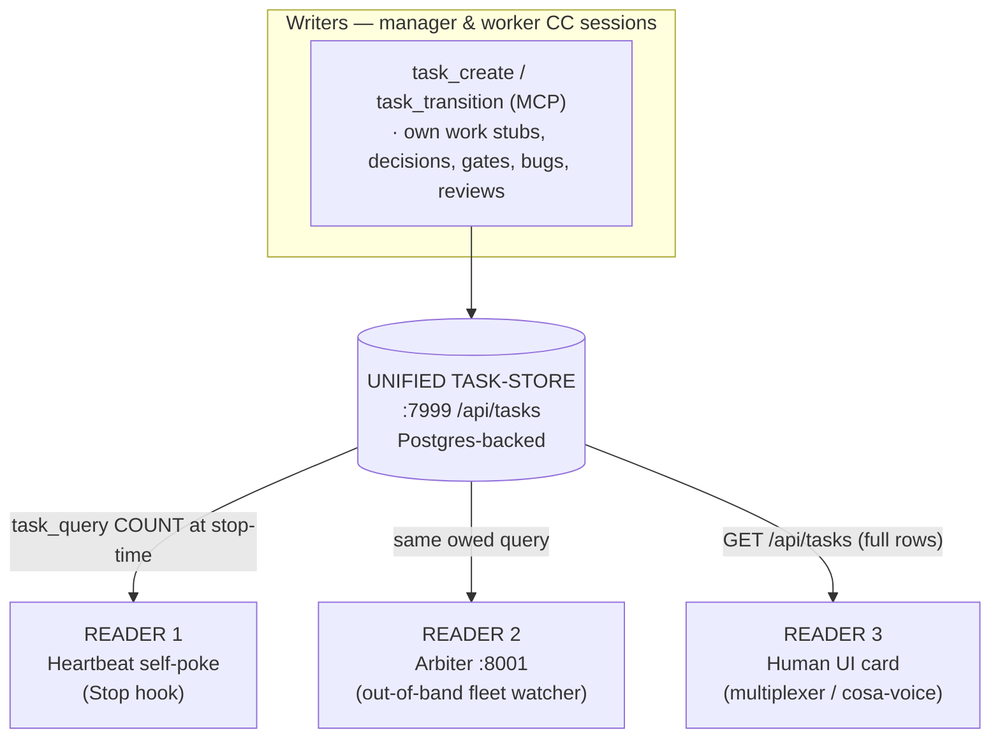

> Part 1 of 3 of the [Fleet Liveness & Unified Task-Store — Architecture (Top to Bottom)](../fleet-liveness-and-task-store-architecture.md): why it exists and the one store.

# Fleet Liveness & Unified Task-Store — Architecture (Top to Bottom)

**Status**: canonical architecture reference.
It was established 2026-06-17, right after the store-canonical cutover went live.

**Scope**: how the Lupin fleet tracks owed work and keeps multi-session ("fleet") agents alive and driven to completion.
It covers the **unified task-store**, the **heartbeat self-poke**, the **out-of-band arbiter** and the **human UI card**.
It also covers the **manager/worker lifecycle** that runs on top of them.

**Audience**. Any agent (or human) who needs the whole picture before touching the liveness path, the task store, or the arbiter.

**One-sentence summary**: There is **one** durable task store (`:7999 /api/tasks`); **three** readers consume it (the Stop-hook self-poke, the `:8001` arbiter, and a human UI card). A fleet of manager/worker Claude Code sessions writes to it and is kept alive by it.

---

## 1. Why this exists

The founding goal is a **token-efficient** way to track status and liveness.
It lets the fleet **drive lazy, stuck, blocked or missing-something sessions to completion**.
It does so without long idle stalls and without burning context re-reading a task list every turn.

Every earlier liveness bug traced to **two sources of truth**.
One was the native Claude Code harness task list, which is transcript-reconstructed and vocabulary-poor.
The other was the unified store, kept in sync by a fragile mirror.
The **store-canonical cutover (2026-06-17)** collapsed that to one source.
The design record is `src/rnd/v0.1.8/2026.06.16-store-canonical-task-mgmt-cascade-review.md` *(`REMOVED`; recover: `git show b113a3a7^:src/rnd/v0.1.8/2026.06.16-store-canonical-task-mgmt-cascade-review.md`)* (cascade review, build ACs, cutover log).
A separate plan document was intended and never authored.

---

## 2. The core: one store, three readers

- **The store is the single source of truth**.
  Owed work lives here and nowhere else: your tasks, work you assign, decisions, gates, bugs and review-requests.
  The native harness task list is **no longer** the liveness source, because the 2026-06-17 cutover jettisoned it.
- The three readers cannot disagree about "who owes what", because they read the same store with the same query shape.
  The old two-sources-of-truth bug is eliminated *by construction*, not patched.

### Data model (item shape)

Each item carries far richer vocabulary than the old harness list:

| Field | Meaning |
|---|---|
| `id` | server UUID (collision-safe) |
| `item_class` | `task` \| `decision` \| `gate` \| `bug` \| `review_request` |
| `status` | `queued` → `in_progress` → `blocked` → `done` \| `dropped` |
| `owner_persona` | who owes the work |
| `accountable_manager` | the chasing manager |
| `blocked_by` | typed refs `[{kind: item\|persona\|user, id}]` |
| `next_chase_ts` | when to re-chase a blocked item |
| `gate_class` | `none` \| `ricks_court` (awaiting the human's decision) |
| `priority`, `project`, `correlation_key`, `source_qid` | scoping / provenance |

**Discipline (enforced server-side):** `→done` `REQUIRES` a receipt (`commit` / `test_run` / `qid` / `doc_path` / `log_line`). `→blocked` `REQUIRES` a typed `blocked_by` and a `next_chase_ts`. *No receipt → not done.*

**Persona-key invariant (single source of truth):** `owner_persona`, `accountable_manager` and persona-typed `blocked_by` refs are stored as a **canonical key**.
The key is accent-stripped, punctuation-stripped and lowercased, with internal spaces kept (`María` → `maria`, `Mr. Radio` → `mr radio`). Every seam that writes, queries or compares a persona must route through the one root, `lupin_mcp.persona_normalization.canonical_persona_key`.
The write seam, the `/api/tasks` boundary and the owed-oracle read seam all do.
So do the arbiter role-matchers and `follow_through_escalation_watcher`.

DM-topic and session-name derivation uses the sibling `persona_slug`.
It has the same root, with internal spaces turned into a separator (`dm-mr_radio`).
Noisy free-text human input resolves via `normalize_for_match`, which is the root minus spaces.

**Never** hand-roll a `.lower()` or `re.sub` persona normalizer.
Divergence here is the exact bug that produced the 2026-06-18 false-idle P0.
The read queried `maría`, the store held `maria`, and zero rows matched.
It also split the DM-topic (`dm-maría` vs `dm-maria`). Authority: `src/rnd/v0.1.9/2026.06.19-persona-name-normalization/01-centralized-persona-normalization-plan.md`.

### Store API + agent verbs

- **HTTP**: `:7999 /api/tasks` — `routers/tasks.py` (handler) backed by `task_repository.py`. `GET /api/tasks?owner_persona=&status=` returns full-fidelity rows. `count_only=true` returns `{count}` via `func.count` (no row serialization) for the cheap poke path.
- **MCP verbs** (what agents call): `task_create`, `task_query`, `task_transition` (cosa-voice server). `task_query` is the always-allowed owed-work read. `task_create` mints typed/cross-persona items. `task_transition` applies one state change with receipts.

### Un-parking on the operator's card

A park is the operator's own not-now, so un-parking is approver-only.
Rick ruled one exception.
A **manager** may move a row `parked -> queued`.
The operator must have answered **yes on a card the server made for that row and that move**.
Nothing else changes.
`parked -> in_progress` and `parked -> done` stay refused, and a worker is refused whatever it types.

- **Ask**: `POST /api/tasks/{task_id}/unpark-ask` (manager seat only; MCP verb `task_ask_unpark`).
  The server inserts the card itself and writes `payload = { kind: "unpark_ask", task_id, move: "parked->queued" }`.
  No public door can write that column on a question, and `test_the_files_that_write_a_notification_payload_are_pinned` holds that.
  The server pushes the card after the insert commits, and returns `card_id` with `pushed`. `pushed: false` means the card is saved but the operator was not shown it. A re-ask is refused with 409 until the card expires (600 s). One unanswered card per row and park. A second ask gets 409 naming the first, and a row with no recorded park time gets 409 and no card. The card text names the row id and title. And silence refuses.
- **Cite**: after the operator answers yes, the manager sends the ordinary transition `parked -> queued` with `receipt_refs = { "approval_card": "<card_id>" }`.
  The door reads the card from the notification table and judges it in `task_promotion_gate.unpark_card_refusal`.
  The card must exist, have asked a question, and be answered (not the timed-out default) with yes.
  It must be posted on the operator's own login (`answered_by`), with a payload naming this row and this move.
  It must be made after the row was parked, and never used.
  Only then does `refusal_for_admission( unpark_card_ok=True )` let the move through.
- **Record**: the server writes its own resolved card id onto the event, over whatever the caller typed.
  That event is the single-use record (`TaskRepository.approval_card_ids_used` counts `parked->queued` events only).
  The `approval_card` key is refused on every other move, and for every caller but a manager's valid un-park, with one text.
  So a card cannot be burned by citing it, and its existence is not disclosed.

---
