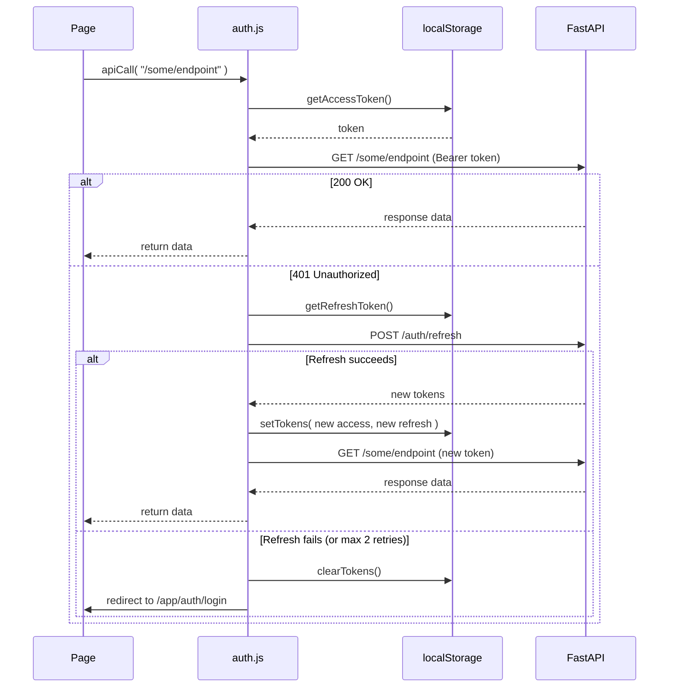
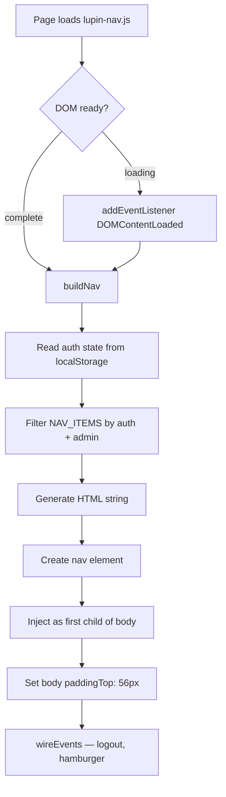
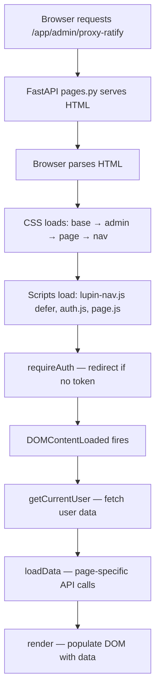

# Lupin Frontend Architecture

> **Plain-vanilla HTML/CSS/JS** — no framework, no build step, no bundler.
>
> Generated: 2026-02-23

---

## Table of Contents

1. [Overview](#overview)
2. [Directory Structure](#directory-structure)
3. [URL Routing](#url-routing)
4. [CSS Architecture](#css-architecture)
5. [Auth System (auth.js)](#auth-system-authjs)
6. [Navigation (lupin-nav.js)](#navigation-lupin-navjs)
7. [Page Lifecycle](#page-lifecycle)
8. [Common UI Patterns](#common-ui-patterns)
9. [Proxy UI Pages](#proxy-ui-pages)
10. [Adding a New Page](#adding-a-new-page)

---

## Overview

Lupin's frontend is a **multi-page application** (MPA) served as static HTML files by FastAPI. Each page is a self-contained HTML document that loads shared CSS and JS files. There is no build step, no transpilation, and no framework.

**Key principles**:
- Every HTML file works independently — no SPA router
- Auth state lives in `localStorage` (JWT tokens + user data)
- Shared behavior extracted to `auth.js` (API calls, token management) and `lupin-nav.js` (navigation bar)
- CSS uses a 4-layer cascade (base → domain → page → nav)
- Server-side routing via `pages.py` maps clean `/app/*` URLs to static files

**Technology stack**:
- **Server**: FastAPI (Python) with `StaticFiles` mount
- **Client**: Vanilla JS (ES6+), no dependencies except two vendored libs
- **Vendored libraries**: `marked.min.js` (markdown), `purify.min.js` (XSS sanitization)
- **Icons**: Inline SVG sprites (no icon font, no CDN)

---

## Directory Structure

```
src/lupin_app/static/
├── css/                                    # Global stylesheets
│   ├── lupin-base.css                      # Foundation: reset, body, buttons, messages, spinner, utilities
│   ├── lupin-nav.css                       # Top navigation bar (fixed, responsive)
│   └── notifications.css                   # Notifications page styling
│
├── js/                                     # Global JavaScript
│   ├── lupin-nav.js                        # Navigation bar IIFE (206 lines)
│   ├── notifications.js                    # WebSocket event handler + queue UI (12,950 lines)
│   ├── audio-recorder.js                   # Client-side audio capture
│   ├── hybrid-tts.js                       # TTS audio synthesis + live streaming
│   ├── chunk-sequencer.js                  # PCM chunk ordering for audio streams
│   ├── sequential-audio-manager.js         # Audio playback queue
│   ├── tts-audio-cache.js                  # Cache TTS-generated audio blobs
│   ├── job-completion-cache.js             # Cache completed job states
│   ├── websocket-diagnostic.js             # WebSocket debugging utility
│   ├── test/
│   │   └── experimental-tts.js             # TTS experiments
│   └── vendor/
│       ├── marked.min.js                   # Markdown parser (vendored)
│       └── purify.min.js                   # DOMPurify XSS sanitizer (vendored)
│
├── html/                                   # Page templates
│   ├── landing.html                        # /app — Home/landing page
│   ├── notifications.html                  # /app/notifications — Q&A interface
│   ├── dev-tools.html                      # /app/admin/dev-tools — Developer utilities
│   │
│   ├── auth/                               # Authentication pages
│   │   ├── login.html                      # /app/auth/login
│   │   ├── register.html                   # /app/auth/register
│   │   ├── profile.html                    # /app/auth/profile
│   │   ├── change-password.html            # /app/auth/change-password
│   │   ├── css/
│   │   │   └── auth.css                    # Auth page styling (forms, profile)
│   │   ├── js/
│   │   │   └── auth.js                     # Auth utilities (459 lines, 16 functions)
│   │   └── admin/                          # Admin-only pages
│   │       ├── users.html                  # /app/admin/users — User management
│   │       ├── proxy-ratify.html           # /app/admin/proxy-ratify — Decision ratification
│   │       ├── proxy-dashboard.html        # /app/admin/proxy-dashboard — Trust dashboard
│   │       ├── css/
│   │       │   ├── admin.css               # Admin layout, tables, modals, pagination
│   │       │   ├── proxy-ratify.css        # Ratification: summary cards, badges, decisions table
│   │       │   └── proxy-dashboard.css     # Trust: mode bar, trust cards, success rates
│   │       └── js/
│   │           ├── admin-users.js          # User management page logic
│   │           ├── proxy-ratify.js         # Ratification page logic (748 lines)
│   │           └── proxy-dashboard.js      # Trust dashboard logic (488 lines)
│   │
│   ├── admin/                              # Admin hub pages
│   │   ├── dashboard.html                  # /app/admin — Admin landing
│   │   ├── snapshots.html                  # /app/admin/snapshots — Solution snapshots
│   │   ├── css/
│   │   │   ├── admin-dashboard.css
│   │   │   └── admin-snapshots.css
│   │   └── js/
│   │       ├── admin-dashboard.js
│   │       └── admin-snapshots.js
│   │
│   └── test/                               # Development test pages (14 files)
│       ├── chunk-sequencing-test.html
│       ├── diagnostic-websocket-test.html
│       ├── test-audio.html
│       ├── test-hybrid-tts-*.html
│       ├── test_event_subscription.html
│       ├── test_session_*.html
│       └── ...
│
├── audio/                                  # Notification sounds
│   ├── gentle-gong.mp3
│   ├── notification-error.mp3
│   ├── notification-*-priority-*.mp3       # Priority-level notification sounds
│   └── ...
│
├── images/
│   └── play-16.png
│
└── lupin-mobile-test/                      # Flutter web build (24 MB, separate from main app)
    ├── index.html
    ├── main.dart.js
    └── ...
```

### Co-location Pattern

Each feature area co-locates its CSS and JS alongside its HTML:

```
html/auth/admin/
├── proxy-ratify.html       # HTML template
├── proxy-dashboard.html
├── css/
│   ├── admin.css           # Shared admin styles
│   ├── proxy-ratify.css    # Page-specific styles
│   └── proxy-dashboard.css
└── js/
    ├── proxy-ratify.js     # Page-specific logic
    └── proxy-dashboard.js
```

---

## URL Routing

### Clean URLs via `pages.py`

The `pages.py` router (`src/cosa/rest/routers/pages.py`) maps clean `/app/*` URLs to static HTML files using a `_ROUTE_TABLE` dictionary:

| Clean URL | Static File |
|-----------|-------------|
| `/app` | `html/landing.html` |
| `/app/notifications` | `html/notifications.html` |
| `/app/auth/login` | `html/auth/login.html` |
| `/app/auth/register` | `html/auth/register.html` |
| `/app/auth/profile` | `html/auth/profile.html` |
| `/app/auth/change-password` | `html/auth/change-password.html` |
| `/app/admin` | `html/admin/dashboard.html` |
| `/app/admin/users` | `html/auth/admin/users.html` |
| `/app/admin/snapshots` | `html/admin/snapshots.html` |
| `/app/admin/proxy-ratify` | `html/auth/admin/proxy-ratify.html` |
| `/app/admin/proxy-dashboard` | `html/auth/admin/proxy-dashboard.html` |
| `/app/admin/dev-tools` | `html/dev-tools.html` |

Each route serves the HTML file with `FileResponse( path, media_type="text/html" )`. No server-side auth enforcement — authentication is handled client-side by each page's JavaScript.

### Legacy Static Paths

All files are also accessible at their original `/static/html/*` paths via FastAPI's `StaticFiles` mount. Both URL schemes work simultaneously for backward compatibility.

### URL Conventions

- `/app` — Landing page (public, content varies by auth state)
- `/app/auth/*` — Authentication pages (login, register, profile, change-password)
- `/app/admin/*` — Admin-only pages (dashboard, users, snapshots, proxy-ratify, proxy-dashboard, dev-tools)
- `/` — Health check endpoint (JSON, not a page)

---

## CSS Architecture

### 4-Layer Cascade

Every page follows a consistent CSS loading order. Later layers override earlier ones:

```
Layer 1: lupin-base.css     — Reset, body defaults, buttons, messages, spinner, utilities
Layer 2: Domain CSS         — auth.css, admin.css (feature-area styling)
Layer 3: Page CSS           — proxy-ratify.css, proxy-dashboard.css (page-specific)
Layer 4: lupin-nav.css      — Navigation bar (loaded LAST, highest specificity for z-index)
```

**Example** — proxy-ratify.html loads CSS in this order:

```html
<link rel="stylesheet" href="/static/css/lupin-base.css">
<link rel="stylesheet" href="/static/html/auth/admin/css/admin.css">
<link rel="stylesheet" href="/static/html/auth/admin/css/proxy-ratify.css">
<link rel="stylesheet" href="/static/css/lupin-nav.css">
```

### Layer 1: `lupin-base.css` — Foundation

Shared by every page. Provides:

| Section | Classes/Elements |
|---------|-----------------|
| Reset | `* { margin: 0; padding: 0; box-sizing: border-box; }` |
| Body | System font stack, `#f8f9fa` background, `#333` text |
| Buttons | `.btn`, `.btn-primary`, `.btn-secondary`, `.btn-danger`, `.btn-small` |
| Messages | `.error-message`, `.success-message` (hidden by default) |
| Spinner | `.loading`, `.spinner` (CSS animation) |
| Utilities | `.text-center`, `.text-muted`, `.hidden`, `.mt-1`/`.mt-2`/`.mt-3`, `.mb-1`/`.mb-2`/`.mb-3` |

### Layer 2: Domain CSS

Feature-area styles that apply to all pages in a domain:

| File | Scope | Provides |
|------|-------|----------|
| `auth.css` | `/app/auth/*` pages | `.auth-container`, `.auth-form`, `.profile-container`, `.form-group`, `.role-badge` |
| `admin.css` | `/app/admin/*` pages | `.admin-container`, `.admin-header`, `.filter-bar`, `.filter-select`, `.users-table`, `.modal`, `.pagination`, `.breadcrumb` |

### Layer 3: Page CSS

Page-specific styles:

| File | Page | Provides |
|------|------|----------|
| `proxy-ratify.css` | Ratification | `.summary-cards`, `.badge-shadow/suggest/act/defer`, `.badge-trust-1..5`, `.badge-pending/approved/rejected`, `.decisions-table`, `.bulk-actions`, `.empty-state` |
| `proxy-dashboard.css` | Trust Dashboard | `.mode-bar`, `.trust-cards-grid`, `.trust-card-level-1..5`, `.success-rate-bar`, `.cb-status` (circuit breaker), `.dashboard-table` |

### Layer 4: `lupin-nav.css` — Navigation

Always loaded last. Fixed position top bar with `z-index: 9999`. Responsive hamburger menu at `< 768px`.

### Design Tokens

Colors used consistently across layers:

| Token | Value | Usage |
|-------|-------|-------|
| Primary | `#3b82f6` | Buttons, active nav, focus rings |
| Nav Background | `#1e293b` | Fixed top nav bar |
| Body Background | `#f8f9fa` | Page backgrounds |
| Text Primary | `#333` / `#2d3748` | Body text, headings |
| Text Muted | `#718096` / `#a0aec0` | Labels, secondary text |
| Success | `#48bb78` / `#c6f6d5` | Approved badges, success messages |
| Danger | `#f56565` / `#fed7d7` | Rejected badges, error messages |
| Warning | `#ed8936` / `#feebc8` | Pending badges |

---

## Auth System (auth.js)

**File**: `src/lupin_app/static/html/auth/js/auth.js` (459 lines, 16 functions)

The authentication utility library. Loaded by every authenticated page. All functions are global (no module system).

### Function Reference

| Function | Purpose | Returns |
|----------|---------|---------|
| **Token Management** | | |
| `getAccessToken()` | Read access token from localStorage | `string \| null` |
| `getRefreshToken()` | Read refresh token from localStorage | `string \| null` |
| `setTokens( access, refresh )` | Store both tokens | `void` |
| `clearTokens()` | Remove tokens + user data | `void` |
| `setUserData( userData )` | Store user info as JSON | `void` |
| `getUserData()` | Parse stored user info | `object \| null` |
| **API Calls** | | |
| `apiCall( endpoint, method, data, includeAuth, retryCount )` | HTTP request with auto token refresh | `Promise<object>` |
| `refreshAccessToken()` | Exchange refresh token for new pair | `Promise<boolean>` |
| **Auth State** | | |
| `isAuthenticated()` | Check if access token exists | `boolean` |
| `getCurrentUser()` | Get user data (localStorage or API fallback) | `Promise<object \| null>` |
| `hasRole( role )` | Check user has specific role | `Promise<boolean>` |
| `isAdmin()` | Shorthand for `hasRole( "admin" )` | `Promise<boolean>` |
| **Auth Actions** | | |
| `login( email, password )` | Login and store tokens | `Promise<object>` |
| `logout()` | Server logout + clear tokens + redirect | `Promise<void>` |
| `register( email, password )` | Register new account | `Promise<object>` |
| `changePassword( current, new )` | Change password | `Promise<object>` |
| **Redirect Handling** | | |
| `getSafeRedirectUrl()` | Extract `?redirect=` param (validates `/app` or `/static/html/` prefix) | `string` |
| **UI Helpers** | | |
| `showError( elementId, message )` | Show error div | `void` |
| `hideError( elementId )` | Hide error div | `void` |
| `showSuccess( elementId, message )` | Show success div | `void` |
| `hideSuccess( elementId )` | Hide success div | `void` |
| `showLoading( elementId )` | Show loading spinner | `void` |
| `hideLoading( elementId )` | Hide loading spinner | `void` |
| **Page Protection** | | |
| `requireAuth()` | Redirect to login if not authenticated | `void` |
| `requireAdmin()` | requireAuth() + check admin role | `Promise<void>` |

### Token Flow



### localStorage Keys

| Key | Type | Content |
|-----|------|---------|
| `lupin_access_token` | string | JWT access token |
| `lupin_refresh_token` | string | JWT refresh token |
| `user_data` | JSON string | `{ email, roles, ... }` |

---

## Navigation (lupin-nav.js)

**File**: `src/lupin_app/static/js/lupin-nav.js` (206 lines)

A **self-contained IIFE** that injects a responsive top navigation bar into every page. Zero dependency on `auth.js` — reads localStorage directly.

### Architecture



### Data-Driven Navigation

Adding a page to the nav bar is a one-line change in the `NAV_ITEMS` array:

```javascript
const NAV_ITEMS = [
    { label: "Home",          url: "/app",                       icon: "home",   auth: false, admin: false },
    { label: "Notifications", url: "/app/notifications",         icon: "bell",   auth: true,  admin: false },
    { label: "Profile",       url: "/app/auth/profile",          icon: "user",   auth: true,  admin: false },
    { label: "Admin",         url: "/app/admin",                 icon: "shield", auth: true,  admin: true  },
    { label: "Users",         url: "/app/admin/users",           icon: "users",  auth: true,  admin: true  },
    { label: "Snapshots",     url: "/app/admin/snapshots",       icon: "camera", auth: true,  admin: true  },
    { label: "Ratification",  url: "/app/admin/proxy-ratify",    icon: "check",  auth: true,  admin: true  },
    { label: "Trust",         url: "/app/admin/proxy-dashboard", icon: "chart",  auth: true,  admin: true  },
    { label: "Dev Tools",     url: "/app/admin/dev-tools",       icon: "wrench", auth: true,  admin: true  }
];
```

### Visibility Rules

| `auth` | `admin` | Visible When |
|--------|---------|-------------|
| `false` | `false` | Always |
| `true` | `false` | User is logged in |
| `true` | `true` | User is logged in AND has admin role |

### Features

- **Active page highlighting**: Compares `window.location.pathname` against item URLs (`startsWith` for sub-pages, exact match for `/app`)
- **Admin section separator**: Visual divider between app and admin nav items
- **Responsive hamburger**: Collapses to hamburger menu below 768px
- **Inline SVG icons**: 11 icon sprites embedded to avoid network requests
- **Self-contained logout**: Clears localStorage directly (no auth.js dependency)

---

## Page Lifecycle

Every authenticated page follows the same initialization pattern:



### Script Loading Order

```html
<!-- Navigation bar — defer ensures it runs after DOM parse -->
<script src="/static/js/lupin-nav.js" defer></script>

<!-- Auth utilities — loads and executes immediately -->
<script src="/static/html/auth/js/auth.js"></script>

<!-- Page logic — executes after auth.js is available -->
<script src="/static/html/auth/admin/js/proxy-ratify.js"></script>
```

### Standard Page JS Structure

Every page JS file follows this structure:

```javascript
// 1. State variables
let data = [];
let currentPage = 1;

// 2. Auth gate (executes immediately)
requireAuth();

// 3. DOMContentLoaded handler
document.addEventListener( "DOMContentLoaded", async function() {
    const user = await getCurrentUser();
    await loadData();
});

// 4. API functions — loadX(), saveX(), deleteX()
async function loadData() { ... }

// 5. UI rendering — renderTable(), renderCards()
function renderTable( items ) { ... }

// 6. Event handlers — filter changes, button clicks
document.getElementById( "filter" )?.addEventListener( "change", ... );

// 7. Utility functions — formatTime(), escapeHtml(), truncate()
function escapeHtml( text ) { ... }
```

---

## Common UI Patterns

### Loading States

Every page with async data follows:

```html
<div class="loading" id="loading">
    <div class="spinner"></div>
    <p class="mt-2">Loading data...</p>
</div>
<div id="main-content" style="display: none;">
    <!-- Actual content -->
</div>
```

```javascript
showLoading( "loading" );
document.getElementById( "main-content" ).style.display = "none";
// ... fetch data ...
hideLoading( "loading" );
document.getElementById( "main-content" ).style.display = "block";
```

### Error/Success Messages

Standard message divs at the top of each page:

```html
<div class="error-message" id="error-message"></div>
<div class="success-message" id="success-message"></div>
```

Used via auth.js helpers: `showError( "error-message", "Something failed" )`.

### Breadcrumbs

Admin pages include breadcrumb navigation:

```html
<div class="breadcrumb">
    <a href="/app">Home</a>
    <span class="separator">></span>
    <a href="/app/admin">Admin</a>
    <span class="separator">></span>
    <span class="current">Page Name</span>
</div>
```

### Tables with Pagination

Data tables follow the pattern:

```html
<table class="decisions-table">
    <thead><tr><th>...</th></tr></thead>
    <tbody id="decisions-tbody"><!-- JS populated --></tbody>
</table>

<div class="pagination" id="pagination-container">
    <button id="prev-page" onclick="previousPage()" disabled>← Previous</button>
    <span id="page-info">Page 1</span>
    <button id="next-page" onclick="nextPage()">Next →</button>
</div>
```

Client-side pagination with `currentPage`, `pageLimit`, and `updatePagination()`.

### Filter Bars

Selects with event listeners that trigger `applyFilters()`:

```html
<div class="filter-bar">
    <select id="filter-category" class="filter-select">
        <option value="">All Categories</option>
        <option value="deployment">Deployment</option>
        <!-- ... -->
    </select>
</div>
```

### Modals

Two-modal pattern used in admin pages:

1. **Detail modal** — shows item details with approve/reject actions
2. **Confirm modal** — confirms destructive actions (bulk reject)

```html
<div id="detail-modal" class="modal">
    <div class="modal-content">
        <span class="close" onclick="closeModal()">&times;</span>
        <h2>Title</h2>
        <div id="detail-content"><!-- JS populated --></div>
        <div class="modal-actions">
            <button class="btn btn-primary" onclick="approve()">Approve</button>
            <button class="btn btn-danger" onclick="reject()">Reject</button>
            <button class="btn btn-secondary" onclick="closeModal()">Cancel</button>
        </div>
    </div>
</div>
```

Modals close on outside click:

```javascript
window.addEventListener( "click", function( event ) {
    if ( event.target.classList.contains( "modal" ) ) {
        event.target.style.display = "none";
    }
});
```

### Badge System

Three badge families used across proxy pages:

| Family | Classes | Colors |
|--------|---------|--------|
| Action | `.badge-shadow`, `.badge-suggest`, `.badge-act`, `.badge-defer` | Gray, Blue, Green, Yellow |
| Trust Level | `.badge-trust-1` through `.badge-trust-5` | Gray → Blue → Green → Purple → Yellow |
| Ratification | `.badge-pending`, `.badge-approved`, `.badge-rejected`, `.badge-nr` | Orange, Green, Red, Gray |

All badges share the same base styling: `padding: 4px 10px; border-radius: 12px; font-size: 12px; font-weight: 600; text-transform: uppercase`.

### XSS Protection

Both proxy JS files include an `escapeHtml()` function:

```javascript
function escapeHtml( text ) {
    if ( text == null ) return "";
    const div = document.createElement( "div" );
    div.textContent = String( text );
    return div.innerHTML;
}
```

All user-supplied content passes through `escapeHtml()` before DOM insertion.

### Empty States

When no data is available:

```html
<div id="empty-state" class="empty-state" style="display: none;">
    <div class="empty-icon">&#9989;</div>
    <p>No pending decisions. All caught up!</p>
</div>
```

---

## Proxy UI Pages

### Ratification Page (`/app/admin/proxy-ratify`)

**Purpose**: Admin queue for reviewing and approving/rejecting proxy decisions.

**Files**:
- `html/auth/admin/proxy-ratify.html` (204 lines)
- `html/auth/admin/js/proxy-ratify.js` (748 lines, 26 functions)
- `html/auth/admin/css/proxy-ratify.css` (534 lines)

**Key UI Elements**:

| Element | ID | Purpose |
|---------|----|---------|
| Summary Cards | `stat-pending`, `stat-approved`, `stat-rejected`, `stat-oldest` | At-a-glance counts |
| Filter Bar | `filter-category`, `filter-trust-level`, `filter-action` | Client-side filtering |
| Bulk Actions | `bulk-actions`, `selected-count` | Multi-select approve/reject |
| Decisions Table | `decisions-tbody` | 8-column table (checkbox, category, question, action, trust, confidence, age, actions) |
| Detail Modal | `detail-modal`, `decision-detail`, `feedback-text` | View + feedback + approve/reject |
| Confirm Modal | `confirm-modal`, `confirm-message` | Bulk rejection confirmation |
| Pagination | `prev-page`, `page-info`, `next-page` | Page navigation |
| Empty State | `empty-state` | No pending decisions |

**API Endpoints Used**:
- `GET /api/proxy/pending/{email}` — Load pending decisions
- `POST /api/proxy/ratify/{id}?approved=true&user_email=...` — Ratify a decision

**Real-time Updates**: WebSocket connection to `/ws/queue/proxy ratify` subscribes to `proxy_decision_new` events and calls `loadPending()` on arrival. Tab-focus also triggers a refresh.

**Functions** (26 total):

| Category | Functions |
|----------|-----------|
| API | `loadPending`, `ratifyDecision` |
| Rendering | `renderSummaryCards`, `renderTable`, `showEmptyState` |
| Badges | `getActionBadge`, `getTrustBadge`, `getRatificationBadge` |
| Filters | `applyFilters`, `clearFilters` |
| Selection | `toggleSelect`, `toggleSelectAll`, `updateBulkActions` |
| Bulk | `bulkApprove`, `bulkReject`, `confirmBulkReject`, `closeConfirmModal` |
| Quick Actions | `quickApprove`, `quickReject` |
| Detail Modal | `showDecisionDetail`, `closeDetailModal`, `modalApprove`, `modalReject` |
| Pagination | `updatePagination`, `previousPage`, `nextPage` |
| Utilities | `formatRelativeTime`, `escapeHtml`, `truncate`, `showElement`, `hideElement` |
| WebSocket | `connectProxyWebSocket` |
| Computed | `computeApprovedToday`, `computeRejectedToday` |

### Trust Dashboard (`/app/admin/proxy-dashboard`)

**Purpose**: Visualize trust levels per SWE category, view recent decisions, and change trust mode.

**Files**:
- `html/auth/admin/proxy-dashboard.html` (132 lines)
- `html/auth/admin/js/proxy-dashboard.js` (488 lines, 20 functions)
- `html/auth/admin/css/proxy-dashboard.css` (397 lines)

**Key UI Elements**:

| Element | ID | Purpose |
|---------|----|---------|
| Mode Bar | `mode-trust-select`, `mode-domain`, `mode-user`, `mode-status-dot` | Trust mode selector + status |
| Trust Cards Grid | `trust-cards-grid` | 6 category cards (3×2 grid) |
| Category Selector | `category-selector` | Filter recent decisions by category |
| Decisions Table | `decisions-tbody` | 6-column table (time, question, action, trust, confidence, state) |
| Pagination | `prev-page`, `page-info`, `next-page` | Page navigation |
| Empty State | `decisions-empty` | No decisions recorded |

**API Endpoints Used**:
- `GET /api/proxy/trust/{email}?domain=swe` — Load trust states per category
- `GET /api/proxy/decisions/swe/{category}?limit=N` — Load recent decisions
- `GET /api/proxy/mode` — Get current trust mode
- `PUT /api/proxy/mode` — Change trust mode (hot-reload)

**Constants**:
- `SWE_CATEGORIES` — 6 categories: deployment, testing, deps, architecture, destructive, general
- `TRUST_LABELS` — L1 Shadow, L2 Provisional, L3 Trusted, L4 Autonomous, L5 Full Trust

**Trust Card Structure**:
Each of the 6 category cards shows:
- Category icon + label
- Trust level (L1-L5) with color-coded border
- Success rate progress bar
- Total decisions count, rejected count, circuit breaker status

**Functions** (20 total):

| Category | Functions |
|----------|-----------|
| API | `loadTrustStates`, `loadRecentDecisions` |
| Rendering | `renderModeBar`, `updateModeStatusDot`, `renderTrustCards`, `createTrustCard`, `renderRecentDecisions` |
| Mode | `onModeChange` |
| Badges | `getActionBadge`, `getTrustBadge`, `getRatificationBadge` |
| Pagination | `updatePagination`, `previousPage`, `nextPage` |
| Utilities | `formatRelativeTime`, `escapeHtml`, `truncate`, `showElement`, `hideElement` |

---

## Adding a New Page

### Checklist

1. **Create the HTML file** in the appropriate subdirectory under `static/html/`:
   ```
   static/html/auth/admin/my-page.html    # Admin page
   static/html/auth/my-page.html          # Auth-required page
   static/html/my-page.html               # Public page
   ```

2. **Set up the CSS cascade** in `<head>`:
   ```html
   <link rel="stylesheet" href="/static/css/lupin-base.css">
   <!-- Layer 2: domain CSS (pick one) -->
   <link rel="stylesheet" href="/static/html/auth/admin/css/admin.css">
   <!-- Layer 3: page-specific CSS (create if needed) -->
   <link rel="stylesheet" href="/static/html/auth/admin/css/my-page.css">
   <!-- Layer 4: navigation (always last) -->
   <link rel="stylesheet" href="/static/css/lupin-nav.css">
   ```

3. **Load scripts** at the bottom of `<body>`:
   ```html
   <script src="/static/js/lupin-nav.js" defer></script>
   <script src="/static/html/auth/js/auth.js"></script>
   <script src="/static/html/auth/admin/js/my-page.js"></script>
   ```

4. **Add the route** to `_ROUTE_TABLE` in `src/cosa/rest/routers/pages.py`:
   ```python
   _ROUTE_TABLE = {
       # ... existing routes ...
       "/app/admin/my-page" : "html/auth/admin/my-page.html",
   }
   ```
   Then add the corresponding route handler:
   ```python
   @router.get( "/app/admin/my-page", include_in_schema=False )
   async def page_admin_my_page():
       return _serve_file( _ROUTE_TABLE[ "/app/admin/my-page" ] )
   ```

5. **Add to navigation** (optional) — add an entry to `NAV_ITEMS` in `lupin-nav.js`:
   ```javascript
   { label: "My Page", url: "/app/admin/my-page", icon: "wrench", auth: true, admin: true }
   ```

6. **Create the page JS** following the standard structure:
   ```javascript
   // Auth gate
   requireAuth();

   // Initialize on DOM ready
   document.addEventListener( "DOMContentLoaded", async function() {
       const user = await getCurrentUser();
       await loadData();
   });
   ```

7. **Add standard HTML elements** — loading state, error/success messages, breadcrumb:
   ```html
   <div class="breadcrumb">
       <a href="/app">Home</a> <span class="separator">></span>
       <a href="/app/admin">Admin</a> <span class="separator">></span>
       <span class="current">My Page</span>
   </div>
   <div class="error-message" id="error-message"></div>
   <div class="success-message" id="success-message"></div>
   <div class="loading" id="loading">
       <div class="spinner"></div>
       <p class="mt-2">Loading...</p>
   </div>
   <div id="main-content" style="display: none;">
       <!-- Page content -->
   </div>
   ```

8. **Update integration tests** — add the new URL to `test_navigation_links.py`:
   ```python
   # In the @pytest.mark.parametrize list:
   "/app/admin/my-page",
   ```

---

## Related Documentation

- **WebSocket Architecture**: `src/docs/websocket-architecture.md`
- **WebSocket Events**: `src/docs/websocket-events.md`
- **Notification API**: `src/docs/notification-api.md`
- **UI Design Spec (Proxy)**: `src/rnd/2026.02.14-swe-team-phase-4-decision-proxy-architecture/04-ui-design-ratification-dashboard.md`
- **Testing Validation**: `src/rnd/2026.02.14-swe-team-phase-4-decision-proxy-architecture/06-testing-validation.md`
