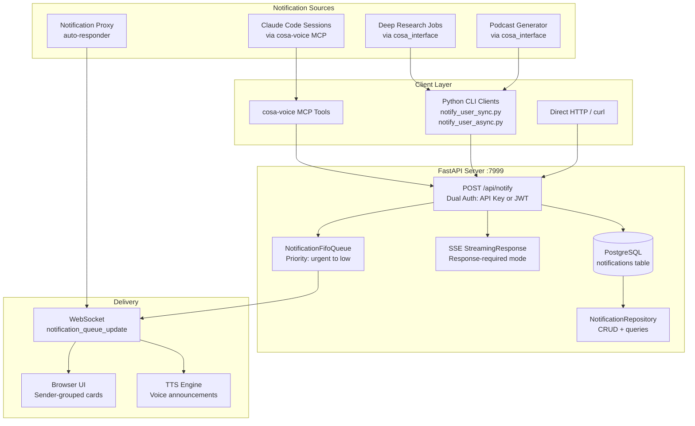
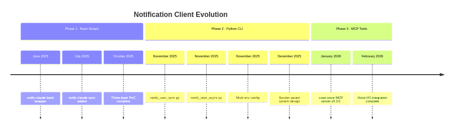
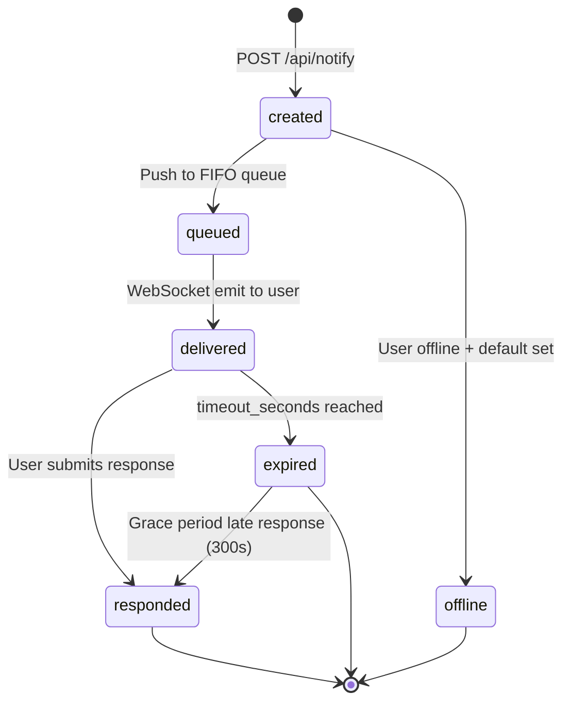
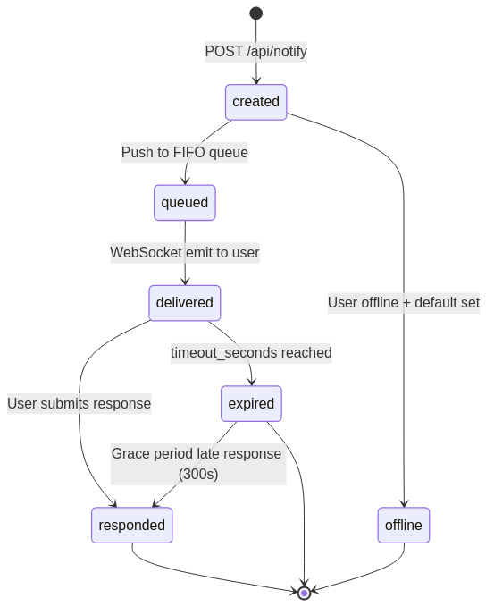
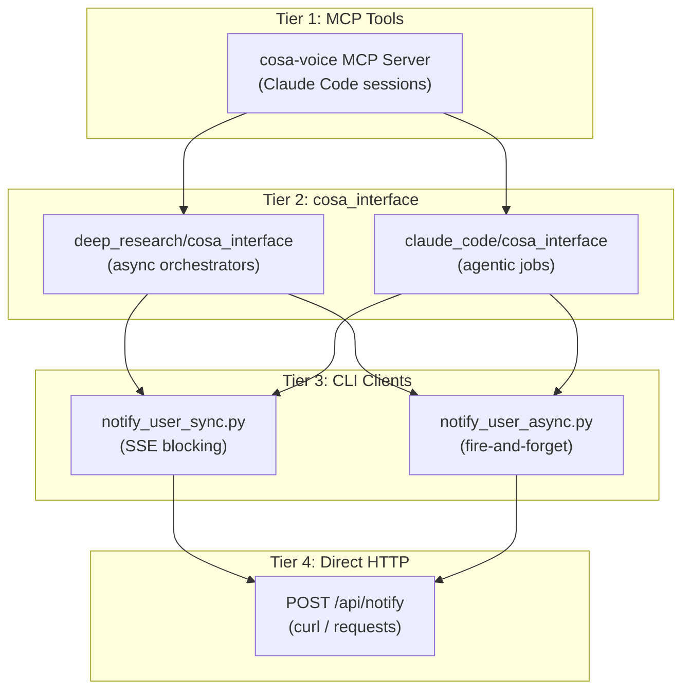
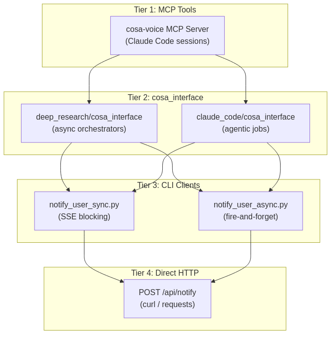
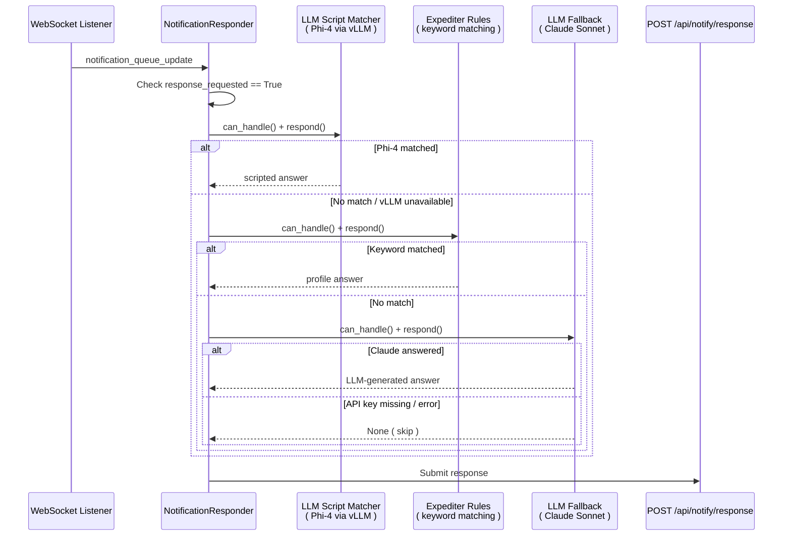
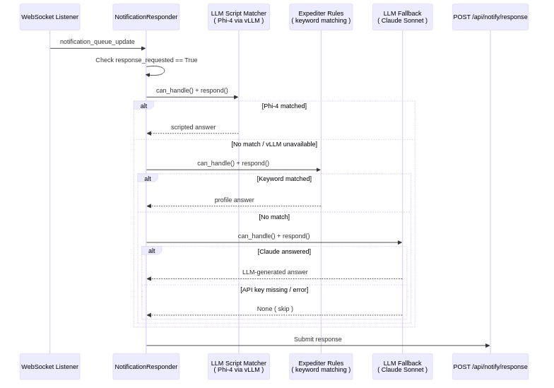

# Lupin Notification API Reference

> **One-stop reference** for the Lupin notification system — from architecture to testing.
>
> **Last Updated**: 2026-02-13
> **Source of Truth**: This document supersedes all R&D planning docs in `src/rnd/2025.10.15-sse-notifications/`.

---

## Table of Contents

1. [Overview & Architecture](#1-overview--architecture)
    - 1.5 [Historical Evolution](#15-historical-evolution)
2. [Quick-Start Examples](#2-quick-start-examples)
3. [Authentication](#3-authentication)
4. [Complete REST API Reference](#4-complete-rest-api-reference)
5. [Pydantic Models & Enums](#5-pydantic-models--enums) *(second half)*
6. [In-Memory Queue ( NotificationFifoQueue )](#6-in-memory-queue--notificationfifoqueue-) *(second half)*
7. [PostgreSQL Persistence](#7-postgresql-persistence) *(second half)*
8. [SSE Blocking Flow](#8-sse-blocking-flow) *(second half)*
9. [WebSocket Events](#9-websocket-events) *(second half)*
10. [CLI Clients](#10-cli-clients) *(second half)*
11. [cosa-voice MCP Integration](#11-cosa-voice-mcp-integration) *(second half)*
12. [Notification Proxy ( Auto-Responder )](#12-notification-proxy--auto-responder-) *(second half)*
13. [Testing & Debugging](#13-testing--debugging) *(second half)*

---

## 1. Overview & Architecture

### Executive Summary

Lupin's notification system enables bidirectional communication between automated
agents (Claude Code sessions, deep research jobs, podcast generators) and human
users. It supports two fundamental modes:

1. **Fire-and-forget** — The agent sends a message; no response expected. Used for
   progress updates, task completions, and alerts.
2. **Response-required** — The agent sends a question and blocks until the user
   responds or a timeout occurs. Used for confirmations, decisions, and open-ended
   input.

The system is designed for a **voice-first UX**: notifications are spoken aloud via
TTS, and user responses can be captured through voice-to-text or traditional text
input.

---

### Three Delivery Layers

Every notification flows through up to three layers, each serving a distinct purpose:

#### Layer 1: FIFO Queue + WebSocket ( real-time )

An in-memory `NotificationFifoQueue` accepts incoming notifications and immediately
pushes them to connected browser clients via WebSocket events
( `notification_queue_update` ). Priority handling ensures that `urgent` and `high`
items are inserted at the front of the queue, while `medium` and `low` items are
appended to the back.

**Source**: `src/cosa/rest/notification_fifo_queue.py`

#### Layer 2: PostgreSQL ( persistent history )

All notifications are persisted via the `Notification` SQLAlchemy ORM model and the
`NotificationRepository` class. This layer enables:

- Conversation grouping by sender
- Date-based accordion display
- Sender analytics ( last activity, notification counts )
- Soft-delete / archive via `is_hidden` flag

**Source**: `src/cosa/rest/postgres_models.py` ( lines 482-628 ),
`src/cosa/rest/db/repositories/notification_repository.py`

#### Layer 3: SSE ( synchronous blocking )

For response-required notifications, the `POST /api/notify` endpoint returns a
`StreamingResponse` with Server-Sent Events. The SSE stream stays open until one
of three things happens:

1. The user responds ( via the browser UI or voice input )
2. The timeout expires ( `timeout_seconds` parameter )
3. The user is detected as offline ( immediate default return )

**Source**: Router endpoint `POST /api/notify` with `response_requested=true`

---

### Key Concepts

#### Sender Identity

Every notification carries a `sender_id` in the format:

```
{agent_type}@{project}.deepily.ai
```

Or, for session-aware senders:

```
{agent_type}@{project}.deepily.ai#{session_id}
```

**Known agent types**:

| Agent Type             | Description                                |
|------------------------|--------------------------------------------|
| `claude.code`          | Claude Code CLI sessions ( via cosa-voice ) |
| `deep.research`        | Deep Research agentic jobs                 |
| `podcast.generator`    | Podcast Generator agentic jobs             |
| `claude.code.job`      | Claude Agent SDK bounded/interactive jobs  |
| `notification.proxy`   | Auto-responder proxy                       |
| `arg.expeditor`        | Runtime argument expeditor agent           |

**Examples**:

```
claude.code@lupin.deepily.ai
claude.code@lupin.deepily.ai#a1b2c3d4
deep.research@lupin.deepily.ai#dr-5e6f7a8b
podcast.generator@lupin.deepily.ai
```

#### Recipient Routing

Notifications target a user by **email address** ( the `target_user` parameter ).
The server resolves the email to an internal UUID via `get_user_by_email()`, then
uses that UUID for database storage and WebSocket delivery.

#### Conversation Grouping

The frontend groups notifications by `sender_id`, creating a chat-style interface
where each sender has its own card. Within each card, notifications are organized
into date-based accordion sections for easy navigation.

#### Job Card Routing

The optional `job_id` field routes notifications to specific agentic job cards in
the UI. This allows long-running background jobs ( deep research, podcast generation )
to have their own notification streams displayed within the job's progress panel.

**Job ID formats**:

- Short: `dr-a1b2c3d4`, `mock-12345678`
- SHA256: 64 hex characters
- Compound: `{sha256}::{uuid}`

---

### System Architecture Diagram




---

### Component Map

The following table maps each component to its implementation file:

| Component              | File                                                            | Approx. Lines | Purpose                                          |
|------------------------|-----------------------------------------------------------------|---------------|--------------------------------------------------|
| REST API endpoints     | `src/cosa/rest/routers/notifications.py`                        | 1,948         | All 17 notification endpoints                    |
| In-memory queue        | `src/cosa/rest/notification_fifo_queue.py`                      | 588           | FIFO queue with WebSocket emission               |
| PostgreSQL model       | `src/cosa/rest/postgres_models.py`                              | 482-628       | `Notification` ORM model, 20+ columns            |
| Repository             | `src/cosa/rest/db/repositories/notification_repository.py`      | 892           | CRUD, conversation queries, sender analytics     |
| Pydantic models        | `src/cosa/cli/notification_models.py`                           | 1,062         | Request/response models, SSE events, enums       |
| API key auth           | `src/cosa/rest/middleware/api_key_auth.py`                      | ~200          | Dual auth middleware ( API key or JWT )           |
| Sync CLI client        | `src/cosa/cli/notify_user_sync.py`                              | ~400          | SSE blocking client with retry                   |
| Async CLI client       | `src/cosa/cli/notify_user_async.py`                             | ~300          | Fire-and-forget with adaptive retry              |
| Generic CLI client     | `src/cosa/cli/notify_user.py`                                   | ~300          | Legacy/fallback notification sender              |
| Type enums             | `src/cosa/cli/notification_types.py`                            | 102           | NotificationType, NotificationPriority enums     |
| Voice I/O layer        | `src/cosa/agents/utils/voice_io.py`                             | ~820          | Voice-first with CLI fallback                    |
| Deep Research interface| `src/cosa/agents/deep_research/cosa_interface.py`               | ~490          | Async notification wrappers for DR agent         |
| Claude Code interface  | `src/cosa/agents/claude_code/cosa_interface.py`                 | ~220          | Async notification wrappers for CC agent         |
| Proxy listener         | `src/cosa/agents/notification_proxy/listener.py`                | 359           | WebSocket listener for auto-response             |
| Proxy responder        | `src/cosa/agents/notification_proxy/responder.py`               | 465           | Strategy chain for auto-answering                |
| Proxy config           | `src/cosa/agents/notification_proxy/config.py`                  | 286           | Profiles, credentials, constants                 |

---

### Request Flow: Fire-and-Forget

```
1. Client sends POST /api/notify with message, type, priority, target_user
2. Middleware validates API key or JWT
3. Server validates parameters ( type, priority, message non-empty )
4. Server resolves target_user email → UUID via get_user_by_email()
5. Server resolves sender_id: explicit > [PREFIX] extraction > default
6. NotificationFifoQueue.push_notification() adds item to queue
   - urgent/high priority → front of queue
   - medium/low priority → back of queue
7. WebSocket emission: notification_queue_update event sent to user
8. PostgreSQL: notification persisted via NotificationRepository
9. Server returns JSON: { "status": "queued", "connection_count": N }
```

### Request Flow: Response-Required

```
1.  Client sends POST /api/notify with response_requested=true, response_type, timeout_seconds
2.  Middleware validates API key or JWT
3.  Server validates parameters including response_type ( yes_no | open_ended | multiple_choice | open_ended_batch )
4.  Server resolves target_user email → UUID
5.  Offline check: if user not connected via WebSocket:
    a. If response_default provided → return default immediately with status "offline"
    b. If no default → HTTP 503 "User is offline and no default response provided"
6.  PostgreSQL: notification created with state='delivered', expires_at calculated
7.  asyncio.Event created and stored in pending_responses dict
8.  NotificationFifoQueue.push_notification() with all response fields
9.  WebSocket emission: notification rendered in UI with response controls
10. SSE StreamingResponse returned to caller — stream stays open
11. User responds in UI → POST /api/notify/response called
    a. Database updated: state='responded', response_value stored
    b. asyncio.Event.set() wakes up the SSE stream
    c. WebSocket: notification_responded event broadcast
12. SSE stream yields: { "status": "responded", "response": "...", "default_used": false }
13. Stream closes, pending_responses entry cleaned up

    --- OR on timeout ---

11. asyncio.wait_for() raises TimeoutError
12. Database: notification marked as expired
13. WebSocket: notification_expired event broadcast
14. SSE stream yields: { "status": "expired", "response": "<default>", "default_used": true }
15. Stream closes, pending_responses entry cleaned up
```

---

## 1.5 Historical Evolution

Understanding the evolution of the notification system helps explain why certain
patterns exist in the codebase today.

### Phase 1 — Bash Scripts ( June-October 2025 )

Claude Code originally sent notifications by executing bash scripts from the
terminal. This was the first working prototype of agent-to-human communication.

**Components**:

- **Global commands** installed at `~/.local/bin/`:
  - `notify-claude-async` — Fire-and-forget notifications
  - `notify-claude-sync` — Response-required notifications with SSE blocking
  - `notify-claude` — Unified wrapper
- **Project-level wrapper**: `src/scripts/notify.sh`
- **Architecture**: Three-layer PoC: Bash wrapper → Python SSE client → FastAPI server

**How it worked**:

1. Scripts gathered credentials from environment variables and config files
2. Constructed HTTP POST requests to the FastAPI server
3. For response-required mode, the bash script parsed the SSE stream output
4. Exit codes conveyed status: 0 = success, 1 = error, 2 = timeout

**Archived at**: `src/rnd/2025.10.15-sse-notifications/src/`

### Phase 2 — Python CLI Consolidation ( November-December 2025 )

The fragile bash scripts were replaced with Pydantic-validated Python CLI modules.
This phase introduced type safety, retry logic, and proper error handling.

**Phase 2.3**: `notify_user_sync.py`
- SSE blocking with typed response models
- Exit codes: 0 = success, 1 = error, 2 = timeout
- Retry logic for transient connection failures

**Phase 2.4**: `notify_user_async.py`
- Fire-and-forget with adaptive retry
- Naming refactored: `notify-claude` → `notify-claude-async` ( explicit naming )
- Pydantic validation applied consistently to async path

**Phase 2.5**: Multi-environment configuration
- Config loading via `cosa.utils.config_loader`: env vars > config file > defaults
- API key moved from query parameter to `X-API-Key` header ( security improvement )

**Sender-Aware System** ( Phase 2 of sender-aware design, December 2025 ):
- `sender_id` field added to all models
- PostgreSQL migration for notification persistence
- Conversation grouping by sender in the frontend

### Phase 3 — cosa-voice MCP Migration ( January 2026-present )

The Python CLI was superseded by native MCP tool calls via the cosa-voice server
( v0.3.0 ). This brought significant improvements:

- **Audio TTS**: Notifications are spoken aloud, not just displayed
- **Voice-to-text input**: Users can respond by speaking
- **Session routing**: Automatic project detection from working directory
- **Type-safe parameters**: MCP schema validation replaces CLI arg parsing

**Deprecated command mapping**:

| Deprecated Command       | MCP Replacement            |
|--------------------------|----------------------------|
| `notify-claude-async`    | `notify()`                 |
| `notify-claude-sync`     | `ask_yes_no()` / `converse()` |
| Menu options via CLI     | `ask_multiple_choice()`    |
| `notify-claude` ( unified ) | Removed entirely        |

**Python CLI modules remain available**: They are used internally by
`cosa_interface` wrappers in agentic jobs ( deep research, podcast generator )
that run as background processes without MCP access.

### Evolution Timeline

```mermaid
timeline
    title Notification Client Evolution
    section Phase 1: Bash Scripts
        June 2025     : notify-claude bash wrapper
        July 2025     : notify-claude-sync added
        October 2025  : Three-layer PoC complete
    section Phase 2: Python CLI
        November 2025 : Phase 2.3 notify_user_sync.py
        November 2025 : Phase 2.4 notify_user_async.py
        November 2025 : Phase 2.5 Multi-env config
        December 2025 : Sender-aware system design
    section Phase 3: MCP Tools
        January 2026  : cosa-voice MCP server v0.3.0
        February 2026 : Voice I/O integration complete
```



### Why This Matters

The Python CLI layer ( `notify_user_sync.py`, `notify_user_async.py` ) is the
foundation that agentic jobs still call internally. Understanding its credential
gathering, retry logic, and SSE stream parsing is essential for debugging
notification failures from background jobs.

Key debugging implications:

- **Background jobs** ( deep research, podcast generator ) use the Python CLI
  path because they run as subprocesses without MCP access
- **Claude Code sessions** use the MCP path via cosa-voice for richer UX
- **Config loading** follows a strict precedence: env vars > config file > defaults
- **API key authentication** is always via the `X-API-Key` header ( never query params )

---

## 2. Quick-Start Examples

Six copy-paste recipes covering the most common notification patterns.

---

### Recipe 1: Fire-and-Forget Notification

Send a notification that does not require a response.

**curl**:

```bash
curl -X POST "http://localhost:7999/api/notify" \
  -H "X-API-Key: YOUR_API_KEY" \
  -d "message=Build+completed+successfully" \
  -d "type=task" \
  -d "priority=medium" \
  -d "target_user=user@example.com"
```

**Python ( CLI )**:

```python
from cosa.cli.notification_models import (
    AsyncNotificationRequest,
    NotificationType,
    NotificationPriority
)
from cosa.cli.notify_user_async import notify_user_async

request = AsyncNotificationRequest(
    message           = "Build completed successfully",
    notification_type = NotificationType.TASK,
    priority          = NotificationPriority.MEDIUM,
    target_user       = "user@example.com"
)
response = notify_user_async( request )
print( f"Status: {response.status}, Connections: {response.connection_count}" )
```

**MCP ( cosa-voice )**:

```python
notify( "Build completed successfully", notification_type="task", priority="medium" )
```

---

### Recipe 2: Yes/No Question with Response

Ask the user a binary question and wait for their answer.

**curl** ( opens SSE stream ):

```bash
curl -N -X POST "http://localhost:7999/api/notify" \
  -H "X-API-Key: YOUR_API_KEY" \
  -d "message=Deploy+to+production?" \
  -d "response_requested=true" \
  -d "response_type=yes_no" \
  -d "response_default=no" \
  -d "timeout_seconds=120" \
  -d "target_user=user@example.com"
```

The `-N` flag disables curl's output buffering, which is necessary for SSE streams.
The response will appear as an SSE event:

```
data: {"status": "responded", "response": "yes", "default_used": false}
```

Or on timeout:

```
data: {"status": "expired", "response": "no", "default_used": true}
```

**Python ( CLI )**:

```python
from cosa.cli.notification_models import NotificationRequest, ResponseType
from cosa.cli.notify_user_sync import notify_user_sync

request = NotificationRequest(
    message          = "Deploy to production?",
    response_type    = ResponseType.YES_NO,
    response_default = "no",
    timeout_seconds  = 120,
    target_user      = "user@example.com"
)
response = notify_user_sync( request )

if response.exit_code == 0:
    print( f"User said: {response.response_value}" )
elif response.exit_code == 2:
    print( f"Timeout - default used: {response.response_value}" )
else:
    print( f"Error: {response.error_message}" )
```

**MCP ( cosa-voice )**:

```python
response = ask_yes_no( "Deploy to production?", default="no", priority="high" )
# Returns: "yes", "no", "yes [comment: ...]", or "no [comment: ...]"

if response.startswith( "yes" ):
    print( "User approved deployment" )
```

---

### Recipe 3: Multiple-Choice Question

Present the user with a set of options and wait for their selection.

**curl**:

```bash
curl -N -X POST "http://localhost:7999/api/notify" \
  -H "X-API-Key: YOUR_API_KEY" \
  -d "message=How+should+we+handle+the+migration?" \
  -d "response_requested=true" \
  -d "response_type=multiple_choice" \
  -d "response_default=Cancel" \
  -d "timeout_seconds=300" \
  -d "target_user=user@example.com" \
  --data-urlencode 'response_options={"questions":[{"question":"How should we handle the migration?","header":"Migration","multiSelect":false,"options":[{"label":"Incremental","description":"Migrate tables one at a time"},{"label":"Big bang","description":"Migrate everything at once"},{"label":"Cancel","description":"Skip migration for now"}]}]}'
```

**Python ( CLI )**:

```python
from cosa.cli.notification_models import NotificationRequest, ResponseType

request = NotificationRequest(
    message          = "How should we handle the migration?",
    response_type    = ResponseType.MULTIPLE_CHOICE,
    response_default = "Cancel",
    timeout_seconds  = 300,
    target_user      = "user@example.com",
    response_options = {
        "questions" : [ {
            "question"    : "How should we handle the migration?",
            "header"      : "Migration",
            "multi_select": False,
            "options"     : [
                { "label": "Incremental", "description": "Migrate tables one at a time" },
                { "label": "Big bang",    "description": "Migrate everything at once" },
                { "label": "Cancel",      "description": "Skip migration for now" }
            ]
        } ]
    }
)
response = notify_user_sync( request )
print( f"User chose: {response.response_value}" )
```

**MCP ( cosa-voice )**:

```python
response = ask_multiple_choice(
    questions=[ {
        "question"    : "How should we handle the migration?",
        "header"      : "Migration",
        "multiSelect" : False,
        "options"     : [
            { "label": "Incremental", "description": "Migrate tables one at a time" },
            { "label": "Big bang",    "description": "Migrate everything at once" },
            { "label": "Cancel",      "description": "Skip migration for now" }
        ]
    } ],
    title    = "Migration Decision",
    priority = "high"
)
# Returns: { "answers": { "Migration": "Incremental" } }
```

---

### Recipe 4: Batch Open-Ended Questions

Ask multiple free-form questions on a single screen.

**MCP ( cosa-voice )**:

```python
response = ask_open_ended_batch(
    questions=[
        { "question": "What is the main goal of this session?", "header": "Goal" },
        { "question": "Any constraints or blockers?",           "header": "Constraints" },
        { "question": "Target branch for changes?",             "header": "Branch", "default_value": "main" }
    ],
    title    = "Session Planning",
    priority = "high"
)
# Returns: {
#     "answers": {
#         "Goal"        : "Implement OAuth2 login flow",
#         "Constraints" : "Must use existing user table",
#         "Branch"      : "main"
#     }
# }
```

The `default_value` key pre-fills the text input so the user can accept defaults
by pressing **Submit All** without typing.

> **Note**: Batch open-ended questions are currently only available via the MCP
> interface. For the REST API, use sequential `POST /api/notify` calls with
> `response_type=open_ended`.

---

### Recipe 5: Query Notification History for a Sender

Retrieve the full conversation between a sender and a user.

```bash
curl "http://localhost:7999/api/notifications/conversation/claude.code@lupin.deepily.ai/user@example.com" \
  -H "X-API-Key: YOUR_API_KEY"
```

With optional time window ( last 48 hours ):

```bash
curl "http://localhost:7999/api/notifications/conversation/claude.code@lupin.deepily.ai/user@example.com?hours=48" \
  -H "X-API-Key: YOUR_API_KEY"
```

The response is a JSON array of notification objects sorted chronologically
( oldest first ), suitable for chat-style display.

---

### Recipe 6: Clear All Notifications for a User

Delete all notifications within a time window.

**Delete all notifications from the last 7 days**:

```bash
curl -X DELETE "http://localhost:7999/api/notifications/bulk/user@example.com?hours=168" \
  -H "X-API-Key: YOUR_API_KEY"
```

**Delete ALL notifications ( no time filter )**:

```bash
curl -X DELETE "http://localhost:7999/api/notifications/bulk/user@example.com" \
  -H "X-API-Key: YOUR_API_KEY"
```

Response:

```json
{
    "status"        : "success",
    "user_email"    : "user@example.com",
    "hours_filter"  : 168,
    "deleted_count" : 47
}
```

---

## 3. Authentication

### Dual Auth Model

The notification API supports two authentication methods. **Either one is
sufficient** — you do not need to provide both.

#### Method 1: API Key ( `X-API-Key` header )

API key authentication is the primary method for service-to-service communication.
This is what CLI clients, MCP tools, and agentic jobs use.

**Key format**:

```
ck_live_{64+ alphanumeric/underscore/hyphen characters}
```

**Format regex**: `^ck_live_[A-Za-z0-9_-]{64,}$`

**How validation works**:

1. Format check: regex match against the key format ( fast rejection of malformed keys )
2. Database lookup: query all active keys from the `api_keys` table
3. Timing-safe comparison: `bcrypt.checkpw()` against each stored hash
4. On success: `last_used_at` timestamp updated, user UUID returned
5. On failure: HTTP 401 with descriptive error message

**Source**: `src/cosa/rest/middleware/api_key_auth.py`

#### Method 2: JWT Bearer Token ( `Authorization` header )

JWT authentication is used primarily by the browser UI. Tokens are obtained
through the standard login flow.

**How to obtain a JWT**:

```bash
curl -s -X POST http://localhost:7999/api/auth/login \
  -H "Content-Type: application/json" \
  -d '{"email": "user@example.com", "password": "your_password"}' \
  | jq -r '.access_token'
```

**How validation works**:

1. Extract token from `Authorization: Bearer <token>` header
2. Validate via `verify_token()` from `cosa.rest.auth`
3. On success: user UUID extracted from token claims
4. On failure: HTTP 401 with error details

---

### Auth Resolution Order

When both headers are present, the server tries them in this order:

1. **API Key** ( `X-API-Key` ) — checked first
2. **JWT** ( `Authorization: Bearer` ) — checked second
3. If neither succeeds: HTTP 401

**Source**: `require_api_key_or_jwt()` in `src/cosa/rest/middleware/api_key_auth.py`

---

### How to Obtain an API Key

API keys follow a **service account model**. They are stored as bcrypt hashes
in the PostgreSQL `api_keys` table, associated with a user account.

To create a new API key:

1. Contact the system administrator, or
2. Use the admin API to create keys programmatically

> **Security note**: API keys are stored as bcrypt hashes. The plaintext key is
> only available at creation time and cannot be retrieved from the database.

---

### Configuration Precedence ( CLI Clients )

When using the Python CLI clients ( `notify_user_sync.py`, `notify_user_async.py` ),
credentials are resolved in this order:

```
Environment Variables  >  Config File  >  Hardcoded Defaults
```

#### Environment Variables

| Variable                      | Purpose                          | Default                    |
|-------------------------------|----------------------------------|----------------------------|
| `LUPIN_API_URL`               | Server base URL                  | `http://localhost:7999`    |
| `LUPIN_APP_SERVER_URL`        | Server base URL ( legacy alias ) | `http://localhost:7999`    |
| `LUPIN_API_KEY_FILE`          | Path to file containing API key  | From config                |
| `LUPIN_NOTIFICATION_RECIPIENT`| Default target user email        | From config                |
| `LUPIN_ENV`                   | Environment name for config      | `local`                    |

#### Config File

The configuration manager reads from `src/conf/lupin-app.ini` using the
`LUPIN_CONFIG_MGR_CLI_ARGS` environment variable.

---

### Auth Header Examples

**API Key authentication**:

```bash
curl -X POST "http://localhost:7999/api/notify" \
  -H "X-API-Key: ck_live_abc123def456..." \
  -d "message=Hello+world" \
  -d "type=task" \
  -d "priority=medium" \
  -d "target_user=user@example.com"
```

**JWT Bearer authentication**:

```bash
# Step 1: Obtain a JWT token
TOKEN=$( curl -s -X POST http://localhost:7999/api/auth/login \
  -H "Content-Type: application/json" \
  -d '{"email": "user@example.com", "password": "your_password"}' \
  | jq -r '.access_token' )

# Step 2: Use the token
curl -X POST "http://localhost:7999/api/notify" \
  -H "Authorization: Bearer $TOKEN" \
  -d "message=Hello+world" \
  -d "type=task" \
  -d "priority=medium" \
  -d "target_user=user@example.com"
```

---

### Error Responses

| Status Code | Condition                                | Error Detail                                                                 |
|-------------|------------------------------------------|------------------------------------------------------------------------------|
| 401         | No auth header provided                  | `Missing auth. Provide X-API-Key or Authorization: Bearer <jwt>`             |
| 401         | API key format invalid                   | `Invalid API key format. Expected format: ck_live_{64+ characters}`          |
| 401         | API key not found or inactive            | `Invalid or inactive API key. Verify your key is correct and active.`        |
| 401         | JWT validation failed                    | `Invalid JWT: <error details>`                                               |

All 401 responses include the `WWW-Authenticate` header:

```
WWW-Authenticate: API-Key, Bearer
```

---

## 4. Complete REST API Reference

This section documents all 17 endpoints in the notification router. All endpoints
are prefixed with `/api` and tagged as `notifications`.

**Base URL**: `http://localhost:7999`

---

### 4.1 POST /api/notify

**Primary notification endpoint.** Supports two modes: fire-and-forget
( default ) and response-required ( SSE blocking ).

**Auth**: API Key or JWT ( `require_api_key_or_jwt` )

#### Parameters ( Query )

| Parameter            | Type     | Required | Default    | Description                                                                                    |
|----------------------|----------|----------|------------|------------------------------------------------------------------------------------------------|
| `message`            | string   | Yes      | —          | Notification message text                                                                      |
| `type`               | string   | No       | `custom`   | Notification type: `task`, `progress`, `alert`, `custom`                                       |
| `priority`           | string   | No       | `medium`   | Priority level: `low`, `medium`, `high`, `urgent`                                              |
| `target_user`        | string   | Yes      | —          | Target user email address                                                                      |
| `response_requested` | boolean  | No       | `false`    | Whether notification requires user response                                                    |
| `response_type`      | string   | Cond.    | `null`     | Required if `response_requested=true`: `yes_no`, `open_ended`, `multiple_choice`, `open_ended_batch` |
| `timeout_seconds`    | integer  | No       | `120`      | Timeout in seconds for response-required notifications                                         |
| `response_default`   | string   | No       | `null`     | Default response value for timeout/offline                                                     |
| `title`              | string   | No       | `null`     | Terse technical title for voice-first UX                                                       |
| `sender_id`          | string   | No       | `null`     | Sender ID ( e.g., `claude.code@lupin.deepily.ai` ). Auto-extracted from `[PREFIX]` in message  |
| `response_options`   | string   | Cond.    | `null`     | JSON string of options for `multiple_choice` type. Required when `response_type=multiple_choice`|
| `abstract`           | string   | No       | `null`     | Supplementary context ( plan details, URLs, markdown ). Displayed in action-required cards      |
| `job_id`             | string   | No       | `null`     | Agentic job ID for routing to job cards ( e.g., `dr-a1b2c3d4` )                               |
| `queue_name`         | string   | No       | `null`     | Queue where job is running ( `run`/`todo`/`done` ). Used for provisional job card registration  |
| `suppress_ding`      | boolean  | No       | `false`    | Suppress notification sound while still speaking via TTS                                       |
| `progress_group_id`  | string   | No       | `null`     | Progress group ID for in-place DOM updates. Notifications sharing this ID update a single element instead of appending new ones. Format: `pg-{8 hex chars}` (e.g., `pg-a1b2c3d4`) |

#### Fire-and-Forget Response ( `response_requested=false` )

**Status 200** — User connected:

```json
{
    "status"           : "queued",
    "message"          : "Notification queued for delivery to user@example.com",
    "target_user"      : "user@example.com",
    "target_system_id" : "a1b2c3d4-...",
    "connection_count" : 2
}
```

**Status 200** — User not connected:

```json
{
    "status"           : "user_not_available",
    "message"          : "User user@example.com is not connected to queue UI",
    "target_user"      : "user@example.com",
    "target_system_id" : "a1b2c3d4-...",
    "connection_count" : 0
}
```

#### Response-Required Response ( `response_requested=true` )

**Status 200** — User connected: Returns `StreamingResponse` ( `text/event-stream` ):

```
data: {"status": "responded", "response": "yes", "default_used": false}
```

Or on timeout:

```
data: {"status": "expired", "response": "no", "default_used": true, "timeout": true}
```

Or on error:

```
data: {"status": "error", "message": "..."}
```

**Status 200** — User offline with default:

```json
{
    "status"          : "offline",
    "default_used"    : "no",
    "notification_id" : "uuid-...",
    "message"         : "User is offline, returned default value immediately"
}
```

#### Error Responses

| Status | Condition                                                    |
|--------|--------------------------------------------------------------|
| 400    | Invalid notification type ( not in `task`, `progress`, `alert`, `custom` ) |
| 400    | Invalid priority ( not in `low`, `medium`, `high`, `urgent` )              |
| 400    | Empty message                                                              |
| 400    | `response_requested=true` but `response_type` missing                      |
| 400    | Invalid `response_type` ( not in `yes_no`, `open_ended`, `multiple_choice`, `open_ended_batch` ) |
| 400    | `response_type=multiple_choice` but `response_options` missing             |
| 400    | `timeout_seconds` is not positive                                          |
| 400    | Invalid JSON in `response_options`                                         |
| 401    | Authentication failed ( see [Section 3](#3-authentication) )               |
| 404    | Target user not found in auth database                                     |
| 500    | Internal server error                                                      |
| 503    | User offline and no `response_default` provided                            |

#### curl Examples

**Fire-and-forget with sender_id**:

```bash
curl -X POST "http://localhost:7999/api/notify" \
  -H "X-API-Key: YOUR_API_KEY" \
  -d "message=Tests+passed:+42/42" \
  -d "type=task" \
  -d "priority=medium" \
  -d "target_user=user@example.com" \
  -d "sender_id=claude.code@lupin.deepily.ai%23a1b2c3d4"
```

**Response-required with abstract**:

```bash
curl -N -X POST "http://localhost:7999/api/notify" \
  -H "X-API-Key: YOUR_API_KEY" \
  -d "message=Commit+these+changes?" \
  -d "response_requested=true" \
  -d "response_type=yes_no" \
  -d "response_default=no" \
  -d "timeout_seconds=300" \
  -d "target_user=user@example.com" \
  --data-urlencode "abstract=**Staged files**:\n- src/auth.py (+45/-12)\n- tests/test_auth.py (+67/-0)"
```

---

### 4.2 POST /api/notify/response

**Submit a user response to a pending notification.** Called by the browser UI
when the user clicks a button or submits text.

**Auth**: None ( endpoint is called from the frontend which already authenticated
via WebSocket )

#### Request Body ( JSON )

| Field              | Type         | Required | Description                                          |
|--------------------|--------------|----------|------------------------------------------------------|
| `notification_id`  | string (UUID)| Yes      | UUID of the notification being responded to          |
| `response_value`   | string or dict| Yes     | The user's response. Strings are wrapped in `{"value": "...", "source": "ui"}` |

#### Response

**Status 200** — Success:

```json
{
    "status"          : "success",
    "message"         : "Response recorded for notification a1b2c3d4-...",
    "notification_id" : "a1b2c3d4-...",
    "response_value"  : "yes",
    "timestamp"       : "2026-02-13T14:30:00.000000",
    "time_display"    : "14:30 EST",
    "date_display"    : "2026-02-13"
}
```

#### Error Responses

| Status | Condition                                                              |
|--------|------------------------------------------------------------------------|
| 400    | Notification already responded to                                      |
| 400    | Response too long ( maximum 500 characters )                           |
| 400    | Response is empty after stripping whitespace                           |
| 400    | Notification expired outside grace period ( configurable, default 300s )|
| 404    | Notification not found                                                 |
| 422    | Missing `notification_id` in request body                              |
| 422    | Missing `response_value` in request body                               |
| 500    | Failed to update notification response in database                     |

#### curl Example

```bash
curl -X POST "http://localhost:7999/api/notify/response" \
  -H "Content-Type: application/json" \
  -d '{
    "notification_id" : "a1b2c3d4-e5f6-7890-abcd-ef1234567890",
    "response_value"  : "yes"
  }'
```

#### Grace Period Behavior

Responses are accepted within a configurable grace period after expiration
( default: 300 seconds ). This supports the "pause button" feature where users
may need extra time. The grace period is configured via the
`notification grace period seconds` key in `lupin-app.ini`.

---

### 4.3 GET /api/notifications/{user_id}

**Get notifications for a specific user** from the in-memory queue.

**Auth**: None

#### Path Parameters

| Parameter  | Type   | Description                              |
|------------|--------|------------------------------------------|
| `user_id`  | string | The system user ID ( UUID, not email )   |

#### Query Parameters

| Parameter        | Type    | Default | Description                              |
|------------------|---------|---------|------------------------------------------|
| `limit`          | integer | 50      | Maximum number of notifications to return|
| `include_played` | boolean | `true`  | Include already-played notifications     |

#### Response

**Status 200**:

```json
{
    "status"             : "success",
    "user_id"            : "a1b2c3d4-...",
    "notification_count" : 12,
    "include_played"     : true,
    "limit"              : 50,
    "notifications"      : [ ... ],
    "timestamp"          : "2026-02-13T14:30:00-05:00"
}
```

#### Error Responses

| Status | Condition                |
|--------|--------------------------|
| 500    | Failed to get notifications |

#### curl Example

```bash
curl "http://localhost:7999/api/notifications/a1b2c3d4-e5f6-7890-abcd-ef1234567890?limit=10&include_played=false" \
  -H "X-API-Key: YOUR_API_KEY"
```

---

### 4.4 GET /api/notifications/{user_id}/next

**Get the next unplayed notification** for a user from the in-memory queue.

**Auth**: None

#### Path Parameters

| Parameter  | Type   | Description                              |
|------------|--------|------------------------------------------|
| `user_id`  | string | The system user ID ( UUID, not email )   |

#### Response

**Status 200** — Notification found:

```json
{
    "status"       : "found",
    "user_id"      : "a1b2c3d4-...",
    "notification" : { ... },
    "timestamp"    : "2026-02-13T14:30:00-05:00"
}
```

**Status 200** — No notifications available:

```json
{
    "status"       : "none_available",
    "user_id"      : "a1b2c3d4-...",
    "notification" : null,
    "timestamp"    : "2026-02-13T14:30:00-05:00"
}
```

#### Error Responses

| Status | Condition                         |
|--------|-----------------------------------|
| 500    | Failed to get next notification   |

#### curl Example

```bash
curl "http://localhost:7999/api/notifications/a1b2c3d4-e5f6-7890-abcd-ef1234567890/next"
```

---

### 4.5 POST /api/notifications/{notification_id}/played

**Mark a notification as played** in the in-memory queue. Updates the played status
and persists to the io_tbl database.

**Auth**: None

#### Path Parameters

| Parameter          | Type   | Description                        |
|--------------------|--------|------------------------------------|
| `notification_id`  | string | The unique notification ID ( UUID )|

#### Response

**Status 200**:

```json
{
    "status"          : "success",
    "message"         : "Notification a1b2c3d4-... marked as played",
    "notification_id" : "a1b2c3d4-...",
    "timestamp"       : "2026-02-13T14:30:00-05:00"
}
```

#### Error Responses

| Status | Condition                |
|--------|--------------------------|
| 404    | Notification not found   |
| 500    | Failed to mark as played |

#### curl Example

```bash
curl -X POST "http://localhost:7999/api/notifications/a1b2c3d4-e5f6-7890-abcd-ef1234567890/played"
```

> **Note**: Despite the endpoint path suggesting PUT semantics, this endpoint uses
> the POST method.

---

### 4.6 DELETE /api/notifications/{notification_id}

**Delete a specific notification** from the in-memory queue and io_tbl database.

**Auth**: None

#### Path Parameters

| Parameter          | Type   | Description                        |
|--------------------|--------|------------------------------------|
| `notification_id`  | string | The unique notification ID ( UUID )|

#### Response

**Status 200**:

```json
{
    "status"          : "success",
    "message"         : "Notification a1b2c3d4-... deleted",
    "notification_id" : "a1b2c3d4-...",
    "timestamp"       : "2026-02-13T14:30:00-05:00"
}
```

#### Error Responses

| Status | Condition                |
|--------|--------------------------|
| 404    | Notification not found   |
| 500    | Failed to delete         |

#### curl Example

```bash
curl -X DELETE "http://localhost:7999/api/notifications/a1b2c3d4-e5f6-7890-abcd-ef1234567890"
```

---

### 4.7 DELETE /api/notifications/bulk/{email}

**Bulk delete notifications** for a user within an optional time window. Used by
the "Clear All" button in the Notifications UI.

**Auth**: None

#### Path Parameters

| Parameter | Type   | Description                   |
|-----------|--------|-------------------------------|
| `email`   | string | User's email address          |

#### Query Parameters

| Parameter | Type    | Default | Description                                               |
|-----------|---------|---------|-----------------------------------------------------------|
| `hours`   | integer | `null`  | Filter to notifications within N hours. `null` = delete all|

#### Response

**Status 200**:

```json
{
    "status"        : "success",
    "user_email"    : "user@example.com",
    "hours_filter"  : 168,
    "deleted_count" : 47
}
```

#### Error Responses

| Status | Condition                                      |
|--------|------------------------------------------------|
| 400    | `hours` is not a positive integer              |
| 404    | User not found                                 |
| 500    | Failed to bulk delete                          |

#### curl Examples

```bash
# Delete notifications from the last 7 days
curl -X DELETE "http://localhost:7999/api/notifications/bulk/user@example.com?hours=168"

# Delete ALL notifications
curl -X DELETE "http://localhost:7999/api/notifications/bulk/user@example.com"
```

---

### 4.8 GET /api/notifications/senders/{email}

**Get list of senders** with recent notification activity for a user. Returns
sender IDs ordered by most recent activity.

**Auth**: None

#### Path Parameters

| Parameter | Type   | Description                   |
|-----------|--------|-------------------------------|
| `email`   | string | User's email address          |

#### Query Parameters

| Parameter | Type    | Default | Description                                      |
|-----------|---------|---------|--------------------------------------------------|
| `hours`   | integer | `null`  | Filter to senders active within N hours           |

#### Response

**Status 200** — Array of sender activity summaries:

```json
[
    {
        "sender_id"     : "claude.code@lupin.deepily.ai#a1b2c3d4",
        "last_activity" : "2026-02-13T14:30:00+00:00",
        "count"         : 42
    },
    {
        "sender_id"     : "deep.research@lupin.deepily.ai#dr-5e6f7a8b",
        "last_activity" : "2026-02-12T09:15:00+00:00",
        "count"         : 18
    }
]
```

#### Error Responses

| Status | Condition                  |
|--------|----------------------------|
| 404    | User not found             |
| 500    | Failed to get sender list  |

#### curl Example

```bash
curl "http://localhost:7999/api/notifications/senders/user@example.com?hours=48"
```

---

### 4.9 GET /api/notifications/senders-visible/{email}

**Get visible senders** for a user. Enhanced version of the senders endpoint that
respects the `is_hidden` flag and includes `new_count` for unread notification badges.

**Auth**: None

#### Path Parameters

| Parameter | Type   | Description                   |
|-----------|--------|-------------------------------|
| `email`   | string | User's email address          |

#### Query Parameters

| Parameter        | Type    | Default | Description                                       |
|------------------|---------|---------|---------------------------------------------------|
| `hours`          | integer | `null`  | Filter to senders with activity within N hours     |
| `include_hidden` | boolean | `false` | Include hidden notifications in counts             |

#### Response

**Status 200** — Array of visible sender activity summaries:

```json
[
    {
        "sender_id"     : "claude.code@lupin.deepily.ai#a1b2c3d4",
        "last_activity" : "2026-02-13T14:30:00+00:00",
        "count"         : 42,
        "new_count"     : 5
    }
]
```

Senders whose notifications are all hidden are excluded from results unless
`include_hidden=true`.

#### Error Responses

| Status | Condition                         |
|--------|-----------------------------------|
| 404    | User not found                    |
| 500    | Failed to get visible sender list |

#### curl Example

```bash
curl "http://localhost:7999/api/notifications/senders-visible/user@example.com?hours=168&include_hidden=false"
```

---

### 4.10 GET /api/notifications/conversation/{sender_id}/{user_email}

**Get full conversation** between a sender and user. Returns notifications in
chronological order ( oldest first ) for chat-style display.

**Auth**: None

#### Path Parameters

| Parameter    | Type   | Description                                                |
|--------------|--------|------------------------------------------------------------|
| `sender_id`  | string | Sender identifier ( e.g., `claude.code@lupin.deepily.ai` )|
| `user_email` | string | User's email address                                       |

#### Query Parameters

| Parameter        | Type    | Default | Description                                         |
|------------------|---------|---------|-----------------------------------------------------|
| `hours`          | integer | `24`    | Window size in hours                                 |
| `anchor`         | string  | `null`  | ISO timestamp to anchor the window around            |
| `include_hidden` | boolean | `false` | Include hidden/archived notifications                |

The window is **activity-anchored**: it extends backwards from the `anchor`
timestamp ( or the sender's last activity if no anchor is provided ).

#### Response

**Status 200** — Array of notification objects:

```json
[
    {
        "id"                 : "a1b2c3d4-...",
        "sender_id"          : "claude.code@lupin.deepily.ai",
        "message"            : "Starting build process...",
        "title"              : null,
        "type"               : "progress",
        "priority"           : "low",
        "state"              : "delivered",
        "is_hidden"          : false,
        "abstract"           : null,
        "created_at"         : "2026-02-13T10:00:00-05:00",
        "delivered_at"       : "2026-02-13T10:00:01-05:00",
        "responded_at"       : null,
        "response_requested" : false,
        "response_type"      : null,
        "response_value"     : null,
        "timestamp"          : "2026-02-13T10:00:00-05:00",
        "time_display"       : "10:00 EST"
    }
]
```

#### Error Responses

| Status | Condition                       |
|--------|---------------------------------|
| 400    | Invalid anchor timestamp format |
| 404    | User not found                  |
| 500    | Failed to get conversation      |

#### curl Example

```bash
# Default: last 24 hours of conversation
curl "http://localhost:7999/api/notifications/conversation/claude.code@lupin.deepily.ai/user@example.com"

# Custom window: 48 hours anchored at a specific time
curl "http://localhost:7999/api/notifications/conversation/claude.code@lupin.deepily.ai/user@example.com?hours=48&anchor=2026-02-12T12:00:00Z"
```

---

### 4.11 GET /api/notifications/conversation-by-date/{sender_id}/{user_email}

**Get conversation grouped by date** ( ISO format ). Returns notifications
organized into date buckets for accordion-style UI display.

**Auth**: None

#### Path Parameters

| Parameter    | Type   | Description                                                |
|--------------|--------|------------------------------------------------------------|
| `sender_id`  | string | Sender identifier ( e.g., `claude.code@lupin.deepily.ai` )|
| `user_email` | string | User's email address                                       |

#### Query Parameters

| Parameter        | Type    | Default | Description                                         |
|------------------|---------|---------|-----------------------------------------------------|
| `hours`          | integer | `168`   | Window size in hours ( default: 168 = 7 days )       |
| `anchor`         | string  | `null`  | ISO timestamp to anchor the window around            |
| `include_hidden` | boolean | `false` | Include hidden/archived notifications                |

#### Response

**Status 200** — Dict mapping date strings to notification arrays:

```json
{
    "2026-02-13" : [
        {
            "id"                 : "a1b2c3d4-...",
            "sender_id"          : "claude.code@lupin.deepily.ai",
            "message"            : "Build completed successfully",
            "title"              : null,
            "type"               : "task",
            "priority"           : "medium",
            "state"              : "delivered",
            "is_hidden"          : false,
            "abstract"           : null,
            "created_at"         : "2026-02-13T14:30:00-05:00",
            "delivered_at"       : "2026-02-13T14:30:01-05:00",
            "responded_at"       : null,
            "response_requested" : false,
            "response_type"      : null,
            "response_value"     : null,
            "timestamp"          : "2026-02-13T14:30:00-05:00",
            "time_display"       : "14:30 EST"
        }
    ],
    "2026-02-12" : [ ... ]
}
```

Date keys are in the user's configured timezone ( from `app_timezone` in
`lupin-app.ini`, default: `America/New_York` ).

#### Error Responses

| Status | Condition                                  |
|--------|--------------------------------------------|
| 400    | Invalid anchor timestamp format             |
| 404    | User not found                             |
| 500    | Failed to get date-grouped conversation    |

#### curl Example

```bash
# Last 7 days, grouped by date
curl "http://localhost:7999/api/notifications/conversation-by-date/claude.code@lupin.deepily.ai/user@example.com"

# Custom: 30 days, including hidden
curl "http://localhost:7999/api/notifications/conversation-by-date/claude.code@lupin.deepily.ai/user@example.com?hours=720&include_hidden=true"
```

---

### 4.12 DELETE /api/notifications/conversation/{sender_id}/{user_email}

**Delete entire conversation** between a sender and user. Permanently removes
all notifications matching the sender-recipient pair.

**Auth**: None

#### Path Parameters

| Parameter    | Type   | Description                                                |
|--------------|--------|------------------------------------------------------------|
| `sender_id`  | string | Sender identifier ( e.g., `claude.code@lupin.deepily.ai` )|
| `user_email` | string | User's email address                                       |

#### Response

**Status 200**:

```json
{
    "status"        : "success",
    "sender_id"     : "claude.code@lupin.deepily.ai",
    "user_email"    : "user@example.com",
    "deleted_count" : 42
}
```

#### Error Responses

| Status | Condition                        |
|--------|----------------------------------|
| 404    | User not found                   |
| 500    | Failed to delete conversation    |

#### curl Example

```bash
curl -X DELETE "http://localhost:7999/api/notifications/conversation/claude.code@lupin.deepily.ai/user@example.com"
```

---

### 4.13 DELETE /api/notifications/date/{sender_id}/{user_email}/{date_string}

**Soft delete notifications for a sender on a specific date.** Sets `is_hidden=true`
instead of permanently deleting, preserving data for analysis while hiding from
the UI.

**Auth**: None

#### Path Parameters

| Parameter     | Type   | Description                                                |
|---------------|--------|------------------------------------------------------------|
| `sender_id`   | string | Sender identifier ( e.g., `claude.code@lupin.deepily.ai` )|
| `user_email`  | string | User's email address                                       |
| `date_string` | string | ISO format date ( `YYYY-MM-DD` )                           |

#### Response

**Status 200**:

```json
{
    "status"       : "success",
    "sender_id"    : "claude.code@lupin.deepily.ai",
    "user_email"   : "user@example.com",
    "date"         : "2026-02-12",
    "hidden_count" : 15
}
```

#### Error Responses

| Status | Condition                                    |
|--------|----------------------------------------------|
| 400    | Invalid date format ( expected `YYYY-MM-DD` )|
| 404    | User not found                               |
| 500    | Failed to soft delete                        |

#### curl Example

```bash
curl -X DELETE "http://localhost:7999/api/notifications/date/claude.code@lupin.deepily.ai/user@example.com/2026-02-12"
```

---

### 4.14 GET /api/notifications/sender-dates/{sender_id}/{user_email}

**Get date summaries with notification counts** for a sender. Returns a list of
dates with total and new counts, useful for building date accordion headers
without loading full notifications.

**Auth**: None

#### Path Parameters

| Parameter    | Type   | Description                                                |
|--------------|--------|------------------------------------------------------------|
| `sender_id`  | string | Sender identifier ( e.g., `claude.code@lupin.deepily.ai` )|
| `user_email` | string | User's email address                                       |

#### Query Parameters

| Parameter        | Type    | Default | Description                              |
|------------------|---------|---------|------------------------------------------|
| `include_hidden` | boolean | `false` | Include hidden notifications in counts   |

#### Response

**Status 200** — Array of date summary objects:

```json
[
    {
        "date"      : "2026-02-13",
        "count"     : 24,
        "new_count" : 3
    },
    {
        "date"      : "2026-02-12",
        "count"     : 18,
        "new_count" : 0
    }
]
```

Results are ordered by date descending ( most recent first ).

#### Error Responses

| Status | Condition                      |
|--------|--------------------------------|
| 404    | User not found                 |
| 500    | Failed to get date summaries   |

#### curl Example

```bash
curl "http://localhost:7999/api/notifications/sender-dates/claude.code@lupin.deepily.ai/user@example.com"

# Including hidden notifications
curl "http://localhost:7999/api/notifications/sender-dates/claude.code@lupin.deepily.ai/user@example.com?include_hidden=true"
```

---

### 4.15 GET /api/notifications/active-conversation/{user_email}

**Get the currently active conversation** ( most recent sender ) for a user.
Used for voice response routing — responses are directed to the most recent sender.

**Auth**: None

#### Path Parameters

| Parameter    | Type   | Description                   |
|--------------|--------|-------------------------------|
| `user_email` | string | User's email address          |

#### Response

**Status 200**:

```json
{
    "active_sender_id" : "claude.code@lupin.deepily.ai#a1b2c3d4",
    "user_email"       : "user@example.com"
}
```

If no notifications exist, `active_sender_id` will be `null`.

#### Error Responses

| Status | Condition                             |
|--------|---------------------------------------|
| 404    | User not found                        |
| 500    | Failed to get active conversation     |

#### curl Example

```bash
curl "http://localhost:7999/api/notifications/active-conversation/user@example.com"
```

---

### 4.16 GET /api/notifications/project-sessions/{project}/{user_email}

**Get all sessions for a project** with activity details and `is_active` indicator.
Parses `session_id` from the `sender_id` format
`claude.code@project.deepily.ai#session_id`.

**Auth**: None

#### Path Parameters

| Parameter    | Type   | Description                             |
|--------------|--------|-----------------------------------------|
| `project`    | string | Project name ( e.g., `lupin` )          |
| `user_email` | string | User's email address                    |

#### Response

**Status 200** — Array of session summaries:

```json
[
    {
        "session_id"    : "a1b2c3d4",
        "sender_id"     : "claude.code@lupin.deepily.ai#a1b2c3d4",
        "last_activity" : "2026-02-13T14:30:00+00:00",
        "count"         : 42,
        "is_active"     : true
    },
    {
        "session_id"    : "e5f6a7b8",
        "sender_id"     : "claude.code@lupin.deepily.ai#e5f6a7b8",
        "last_activity" : "2026-02-12T09:15:00+00:00",
        "count"         : 18,
        "is_active"     : false
    }
]
```

The `is_active` flag is `true` for the globally most recent sender across all
projects ( not just within this project ).

Sessions are ordered by `last_activity` descending.

#### Error Responses

| Status | Condition                          |
|--------|------------------------------------|
| 404    | User not found                     |
| 500    | Failed to get project sessions     |

#### curl Example

```bash
curl "http://localhost:7999/api/notifications/project-sessions/lupin/user@example.com"
```

---

### 4.17 POST /api/notifications/generate-gist

**Generate a 3-4 word gist** from conversation messages and abstracts using
an LLM. Used for semantic session naming in the UI.

**Auth**: None

#### Request Body ( JSON )

| Field       | Type          | Required | Description                                    |
|-------------|---------------|----------|------------------------------------------------|
| `messages`  | array[string] | No       | List of notification message texts             |
| `abstracts` | array[string] | No       | List of notification abstract texts            |

At least one of `messages` or `abstracts` should contain content. Abstracts are
prioritized because they carry richer semantic signal ( plan details, technical
context, URLs ).

**Sampling strategy**: First 5 abstracts + first 5 messages = up to 10 items
combined for gist generation.

#### Response

**Status 200**:

```json
{
    "gist" : "OAuth login flow"
}
```

**Status 200** — Empty input:

```json
{
    "gist" : "Empty session"
}
```

#### Error Responses

| Status | Condition                    |
|--------|------------------------------|
| 500    | Failed to generate gist      |

#### curl Example

```bash
curl -X POST "http://localhost:7999/api/notifications/generate-gist" \
  -H "Content-Type: application/json" \
  -d '{
    "messages"  : [
        "Starting OAuth2 implementation",
        "Created login endpoint",
        "Added JWT token refresh",
        "Fixed redirect URI handling"
    ],
    "abstracts" : [
        "**Staged files**: src/auth/oauth.py, src/auth/jwt.py",
        "Implementing OAuth2 authorization code flow with PKCE"
    ]
  }'
```

---

### Endpoint Summary Table

| #    | Method | Path                                                                | Auth       | Mode              |
|------|--------|---------------------------------------------------------------------|------------|-------------------|
| 4.1  | POST   | `/api/notify`                                                       | API Key/JWT| Fire-and-forget or SSE |
| 4.2  | POST   | `/api/notify/response`                                              | None       | Sync              |
| 4.3  | GET    | `/api/notifications/{user_id}`                                      | None       | Sync              |
| 4.4  | GET    | `/api/notifications/{user_id}/next`                                 | None       | Sync              |
| 4.5  | POST   | `/api/notifications/{notification_id}/played`                       | None       | Sync              |
| 4.6  | DELETE | `/api/notifications/{notification_id}`                              | None       | Sync              |
| 4.7  | DELETE | `/api/notifications/bulk/{email}`                                   | None       | Sync              |
| 4.8  | GET    | `/api/notifications/senders/{email}`                                | None       | Sync              |
| 4.9  | GET    | `/api/notifications/senders-visible/{email}`                        | None       | Sync              |
| 4.10 | GET    | `/api/notifications/conversation/{sender_id}/{user_email}`          | None       | Sync              |
| 4.11 | GET    | `/api/notifications/conversation-by-date/{sender_id}/{user_email}`  | None       | Sync              |
| 4.12 | DELETE | `/api/notifications/conversation/{sender_id}/{user_email}`          | None       | Sync              |
| 4.13 | DELETE | `/api/notifications/date/{sender_id}/{user_email}/{date_string}`    | None       | Sync              |
| 4.14 | GET    | `/api/notifications/sender-dates/{sender_id}/{user_email}`          | None       | Sync              |
| 4.15 | GET    | `/api/notifications/active-conversation/{user_email}`               | None       | Sync              |
| 4.16 | GET    | `/api/notifications/project-sessions/{project}/{user_email}`        | None       | Sync              |
| 4.17 | POST   | `/api/notifications/generate-gist`                                  | None       | Sync              |

---

## 5. Data Models & Enums

All Pydantic models and enums live in `src/cosa/cli/notification_models.py`. The PostgreSQL
ORM model lives in `src/cosa/rest/postgres_models.py`. The in-memory queue item lives in
`src/cosa/rest/notification_fifo_queue.py`.

### 5.1 Enums

Three `str, Enum` classes provide type-safe choices throughout the notification system.

#### NotificationType

```python
class NotificationType( str, Enum ):
    TASK     = "task"
    PROGRESS = "progress"
    ALERT    = "alert"
    CUSTOM   = "custom"
```

| Value      | Description                                      |
|------------|--------------------------------------------------|
| `task`     | Discrete work item completion or status change    |
| `progress` | Ongoing process update (build, test, analysis)    |
| `alert`    | Warning or error requiring attention              |
| `custom`   | Freeform notification type                        |

#### NotificationPriority

```python
class NotificationPriority( str, Enum ):
    LOW    = "low"
    MEDIUM = "medium"
    HIGH   = "high"
    URGENT = "urgent"
```

| Value    | Audio Behavior              | Queue Insertion |
|----------|-----------------------------|-----------------|
| `low`    | Silent (no sound)           | Back of queue   |
| `medium` | Gentle ping                 | Back of queue   |
| `high`   | Prominent ping + TTS        | Front of queue  |
| `urgent` | Alert tone + TTS            | Front of queue  |

#### ResponseType

```python
class ResponseType( str, Enum ):
    YES_NO           = "yes_no"
    OPEN_ENDED       = "open_ended"
    MULTIPLE_CHOICE  = "multiple_choice"
    OPEN_ENDED_BATCH = "open_ended_batch"
```

| Value              | UI Rendering                      | Response Format                     |
|--------------------|-----------------------------------|-------------------------------------|
| `yes_no`           | Yes/No buttons + optional comment | `"yes"`, `"no"`, or with `[comment: ...]` |
| `open_ended`       | Text input + mic button           | Free-form string                    |
| `multiple_choice`  | Radio/checkbox options            | Selected label(s)                   |
| `open_ended_batch` | Multiple text inputs on one screen | Dict keyed by header               |

---

### 5.2 Request Models

#### NotificationRequest (Sync / Response-Required)

Used for blocking notifications that wait for user response via SSE stream.

```python
class NotificationRequest( BaseModel ):
```

**Fields**:

| Field               | Type                          | Default                              | Constraints / Validators              |
|---------------------|-------------------------------|--------------------------------------|---------------------------------------|
| `message`           | `str`                         | *required*                           | min_length=1, max_length=5000, `message_not_whitespace` validator |
| `response_type`     | `ResponseType`                | *required*                           | Enum validation                       |
| `notification_type` | `NotificationType`            | `NotificationType.CUSTOM`            | Enum validation                       |
| `priority`          | `NotificationPriority`        | `NotificationPriority.MEDIUM`        | Enum validation                       |
| `target_user`       | `str`                         | `"ricardo.felipe.ruiz@gmail.com"`    | Email address of recipient            |
| `timeout_seconds`   | `int`                         | `120`                                | ge=1, le=600                          |
| `response_default`  | `Optional[str]`               | `None`                               | `validate_yes_no_default` validator   |
| `title`             | `Optional[str]`               | `None`                               | min_length=1, max_length=100          |
| `sender_id`         | `Optional[str]`               | `None`                               | Regex pattern (see Section 5.5)       |
| `response_options`  | `Optional[dict]`              | `None`                               | `validate_multiple_choice_options` validator |
| `abstract`          | `Optional[str]`               | `None`                               | max_length=5000                       |
| `session_name`      | `Optional[str]`               | `None`                               | max_length=50                         |
| `job_id`            | `Optional[str]`               | `None`                               | Regex pattern (see Section 5.5)       |
| `suppress_ding`     | `bool`                        | `False`                              | Boolean flag                          |

**Validators**:

| Validator                          | Target Field       | Rule                                                          |
|------------------------------------|--------------------|---------------------------------------------------------------|
| `message_not_whitespace`           | `message`          | Strips whitespace; raises `ValueError` if empty after strip   |
| `validate_yes_no_default`          | `response_default` | For `yes_no` type, must be `"yes"` or `"no"` (or `None`)     |
| `validate_multiple_choice_options` | `response_options` | For `multiple_choice`: must have `questions` array, each with `question`, `options` (2-20 items), each option with `label`. For `open_ended_batch`: must have `questions` array, each with `question`. |

**Method**: `to_api_params() -> dict`

Converts the model to API query parameters for `POST /api/notify`. Converts enums to
string values, resolves `sender_id` (explicit > extracted from message prefix > None),
JSON-serializes `response_options`, and excludes `None` optional fields.

#### AsyncNotificationRequest (Fire-and-Forget)

Used for non-blocking notifications that do not wait for a response.

```python
class AsyncNotificationRequest( BaseModel ):
```

**Fields**:

| Field               | Type                          | Default                              | Constraints                           |
|---------------------|-------------------------------|--------------------------------------|---------------------------------------|
| `message`           | `str`                         | *required*                           | min_length=1, max_length=5000, `message_not_whitespace` validator |
| `notification_type` | `NotificationType`            | `NotificationType.CUSTOM`            | Enum validation                       |
| `priority`          | `NotificationPriority`        | `NotificationPriority.MEDIUM`        | Enum validation                       |
| `target_user`       | `str`                         | `"ricardo.felipe.ruiz@gmail.com"`    | Email address of recipient            |
| `timeout`           | `int`                         | `5`                                  | ge=1, le=30 (HTTP request timeout)    |
| `sender_id`         | `Optional[str]`               | `None`                               | Regex pattern (see Section 5.5)       |
| `abstract`          | `Optional[str]`               | `None`                               | max_length=5000                       |
| `session_name`      | `Optional[str]`               | `None`                               | max_length=50                         |
| `job_id`            | `Optional[str]`               | `None`                               | Regex pattern (see Section 5.5)       |
| `suppress_ding`     | `bool`                        | `False`                              | Boolean flag                          |
| `queue_name`        | `Optional[str]`               | `None`                               | Pattern: `^(run|todo|done|dead)$`     |
| `progress_group_id` | `Optional[str]`               | `None`                               | Pattern: `^pg-[a-f0-9]{8}$`          |

**Method**: `to_api_params() -> dict`

Same conversion logic as `NotificationRequest.to_api_params()`, minus
`response_requested`, `response_type`, and `timeout_seconds` fields. Includes
`queue_name` for provisional job card registration, and `progress_group_id` for in-place DOM updates.

---

### 5.3 Response Models

#### NotificationResponse (Sync)

Returned by `notify_user_sync` after the SSE stream completes.

```python
class NotificationResponse( BaseModel ):
```

| Field            | Type            | Default | Description                                     |
|------------------|-----------------|---------|-------------------------------------------------|
| `response_value` | `Optional[str]` | `None`  | User's response value or `None` on error         |
| `exit_code`      | `int`           | *required* | `0` = success, `1` = error, `2` = timeout    |
| `status`         | `Optional[str]` | `None`  | Event status: `responded`, `expired`, `offline`, `error` |
| `default_used`   | `bool`          | `False` | Whether the default value was used               |
| `is_timeout`     | `bool`          | `False` | Whether the notification timed out               |

**Properties**:

| Property    | Returns | Logic                |
|-------------|---------|----------------------|
| `success`   | `bool`  | `exit_code == 0`     |
| `is_error`  | `bool`  | `exit_code == 1`     |

#### AsyncNotificationResponse (Fire-and-Forget)

Returned by `notify_user_async` after the HTTP POST completes.

```python
class AsyncNotificationResponse( BaseModel ):
```

| Field              | Type            | Default | Description                                      |
|--------------------|-----------------|---------|--------------------------------------------------|
| `success`          | `bool`          | *required* | Whether notification was sent successfully    |
| `status`           | `str`           | *required* | `queued`, `user_not_available`, `error`, `connection_error`, `timeout` |
| `message`          | `Optional[str]` | `None`  | Status message or error description              |
| `target_user`      | `str`           | *required* | Target user email address                     |
| `target_system_id` | `Optional[str]` | `None`  | System UUID if user found                        |
| `connection_count` | `int`           | `0`     | Number of active WebSocket connections (ge=0)    |

**Properties**:

| Property    | Returns | Logic                                                  |
|-------------|---------|--------------------------------------------------------|
| `is_queued` | `bool`  | `status == "queued"`                                   |
| `is_error`  | `bool`  | `status in ("error", "connection_error", "timeout")`   |

---

### 5.4 SSE Event Models

All SSE event models extend `SSEEventBase( BaseModel )` which provides a `status: str` field.
These are emitted as `data:` lines in the Server-Sent Events stream from `POST /api/notify`.

#### RespondedEvent

```python
class RespondedEvent( SSEEventBase ):
    status       : Literal["responded"] = "responded"
    response     : str
    default_used : bool = False
```

Emitted when the user responds to a notification. `default_used` is always `False`.

#### ExpiredEvent

```python
class ExpiredEvent( SSEEventBase ):
    status       : Literal["expired"] = "expired"
    response     : Optional[str]
    default_used : bool
    timeout      : bool = True
```

Emitted when `timeout_seconds` elapses. If `response_default` was provided,
`response` contains that value and `default_used` is `True`. Otherwise `response`
is `None` and `default_used` is `False`.

#### OfflineEvent

```python
class OfflineEvent( SSEEventBase ):
    status       : Literal["offline"] = "offline"
    response     : str
    default_used : bool = True
```

Emitted immediately when the user has no active WebSocket connections and a
`response_default` was provided. `default_used` is always `True`.

#### ErrorEvent

```python
class ErrorEvent( SSEEventBase ):
    status   : Literal["error"] = "error"
    message  : str
    response : Optional[str] = None
```

Emitted on unexpected server errors during SSE stream processing.

**Union type**:

```python
SSEEvent = Union[ RespondedEvent, ExpiredEvent, OfflineEvent, ErrorEvent ]
```

---

### 5.5 Helper Functions & Patterns

#### `extract_sender_from_message( message, agent_type="claude.code" )`

Extracts a sender ID from a `[PREFIX]` at the start of the message text.

```python
extract_sender_from_message( "[LUPIN] Build complete" )
# -> "claude.code@lupin.deepily.ai"

extract_sender_from_message( "[COSA] Tests passed" )
# -> "claude.code@cosa.deepily.ai"

extract_sender_from_message( "[LUPIN] Research done", "deep.research" )
# -> "deep.research@lupin.deepily.ai"

extract_sender_from_message( "No prefix message" )
# -> None
```

Uses regex: `r'^\[([A-Z]+)\]'`

#### `parse_sender_id( sender_id )`

Parses a sender ID string into its component parts. Backward compatible with both
old format (no session) and new format (with session ID).

```python
parse_sender_id( "claude.code@lupin.deepily.ai" )
# -> {
#     "agent_type"     : "claude.code",
#     "project"        : "lupin",
#     "session_id"     : None,
#     "full_sender_id" : "claude.code@lupin.deepily.ai",
#     "base_sender_id" : "claude.code@lupin.deepily.ai"
# }

parse_sender_id( "claude.code@lupin.deepily.ai#a1b2c3d4" )
# -> {
#     "agent_type"     : "claude.code",
#     "project"        : "lupin",
#     "session_id"     : "a1b2c3d4",
#     "full_sender_id" : "claude.code@lupin.deepily.ai#a1b2c3d4",
#     "base_sender_id" : "claude.code@lupin.deepily.ai"
# }
```

#### Sender ID Pattern (Pydantic `pattern` validator)

```
^[a-z]+(\.[a-z]+)+@[a-z]+\.deepily\.ai(#([a-f0-9]{8}|[a-z]+(-[a-z]+)*|[a-z]+-[a-f0-9]{8}))?$
```

Breakdown:

| Segment                            | Matches                                        |
|------------------------------------|------------------------------------------------|
| `[a-z]+(\.[a-z]+)+`               | Agent type: 2+ dot-separated lowercase words (e.g., `claude.code`, `claude.code.job`) |
| `@[a-z]+\.deepily\.ai`            | Domain: `@{project}.deepily.ai`                |
| `#[a-f0-9]{8}`                    | Hex session suffix (e.g., `#a1b2c3d4`)         |
| `#[a-z]+(-[a-z]+)*`               | Hyphenated topic suffix (e.g., `#cats-vs-dogs`) |
| `#[a-z]+-[a-f0-9]{8}`             | Job ID suffix (e.g., `#dr-a0ebba60`)           |

#### Job ID Pattern (Pydantic `pattern` validator)

```
^([a-z]+-[a-f0-9]{8}|[a-f0-9]{64}(::[a-f0-9]{8}-[a-f0-9]{4}-[a-f0-9]{4}-[a-f0-9]{4}-[a-f0-9]{12})?)$
```

| Format           | Example                                                                              |
|------------------|--------------------------------------------------------------------------------------|
| Short            | `dr-a1b2c3d4` (lowercase prefix + hyphen + 8 hex chars)                              |
| SHA256           | `61d021320bed364e82d50af9128ddf8e1a63d8680d76ec06b1b03e27d8dee435` (64 hex chars)    |
| Compound         | `{sha256}::{uuid}` (64 hex chars + `::` + UUID with hyphens)                        |

---

### 5.6 PostgreSQL Notification Model

Source: `src/cosa/rest/postgres_models.py` (class `Notification`), table name: `notifications`.

```python
class Notification( Base ):
    __tablename__ = "notifications"
```

**Columns**:

| Column              | SQLAlchemy Type                | Nullable | Default / Server Default      | Description                          |
|---------------------|-------------------------------|----------|-------------------------------|--------------------------------------|
| `id`                | `UUID( as_uuid=True )`        | No (PK)  | `uuid.uuid4` / `gen_random_uuid()` | Primary key                    |
| `sender_id`         | `String( 255 )`               | No       | --                            | Sender identifier (indexed)          |
| `recipient_id`      | `UUID( as_uuid=True )`        | No       | --                            | FK -> `users.id` CASCADE (indexed)   |
| `job_id`            | `String( 256 )`               | Yes      | --                            | Agentic job ID for routing (indexed) |
| `title`             | `String( 255 )`               | Yes      | --                            | Notification title                   |
| `message`           | `Text`                        | No       | --                            | Notification message body            |
| `abstract`          | `Text`                        | Yes      | --                            | Supplementary context (markdown, URLs) |
| `type`              | `String( 50 )`                | No       | --                            | Notification type (indexed)          |
| `priority`          | `String( 50 )`                | No       | --                            | Priority level                       |
| `created_at`        | `DateTime( timezone=True )`   | No       | `func.now()` / `NOW()`       | Creation timestamp                   |
| `delivered_at`      | `DateTime( timezone=True )`   | Yes      | --                            | WebSocket delivery timestamp         |
| `responded_at`      | `DateTime( timezone=True )`   | Yes      | --                            | User response timestamp              |
| `expires_at`        | `DateTime( timezone=True )`   | Yes      | --                            | Expiration deadline                  |
| `response_requested`| `Boolean`                     | No       | `False` / `'false'`          | Whether response is required         |
| `response_type`     | `String( 50 )`                | Yes      | --                            | Response type (yes_no, open_ended, etc.) |
| `response_value`    | `JSONB`                       | Yes      | --                            | User's response data                 |
| `response_default`  | `String( 255 )`               | Yes      | --                            | Default response for timeout/offline |
| `response_options`  | `JSONB`                       | Yes      | --                            | Multiple-choice option definitions   |
| `timeout_seconds`   | `BigInteger`                  | Yes      | --                            | Response timeout in seconds          |
| `state`             | `String( 50 )`                | No       | `"created"` / `'created'`   | State machine value (indexed)        |
| `is_hidden`         | `Boolean`                     | No       | `False` / `'false'`         | Soft-delete flag (indexed)           |

**Indexes**:

| Index Name                              | Column(s)                       | Type       |
|-----------------------------------------|---------------------------------|------------|
| `idx_notifications_sender_id`           | `sender_id`                     | B-tree     |
| `idx_notifications_recipient_id`        | `recipient_id`                  | B-tree     |
| `idx_notifications_state`               | `state`                         | B-tree     |
| `idx_notifications_created_at`          | `created_at`                    | B-tree     |
| `idx_notifications_sender_recipient`    | `sender_id`, `recipient_id`     | Composite  |
| `ix_notifications_type`                 | `type`                          | B-tree     |
| `ix_notifications_is_hidden`            | `is_hidden`                     | B-tree     |
| `ix_notifications_job_id`              | `job_id`                        | B-tree     |

**Relationship**: `recipient: Mapped["User"]` via `back_populates="notifications"`.

**Migrations**:
- `275fb8d9c75c` - Original table creation (2025-12-30)
- `62ec6f256d27` - Added `job_id` column (2026-01-23)

---

### 5.7 NotificationItem (In-Memory Queue)

Source: `src/cosa/rest/notification_fifo_queue.py` (class `NotificationItem`).

This is a plain Python class (not a dataclass) that represents a notification in the
in-memory FIFO queue. It bridges the gap between API request parameters and WebSocket
delivery to the frontend.

```python
class NotificationItem:
```

**Constructor Parameters & Instance Attributes**:

| Attribute            | Type            | Default                              | Description                                    |
|----------------------|-----------------|--------------------------------------|------------------------------------------------|
| `id`                 | `str`           | `str( uuid.uuid4() )`               | Database ID (or auto-generated for backward compat) |
| `id_hash`            | `str`           | same as `id`                         | Backward compatibility alias                   |
| `message`            | `str`           | *required*                           | Notification message text                      |
| `title`              | `Optional[str]` | `None`                               | Notification title                             |
| `type`               | `str`           | `"task"`                             | Notification type                              |
| `priority`           | `str`           | `"medium"`                           | Priority level                                 |
| `source`             | `str`           | `"claude_code"`                      | Source system identifier                       |
| `user_id`            | `Optional[str]` | `None`                               | Target user system UUID                        |
| `timestamp`          | `str`           | Timezone-aware ISO 8601              | Creation timestamp from configured timezone    |
| `played`             | `bool`          | `False`                              | Whether notification has been played (TTS)     |
| `play_count`         | `int`           | `0`                                  | Number of times played                         |
| `last_played`        | `Optional[str]` | `None`                               | Timestamp of last playback                     |
| `response_requested` | `bool`          | `False`                              | Whether user response is required              |
| `response_type`      | `Optional[str]` | `None`                               | Response type (yes_no, open_ended, etc.)       |
| `response_default`   | `Optional[str]` | `None`                               | Default response value                         |
| `response_options`   | `Optional[dict]`| `None`                               | Multiple-choice option definitions             |
| `timeout_seconds`    | `Optional[int]` | `None`                               | Response timeout in seconds                    |
| `sender_id`          | `str`           | `"claude.code@unknown.deepily.ai"`   | Sender identifier (fallback if not provided)   |
| `abstract`           | `Optional[str]` | `None`                               | Supplementary context (markdown, URLs)         |
| `suppress_ding`      | `bool`          | `False`                              | Skip notification sound for conversational TTS |
| `job_id`             | `Optional[str]` | `None`                               | Agentic job ID for routing to job cards        |
| `queue_name`         | `Optional[str]` | `None`                               | Queue where job is running (run/todo/done/dead) |
| `progress_group_id`  | `Optional[str]` | `None`                               | Progress group ID for in-place DOM updates |

**Methods**:

| Method                  | Returns         | Description                                             |
|-------------------------|-----------------|---------------------------------------------------------|
| `_get_local_timestamp()`| `str`           | Timezone-aware ISO 8601 timestamp from `ConfigurationManager` |
| `_get_time_display()`   | `str`           | Formatted time with TZ abbreviation (e.g., `"14:30 EST"`) |
| `to_dict()`             | `Dict[str, Any]`| Full dictionary serialization for JSON / WebSocket emit |

---

## 6. Notification Lifecycle / State Machine

### 6.1 State Machine Diagram





### 6.2 Happy Path (Response-Required)

```
  Agent (CLI/MCP)                  Server                     PostgreSQL              WebSocket / UI
       |                              |                            |                        |
  1.   | POST /api/notify             |                            |                        |
       | response_requested=true      |                            |                        |
       |----------------------------->|                            |                        |
       |                              |                            |                        |
  2.   |                              | INSERT notification        |                        |
       |                              | state='created'            |                        |
       |                              |--------------------------->|                        |
       |                              |                            |                        |
  3.   |                              | Push to FIFO queue         |                        |
       |                              | state='queued' -> 'delivered'                       |
       |                              |--------------------------------------------------->|
       |                              |                            |                        |
  4.   |                              | notification_queue_update  |                        |
       |                              | event emitted via WS       |                        |
       |                              |--------------------------------------------------->|
       |                              |                            |                        |
  5.   |     SSE stream open          |                            |        User responds   |
       |<-----------------------------|                            |<-----------------------|
       |     (blocking wait)          |                            |                        |
       |                              |                            |                        |
  6.   |                              | POST /api/notify/response  |                        |
       |                              |<----------------------------------------------------|
       |                              |                            |                        |
  7.   |                              | UPDATE state='responded'   |                        |
       |                              | SET response_value, responded_at                    |
       |                              |--------------------------->|                        |
       |                              |                            |                        |
  8.   | SSE: {"status":"responded",  |                            |                        |
       |       "response":"yes",      |                            |                        |
       |       "default_used":false}  |                            |                        |
       |<-----------------------------|                            |                        |
```

**Steps in detail**:

1. Agent sends `POST /api/notify` with `response_requested=true`, `response_type`, `timeout_seconds`, and optionally `response_default`.
2. Server creates a `Notification` row in PostgreSQL with `state='created'`, computes `expires_at` from `timeout_seconds`.
3. Server pushes a `NotificationItem` to the in-memory FIFO queue and updates state to `delivered` (since user is connected).
4. WebSocket manager emits `notification_queue_update` event containing the full notification dict to all of the user's active connections.
5. The SSE stream stays open via `asyncio.Event.wait()` with the configured timeout.
6. User responds via the UI, which calls `POST /api/notify/response/{notification_id}`.
7. Server updates PostgreSQL: `state='responded'`, stores `response_value` as JSONB, sets `responded_at`.
8. SSE emits a `RespondedEvent` to the waiting agent and the stream closes.

### 6.3 Timeout Path

When `timeout_seconds` elapses without a user response:

1. `asyncio.wait_for()` raises `asyncio.TimeoutError`.
2. Server calls `repo.mark_expired( notification_id )` which:
   - Sets `state='expired'`
   - If `response_default` was configured, stores `{"value": response_default, "source": "timeout_default"}` as `response_value`
3. Server broadcasts `notification_expired` WebSocket event to all user connections with:
   ```json
   {
       "notification_id" : "uuid-string",
       "default_used"    : "the-default-value",
       "timeout"         : true,
       "timestamp"       : "2026-02-13T10:30:00Z"
   }
   ```
4. SSE emits an `ExpiredEvent` with `default_used=True` and the default value.
5. SSE stream closes and `pending_responses` entry is cleaned up.

**Grace period**: After expiration, the notification accepts late responses for a
configurable grace period (default: **300 seconds**, configurable via
`notification grace period seconds` in `lupin-app.ini`). If a user responds within the
grace period, the state transitions from `expired` to `responded` and the response is
stored normally.

### 6.4 Offline Path

When the target user has no active WebSocket connections at notification time:

- **With `response_default` set**: Server immediately returns a JSON response (not SSE) with:
  ```json
  {
      "status"          : "offline",
      "default_used"    : "the-default-value",
      "notification_id" : "uuid-string",
      "message"         : "User is offline, returned default value immediately"
  }
  ```
  The notification is persisted to PostgreSQL with `state='expired'`.

- **Without `response_default`**: Server raises `HTTPException( status_code=503 )` with detail
  `"User is offline and no default response provided"`.

### 6.5 Priority Queue Behavior

The in-memory FIFO queue uses priority-based insertion ordering:

| Priority           | Insertion Position                                    |
|--------------------|-------------------------------------------------------|
| `urgent` / `high`  | **Front** of queue (after other urgent/high items)    |
| `medium` / `low`   | **Back** of queue                                     |

This ensures urgent notifications are displayed and played via TTS before lower-priority
items, even if they arrived later.

Implementation detail: When inserting an `urgent` or `high` priority item, the queue
scans from the front to find the first non-urgent/non-high item and inserts before it.
This preserves FIFO ordering among same-priority-class items.

### 6.6 Soft Delete vs Hard Delete

The notification system supports two deletion modes:

**Soft Delete** (preferred):
- Sets `is_hidden = True` on the notification row
- Notification is excluded from all user-facing queries (sender lists, conversations)
- Preserved in the database for analytics, audit trails, and debugging
- Used by: `DELETE /api/notifications/conversation/{sender_id}/{user_email}`,
  `DELETE /api/notifications/date/{sender_id}/{user_email}/{date_string}`

**Hard Delete**:
- Actually removes the row from the PostgreSQL `notifications` table
- Irreversible; used only for true data purge scenarios
- Used by: `DELETE /api/notifications/{notification_id}` with `hard_delete=true`

**Design rationale**: Soft delete preserves the notification history for conversation
reconstruction, gist generation, and usage analytics while allowing users to "clear"
their notification inbox.

---

## 7. Sender Identity & Multi-Project Routing

### 7.1 Sender ID Formats

The sender ID is the primary key for multi-project notification grouping. It follows
an email-like format:

**Basic format** (no session awareness):

```
{agent_type}@{project}.deepily.ai
```

Example: `claude.code@lupin.deepily.ai`

**Session-aware format** (parallel session support):

```
{agent_type}@{project}.deepily.ai#{session_id}
```

Example: `claude.code@lupin.deepily.ai#a1b2c3d4`

**Job-aware format** (agentic job routing):

```
{agent_type}@{project}.deepily.ai#{job_id}
```

Example: `deep.research@lupin.deepily.ai#dr-a0ebba60`

### 7.2 Known Agent Types

| Agent Type            | Description                                    | Typical Usage                        |
|-----------------------|------------------------------------------------|--------------------------------------|
| `claude.code`         | Claude Code CLI sessions                       | Interactive development sessions     |
| `claude.code.job`     | Claude Code bounded/interactive jobs           | Fire-and-forget agentic tasks        |
| `deep.research`       | Deep Research agent                            | Long-running research jobs           |
| `podcast.generator`   | Podcast Generator agent                        | Audio content generation jobs        |
| `notification.proxy`  | Notification proxy / relay                     | Internal routing and forwarding      |
| `arg.expeditor`       | Runtime Argument Expeditor agent               | Parameter resolution and routing     |

### 7.3 Sender ID Validation

The sender ID is validated by a Pydantic `pattern` regex on both `NotificationRequest`
and `AsyncNotificationRequest`:

```
^[a-z]+(\.[a-z]+)+@[a-z]+\.deepily\.ai(#([a-f0-9]{8}|[a-z]+(-[a-z]+)*|[a-z]+-[a-f0-9]{8}))?$
```

**Validation rules**:

| Component    | Rules                                                           |
|--------------|-----------------------------------------------------------------|
| Agent type   | Lowercase alpha only, 2+ dot-separated segments (e.g., `claude.code`, `deep.research`) |
| `@` separator | Required literal character                                     |
| Project      | Lowercase alpha only, single word                               |
| Domain       | Must be `.deepily.ai`                                           |
| `#` suffix   | Optional; one of: 8-char hex, hyphenated lowercase words, or prefix-hex job ID |

**Examples of valid sender IDs**:

```
claude.code@lupin.deepily.ai                    # Basic (no session)
claude.code@lupin.deepily.ai#a1b2c3d4           # Hex session suffix
deep.research@lupin.deepily.ai#dr-a0ebba60      # Job ID suffix
podcast.gen@cosa.deepily.ai#cats-vs-dogs        # Topic suffix
claude.code.job@lupin.deepily.ai                # 3-word agent type
claude.code.job@lupin.deepily.ai#cc-a1b2c3d4    # 3-word agent + job ID
```

**Examples of invalid sender IDs**:

```
Claude.Code@lupin.deepily.ai        # Uppercase (rejected)
claude_code@lupin.deepily.ai        # Underscore in agent type (rejected)
claude@lupin.deepily.ai             # Single-segment agent type (rejected)
claude.code@lupin.google.com        # Wrong domain (rejected)
claude.code@lupin.deepily.ai#       # Empty suffix (rejected)
```

### 7.4 Project Auto-Detection

When a sender ID is not explicitly provided, the system can auto-detect the project
from message prefixes using `extract_sender_from_message()`:

```python
# Message with [PREFIX] -> auto-detected sender_id
extract_sender_from_message( "[LUPIN] Build complete" )
# -> "claude.code@lupin.deepily.ai"

extract_sender_from_message( "[COSA] Tests passed" )
# -> "claude.code@cosa.deepily.ai"
```

The cosa-voice MCP server also performs project auto-detection from the working
directory path:

| Directory Pattern                 | Detected Project |
|-----------------------------------|------------------|
| `*/planning-is-prompting/*`       | `plan`           |
| `*/genie-in-the-box/*` or `*/lupin/*` | `lupin`     |
| Other                             | Directory name   |

This auto-detection ensures that notifications are correctly grouped even when the
caller does not explicitly set a sender ID.

### 7.5 Frontend Conversation Grouping

The notification UI groups notifications into conversations using the sender ID:

**Sender List** (`GET /api/notifications/senders/{email}`):
- Returns all unique `sender_id` values for a given user
- Each sender entry includes the most recent notification timestamp
- Ordered by last activity (most recent first)

**Conversation View** (`GET /api/notifications/conversation/{sender_id}/{user_email}`):
- Returns all notifications from a specific sender to a specific user
- Excludes soft-deleted (`is_hidden=True`) notifications
- Ordered by `created_at` ascending (chronological)

**Date Grouping** (`GET /api/notifications/conversation-by-date/{sender_id}/{user_email}`):
- Same as conversation view but grouped by date
- Returns a dict keyed by date strings (e.g., `"2026-02-13"`)
- Each date contains an array of notifications from that day

**Activity-Anchored Window Loading** (`GET /api/notifications/sender-dates/{sender_id}/{user_email}`):
- Returns the list of dates that have notifications for a sender/user pair
- Used by the frontend to implement efficient pagination
- Loads only the dates the user scrolls to

### 7.6 Session Routing

Session IDs enable multiple Claude Code sessions working on the same project to maintain
separate notification streams:

**How it works**:

1. Each Claude Code session gets a unique session ID (8-char hex, e.g., `a1b2c3d4`)
2. The session ID is appended to the sender ID: `claude.code@lupin.deepily.ai#a1b2c3d4`
3. Notifications from different sessions appear as separate conversations in the UI
4. The user can identify which session sent each notification

**Project Sessions endpoint** (`GET /api/notifications/project-sessions/{project}/{user_email}`):
- Returns all sessions for a given project, grouped by base sender ID
- Each session includes:
  - `sender_id` (full, with session suffix)
  - `session_id` (extracted suffix)
  - `notification_count`
  - `last_activity` timestamp
- Used by the frontend to show a per-session breakdown within a project

**Agentic Job Routing**:
- Long-running agentic jobs (Deep Research, Podcast Generator) use `job_id` for routing
- The `job_id` field (e.g., `dr-a1b2c3d4`) links notifications to specific job cards in the UI
- Job notifications can be viewed alongside the job's progress and output
- The `queue_name` field enables provisional job card registration when notifications
  arrive before the job metadata is fetched from the queue API

---

## 8. Sending Notifications Programmatically

Lupin provides a four-tier client stack for sending notifications. Higher tiers
are more convenient but less flexible; lower tiers provide full HTTP-level control.





Each tier wraps the tier below it with progressively more convenience:
- **Tier 1** (MCP Tools) -- Used by Claude Code sessions via the cosa-voice MCP server
- **Tier 2** (cosa_interface) -- Used by async agent orchestrators (Deep Research, Claude Code jobs)
- **Tier 3** (CLI Clients) -- Python library + CLI for direct notification sending
- **Tier 4** (Direct HTTP) -- Raw REST API calls via curl or any HTTP client

---

### 8.1 Tier 1 -- cosa-voice MCP Tools

The cosa-voice MCP server exposes native tool calls that Claude Code sessions invoke
directly. No bash commands or HTTP calls required.

**Available Tools**:

| Tool | Blocking | Returns |
|------|----------|---------|
| `notify()` | No | Delivery status string |
| `ask_yes_no()` | Yes | `"yes"`, `"no"`, or with comment `"yes [comment: ...]"` |
| `converse()` | Yes | `{"response": "..."}` |
| `ask_multiple_choice()` | Yes | `{"answers": {"header": "selection"}}` |
| `ask_open_ended_batch()` | Yes | `{"answers": {"header": "value", ...}}` |

**Fire-and-forget notification**:

```python
notify(
    message           = "Build completed successfully",
    notification_type = "task",
    priority          = "medium",
    abstract          = "**Duration**: 42s\n**Tests**: 816 passed"
)
```

**Yes/no decision**:

```python
response = ask_yes_no(
    question        = "Deploy to staging?",
    default         = "no",
    timeout_seconds = 300,
    priority        = "high",
    abstract        = "**Branch**: feature/auth\n**Commit**: abc1234"
)
# response: "yes", "no", "yes [comment: only the API]", etc.
```

**Open-ended question**:

```python
response = converse(
    message          = "Which migration approach should I use?",
    response_type    = "open_ended",
    timeout_seconds  = 600,
    priority         = "high",
    response_default = "defer to next session"
)
# response: {"response": "Use incremental migration"}
```

**Multiple-choice selection**:

```python
response = ask_multiple_choice(
    questions = [ {
        "question"    : "Which database should we use?",
        "header"      : "Database",
        "multiSelect" : False,
        "options"     : [
            { "label" : "PostgreSQL", "description" : "Relational database" },
            { "label" : "MongoDB",    "description" : "Document database" }
        ]
    } ],
    title    = "Database Selection",
    priority = "high",
    abstract = "This choice affects the entire persistence layer."
)
# response: {"answers": {"Database": "PostgreSQL"}}
```

**Batch open-ended questions**:

```python
response = ask_open_ended_batch(
    questions = [
        { "question" : "What is the main goal?",  "header" : "Goal" },
        { "question" : "Any constraints?",         "header" : "Constraints" },
        { "question" : "Target branch?",           "header" : "Branch", "default_value" : "main" }
    ],
    title    = "Requirements Gathering",
    priority = "high",
    abstract = "Gathering requirements before planning."
)
# response: {"answers": {"Goal": "Add OAuth2", "Constraints": "Use existing DB", "Branch": "main"}}
```

---

### 8.2 Tier 2 -- cosa_interface Pattern

Agent orchestrators use agent-specific `cosa_interface` modules that wrap the CLI
clients with `asyncio.to_thread()` so blocking HTTP calls do not stall the event loop.

#### Deep Research Interface

**Module**: `src/cosa/agents/deep_research/cosa_interface.py`

| Function | Blocking | Returns | Description |
|----------|----------|---------|-------------|
| `notify_progress( message, priority, abstract, session_name, job_id, queue_name )` | No | `None` | Fire-and-forget progress update |
| `ask_confirmation( question, default, timeout, abstract )` | Yes | `bool` | Yes/no question, returns True/False |
| `get_feedback( prompt, timeout )` | Yes | `str` or `None` | Open-ended voice input |
| `present_choices( questions, timeout )` | Yes | `dict` | Multiple-choice selection |

**Sender ID format**: `deep.research@{project}.deepily.ai`

**Example -- sending progress with job card routing**:

```python
from cosa.agents.deep_research import cosa_interface

await cosa_interface.notify_progress(
    message      = "Phase 2: Analyzing 15 sources...",
    priority     = "medium",
    abstract     = "Sources: arxiv (8), scholar (4), web (3)",
    session_name = "wise penguin",
    job_id       = "dr-a1b2c3d4",
    queue_name   = "run"
)
```

**Example -- asking for confirmation**:

```python
approved = await cosa_interface.ask_confirmation(
    question = "Research plan has 12 subqueries. Proceed?",
    default  = "yes",
    timeout  = 120,
    abstract = "**Estimated time**: 8-12 minutes\n**Token budget**: ~50k"
)
if approved:
    await run_research()
```

#### Claude Code Interface

**Module**: `src/cosa/agents/claude_code/cosa_interface.py`

| Function | Blocking | Returns | Description |
|----------|----------|---------|-------------|
| `notify_progress( message, priority, abstract, session_name, job_id, queue_name )` | No | `None` | Fire-and-forget progress update |
| `ask_confirmation( question, default, timeout, abstract, job_id )` | Yes | `bool` | Yes/no with optional job card routing |

**Sender ID format**: `claude.code.job@{project}.deepily.ai`

**Example -- job progress with card routing**:

```python
from cosa.agents.claude_code import cosa_interface

await cosa_interface.notify_progress(
    message    = "Running test suite...",
    priority   = "low",
    job_id     = "cc-e5f6g7h8",
    queue_name = "run"
)
```

**Example -- confirmation with job_id**:

```python
approved = await cosa_interface.ask_confirmation(
    question = "3 tests failed. Continue with deployment?",
    default  = "no",
    timeout  = 120,
    abstract = "**Failures**: test_auth, test_db, test_cache",
    job_id   = "cc-e5f6g7h8"
)
```

---

### 8.3 Tier 3 -- CLI Clients

#### notify_user_sync.py (SSE Blocking)

**Module**: `src/cosa/cli/notify_user_sync.py`

Sends a response-required notification and blocks on an SSE stream until the user
responds, the timeout expires, or the user is detected as offline.

**Python API**:

```python
from cosa.cli.notify_user_sync import notify_user_sync
from cosa.cli.notification_models import (
    NotificationRequest, NotificationResponse,
    NotificationType, NotificationPriority, ResponseType
)

request = NotificationRequest(
    message           = "Approve deployment?",
    response_type     = ResponseType.YES_NO,
    notification_type = NotificationType.CUSTOM,
    priority          = NotificationPriority.HIGH,
    timeout_seconds   = 120,
    response_default  = "no",
    sender_id         = "my.agent@lupin.deepily.ai"
)

response: NotificationResponse = notify_user_sync(
    request            = request,
    debug              = False,
    retry_on_timeout   = False,
    max_attempts       = 1,
    backoff_multiplier = 2.0,
    bearer_token       = None
)

if response.exit_code == 0:
    print( f"User said: {response.response_value}" )
```

**Function signature**:

```python
def notify_user_sync(
    request            : NotificationRequest,
    server_url         : Optional[ str ]   = None,
    debug              : bool              = False,
    retry_on_timeout   : bool              = False,
    max_attempts       : int               = 1,
    backoff_multiplier : float             = 2.0,
    bearer_token       : Optional[ str ]   = None
) -> NotificationResponse
```

**Exit codes**:

| Code | Meaning |
|------|---------|
| `0` | Success -- response received, or user offline with default applied |
| `1` | Error -- validation failure, network error, user not found |
| `2` | Timeout -- no response within `timeout_seconds` |

**CLI usage**:

```bash
python3 -m cosa.cli.notify_user_sync "Approve deployment?" \
    --response-type yes_no \
    --response-default no \
    --timeout 120
```

**Retry with backoff**: When `retry_on_timeout=True`, the client retries on
timeout using exponential backoff with the `backoff_multiplier`. Each attempt
doubles the wait (capped by `max_attempts`).

#### notify_user_async.py (Fire-and-Forget)

**Module**: `src/cosa/cli/notify_user_async.py`

Sends a fire-and-forget notification and returns immediately after delivery
confirmation. Uses adaptive retry to handle the WebSocket authentication window.

**Python API**:

```python
from cosa.cli.notify_user_async import notify_user_async
from cosa.cli.notification_models import (
    AsyncNotificationRequest, AsyncNotificationResponse,
    NotificationType, NotificationPriority
)

request = AsyncNotificationRequest(
    message           = "Build completed",
    notification_type = NotificationType.TASK,
    priority          = NotificationPriority.MEDIUM,
    sender_id         = "my.agent@lupin.deepily.ai"
)

response: AsyncNotificationResponse = notify_user_async(
    request = request,
    debug   = False
)

if response.success:
    print( f"Delivered: {response.status}" )
```

**Function signature**:

```python
def notify_user_async(
    request    : AsyncNotificationRequest,
    server_url : Optional[ str ] = None,
    debug      : bool            = False
) -> AsyncNotificationResponse
```

**Exit codes**:

| Code | Meaning |
|------|---------|
| `0` | Success -- notification queued or delivered |
| `1` | Error -- validation failure, network error, user not found |

**Adaptive retry**: The `calculate_retry_intervals()` function produces different
retry patterns based on the timeout budget:

| Timeout | Pattern | Rationale |
|---------|---------|-----------|
| <= 10s | `[1, 1, 2, 2, 3]` (aggressive) | Catch 5-10s WebSocket auth window |
| > 10s | `[1, 2, 4, 5, 5, 5...]` (exponential with 5s cap) | Reduce server load |

**CLI usage**:

```bash
python3 -m cosa.cli.notify_user_async "Build completed" \
    --type task \
    --priority high
```

---

### 8.4 Tier 4 -- Direct HTTP

Use `curl` or any HTTP client to call the notification API directly.

**Fire-and-forget** (no response required):

```bash
curl -X POST "http://localhost:7999/api/notify" \
    -H "X-API-Key: YOUR_API_KEY" \
    -G \
    --data-urlencode "message=Build completed successfully" \
    --data-urlencode "type=task" \
    --data-urlencode "priority=medium" \
    --data-urlencode "target_user=user@example.com"
```

Response:

```json
{
    "status"  : "delivered",
    "message" : "Notification sent to user@example.com"
}
```

**Response-required** (SSE blocking):

```bash
curl -X POST "http://localhost:7999/api/notify" \
    -H "X-API-Key: YOUR_API_KEY" \
    -N \
    -G \
    --data-urlencode "message=Approve deployment?" \
    --data-urlencode "type=custom" \
    --data-urlencode "priority=high" \
    --data-urlencode "target_user=user@example.com" \
    --data-urlencode "response_requested=true" \
    --data-urlencode "response_type=yes_no" \
    --data-urlencode "response_default=no" \
    --data-urlencode "timeout_seconds=120"
```

The server returns a `text/event-stream` response. The stream emits exactly one
SSE event and then closes:

```
data: {"status": "responded", "response": "yes", "default_used": false}
```

Or on timeout:

```
data: {"status": "expired", "response": "no", "default_used": true, "timeout": true}
```

---

## 9. Receiving Notifications

### 9.1 WebSocket Delivery

When a notification is pushed into the `NotificationFifoQueue`, the queue's
overridden `push()` method emits a `notification_queue_update` WebSocket event
with the full notification payload.

**Event name**: `notification_queue_update`

**Payload structure**:

```json
{
    "queue_name"    : "notification",
    "value"         : 5,
    "notification"  : {
        "id"                 : "a1b2c3d4-...",
        "id_hash"            : "a1b2c3d4-...",
        "message"            : "Build completed",
        "title"              : null,
        "type"               : "task",
        "priority"           : "medium",
        "source"             : "claude_code",
        "user_id"            : "user-uuid-here",
        "timestamp"          : "2026-02-13T10:30:00-05:00",
        "time_display"       : "10:30 EST",
        "played"             : false,
        "play_count"         : 0,
        "last_played"        : null,
        "response_requested" : false,
        "response_type"      : null,
        "response_default"   : null,
        "response_options"   : null,
        "timeout_seconds"    : null,
        "sender_id"          : "claude.code@lupin.deepily.ai",
        "abstract"           : null,
        "suppress_ding"      : false,
        "job_id"             : null,
        "queue_name"         : null,
        "progress_group_id"  : null
    }
}
```

**Targeting**:

- **User-specific**: When `notification.user_id` is set, the event is emitted
  only to that user's WebSocket sessions via `emit_to_user_sync()`.
- **Broadcast**: When `notification.user_id` is `None`, the event is broadcast
  to all connected clients via `emit()`.

---

### 9.2 Related WebSocket Events

| Event | Direction | Description |
|-------|-----------|-------------|
| `notification_queue_update` | Server -> Client | New notification pushed to queue. Contains full `notification` dict. |
| `notification_responded` | Server -> Client | User submitted a response. Contains `notification_id`, `response_value`, `timestamp`, `time_display`, `date_display`. |
| `notification_expired` | Server -> Client | Notification timed out. Contains `notification_id`, `default_used`, `timeout` flag, `timestamp`. |
| `notification_play_sound` | Server -> Client | Instructs client to play notification sound. Carries priority for sound selection. |
| `active_conversation_changed` | Server -> Client | Active conversation context changed. Used for project/session grouping updates. |

---

### 9.3 SSE Streams

Response-required notifications use FastAPI's `StreamingResponse` with media type
`text/event-stream` to block the calling client until a response arrives or the
timeout expires.

**SSE format**: Each event is a single line prefixed with `data: ` followed by a
JSON object, terminated by two newlines (`\n\n`):

```
data: {"status": "responded", "response": "yes", "default_used": false}\n\n
```

**Event types emitted by the SSE stream**:

| Status | Meaning | Key Fields |
|--------|---------|------------|
| `responded` | User submitted a response | `response`, `default_used: false` |
| `expired` | Timeout reached, default applied | `response` (the default), `default_used: true`, `timeout: true` |
| `offline` | User not connected, default applied | `response` (the default), `default_used: true` |
| `error` | Unexpected server error | `message` (error description) |

**Lifecycle**: The SSE stream emits exactly **one event** and then closes. The
server creates an `asyncio.Event()` in the `pending_responses` dict, waits on it
with `asyncio.wait_for()` using the configured timeout, and yields the appropriate
event based on the outcome.

**Headers**:

```
Content-Type               : text/event-stream
Cache-Control              : no-cache
X-Accel-Buffering          : no
Connection                 : keep-alive
Access-Control-Allow-Origin : *
```

---

### 9.4 Response Submission

Users submit responses via `POST /api/notify/response`.

**Request body**:

```json
{
    "notification_id" : "a1b2c3d4-...",
    "response_value"  : "yes"
}
```

**Processing flow**:

1. **Validation** -- `notification_id` and `response_value` are required. String
   responses are sanitized (HTML tags stripped) and length-checked (max 500 chars).
2. **PostgreSQL update** -- The notification record is updated via
   `NotificationRepository.update_response()`. The notification must be in
   `delivered` state, or in `expired` state within the grace period.
3. **SSE signal** -- If the notification's SSE stream is still waiting in
   `pending_responses`, the response data is written and the `asyncio.Event` is
   set, waking the stream which then yields a `responded` event.
4. **WebSocket broadcast** -- A `notification_responded` event is emitted to the
   target user's WebSocket sessions.

**Grace period**: Expired notifications can still accept responses within a
configurable grace period (`notification grace period seconds` in
`lupin-app.ini`, default 300 seconds). This supports the "pause button" feature
where users may step away and return after the timeout.

**Error responses**:

| HTTP Status | Condition |
|-------------|-----------|
| `404` | Notification not found |
| `400` | Already responded, or grace period exceeded |
| `422` | Missing `notification_id` or `response_value` |
| `400` | Response too long (> 500 chars) or empty |

---

## 10. Voice I/O Integration

### 10.1 Overview

The `voice_io` module (`src/cosa/agents/utils/voice_io.py`) provides a
voice-first interaction layer for COSA agents. It uses the cosa_interface
pattern (Tier 2) as its primary channel and automatically falls back to CLI
text (`print` / `input`) when the voice service is unavailable or when
`--cli-mode` is explicitly set.

```
Priority Order:
  1. Voice I/O (cosa_interface functions) -- PRIMARY
  2. CLI fallback (print / input) -- when voice unavailable
  3. --cli-mode flag -- forces CLI regardless of voice availability
```

---

### 10.2 Module Configuration

The module maintains three pieces of global state:

| Variable | Type | Default | Description |
|----------|------|---------|-------------|
| `_force_cli_mode` | `bool` | `False` | When `True`, voice is never attempted |
| `_voice_available` | `Optional[ bool ]` | `None` | `None` = not yet checked; `True`/`False` = cached probe result |
| `_cosa_interface` | `Optional[ object ]` | `None` | Agent-specific cosa_interface module |

**Configuration functions**:

| Function | Signature | Description |
|----------|-----------|-------------|
| `configure()` | `configure( cosa_interface_module ) -> None` | Set the agent-specific cosa_interface module. Must be called before voice functions work. |
| `set_cli_mode()` | `set_cli_mode( enabled: bool ) -> None` | Force CLI mode on/off. When enabled, all interactions use `print` / `input`. |
| `get_mode_description()` | `get_mode_description() -> str` | Human-readable description of current mode (e.g., `"Voice mode (primary)"`, `"CLI mode (forced)"`). |
| `reset_voice_check()` | `reset_voice_check() -> None` | Clear the cached `_voice_available` value so the next call re-probes the voice service. |
| `is_cli_mode()` | `is_cli_mode() -> bool` | Returns `True` if CLI mode is active (forced or not configured). |

**Typical setup in an agent orchestrator**:

```python
from cosa.agents.utils import voice_io
from cosa.agents.deep_research import cosa_interface

voice_io.configure( cosa_interface )

# Or force CLI mode:
voice_io.set_cli_mode( True )
```

---

### 10.3 Voice I/O Functions

All functions are `async` and follow the same pattern: check CLI mode, try voice,
fall back to CLI on failure.

| Function | Signature | Voice Behavior | CLI Fallback |
|----------|-----------|----------------|--------------|
| `notify()` | `notify( message, priority="medium", abstract=None, session_name=None, job_id=None, queue_name=None ) -> None` | TTS announcement via `cosa_interface.notify_progress()` | `print( message )` |
| `ask_yes_no()` | `ask_yes_no( question, default="no", timeout=60, abstract=None ) -> bool` | TTS question, voice response via `cosa_interface.ask_confirmation()` | `input( question [Y/n]: )` |
| `get_input()` | `get_input( prompt, allow_empty=True, timeout=300 ) -> Optional[ str ]` | TTS prompt, voice capture via `cosa_interface.get_feedback()` | `input( prompt: )` |
| `choose()` | `choose( question, options, timeout=120, allow_custom=False ) -> str` | TTS options, voice selection via `cosa_interface.present_choices()` | Numbered menu with `input()` |
| `present_choices()` | `present_choices( questions, timeout=120, title=None, abstract=None ) -> dict` | Full multi-question voice UI via `cosa_interface.present_choices()` | Numbered menu per question |
| `select_themes()` | `select_themes( themes, timeout=180 ) -> list[ int ]` | Multi-select themes with TTS descriptions | Comma-separated number input or `"all"` |
| `select_topics()` | `select_topics( topics, preselected=True, timeout=180 ) -> list[ int ]` | Multi-select topics for progressive narrowing | Comma-separated number input, `"all"`, or `"none"` |

**Example -- voice-first notify with job card routing**:

```python
await voice_io.notify(
    "Phase 3 complete: 15 sources analyzed.",
    priority   = "medium",
    job_id     = "dr-a1b2c3d4",
    queue_name = "run"
)
```

**Example -- choose with custom option**:

```python
approach = await voice_io.choose(
    "Which approach should I use?",
    options = [
        { "label" : "Incremental", "description" : "Migrate one table at a time" },
        { "label" : "Big-bang",    "description" : "Migrate everything at once" }
    ],
    allow_custom = True
)
```

---

### 10.4 Voice Service Availability

The `is_voice_available()` coroutine probes the voice service exactly once per
session and caches the result in `_voice_available`:

| State | Meaning |
|-------|---------|
| `None` | Not yet checked -- next call will probe |
| `True` | Voice service responded to a minimal `notify_progress( "Initializing...", priority="low" )` call |
| `False` | Voice service unavailable or cosa_interface not configured |

**Probe behavior**: Sends a silent low-priority notification. If it succeeds,
voice is marked available. If any exception occurs, voice is marked unavailable
and all subsequent calls fall back to CLI for the rest of the session.

**Manual reset**: Call `reset_voice_check()` to clear the cache and force a
re-probe on the next voice function call.

---

### 10.5 Priority Levels and Audio Behavior

Priority determines **how the user is alerted**, not workflow importance:

| Priority | Audio Behavior | When to Use |
|----------|----------------|-------------|
| `urgent` | Alert tone + TTS read aloud | Critical errors, blockers, failures |
| `high` | Prominent ping + TTS read aloud | Blocking decisions requiring response |
| `medium` | Gentle ping (no TTS) | Informational updates user should notice |
| `low` | Silent (no sound) | Background info, minor completions |

**Critical rule**: All **blocking tools** (`ask_yes_no`, `converse`,
`ask_multiple_choice`, `ask_open_ended_batch`) **must** use `priority="high"` to
ensure TTS reaches the user. Without high priority, the notification plays a
gentle ping at best, and the user may miss it entirely -- causing a timeout.

---

### 10.6 Error Handling

Every voice I/O function follows a three-step error handling pattern:

1. **Check CLI mode** -- If `_force_cli_mode` is `True`, or `_cosa_interface` is
   `None`, or `is_voice_available()` returns `False`, use CLI fallback immediately.
2. **Try voice** -- Call the appropriate `_cosa_interface` function inside a
   `try` / `except` block.
3. **Fallback on failure** -- If the voice call raises any exception, log a
   warning and fall back to CLI (`print` / `input`).

**Never-raise guarantee**: The `notify()`, `ask_yes_no()`, `get_input()`,
`choose()`, and `present_choices()` functions never raise exceptions. Errors are
logged via `logger.warning()` and the CLI fallback is used transparently.

**Exception**: `select_themes()` and `select_topics()` **do** re-raise as
`RuntimeError` after notifying the user of the failure. This is intentional --
the caller needs to distinguish between "user cancelled" (returns empty list) and
"voice service error" (raises `RuntimeError`) so it can retry or switch modes.

---

## 11. Notification Proxy Agent

### 11.1 Overview

The Notification Proxy Agent is a standalone WebSocket client that automatically
answers Runtime Argument Expediter prompts. It connects to the Lupin server,
listens for `notification_queue_update` events, and routes response-required
notifications through a **3-tier strategy chain** -- local LLM fuzzy matching
first, keyword rules second, cloud LLM fallback third.

**Primary use case**: Fully automated end-to-end testing of agentic jobs
(Deep Research, Podcast Generator, CRUD) without human interaction.

**Source files**:

| File | Purpose |
|------|---------|
| `src/cosa/agents/notification_proxy/__main__.py` | CLI entry point |
| `src/cosa/agents/notification_proxy/config.py` | Profiles, defaults, credential resolution |
| `src/cosa/agents/notification_proxy/listener.py` | WebSocket connection + event dispatch |
| `src/cosa/agents/notification_proxy/responder.py` | Strategy routing + REST response submission |
| `src/cosa/agents/notification_proxy/strategies/llm_script_matcher.py` | Tier 1: Phi-4 fuzzy matching |
| `src/cosa/agents/notification_proxy/strategies/expediter_rules.py` | Tier 2: Keyword-based rules |
| `src/cosa/agents/notification_proxy/strategies/llm_fallback.py` | Tier 3: Claude Sonnet cloud fallback |
| `src/cosa/agents/notification_proxy/verification.py` | LLM answer verification |
| `src/cosa/agents/notification_proxy/xml_models.py` | Pydantic XML response models |
| `src/cosa/agents/notification_proxy/voice_io.py` | Voice notification helpers |

---

### 11.2 Architecture





The strategy chain short-circuits: the first tier that returns a non-`None`
answer wins. If all three tiers return `None`, the notification is skipped
and counted under `self.stats[ "skipped" ]`.

---

### 11.3 Strategy Tiers

**Tier 1 -- LLM Script Matcher** ( `LlmScriptMatcherStrategy` )

- **Model**: Phi-4 14B via local vLLM ( spec key: `kaitchup/phi_4_14b` )
- **Mechanism**: Loads a Q&A script JSON at construction. When a notification
  arrives, sends the question + all script entries to Phi-4 and asks it to
  fuzzy-match the best entry. Handles `YES_NO`, `OPEN_ENDED`,
  `OPEN_ENDED_BATCH`, and `MULTIPLE_CHOICE` response types.
- **Prompt templates**:
  - Single question: `/src/conf/prompts/notification-proxy-script-matcher.txt`
  - Batch questions: `/src/conf/prompts/notification-proxy-batch-matcher.txt`
  - Answer verification: `/src/conf/prompts/notification-proxy-answer-verifier.txt`
- **Availability**: Falls through gracefully if vLLM server is down.

**Tier 2 -- Expediter Rules** ( `ExpediterRuleStrategy` )

- **Model**: None (pure keyword matching)
- **Mechanism**: Maps keywords found in notification messages to argument names
  using a ranked keyword list ( `KEYWORD_TO_ARG` ), then looks up the answer
  in the active test profile. First match wins.
- **Keyword map** ( order matters ):

```python
KEYWORD_TO_ARG = [
    ( [ "topic", "query" ],                                              "query" ),
    ( [ "budget", "limit", "dollar" ],                                   "budget" ),
    ( [ "audience context", "additional context" ],                       "audience_context" ),
    ( [ "audience", "target" ],                                          "audience" ),
    ( [ "language", "iso code" ],                                        "languages" ),
    ( [ "document", "filename", "which research", "podcast", "research" ], "research" ),
]
```

- **Speed**: Fastest tier -- no LLM calls, no network.

**Tier 3 -- LLM Fallback** ( `LLMFallbackStrategy` )

- **Model**: Anthropic Claude Sonnet ( `claude-sonnet-4-5-20250929` )
- **Mechanism**: Sends the raw notification message to Claude Sonnet with
  `max_tokens = 500` and returns the generated answer.
- **API key**: Resolved via `ANTHROPIC_API_KEY_FIREWALLED` env var or
  `src/conf/keys/anthropic-api-key-firewalled` file.
- **Availability**: Returns `None` if no API key is found.

---

### 11.4 Running the Proxy

```bash
# Basic usage with default profile ( deep_research )
python -m cosa.agents.notification_proxy

# Specify a test profile
python -m cosa.agents.notification_proxy --profile podcast

# Force keyword-only strategy ( no Phi-4 )
python -m cosa.agents.notification_proxy --strategy rules --debug

# Dry run -- display notifications without answering
python -m cosa.agents.notification_proxy --dry-run --verbose
```

**CLI Arguments**:

| Flag | Default | Description |
|------|---------|-------------|
| `--host` | `localhost` | Server hostname |
| `--port` | `7999` | Server port |
| `--email` | *(env var)* | Login email ( overrides env vars ) |
| `--password` | *(env var)* | Login password ( overrides env vars ) |
| `--session-id` | `auto proxy` | WebSocket session identifier |
| `--profile` | `deep_research` | Test profile for auto-answers |
| `--strategy` | `llm_script` | Strategy mode: `llm_script`, `rules`, or `auto` |
| `--debug` | `False` | Enable debug output |
| `--verbose` | `False` | Enable verbose output ( implies debug ) |
| `--dry-run` | `False` | Display notifications without computing responses |

**Strategy modes**:

| Mode | Tier 1 | Tier 2 | Tier 3 |
|------|--------|--------|--------|
| `llm_script` | Phi-4 script matcher | *(skipped)* | Claude Sonnet |
| `rules` | *(skipped)* | Keyword rules | Claude Sonnet |
| `auto` | Phi-4 script matcher | Keyword rules ( fallback if vLLM unavailable ) | Claude Sonnet |

---

### 11.5 Test Profiles

Test profiles provide pre-configured answers for known expediter questions.
Each profile maps argument names to auto-answers.

| Profile | Description | Key Arguments |
|---------|-------------|---------------|
| `deep_research` | Deep Research agent expediter questions | `query`, `budget`, `audience`, `audience_context` |
| `podcast` | Podcast Generator expediter questions | `research`, `audience`, `audience_context`, `languages` |
| `research_to_podcast` | Research-to-podcast chained workflow | `query`, `budget`, `audience`, `audience_context`, `languages` |
| `all_agents` | Union profile for automated testing across all agents | All arguments from all profiles |
| `expeditor_smoke` | Q&A answers for expeditor smoke test matrix | All arguments from all profiles |
| `minimal` | Bare minimum -- required args only | `query`, `research` |
| `crud` | Auto-confirm for CRUD agent delete/update operations | `confirmation` |

Profiles are defined in `src/cosa/agents/notification_proxy/config.py` under
the `TEST_PROFILES` dict. Example:

```python
TEST_PROFILES = {
    "deep_research" : {
        "description"      : "Auto-answer for deep research agent expediter questions",
        "query"            : "quantum computing breakthroughs 2026",
        "budget"           : "no limit",
        "audience"         : "academic",
        "audience_context" : "none",
    },
    # ...
}
```

---

### 11.6 Q&A Script Format

Q&A scripts are JSON files that pair expected questions with scripted answers.
The LLM Script Matcher loads these at construction and uses Phi-4 to
fuzzy-match incoming notifications to entries.

**Directory**: `src/conf/notification-proxy-scripts/`

**Available scripts**:

| File | Profile |
|------|---------|
| `deep-research.json` | `deep_research` |
| `podcast.json` | `podcast` |
| `research-to-podcast.json` | `research_to_podcast` |
| `all-agents.json` | `all_agents` |
| `expeditor-smoke.json` | `expeditor_smoke` |
| `minimal.json` | `minimal` |
| `crud.json` | `crud` |
| `_template.json` | Starter template for new scripts |

**Entry format** ( from `_template.json` ):

```json
{
    "profile_name"  : "your_agent_name",
    "description"   : "Q&A script for <your agent> expediter questions",
    "sender_ids"    : [ "arg.expeditor@lupin.deepily.ai" ],
    "entries" : [
        {
            "question_pattern" : "What is the primary input for your agent?",
            "answer"           : "your scripted answer here",
            "arg_name"         : "the_cli_arg_name",
            "response_types"   : [ "open_ended", "open_ended_batch" ]
        },
        {
            "question_pattern" : "Would you like to proceed?",
            "answer"           : "yes",
            "arg_name"         : "confirmation",
            "response_types"   : [ "yes_no" ]
        }
    ]
}
```

**Fields per entry**:

| Field | Required | Description |
|-------|----------|-------------|
| `question_pattern` | Yes | Expected question text ( fuzzy matched by Phi-4 ) |
| `answer` | Yes | The answer to return when matched |
| `arg_name` | Yes | The CLI argument name this maps to |
| `response_types` | Yes | Array of valid response types for this entry |
| `agents` | No | Scope entry to specific agent names ( for multi-agent scripts ) |

---

### 11.7 Credential Resolution

The proxy resolves login credentials with a **2-tier priority** chain:

| Priority | Email Source | Password Source |
|----------|-------------|-----------------|
| 1 ( highest ) | `--email` CLI flag | `--password` CLI flag |
| 2 | `LUPIN_TEST_INTERACTIVE_MOCK_JOBS_EMAIL` env var | `LUPIN_TEST_INTERACTIVE_MOCK_JOBS_PASSWORD` env var |

If neither source provides a value, `get_credentials()` raises a `ValueError`
with setup instructions.

**Anthropic API key** ( for Tier 3 LLM Fallback ):

| Priority | Source |
|----------|--------|
| 1 | `ANTHROPIC_API_KEY_FIREWALLED` env var |
| 2 | `src/conf/keys/anthropic-api-key-firewalled` file |

---

### 11.8 WebSocket Listener

The `WebSocketListener` class manages the persistent connection to the Lupin
server.

**Authentication flow**:

1. **REST login** -- `POST /auth/login` with email + password to obtain a JWT
2. **WebSocket connect** -- `ws://{host}:{port}/ws/queue/{session_id}`
3. **Auth message** -- Send `auth_request` with Bearer token and subscribed events
4. **Auth response** -- Wait for `auth_success` ( includes `user_id` )
5. **Receive loop** -- Dispatch events to `on_event` callback

**Subscribed events**:

```python
SUBSCRIBED_EVENTS = [
    "notification_queue_update",
    "job_state_transition",
    "sys_ping"
]
```

**Keep-alive**: The listener responds to `sys_ping` events with `sys_pong` to
maintain the connection.

**Reconnection parameters**:

| Parameter | Value | Description |
|-----------|-------|-------------|
| `RECONNECT_INITIAL_DELAY` | `1.0s` | First retry delay |
| `RECONNECT_MAX_DELAY` | `30.0s` | Maximum retry delay |
| `RECONNECT_MAX_ATTEMPTS` | `10` | Total attempts before giving up |
| `RECONNECT_BACKOFF_FACTOR` | `2.0` | Exponential backoff multiplier |

**Delay formula**: `min( 1.0 * 2.0^attempt, 30.0 )` seconds.

---

### 11.9 Response Submission

When a strategy produces an answer, the responder submits it via:

```
POST /api/notify/response
Content-Type: application/json

{
    "notification_id" : "<uuid>",
    "response_value"  : "<answer string or dict>"
}
```

**Return**: HTTP 200 on success with `{ "status": "...", "message": "..." }`.

**Statistics tracking**: The responder maintains a stats dict that is printed
on shutdown:

```python
self.stats = {
    "notifications_received" : 0,
    "responses_sent"         : 0,
    "script_matcher_used"    : 0,
    "rules_used"             : 0,
    "llm_used"               : 0,
    "skipped"                : 0,
    "errors"                 : 0,
}
```

Call `responder.print_stats()` to display a formatted summary at any time.

---

## 12. Configuration Reference

### 12.1 Notification Config Keys

These keys live in `src/conf/lupin-app.ini` under `[Lupin: Baseline]`:

| Key | Default | Description |
|-----|---------|-------------|
| `enable response required notifications` | `false` | Enable response-required notifications ( Phase 2 ). When `false`, only fire-and-forget is supported. |
| `enable sse blocking` | `false` | Enable SSE blocking mode for synchronous notifications. When `false`, all notifications are async. |
| `notification timeout default seconds` | `120` | Default timeout in seconds for response-required notifications. |
| `notification grace period seconds` | `300` | Grace period after timeout expires during which the server still accepts a response. |
| `notification offline immediate default` | `true` | When `true`, immediately returns default answer if user is offline ( no active WebSocket ). |

---

### 12.2 Notification Proxy Config Keys

| Key | Default | Description |
|-----|---------|-------------|
| `llm spec key for notification proxy matcher` | `kaitchup/phi_4_14b` | LLM model identifier for Phi-4 script matcher. |
| `prompt template for notification proxy script matcher` | `/src/conf/prompts/notification-proxy-script-matcher.txt` | Prompt template for single-question and multiple-choice matching. |
| `prompt template for notification proxy batch matcher` | `/src/conf/prompts/notification-proxy-batch-matcher.txt` | Prompt template for batch ( `open_ended_batch` ) matching. |
| `prompt template for notification proxy answer verifier` | `/src/conf/prompts/notification-proxy-answer-verifier.txt` | Prompt template for semantic answer verification. |
| `notification proxy scripts directory` | `/src/conf/notification-proxy-scripts` | Directory containing Q&A script JSON files. |

All config keys have matching explainer entries in `src/conf/lupin-app-splainer.ini`.

---

### 12.3 WebSocket Events Quick Reference

| Event | Direction | Description |
|-------|-----------|-------------|
| `notification_queue_update` | Server -> Client | New or updated notification in the queue |
| `notification_play_sound` | Server -> Client | Command to play a notification sound file |
| `job_state_transition` | Server -> Client | Job moved between queues ( todo -> running -> done/dead ) |
| `sys_ping` | Server -> Client | Keep-alive ping from server |
| `sys_pong` | Client -> Server | Keep-alive response from client |
| `auth_request` | Client -> Server | Authentication with Bearer token |
| `auth_success` | Server -> Client | Authentication accepted |
| `auth_error` | Server -> Client | Authentication failed |

---

### 12.4 Environment Variables

| Variable | Purpose |
|----------|---------|
| `LUPIN_TEST_INTERACTIVE_MOCK_JOBS_EMAIL` | Login email for notification proxy and smoke tests |
| `LUPIN_TEST_INTERACTIVE_MOCK_JOBS_PASSWORD` | Login password for notification proxy and smoke tests |
| `ANTHROPIC_API_KEY_FIREWALLED` | Anthropic API key for Tier 3 LLM Fallback |
| `LUPIN_ROOT` | Project root directory ( used by `cu.get_project_root()` ) |
| `LUPIN_CONFIG_MGR_CLI_ARGS` | CLI args JSON for `ConfigurationManager` |

---

### 12.5 Configuration Inheritance

The `ConfigurationManager` uses a single INI file with section-based inheritance:

```
[Lupin: Baseline]        <-- Base defaults
[Lupin: Docker]          <-- Docker overrides ( inherits from Baseline )
[Lupin: Test]            <-- Test overrides ( inherits from Baseline )
```

Runtime overrides follow this priority chain:

1. **Environment variables** ( highest priority )
2. **CLI arguments** ( via `LUPIN_CONFIG_MGR_CLI_ARGS` )
3. **INI file values** ( lowest priority )

---

### 12.6 ConfigurationManager Access Pattern

```python
from cosa.app.configuration_manager import ConfigurationManager

config = ConfigurationManager( env_var_name="LUPIN_CONFIG_MGR_CLI_ARGS" )

# Read a notification config key
timeout = config.get_int( "notification timeout default seconds" )

# Read a notification proxy key
spec_key = config.get( "llm spec key for notification proxy matcher" )

# Read a boolean flag
enabled = config.get_bool( "enable response required notifications" )
```

All notification and proxy keys follow the same access pattern. The
`ConfigurationManager` handles type coercion, default resolution, and
section inheritance transparently.

---

## 13. Testing Guide

### 13.1 Test File Inventory

| File | Location | Lines | Tests | Purpose |
|------|----------|------:|------:|---------|
| `test_notification_proxy.py` | `src/tests/unit/` | 1554 | 120 | Proxy strategies, responder routing, config, XML models |
| `test_notification_models.py` | `src/tests/unit/` | 736 | 41 | Pydantic notification request/response validation |
| `test_notifications_api.py` | `src/tests/unit/` | 567 | 11 | REST API endpoint unit tests ( fire-and-forget, response-required, submit ) |
| `test_notifications_sse_smoke.py` | `src/tests/smoke/` | 356 | 5 | SSE notification flow live smoke test |
| `test_notification_proxy_script_matching.py` | `src/tests/smoke/` | 851 | 1 | LLM script matcher end-to-end smoke test |
| `test_expeditor_mock_job_smoke.py` | `src/tests/smoke/` | 703 | 1 | Expeditor mock job live pipeline smoke test |
| `test_notifications_integration.py` | `src/tests/integration/` | 249 | 8 | End-to-end notification API integration tests |
| `test_notification_auth.py` | `src/tests/integration/` | 337 | 11 | Notification authentication integration tests |

**Total**: 5353 lines, 198 tests across 8 files.

---

### 13.2 Running Tests by Tier

**Unit tests** ( fast, no server required ):

```bash
# All notification unit tests
pytest src/tests/unit/test_notification_proxy.py -v
pytest src/tests/unit/test_notification_models.py -v
pytest src/tests/unit/test_notifications_api.py -v

# All unit tests at once
pytest src/tests/unit/test_notification*.py -v
```

**Smoke tests** ( require running Lupin server on port 7999 ):

```bash
# SSE notification flow
pytest src/tests/smoke/test_notifications_sse_smoke.py -v -s

# LLM script matching ( requires vLLM with Phi-4 )
pytest src/tests/smoke/test_notification_proxy_script_matching.py -v -s

# Expeditor mock job pipeline
pytest src/tests/smoke/test_expeditor_mock_job_smoke.py -v -s
```

**Integration tests** ( require running Lupin server ):

```bash
# Notification API integration
pytest src/tests/integration/test_notifications_integration.py -v

# Notification auth integration
pytest src/tests/integration/test_notification_auth.py -v

# All integration tests via automated runner
./src/tests/run-integration-tests.sh -v
```

---

### 13.3 Test Credentials Setup

All notification tests that hit authenticated endpoints require credentials:

```bash
# For notification proxy and smoke tests
export LUPIN_TEST_INTERACTIVE_MOCK_JOBS_EMAIL="your@email.com"
export LUPIN_TEST_INTERACTIVE_MOCK_JOBS_PASSWORD="yourpassword"

# All test types use the unified prefix (Session 267 unification)
```

**Critical**: Never hardcode credentials. Tests that find empty env vars
should raise `ValueError` with setup instructions.

---

### 13.4 What Each Test Suite Covers

**`test_notification_proxy.py`** ( 120 tests ):
- `TestConfig` -- Profile loading, defaults, strategy choices
- `TestGetCredentials` -- 2-tier credential resolution
- `TestExpediterRulesConstruction` -- Rule strategy initialization
- `TestExpediterRulesCanHandle` -- Sender filtering, response_requested checks
- `TestExpediterRulesRespond` -- Keyword matching, YES_NO auto-confirm, batch handling
- `TestLLMFallback` -- Cloud strategy construction, availability checks
- `TestWebSocketListener` -- Construction, event callback wiring
- `TestNotificationResponder` -- Strategy routing, stats tracking
- `TestKeywordMapping` -- Keyword-to-argument mapping correctness
- `TestProfileCoverage` -- All profiles have required keys
- `TestKeywordOrderingRegression` -- Order-sensitive matching regression tests
- `TestScriptMatcherResponseModel` -- Pydantic XML response parsing
- `TestVerificationResponseModel` -- Verification response parsing
- `TestLlmScriptMatcherConstruction` -- Script loader, vLLM availability
- `TestLlmScriptMatcherCanHandle` -- Sender filtering for script matcher
- `TestLlmScriptMatcherRespond` -- Phi-4 fuzzy matching end-to-end
- `TestLlmAnswerVerifier` -- Semantic answer verification
- `TestQAScriptFormat` -- Script JSON structure validation
- `TestSenderIdFiltering` -- Cross-strategy sender filtering
- `TestConfigAdditions` -- Config constant additions
- `TestResponderStrategyMode` -- `llm_script` / `rules` / `auto` mode routing

**`test_notification_models.py`** ( 41 tests ):
- `TestNotificationRequestValidation` -- Request model field validation
- `TestSSEEventModels` -- SSE event serialization
- `TestNotificationResponse` -- Response model construction
- `TestAsyncNotificationRequestValidation` -- Async request validation
- `TestAsyncNotificationResponse` -- Async response model

**`test_notifications_api.py`** ( 11 tests ):
- `TestNotifyFireAndForget` -- Fire-and-forget endpoint
- `TestNotifyResponseRequired` -- Response-required endpoint
- `TestSubmitNotificationResponse` -- Response submission endpoint

**`test_notifications_integration.py`** ( 8 tests ):
- End-to-end notification lifecycle against a live server

**`test_notification_auth.py`** ( 11 tests ):
- Authentication flows for notification endpoints

---

### 13.5 Inline Smoke Tests

Every module in the notification proxy package includes a `quick_smoke_test()`
function runnable via `python -m`:

```bash
# Config module ( profiles, credentials, API key resolution )
python -m cosa.agents.notification_proxy.config

# WebSocket listener ( construction, event dispatch )
python -m cosa.agents.notification_proxy.listener

# Notification responder ( strategy routing, stats )
python -m cosa.agents.notification_proxy.responder

# XML response models ( ScriptMatcherResponse, BatchScriptMatcherResponse, VerificationResponse )
python -m cosa.agents.notification_proxy.xml_models

# Expediter rules strategy ( keyword matching )
python -m cosa.agents.notification_proxy.strategies.expediter_rules

# LLM script matcher strategy ( Phi-4 fuzzy matching )
python -m cosa.agents.notification_proxy.strategies.llm_script_matcher

# LLM fallback strategy ( Claude Sonnet )
python -m cosa.agents.notification_proxy.strategies.llm_fallback

# Answer verifier ( semantic equivalence checking )
python -m cosa.agents.notification_proxy.verification
```

Each smoke test prints pass/fail status with `du.print_banner()` formatting.

---

### 13.6 Pre-Merge Notification Test Checklist

All notification tests **must pass** before merging to main:

```bash
# Step 1: Unit tests ( no server required )
pytest src/tests/unit/test_notification_proxy.py \
       src/tests/unit/test_notification_models.py \
       src/tests/unit/test_notifications_api.py -v

# Step 2: Integration tests ( requires running server )
./src/tests/run-integration-tests.sh -v

# Step 3: Smoke tests ( requires running server + optional vLLM )
pytest src/tests/smoke/test_notifications_sse_smoke.py -v -s
pytest src/tests/smoke/test_expeditor_mock_job_smoke.py -v -s
```

**Do not merge with failing tests.** If a test is legitimately flaky, document
the flakiness and create a separate fix.

---

### 13.7 Writing New Notification Tests

**Unit test template** ( add to `src/tests/unit/test_notification_proxy.py` ):

```python
class TestYourNewFeature:
    """Tests for [describe what you're testing]."""

    def test_basic_behavior( self ):
        """Verify the happy path."""
        strategy = ExpediterRuleStrategy(
            profile_name     = "deep_research",
            accepted_senders = DEFAULT_ACCEPTED_SENDERS,
            debug            = True
        )

        notification = {
            "sender_id"          : EXPEDITER_SENDER_ID,
            "response_requested" : True,
            "message"            : "What topic would you like to research?",
            "response_type"      : "open_ended",
        }

        assert strategy.can_handle( notification )
        answer = strategy.respond( notification )
        assert answer is not None

    def test_edge_case( self ):
        """Verify graceful handling of [edge case]."""
        # ...
```

**Smoke test template** ( add to `src/tests/smoke/` ):

```python
#!/usr/bin/env python3
"""
Smoke test: [describe what this validates end-to-end].

Requires:
    - Lupin server running on port 7999
    - LUPIN_TEST_INTERACTIVE_MOCK_JOBS_EMAIL and _PASSWORD set
"""

import os
import sys
import requests

LUPIN_ROOT = os.environ.get( "LUPIN_ROOT" )
if LUPIN_ROOT is None:
    raise RuntimeError( "LUPIN_ROOT environment variable not set." )

src_path = os.path.join( LUPIN_ROOT, "src" )
if src_path not in sys.path:
    sys.path.insert( 0, src_path )


def test_your_feature():
    """End-to-end validation of [feature]."""
    email    = os.environ.get( "LUPIN_TEST_INTERACTIVE_MOCK_JOBS_EMAIL" )
    password = os.environ.get( "LUPIN_TEST_INTERACTIVE_MOCK_JOBS_PASSWORD" )
    assert email and password, "Set LUPIN_TEST_INTERACTIVE_MOCK_JOBS_EMAIL and _PASSWORD"

    base_url = "http://localhost:7999"

    # Step 1: Authenticate
    resp = requests.post(
        f"{base_url}/auth/login",
        json = { "email" : email, "password" : password }
    )
    assert resp.status_code == 200, f"Login failed: {resp.text[ :200 ]}"
    token = resp.json()[ "tokens" ][ "access_token" ]

    # Step 2: Send notification
    # ...

    # Step 3: Verify response
    # ...


if __name__ == "__main__":
    test_your_feature()
    print( "\nAll smoke tests passed." )
```

**Key conventions**:
- Unit tests use `pytest` fixtures and mocks -- no server required
- Smoke tests use real HTTP calls -- server must be running
- Both use spaces inside parentheses: `len( items )`, `range( 10 )`
- Align colons in dicts: `"key"  : "value"`
- Use Design by Contract docstrings for test helper functions

---

### 13.8 Related Testing Documentation

| Document | Description |
|----------|-------------|
| [`src/docs/automated-interactive-testing.md`](automated-interactive-testing.md) | Comprehensive guide to the notification proxy testing system — profiles, Q&A scripts, strategy chain, scenario authoring, CLI reference |
| [`src/tests/smoke/README.md`](../tests/smoke/README.md) | Quick-start guide for all smoke tests |
| [`src/tests/README.md`](../tests/README.md) | Lupin 5-tier testing strategy overview |
| [`src/tests/AUTH-TESTING-GUIDE.md`](../tests/AUTH-TESTING-GUIDE.md) | Test credential management patterns |
| [`src/docs/proxy-admin-guide.md`](proxy-admin-guide.md) | Decision Proxy admin how-to — Trust Dashboard, Ratification page, trust feedback loop |
