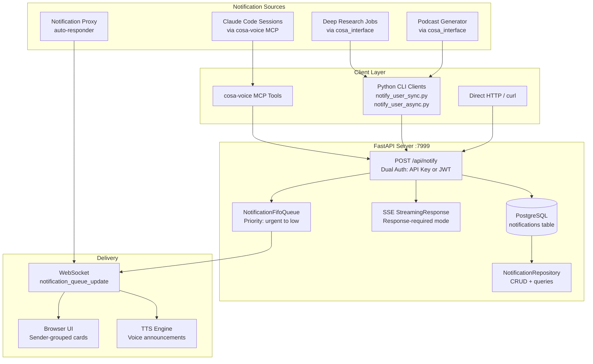
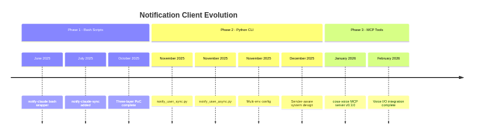

> Part 2 of 17 of the [Lupin Notification API Reference](../notification-api.md): architecture, request flows, history.

### System Architecture Diagram




---

### Component Map

The following table maps each component to its implementation file:

| Component | File | Approx. Lines | Purpose |
|------------------------|-----------------------------------------------------------------|---------------|--------------------------------------------------|
| REST API endpoints | `src/cosa/rest/routers/notifications.py`                        | 1,948 | All 17 notification endpoints |
| In-memory queue | `src/cosa/rest/notification_fifo_queue.py`                      | 588 | FIFO queue with WebSocket emission |
| PostgreSQL model | `src/cosa/rest/postgres_models.py`                              | 482-628 | `Notification` ORM model, 20+ columns |
| Repository | `src/cosa/rest/db/repositories/notification_repository.py`      | 892 | CRUD, conversation queries, sender analytics |
| Pydantic models | `src/cosa/cli/notification_models.py`                           | 1,062 | Request/response models, SSE events, enums |
| API key auth | `src/cosa/rest/middleware/api_key_auth.py`                      | ~200 | Dual auth middleware (API key or JWT) |
| Sync CLI client | `src/cosa/cli/notify_user_sync.py`                              | ~400 | SSE blocking client with retry |
| Async CLI client | `src/cosa/cli/notify_user_async.py`                             | ~300 | Fire-and-forget with adaptive retry |
| Generic CLI client | `src/cosa/cli/notify_user.py`                                   | ~300 | Legacy/fallback notification sender |
| Type enums | `src/cosa/cli/notification_types.py`                            | 102 | NotificationType, NotificationPriority enums |
| Voice I/O layer | `src/cosa/agents/utils/voice_io.py`                             | ~820 | Voice-first with CLI fallback |
| Deep Research interface| `src/cosa/agents/deep_research/cosa_interface.py`               | ~490 | Async notification wrappers for DR agent |
| Claude Code interface | `src/cosa/agents/claude_code/cosa_interface.py`                 | ~220 | Async notification wrappers for CC agent |
| Proxy listener | `src/cosa/agents/notification_proxy/listener.py`                | 359 | WebSocket listener for auto-response |
| Proxy responder | `src/cosa/agents/notification_proxy/responder.py`               | 465 | Strategy chain for auto-answering |
| Proxy config | `src/cosa/agents/notification_proxy/config.py`                  | 286 | Profiles, credentials, constants |

---

### Request Flow: Fire-and-Forget

```
1. Client sends POST /api/notify with message, type, priority, target_user
2. Middleware validates API key or JWT
3. Server validates parameters ( type, priority, message non-empty )
4. Server resolves target_user email → UUID via get_user_by_email()
5. Server resolves sender_id: explicit > [PREFIX] extraction > default
6. NotificationFifoQueue.push_notification() adds item to queue
   - urgent/high priority → front of queue
   - medium/low priority → back of queue
7. WebSocket emission: notification_queue_update event sent to user
8. PostgreSQL: notification persisted via NotificationRepository
9. Server returns JSON: { "status": "queued", "connection_count": N }
```

### Request Flow: Response-Required

```
1.  Client sends POST /api/notify with response_requested=true, response_type, timeout_seconds
2.  Middleware validates API key or JWT
3.  Server validates parameters including response_type ( yes_no | open_ended | multiple_choice | open_ended_batch )
4.  Server resolves target_user email → UUID
5.  Offline check: if user not connected via WebSocket:
    a. If response_default provided → return default immediately with status "offline"
    b. If no default → HTTP 503 "User is offline and no default response provided"
6.  PostgreSQL: notification created with state='delivered', expires_at calculated
7.  asyncio.Event created and stored in pending_responses dict
8.  NotificationFifoQueue.push_notification() with all response fields
9.  WebSocket emission: notification rendered in UI with response controls
10. SSE StreamingResponse returned to caller — stream stays open
11. User responds in UI → POST /api/notify/response called
    a. Database updated: state='responded', response_value stored
    b. asyncio.Event.set() wakes up the SSE stream
    c. WebSocket: notification_responded event broadcast
12. SSE stream yields: { "status": "responded", "response": "...", "default_used": false }
13. Stream closes, pending_responses entry cleaned up

    --- OR on timeout ---

11. asyncio.wait_for() raises TimeoutError
12. Database: notification marked as expired
13. WebSocket: notification_expired event broadcast
14. SSE stream yields: { "status": "expired", "response": "<default>", "default_used": true }
15. Stream closes, pending_responses entry cleaned up
```

---

## 1.5 Historical Evolution

Understanding the evolution of the notification system helps explain why certain
patterns exist in the codebase today.

### Phase 1 — Bash Scripts (June-October 2025)

Claude Code originally sent notifications by executing bash scripts from the
terminal. This was the first working prototype of agent-to-human communication.

**Components**:

- **Global commands** installed at `~/.local/bin/`:
  - `notify-claude-async` — Fire-and-forget notifications
  - `notify-claude-sync` — Response-required notifications with SSE blocking
  - `notify-claude`. Unified wrapper
- **Project-level wrapper**: `src/scripts/notify.sh`
- **Architecture**: Three-layer PoC: Bash wrapper → Python SSE client → FastAPI server

**How it worked**:

1. Scripts gathered credentials from environment variables and config files
2. Constructed HTTP POST requests to the FastAPI server
3. For response-required mode, the bash script parsed the SSE stream output
4. Exit codes conveyed status: 0 = success, 1 = error, 2 = timeout

**Archived at**: `src/rnd/2025.10.15-sse-notifications/src/`

### Phase 2 — Python CLI Consolidation (November-December 2025)

The fragile bash scripts were replaced with Pydantic-validated Python CLI modules.
This phase introduced type safety, retry logic, and proper error handling.

**Phase 2.3**: `notify_user_sync.py`
- SSE blocking with typed response models
- Exit codes: 0 = success, 1 = error, 2 = timeout
- Retry logic for transient connection failures

**Phase 2.4**: `notify_user_async.py`
- Fire-and-forget with adaptive retry
- Naming refactored: `notify-claude` → `notify-claude-async` (explicit naming)
- Pydantic validation applied consistently to async path

**Phase 2.5**: Multi-environment configuration
- Config loading via `cosa.utils.config_loader`: env vars > config file > defaults
- API key moved from query parameter to `X-API-Key` header (security improvement)

**Sender-Aware System** (Phase 2 of sender-aware design, December 2025):
- `sender_id` field added to all models
- PostgreSQL migration for notification persistence
- Conversation grouping by sender in the frontend

### Phase 3 — cosa-voice MCP Migration (January 2026-present)

The Python CLI was superseded by native MCP tool calls via the cosa-voice server
(v0.3.0). This brought significant improvements:

- **Audio TTS**: Notifications are spoken aloud, not just displayed
- **Voice-to-text input**: Users can respond by speaking
- **Session routing**: Automatic project detection from working directory
- **Type-safe parameters**: MCP schema validation replaces CLI arg parsing

**Deprecated command mapping**:

| Deprecated Command | MCP Replacement |
|--------------------------|----------------------------|
| `notify-claude-async`    | `notify()`                 |
| `notify-claude-sync`     | `ask_yes_no()` / `converse()` |
| Menu options via CLI | `ask_multiple_choice()`    |
| `notify-claude` (unified) | Removed entirely |

**Python CLI modules remain available**.
The `cosa_interface` wrappers use them internally, in agentic jobs such as deep research and the podcast generator.
Those jobs run as background processes without MCP access.

### Evolution Timeline

```mermaid
timeline
    title Notification Client Evolution
    section Phase 1: Bash Scripts
        June 2025     : notify-claude bash wrapper
        July 2025     : notify-claude-sync added
        October 2025  : Three-layer PoC complete
    section Phase 2: Python CLI
        November 2025 : Phase 2.3 notify_user_sync.py
        November 2025 : Phase 2.4 notify_user_async.py
        November 2025 : Phase 2.5 Multi-env config
        December 2025 : Sender-aware system design
    section Phase 3: MCP Tools
        January 2026  : cosa-voice MCP server v0.3.0
        February 2026 : Voice I/O integration complete
```



### Why This Matters

The Python CLI layer (`notify_user_sync.py`, `notify_user_async.py`) is the
foundation that agentic jobs still call internally. Understanding its credential
gathering, retry logic, and SSE stream parsing is essential for debugging
notification failures from background jobs.

Key debugging implications:

- **Background jobs** (deep research, podcast generator) use the Python CLI
  path because they run as subprocesses without MCP access
- **Claude Code sessions** use the MCP path via cosa-voice for richer UX
- **Config loading** follows a strict precedence: env vars > config file > defaults
- **API key authentication** is always via the `X-API-Key` header (never query params)

---
