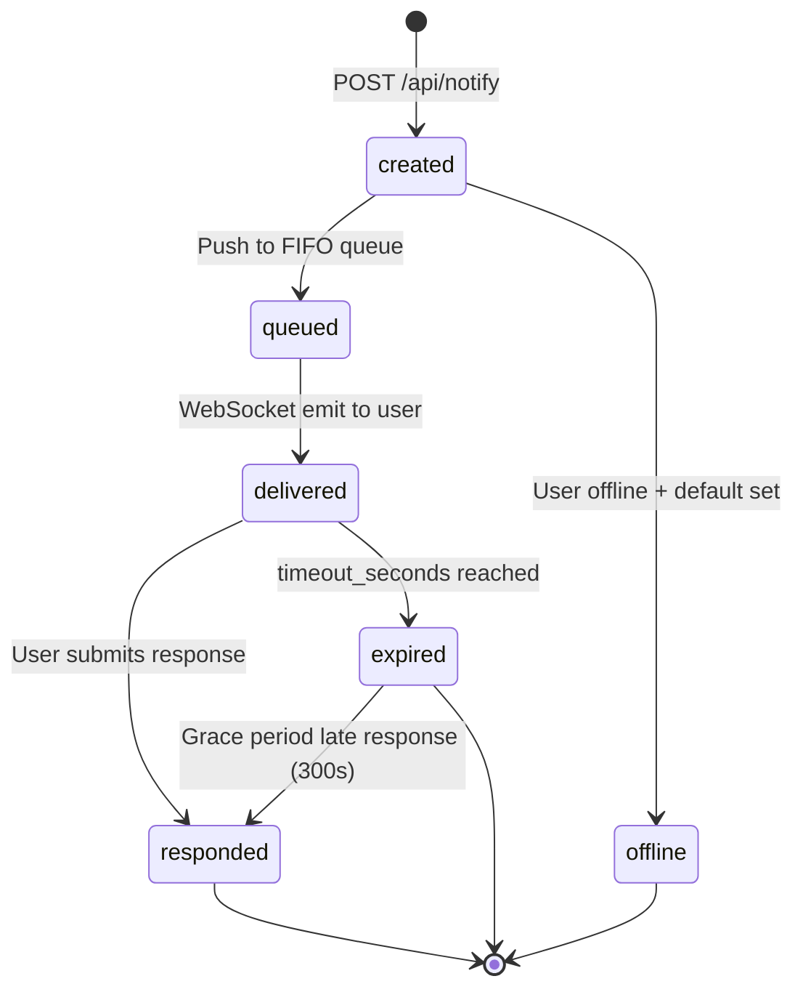
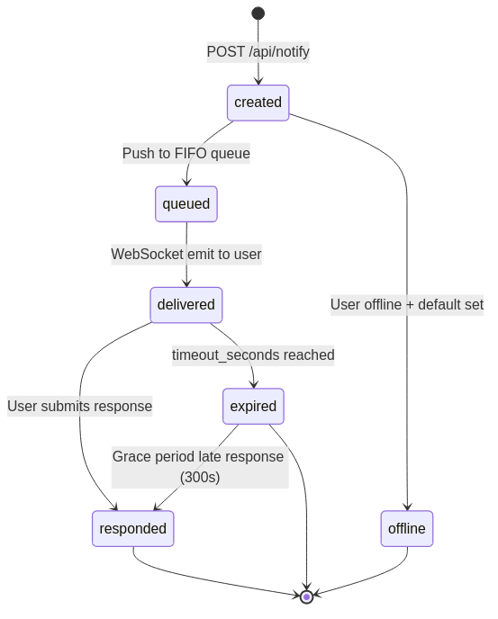

> Part 8 of 17 of the [Lupin Notification API Reference](../notification-api.md): lifecycle and state machine.

## 6. Notification Lifecycle / State Machine

### 6.1 State Machine Diagram





### 6.2 Happy Path (Response-Required)

```
  Agent (CLI/MCP)                  Server                     PostgreSQL              WebSocket / UI
       |                              |                            |                        |
  1.   | POST /api/notify             |                            |                        |
       | response_requested=true      |                            |                        |
       |----------------------------->|                            |                        |
       |                              |                            |                        |
  2.   |                              | INSERT notification        |                        |
       |                              | state='created'            |                        |
       |                              |--------------------------->|                        |
       |                              |                            |                        |
  3.   |                              | Push to FIFO queue         |                        |
       |                              | state='queued' -> 'delivered'                       |
       |                              |--------------------------------------------------->|
       |                              |                            |                        |
  4.   |                              | notification_queue_update  |                        |
       |                              | event emitted via WS       |                        |
       |                              |--------------------------------------------------->|
       |                              |                            |                        |
  5.   |     SSE stream open          |                            |        User responds   |
       |<-----------------------------|                            |<-----------------------|
       |     (blocking wait)          |                            |                        |
       |                              |                            |                        |
  6.   |                              | POST /api/notify/response  |                        |
       |                              |<----------------------------------------------------|
       |                              |                            |                        |
  7.   |                              | UPDATE state='responded'   |                        |
       |                              | SET response_value, responded_at                    |
       |                              |--------------------------->|                        |
       |                              |                            |                        |
  8.   | SSE: {"status":"responded",  |                            |                        |
       |       "response":"yes",      |                            |                        |
       |       "default_used":false}  |                            |                        |
       |<-----------------------------|                            |                        |
```

**Steps in detail**:

1. Agent sends `POST /api/notify` with `response_requested=true`, `response_type`, `timeout_seconds`, and optionally `response_default`.
2. Server creates a `Notification` row in PostgreSQL with `state='created'`, computes `expires_at` from `timeout_seconds`.
3. Server pushes a `NotificationItem` to the in-memory FIFO queue and updates state to `delivered` (since user is connected).
4. WebSocket manager emits `notification_queue_update` event containing the full notification dict to all of the user's active connections.
5. The SSE stream stays open via `asyncio.Event.wait()` with the configured timeout.
6. User responds via the UI, which calls `POST /api/notify/response/{notification_id}`.
7. Server updates PostgreSQL: `state='responded'`, stores `response_value` as JSONB, sets `responded_at`.
8. SSE emits a `RespondedEvent` to the waiting agent and the stream closes.

### 6.3 Timeout Path

When `timeout_seconds` elapses without a user response:

1. `asyncio.wait_for()` raises `asyncio.TimeoutError`.
2. Server calls `repo.mark_expired( notification_id )` which:
   - Sets `state='expired'`
   - If `response_default` was configured, stores `{"value": response_default, "source": "timeout_default"}` as `response_value`
3. The server broadcasts a `notification_expired` WebSocket event to all user connections, with this payload.
   ```json
   {
       "notification_id" : "uuid-string",
       "default_used"    : "the-default-value",
       "timeout"         : true,
       "timestamp"       : "2026-02-13T10:30:00Z"
   }
   ```
4. SSE emits an `ExpiredEvent` with `default_used=True` and the default value.
5. SSE stream closes and `pending_responses` entry is cleaned up.

**Grace period**: After expiration, the notification accepts late responses for a
configurable grace period (default: **300 seconds**, configurable via
`notification grace period seconds` in `lupin-app.ini`). If a user responds within the
grace period, the state transitions from `expired` to `responded` and the response is
stored normally.

### 6.4 Offline Path

When the target user has no active WebSocket connections at notification time, two cases apply.

- With `response_default` set, the server immediately returns a JSON response, not SSE, shaped like this.
```json
{
    "status"          : "offline",
    "default_used"    : "the-default-value",
    "notification_id" : "uuid-string",
    "message"         : "User is offline, returned default value immediately"
}
```
The notification is persisted to PostgreSQL with `state='expired'`.

- Without `response_default`, the server raises `HTTPException( status_code=503 )` with detail
  `"User is offline and no default response provided"`.

### 6.5 Priority Queue Behavior

The in-memory FIFO queue uses priority-based insertion ordering:

| Priority | Insertion Position |
|--------------------|-------------------------------------------------------|
| `urgent` / `high`  | **Front** of queue (after other urgent/high items) |
| `medium` / `low`   | **Back** of queue |

This ensures urgent notifications are displayed and played via TTS before lower-priority
items, even if they arrived later.

Implementation detail: an `urgent` or `high` item is inserted by scanning from the front.
The queue finds the first non-urgent, non-high item and inserts before it.
This preserves FIFO ordering among same-priority-class items.

### 6.6 Soft Delete vs Hard Delete

The notification system supports two deletion modes:

**Soft Delete** (preferred):
- Sets `is_hidden = True` on the notification row
- Notification is excluded from all user-facing queries (sender lists, conversations)
- Preserved in the database for analytics, audit trails. And debugging
- Used by: `DELETE /api/notifications/conversation/{sender_id}/{user_email}`,
  `DELETE /api/notifications/date/{sender_id}/{user_email}/{date_string}`

**Hard Delete**:
- Actually removes the row from the PostgreSQL `notifications` table
- Irreversible. Used only for true data purge scenarios
- Used by: `DELETE /api/notifications/{notification_id}` with `hard_delete=true`

**Design rationale**: Soft delete preserves the notification history for conversation
reconstruction, gist generation, and usage analytics while allowing users to "clear"
their notification inbox.

---

### 6.7 A blocking ask announced `COMPLETE` at ~120s, then `FAILED` at 660s — and how to get your answer back

**If you are reading this at 2am, this section is the whole story**.
You are here because a `converse`, `ask_yes_no` or `ask_multiple_choice` with a long timeout was announced finished.
The person had not answered yet.

**The symptom**. You declare `timeout_seconds=600`. At roughly 120 seconds the
PostToolUse beacon announces the call `COMPLETE`. Some minutes later a second
report says it `FAILED`, at around 660s. After the call had already returned and
after its side effect had landed. Nothing about that sequence describes what
the server or the client actually did.

**The three layers, each measured separately, because the obvious
suspects are innocent and chasing them costs an evening:**

| Layer | What was measured | Verdict |
|---|---|---|
| **Server** | 42/42 asks declaring a timeout above 120s expired at their declared value, ±0.1s | **Innocent** |
| **Client** (`cosa_voice_mcp` blocking verbs) | live probe: answered at 151.4s and **returned at 151.4s with the real answer** | **Innocent** |
| **PostToolUse beacon** | fires at `min( answer, ~120s )`, 24/24, regardless of the declared timeout | Warning: **the defect** |

Warning: **the verb is fine and the answer is not lost. The announcement is early**.
The hook that emits it (`src/lupin_cli/claude_code/hooks/post_tool_use.py`)
holds no timer and no deadline of its own — it fires when the harness invokes
it. So the ~120s decision is the harness's, one layer above this repo, and
**Why it does that is unmeasured and is not a Lupin question**.

**The workaround — re-POST the same ask and you re-attach to it**. Every
blocking verb stamps an `idempotency_key` (`cosa_voice_mcp._with_idempotency_key`).
A second POST carrying the same key does **not** mint a second card: it
re-attaches to the original notification's stream via
`_ask_reattach_generator( existing_nid, timeout_seconds )`. `src/cosa/rest/routers/notifications.py:1247-1254`, generator defined at `:206`
— and delivers the answer whenever the person gives it.

Warning: **there is no `/reattach` route, so do not go looking for one**.
Verified against the live app's OpenAPI: `reattach` appears in **zero** paths,
with `/api/notify/response` present as the positive control proving the lookup
reaches. Re-attachment is reachable **only** through the notify POST's
idempotency branch. That is by design, not an omission.

Warning: **this is a workaround a caller has to know to make, not a fix**. The
beacon still lies about when the call finished; re-POSTing is how you recover
the answer in spite of it. The tracking row stays open for that reason.
Closing it would read as "the defect is fixed", and it is not.

---
