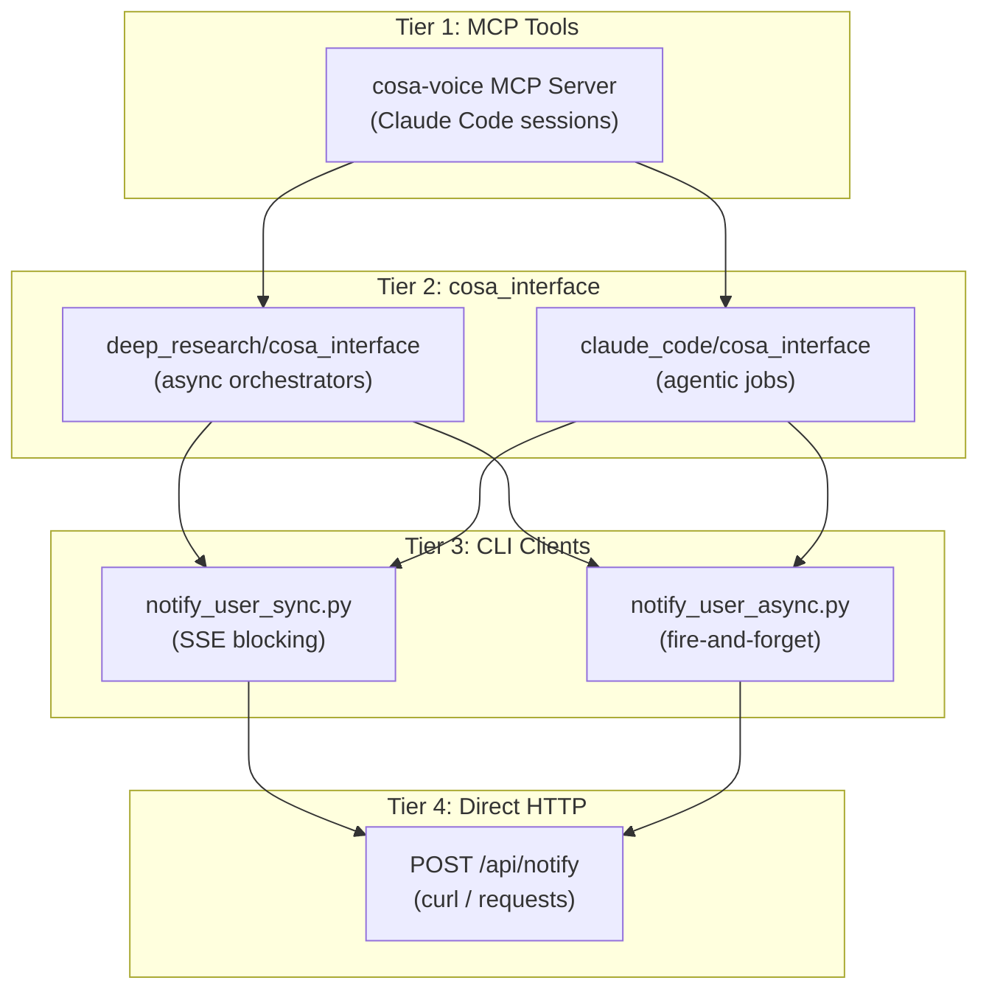
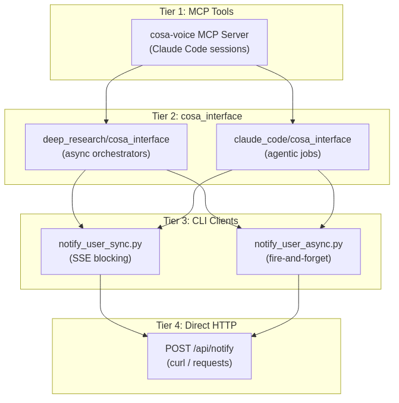

> Part 10 of 16 of the [Lupin Notification API Reference](../notification-api.md): sending notifications programmatically: the introduction, MCP tools and the cosa_interface pattern (sections 8 to 8.2).

## 8. Sending Notifications Programmatically

Lupin provides a four-tier client stack for sending notifications. Higher tiers
are more convenient but less flexible; lower tiers provide full HTTP-level control.





Each tier wraps the tier below it with progressively more convenience:
- **Tier 1** (MCP Tools) -- Used by Claude Code sessions via the cosa-voice MCP server
- **Tier 2** (cosa_interface). Used by async agent orchestrators (Deep Research, Claude Code jobs)
- **Tier 3** (CLI Clients). Python library + CLI for direct notification sending
- **Tier 4** (Direct HTTP) -- Raw REST API calls via curl or any HTTP client

---

### 8.1 Tier 1 -- cosa-voice MCP Tools

The cosa-voice MCP server exposes native tool calls that Claude Code sessions invoke
directly. No bash commands or HTTP calls required.

**Available Tools**:

| Tool | Blocking | Returns |
|------|----------|---------|
| `notify()` | No | Delivery status string |
| `ask_yes_no()` | Yes | `"yes"`, `"no"`, or `"neither"` (the question needs re-framing), optionally suffixed with `[comment: ...]` |
| `converse()` | Yes | `{"response": "..."}` |
| `ask_multiple_choice()` | Yes | `{"answers": {"header": "selection"}}` |
| `ask_open_ended_batch()` | Yes | `{"answers": {"header": "value", ...}}` |

**Fire-and-forget notification**:

```python
notify(
    message           = "Build completed successfully",
    notification_type = "task",
    priority          = "medium",
    abstract          = "**Duration**: 42s\n**Tests**: 816 passed"
)
```

**Yes/no decision**:

```python
response = ask_yes_no(
    question        = "Deploy to staging?",
    default         = "no",
    timeout_seconds = 300,
    priority        = "high",
    abstract        = "**Branch**: feature/auth\n**Commit**: abc1234"
)
# response: "yes", "no", "neither", or with comment "yes [comment: only the API]"
# "neither" signals the question needs re-framing — read any comment for guidance
```

**Open-ended question**:

```python
response = converse(
    message          = "Which migration approach should I use?",
    response_type    = "open_ended",
    timeout_seconds  = 600,
    priority         = "high",
    response_default = "defer to next session"
)
# response: {"response": "Use incremental migration"}
```

**Multiple-choice selection**:

```python
response = ask_multiple_choice(
    questions = [ {
        "question"    : "Which database should we use?",
        "header"      : "Database",
        "multiSelect" : False,
        "options"     : [
            { "label" : "PostgreSQL", "description" : "Relational database" },
            { "label" : "MongoDB",    "description" : "Document database" }
        ]
    } ],
    title    = "Database Selection",
    priority = "high",
    abstract = "This choice affects the entire persistence layer."
)
# response: {"answers": {"Database": "PostgreSQL"}}
```

**Batch open-ended questions**:

```python
response = ask_open_ended_batch(
    questions = [
        { "question" : "What is the main goal?",  "header" : "Goal" },
        { "question" : "Any constraints?",         "header" : "Constraints" },
        { "question" : "Target branch?",           "header" : "Branch", "default_value" : "main" }
    ],
    title    = "Requirements Gathering",
    priority = "high",
    abstract = "Gathering requirements before planning."
)
# response: {"answers": {"Goal": "Add OAuth2", "Constraints": "Use existing DB", "Branch": "main"}}
```

---

### 8.2 Tier 2 -- cosa_interface Pattern

Agent orchestrators use agent-specific `cosa_interface` modules that wrap the CLI
clients with `asyncio.to_thread()` so blocking HTTP calls do not stall the event loop.

#### Deep Research Interface

**Module**: `src/cosa/agents/deep_research/cosa_interface.py`

| Function | Blocking | Returns | Description |
|----------|----------|---------|-------------|
| `notify_progress( message, priority, abstract, session_name, job_id, queue_name )` | No | `None` | Fire-and-forget progress update |
| `ask_confirmation( question, default, timeout, abstract )` | Yes | `bool` | Yes/no question, returns True/False |
| `get_feedback( prompt, timeout )` | Yes | `str` or `None` | Open-ended voice input |
| `present_choices( questions, timeout )` | Yes | `dict` | Multiple-choice selection |

**Sender ID format**: `deep.research@{project}.deepily.ai`

**Example -- sending progress with job card routing**:

```python
from cosa.agents.deep_research import cosa_interface

await cosa_interface.notify_progress(
    message      = "Phase 2: Analyzing 15 sources...",
    priority     = "medium",
    abstract     = "Sources: arxiv (8), scholar (4), web (3)",
    session_name = "wise penguin",
    job_id       = "dr-a1b2c3d4",
    queue_name   = "run"
)
```

**Example -- asking for confirmation**:

```python
approved = await cosa_interface.ask_confirmation(
    question = "Research plan has 12 subqueries. Proceed?",
    default  = "yes",
    timeout  = 120,
    abstract = "**Estimated time**: 8-12 minutes\n**Token budget**: ~50k"
)
if approved:
    await run_research()
```

#### Claude Code Interface

**Module**: `src/cosa/agents/claude_code/cosa_interface.py`

| Function | Blocking | Returns | Description |
|----------|----------|---------|-------------|
| `notify_progress( message, priority, abstract, session_name, job_id, queue_name )` | No | `None` | Fire-and-forget progress update |
| `ask_confirmation( question, default, timeout, abstract, job_id )` | Yes | `bool` | Yes/no with optional job card routing |

**Sender ID format**: `claude.code.job@{project}.deepily.ai`

**Example -- job progress with card routing**:

```python
from cosa.agents.claude_code import cosa_interface

await cosa_interface.notify_progress(
    message    = "Running test suite...",
    priority   = "low",
    job_id     = "cc-e5f6g7h8",
    queue_name = "run"
)
```

**Example -- confirmation with job_id**:

```python
approved = await cosa_interface.ask_confirmation(
    question = "3 tests failed. Continue with deployment?",
    default  = "no",
    timeout  = 120,
    abstract = "**Failures**: test_auth, test_db, test_cache",
    job_id   = "cc-e5f6g7h8"
)
```

---
