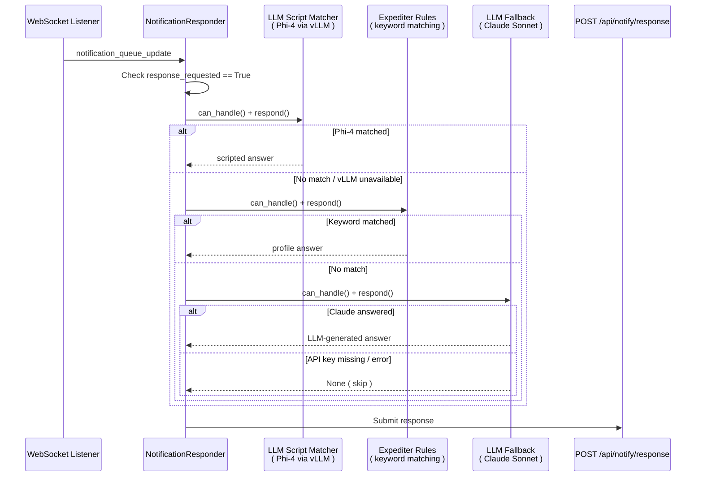

> Part 14 of 17 of the [Lupin Notification API Reference](../notification-api.md): the notification proxy agent: overview, architecture, tiers, running it.

## 11. Notification Proxy Agent

### 11.1 Overview

The Notification Proxy Agent is a standalone WebSocket client that automatically
answers Runtime Argument Expediter prompts. It connects to the Lupin server,
listens for `notification_queue_update` events. And routes response-required
notifications through a **3-tier strategy chain** -- local LLM fuzzy matching
first, keyword rules second, cloud LLM fallback third.

**Primary use case**: Fully automated end-to-end testing of agentic jobs
(Deep Research, Podcast Generator, CRUD) without human interaction.

**Source files**:

| File | Purpose |
|------|---------|
| `src/cosa/agents/notification_proxy/__main__.py` | CLI entry point |
| `src/cosa/agents/notification_proxy/config.py` | Profiles, defaults, credential resolution |
| `src/cosa/agents/notification_proxy/listener.py` | WebSocket connection + event dispatch |
| `src/cosa/agents/notification_proxy/responder.py` | Strategy routing + REST response submission |
| `src/cosa/agents/notification_proxy/strategies/llm_script_matcher.py` | Tier 1: Phi-4 fuzzy matching |
| `src/cosa/agents/notification_proxy/strategies/expediter_rules.py` | Tier 2: Keyword-based rules |
| `src/cosa/agents/notification_proxy/strategies/llm_fallback.py` | Tier 3: Claude Sonnet cloud fallback |
| `src/cosa/agents/notification_proxy/verification.py` | LLM answer verification |
| `src/cosa/agents/notification_proxy/xml_models.py` | Pydantic XML response models |
| `src/cosa/agents/notification_proxy/voice_io.py` | Voice notification helpers |

---

### 11.2 Architecture




The strategy chain short-circuits: the first tier that returns a non-`None`
answer wins. If all three tiers return `None`, the notification is skipped
and counted under `self.stats[ "skipped" ]`.

---

### 11.3 Strategy Tiers

**Tier 1 -- LLM Script Matcher** (`LlmScriptMatcherStrategy`)

- **Model**: Phi-4 14B via local vLLM (spec key: `kaitchup/phi_4_14b`)
- **Mechanism**: Loads a Q&A script JSON at construction. When a notification
  arrives, sends the question + all script entries to Phi-4 and asks it to
  fuzzy-match the best entry. Handles `YES_NO`, `OPEN_ENDED`,
  `OPEN_ENDED_BATCH`, and `MULTIPLE_CHOICE` response types.
- **Prompt templates**:
  - Single question: `/src/conf/prompts/notification-proxy-script-matcher.txt`
  - Batch questions: `/src/conf/prompts/notification-proxy-batch-matcher.txt`
  - Answer verification: `/src/conf/prompts/notification-proxy-answer-verifier.txt`
- **Availability**: Falls through gracefully if vLLM server is down.

**Tier 2 -- Expediter Rules** (`ExpediterRuleStrategy`)

- **Model**: None (pure keyword matching)
- **Mechanism**: Maps keywords found in notification messages to argument names, using a ranked keyword list (`KEYWORD_TO_ARG`).
It then looks up the answer in the active test profile. First match wins.
- **Keyword map** (order matters):

```python
KEYWORD_TO_ARG = [
    ( [ "topic", "query" ],                                              "query" ),
    ( [ "budget", "limit", "dollar" ],                                   "budget" ),
    ( [ "audience context", "additional context" ],                       "audience_context" ),
    ( [ "audience", "target" ],                                          "audience" ),
    ( [ "language", "iso code" ],                                        "languages" ),
    ( [ "document", "filename", "which research", "podcast", "research" ], "research" ),
]
```

- **Speed**: Fastest tier -- no LLM calls, no network.

**Tier 3 -- LLM Fallback** (`LLMFallbackStrategy`)

- **Model**: Anthropic Claude Sonnet (`claude-sonnet-4-5-20250929`)
- **Mechanism**: Sends the raw notification message to Claude Sonnet with
  `max_tokens = 500` and returns the generated answer.
- **API key**: Resolved via `ANTHROPIC_API_KEY_FIREWALLED` env var or
  `src/conf/keys/anthropic-api-key-firewalled` file.
- **Availability**: Returns `None` if no API key is found.

---

### 11.4 Running the Proxy

```bash
# Basic usage with default profile ( deep_research )
python -m cosa.agents.notification_proxy

# Specify a test profile
python -m cosa.agents.notification_proxy --profile podcast

# Force keyword-only strategy ( no Phi-4 )
python -m cosa.agents.notification_proxy --strategy rules --debug

# Dry run -- display notifications without answering
python -m cosa.agents.notification_proxy --dry-run --verbose
```

**CLI Arguments**:

| Flag | Default | Description |
|------|---------|-------------|
| `--host` | `localhost` | Server hostname |
| `--port` | `7999` | Server port |
| `--email` | *(env var)* | Login email (overrides env vars) |
| `--password` | *(env var)* | Login password (overrides env vars) |
| `--session-id` | `auto proxy` | WebSocket session identifier |
| `--profile` | `deep_research` | Test profile for auto-answers |
| `--strategy` | `llm_script` | Strategy mode: `llm_script`, `rules`, or `auto` |
| `--debug` | `False` | Enable debug output |
| `--verbose` | `False` | Enable verbose output (implies debug) |
| `--dry-run` | `False` | Display notifications without computing responses |

**Strategy modes**:

| Mode | Tier 1 | Tier 2 | Tier 3 |
|------|--------|--------|--------|
| `llm_script` | Phi-4 script matcher | *(skipped)* | Claude Sonnet |
| `rules` | *(skipped)* | Keyword rules | Claude Sonnet |
| `auto` | Phi-4 script matcher | Keyword rules (fallback if vLLM unavailable) | Claude Sonnet |

---
