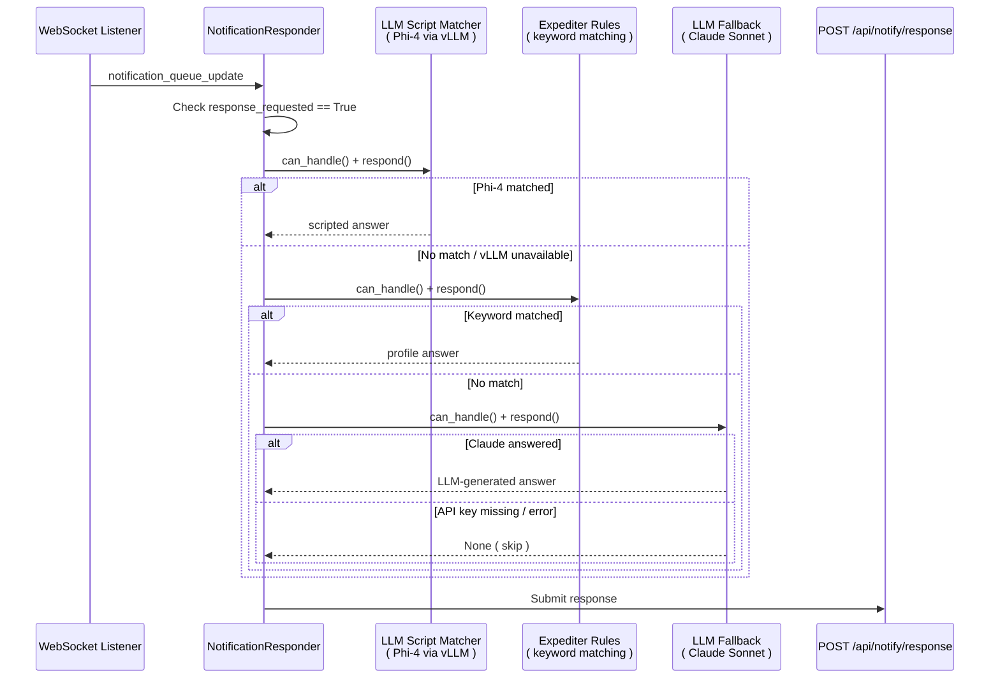
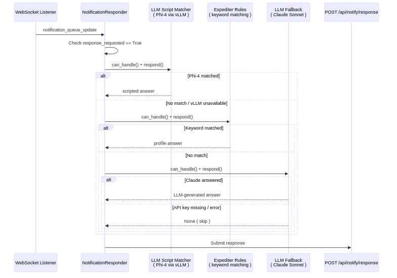

> Part 14 of 16 of the [Lupin Notification API Reference](../notification-api.md): the notification proxy agent.

## 11. Notification Proxy Agent

### 11.1 Overview

The Notification Proxy Agent is a standalone WebSocket client that automatically
answers Runtime Argument Expediter prompts. It connects to the Lupin server,
listens for `notification_queue_update` events. And routes response-required
notifications through a **3-tier strategy chain** -- local LLM fuzzy matching
first, keyword rules second, cloud LLM fallback third.

**Primary use case**: Fully automated end-to-end testing of agentic jobs
(Deep Research, Podcast Generator, CRUD) without human interaction.

**Source files**:

| File | Purpose |
|------|---------|
| `src/cosa/agents/notification_proxy/__main__.py` | CLI entry point |
| `src/cosa/agents/notification_proxy/config.py` | Profiles, defaults, credential resolution |
| `src/cosa/agents/notification_proxy/listener.py` | WebSocket connection + event dispatch |
| `src/cosa/agents/notification_proxy/responder.py` | Strategy routing + REST response submission |
| `src/cosa/agents/notification_proxy/strategies/llm_script_matcher.py` | Tier 1: Phi-4 fuzzy matching |
| `src/cosa/agents/notification_proxy/strategies/expediter_rules.py` | Tier 2: Keyword-based rules |
| `src/cosa/agents/notification_proxy/strategies/llm_fallback.py` | Tier 3: Claude Sonnet cloud fallback |
| `src/cosa/agents/notification_proxy/verification.py` | LLM answer verification |
| `src/cosa/agents/notification_proxy/xml_models.py` | Pydantic XML response models |
| `src/cosa/agents/notification_proxy/voice_io.py` | Voice notification helpers |

---

### 11.2 Architecture





The strategy chain short-circuits: the first tier that returns a non-`None`
answer wins. If all three tiers return `None`, the notification is skipped
and counted under `self.stats[ "skipped" ]`.

---

### 11.3 Strategy Tiers

**Tier 1 -- LLM Script Matcher** (`LlmScriptMatcherStrategy`)

- **Model**: Phi-4 14B via local vLLM (spec key: `kaitchup/phi_4_14b`)
- **Mechanism**: Loads a Q&A script JSON at construction. When a notification
  arrives, sends the question + all script entries to Phi-4 and asks it to
  fuzzy-match the best entry. Handles `YES_NO`, `OPEN_ENDED`,
  `OPEN_ENDED_BATCH`, and `MULTIPLE_CHOICE` response types.
- **Prompt templates**:
  - Single question: `/src/conf/prompts/notification-proxy-script-matcher.txt`
  - Batch questions: `/src/conf/prompts/notification-proxy-batch-matcher.txt`
  - Answer verification: `/src/conf/prompts/notification-proxy-answer-verifier.txt`
- **Availability**: Falls through gracefully if vLLM server is down.

**Tier 2 -- Expediter Rules** (`ExpediterRuleStrategy`)

- **Model**: None (pure keyword matching)
- **Mechanism**: Maps keywords found in notification messages to argument names, using a ranked keyword list (`KEYWORD_TO_ARG`).
It then looks up the answer in the active test profile. First match wins.
- **Keyword map** (order matters):

```python
KEYWORD_TO_ARG = [
    ( [ "topic", "query" ],                                              "query" ),
    ( [ "budget", "limit", "dollar" ],                                   "budget" ),
    ( [ "audience context", "additional context" ],                       "audience_context" ),
    ( [ "audience", "target" ],                                          "audience" ),
    ( [ "language", "iso code" ],                                        "languages" ),
    ( [ "document", "filename", "which research", "podcast", "research" ], "research" ),
]
```

- **Speed**: Fastest tier -- no LLM calls, no network.

**Tier 3 -- LLM Fallback** (`LLMFallbackStrategy`)

- **Model**: Anthropic Claude Sonnet (`claude-sonnet-4-5-20250929`)
- **Mechanism**: Sends the raw notification message to Claude Sonnet with
  `max_tokens = 500` and returns the generated answer.
- **API key**: Resolved via `ANTHROPIC_API_KEY_FIREWALLED` env var or
  `src/conf/keys/anthropic-api-key-firewalled` file.
- **Availability**: Returns `None` if no API key is found.

---

### 11.4 Running the Proxy

```bash
# Basic usage with default profile ( deep_research )
python -m cosa.agents.notification_proxy

# Specify a test profile
python -m cosa.agents.notification_proxy --profile podcast

# Force keyword-only strategy ( no Phi-4 )
python -m cosa.agents.notification_proxy --strategy rules --debug

# Dry run -- display notifications without answering
python -m cosa.agents.notification_proxy --dry-run --verbose
```

**CLI Arguments**:

| Flag | Default | Description |
|------|---------|-------------|
| `--host` | `localhost` | Server hostname |
| `--port` | `7999` | Server port |
| `--email` | *(env var)* | Login email (overrides env vars) |
| `--password` | *(env var)* | Login password (overrides env vars) |
| `--session-id` | `auto proxy` | WebSocket session identifier |
| `--profile` | `deep_research` | Test profile for auto-answers |
| `--strategy` | `llm_script` | Strategy mode: `llm_script`, `rules`, or `auto` |
| `--debug` | `False` | Enable debug output |
| `--verbose` | `False` | Enable verbose output (implies debug) |
| `--dry-run` | `False` | Display notifications without computing responses |

**Strategy modes**:

| Mode | Tier 1 | Tier 2 | Tier 3 |
|------|--------|--------|--------|
| `llm_script` | Phi-4 script matcher | *(skipped)* | Claude Sonnet |
| `rules` | *(skipped)* | Keyword rules | Claude Sonnet |
| `auto` | Phi-4 script matcher | Keyword rules (fallback if vLLM unavailable) | Claude Sonnet |

---

### 11.5 Test Profiles

Test profiles provide pre-configured answers for known expediter questions.
Each profile maps argument names to auto-answers.

| Profile | Description | Key Arguments |
|---------|-------------|---------------|
| `deep_research` | Deep Research agent expediter questions | `query`, `budget`, `audience`, `audience_context` |
| `podcast` | Podcast Generator expediter questions | `research`, `audience`, `audience_context`, `languages` |
| `research_to_podcast` | Research-to-podcast chained workflow | `query`, `budget`, `audience`, `audience_context`, `languages` |
| `all_agents` | Union profile for automated testing across all agents | All arguments from all profiles |
| `expeditor_smoke` | Q&A answers for expeditor smoke test matrix | All arguments from all profiles |
| `minimal` | Bare minimum -- required args only | `query`, `research` |
| `crud` | Auto-confirm for CRUD agent delete/update operations | `confirmation` |

Profiles are defined in `src/cosa/agents/notification_proxy/config.py` under
the `TEST_PROFILES` dict. Example:

```python
TEST_PROFILES = {
    "deep_research" : {
        "description"      : "Auto-answer for deep research agent expediter questions",
        "query"            : "quantum computing breakthroughs 2026",
        "budget"           : "no limit",
        "audience"         : "academic",
        "audience_context" : "none",
    },
    # ...
}
```

---

### 11.6 Q&A Script Format

Q&A scripts are JSON files that pair expected questions with scripted answers.
The LLM Script Matcher loads these at construction and uses Phi-4 to
fuzzy-match incoming notifications to entries.

**Directory**: `src/conf/notification-proxy-scripts/`

**Available scripts**:

| File | Profile |
|------|---------|
| `deep-research.json` | `deep_research` |
| `podcast.json` | `podcast` |
| `research-to-podcast.json` | `research_to_podcast` |
| `all-agents.json` | `all_agents` |
| `expeditor-smoke.json` | `expeditor_smoke` |
| `minimal.json` | `minimal` |
| `crud.json` | `crud` |
| `_template.json` | Starter template for new scripts |

**Entry format** (from `_template.json`):

```json
{
    "profile_name"  : "your_agent_name",
    "description"   : "Q&A script for <your agent> expediter questions",
    "sender_ids"    : [ "arg.expeditor@lupin.deepily.ai" ],
    "entries" : [
        {
            "question_pattern" : "What is the primary input for your agent?",
            "answer"           : "your scripted answer here",
            "arg_name"         : "the_cli_arg_name",
            "response_types"   : [ "open_ended", "open_ended_batch" ]
        },
        {
            "question_pattern" : "Would you like to proceed?",
            "answer"           : "yes",
            "arg_name"         : "confirmation",
            "response_types"   : [ "yes_no" ]
        }
    ]
}
```

**Fields per entry**:

| Field | Required | Description |
|-------|----------|-------------|
| `question_pattern` | Yes | Expected question text (fuzzy matched by Phi-4) |
| `answer` | Yes | The answer to return when matched |
| `arg_name` | Yes | The CLI argument name this maps to |
| `response_types` | Yes | Array of valid response types for this entry |
| `agents` | No | Scope entry to specific agent names (for multi-agent scripts) |

---

### 11.7 Credential Resolution

The proxy resolves login credentials with a **2-tier priority** chain:

| Priority | Email Source | Password Source |
|----------|-------------|-----------------|
| 1 (highest) | `--email` CLI flag | `--password` CLI flag |
| 2 | `LUPIN_TEST_INTERACTIVE_MOCK_JOBS_EMAIL` env var | `LUPIN_TEST_INTERACTIVE_MOCK_JOBS_PASSWORD` env var |

If neither source provides a value, `get_credentials()` raises a `ValueError`
with setup instructions.

**Anthropic API key** (for Tier 3 LLM Fallback):

| Priority | Source |
|----------|--------|
| 1 | `ANTHROPIC_API_KEY_FIREWALLED` env var |
| 2 | `src/conf/keys/anthropic-api-key-firewalled` file |

---

### 11.8 WebSocket Listener

The `WebSocketListener` class manages the persistent connection to the Lupin
server.

**Authentication flow**:

1. **REST login** -- `POST /auth/login` with email + password to obtain a JWT
2. **WebSocket connect** -- `ws://{host}:{port}/ws/queue/{session_id}`
3. **Auth message**. Send `auth_request` with Bearer token and subscribed events
4. **Auth response**. Wait for `auth_success` (includes `user_id`)
5. **Receive loop** -- Dispatch events to `on_event` callback

**Subscribed events**:

```python
SUBSCRIBED_EVENTS = [
    "notification_queue_update",
    "job_state_transition",
    "sys_ping"
]
```

**Keep-alive**: The listener responds to `sys_ping` events with `sys_pong` to
maintain the connection.

**Reconnection parameters**:

| Parameter | Value | Description |
|-----------|-------|-------------|
| `RECONNECT_INITIAL_DELAY` | `1.0s` | First retry delay |
| `RECONNECT_MAX_DELAY` | `30.0s` | Maximum retry delay |
| `RECONNECT_MAX_ATTEMPTS` | `10` | Total attempts before giving up |
| `RECONNECT_BACKOFF_FACTOR` | `2.0` | Exponential backoff multiplier |

**Delay formula**: `min( 1.0 * 2.0^attempt, 30.0 )` seconds.

---

### 11.9 Response Submission

When a strategy produces an answer, the responder submits it via:

```
POST /api/notify/response
Content-Type: application/json

{
    "notification_id" : "<uuid>",
    "response_value"  : "<answer string or dict>"
}
```

**Return**: HTTP 200 on success with `{ "status": "...", "message": "..." }`.

**Statistics tracking**: The responder maintains a stats dict that is printed
on shutdown:

```python
self.stats = {
    "notifications_received" : 0,
    "responses_sent"         : 0,
    "script_matcher_used"    : 0,
    "rules_used"             : 0,
    "llm_used"               : 0,
    "skipped"                : 0,
    "errors"                 : 0,
}
```

Call `responder.print_stats()` to display a formatted summary at any time.

---
