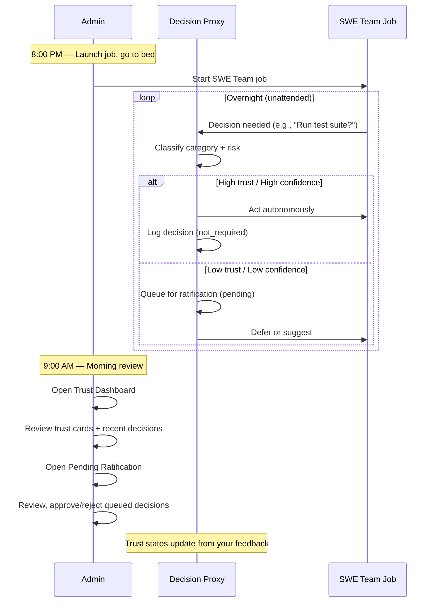
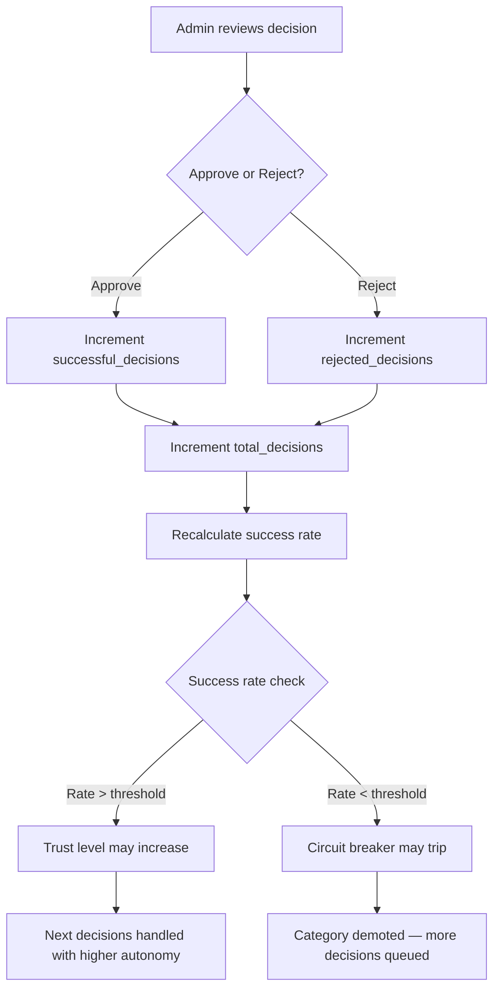

# Decision Proxy — Admin Guide

> **Audience**: Lupin administrators who review and ratify proxy decisions
>
> **Pages covered**: `/app/admin/proxy-dashboard` and `/app/admin/proxy-ratify`
>
> **Last Updated**: 2026-02-23
>
> **See Also**: [End-to-End Trust Proxy Overview](../rnd/2026.02.23-trust-proxy-preference-learning/2026.02.27-end-to-end-trust-proxy-overview.md) — full conceptual walkthrough from cold start to autonomous predictions

---

## Table of Contents

1. [Why the Decision Proxy Exists](#1-why-the-decision-proxy-exists)
2. [How Trust Levels Work](#2-how-trust-levels-work)
3. [The Morning Coffee Workflow](#3-the-morning-coffee-workflow)
4. [Trust Dashboard](#4-trust-dashboard-appadminproxy-dashboard)
5. [Pending Ratification](#5-pending-ratification-appadminproxy-ratify)
6. [Badge and Color Reference](#6-badge-and-color-reference)
7. [The Trust Feedback Loop](#7-the-trust-feedback-loop)
8. [Quick Reference: API Endpoints](#8-quick-reference-api-endpoints)

---

## 1. Why the Decision Proxy Exists

### The Problem

SWE Team jobs (and other agentic workflows) generate dozens of decisions that historically
required real-time human approval: task decomposition sign-offs, dangerous command gating,
architecture choices, dependency updates, test strategy confirmations. Each decision triggers
a voice notification and blocks the job until you respond.

**The old model** — real-time, interrupt-driven:

```
Job starts → Decision #1 → [BLOCKS] → You click approve → Decision #2 → [BLOCKS] → ...
```

If you launch a SWE Team job at 8 PM and go to bed, the job stalls at its first decision.
Ten decisions means ten manual interruptions. You're babysitting the agent.

### The New Model

The decision proxy intercepts these decisions, classifies them by category and risk, and
either acts autonomously (at earned trust levels) or queues them for batch review later.

**The new model** — async, batch-driven:

```
Job starts → Proxy handles decisions autonomously → You review over morning coffee
```

**Net effect**: 4 hours of babysitting becomes 15 minutes of batch review.

### The Paradigm Shift

| Aspect | Before (Real-Time) | After (Proxy) |
|--------|---------------------|---------------|
| User attention | Required for every decision | Review in batches |
| Job blocking | Blocks on each decision | Runs continuously |
| Off-hours work | Impossible without babysitting | Fully autonomous |
| Trust model | Binary (allow/deny) | Graduated (L1-L5) |
| Learning | None | Proxy improves from your feedback |

---

## 2. How Trust Levels Work

### Trust Level Progression

Trust is tracked **per-user, per-domain, per-category**. The SWE domain has 6 categories
(see below), and each starts at L1 and progresses independently.

| Level | Name | Behavior | Ratification Required? |
|-------|------|----------|------------------------|
| **L1** | Shadow | Observe only — logs what the proxy *would* decide but takes no action. The original notification still reaches you. | No (not_required) |
| **L2** | Provisional | Suggests a decision and queues it for ratification. Does not act autonomously. | Yes (pending) |
| **L3** | Trusted | Acts on decisions with high confidence (>80%). Lower confidence decisions are queued. | Depends on confidence |
| **L4** | Autonomous | Acts on most decisions. Only queues low-confidence or destructive-category decisions. | Rarely |
| **L5** | Full Trust | Acts on all decisions in this category. Ratification available but not required. | No (not_required) |

### The 6 SWE Categories

| Category | Icon | What It Covers |
|----------|------|----------------|
| **Deployment** | Rocket | Deploy commands, environment changes, release operations |
| **Testing** | Test tube | Test execution approvals, test strategy decisions |
| **Dependencies** | Package | Dependency updates, package installations |
| **Architecture** | Triangular ruler | Architecture choices, refactoring decisions |
| **Destructive** | Warning | File deletions, force pushes, database drops |
| **General** | Gear | Everything else that doesn't fit the above |

### Trust Modes

The proxy operates in one of four modes, set globally from the Trust Dashboard:

| Mode | Description |
|------|-------------|
| **DISABLED** | Proxy is off. All decisions go directly to user as before. |
| **SHADOW** | Proxy observes and logs decisions but never acts. Good for initial evaluation. |
| **SUGGEST** | Proxy suggests decisions and queues them for ratification. Does not act autonomously. |
| **ACTIVE** | Proxy acts based on trust levels. This is the production mode. |

### Circuit Breaker

Each category has an independent circuit breaker that protects against automation failures.
If too many decisions in a category are rejected during ratification, the circuit breaker
**trips** and automatically demotes that category back to a lower trust level until the
admin manually resets it.

| State | Indicator | Meaning |
|-------|-----------|---------|
| **OK** (Closed) | Green dot | Operating normally |
| **TRIPPED** (Open) | Red dot | Too many rejections — proxy stopped acting in this category |
| **COOLDOWN** | Yellow dot | Recovery period after a trip |

---

## 3. The Morning Coffee Workflow

This is the primary workflow the proxy admin pages are designed for.



### Step-by-Step

1. **Evening**: Launch a SWE Team job from the Lupin UI. Set trust mode to ACTIVE (or SUGGEST for first runs).
2. **Overnight**: The proxy handles decisions based on current trust levels. High-confidence decisions in trusted categories are executed. Others are queued.
3. **Morning**: Open the **Trust Dashboard** to see an overview of what happened overnight — how many decisions per category, success rates, any circuit breaker trips.
4. **Review**: Switch to **Pending Ratification** to approve or reject queued decisions. Each approval/rejection updates the trust state for that category.
5. **Repeat**: Over days, trust levels naturally climb as you approve decisions. The proxy handles more autonomously, and your morning review gets shorter.

---

## 4. Trust Dashboard (`/app/admin/proxy-dashboard`)

The Trust Dashboard is your at-a-glance view of the proxy's current state. Use it to
understand how the proxy is performing, change the operating mode, and review recent
decision history.

### Page Layout Overview

```
┌─────────────────────────────────────────────────────────────┐
│  Home > Admin > Trust Dashboard                             │
│                                                             │
│  Decision Proxy — Trust Dashboard         [← Back to Admin] │
├─────────────────────────────────────────────────────────────┤
│  Mode Bar                                                   │
│  ┌───────────────────────────────────────────────────────┐  │
│  │ Trust Mode: [SHADOW ▾] ●   Domain: swe   User: you@  │  │
│  └───────────────────────────────────────────────────────┘  │
├─────────────────────────────────────────────────────────────┤
│  Trust Cards (6 categories — 3×2 grid)                      │
│  ┌──────────┐ ┌──────────┐ ┌──────────┐                    │
│  │Deployment│ │ Testing  │ │  Deps    │                    │
│  │   L1     │ │   L2     │ │   L1     │                    │
│  │  Shadow  │ │Provision.│ │  Shadow  │                    │
│  │ Rate: —  │ │ Rate:85% │ │ Rate: —  │                    │
│  │ 0T 0R OK │ │ 4T 1R OK │ │ 0T 0R OK │                    │
│  └──────────┘ └──────────┘ └──────────┘                    │
│  ┌──────────┐ ┌──────────┐ ┌──────────┐                    │
│  │Architect.│ │Destructiv│ │ General  │                    │
│  │   ...    │ │   ...    │ │   ...    │                    │
│  └──────────┘ └──────────┘ └──────────┘                    │
├─────────────────────────────────────────────────────────────┤
│  Recent Decisions                    [All Categories ▾]     │
│  ┌─────────────────────────────────────────────────────┐    │
│  │ Time │ Question         │ Action │ Trust │ Conf│State│   │
│  │ 2h   │ Run test suite?  │ ACT    │ L2    │ 85% │ ✓  │   │
│  │ ...  │ ...              │ ...    │ ...   │ ... │ ...│   │
│  └─────────────────────────────────────────────────────┘    │
│  [← Previous]  Page 1 of 2 (75 decisions)  [Next →]        │
└─────────────────────────────────────────────────────────────┘
```

### Mode Bar

The blue bar at the top of the page controls and displays the proxy's operating state.

| Element | Description |
|---------|-------------|
| **Trust Mode dropdown** | Select DISABLED, SHADOW, SUGGEST, or ACTIVE. Changes take effect immediately if a SWE Team job is running (hot-reload), or are queued for the next job. |
| **Status dot** | Shows the target of your mode change. **Green** = running job updated immediately. **Yellow** = queued for next job. **Gray** = no running job (idle). |
| **Domain** | Currently always `swe`. Future domains may be added. |
| **User** | Your email address (auto-detected from auth). Trust states are per-user. |

**Changing the mode**: Select a new mode from the dropdown. The page will display a success
message indicating whether the change was applied to a running job ("active job updated") or
queued for the next job ("applies to next job").

### Trust Cards (6 Categories)

Below the mode bar is a 3-column grid of trust cards, one per SWE category.

**Reading a trust card**:

| Card Element | Location | What It Shows |
|-------------|----------|---------------|
| **Category icon + name** | Top | Which SWE category (e.g., "Testing") |
| **Level badge** (e.g., `L2`) | Center, large text | Current trust level for this category. Color matches the level (see [Badge Reference](#6-badge-and-color-reference)). |
| **Level label** | Below badge | Human-readable name (e.g., "Provisional") |
| **Success rate bar** | Middle | Horizontal bar showing approval rate. Green (>80%), yellow (50-80%), red (<50%). Shows "No data" if the category has never been used. |
| **Total** | Bottom-left stat | Total decisions made in this category |
| **Rejected** | Bottom-center stat | How many decisions were rejected during ratification |
| **Circuit breaker** | Bottom-right | Status indicator with colored dot: green (OK), red (TRIPPED), yellow (COOLDOWN) |

**What "No data" means**: The category has never had a decision processed through it. This
is normal for fresh installations or categories that haven't been triggered yet.

### Recent Decisions Table

Below the trust cards is a table showing the most recent decisions across all categories
(or filtered to a single category).

| Column | Description |
|--------|-------------|
| **Time** | Relative timestamp (e.g., "2h ago", "5m ago", "3d ago") |
| **Question** | The decision question text, truncated to 60 characters. Hover for full text. |
| **Action** | What the proxy did: `shadow`, `suggest`, `act`, or `defer` (see [Badge Reference](#6-badge-and-color-reference)) |
| **Trust** | Trust level badge at the time of the decision (L1-L5) |
| **Confidence** | How confident the proxy was in its classification. Green (>80%), orange (50-80%), red (<50%) |
| **State** | Ratification state: `pending` (orange), `approved` (green), `rejected` (red), `N/R` (gray — not required) |

**Category filter**: Use the dropdown next to "Recent Decisions" to filter by a single
category. Select "All Categories" to see the merged view.

**Pagination**: Shows 50 decisions per page. Use the Previous/Next buttons to navigate.
Page info displays "Page X of Y (N decisions)".

---

## 5. Pending Ratification (`/app/admin/proxy-ratify`)

The Pending Ratification page is your action-oriented review queue. This is where you
approve or reject decisions the proxy has queued for your review.

### Page Layout Overview

```
┌─────────────────────────────────────────────────────────────┐
│  Home > Admin > Pending Ratification                        │
│                                                             │
│  Decision Proxy — Pending Ratification    [← Back to Admin] │
├─────────────────────────────────────────────────────────────┤
│  Summary Cards                                              │
│  ┌──────────┐ ┌──────────┐ ┌──────────┐ ┌──────────┐       │
│  │ Pending  │ │ Approved │ │ Rejected │ │  Oldest  │       │
│  │   12     │ │ Today: 5 │ │ Today: 1 │ │  3h ago  │       │
│  └──────────┘ └──────────┘ └──────────┘ └──────────┘       │
├─────────────────────────────────────────────────────────────┤
│  Filter Bar                                                 │
│  [All Categories ▾] [All Trust Levels ▾] [All Actions ▾]    │
│  [Clear Filters]                                            │
├─────────────────────────────────────────────────────────────┤
│  Bulk Actions (appears when items are selected)             │
│  ┌───────────────────────────────────────────────────────┐  │
│  │ 3 selected   [Approve Sel.] [Reject Sel.] [Delete S.] │  │
│  └───────────────────────────────────────────────────────┘  │
├─────────────────────────────────────────────────────────────┤
│  Decisions Table                                            │
│  ┌─────────────────────────────────────────────────────┐    │
│  │ ☐ │ Category │ Question     │Act│Trust│Conf│ Age │ ✓✗│  │
│  │ ☐ │ testing  │ Run tests?   │sug│ L2  │ 85%│ 2h  │ ✓✗│  │
│  │ ☑ │ deps     │ Update lodash│sug│ L1  │ 72%│ 5h  │ ✓✗│  │
│  │ ...                                                │    │
│  └─────────────────────────────────────────────────────┘    │
│  [← Previous]  Page 1 of 1 (12 decisions)  [Next →]        │
└─────────────────────────────────────────────────────────────┘
```

### Summary Cards

Four cards at the top give you an instant pulse check:

| Card | Color Accent | Shows |
|------|-------------|-------|
| **Pending** | Orange left border | Total number of decisions awaiting your review |
| **Approved Today** | Green left border | How many you've approved today |
| **Rejected Today** | Red left border | How many you've rejected today |
| **Oldest Pending** | Gray left border | How old the oldest pending decision is (e.g., "3h ago", "2d ago"). Shows "—" if queue is empty. |

### Filter Bar

Three dropdown filters that apply with **AND logic** (all filters must match):

| Filter | Options | Effect |
|--------|---------|--------|
| **Category** | All Categories, Deployment, Testing, Dependencies, Architecture, Destructive, General | Show only decisions in the selected category |
| **Trust Level** | All Trust Levels, L1 — Shadow, L2 — Provisional, L3 — Trusted, L4 — Autonomous, L5 — Full Trust | Show only decisions at the selected trust level |
| **Action** | All Actions, Shadow, Suggest, Act, Defer | Show only decisions with the selected action type |

**Clear Filters**: Resets all three dropdowns to "All" and shows the full list.

Filters are applied client-side for instant response. Changing any filter resets to page 1
and clears any checkbox selections.

### Decisions Table

The main table shows all pending decisions matching your current filters.

| Column | Description |
|--------|-------------|
| **Checkbox** | Select individual decisions for bulk actions. Header checkbox toggles all visible rows on the current page. |
| **Category** | Category badge (e.g., `TESTING`, `DEPS`). Gray pill-shaped badge. |
| **Question** | Decision question text, truncated to 80 characters. Hover for full text. **Click anywhere on the row** (except checkbox or action buttons) to open the detail modal. |
| **Action** | What the proxy decided to do. Color-coded badge (see [Badge Reference](#6-badge-and-color-reference)). |
| **Trust** | Trust level at the time of the decision. Color-coded badge (L1-L5). |
| **Confidence** | Proxy classification confidence. Color-coded text: green (>80%), orange (50-80%), red (<50%). Shows "—" if null. |
| **Age** | How long ago the decision was created (e.g., "2h ago", "5m ago"). |
| **Actions** | Two inline buttons: **checkmark** (quick approve) and **X** (quick reject). |

### Quick Actions (Inline)

Each row has three small inline buttons in the Actions column:

- **Checkmark button** (green background): Instantly approves the decision with no feedback. The page reloads automatically.
- **X button** (red background): Instantly rejects the decision with no feedback. The page reloads automatically.
- **Trash button** (red background): Permanently deletes the decision after a confirmation prompt. Only pending decisions can be deleted. This does not affect trust state counters.

Use these for rapid triage when you're confident in your decision without needing to see full details.

### Bulk Actions

When one or more checkboxes are selected, a bulk actions bar appears above the table:

- **Selected count**: Shows "N selected" (e.g., "3 selected")
- **Approve Selected**: Approves all selected decisions at once. Success message shows count.
- **Reject Selected**: Opens a confirmation modal ("Are you sure you want to reject N selected decisions?"). You must click **Confirm Reject** to proceed, or **Cancel** to abort.
- **Delete Selected**: Opens a confirmation modal warning that deletion is permanent and cannot be undone. Only pending decisions can be deleted. Does not affect trust state counters.

**Select all**: The checkbox in the table header selects/deselects all rows on the **current page only** (not all pages).

### Decision Detail Modal

Click any row in the decisions table to open the detail modal with complete information:

| Field | Description |
|-------|-------------|
| **Category** | Decision category badge |
| **Domain** | Domain identifier (typically "swe") |
| **Action** | Proxy action badge (shadow/suggest/act/defer) |
| **Trust Level** | Trust level badge (L1-L5) |
| **Confidence** | Classification confidence percentage, color-coded |
| **Sender** | The agent or session that originated the decision (sender_id) |
| **Created** | Full timestamp of when the decision was created |
| **Reason** | Human-readable explanation of why the proxy chose this action |
| **Question** | Full question text in a styled box (not truncated) |
| **Decision Value** | The proxy's suggested answer, if applicable. Only shown if present. |

Below the fields:

- **Feedback textarea**: Optional free-text field where you can add context about why you're approving or rejecting. This feedback is stored with the ratification record.
- **Approve button**: Approves the decision (with optional feedback).
- **Reject button**: Rejects the decision (with optional feedback).
- **Cancel button**: Closes the modal without taking action.

You can also close the modal by clicking outside it or clicking the X in the top-right corner.

### Pagination

- 25 decisions per page
- **Previous/Next buttons**: Navigate between pages. Disabled when at the first/last page.
- **Page info**: Shows "Page X of Y (N decisions)"
- Hidden entirely when all decisions fit on a single page

### Real-Time Updates

The ratification page stays current through two mechanisms:

1. **WebSocket subscription**: Automatically subscribes to `proxy_decision_new` events. When a running job generates a new decision, the table refreshes immediately without manual action.
2. **Tab focus refresh**: When you switch back to the tab (e.g., after clicking a notification link), the page re-fetches all pending decisions.

### Empty State

When there are no pending decisions, the table is replaced with a checkmark icon and
the message: **"No pending decisions. All caught up!"**

---

## 6. Badge and Color Reference

### Action Badges

| Action | Background | Text Color | Meaning |
|--------|-----------|------------|---------|
| **shadow** | Gray (`#e2e8f0`) | Dark gray (`#4a5568`) | Observed only, no action taken |
| **suggest** | Light blue (`#bee3f8`) | Blue (`#2b6cb0`) | Suggestion queued for approval |
| **act** | Light green (`#c6f6d5`) | Green (`#276749`) | Proxy acted autonomously |
| **defer** | Light yellow (`#fefcbf`) | Dark yellow (`#975a16`) | Deferred to human (question forwarded) |

### Trust Level Badges

| Level | Background | Text Color | Card Border | Large Text Color |
|-------|-----------|------------|-------------|------------------|
| **L1** | Gray (`#e2e8f0`) | Dark gray (`#4a5568`) | Gray (`#a0aec0`) | Gray (`#a0aec0`) |
| **L2** | Light blue (`#bee3f8`) | Blue (`#2b6cb0`) | Blue (`#4299e1`) | Blue (`#4299e1`) |
| **L3** | Light green (`#c6f6d5`) | Green (`#276749`) | Green (`#48bb78`) | Green (`#48bb78`) |
| **L4** | Light purple (`#e9d8fd`) | Purple (`#553c9a`) | Purple (`#9f7aea`) | Purple (`#9f7aea`) |
| **L5** | Light yellow (`#fefcbf`) | Dark yellow (`#975a16`) | Yellow (`#ecc94b`) | Yellow (`#ecc94b`) |

### Ratification State Badges

| State | Background | Text Color | Meaning |
|-------|-----------|------------|---------|
| **pending** | Light orange (`#feebc8`) | Orange (`#c05621`) | Awaiting admin review |
| **approved** | Light green (`#c6f6d5`) | Green (`#276749`) | Admin approved the decision |
| **rejected** | Light red (`#fed7d7`) | Red (`#c53030`) | Admin rejected the decision |
| **N/R** (not_required) | Gray (`#e2e8f0`) | Dark gray (`#4a5568`) | No ratification needed (L1 shadow or L5 full trust) |

### Confidence Colors

| Range | Color | CSS Class | Meaning |
|-------|-------|-----------|---------|
| **>80%** | Green (`#276749`) | `confidence-high` | High confidence — proxy is sure of its classification |
| **50-80%** | Dark yellow (`#975a16`) | `confidence-medium` | Medium confidence — some ambiguity |
| **<50%** | Red (`#c53030`) | `confidence-low` | Low confidence — classification uncertain |

### Success Rate Bar Colors (Dashboard Cards)

| Range | Color | Meaning |
|-------|-------|---------|
| **>80%** | Green (`#48bb78`) | Healthy — most decisions approved |
| **50-80%** | Yellow (`#ecc94b`) | Caution — notable rejection rate |
| **<50%** | Red (`#f56565`) | Problem — more rejections than approvals |

### Circuit Breaker Status

| Status | Dot Color | Text Color | Meaning |
|--------|----------|------------|---------|
| **OK** (closed) | Green (`#48bb78`) | Green (`#276749`) | Normal operation |
| **TRIPPED** (open) | Red (`#f56565`) | Red (`#c53030`) | Auto-demoted — too many rejections |
| **COOLDOWN** | Yellow (`#ecc94b`) | Dark yellow (`#975a16`) | Recovery period after trip |

### Mode Status Dot (Dashboard)

| State | Color | Tooltip | Meaning |
|-------|-------|---------|---------|
| **Running** | Green (`#48bb78`) | "Running job — mode change takes effect immediately" | A SWE Team job is active |
| **Queued** | Yellow (`#ecc94b`) | "Queued for next job: MODE" | Mode change saved, no active job |
| **Idle** | Gray (`#a0aec0`) | "No running job — mode change applies to next job" | No SWE Team job running |

---

## 7. The Trust Feedback Loop

Every time you approve or reject a decision on the Ratification page, the system updates
the trust state for that category. This is the core learning mechanism.

### How Ratification Updates Trust States



### What Happens on Each Action

| Your Action | Effect on Trust State |
|-------------|----------------------|
| **Approve** | `total_decisions += 1`, `successful_decisions += 1`. Success rate goes up. |
| **Reject** | `total_decisions += 1`, `rejected_decisions += 1`. Success rate goes down. If rejection rate spikes, circuit breaker may trip. |

### How Success Rates Drive Trust Progression

The success rate is calculated as: `successful_decisions / total_decisions * 100`

As success rates climb, trust levels naturally progress. A category with consistently high
approval rates earns higher autonomy. A category with frequent rejections stays at lower
levels or gets demoted.

### How Circuit Breakers Protect Against Failures

If a category accumulates too many rejections in a short window, the circuit breaker
**trips**:

1. **TRIPPED**: Proxy stops acting autonomously for that category. All decisions are queued.
2. **COOLDOWN**: After a cooldown period, the circuit breaker enters recovery.
3. **CLOSED (OK)**: Normal operation resumes, but trust level may have been reduced.

This prevents runaway automation — if the proxy makes bad decisions, it automatically
stops and waits for human guidance.

### Day-by-Day Example: Trust Progression

| Day | Actions | Trust State (Testing Category) |
|-----|---------|-------------------------------|
| **Day 1** | Start in SHADOW mode. Proxy logs 8 shadow decisions overnight. | L1 Shadow, 0 total, no success rate |
| **Day 2** | Switch to SUGGEST mode. Proxy queues 6 suggestions. You approve all 6. | L1 → L2 Provisional, 6 total, 100% rate |
| **Day 3** | Switch to ACTIVE mode. Proxy acts on 4 high-confidence decisions, queues 2 lower-confidence. You approve all 2 queued. | L2, 8 total, 100% rate |
| **Day 4** | Proxy acts on 5, queues 1. You approve it. | L2 → L3 Trusted, 9 total, 100% rate |
| **Day 5** | Proxy acts autonomously on 7 testing decisions. 1 queued, you reject it (wrong test strategy). | L3, 10 total, 90% rate. Circuit breaker: OK |
| **Day 7** | Continued high approval rate. | L3 stable, ready for L4 promotion |

---

## 8. Quick Reference: API Endpoints

These are the REST endpoints that power both admin pages. Useful for debugging or
building custom tooling.

| Method | Endpoint | Used By | Description |
|--------|----------|---------|-------------|
| `GET` | `/api/proxy/pending/{user_email}` | Ratification page | Get all pending decisions for a user. Supports `?domain=` and `?category=` filters. |
| `POST` | `/api/proxy/ratify/{decision_id}` | Ratification page | Approve or reject a decision. Query params: `?approved=true&user_email=...&feedback=...` |
| `DELETE` | `/api/proxy/decision/{decision_id}` | Ratification page | Permanently delete a pending decision. Query param: `?user_email=...` (audit). Only pending decisions can be deleted. |
| `GET` | `/api/proxy/trust/{user_email}` | Dashboard | Get all trust states for a user. Supports `?domain=` filter. |
| `GET` | `/api/proxy/decisions/{domain}/{category}` | Dashboard | Get recent decision history for a domain+category. Supports `?limit=` param. |
| `GET` | `/api/proxy/mode` | Dashboard | Get current effective trust mode (INI config + running job). |
| `PUT` | `/api/proxy/mode` | Dashboard | Update trust mode. Body: `{"mode": "active", "domain": "swe"}`. Hot-reloads running job if present. |
| `GET` | `/api/proxy/batch-id` | Notifications | Get current proxy batch progress_group_id. |
| `POST` | `/api/proxy/acknowledge` | Notifications | Retire current batch and start a new one. |

### Authentication

All endpoints except `/api/proxy/batch-id` and `/api/proxy/acknowledge` require an
authenticated session. The admin pages handle this automatically via the shared `auth.js`
module.

---

## Related Documentation

- **Notification API Reference**: `src/docs/notification-api.md` — comprehensive notification system docs
- **WebSocket Events**: `src/docs/websocket-events.md` — event catalog including `proxy_decision_new`
- **Decision Proxy Architecture**: `src/rnd/2026.02.14-swe-team-phase-4-decision-proxy-architecture/` — design context and 4-layer architecture
- **Automated Interactive Testing**: `src/docs/automated-interactive-testing.md` — proxy auto-answer testing guide
