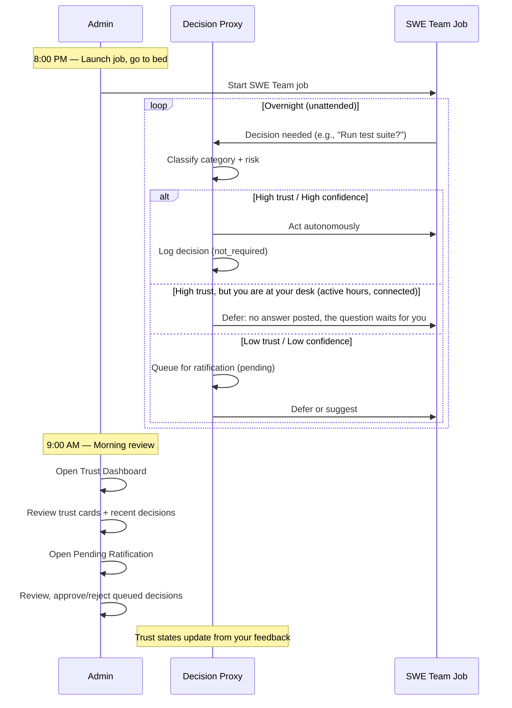

> Part 2 of 6 of the [Decision Proxy — Admin Guide](../proxy-admin-guide.md): the morning coffee workflow and the trust dashboard.

## 3. The Morning Coffee Workflow

This is the primary workflow the proxy admin pages are designed for.



### Walkthrough

1. **Evening**: Launch a SWE Team job from the Lupin UI. Set trust mode to `ACTIVE` (or `SUGGEST` for first runs).
2. **Overnight**: The proxy handles decisions based on current trust levels. High-confidence decisions in trusted categories are executed. Others are queued.
3. **Morning**: Open the **Trust Dashboard** to see an overview of what happened overnight. How many decisions per category, success rates, any circuit breaker trips.
4. **Review**: Switch to **Pending Ratification** to approve or reject queued decisions. Each approval/rejection updates the trust state for that category.
5. **Repeat**: Over days, trust levels naturally climb as you approve decisions. The proxy handles more autonomously, and your morning review gets shorter.

---

## 4. Trust Dashboard (`/app/admin/proxy-dashboard`)

The Trust Dashboard is your at-a-glance view of the proxy's current state. Use it to
understand how the proxy is performing, change the operating mode, and review recent
decision history.

### Page Layout Overview

```
┌─────────────────────────────────────────────────────────────┐
│  Home > Admin > Trust Dashboard                             │
│                                                             │
│  Decision Proxy — Trust Dashboard         [← Back to Admin] │
├─────────────────────────────────────────────────────────────┤
│  Mode Bar                                                   │
│  ┌───────────────────────────────────────────────────────┐  │
│  │ Trust Mode: [SHADOW ▾] ●   Domain: swe   User: you@  │  │
│  └───────────────────────────────────────────────────────┘  │
├─────────────────────────────────────────────────────────────┤
│  Trust Cards (6 categories — 3×2 grid)                      │
│  ┌──────────┐ ┌──────────┐ ┌──────────┐                    │
│  │Deployment│ │ Testing  │ │  Deps    │                    │
│  │   L1     │ │   L2     │ │   L1     │                    │
│  │  Shadow  │ │Provision.│ │  Shadow  │                    │
│  │ Rate: —  │ │ Rate:85% │ │ Rate: —  │                    │
│  │ 0T 0R OK │ │ 4T 1R OK │ │ 0T 0R OK │                    │
│  └──────────┘ └──────────┘ └──────────┘                    │
│  ┌──────────┐ ┌──────────┐ ┌──────────┐                    │
│  │Architect.│ │Destructiv│ │ General  │                    │
│  │   ...    │ │   ...    │ │   ...    │                    │
│  └──────────┘ └──────────┘ └──────────┘                    │
├─────────────────────────────────────────────────────────────┤
│  Recent Decisions                    [All Categories ▾]     │
│  ┌─────────────────────────────────────────────────────┐    │
│  │ Time │ Question         │ Action │ Trust │ Conf│State│   │
│  │ 2h   │ Run test suite?  │ ACT    │ L2    │ 85% │ ✓  │   │
│  │ ...  │ ...              │ ...    │ ...   │ ... │ ...│   │
│  └─────────────────────────────────────────────────────┘    │
│  [← Previous]  Page 1 of 2 (75 decisions)  [Next →]        │
└─────────────────────────────────────────────────────────────┘
```

### Mode Bar

The blue bar at the top of the page controls and displays the proxy's operating state.

| Element | Description |
|---------|-------------|
| **Trust Mode dropdown** | Select `DISABLED`, `SHADOW`, `SUGGEST`, or `ACTIVE`. Changes take effect immediately if a SWE Team job is running (hot-reload), or are queued for the next job. |
| **Status dot** | Shows the target of your mode change. **Green** = running job updated immediately. **Yellow** = queued for next job. **Gray** = no running job (idle). |
| **Domain** | Currently always `swe`. Future domains may be added. |
| **User** | Your email address (auto-detected from auth). Trust states are per-user. |

**Changing the mode**: Select a new mode from the dropdown.
The page shows a success message.
It says "active job updated" if the change reached a running job.
It says "applies to next job" if the change was queued.

### Trust Cards (6 Categories)

Below the mode bar is a 3-column grid of trust cards, one per SWE category.

**Reading a trust card**:

| Card Element | Location | What It Shows |
|-------------|----------|---------------|
| **Category icon + name** | Top | Which SWE category (e.g., "Testing") |
| **Level badge** (e.g., `Level 2`) | Center, large text | Current trust level for this category. Color matches the level (see [Badge Reference](03-pending-ratification-and-badges.md#6-badge-and-color-reference)). |
| **Level label** | Below badge | Human-readable name (e.g., "Provisional") |
| **Success rate bar** | Middle | Horizontal bar showing approval rate. Green (>80%), yellow (50-80%), red (<50%). Shows "No data" if the category has never been used. |
| **Total** | Bottom-left stat | Total decisions made in this category |
| **Rejected** | Bottom-center stat | How many decisions were rejected during ratification |
| **Circuit breaker** | Bottom-right | Status indicator with colored dot: green (OK), red (`TRIPPED`), yellow (COOLDOWN) |

**What "No data" means**: The category has never had a decision processed through it. This
is normal for fresh installations or categories that haven't been triggered yet.

### Recent Decisions Table

Below the trust cards is a table showing the most recent decisions across all categories
(or filtered to a single category).

| Column | Description |
|--------|-------------|
| **Time** | Relative timestamp (e.g., "2h ago", "5m ago", "3d ago") |
| **Question** | The decision question text, truncated to 60 characters. Hover for full text. |
| **Action** | What the proxy did: `shadow`, `suggest`, `act`, or `defer` (see [Badge Reference](03-pending-ratification-and-badges.md#6-badge-and-color-reference)) |
| **Trust** | Trust level badge at the time of the decision (Levels 1 to 5) |
| **Confidence** | How confident the proxy was in its classification. Green (>80%), orange (50-80%), red (<50%) |
| **State** | Ratification state: `pending` (orange), `approved` (green), `rejected` (red), `N/R` (gray — not required) |

**Category filter**: Use the dropdown next to "Recent Decisions" to filter by a single
category. Select "All Categories" to see the merged view.

**Pagination**: Shows 50 decisions per page. Use the Previous/Next buttons to navigate.
Page info displays "Page X of Y (N decisions)".

---
