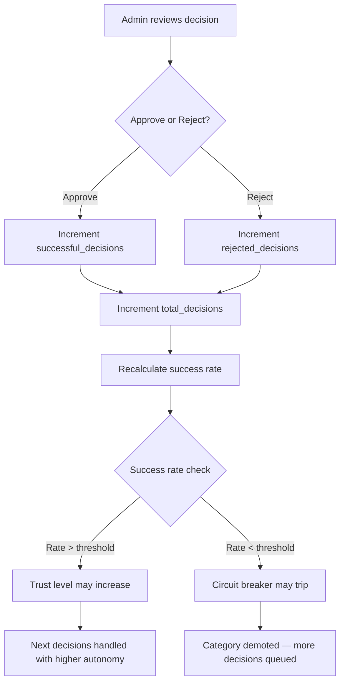

> Part 4 of 6 of the [Decision Proxy — Admin Guide](../proxy-admin-guide.md): trust feedback loop.

## 7. The Trust Feedback Loop

Every time you approve or reject a decision on the Ratification page, the system updates
the trust state for that category. This is the core learning mechanism.

### How Ratification Updates Trust States

### What Happens on Each Action

| Your Action | Effect on Trust State |
|-------------|----------------------|
| **Approve** | `total_decisions += 1`, `successful_decisions += 1`. Success rate goes up. |
| **Reject** | `total_decisions += 1`, `rejected_decisions += 1`. Success rate goes down. If rejection rate spikes, circuit breaker may trip. |

### How Success Rates Drive Trust Progression

The success rate is calculated as: `successful_decisions / total_decisions * 100`

As success rates climb, trust levels naturally progress. A category with consistently high
approval rates earns higher autonomy. A category with frequent rejections stays at lower
levels or gets demoted.

### How Circuit Breakers Protect Against Failures

If a category accumulates too many rejections in a short window, the circuit breaker
**trips**:

1. **`TRIPPED`**: Proxy stops acting autonomously for that category. All decisions are queued.
2. **COOLDOWN**: After a cooldown period, the circuit breaker enters recovery.
3. **Closed (OK)**: Normal operation resumes, but trust level may have been reduced.

This prevents runaway automation — if the proxy makes bad decisions, it automatically
stops and waits for human guidance.

### Day-by-Day Example: Trust Progression

| Day | Actions | Trust State (Testing Category) |
|-----|---------|-------------------------------|
| **Day 1** | Start in `SHADOW` mode. Proxy logs 8 shadow decisions overnight. | Level 1 Shadow, 0 total, no success rate |
| **Day 2** | Switch to `SUGGEST` mode. Proxy queues 6 suggestions. You approve all 6. | Level 1 → Level 2 Provisional, 6 total, 100% rate |
| **Day 3** | Switch to `ACTIVE` mode. Proxy acts on 4 high-confidence decisions, queues 2 lower-confidence. You approve all 2 queued. | Level 2, 8 total, 100% rate |
| **Day 4** | Proxy acts on 5, queues 1. You approve it. | Level 2 → Level 3 Trusted, 9 total, 100% rate |
| **Day 5** | Proxy acts autonomously on 7 testing decisions. 1 queued, you reject it (wrong test strategy). | Level 3, 10 total, 90% rate. Circuit breaker: OK |
| **Day 7** | Continued high approval rate. | Level 3 stable, ready for Level 4 promotion |

---
