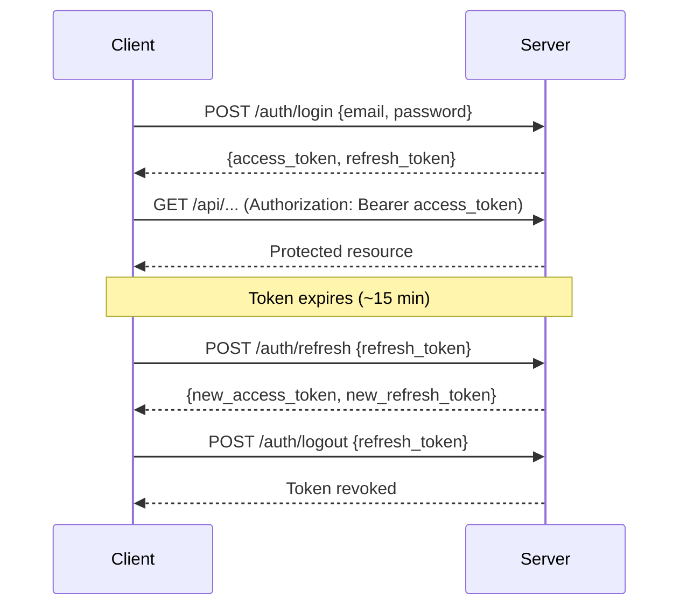
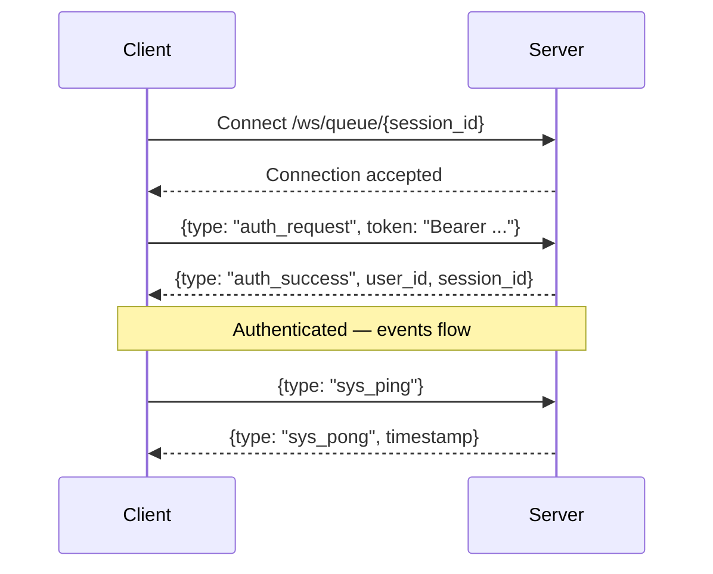

# Lupin REST API Reference

> **Last Updated**: 2026-02-25 (Session 268)
>
> Unified reference for all HTTP and WebSocket endpoints exposed by the Lupin FastAPI server (port 7999).
> For deep-dive documentation on specific subsystems, see cross-reference links within each section.

---

## Table of Contents

1. [Authentication](#1-authentication-auth) (10 endpoints)
2. [Admin](#2-admin-admin) (10 endpoints)
3. [System](#3-system) (11 endpoints)
4. [Queue Management](#4-queue-management) (5 endpoints)
5. [Notifications](#5-notifications-apinotify) (17 endpoints)
6. [Speech I/O](#6-speech-io) (5 endpoints)
7. [Jobs](#7-jobs-stubs) (2 endpoints)
8. [Embeddings](#8-embeddings-apiembeddings) (3 endpoints)
9. [Mode](#9-mode-apimode) (4 endpoints)
10. [Statistics](#10-statistics-apistats) (2 endpoints)
11. [Deep Research](#11-deep-research-apideep-research) (3 endpoints)
12. [Podcast Generator](#12-podcast-generator-apipodcast-generator) (1 endpoint)
13. [Research-to-Podcast](#13-research-to-podcast) (1 endpoint)
14. [Claude Code](#14-claude-code-apiclaude-code) (6 endpoints)
15. [Claude Code Queue](#15-claude-code-queue) (1 endpoint)
16. [SWE Team](#16-swe-team-apiswe-team) (1 endpoint)
17. [Decision Proxy](#17-decision-proxy-apiproxy) (9 endpoints)
18. [Mock Job](#18-mock-job-apimock-job) (2 endpoints)
19. [I/O Files](#19-io-files-apiio) (2 endpoints)
20. [WebSocket Admin](#20-websocket-admin-apiwebsocket-sessions) (7 endpoints)
21. [WebSocket Connections](#21-websocket-connections-ws) (2 endpoints)
22. [Pages](#22-pages-app) (12 routes)

**Total**: ~102 REST endpoints + 3 WebSocket endpoints + 12 UI page routes

---

## Authentication Legend

| Symbol | Meaning |
|--------|---------|
| **Public** | No authentication required |
| **JWT** | Bearer token in `Authorization: Bearer <token>` header |
| **Admin** | JWT + `admin` role required |
| **API Key** | `X-API-Key` header |

---

## 1. Authentication (`/auth/*`)

**Router**: `src/cosa/rest/routers/auth.py`

| Method | Path | Auth | Description |
|--------|------|------|-------------|
| POST | `/auth/register` | Public | Create new user account |
| POST | `/auth/login` | Public | Authenticate and get tokens |
| POST | `/auth/refresh` | Public | Exchange refresh token for new pair |
| POST | `/auth/logout` | Public | Revoke refresh token |
| GET | `/auth/me` | JWT | Get current user profile |
| PUT | `/auth/change-password` | JWT | Change password (requires current) |
| POST | `/auth/request-verification` | JWT | Resend email verification link |
| POST | `/auth/verify-email` | Public | Verify email with token |
| POST | `/auth/request-password-reset` | Public | Request password reset email |
| POST | `/auth/reset-password` | Public | Reset password with token |

### POST /auth/register

**Request Body**:

| Field | Type | Required | Description |
|-------|------|----------|-------------|
| email | string | Yes | User email address |
| password | string | Yes | Must meet strength requirements |
| roles | string[] | No | Defaults to `["user"]` |

**Response** (201): `{ message, user: { id, email, roles, email_verified, is_active, created_at }, tokens: { access_token, refresh_token, token_type, expires_in } }`

**Errors**: 400 (email exists, weak password), 500 (registration failed)

### POST /auth/login

**Request Body**:

| Field | Type | Required | Description |
|-------|------|----------|-------------|
| email | string | Yes | User email |
| password | string | Yes | User password |

**Response** (200): `{ message, user, tokens: { access_token, refresh_token, token_type, expires_in } }`

**Errors**: 401 (invalid credentials), 429 (account locked after 5 failed attempts), 500

### POST /auth/refresh

**Request Body**:

| Field | Type | Required | Description |
|-------|------|----------|-------------|
| refresh_token | string | Yes | Valid, non-revoked refresh token |

**Response** (200): `{ message, tokens }` (new token pair with rotation)

**Errors**: 401 (invalid/expired/revoked token)

### POST /auth/logout

**Request Body**:

| Field | Type | Required | Description |
|-------|------|----------|-------------|
| refresh_token | string | Yes | Token to revoke |

**Response** (200): `{ message: "Logout successful" }`

### GET /auth/me

**Response** (200): `{ id, email, roles, email_verified, is_active, created_at, last_login_at }`

**Errors**: 401 (missing/invalid token), 404 (user not found)

### PUT /auth/change-password

**Request Body**:

| Field | Type | Required | Description |
|-------|------|----------|-------------|
| current_password | string | Yes | Current password for verification |
| new_password | string | Yes | Must meet strength requirements |

**Response** (200): `{ message: "Password changed successfully" }`

**Errors**: 400 (incorrect current password, weak new password), 401, 404

### POST /auth/request-verification

**Response** (200): `{ message: "Verification email sent successfully" }`

**Errors**: 400 (already verified), 500 (email send failed)

### POST /auth/verify-email

**Request Body**: `{ token: string }` (from verification email)

**Response** (200): `{ message: "Email verified successfully" }`

**Errors**: 400 (invalid/expired/used token)

### POST /auth/request-password-reset

**Request Body**: `{ email: string }`

**Response** (200): Always `{ message: "If the email exists, a password reset link has been sent" }` (security: does not reveal email existence)

### POST /auth/reset-password

**Request Body**: `{ token: string, new_password: string }`

**Response** (200): `{ message: "Password reset successfully" }`

**Errors**: 400 (invalid/expired token, weak password)

---

## 2. Admin (`/admin/*`)

**Router**: `src/cosa/rest/routers/admin.py`

| Method | Path | Auth | Description |
|--------|------|------|-------------|
| GET | `/admin/users` | Admin | List users with pagination and filters |
| GET | `/admin/users/{user_id}` | Admin | Get user details |
| PUT | `/admin/users/{user_id}/roles` | Admin | Update user roles |
| PUT | `/admin/users/{user_id}/status` | Admin | Activate/deactivate user |
| POST | `/admin/users/{user_id}/reset-password` | Admin | Generate temporary password |
| GET | `/admin/snapshots/search` | Admin | Search solution snapshots by query |
| GET | `/admin/snapshots/{id_hash}` | Admin | Get full snapshot details |
| DELETE | `/admin/snapshots/{id_hash}` | Admin | Delete snapshot |
| GET | `/admin/snapshots/{id_hash}/preview` | Admin | Get snapshot hover preview |
| GET | `/admin/snapshots/{id_hash}/similar` | Admin | Find similar snapshots |

### GET /admin/users

**Query Parameters**:

| Param | Type | Default | Description |
|-------|------|---------|-------------|
| limit | int | 100 | Max results (1-1000) |
| offset | int | 0 | Pagination offset |
| search | string | — | Email search filter |
| role | string | — | Filter: `admin` or `user` |
| status_filter | string | — | Filter: `active` or `inactive` |

**Response** (200): `{ users: [...], total, limit, offset }`

### POST /admin/users/{user_id}/reset-password

**Request Body**: `{ reason?: string }` (audit trail)

**Response** (200): `{ message, temporary_password, user: { id, email } }`

### GET /admin/snapshots/search

**Query Parameters**: `q` (required, non-empty), `threshold` (float, default 80.0), `limit` (int, default 50)

**Response** (200): `{ results: [{ id_hash, question_preview, question_gist, created_date, score }], total, query }`

### GET /admin/snapshots/{id_hash}/similar

**Query Parameters**: `code_threshold` (float, 85.0), `explanation_threshold` (float, 85.0), `limit` (int, 20), `ensure_top_result` (bool, true)

**Response** (200): `{ source_id_hash, source_question, code_similar: [...], explanation_similar: [...], total_code_matches, total_explanation_matches }`

---

## 3. System

**Router**: `src/cosa/rest/routers/system.py`

| Method | Path | Auth | Description |
|--------|------|------|-------------|
| GET | `/` | Public | Health check with version |
| GET | `/health` | Public | Simplified health check |
| GET | `/api/init` | Public | Init configuration status |
| GET | `/api/get-session-id` | Public | Generate new session ID |
| GET | `/api/auth-test` | JWT | Verify token validity |
| GET | `/api/config/client` | JWT | Get client configuration values |
| GET | `/api/config/similarity-confirmation` | JWT | Get similarity confirmation setting |
| POST | `/api/config/similarity-confirmation` | JWT | Toggle similarity confirmation |
| GET | `/api/debug/websocket-state` | Public | Full WebSocket diagnostic state |

### GET /

**Response** (200): `{ status: "ok", service: "Lupin", timestamp, version }`

### GET /api/get-session-id

**Response** (200): `{ session_id: "adjective noun", timestamp }` (e.g., "wise penguin")

### GET /api/config/client

**Response** (200): `{ token_refresh_check_interval_ms, token_expiry_threshold_secs, token_refresh_dedup_window_ms, websocket_heartbeat_interval_secs, app_timezone }`

### POST /api/config/similarity-confirmation

**Request Body**: `{ enabled: bool }`

**Response** (200): `{ enabled, previous }`

### GET /api/debug/websocket-state

**Response** (200): `{ active_connections, session_to_user, user_sessions, session_subscriptions, session_timestamps, diagnostics: { total_active_connections, authenticated_sessions, unauthenticated_sessions, unique_users_connected, single_session_policy_enabled } }`

---

## 4. Queue Management

**Router**: `src/cosa/rest/routers/queues.py`

| Method | Path | Auth | Description |
|--------|------|------|-------------|
| POST | `/api/push` | JWT | Submit question to processing queue |
| GET | `/api/get-queue/{queue_name}` | JWT | Get queue contents (user-filtered) |
| POST | `/api/reset-queues` | JWT | Clear all queues for current user |
| GET | `/api/get-job-interactions/{job_id}` | JWT | Get interaction history for a job |
| POST | `/api/jobs/{job_id}/message` | JWT | Send message to running job |

### POST /api/push

**Request Body**: `{ question: string, websocket_id: string }` (both required, non-empty)

**Response** (200): `{ status, websocket_id, user_id, job_id, result }`

**Errors**: 400 (missing/empty fields)

### GET /api/get-queue/{queue_name}

**Path Parameter**: `queue_name` in `["todo", "run", "done", "dead"]`

**Query Parameter**: `user_filter` — omit for own jobs, `*` for all (admin only), or specific user_id (admin only)

**Response** (200): `{ {queue_name}_jobs_metadata: [...], filtered_by, is_admin_view, total_jobs }`

**Sorting**: Descending for todo/done/dead, ascending for run

### GET /api/get-job-interactions/{job_id}

**Response** (200): `{ job_id, session_id, job_metadata: { question, answer, agent_type, run_date }, interactions: [{ id, type, message, timestamp, response_requested, response_value, priority, abstract }], interaction_count }`

**Errors**: 403 (not your job), 404 (job not found)

### POST /api/jobs/{job_id}/message

**Request Body**: `{ message: string, priority: "normal"|"urgent" }`

**Response** (200): `{ status, notification_id, job_id }`

**Errors**: 400 (empty message), 403 (not your job), 404 (job not in running queue)

---

## 5. Notifications (`/api/notify/*`)

**Router**: `src/cosa/rest/routers/notifications.py`

> **Deep-dive reference**: See [`notification-api.md`](notification-api.md) for full request/response schemas, lifecycle diagrams, and integration examples.

| Method | Path | Auth | Description |
|--------|------|------|-------------|
| POST | `/api/notify` | API Key or JWT | Send notification to user |
| POST | `/api/notify/response` | JWT | Submit response to notification |
| GET | `/api/notifications/{user_id}` | Public | Get user notifications (with filters) |
| GET | `/api/notifications/{user_id}/next` | Public | Get next unplayed notification |
| POST | `/api/notifications/{notification_id}/played` | Public | Mark notification as played |
| DELETE | `/api/notifications/{notification_id}` | Public | Delete single notification |
| DELETE | `/api/notifications/bulk/{user_email}` | Public | Bulk delete by user (optional hours filter) |
| GET | `/api/notifications/senders/{user_email}` | Public | Get senders list with activity |
| GET | `/api/notifications/conversation/{sender_id}/{user_email}` | Public | Get sender-recipient conversation |
| DELETE | `/api/notifications/conversation/{sender_id}/{user_email}` | Public | Delete entire conversation |
| GET | `/api/notifications/conversation-by-date/{sender_id}/{user_email}` | Public | Conversation grouped by date |
| DELETE | `/api/notifications/date/{sender_id}/{user_email}/{date_string}` | Public | Soft-delete notifications by date |
| GET | `/api/notifications/sender-dates/{sender_id}/{user_email}` | Public | Date summaries for sender |
| GET | `/api/notifications/senders-visible/{user_email}` | Public | Visible senders (exclude hidden) |
| GET | `/api/notifications/active-conversation/{user_email}` | Public | Most recent sender conversation |
| GET | `/api/notifications/project-sessions/{project}/{user_email}` | Public | Sessions for project + user |
| POST | `/api/notifications/generate-gist` | Public | Generate 3-4 word session gist |

---

## 6. Speech I/O

**Router**: `src/cosa/rest/routers/speech.py`

| Method | Path | Auth | Description |
|--------|------|------|-------------|
| POST | `/api/upload-and-transcribe-mp3` | Public | Transcribe base64 MP3 via Whisper |
| POST | `/api/get-speech` | JWT | Generate TTS via OpenAI and stream to WebSocket |
| POST | `/api/get-speech-elevenlabs` | JWT | Generate TTS via ElevenLabs and stream to WebSocket |
| POST | `/api/upload-and-transcribe-wav` | Public | Transcribe WAV file upload via Whisper |
| WebSocket | `/api/ws/pcm-tts` | Public | Full-duplex streaming TTS (ElevenLabs PCM) |

### POST /api/upload-and-transcribe-mp3

**Request Body**: Raw base64 MP3 data. **Query**: `prefix`, `prompt_key` (default "generic"), `prompt_verbose` (default "verbose")

**Response** (200): Munger results (multimodal processed JSON)

### POST /api/get-speech

**Request Body**: `{ session_id: string, text: string }`

**Response** (200): `{ status, message, session_id }` (audio streamed via WebSocket)

**Errors**: 400 (missing fields), 404 (WebSocket session not found)

### POST /api/get-speech-elevenlabs

**Request Body**: `{ session_id, text, voice_id?, model_id?, stability?, similarity_boost?, style?, use_speaker_boost?, speed?, quality_profile? }`

**Response** (200): `{ status, message, session_id, provider, voice_id }`

**Errors**: 400 (validation), 404 (WebSocket not found)

### POST /api/upload-and-transcribe-wav

**Request**: `multipart/form-data` with `file` field (WAV)

**Response** (200): Plain text transcription

### WebSocket /api/ws/pcm-tts

**Query Params**: `model_id` (default "eleven_turbo_v2_5"), `voice_id` (default "G7ILShrCNLfmS0A37SXS")

**Protocol**: Client sends JSON text messages, server sends JSON status + binary PCM audio chunks

---

## 7. Jobs (Stubs)

**Router**: `src/cosa/rest/routers/jobs.py`

> Phase 1 stubs — mock implementations for testing.

| Method | Path | Auth | Description |
|--------|------|------|-------------|
| GET | `/api/delete-snapshot/{id}` | Public | Delete snapshot stub |
| GET | `/get-answer/{id}` | Public | Serve audio file stub |

---

## 8. Embeddings (`/api/embeddings/*`)

**Router**: `src/cosa/rest/routers/embeddings.py`

| Method | Path | Auth | Description |
|--------|------|------|-------------|
| POST | `/api/embeddings/generate` | JWT | Generate single embedding |
| POST | `/api/embeddings/batch` | JWT | Generate batch embeddings |
| GET | `/api/embeddings/info` | JWT | Get embedding engine info |

### POST /api/embeddings/generate

**Request Body**:

| Field | Type | Required | Description |
|-------|------|----------|-------------|
| text | string | Yes | Text to embed |
| content_type | string | No | `"prose"` (default) or `"code"` |

**Response** (200): `{ embedding: float[], dimensions: int }`

### POST /api/embeddings/batch

**Request Body**:

| Field | Type | Required | Description |
|-------|------|----------|-------------|
| texts | string[] | Yes | Texts to embed (non-empty) |
| content_type | string | No | `"prose"` (default) or `"code"` |

**Response** (200): `{ embeddings: float[][], dimensions: int, count: int }`

**Errors**: 400 (empty texts list)

### GET /api/embeddings/info

**Response** (200): `{ provider: string, dimensions: int, status: string }`

---

## 9. Mode (`/api/mode/*`)

**Router**: `src/cosa/rest/routers/mode.py`

| Method | Path | Auth | Description |
|--------|------|------|-------------|
| GET | `/api/mode/available` | JWT | List available modes |
| GET | `/api/mode/current` | JWT | Get current mode for user |
| POST | `/api/mode/current` | JWT | Set mode for user |
| DELETE | `/api/mode/current` | JWT | Clear mode (revert to system) |

### GET /api/mode/available

**Response** (200): `{ modes: [{ key, display_name, description }] }`

### GET /api/mode/current

**Response** (200): `{ user_id, mode, display_name, is_system_mode }`

### POST /api/mode/current

**Request Body**: `{ mode: string|null }` (null = system mode)

**Response** (200): `{ user_id, mode, display_name, is_system_mode, previous_mode, message }`

**Errors**: 400 (invalid mode)

---

## 10. Statistics (`/api/stats/*`)

**Router**: `src/cosa/rest/routers/stats.py`

| Method | Path | Auth | Description |
|--------|------|------|-------------|
| GET | `/api/stats/time-saved` | JWT | Personal time-saved stats |
| GET | `/api/stats/time-saved/global` | JWT | Global leaderboard stats |

### GET /api/stats/time-saved

**Query**: `days` (int, default 30)

**Response** (200): `{ user_id, period_days, total_time_saved_ms, total_replays_benefited, solutions_created, solutions_replayed_by_others, time_saved_for_others_ms, total_time_saved_formatted, time_saved_for_others_formatted }`

### GET /api/stats/time-saved/global

**Response** (200): `{ total_solutions, total_replays, total_time_saved_ms, unique_users, total_time_saved_formatted, top_solutions: [{ question, replays, time_saved_ms, time_saved_formatted }] }`

---

## 11. Deep Research (`/api/deep-research/*`)

**Router**: `src/cosa/rest/routers/deep_research.py`

| Method | Path | Auth | Description |
|--------|------|------|-------------|
| POST | `/api/deep-research/submit` | JWT | Submit research job to queue |
| GET | `/api/deep-research/report` | Public | Retrieve research report (local or GCS) |
| GET | `/api/deep-research/health` | Public | Deep research subsystem health |

### POST /api/deep-research/submit

**Request Body**:

| Field | Type | Required | Description |
|-------|------|----------|-------------|
| query | string | Yes | Research query (min 1 char) |
| budget | float | No | Max USD cost (>=0) |
| websocket_id | string | No | Session ID for notifications |
| lead_model | string | No | Override lead agent model |
| dry_run | bool | No | Simulate without API calls (default false) |
| audience | string | No | Level: beginner/general/expert/academic |
| audience_context | string | No | Custom audience description |

**Response** (200): `{ status: "queued", job_id: "dr-{uuid8}", queue_position, message }`

**Errors**: 400 (missing user ID/email), 500 (queue push failed)

### GET /api/deep-research/report

**Query**: `path` (string, required) — local file path or GCS URI (`gs://bucket/path`)

**Response** (200): Plain text markdown content

**Errors**: 400 (unsafe path), 404 (file not found), 503 (GCS SDK unavailable)

### GET /api/deep-research/health

**Response** (200): `{ status: "ok", gcs_available, local_storage: { path, exists } }`

---

## 12. Podcast Generator (`/api/podcast-generator/*`)

**Router**: `src/cosa/rest/routers/podcast_generator.py`

| Method | Path | Auth | Description |
|--------|------|------|-------------|
| POST | `/api/podcast-generator/submit` | JWT | Submit podcast generation job |

### POST /api/podcast-generator/submit

**Request Body**:

| Field | Type | Required | Description |
|-------|------|----------|-------------|
| research_source | string | Yes | File path OR natural language description |
| target_languages | string[] | No | ISO language codes |
| max_segments | int | No | Limit TTS segments |
| dry_run | bool | No | Default false |
| audience | string | No | Target audience level |
| audience_context | string | No | Custom audience description |

**Response (Flow A — direct path)** (200): `{ job_id: "pg-{uuid8}", queue_position, status: "queued" }`

**Response (Flow B — description match)** (200): `{ status: "cancelled"|"matching", message }` (LLM fuzzy matches research docs)

**Errors**: 400 (empty source), 404 (file/docs not found), 500

---

## 13. Research-to-Podcast

**Router**: `src/cosa/rest/routers/deep_research_to_podcast.py`

| Method | Path | Auth | Description |
|--------|------|------|-------------|
| POST | `/api/deep-research-to-podcast/submit` | JWT | Submit chained research + podcast job |

### POST /api/deep-research-to-podcast/submit

**Request Body**:

| Field | Type | Required | Description |
|-------|------|----------|-------------|
| query | string | Yes | Research topic |
| budget | float | No | Max USD for research phase |
| target_languages | string[] | No | ISO language codes |
| max_segments | int | No | Limit TTS segments |
| dry_run | bool | No | Default false |

**Response** (200): `{ job_id: "rp-{uuid8}", queue_position, message }`

**Errors**: 400 (empty query), 500 (job creation failed)

---

## 14. Claude Code (`/api/claude-code/*`)

**Router**: `src/cosa/rest/routers/claude_code.py`

| Method | Path | Auth | Description |
|--------|------|------|-------------|
| POST | `/api/claude-code/dispatch` | Public | Dispatch Claude Code task |
| POST | `/api/claude-code/{task_id}/inject` | Public | Inject message into session |
| POST | `/api/claude-code/{task_id}/interrupt` | Public | Interrupt running session |
| POST | `/api/claude-code/{task_id}/end` | Public | End session |
| GET | `/api/claude-code/{task_id}/status` | Public | Get task status |
| WebSocket | `/api/claude-code/ws/{task_id}` | Public | Stream task output |

### POST /api/claude-code/dispatch

**Request Body**:

| Field | Type | Required | Description |
|-------|------|----------|-------------|
| project | string | Yes | Project name |
| prompt | string | Yes | Task prompt |
| task_type | enum | Yes | `BOUNDED` or `INTERACTIVE` |

**Response** (200): `{ task_id, status, websocket_url }`

**Errors**: 400 (empty prompt)

### GET /api/claude-code/{task_id}/status

**Response** (200): `{ task_id, status, cost_usd, error }`

**Errors**: 404 (session not found)

### WebSocket /api/claude-code/ws/{task_id}

**Message Types** (server → client):
- `{ type: "text", content }` — Text output
- `{ type: "tool_use", name }` — Tool invocation
- `{ type: "tool_result", content }` — Tool result
- `{ type: "complete", success, cost_usd, duration_ms, session_id }` — Task done
- `{ type: "error", message }` — Error
- `{ type: "keepalive" }` — Heartbeat

**Client**: Send `"ping"` for keepalive

---

## 15. Claude Code Queue

**Router**: `src/cosa/rest/routers/claude_code_queue.py`

| Method | Path | Auth | Description |
|--------|------|------|-------------|
| POST | `/api/claude-code/queue/submit` | JWT | Queue Claude Code job via CJ Flow |

### POST /api/claude-code/queue/submit

**Request Body**:

| Field | Type | Required | Description |
|-------|------|----------|-------------|
| prompt | string | Yes | Task prompt (min 1 char) |
| project | string | No | Default "lupin" |
| task_type | string | No | Default "BOUNDED" |
| max_turns | int | No | 1-500, default 50 |
| websocket_id | string | No | Session ID |
| dry_run | bool | No | Default false |

**Response** (200): `{ status: "queued", job_id: "cc-{uuid8}", queue_position, message }`

**Errors**: 400 (missing user/invalid task_type), 500 (queue push failed)

---

## 16. SWE Team (`/api/swe-team/*`)

**Router**: `src/cosa/rest/routers/swe_team.py`

| Method | Path | Auth | Description |
|--------|------|------|-------------|
| POST | `/api/swe-team/submit` | JWT | Submit SWE team job to queue |

### POST /api/swe-team/submit

**Request Body**:

| Field | Type | Required | Description |
|-------|------|----------|-------------|
| task | string | Yes | Task description (min 1 char) |
| dry_run | bool | No | Default false |
| websocket_id | string | No | Session ID |
| lead_model | string | No | Override lead model |
| worker_model | string | No | Override worker model |
| budget | float | No | Max USD (>=0) |
| timeout | int | No | Timeout seconds (>0) |
| trust_mode | string | No | `disabled`/`shadow`/`suggest`/`active` |

**Response** (200): `{ status: "queued", job_id: "swe-{uuid8}", queue_position, message }`

**Errors**: 400 (missing user ID/email), 500 (job creation failed)

---

## 17. Decision Proxy (`/api/proxy/*`)

**Router**: `src/cosa/rest/routers/decision_proxy.py`

> **Deep-dive reference**: See [`proxy-admin-guide.md`](proxy-admin-guide.md) for Trust Dashboard usage, ratification workflows, and preference learning details.

| Method | Path | Auth | Description |
|--------|------|------|-------------|
| POST | `/api/proxy/acknowledge` | Public | Retire current batch, start new one |
| GET | `/api/proxy/batch-id` | Public | Get current proxy batch ID |
| GET | `/api/proxy/pending/{user_email}` | Public | Get pending decisions |
| POST | `/api/proxy/ratify/{decision_id}` | Public | Approve or reject decision |
| DELETE | `/api/proxy/decision/{decision_id}` | Public | Hard-delete decision |
| GET | `/api/proxy/trust/{user_email}` | Public | Get trust state for user |
| GET | `/api/proxy/decisions/{domain}/{category}` | Public | Decision history by domain/category |
| GET | `/api/proxy/mode` | JWT | Get current trust mode |
| PUT | `/api/proxy/mode` | JWT | Update trust mode |

---

## 18. Mock Job (`/api/mock-job/*`)

**Router**: `src/cosa/rest/routers/mock_job.py`

| Method | Path | Auth | Description |
|--------|------|------|-------------|
| POST | `/api/mock-job/submit` | JWT | Submit mock job for queue UI testing |
| GET | `/api/mock-job/health` | Public | Mock job subsystem health |

### POST /api/mock-job/submit

**Request Body**:

| Field | Type | Required | Description |
|-------|------|----------|-------------|
| iterations_min | int | No | 1-20, default 3 |
| iterations_max | int | No | 1-20, default 8 |
| sleep_min | float | No | 0.1-30s, default 1.0 |
| sleep_max | float | No | 0.1-30s, default 5.0 |
| failure_probability | float | No | 0-1, default 0.0 |
| fixed_iterations | int | No | Override random iterations |
| fixed_sleep | float | No | Override random sleep |
| description | string | No | Job label (max 100 chars) |
| websocket_id | string | No | Session ID |
| voice_command | string | No | Routes through RuntimeArgumentExpeditor |

**Response** (200): `{ status: "queued", job_id: "mock-{uuid8}", queue_position, config: { iterations, sleep_seconds, will_fail, fail_at_iteration, estimated_duration }, message }`

**Errors**: 400 (invalid ranges), 422 (invalid voice_command match)

### GET /api/mock-job/health

**Response** (200): `{ status: "ok", available: true, description }`

---

## 19. I/O Files (`/api/io/*`)

**Router**: `src/cosa/rest/routers/io_files.py`

| Method | Path | Auth | Description |
|--------|------|------|-------------|
| GET | `/api/io/file` | Public | Serve file from io/ directory |
| GET | `/api/io/health` | Public | I/O subsystem health |

### GET /api/io/file

**Query**: `path` (required) — relative path within `io/` directory

**Supported types**: `.md`, `.txt`, `.mp3`, `.wav`, `.pdf`, `.json`

**Security**: Path normalization prevents directory traversal (`../` blocked)

**Errors**: 400 (unsafe path, unsupported type), 404 (file not found)

### GET /api/io/health

**Response** (200): `{ status: "ok", io_path, io_exists, subdirs: { "deep-research": int, "podcasts": int }, media_types }`

---

## 20. WebSocket Admin (`/api/websocket-sessions/*`)

**Router**: `src/cosa/rest/routers/websocket_admin.py`

| Method | Path | Auth | Description |
|--------|------|------|-------------|
| GET | `/api/websocket-sessions` | JWT | List all active sessions |
| GET | `/api/websocket-sessions/stats` | JWT | Connection statistics |
| POST | `/api/websocket-sessions/cleanup` | JWT | Remove stale sessions |
| GET | `/api/websocket-sessions/{session_id}` | JWT | Get session details |
| DELETE | `/api/websocket-sessions/{session_id}` | JWT | Force-disconnect session |
| PUT | `/api/websocket-sessions/single-session-policy` | JWT | Toggle single-session policy |
| GET | `/api/websocket-events` | JWT | List available event types |

### GET /api/websocket-sessions

**Response** (200): `{ total_sessions, total_users, sessions: [...], timestamp }`

### POST /api/websocket-sessions/cleanup

**Query**: `max_age_hours` (int, default 24)

**Response** (200): `{ sessions_cleaned, max_age_hours, timestamp }`

**Errors**: 400 (negative max_age_hours)

---

## 21. WebSocket Connections (`/ws/*`)

**Router**: `src/cosa/rest/routers/websocket.py`

> **Deep-dive reference**: See [`websocket-architecture.md`](websocket-architecture.md) for dual-session design, event system, and session management details.

| Type | Path | Auth | Description |
|------|------|------|-------------|
| WebSocket | `/ws/queue/{session_id}` | JWT (first message) | Main application WebSocket |
| WebSocket | `/ws/audio/{session_id}` | Optional | Audio-only TTS streaming |

### /ws/queue/{session_id}

**Session ID format**: Two lowercase words (e.g., "wise penguin") — validated by regex `^[a-z]+ [a-z]+$`

**Authentication**: First message must be `{ type: "auth_request", token: "Bearer ...", subscribed_events?: [...] }`

**Server responses**:
- `{ type: "auth_success", user_id, session_id }` — Auth OK
- `{ type: "auth_error", message }` — Auth failed (closes connection)
- `{ type: "connect", message, session_id, timestamp }` — Connected

**Client messages**:
- `{ type: "sys_ping" }` → `{ type: "sys_pong", timestamp }`
- `{ type: "update_subscriptions", events: [...], action }` → `{ type: "subscription_update", success, subscriptions }`

### /ws/audio/{session_id}

**Connection**: Direct connect with session ID validation. Receives binary PCM audio chunks for TTS playback.

---

## 22. Pages (`/app/*`)

**Router**: `src/cosa/rest/routers/pages.py`

> UI page routes. All return HTML files. Excluded from OpenAPI schema. Authentication enforced client-side via JavaScript JWT validation.

| Path | Page |
|------|------|
| `/app` | Landing page |
| `/app/notifications` | Notifications dashboard |
| `/app/auth/login` | Login form |
| `/app/auth/register` | Registration form |
| `/app/auth/profile` | User profile |
| `/app/auth/change-password` | Password change |
| `/app/admin` | Admin dashboard |
| `/app/admin/users` | User management |
| `/app/admin/snapshots` | Snapshot admin |
| `/app/admin/proxy-ratify` | Proxy ratification |
| `/app/admin/proxy-dashboard` | Trust dashboard |
| `/app/admin/dev-tools` | Developer tools |

---

## Cross-Reference: Deep-Dive Documentation

| Topic | Document | Sections Covered |
|-------|----------|-----------------|
| Notification system | [`notification-api.md`](notification-api.md) | Full API reference, lifecycle diagrams, integration |
| Decision proxy | [`proxy-admin-guide.md`](proxy-admin-guide.md) | Trust dashboard, ratification, preference learning |
| WebSocket architecture | [`websocket-architecture.md`](websocket-architecture.md) | Dual-session design, event system, routing |
| WebSocket events | [`websocket-events.md`](websocket-events.md) | Complete event catalog |
| WebSocket troubleshooting | [`websocket-troubleshooting.md`](websocket-troubleshooting.md) | Debug procedures |
| Interactive testing | [`automated-interactive-testing.md`](automated-interactive-testing.md) | Proxy auto-answer, pipeline testing |
| Frontend architecture | [`lupin-mpa-frontend-architecture.md`](lupin-mpa-frontend-architecture.md) | MPA design, navigation |

---

## Common Error Codes

| Code | Meaning |
|------|---------|
| 200 | Success |
| 201 | Created (registration) |
| 400 | Bad request / validation error |
| 401 | Unauthorized (missing/invalid JWT) |
| 403 | Forbidden (insufficient role) |
| 404 | Resource not found |
| 422 | Unprocessable entity (validation) |
| 429 | Rate limited / account locked |
| 500 | Internal server error |
| 503 | Service unavailable (e.g., GCS SDK) |

---

## Authentication Patterns

### JWT Token Lifecycle

### WebSocket Authentication

---

## Job ID Prefixes

| Prefix | Job Type | Router |
|--------|----------|--------|
| `dr-` | Deep Research | `/api/deep-research/submit` |
| `pg-` | Podcast Generator | `/api/podcast-generator/submit` |
| `rp-` | Research-to-Podcast | `/api/deep-research-to-podcast/submit` |
| `cc-` | Claude Code | `/api/claude-code/queue/submit` |
| `swe-` | SWE Team | `/api/swe-team/submit` |
| `mock-` | Mock Job | `/api/mock-job/submit` |
