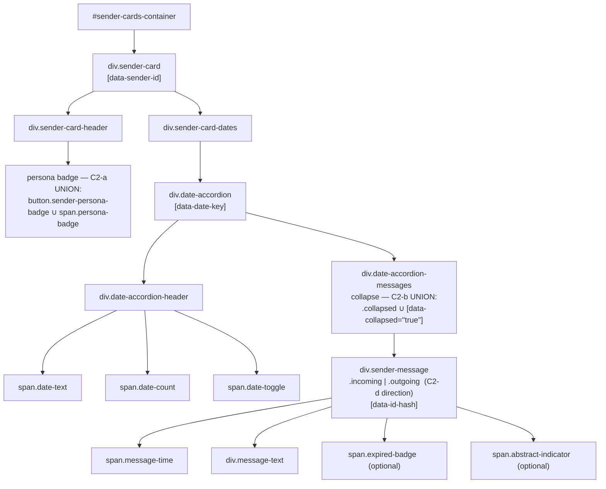

# Layout Contract — the parity referee for `notifications-surface.css`

**Status:** ACTIVE (v0.1.9 · WS2) · **Lives next to** the sheet it governs
(`notifications-surface.css`, same directory — Doc 01 §"The Layout Contract").
**Authored:** 2026-06-22 (Rio ⚡, Foundation §A / WS2, for Tiberius 👑's
multiplexer full-parity build).

## Why this file exists

A stylesheet is only deterministic against a DOM it can select. The shared sheet
`notifications-surface.css` is the **single source** of the layout-contract
surfaces that BOTH `/app/notifications` (the legacy monolith) and
`/app/multiplexer` must render identically. That single-sourcing only holds if
**both renderers emit the same DOM skeleton** for the sheet to select against.

This document is that skeleton, written down. It is the **minimal set of
`(tag, class, selector-driving-attribute)` tuples** the shared sheet relies on —
the *referee* for every Category-2 reconciliation (Doc 00). When a renderer and
the contract disagree, the resolution is one of exactly two moves:

1. **change the renderer** to satisfy the contract, or
2. **widen the contract** (and the shared sheet) to admit both forms via a
   selector union.

**The contract — not a screenshot — is the definition of "the same."** It is
machine-asserted by **Tier 1** of the Layout-Parity Oracle
(`src/tests/parity_oracle/test_tier1.py` via `CONTRACT_SKELETON_JS` in
`src/tests/e2e_ui/parity_oracle.py`); this prose and that walker MUST stay in
lockstep — see §Maintenance.

## Provenance / source docs

- `src/rnd/v0.1.9/2026.06.19-multiplexer-layout-parity-methodology/00-feasibility-report.md` — Premise A (root cause: divergent CSS copy).
- `.../01-layout-parity-methodology.md` — Pillar 1 (single-source CSS) + the Layout-Contract definition + the Tier 0–4 oracle ladder.
- `.../02-bridging-work-plan.md` — WS1/WS2/WS3 + Decisions **D1 Rider A** (byte-faithful extract, legacy links shared sheet BEFORE its monolith) and **D2** (legacy `margin` spacing model).
- `notifications-surface.css` header block — per-surface source-line citations into the 6009-line monolith.

## The contract skeleton (the canonical DOM tree)



## The contract tuples

Every row is a node the shared sheet styles AND the Tier-1 walker asserts. The
"surface CSS" column cites the rule block in `notifications-surface.css`; the
"oracle field" column is the `CONTRACT_SKELETON_JS` key that proves it present.

| Contract node | Selector (tag.class[attr]) | Surface CSS | Oracle field | Notes |
|---|---|---|---|---|
| **Sender card** | `div.sender-card[data-sender-id]` | `.sender-card` block | `cards[]` / `sender_id` | `data-*` additive-OK; root of one sender's column |
| Card header | `div.sender-card-header` (direct child) | `.sender-card-header` block | `has_header` | walked as `:scope > .sender-card-header` |
| **Persona badge (C2-a)** | `button.sender-persona-badge` **∪** `span.persona-badge` | `.persona-badge, .sender-persona-badge` union | `persona_badge` | present on persona'd senders, absent on persona-less external senders |
| Dates container | `div.sender-card-dates` | `.sender-card-dates` block | `has_dates` | |
| **Date accordion** | `div.date-accordion[data-date-key]` | `.date-accordion` block | `accordions[]` / `date_key` | one per distinct message date |
| Accordion header | `div.date-accordion-header` | `.date-accordion-header` block | `has_header` | |
| Date text | `span.date-text` | (header children) | `has_text` | renamed from `.date-label` (commit `d8980bc3`, 7.5px vertical fix) |
| Date count | `span.date-count` | (header children) | `has_count` | |
| Date toggle | `span.date-toggle` | (header children) | `has_toggle` | the collapse affordance |
| **Accordion messages (C2-b)** | `div.date-accordion-messages` | `.date-accordion-messages` block | (container of `messages[]`) | collapsed ⇔ `.date-accordion-messages.collapsed` **∪** `.date-accordion[data-collapsed="true"] .date-accordion-messages` |
| **Message (C2-d)** | `div.sender-message.incoming` \| `.outgoing` `[data-id-hash]` | `.sender-message` + `.incoming`/`.outgoing` blocks | `messages[]` / `direction` | direction referee — `incoming` for prompts, `outgoing` for the responded-split response row |
| Message time | `span.message-time` | (message children) | `has_time` | |
| Message text | `div.message-text` | (message children) | `has_text` | |
| Expired badge | `span.expired-badge` | `.expired-response` blocks | `expired_badge` | optional — present only on expired responses |
| Abstract indicator | `span.abstract-indicator` | abstract block | `abstract_indicator` | optional — present only when the notification carries an abstract |

## Category-2 reconciliations (the referee's rulings)

These are the four divergences Doc 00 flagged between the two renderers. Three
are pure shared-CSS (this lane); one (C2-d) is a renderer/model split owned by
the feature lane. Status as of HEAD `a1814e00`:

| C2 | Divergence | Ratified resolution | Mechanism | Status @ `a1814e00` |
|---|---|---|---|---|
| **C2-a** | persona badge: `<button.sender-persona-badge>` (mux, popover intent) vs `<span.persona-badge>` (legacy) | **Widen the contract** — shared rule fires for the union; a button reset makes the button visually identical to the legacy span | `notifications-surface.css` selector union `.persona-badge, .sender-persona-badge` | ✅ committed `742293ed` |
| **C2-b** | collapse: `.collapsed` (legacy class on messages) vs `[data-collapsed]` (mux attr on accordion) | **Widen the contract** — one-line selector union fires for both | `.date-accordion-messages.collapsed, .date-accordion[data-collapsed="true"] .date-accordion-messages` | ✅ committed `742293ed` |
| **C2-c** | inter-card spacing: legacy `margin-bottom` vs mux `gap` | **D2 — legacy `margin` model is the contract.** Encode once in the shared sheet; drop the drift-invented `#sender-cards-container { gap:8px }` | `.collapsible-section { margin-bottom:30px }` in shared sheet; gap dropped from `multiplexer/notifications-list.css` | ✅ committed `742293ed` |
| **C2-d** | message direction: mux was always `.incoming` | **D3 — support `.outgoing` day-one.** CSS for both directions already ported; the renderer/model **responded-split** (`notificationItem.ts` direction param + `toMuxModel` wiring) is the non-CSS half | TS — **feature lane**, not this CSS lane | ✅ CSS present in shared sheet; split landed `d0aaa767` (Clayton) — Tier-1 direction test green |

### Carve-out: `.action-required-*` is intentionally NOT in the contract (this slice)

The two clients use **disjoint** action-required class sets — legacy renders an
*interactive* widget (`.action-required-notification/-header/-timer/-progress-bar/…`),
the mux a *read-only* one (`.action-required-widget/-prompt/-countdown/…`, owned
by `multiplexer/action-required.css`). There is **no shared selector** to
single-source byte-faithful, so this is a **Category-3 functional divergence**,
not a CSS one. It folds into the shared sheet (and this contract) **only once
the mux widget reaches functional parity** with legacy — WS4 / 06-10 lane,
oracle-gated. Rachel's full-page Tier-1 reports it as a MISSING structure-parity
node by design; that is **expected, not a regression**.

## How the contract is enforced

```
Tier 0  CSS Source Identity   — both pages <link> the same notifications-surface.css (hash)
                                src/tests/parity_oracle/test_tier0.py        (:7999 / static)
Tier 1  DOM Contract Conformance — each renderer emits THIS skeleton on the canonical fixture
                                src/tests/parity_oracle/test_tier1.py        (:7999 / headless Chromium)
Tier 2/3 Computed-Style + Geometry — corresponding nodes match (style/box parity)
                                src/tests/parity_oracle/test_tier2_tier3.py  (WS3 lane)
```

The canonical fixture is `src/tests/e2e_ui/fixtures/notifications-parity-scenario.json`
(2 sender cards — one persona'd, one persona-less external; a responded pair for
the C2-d split; an abstract row and an expired row).

## Maintenance — keep this doc, the walker, and the sheet in lockstep

Changing the contract is a **three-part edit**, never one:

1. **This file** — add/rename/remove the tuple row and any C2 ruling.
2. **`CONTRACT_SKELETON_JS`** (and `CONTRACT_STYLE_GEOM_JS`) in
   `src/tests/e2e_ui/parity_oracle.py` — the machine encoding Tier 1 asserts.
3. **`notifications-surface.css`** — the rule that styles the node, byte-faithful
   to the monolith (D1 Rider A), with its `notifications.css` source-line citation.

Under the single-source strategy (D1/S2), **legacy-contract drift IS a
shared-sheet change** — the golden's baked content-hash trip-wire (D5 Rider C)
will fail and force a golden recapture. A contract change that skips any of the
three edits above will surface as a Tier-0 (hash), Tier-1 (skeleton), or
Tier-2/3 (style/geometry) failure that **names the node and property** — no human
eyes required.
