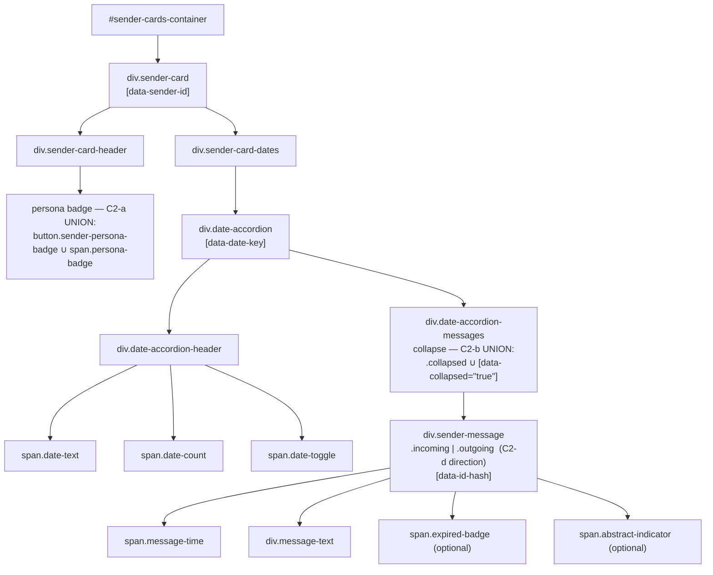

# Layout Contract — the parity referee for `notifications-surface.css`

**Status:** ACTIVE (v0.1.9 · WS2) · **Lives next to** the sheet it governs
(`notifications-surface.css`, same directory — Doc 01 §"The Layout Contract").
**Authored:** 2026-06-22 (Rio ⚡, Foundation §A / WS2, for Tiberius 👑's
multiplexer full-parity build).

## Why this file exists

A stylesheet is only deterministic against a DOM it can select. The shared sheet
`notifications-surface.css` is the **single source** of the layout-contract
surfaces that BOTH `/app/notifications` (the legacy monolith) and
`/app/multiplexer` must render identically. That single-sourcing only holds if
**both renderers emit the same DOM skeleton** for the sheet to select against.

This document is that skeleton, written down. It is the **minimal set of
`(tag, class, selector-driving-attribute)` tuples** the shared sheet relies on —
the *referee* for every Category-2 reconciliation (Doc 00). When a renderer and
the contract disagree, the resolution is one of exactly two moves:

1. **change the renderer** to satisfy the contract, or
2. **widen the contract** (and the shared sheet) to admit both forms via a
   selector union.

**The contract — not a screenshot — is the definition of "the same."** It is
machine-asserted by **Tier 1** of the Layout-Parity Oracle
(`src/tests/parity_oracle/test_tier1.py` via `CONTRACT_SKELETON_JS` in
`src/tests/e2e_ui/parity_oracle.py`); this prose and that walker MUST stay in
lockstep — see §Maintenance.

## Provenance / source docs

- `src/rnd/v0.1.9/2026.06.19-multiplexer-layout-parity-methodology/00-feasibility-report.md` — Premise A (root cause: divergent CSS copy).
- `.../01-layout-parity-methodology.md` — Pillar 1 (single-source CSS) + the Layout-Contract definition + the Tier 0–4 oracle ladder.
- `.../02-bridging-work-plan.md` — WS1/WS2/WS3 + Decisions **D1 Rider A** (byte-faithful extract, legacy links shared sheet BEFORE its monolith) and **D2** (legacy `margin` spacing model).
- `notifications-surface.css` header block — per-surface source-line citations into the 6009-line monolith.

## The contract skeleton (the canonical DOM tree)



## The contract tuples

Every row is a node the shared sheet styles AND the Tier-1 walker asserts. The
"surface CSS" column cites the rule block in `notifications-surface.css`; the
"oracle field" column is the `CONTRACT_SKELETON_JS` key that proves it present.

| Contract node | Selector (tag.class[attr]) | Surface CSS | Oracle field | Notes |
|---|---|---|---|---|
| **Sender card** | `div.sender-card[data-sender-id]` | `.sender-card` block | `cards[]` / `sender_id` | `data-*` additive-OK; root of one sender's column |
| Card header | `div.sender-card-header` (direct child) | `.sender-card-header` block | `has_header` | walked as `:scope > .sender-card-header` |
| **Persona badge (C2-a)** | `button.sender-persona-badge` **∪** `span.persona-badge` | `.persona-badge, .sender-persona-badge` union | `persona_badge` | present on persona'd senders, absent on persona-less external senders |
| Dates container | `div.sender-card-dates` | `.sender-card-dates` block | `has_dates` | |
| **Date accordion** | `div.date-accordion[data-date-key]` | `.date-accordion` block | `accordions[]` / `date_key` | one per distinct message date |
| Accordion header | `div.date-accordion-header` | `.date-accordion-header` block | `has_header` | |
| Date text | `span.date-text` | (header children) | `has_text` | renamed from `.date-label` (commit `d8980bc3`, 7.5px vertical fix) |
| Date count | `span.date-count` | (header children) | `has_count` | |
| Date toggle | `span.date-toggle` | (header children) | `has_toggle` | the collapse affordance |
| **Accordion messages (C2-b)** | `div.date-accordion-messages` | `.date-accordion-messages` block | (container of `messages[]`) | collapsed ⇔ `.date-accordion-messages.collapsed` **∪** `.date-accordion[data-collapsed="true"] .date-accordion-messages` |
| **Message (C2-d)** | `div.sender-message.incoming` \| `.outgoing` `[data-id-hash]` | `.sender-message` + `.incoming`/`.outgoing` blocks | `messages[]` / `direction` | direction referee — `incoming` for prompts, `outgoing` for the responded-split response row |
| Message time | `span.message-time` | (message children) | `has_time` | |
| Message text | `div.message-text` | (message children) | `has_text` | |
| Expired badge | `span.expired-badge` | `.expired-response` blocks | `expired_badge` | optional — present only on expired responses |
| Abstract indicator | `span.abstract-indicator` | abstract block | `abstract_indicator` | optional — present only when the notification carries an abstract |

## Category-2 reconciliations (the referee's rulings)

These are the four divergences Doc 00 flagged between the two renderers. Three
are pure shared-CSS (this lane); one (C2-d) is a renderer/model split owned by
the feature lane. Status as of HEAD `a1814e00`:

| C2 | Divergence | Ratified resolution | Mechanism | Status @ `a1814e00` |
|---|---|---|---|---|
| **C2-a** | persona badge: `<button.sender-persona-badge>` (mux, popover intent) vs `<span.persona-badge>` (legacy) | **Widen the contract** — shared rule fires for the union; a button reset makes the button visually identical to the legacy span | `notifications-surface.css` selector union `.persona-badge, .sender-persona-badge` | ✅ committed `742293ed` |
| **C2-b** | collapse: `.collapsed` (legacy class on messages) vs `[data-collapsed]` (mux attr on accordion) | **Widen the contract** — one-line selector union fires for both | `.date-accordion-messages.collapsed, .date-accordion[data-collapsed="true"] .date-accordion-messages` | ✅ committed `742293ed` |
| **C2-c** | inter-card spacing: legacy `margin-bottom` vs mux `gap` | **D2 — legacy `margin` model is the contract.** Encode once in the shared sheet; drop the drift-invented `#sender-cards-container { gap:8px }` | `.collapsible-section { margin-bottom:30px }` in shared sheet; gap dropped from `multiplexer/notifications-list.css` | ✅ committed `742293ed` |
| **C2-d** | message direction: mux was always `.incoming` | **D3 — support `.outgoing` day-one.** CSS for both directions already ported; the renderer/model **responded-split** (`notificationItem.ts` direction param + `toMuxModel` wiring) is the non-CSS half | TS — **feature lane**, not this CSS lane | ✅ CSS present in shared sheet; split landed `d0aaa767` (Clayton) — Tier-1 direction test green |

### Carve-out: `.action-required-*` is intentionally NOT in the contract (this slice)

The two clients use **disjoint** action-required class sets — legacy renders an
*interactive* widget (`.action-required-notification/-header/-timer/-progress-bar/…`),
the mux a *read-only* one (`.action-required-widget/-prompt/-countdown/…`, owned
by `multiplexer/action-required.css`). There is **no shared selector** to
single-source byte-faithful, so this is a **Category-3 functional divergence**,
not a CSS one. It folds into the shared sheet (and this contract) **only once
the mux widget reaches functional parity** with legacy — WS4 / 06-10 lane,
oracle-gated. Rachel's full-page Tier-1 reports it as a MISSING structure-parity
node by design; that is **expected, not a regression**.

## How the contract is enforced

```
Tier 0  CSS Source Identity   — both pages <link> the same notifications-surface.css (hash)
                                src/tests/parity_oracle/test_tier0.py        (:7999 / static)
Tier 1  DOM Contract Conformance — each renderer emits THIS skeleton on the canonical fixture
                                src/tests/parity_oracle/test_tier1.py        (:7999 / headless Chromium)
Tier 2/3 Computed-Style + Geometry — corresponding nodes match (style/box parity)
                                src/tests/parity_oracle/test_tier2_tier3.py  (WS3 lane)
```

The canonical fixture is `src/tests/e2e_ui/fixtures/notifications-parity-scenario.json`
(2 sender cards — one persona'd, one persona-less external; a responded pair for
the C2-d split; an abstract row and an expired row).

## Maintenance — keep this doc, the walker, and the sheet in lockstep

Changing the contract is a **three-part edit**, never one:

1. **This file** — add/rename/remove the tuple row and any C2 ruling.
2. **`CONTRACT_SKELETON_JS`** (and `CONTRACT_STYLE_GEOM_JS`) in
   `src/tests/e2e_ui/parity_oracle.py` — the machine encoding Tier 1 asserts.
3. **`notifications-surface.css`** — the rule that styles the node, byte-faithful
   to the monolith (D1 Rider A), with its `notifications.css` source-line citation.

Under the single-source strategy (D1/S2), **legacy-contract drift IS a
shared-sheet change** — the golden's baked content-hash trip-wire (D5 Rider C)
will fail and force a golden recapture. A contract change that skips any of the
three edits above will surface as a Tier-0 (hash), Tier-1 (skeleton), or
Tier-2/3 (style/geometry) failure that **names the node and property** — no human
eyes required.

---

## Extension — the four accordion panes (fleet status · task list · holding area · epic board)

**Status: DRAFT.** Authored John 🏄🏽 2026-09-06, at `2a18d667`, on María 🌸's ruling
that the derivation is the author's rather than a spec change. Ratified two-part
split: derive the INNER accordions from legacy per Pillar 1; record the
SECTION-LEVEL accordion as a Category-3 carve-out. **Nothing below has been run
through Tier 1 yet** — these are contract rows awaiting a walker, not results.

🔴 **THAT SECOND HALF WAS OVERTURNED THE SAME EVENING AND THIS HEADER IS KEPT
HONEST RATHER THAN QUIETLY REWRITTEN.** The carve-out rested on a census of
`notifications.js` that searched the GENERATOR and concluded about the PAGE;
against the rendered DOM legacy has 15 `.section-header` and 20 `.toggle-button`,
and all four panes have one. The section-level accordion is therefore IN the
contract, with derived rows, and the retraction is recorded in full below rather
than deleted — a withdrawn claim that leaves no trace teaches the next reader
nothing.

🔴 **AND THIS DRAFT IS PART 1 OF THE THREE-PART EDIT THIS FILE'S OWN MAINTENANCE
SECTION REQUIRES — SAID OUT LOUD RATHER THAN LEFT TO BE DISCOVERED.** Parts 2
(`CONTRACT_SKELETON_JS` in `src/tests/e2e_ui/parity_oracle.py`) and 3 (the
styling rule) are NOT done, in María's ratified order: contract rows → fixture →
mount + walker. So the rows below are **asserted by nothing** at the moment you
are reading this. A contract row without a walker entry is a description, not a
gate, and the gap between them is exactly where a reader assumes coverage that
does not exist.

⚠️ **Part 3 does not map cleanly here and should not be forced.** The maintenance
clause names `notifications-surface.css` as the sheet a new row must be styled
in, byte-faithful to the monolith. The inner-accordion nodes below are styled by
`task-list.css` and `epic-board.css` — sheets BOTH pages already link, per Rick's
"CSS is out of scope, just link them" ruling — and by `notifications.css` for the
holding area. Whether that satisfies part 3 or requires an extraction into the
shared sheet is a question for whoever owns the methodology; it is flagged here,
not silently answered.

**All 25 source citations in the tables below were verified mechanically against
the files at `2a18d667`** — each cited line was read and matched against the
class it claims to carry. One was wrong on the first pass (`epic-story-row` at
`:13567`, actually `:13568`) and is corrected. Line numbers in a live file go
stale; the class name in the selector column is the durable half.

### Why this extension exists

Row `87812328` carries Rick's ruling, ratified by keypress: the four panes must
*"look exactly"* and *"behave exactly"* like the legacy client. The oracle that
answers "look exactly" is this contract plus `test_tier1.py` — but both were
built for the notifications surface (sender-card → date-accordion →
notification-item) and neither has a row for anything these four panes render.

### The inner accordions — IN the contract

These are the per-owner, per-epic and per-group accordions. **Both** clients
render them, with the same class vocabulary and the same chevron glyphs
(`▸` collapsed / `▾` expanded), so a legacy-derived row is meaningful.

Legacy source is `static/js/notifications.js`; mux source is
`static/js/multiplexer/render/templates/`.

| Contract node | Selector (tag.class[attr]) | Legacy | Mux | Notes |
|---|---|---|---|---|
| **Task owner group** | `tbody.task-group[id][data-owner]` | `notifications.js:11433` | `taskListTable.ts:109` | collapsed ⇔ `tbody.task-group.collapsed` — a class on the CONTAINER, unlike the section-level attribute idiom |
| Task group header | `tr.task-group-header[role="button"][tabindex="0"][aria-expanded][aria-controls]` | `:11428` | `:49` | `aria-expanded` is the collapse referee; `.task-group-unassigned` is an additive modifier |
| Task group chevron | `span.task-group-chevron[aria-hidden="true"]` | `:11425` | `:58` | glyph `▸` collapsed / `▾` expanded |
| **Epic group header** | `tr.epic-group-header[role="button"][tabindex="0"][aria-expanded][aria-controls]` | `:13561` | `epicBoardTable.ts:74` | `${extraClass}-header` is an additive modifier |
| Epic group chevron | `span.epic-group-chevron[aria-hidden="true"]` | `:13558` | `:84` | same glyph pair as the task chevron |
| Epic group label | `span.epic-group-label` | `:13562` | `:90` | |
| Epic group count | `span.epic-group-count` | `:13562` | `:95` | |
| Epic story row | `tr.epic-story-row` | `:13568` | `:134` | rides INSIDE the group — opening an epic reveals the story in the same gesture |
| **Holding-area group** | `div.holding-area-group[data-filer]` | `:12750` | `holdingAreaTable.ts:144` | |
| Holding group header | `div.holding-area-group-header` | `:12751` | `:88` | not a `<tr>` — this pane groups with `<div>`s |
| Holding filer | `span.holding-area-filer` | `:12752` | `:91` | |
| Holding group count | `span.holding-area-group-count` | `:12753` | `:96` | |
| Holding group status | `span.holding-area-group-status[data-filer]` | `:12760` | `:114` | |

⚠️ **Fleet status contributes no row.** It renders a flat table with no inner
grouping in either client, so it has no inner accordion to contract. Its absence
here is a property of the pane, not an omission — and it is the reason "all four
panes" and "all four inner accordions" are different counts.

⚠️ **The collapse referee is not uniform across these rows, and the contract must
not flatten it.** The task group carries `.collapsed` on the `<tbody>`; the epic
group carries `aria-expanded` on the header `<tr>`; the section-level chrome (see
the carve-out) uses `[data-collapsed]` on the section root. Three idioms, all
legacy-derived except the third. A walker that looks for one of them will report
the other two as missing.

### 🔴 RETRACTED CARVE-OUT — the section-level accordion IS in the contract

**The carve-out that stood here is WITHDRAWN, and its premise was false.** It
claimed legacy renders no section-level accordion, on a census of
`notifications.js` returning `section-header 0 / section-content 0 /
toggle-button 0`. Those three zeros are wrong.

🔴 **THE CENSUS SEARCHED THE GENERATOR AND CONCLUDED ABOUT THE PAGE.** The markup
is STATIC in `notifications.html`, not emitted by the JS. Measured against the
RENDERED DOM of running legacy at `:7999`:

| class | static grep of `notifications.js` | rendered DOM |
|---|---|---|
| `.section-header` | 0 | **15** |
| `.section-content` | 0 | **20** |
| `.toggle-button` | 0 | **20** |
| `.section-hidden` | 11 | **0** — it is a toggled state, applied on interaction |

**All four panes have one**, named in the rendered DOM by their own handlers:
`toggleSection('fleet-status-section')`, `'task-list-section'`,
`'holding-area-section'`, `'epic-board-section'`.

🔴 **AND THE POSITIVE CONTROL PASSED WHILE SHARING THE DEFECT — this is the
durable lesson and it is worth more than the rows.** The census was declared
sound because `date-accordion-header` returned 1. But the date accordion is
**JS-generated**, which is the one class of node that was never in question. The
control demonstrated only that the search finds JS-generated nodes.
⇒ **A positive control drawn from the same class as your true positives cannot
detect a population error.** State which of your searches are STATIC (source
text) and which are DYNAMIC (rendered DOM), and never let one answer for the
other.

### The section-level accordion — contract rows

Derived from **running legacy**, not from source. Legacy's shape, with the mux's
beside it:

```
LEGACY                                          MUX
div.collapsible-section                         section#<pane>-pane[data-collapsed]
  div.section-header[onclick=toggleSection]       div.section-header[data-testid]
    h3 > span#<pane>-count                          h3 > span.section-header-count
       > span.<pane>-updated                        div.section-header-actions
    button.refresh-btn                                button (refresh)
    button.toggle-button   ▼ open / ▶ closed          span.toggle-button  ▼ / ▶
  div.section-content#<pane>-section               div.section-content
    collapsed <=> .collapsed                         collapsed <=> [data-collapsed="true"]
```

| Contract node | Selector | Legacy | Mux | Notes |
|---|---|---|---|---|
| **Section header** | `div.section-header` | `notifications.html` ×4, one per pane | `templates/sectionHeader.ts` | present in BOTH; the carve-out denied this |
| Toggle chevron | `.toggle-button` | `button.toggle-button[id]` | `span.toggle-button` | **glyphs are IDENTICAL: `▼` expanded, `▶` collapsed.** Tag differs — `button` vs `span` |
| Section body | `div.section-content` | `div.section-content#<pane>-section` | `div.section-content` | |
| **Collapse referee (C2-e)** | `.collapsed` **∪** `[data-collapsed="true"]` | `.collapsed` on the `.section-content` | `[data-collapsed="true"]` on the section ROOT | same union shape as C2-b, and on a DIFFERENT NODE on each side — a walker keyed to one reports the other missing |
| Header count | count span | `span#<pane>-count` — **no class** | `span.section-header-count` | a real divergence: legacy identifies the count by id, the mux by class |
| Header actions | actions slot | buttons sit DIRECTLY in `.section-header` | wrapped in `div.section-header-actions` | mux adds a wrapper legacy does not have |
| Section root | — | `div.collapsible-section` | `section#<pane>-pane` | different tag and different class |

🔴 **AND NO NARROWER CARVE-OUT SURVIVES EITHER — THE SECOND REASON WAS TESTED AND
REFUTED TOO.** Once "legacy does not render it" fell, a narrower reason was
proposed: *legacy's section affordance exists, but is not APPLIED to these four
panes.* That is a better-shaped claim — it is checkable — and it is false.
Measured by CLICKING each of the four headers in running legacy, twice, with the
second click as a restore control:

| pane | has toggle | click 1 | click 2 | toggles | glyph flips | restores |
|---|---|---|---|---|---|---|
| fleet-status | yes | `.collapsed` ▶ | back ▼ | ✅ | ✅ | ✅ |
| task-list | yes | `.collapsed` ▶ | back ▼ | ✅ | ✅ | ✅ |
| holding-area | yes | `.collapsed` ▶ | back ▼ | ✅ | ✅ | ✅ |
| epic-board | yes | `.collapsed` ▶ | back ▼ | ✅ | ✅ | ✅ |

Every one starts expanded (`▼`, not collapsed), collapses on a header click, and
returns on a second. **The affordance exists AND is applied AND works, on all
four.**

⇒ **So this is a PARITY RESULT rather than an exclusion** — the first measured on
both sides. Legacy: click header → add `.collapsed` to `.section-content`, glyph
`▼`→`▶`. Mux: click header → set `[data-collapsed="true"]` on the section root,
glyph `▼`→`▶`, asserted by
`src/tests/unit/multiplexer/render/the_four_pane_accordions_are_installed.test.ts`.
Same gesture, same glyphs, same restore, different referee node — which is
exactly what the C2-e union row above records.

⚠️ **PERSISTENCE IS NOT A DIVERGENCE FOR THESE FOUR PANES, AND I NEARLY RECORDED
THAT IT WAS.** Legacy's `toggleSection` does write collapse state to
localStorage — but only for sections listed in `LUPIN_ACCORDION_PERSIST_KEYS`,
and that map holds exactly two entries: `broadcast-submit-section` and
`commons-recent-activity-body`. **None of the four panes is in it**, so legacy's
section collapse is session-only for them, exactly as the mux's is. Reporting
"legacy persists, the mux does not" would have welded a true fact about legacy to
a false one about these panes.

