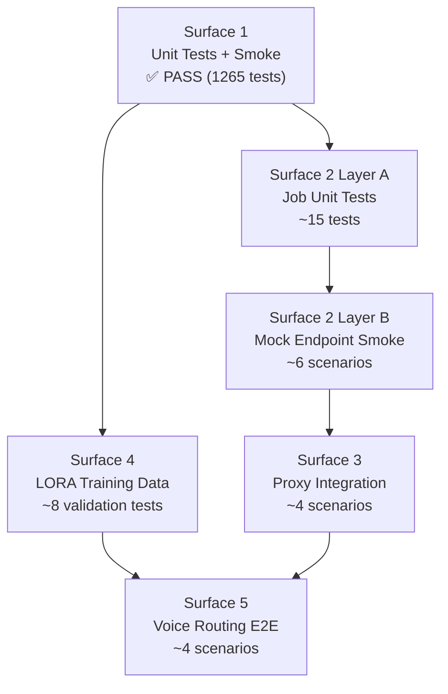

# Surfaces 2-5 Testing Design — SWE Team Agent

**Created**: 2026-02-16
**Status**: Design document (implementation blueprint)
**Parent**: [03-testing-validation.md](03-testing-validation.md)

---

## 1. Overview

The SWE Team uses a 5-Surface Validation scheme. Surface 1 (Unit Tests + Inline Smoke Tests) is **PASS** with 1265 tests across 8 test files plus 46 inline smoke tests across 8 modules. Surfaces 2-5 are **PENDING** and require implementation.

This document is the implementation blueprint for Surfaces 2-5. It describes what tests to build, what files to create, and what acceptance criteria must be met.

### Surface Summary

| Surface | Purpose | Test Type | Status | Est. Tests |
|---------|---------|-----------|--------|------------|
| 1 | Unit Tests + Inline Smoke Tests | `pytest` + `__main__` smoke | **PASS** (1265 unit, 46 smoke) | 1311 |
| 2 | Mock Job Endpoint | Unit + endpoint smoke | PENDING | ~21 |
| 3 | Notification UI Submission Cards | Interactive proxy smoke | PENDING | ~4 |
| 4 | LORA Training Data Generation | Unit + data validation | PENDING | ~8 |
| 5 | Voice Routing (ASR -> LORA -> Queue) | Live pipeline E2E | PENDING | ~4 |

### Dependency Graph



---

## 2. Surface 2: Mock Job Endpoint

**Purpose**: Validate that `SweTeamJob` integrates correctly with CJ Flow queue lifecycle (todo -> running -> done/dead).

### Layer A — Unit Tests

**File**: `src/tests/unit/test_swe_team_job.py`
**Estimated tests**: ~15

These tests validate the job object itself in isolation, without a running server.

#### Test Categories

**Job Construction** (~4 tests):
- `JOB_TYPE == "swe_team"` and `JOB_PREFIX == "swe"`
- `id_hash` starts with `"swe-"` prefix
- Default attributes: `status == "pending"`, `dry_run == False`, `debug == False`
- All constructor parameters stored correctly (`prompt`, `user_id`, `user_email`, `session_id`)

**`last_question_asked` Property** (~2 tests):
- Long prompt (>50 chars) truncated: `"[SWE Team] first fifty characters of the prompt..."`
- Short prompt passes through: `"[SWE Team] fix the login bug"`

**`do_all()` with `dry_run=True`** (~4 tests):
- Returns mock result string (non-empty)
- Sets `status = "completed"` after execution
- Sets `cost_summary` (mock with zero cost)
- Sets `completed_at` timestamp

**`do_all()` Error Handling** (~2 tests):
- Exception during execution -> `status = "failed"`
- Error message stored in `self.error`

**QueueableJob Protocol Compliance** (~2 tests):
- Instance satisfies `isinstance( job, QueueableJob )` runtime check
- All 22 required attributes from `queue_protocol.py` present: `id_hash`, `push_counter`, `user_id`, `session_id`, `routing_command`, `job_type`, `question`, `last_question_asked`, `answer`, `answer_conversational`, `created_date`, `run_date`, `status`, `error`, `result`, `artifacts`, `is_cacheable`, `started_at`, `completed_at`, `user_email`, `debug`, `verbose`

**Factory Registration** (~1 test):
- `create_agentic_job( "agent router go to swe team", args_dict, ... )` returns `SweTeamJob` instance
- Verify correct attribute passthrough from `args_dict`

#### Reference Pattern

Follow `DeepResearchJob` at `src/cosa/agents/deep_research/job.py`:
- Constructor calls `super().__init__()` with `user_id`, `user_email`, `session_id`, `debug`, `verbose`
- `JOB_TYPE` and `JOB_PREFIX` as class-level constants
- `last_question_asked` as `@property` with truncation logic
- `do_all()` bridges to async `_execute()` via `asyncio.run()`
- `_execute_dry_run()` sends breadcrumb notifications and returns mock data

Factory registration at `src/cosa/rest/agentic_job_factory.py` — add new `elif` branch:
```python
elif command == "agent router go to swe team":
    return SweTeamJob(
        prompt     = args_dict.get( "prompt", "" ),
        user_id    = user_id,
        user_email = user_email,
        session_id = session_id,
        dry_run    = args_dict.get( "dry_run", False ),
        debug      = debug,
        verbose    = verbose
    )
```

### Layer B — Mock Endpoint Smoke Test

**File**: `src/tests/smoke/test_swe_team_mock_endpoint.py`
**Estimated scenarios**: ~6

These tests require a running FastAPI server on port 7999 and validate the HTTP submit-and-poll lifecycle.

#### Scenario Matrix

| # | ID | Description | Proxy Needed |
|---|-----|-------------|------|
| 0 | `SWE_DRY_RUN` | POST `/api/swe-team/submit` with `dry_run=True` -> job queued -> runs -> done | No |
| 1 | `SWE_POLL_DONE` | Poll done queue -> verify `job_data` contains `agent_type`, `status`, `result` | No |
| 2 | `SWE_FIELDS` | Verify response fields: `agent_type == "swe_team"`, `status == "completed"` | No |
| 3 | `SWE_MISSING_PROMPT` | Missing required `prompt` field -> 422 error response | No |
| 4 | `SWE_EMPTY_PROMPT` | Empty string `prompt` -> appropriate error or handling | No |
| 5 | `SWE_COST_SUMMARY` | Done queue response includes `cost_summary` with zero cost (dry run) | No |

#### Implementation Notes

- Subclass `LivePipelineTestBase` from `src/tests/smoke/utilities/live_pipeline_base.py`
- Authentication via `LUPIN_TEST_EMAIL` / `LUPIN_TEST_PASSWORD` env vars
- Submit endpoint: `POST /api/swe-team/submit` (new router to create)
- Poll done queue: `GET /api/queue/done` filtered by `job_id`
- Validation: `job_data["agent_type"] == "swe_team"` (emitted by `running_fifo_queue.py` line 365 via `running_job.job_type`)

#### Prerequisites

- SweTeamJob registered in `agentic_job_factory.py`
- New FastAPI router at `src/cosa/rest/routers/swe_team.py`
- Server running on port 7999

---

## 3. Surface 3: Notification UI Submission Cards

**Purpose**: Validate that SWE Team integrates with the notification proxy for interactive argument resolution via the `RuntimeArgumentExpeditor`.

### Q&A Script

**File**: `src/conf/notification-proxy-scripts/swe-team-test.json`

Based on the template at `src/conf/notification-proxy-scripts/_template.json` and the reference at `src/conf/notification-proxy-scripts/proxy-integration-test.json`.

```json
{
    "profile_name"  : "swe_team_test",
    "description"   : "Q&A script for SWE Team expediter questions",
    "sender_ids"    : [ "arg.expeditor@lupin.deepily.ai" ],
    "entries" : [
        {
            "question_pattern" : "What task would you like the SWE Team to work on?",
            "answer"           : "add a health check endpoint to the API",
            "arg_name"         : "prompt",
            "response_types"   : [ "open_ended", "open_ended_batch" ],
            "agents"           : [ "swe_team" ]
        },
        {
            "question_pattern" : "Would you like to proceed with these settings?",
            "answer"           : "yes",
            "arg_name"         : "confirmation",
            "response_types"   : [ "yes_no" ]
        },
        {
            "question_pattern" : "Would you like to enable dry run mode?",
            "answer"           : "yes",
            "arg_name"         : "dry_run",
            "response_types"   : [ "yes_no" ]
        }
    ]
}
```

> **Note**: Exact question patterns will be derived from the `agent_registry` fallback questions configured for the SWE Team agent. The above is a design-time estimate.

### Interactive Test

**File**: `src/tests/smoke/test_swe_team_proxy.py`
**Estimated scenarios**: ~4

Subclass of `InteractiveSmokeTest` from `src/tests/smoke/utilities/interactive_smoke_test.py`.

#### Scenario Matrix

| # | ID | Description | Proxy Needed |
|---|-----|-------------|------|
| 0 | `SWE_HAPPY` | Full voice command with all args -> auto-confirms -> job completes (dry_run) | Yes |
| 1 | `SWE_MISSING_PROMPT` | Partial command (no prompt) -> proxy supplies prompt -> job completes | Yes |
| 2 | `SWE_CANCEL` | User cancels at confirmation -> no job queued | Yes |
| 3 | `SWE_DRY_RUN_BREADCRUMBS` | Explicit dry_run flag -> breadcrumb notifications fire -> mock result returned | Yes |

#### Implementation Notes

- Set `PROXY_PROFILE = "swe_team_test"` to match Q&A script
- Scenarios use `mode = "swe_team"` (explicit mode, not auto-route)
- Validation checks:
  - Happy path: `job_data["agent_type"] == "swe_team"` and `status == "completed"`
  - Cancel: no job appears in done queue within timeout
  - Breadcrumbs: job completes with zero cost

#### Reference Pattern

Follow `test_proxy_integration.py` at `src/tests/smoke/test_proxy_integration.py`:
- 12 scenarios across 3 groups (calculator, crud, expediter)
- `InteractiveSmokeTest` base handles auth, session, proxy lifecycle
- `--auto-proxy` flag starts embedded proxy before scenarios
- Scenarios with `"needs_confirm": True` require proxy running

#### Prerequisites

- Server running on port 7999
- Notification proxy available (manual or `--auto-proxy`)
- `LUPIN_INTERACTIVE_TESTS=true` environment variable
- Surface 2 complete (job.py + factory registration + router)

---

## 4. Surface 4: LORA Training Data Generation

**Purpose**: Ensure the LORA agent router can classify SWE Team voice commands correctly by providing sufficient training data.

### Training Data File

**File**: `src/ephemera/prompts/data/synthetic-data-agent-routing-swe-team.txt`

50-100 synthetic utterances, one per line, using the `FEATURE` placeholder for dynamic task descriptions.

#### Sample Utterances

```
start an swe team task for FEATURE
use the swe team to build FEATURE
run swe team on FEATURE
I need the swe team to implement FEATURE
have the engineering team work on FEATURE
swe team please build FEATURE
kick off an swe team job for FEATURE
can the swe team handle FEATURE
start a software engineering task for FEATURE
use the autonomous team to create FEATURE
launch an swe team project for FEATURE
get the swe team to develop FEATURE
begin an swe team task to build FEATURE
I want the swe team to work on FEATURE
delegate FEATURE to the swe team
assign FEATURE to the engineering team
swe team build FEATURE for me
start swe team on FEATURE
run the engineering team on FEATURE
have swe team implement FEATURE
```

#### Variation Categories

Utterances should cover these speech patterns:
- **Imperative**: "start swe team on FEATURE", "run swe team on FEATURE"
- **Question**: "can the swe team build FEATURE?", "could swe team handle FEATURE?"
- **Polite request**: "please have the swe team work on FEATURE", "I'd like the swe team to build FEATURE"
- **Abbreviated**: "swe team FEATURE", "swe build FEATURE"
- **Synonyms**: "engineering team", "autonomous team", "software team", "dev team"

#### Key Design Constraints

- All lines must contain "swe" or "engineering team" or "software team" or "dev team" (case-insensitive) to prevent misclassification overlap
- `FEATURE` placeholder in at least 80% of lines
- No overlap with existing training files (especially `deep_research`, `claude_code`, `podcast_generator`)
- No lines exceed 200 characters

### Router Config Entry

**File**: `src/conf/training/agent-router-agentic-commands.json`

Add entry:
```json
"agent router go to swe team": "/src/ephemera/prompts/data/synthetic-data-agent-routing-swe-team.txt"
```

Current entries in this file:
- `"agent router go to deep research"` -> deep-research.txt (66 lines)
- `"agent router go to podcast generator"` -> podcast-generator.txt
- `"agent router go to research to podcast"` -> research-to-podcast.txt
- `"agent router go to claude code"` -> claude-code.txt

### Validation Tests

**File**: `src/tests/unit/test_swe_team_training_data.py`
**Estimated tests**: ~8

| # | Test | Assertion |
|---|------|-----------|
| 1 | File exists | `synthetic-data-agent-routing-swe-team.txt` exists and is non-empty |
| 2 | Minimum count | At least 50 utterances (lines) |
| 3 | No duplicates | No duplicate lines in file |
| 4 | Agent keyword | All lines contain "swe" OR "engineering team" OR "software team" OR "dev team" (case-insensitive) |
| 5 | Placeholder coverage | `FEATURE` placeholder appears in >= 80% of lines |
| 6 | Line length | No lines exceed 200 characters |
| 7 | Router config | `agent-router-agentic-commands.json` contains `"agent router go to swe team"` pointing to valid file |
| 8 | No overlap | No lines overlap with other `synthetic-data-agent-routing-*.txt` files (prevents misclassification) |

#### Reference Pattern

Existing training data at `src/ephemera/prompts/data/synthetic-data-agent-routing-deep-research.txt`:
- 66 lines, one utterance per line
- Uses `RESEARCH_TOPIC` placeholder
- All lines contain "research" or "deep" keywords

---

## 5. Surface 5: Voice Routing (ASR -> LORA -> Queue)

**Purpose**: Validate end-to-end voice routing — a spoken command reaches the SWE Team agent via LORA classification without explicit mode setting.

### Live Pipeline Test

**File**: `src/tests/smoke/test_swe_team_live_pipeline.py`
**Estimated scenarios**: ~4

Subclass of `InteractiveSmokeTest` with `--auto-route` flag support.

#### Scenario Matrix

| # | ID | Description | Auto-Route | Proxy |
|---|-----|-------------|-----------|-------|
| 0 | `SWE_ROUTE_HAPPY` | Voice command (no explicit mode) -> LORA classifies as `swe_team` -> job queued -> validate `agent_type` | Yes | Yes |
| 1 | `SWE_ROUTE_DRY` | Same but with `dry_run=True` -> breadcrumbs fire -> mock result | Yes | Yes |
| 2 | `SWE_ROUTE_CONFIDENCE` | Ambiguous command -> verify classification confidence logged | Yes | Yes |
| 3 | `SWE_EXPLICIT_FALLBACK` | `--no-auto-route` -> explicit mode set -> bypasses LORA | No | Yes |

#### Key Validation

The critical assertion for auto-route scenarios:

```python
assert job_data[ "agent_type" ] == "swe_team"
```

This `agent_type` field is emitted by `running_fifo_queue.py` (lines 220, 284, 365, 425, 480, 609, 690, 842) from `running_job.job_type`, which returns the `JOB_TYPE` class constant.

#### Implementation Notes

- Follow `test_calculator_live_pipeline.py` at `src/tests/smoke/test_calculator_live_pipeline.py`:
  - Subclass `LivePipelineTestBase` (or `InteractiveSmokeTest` if proxy needed)
  - `--auto-route` flag: no explicit mode -> LORA router classifies query
  - Default (no flag): explicit `mode = "swe_team"` bypasses LORA
- Submit via `POST /api/push` (standard voice pipeline) not `/api/swe-team/submit`
- Voice command examples: "start an swe team task for adding a health check endpoint"

#### Prerequisites

- **ALL** previous surfaces must pass
- LORA model trained with SWE Team training data (Surface 4)
- Server running with Phi-4 LLM for intent extraction
- Notification proxy for interactive arg resolution (Surface 3)

---

## 6. Implementation Sequence

The recommended build order optimizes for parallelism and dependency satisfaction:

```mermaid
gantt
    title Surfaces 2-5 Implementation Sequence
    dateFormat X
    axisFormat %s

    section Phase A (Standalone)
    Surface 4: LORA training data file      :s4a, 0, 1
    Surface 4: Router config entry           :s4b, 0, 1
    Surface 4: Validation unit tests         :s4c, after s4a, 1

    section Phase B (Job Foundation)
    Surface 2A: SweTeamJob class             :s2a, 0, 2
    Surface 2A: Factory registration         :s2b, after s2a, 1
    Surface 2A: Job unit tests               :s2c, after s2a, 2

    section Phase C (Server Integration)
    Surface 2B: FastAPI router               :s2d, after s2b, 1
    Surface 2B: Mock endpoint smoke tests    :s2e, after s2d, 2

    section Phase D (Proxy Integration)
    Surface 3: Q&A script                    :s3a, after s2e, 1
    Surface 3: Proxy smoke tests             :s3b, after s3a, 2

    section Phase E (Voice E2E)
    Surface 5: LORA model training           :s5a, after s4c, 1
    Surface 5: Live pipeline tests           :s5b, after s3b, 2
```



### Step-by-Step

1. **Surface 4 — LORA Training Data** (standalone, no code dependencies)
   - Create `synthetic-data-agent-routing-swe-team.txt` (50-100 utterances)
   - Add entry to `agent-router-agentic-commands.json`
   - Write and run `test_swe_team_training_data.py` (8 validation tests)

2. **Surface 2 Layer A — Job Unit Tests** (requires `job.py` to exist)
   - Implement `SweTeamJob` in `src/cosa/agents/swe_team/job.py`
   - Register in `agentic_job_factory.py`
   - Write and run `test_swe_team_job.py` (~15 unit tests)

3. **Surface 2 Layer B — Mock Endpoint** (requires server + factory registration)
   - Create FastAPI router at `src/cosa/rest/routers/swe_team.py`
   - Write and run `test_swe_team_mock_endpoint.py` (~6 smoke scenarios)

4. **Surface 3 — Proxy Integration** (requires Surface 2 complete)
   - Create Q&A script `swe-team-test.json`
   - Write and run `test_swe_team_proxy.py` (~4 interactive scenarios)

5. **Surface 5 — Voice E2E** (requires all above + LORA training)
   - Train LORA model with new SWE Team data
   - Write and run `test_swe_team_live_pipeline.py` (~4 pipeline scenarios)

---

## 7. Acceptance Criteria

| Surface | Criteria | Verification |
|---------|----------|-------------|
| 2A | All ~15 unit tests pass | `pytest src/tests/unit/test_swe_team_job.py -v` |
| 2A | Full regression passes | `pytest src/tests/unit/ -v` (no regressions) |
| 2A | Factory creates SweTeamJob | `create_agentic_job("agent router go to swe team", ...)` returns correct type |
| 2B | POST + poll lifecycle works | `python src/tests/smoke/test_swe_team_mock_endpoint.py` — all 6 scenarios pass |
| 2B | `agent_type == "swe_team"` in done queue | Verified via poll response `job_data` |
| 3 | Proxy auto-responds to all questions | `python src/tests/smoke/test_swe_team_proxy.py --auto-proxy` — all 4 scenarios pass |
| 3 | Cancel flow prevents job creation | No job in done queue after cancel |
| 4 | Training file has >= 50 utterances | `test_swe_team_training_data.py` test 2 |
| 4 | No overlap with other agent files | `test_swe_team_training_data.py` test 8 |
| 4 | Router config entry exists | `test_swe_team_training_data.py` test 7 |
| 5 | LORA classifies "start swe team task" correctly | `job_data["agent_type"] == "swe_team"` in auto-route mode |
| 5 | Explicit mode bypass works | `--no-auto-route` scenario passes |
| **ALL** | All 5 surfaces pass | Update `03-testing-validation.md` status column |

---

## 8. File Inventory

### Files to Create

| File | Surface | Type |
|------|---------|------|
| `src/tests/unit/test_swe_team_job.py` | 2A | Unit tests |
| `src/tests/smoke/test_swe_team_mock_endpoint.py` | 2B | Smoke test |
| `src/conf/notification-proxy-scripts/swe-team-test.json` | 3 | Q&A script |
| `src/tests/smoke/test_swe_team_proxy.py` | 3 | Smoke test |
| `src/ephemera/prompts/data/synthetic-data-agent-routing-swe-team.txt` | 4 | Training data |
| `src/tests/unit/test_swe_team_training_data.py` | 4 | Unit tests |
| `src/tests/smoke/test_swe_team_live_pipeline.py` | 5 | Smoke test |

### Files to Modify

| File | Surface | Change |
|------|---------|--------|
| `src/cosa/rest/agentic_job_factory.py` | 2A | Add `"agent router go to swe team"` branch |
| `src/conf/training/agent-router-agentic-commands.json` | 4 | Add SWE Team entry |
| `03-testing-validation.md` | ALL | Update surface status as each passes |

### Reference Files (Read-Only)

| File | Used By |
|------|---------|
| `src/cosa/agents/deep_research/job.py` | Surface 2A — job pattern reference |
| `src/cosa/agents/podcast_generator/job.py` | Surface 2A — second job reference |
| `src/cosa/agents/agentic_job_base.py` | Surface 2A — base class |
| `src/cosa/rest/queue_protocol.py` | Surface 2A — QueueableJob protocol |
| `src/cosa/rest/routers/mock_job.py` | Surface 2B — endpoint pattern reference |
| `src/cosa/rest/running_fifo_queue.py` | Surface 2B, 5 — `agent_type` emission |
| `src/tests/smoke/test_proxy_integration.py` | Surface 3 — proxy test pattern |
| `src/tests/smoke/utilities/interactive_smoke_test.py` | Surface 3, 5 — base class |
| `src/tests/smoke/utilities/live_pipeline_base.py` | Surface 2B, 5 — pipeline base |
| `src/tests/smoke/utilities/embedded_proxy.py` | Surface 3 — proxy lifecycle |
| `src/conf/notification-proxy-scripts/_template.json` | Surface 3 — Q&A template |
| `src/conf/notification-proxy-scripts/proxy-integration-test.json` | Surface 3 — Q&A reference |
| `src/ephemera/prompts/data/synthetic-data-agent-routing-deep-research.txt` | Surface 4 — training data reference (66 lines) |
| `src/tests/smoke/test_calculator_live_pipeline.py` | Surface 5 — auto-route pattern |
