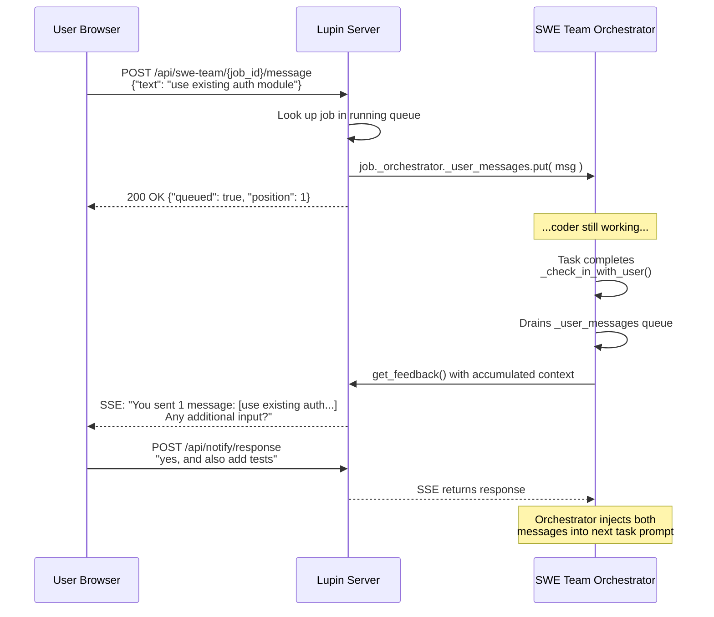

# User-Initiated Communication with Running SWE Team

**Date**: 2026-02-18
**Status**: ACTIVE (Approach B MVP implementing, Approach D planned)
**Parent**: [00-index.md](00-index.md)

## Problem Statement

All SWE Team communication today is **orchestrator-initiated**: the orchestrator sends notifications (fire-and-forget) or asks specific questions (blocking SSE). The user can only "talk back" when explicitly prompted. There is no mechanism for the user to inject unprompted comments, course corrections, or questions into a running job.

**Example scenario**: User submits a 5-task SWE Team job. After task 2 completes, they realize "wait, use the existing auth module, don't write a new one." Currently, there's no way to inject this guidance — they must wait for the orchestrator to ask a question, or stop the entire job.

## Architecture Analysis: What Exists Today

### Communication Primitives Already Built

| Primitive | File | Status |
|-----------|------|--------|
| `get_feedback( prompt, role, timeout )` | `cosa_interface.py:302` | Fully implemented, NEVER called by SWE Team |
| `is_approval( feedback )` / `is_rejection( feedback )` | `cosa_interface.py:351-416` | Ready |
| `OrchestratorState.WAITING_FEEDBACK` | `state.py:35` | Defined, never entered |
| `_stop_requested` flag + 5 check-points | `orchestrator.py:112,359,464,881,1006,1155` | Working |
| Deep Research uses `get_feedback()` at 2 points | `deep_research/orchestrator.py:154,255` | Proven reference pattern |

### What Does NOT Exist

- No inbound message queue on the orchestrator
- No REST endpoint to send messages to a running job
- No WebSocket inbound event targeting running jobs
- No way for the user to initiate contact — only respond to questions

## Approaches Evaluated

### Approach A: WebSocket Inbound Channel

**Description**: Add a WebSocket event type `user_message_to_job` that routes to the orchestrator via event subscription.

**Pros**: Real-time, bidirectional, leverages existing WebSocket infrastructure.

**Cons**: Requires new event type registration, subscription management, WebSocket-to-orchestrator bridge, and the orchestrator doesn't have a natural "receive" loop — it's a push-based executor. Would need a polling/interrupt mechanism anyway.

**Complexity**: ~100-150 lines across 4-5 files. Medium infrastructure change.

**Verdict**: Over-engineered for MVP. The orchestrator has no event loop to receive WebSocket events — it runs sequentially through tasks.

### Approach B: Periodic Check-In (RECOMMENDED MVP)

**Description**: At natural pause points in the execution loop, the orchestrator calls `get_feedback()` with a short timeout. The user sees an action-required notification.

**How it works**:
- After each task completes, before starting the next: "Task 2/5 complete. Any input before I continue?"
- **User responds with feedback** -> orchestrator incorporates it into the next task's context
- **User says "looks good" / "continue"** -> `is_approval()` returns True, orchestrator continues
- **User does nothing (timeout)** -> `get_feedback()` returns None, orchestrator continues silently

**Pros**: Zero new infrastructure. Uses `get_feedback()` which is already fully implemented, already uses `asyncio.to_thread()` for the sync-to-async bridge, and is already proven in Deep Research.

**Cons**: User can only speak at orchestrator-defined pause points (between tasks). No mid-task injection.

**Complexity**: ~43 lines across 2 files.

**Verdict**: Ship this first. It's the foundation for Approach D.

### Approach C: Interrupt Flag + Message Slot

**Description**: Add a thread-safe message slot (`threading.Event` + shared string) that the orchestrator polls during SDK streaming.

**Pros**: Lower latency than check-ins — user message delivered within one SDK stream iteration.

**Cons**: Polling overhead in the hot path. Complex interruption semantics — what happens if the coder is mid-edit when user says "stop"? Requires careful thread coordination.

**Complexity**: ~60-80 lines. Risk of subtle concurrency bugs.

**Verdict**: Too much risk for the payoff. The coder-tester loop already has natural pause points where check-ins work better.

### Approach D: Hybrid Queue + Check-In (FUTURE)

**Description**: Combines Approach B's check-in infrastructure with an inbound message queue. Users can submit messages anytime via REST endpoint; messages accumulate in a `threading.Queue` and drain at check-in points.

**Pros**: Best of both worlds — predictable rhythm + async message submission. Natural extension of Approach B.

**Cons**: Requires REST endpoint, job-to-orchestrator reference, UI input field. More infrastructure.

**Complexity**: ~50-60 additional lines on top of Approach B.

**Verdict**: Ship after Approach B is proven. B is the foundation.

## Approach B: Implementation Detail

### New Helper Method

```python
async def _check_in_with_user( self, team_io, prompt, timeout=None ):
    """Pause for user input at a natural break point."""
    if not self.config.enable_checkins:
        return None

    prev_state = self.current_state
    self.current_state = OrchestratorState.WAITING_FEEDBACK
    await self._emit_state( prev_state, self.current_state )

    resolved_timeout = timeout or self.config.checkin_timeout

    feedback = await team_io.get_feedback(
        prompt  = prompt,
        role    = "lead",
        timeout = resolved_timeout,
    )

    self.current_state = OrchestratorState.DELEGATING
    await self._emit_state( OrchestratorState.WAITING_FEEDBACK, self.current_state )

    if feedback and not team_io.is_approval( feedback ):
        return feedback  # Substantive input

    return None  # Approval, dismissal, or timeout
```

### Injection Points in `_execute_live()`

**Point 1**: Between tasks (after task completion/verification, before next task)

```python
if i < len( task_specs ) - 1:  # Not the last task
    feedback = await self._check_in_with_user(
        team_io,
        prompt = f"Task {i + 1}/{len( task_specs )} done: {spec.title}. Any input before the next task?",
    )
    if feedback:
        progress_log.log( f"User feedback received: {feedback[ :200 ]}", role="user" )
```

**Point 2**: After all tasks complete, before final summary

```python
feedback = await self._check_in_with_user(
    team_io,
    prompt = f"All {len( task_specs )} tasks complete ({success_count} successful). Any final input?",
    timeout = 60,
)
```

### How User Feedback Gets Into SDK Context

When `_check_in_with_user()` returns substantive feedback, the orchestrator stores it in `self.state` and prepends it to the next delegation prompt:

```python
# In the delegation loop, before _delegate_task():
user_context = ""
if self.state.get( "user_feedback" ):
    user_context = f"\n\nUSER FEEDBACK:\n{self.state[ 'user_feedback' ]}\nIncorporate this."
    self.state[ "user_feedback" ] = None  # Clear after use
```

### Config Additions

```python
# === User Check-In ===
enable_checkins : bool = True   # Pause between tasks for user input
checkin_timeout : int  = 30     # Seconds before auto-continue
```

### Files Modified

| File | Change | Lines |
|------|--------|-------|
| `src/cosa/agents/swe_team/orchestrator.py` | Add `_check_in_with_user()` + 2 call sites + feedback injection | ~40 lines |
| `src/cosa/agents/swe_team/config.py` | Add `enable_checkins` and `checkin_timeout` | ~3 lines |

## Approach D: Expansion Design (Future Session)

### The Problem Check-Ins Don't Solve

Approach B creates a **predictable** but **inflexible** rhythm. The user can only speak at orchestrator-defined pause points. If the user realizes mid-coder-execution "wait, use the existing auth module, don't write a new one" — they have to wait until the current task finishes and the next check-in fires. By then the coder may have already written 200 lines of unnecessary code.

Approach D solves this by decoupling **message submission** (anytime) from **message consumption** (at check-in points).

### Architecture



### Components to Build (Future Session)

**1. `threading.Queue` on orchestrator** (~5 lines in `__init__`)

```python
import queue
self._user_messages = queue.Queue()
```

**2. Job-to-orchestrator reference** (~2 lines in `job.py:_execute()`)

```python
self._orchestrator = orchestrator
```

**3. REST endpoint** (~30 lines, new route in `src/cosa/rest/routers/swe_team.py`)

```python
@router.post( "/swe-team/{job_id}/message" )
async def send_message_to_job( job_id: str, body: UserMessageBody ):
    job = running_queue.get_by_id_hash( job_id )
    if not job or not hasattr( job, '_orchestrator' ):
        raise HTTPException( 404, "Job not found or not yet executing" )

    job._orchestrator._user_messages.put( {
        "text"      : body.text,
        "timestamp" : datetime.utcnow().isoformat(),
    } )

    return { "queued": True, "position": job._orchestrator._user_messages.qsize() }
```

**4. Message drain in `_check_in_with_user()`** (~15 lines, modify existing method)

```python
# Drain accumulated user messages
accumulated = []
while not self._user_messages.empty():
    try:
        accumulated.append( self._user_messages.get_nowait() )
    except queue.Empty:
        break

# Enrich prompt with accumulated messages
if accumulated:
    msg_text = "\n".join( f"  - [{m['timestamp']}] {m['text']}" for m in accumulated )
    prompt = (
        f"You have {len( accumulated )} message(s) from the user:\n{msg_text}\n\n"
        f"{prompt}"
    )
```

**5. UI: Message input in job card** (future — `notifications.html` / `notifications.js`)

A text input field in the SWE Team job card that POSTs to the new endpoint.

### Thread Safety Analysis

- `threading.Queue` is inherently thread-safe (internal mutex + condition variable)
- Web request thread (FastAPI uvicorn) calls `.put()` — safe
- Consumer thread (orchestrator's asyncio loop) calls `.get_nowait()` — safe
- No additional locking needed
- The `_orchestrator` reference is set once in `_execute()` before `orchestrator.run()` and read from the web thread — safe (single-writer, immutable after write)

### Dependency on Approach B

Approach D requires Approach B's check-in infrastructure as its foundation:
- `_check_in_with_user()` method -> message drain point
- `enable_checkins` / `checkin_timeout` config -> controls behavior
- State machine transitions -> `WAITING_FEEDBACK` state

This is why B must ship first.

## Verification Plan

1. Run existing SWE Team unit tests: `pytest src/tests/unit/ -k swe -v`
2. Dry-run test: Submit a SWE Team job with `dry_run=True` and verify check-in notifications appear at the expected pause points
3. Test timeout behavior: Let a check-in expire without responding — orchestrator should continue silently
4. Test feedback injection: Respond to a between-task check-in with "please also add docstrings" — verify the next delegation prompt includes it
5. Test `enable_checkins=False`: Verify no check-in notifications are sent

## References

- **Deep Research `get_feedback()` usage**: `src/cosa/agents/deep_research/orchestrator.py:154,255`
- **SWE Team cosa_interface**: `src/cosa/agents/swe_team/cosa_interface.py`
- **SWE Team orchestrator**: `src/cosa/agents/swe_team/orchestrator.py`
- **SWE Team config**: `src/cosa/agents/swe_team/config.py`
- **SWE Team state machine**: `src/cosa/agents/swe_team/state.py`
