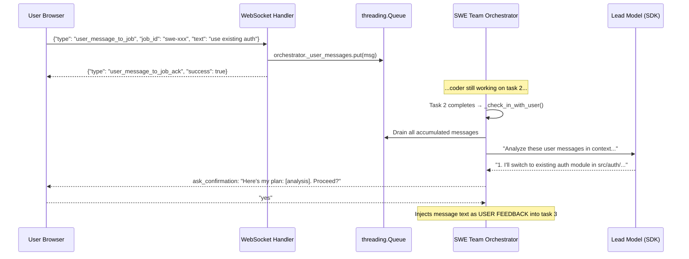

# Approach D: Hybrid Queue + Check-In for User-Initiated Communication

**Date**: 2026-02-18
**Session**: 223
**Status**: PLANNED (implementation next session)
**Plan file**: `~/.claude/plans/agile-kindling-tide.md`
**Design doc**: `src/rnd/2026.02.13-claude-code-agentic-dev-team/05-user-initiated-communication.md`

## Context

All SWE Team communication today is orchestrator-initiated. The user can only "talk back" when explicitly prompted at check-in points. If the user realizes mid-task "wait, use the existing auth module" they must wait for the current task to finish and the next check-in to fire. Approach D solves this by decoupling **message submission** (anytime) from **message consumption** (at check-in points).

Approach B (periodic check-ins) is already fully implemented and serves as the foundation. Approach D adds:
1. A `threading.Queue` on the orchestrator for inbound messages
2. A WebSocket inbound event (`user_message_to_job`) for fire-and-forget message delivery
3. LLM-powered drain logic: the lead model analyzes accumulated messages, proposes actions, and asks for yes/no confirmation before continuing

## Key Design Decisions

**Why WebSocket (not REST)**: The notification system communicates via WebSocket fire-and-forget events. User-to-job messages are the inbound counterpart — same transport, same session authentication, no new HTTP endpoint needed.

**Why LLM analysis (not template)**: The orchestrator should demonstrate it understood the user's messages by proposing concrete actions, not just acknowledging receipt. This uses the lead model to analyze messages in context and present an action plan for confirmation.

## Files to Modify

| File | Change | Lines |
|------|--------|-------|
| `src/cosa/agents/swe_team/orchestrator.py` | Add `import queue`, `_user_messages` in `__init__`, `_analyze_user_messages()` helper, modified `_check_in_with_user()` | ~60 |
| `src/cosa/agents/swe_team/job.py` | Add `self._orchestrator = None` in `__init__`, set reference in `_execute()` | ~3 |
| `src/cosa/rest/routers/websocket.py` | Add `user_message_to_job` elif handler + helper function | ~35 |
| `src/tests/unit/test_swe_team_orchestrator.py` | Add `TestUserMessageQueue` test class | ~60 |
| `src/tests/unit/test_swe_team_job.py` | Add `_orchestrator` attribute test | ~8 |

## Check-In Flow (with accumulated messages)

## Thread Safety

| Thread | Operation | Safety |
|--------|-----------|--------|
| WebSocket coroutine (uvicorn event loop) | `.put( msg )` on `_user_messages` | `threading.Queue` internal mutex |
| Orchestrator thread (consumer via `asyncio.run`) | `.get_nowait()` on `_user_messages` | `threading.Queue` internal mutex |
| WebSocket coroutine | Read `job._orchestrator` | Python GIL + single-write-before-use |

No additional locking needed.

## Verification Plan

1. `pytest src/tests/unit/ -k swe -v` — all existing SWE Team tests pass
2. `pytest src/tests/unit/test_swe_team_orchestrator.py -k "UserMessageQueue" -v` — new queue tests
3. `pytest src/tests/unit/test_swe_team_job.py -k "OrchestratorReference" -v` — new job tests
4. Smoke tests: `python -m cosa.agents.swe_team.orchestrator` and `python -m cosa.agents.swe_team.job`
5. Manual end-to-end: Submit SWE Team job → send WebSocket message → verify ack → verify lead's analysis at check-in → approve → verify feedback injected into next task
