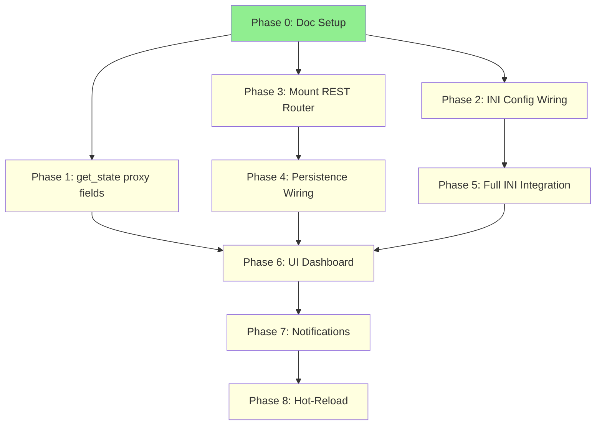

# Decision Proxy Light-Up — Index

## Quick Links

| # | Document | Purpose |
|---|----------|---------|
| — | [Original Architecture](2026.02.14-decision-proxy-architecture-original.md) | 4-layer architecture plan (Phases 4a-4e) — preserved as-is |
| 0 | [This File](00-index.md) | Navigation hub |
| 1 | [Implementation Plan](01-implementation-current.md) | Active phase/step tracker |
| 2 | [Disconnected Surfaces Audit](02-disconnected-surfaces-audit.md) | Built-but-unwired surfaces analysis |
| 3 | [Config Wiring Reference](03-config-wiring-reference.md) | 18 INI keys → runtime objects mapping |
| 4 | [UI Design](04-ui-design-ratification-dashboard.md) | Ratification page + trust dashboard wireframes |
| 5 | [Notification Integration](05-notification-integration.md) | Proxy events via existing POST /api/notify |
| 6 | [Testing & Validation](06-testing-validation.md) | Test results, coverage, regression baselines |

## Phase Overview

| Phase | Description | Status | Sessions |
|-------|-------------|--------|----------|
| 0 | File Restructuring + Doc Setup | IN PROGRESS | ~0.25 |
| 1 | Orchestrator `get_state()` — Proxy Fields | PENDING | ~0.25 |
| 2 | INI Config Wiring | PENDING | ~1 |
| 3 | Mount REST Router | PENDING | ~0.25 |
| 4 | Persistence Wiring — Fill the TODO | PENDING | ~1-2 |
| 5 | Full INI Integration for Proxy Construction | PENDING | ~1 |
| 6 | UI — Ratification Page + Trust Dashboard | PENDING | ~2-3 |
| 7 | Real-Time Proxy Notifications | PENDING | ~0.5-1 |
| 8 | Hot-Reload of Trust Mode (optional) | PENDING | ~1-2 |

**MVP Checkpoint**: After Phase 4 — API returns real data, `get_state()` exposes proxy.
**UI Checkpoint**: After Phase 6 — Users can see and ratify decisions in browser.

## Dependency Graph

## Key References

| Resource | Path |
|----------|------|
| Decision Proxy Code | `src/cosa/agents/decision_proxy/` (13 files) |
| SWE Proxy Code | `src/cosa/agents/swe_team/proxy/` (5 files) |
| REST Router | `src/cosa/rest/routers/decision_proxy.py` |
| DB Schema | `src/scripts/sql/2026.02.14-decision-proxy-schema.sql` |
| INI Config | `src/conf/lupin-app.ini` (lines ~624-659) |
| Orchestrator | `src/cosa/agents/swe_team/orchestrator.py` |
| Responder | `src/cosa/agents/decision_proxy/responder.py` |
| Notification API | `src/docs/notification-api.md` |
