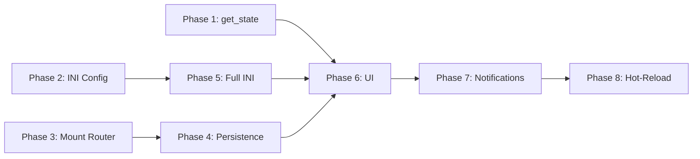

# Decision Proxy — Disconnected Surfaces Audit

**Audit Date**: 2026-02-20 (Session 241)
**Auditor**: Claude Code + Manual investigation

## What Works Today

| Surface | Evidence |
|---------|----------|
| Shadow mode active by default | `config.py` trust_mode = "shadow" |
| Classification layer (6 categories) | `EngineeringStrategy.classify()` + keyword classifier |
| TrustTracker math (decay, rolling window, L1-L5) | 7 unit tests in TestTrustFeedbackLoop |
| CircuitBreaker (error rate, auto-demotion) | Unit tests passing |
| Trust feedback recording | `_gated_confirmation()` records agreement/disagreement |

## Built But Disconnected

| Surface | Status | Problem | Fix Phase |
|---------|--------|---------|-----------|
| 4 REST endpoints (`/api/proxy/*`) | Router never mounted in `main.py` | `include_router()` never called | Phase 3 |
| `TrustTracker.get_stats()` / `get_all_levels()` | No callers | Returns data but nothing exposes it | Phase 1 |
| `CircuitBreaker.get_status()` | No callers | Returns state but nothing reads it | Phase 1 |
| 18 INI config keys | Not wired to runtime | Constructors use hardcoded defaults | Phase 2 + 5 |
| PostgreSQL schema (`proxy_decisions`, `trust_states`) | DDL written, not used | TrustTracker is in-memory only | Phase 4 |
| `TrustStateRepository` + `ProxyDecisionRepository` | Only called from unmounted router | Repo classes complete but unreachable | Phase 3 + 4 |

## Missing Entirely

| Surface | What's Needed | Fix Phase |
|---------|---------------|-----------|
| UI — dashboard | Trust level cards, success rates, CB status | Phase 6 |
| UI — ratification page | Pending decisions table, approve/reject | Phase 6 |
| `get_state()` proxy data | Zero proxy fields in orchestrator state | Phase 1 |
| Persistence | Trust data dies when job ends | Phase 4 |
| Real-time notifications | Proxy decisions not broadcast to browser | Phase 7 |
| Hot-reload | Can't change trust mode mid-session | Phase 8 |

## Dependency Chain

## Resolution Priority

1. **Phase 1** (get_state) — Zero risk, pure addition, unlocks external monitoring
2. **Phase 2** (INI Config) — Prerequisite for Phase 5, enables runtime configuration
3. **Phase 3** (Mount Router) — 2-line change, prerequisite for Phase 4
4. **Phase 4** (Persistence) — Critical functional gap, enables data survival
5. **Phase 5** (Full INI) — Closes config-to-behavior gap
6. **Phase 6** (UI) — Makes everything visible to users
7. **Phase 7** (Notifications) — Real-time observability
8. **Phase 8** (Hot-Reload) — Live control, optional
