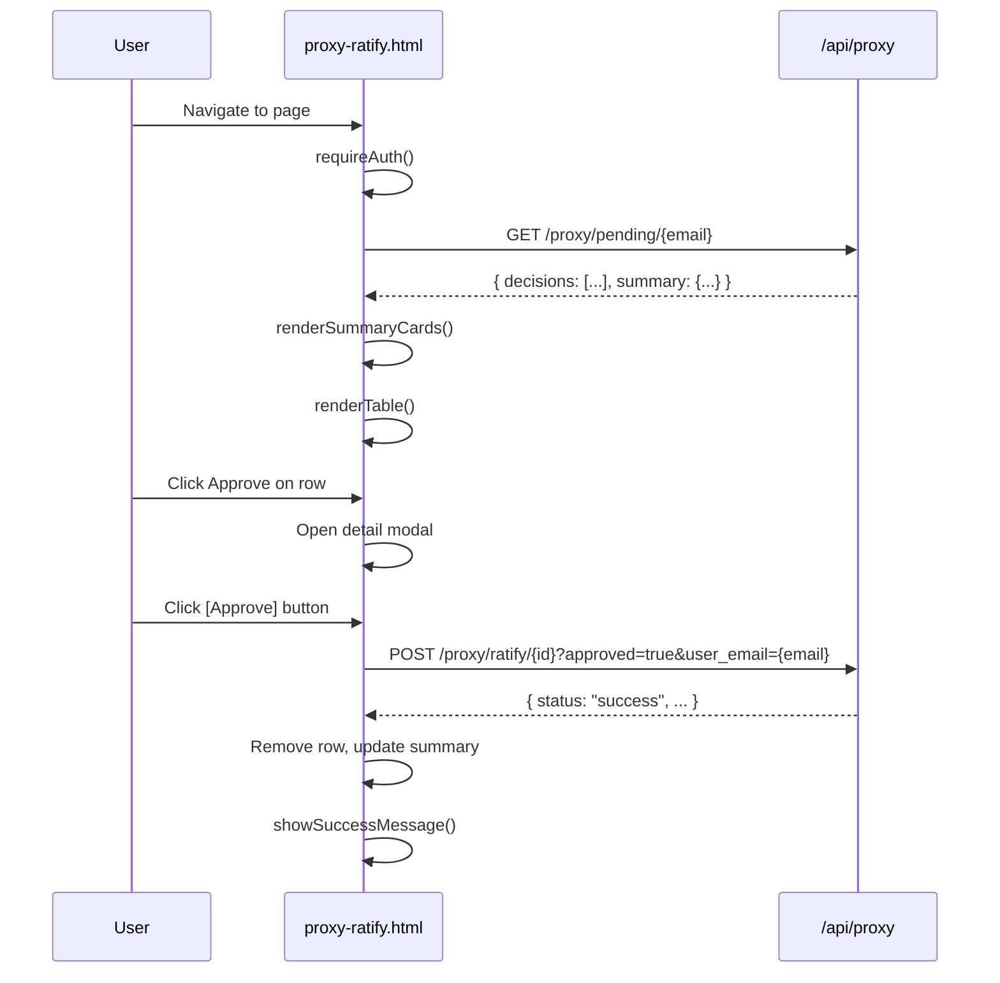
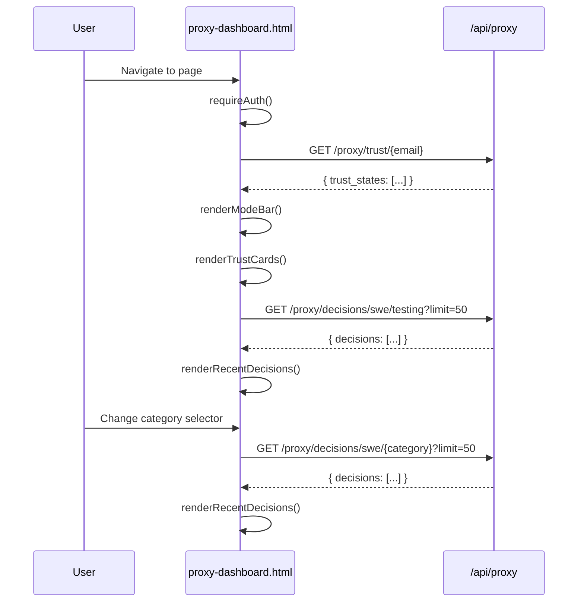

# Decision Proxy — UI Design: Ratification Page + Trust Dashboard

## Overview

Two new admin pages provide visibility into the decision proxy system:

1. **Ratification Page** (`proxy-ratify.html`) — Pending decisions queue for human review
2. **Trust Dashboard** (`proxy-dashboard.html`) — Per-category trust levels, success rates, CB status

Both pages are admin-only, follow existing Lupin admin patterns, and use the 4 REST
endpoints mounted at `/api/proxy/*` (Phase 3).

---

## 1. Design Pattern — Follow `users.html`

All new admin pages MUST follow the established pattern from
`src/fastapi_app/static/html/auth/admin/users.html`:

### File Organization

```
src/fastapi_app/static/html/auth/admin/
├── users.html                    (existing — User Management)
├── proxy-ratify.html             (NEW — Pending Ratification)
├── proxy-dashboard.html          (NEW — Trust Dashboard)
├── css/
│   ├── admin.css                 (existing — shared admin styles)
│   ├── proxy-ratify.css          (NEW — ratification-specific)
│   └── proxy-dashboard.css       (NEW — dashboard-specific)
└── js/
    ├── admin-users.js            (existing)
    ├── proxy-ratify.js           (NEW — ratification logic)
    └── proxy-dashboard.js        (NEW — dashboard logic)
```

### HTML Boilerplate

Every admin page uses this structure:

```html
<!DOCTYPE html>
<html lang="en">
<head>
    <meta charset="UTF-8">
    <meta name="viewport" content="width=device-width, initial-scale=1.0">
    <title>Page Title — Lupin Admin</title>
    <!-- Base auth styles -->
    <link rel="stylesheet" href="../css/auth.css">
    <!-- Shared admin styles -->
    <link rel="stylesheet" href="css/admin.css">
    <!-- Page-specific styles -->
    <link rel="stylesheet" href="css/proxy-ratify.css">
</head>
<body>
    <div class="admin-container">
        <!-- Breadcrumb -->
        <div class="breadcrumb">
            <a href="/static/html/notifications.html">Home</a>
            <span class="separator">></span>
            <a href="/static/html/admin/dashboard.html">Admin</a>
            <span class="separator">></span>
            <span class="current">Page Title</span>
        </div>

        <!-- Header -->
        <div class="admin-header">
            <h1>Icon + Page Title</h1>
            <div class="admin-actions">
                <button class="btn btn-secondary btn-small"
                        onclick="window.location.href='/static/html/admin/dashboard.html'">
                    ← Back to Admin
                </button>
            </div>
        </div>

        <!-- Messages -->
        <div class="error-message" id="error-message"></div>
        <div class="success-message" id="success-message"></div>

        <!-- Loading State -->
        <div class="loading" id="loading">
            <div class="spinner"></div>
            <p class="mt-2">Loading...</p>
        </div>

        <!-- Main Content -->
        <div id="main-content" style="display: none;">
            <!-- Page-specific content here -->
        </div>
    </div>

    <!-- Shared auth utilities (provides apiCall, getAccessToken, requireAuth) -->
    <script src="../js/auth.js"></script>
    <!-- Page-specific logic -->
    <script src="js/proxy-ratify.js"></script>
</body>
</html>
```

### Authentication Pattern

```javascript
// On page load — redirect to login if no token
requireAuth();

// All API calls use apiCall() from auth.js
// Includes JWT Authorization header automatically
// Auto-refreshes token on 401 with retry
const response = await apiCall( "/proxy/pending/user@example.com", "GET" );
```

### CSS Class Reference (Existing — Reuse)

| Class | Purpose | Source |
|-------|---------|--------|
| `.admin-container` | Max-width 1400px centered layout | `admin.css` |
| `.admin-header` | Gradient header bar (#667eea -> #764ba2) | `admin.css` |
| `.btn`, `.btn-primary`, `.btn-secondary`, `.btn-danger` | Button styles | `auth.css` |
| `.btn-small` | Compact button (8px 16px padding) | `auth.css` |
| `.badge` | Inline label | `admin.css` |
| `.badge-active` | Green badge (#48bb78) | `admin.css` |
| `.badge-inactive` | Red badge (#f56565) | `admin.css` |
| `.filter-bar` | Flex row with search/filter controls | `admin.css` |
| `.loading`, `.spinner` | Centered spinner animation | `auth.css` |
| `.error-message`, `.success-message` | Alert banners | `auth.css` |
| `.modal`, `.modal-content` | Overlay dialog | `admin.css` |
| `.hidden` | `display: none !important` | `auth.css` |

---

## 2. Data Sources — API Endpoints

### 2.1 GET `/api/proxy/pending/{user_email}`

**Used by**: Ratification Page

**Parameters**:
- `user_email` (path) — User's email address
- `domain` (query, optional) — Filter by domain
- `category` (query, optional) — Filter by category
- `limit` (query, optional) — Max results (default: 100)

**Response**:
```json
{
    "status"    : "success",
    "decisions" : [
        {
            "id"                 : "uuid-string",
            "notification_id"    : "uuid-string",
            "domain"             : "swe",
            "category"           : "testing",
            "question"           : "Should I run integration tests?",
            "sender_id"          : "swe.coder@lupin.deepily.ai",
            "action"             : "suggest",
            "decision_value"     : "yes",
            "confidence"         : 0.95,
            "trust_level"        : 2,
            "reason"             : "High confidence, L2 provisional",
            "ratification_state" : "pending",
            "metadata_json"      : null,
            "created_at"         : "2026-02-20T10:30:00+00:00"
        }
    ],
    "summary" : {
        "total_pending"  : 5,
        "by_category"    : { "testing": 3, "deployment": 2 },
        "by_trust_level" : { "L1": 2, "L2": 3 },
        "oldest_pending" : "2026-02-20T09:00:00+00:00"
    }
}
```

**Ordering**: Oldest first (`created_at` ASC)

---

### 2.2 POST `/api/proxy/ratify/{decision_id}`

**Used by**: Ratification Page (approve/reject buttons)

**Parameters**:
- `decision_id` (path) — UUID of decision
- `approved` (query, required) — `true` or `false`
- `feedback` (query, optional) — User feedback text
- `user_email` (query, required) — Ratifying user's email

**Response**:
```json
{
    "status"             : "success",
    "decision_id"        : "uuid-string",
    "ratification_state" : "approved",
    "ratified_by"        : "admin@example.com",
    "ratified_at"        : "2026-02-20T10:35:00+00:00",
    "feedback"           : "Looks good",
    "domain"             : "swe",
    "category"           : "testing"
}
```

**Error cases**:
- 404: Decision not found
- 400: Already ratified (`"Decision already ratified: approved"`)
- 500: DB failure

---

### 2.3 GET `/api/proxy/trust/{user_email}`

**Used by**: Trust Dashboard

**Parameters**:
- `user_email` (path) — User's email address
- `domain` (query, optional) — Filter by domain

**Response**:
```json
{
    "status"       : "success",
    "user_email"   : "user@example.com",
    "trust_states" : [
        {
            "id"                    : "uuid-string",
            "domain"                : "swe",
            "category"              : "testing",
            "trust_level"           : 3,
            "total_decisions"       : 15,
            "successful_decisions"  : 13,
            "rejected_decisions"    : 2,
            "circuit_breaker_state" : { "status": "closed" },
            "created_at"            : "2026-02-20T08:00:00+00:00",
            "updated_at"            : "2026-02-20T10:35:00+00:00"
        }
    ]
}
```

**Ordering**: By domain, then category (ASC)

---

### 2.4 GET `/api/proxy/decisions/{domain}/{category}`

**Used by**: Trust Dashboard (recent decisions table)

**Parameters**:
- `domain` (path) — Domain identifier
- `category` (path) — Decision category
- `limit` (query, optional) — Max results (default: 50)

**Response**:
```json
{
    "status"    : "success",
    "domain"    : "swe",
    "category"  : "testing",
    "decisions" : [
        {
            "id"                 : "uuid-string",
            "notification_id"    : "uuid-string",
            "question"           : "Run integration tests?",
            "sender_id"          : "swe.coder@lupin.deepily.ai",
            "action"             : "shadow",
            "decision_value"     : null,
            "confidence"         : 0.85,
            "trust_level"        : 1,
            "reason"             : "L1 shadow mode",
            "ratification_state" : "not_required",
            "created_at"         : "2026-02-20T10:30:00+00:00"
        }
    ]
}
```

**Ordering**: Newest first (`created_at` DESC)

---

## 3. Database Models (Column Reference)

### `proxy_decisions` Table

| Column | Type | Purpose |
|--------|------|---------|
| `id` | UUID (PK) | Decision identifier |
| `notification_id` | String(255) | Original notification UUID |
| `domain` | String(50) | Domain (e.g., "swe") |
| `category` | String(100) | Category (testing, deployment, etc.) |
| `question` | Text | Original question text |
| `sender_id` | String(255) | Requesting agent ID |
| `action` | String(50) | shadow / suggest / act / defer |
| `decision_value` | Text (nullable) | Decision value if acted |
| `confidence` | Float (nullable) | 0.0 - 1.0 |
| `trust_level` | Integer | 1-5 at decision time |
| `reason` | Text (nullable) | Human-readable explanation |
| `ratification_state` | String(50) | pending / approved / rejected / not_required |
| `ratified_by` | String(255) (nullable) | User email who ratified |
| `ratified_at` | DateTime(tz) (nullable) | Ratification timestamp |
| `ratification_feedback` | Text (nullable) | Feedback text |
| `metadata_json` | JSONB (nullable) | Extensible metadata |
| `created_at` | DateTime(tz) | Creation timestamp |

### `trust_states` Table

| Column | Type | Purpose |
|--------|------|---------|
| `id` | UUID (PK) | Trust state identifier |
| `user_email` | String(255) | User email (multi-user isolation) |
| `domain` | String(50) | Domain identifier |
| `category` | String(100) | Decision category |
| `trust_level` | Integer | Current level (1-5) |
| `total_decisions` | Integer | Total decisions evaluated |
| `successful_decisions` | Integer | Approved ratifications |
| `rejected_decisions` | Integer | Rejected ratifications |
| `circuit_breaker_state` | JSONB (nullable) | CB status dict |
| `created_at` | DateTime(tz) | Created timestamp |
| `updated_at` | DateTime(tz) | Last modified timestamp |

**Unique constraint**: `(user_email, domain, category)`

---

## 4. Page 1: Ratification Page (`proxy-ratify.html`)

### Purpose

Displays pending proxy decisions that require human approval or rejection.
This is the "inbox" for the trust system — decisions queued at L2+ that need
ratification before the proxy can graduate trust for that category.

### Layout

```
┌─────────────────────────────────────────────────────────────────────┐
│ Breadcrumb: Home > Admin > Pending Ratification                     │
├─────────────────────────────────────────────────────────────────────┤
│ HEADER: Decision Proxy — Pending Ratification    [← Back to Admin] │
├─────────────────────────────────────────────────────────────────────┤
│                                                                     │
│ ┌────────────┐ ┌────────────┐ ┌────────────┐ ┌────────────┐       │
│ │  PENDING   │ │  APPROVED  │ │  REJECTED  │ │   OLDEST   │       │
│ │     5      │ │    12      │ │     1      │ │  2h 15m    │       │
│ │  ● orange  │ │  ● green   │ │  ● red     │ │  ● gray    │       │
│ └────────────┘ └────────────┘ └────────────┘ └────────────┘       │
│                                                                     │
│ FILTER BAR:                                                         │
│ [Category ▼] [Trust Level ▼] [Action ▼]            [Clear Filters] │
│                                                                     │
│ TABLE:                                                              │
│ ┌────┬──────────────┬─────────────────────┬────────┬───────┬──────┐│
│ │ ☐  │ Category     │ Question            │ Action │ Trust │  ⚡  ││
│ ├────┼──────────────┼─────────────────────┼────────┼───────┼──────┤│
│ │ ☐  │ deployment   │ Deploy to staging?  │ ACT    │ L3    │ ✓ ✗ ││
│ │ ☐  │ testing      │ Run integration...  │ SUGGEST│ L2    │ ✓ ✗ ││
│ │ ☐  │ architecture │ Refactor auth m...  │ SUGGEST│ L4    │ ✓ ✗ ││
│ └────┴──────────────┴─────────────────────┴────────┴───────┴──────┘│
│                                                                     │
│ BULK ACTIONS:                                                       │
│ [✓ Approve Selected] [✗ Reject Selected]                            │
│                                                                     │
│ PAGINATION:                                                         │
│ [← Previous]  Page 1 of 1 (3 decisions)  [Next →]                  │
└─────────────────────────────────────────────────────────────────────┘
```

### Components

#### 4.1 Summary Cards

Four stat cards displayed in a flex row above the table.

| Card | Data Source | Color | Value |
|------|------------|-------|-------|
| Pending | `summary.total_pending` | Orange (#ed8936) | Count |
| Approved Today | Computed client-side from decisions list | Green (#48bb78) | Count |
| Rejected Today | Computed client-side from decisions list | Red (#f56565) | Count |
| Oldest Pending | `summary.oldest_pending` (relative time) | Gray (#a0aec0) | Duration |

**CSS**: New class `.summary-cards` (flex row, gap 16px, wrap on mobile).
Each card: `.summary-card` (white background, border-radius 12px, padding 20px,
box-shadow, border-left 4px solid {color}).

#### 4.2 Filter Bar

Reuse existing `.filter-bar` pattern from `users.html`.

| Filter | Element | Values |
|--------|---------|--------|
| Category | `<select>` | All, deployment, testing, deps, architecture, destructive, general |
| Trust Level | `<select>` | All, L1, L2, L3, L4, L5 |
| Action | `<select>` | All, shadow, suggest, act, defer |

Filters apply client-side over the fetched decisions array. No server round-trip.

#### 4.3 Decisions Table

Reuse existing table pattern: gradient thead, alternating row colors, hover effect.

| Column | Source Field | Render |
|--------|-------------|--------|
| Checkbox | — | `<input type="checkbox">` for bulk actions |
| Category | `category` | Badge: `.badge-category-{name}` |
| Question | `question` | Truncated to 80 chars, full text on hover (title attr) |
| Action | `action` | Badge: shadow=gray, suggest=blue, act=green, defer=yellow |
| Trust | `trust_level` | `L{n}` badge with color gradient L1=gray through L5=purple |
| Confidence | `confidence` | Percentage: `95%` with color (green >0.8, yellow 0.5-0.8, red <0.5) |
| Age | `created_at` | Relative time: "2h ago", "5m ago" |
| Actions | — | Approve (checkmark) + Reject (X) icon buttons |

**Row click**: Opens detail modal (see 4.5).

#### 4.4 Bulk Actions

Two buttons below the table, enabled only when checkboxes are selected:

- **Approve Selected** (`.btn-primary`): Calls `POST /api/proxy/ratify/{id}?approved=true` for each selected
- **Reject Selected** (`.btn-danger`): Opens confirmation dialog, then calls `POST /api/proxy/ratify/{id}?approved=false`

Both buttons show a progress indicator during batch operations and refresh the table on completion.

#### 4.5 Decision Detail Modal

Opened on row click. Shows full decision context.

```
┌──────────────────────────────────────────┐
│ Decision Detail                      [×] │
├──────────────────────────────────────────┤
│ Category:    testing                     │
│ Domain:      swe                         │
│ Action:      SUGGEST                     │
│ Trust Level: L2                          │
│ Confidence:  95%                         │
│ Sender:      swe.coder@lupin.deepily.ai  │
│ Created:     2026-02-20 10:30:00 UTC     │
│ Reason:      High confidence, L2 prov... │
│                                          │
│ Question:                                │
│ ┌────────────────────────────────────┐   │
│ │ Should I run integration tests     │   │
│ │ before deploying to staging?       │   │
│ └────────────────────────────────────┘   │
│                                          │
│ Feedback (optional):                     │
│ ┌────────────────────────────────────┐   │
│ │                                    │   │
│ └────────────────────────────────────┘   │
│                                          │
│ [✓ Approve]  [✗ Reject]  [Cancel]        │
└──────────────────────────────────────────┘
```

**Detail rows**: Reuse `.detail-row` pattern (`.detail-label` + `.detail-value`).
**Feedback**: `<textarea>` with 3 rows, optional. Passed as `feedback` query param.
**Approve/Reject**: Call `POST /api/proxy/ratify/{id}?approved={bool}&feedback={text}&user_email={email}`.
On success: close modal, show success message, refresh table.

#### 4.6 JavaScript State

```javascript
// Module-level state (same pattern as admin-users.js)
let pendingDecisions = [];       // Full list from API
let filteredDecisions = [];      // After client-side filters
let currentPage = 1;
let pageLimit = 25;
let selectedIds = new Set();     // Checked decision IDs
let currentFilters = {
    category   : "",
    trustLevel : "",
    action     : ""
};
```

#### 4.7 Data Flow



---

## 5. Page 2: Trust Dashboard (`proxy-dashboard.html`)

### Purpose

Displays the current trust state across all categories for the active user/domain.
Shows trust levels, success rates, circuit breaker status, and recent decision history.
This is the "status board" for proxy health.

### Layout

```
┌─────────────────────────────────────────────────────────────────────┐
│ Breadcrumb: Home > Admin > Trust Dashboard                          │
├─────────────────────────────────────────────────────────────────────┤
│ HEADER: Decision Proxy — Trust Dashboard         [← Back to Admin] │
├─────────────────────────────────────────────────────────────────────┤
│                                                                     │
│ MODE BAR:                                                           │
│ ┌───────────────────────────────────────────────────────────────┐   │
│ │ Trust Mode: SHADOW        Domain: swe        User: admin@... │   │
│ └───────────────────────────────────────────────────────────────┘   │
│                                                                     │
│ TRUST CARDS (6 categories):                                         │
│ ┌──────────┐ ┌──────────┐ ┌──────────┐ ┌──────────┐              │
│ │ deploy   │ │ testing  │ │   deps   │ │   arch   │              │
│ │ ━━━━━━━━ │ │ ━━━━━━━━ │ │ ━━━━━━━━ │ │ ━━━━━━━━ │              │
│ │ Level: 2 │ │ Level: 3 │ │ Level: 1 │ │ Level: 2 │              │
│ │ 85% ok   │ │ 92% ok   │ │ -- n/a   │ │ 78% ok   │              │
│ │ 20 total │ │ 50 total │ │  0 total │ │  9 total │              │
│ │ CB: OK   │ │ CB: OK   │ │ CB: TRIP │ │ CB: OK   │              │
│ └──────────┘ └──────────┘ └──────────┘ └──────────┘              │
│ ┌──────────┐ ┌──────────┐                                         │
│ │destruct. │ │ general  │                                         │
│ │ ━━━━━━━━ │ │ ━━━━━━━━ │                                         │
│ │ Level: 1 │ │ Level: 1 │                                         │
│ │ -- n/a   │ │ -- n/a   │                                         │
│ │  0 total │ │  0 total │                                         │
│ │ CB: OK   │ │ CB: OK   │                                         │
│ └──────────┘ └──────────┘                                         │
│                                                                     │
│ RECENT DECISIONS:                                                   │
│ [Category ▼]                                                        │
│ ┌──────┬──────────────┬────────────┬────────┬───────┬─────────┐    │
│ │ Time │ Question     │ Action     │ Trust  │ Conf  │ State   │    │
│ ├──────┼──────────────┼────────────┼────────┼───────┼─────────┤    │
│ │ 2m   │ Run tests?   │ shadow     │ L1     │ 85%   │ n/r     │    │
│ │ 15m  │ Deploy to... │ suggest    │ L2     │ 92%   │ pending │    │
│ │ 1h   │ Add react... │ act        │ L3     │ 97%   │ approved│    │
│ └──────┴──────────────┴────────────┴────────┴───────┴─────────┘    │
│                                                                     │
│ [← Previous]  Page 1 of 3 (50 per page)  [Next →]                  │
└─────────────────────────────────────────────────────────────────────┘
```

### Components

#### 5.1 Mode Bar

A single-row info bar showing the current proxy configuration. Read-only in Phase 6.
(Phase 8 adds a mode selector dropdown here for hot-reload.)

| Field | Source | Notes |
|-------|--------|-------|
| Trust Mode | From `get_state()` → `proxy_trust_mode` or INI config | SHADOW / SUGGEST / ACTIVE |
| Domain | Hardcoded "swe" for now (single domain) | Expandable later |
| User | Current user email from `localStorage` | From auth token |

**CSS**: `.mode-bar` — Light blue background (#ebf8ff), border 1px #bee3f8,
border-radius 8px, padding 12px 20px, flex row with gap.

#### 5.2 Trust Cards Grid

One card per category (6 SWE categories). Displayed in a CSS Grid
(3 columns desktop, 2 tablet, 1 mobile).

Each card shows:

| Row | Data Source | Rendering |
|-----|-------------|-----------|
| Category name | `trust_states[].category` | Bold title, category icon |
| Trust Level | `trust_states[].trust_level` | Large "L{n}" with level color |
| Success Rate | `successful / total * 100` | Percentage + colored bar |
| Total Decisions | `trust_states[].total_decisions` | "{n} total" |
| Circuit Breaker | `trust_states[].circuit_breaker_state` | OK (green) / TRIPPED (red) / COOLDOWN (yellow) |

**Level colors** (gradient from cautious to autonomous):

| Level | Color | Label |
|-------|-------|-------|
| L1 | Gray (#a0aec0) | Shadow |
| L2 | Blue (#4299e1) | Provisional |
| L3 | Green (#48bb78) | Trusted |
| L4 | Purple (#9f7aea) | Autonomous |
| L5 | Gold (#ecc94b) | Full Trust |

**Success rate bar**: A thin horizontal bar inside the card.
Width = success rate %. Color: green (>80%), yellow (50-80%), red (<50%).
If `total_decisions == 0`, show "No data" in muted text.

**Card CSS**: `.trust-card` — White background, border-radius 12px, padding 20px,
box-shadow `0 2px 8px rgba(0,0,0,0.08)`, border-top 4px solid {level-color}.
Hover: slight lift (translateY -2px, stronger shadow).

**Category icons** (decorative, in card header):

| Category | Icon |
|----------|------|
| deployment | Rocket |
| testing | Flask/beaker |
| deps | Package |
| architecture | Blueprint |
| destructive | Warning triangle |
| general | Gear |

Implementation note: Use Unicode/emoji or inline SVG. No external icon library.

#### 5.3 Recent Decisions Table

Shows recent proxy evaluations for a selected category (or all).

| Column | Source Field | Render |
|--------|-------------|--------|
| Time | `created_at` | Relative time ("2m ago", "1h ago") |
| Question | `question` | Truncated to 60 chars |
| Action | `action` | Colored badge (shadow=gray, suggest=blue, act=green, defer=yellow) |
| Trust | `trust_level` | Level badge with color |
| Confidence | `confidence` | Percentage with color |
| State | `ratification_state` | Badge: pending=orange, approved=green, rejected=red, n/r=gray |

**Category selector**: `<select>` above the table. "All Categories" + 6 specific.
Changing the selector calls `GET /api/proxy/decisions/{domain}/{category}`.
"All Categories" loads from all categories (requires multiple API calls or a combined endpoint).

**Pagination**: 50 per page. Same pattern as `users.html`.

#### 5.4 JavaScript State

```javascript
// Module-level state
let trustStates = [];            // From /api/proxy/trust/{email}
let recentDecisions = [];        // From /api/proxy/decisions/{domain}/{category}
let selectedCategory = "";       // Current category filter
let currentPage = 1;
let pageLimit = 50;
let userEmail = "";              // From auth token
```

#### 5.5 Data Flow



#### 5.6 Empty States

When no data exists yet (proxy just activated):

- **Trust cards**: All show L1, "No data" for success rate, 0 total, CB: OK
- **Recent decisions**: "No decisions recorded yet. Run a SWE Team job with trust mode enabled to start collecting data."
- **Mode bar**: Shows current mode from config (likely SHADOW)

---

## 6. Navigation Integration

### 6.1 Admin Dashboard Hub

**File**: `src/fastapi_app/static/html/admin/dashboard.html`

Add two new admin cards in the card grid:

```html
<!-- Decision Proxy — Ratification -->
<div class="admin-card">
    <div class="card-icon"><!-- Shield/checkmark SVG --></div>
    <h2 class="card-title">Decision Ratification</h2>
    <p class="card-description">Review and approve pending proxy decisions. See what the AI decided and ratify or reject.</p>
    <a href="/static/html/auth/admin/proxy-ratify.html" class="card-link">
        <button class="btn-primary">Open Ratification Queue</button>
    </a>
</div>

<!-- Decision Proxy — Trust Dashboard -->
<div class="admin-card">
    <div class="card-icon"><!-- Chart/gauge SVG --></div>
    <h2 class="card-title">Trust Dashboard</h2>
    <p class="card-description">Monitor proxy trust levels, success rates, and circuit breaker status across all categories.</p>
    <a href="/static/html/auth/admin/proxy-dashboard.html" class="card-link">
        <button class="btn-primary">Open Trust Dashboard</button>
    </a>
</div>
```

### 6.2 Profile Page Admin Section

**File**: `src/fastapi_app/static/html/auth/profile.html`

Add buttons in the `.admin-section .button-group`:

```html
<button class="btn btn-secondary" onclick="window.location.href='admin/proxy-ratify.html'">
    Pending Ratification
</button>
<button class="btn btn-secondary" onclick="window.location.href='admin/proxy-dashboard.html'">
    Trust Dashboard
</button>
```

---

## 7. Badge System — New Badges for Proxy Pages

### Action Badges

| Action | Class | Background | Text |
|--------|-------|------------|------|
| shadow | `.badge-shadow` | #e2e8f0 (light gray) | #4a5568 (dark gray) |
| suggest | `.badge-suggest` | #bee3f8 (light blue) | #2b6cb0 (dark blue) |
| act | `.badge-act` | #c6f6d5 (light green) | #276749 (dark green) |
| defer | `.badge-defer` | #fefcbf (light yellow) | #975a16 (dark yellow) |

### Trust Level Badges

| Level | Class | Background | Text |
|-------|-------|------------|------|
| L1 | `.badge-trust-1` | #e2e8f0 | #4a5568 |
| L2 | `.badge-trust-2` | #bee3f8 | #2b6cb0 |
| L3 | `.badge-trust-3` | #c6f6d5 | #276749 |
| L4 | `.badge-trust-4` | #e9d8fd | #553c9a |
| L5 | `.badge-trust-5` | #fefcbf | #975a16 |

### Ratification State Badges

| State | Class | Background | Text |
|-------|-------|------------|------|
| pending | `.badge-pending` | #feebc8 (light orange) | #c05621 |
| approved | `.badge-approved` | #c6f6d5 (light green) | #276749 |
| rejected | `.badge-rejected` | #fed7d7 (light red) | #c53030 |
| not_required | `.badge-nr` | #e2e8f0 (light gray) | #4a5568 |

---

## 8. Responsive Design

### Breakpoints

| Width | Layout Changes |
|-------|---------------|
| > 1024px | Trust cards 3-column grid, full table |
| 768-1024px | Trust cards 2-column, table horizontal scroll |
| < 768px | Trust cards 1-column, stacked detail cards, filter bar vertical |

### Mobile-Specific Adjustments

- Summary cards: 2x2 grid instead of 4-across
- Trust cards: Full width, stacked vertically
- Tables: Horizontal scroll with sticky first column
- Modals: 95% width, 10% margin-top
- Filter bar: Vertical stack
- Bulk action buttons: Full width

---

## 9. Error Handling

### API Failure

All `apiCall()` failures display an error banner:

```javascript
try {
    const response = await apiCall( endpoint, "GET" );
    // render data
} catch ( error ) {
    showError( `Failed to load data: ${error.message}` );
}
```

### Ratification Failures

Individual ratification failures (409/404/500) show inline error on the specific row
without disrupting the rest of the table. Batch failures show a summary:
"Approved 3 of 5 decisions. 2 failed — see details."

### Empty States

Each section has a dedicated empty-state message (not just blank space):
- Pending table: "No pending decisions. All caught up!"
- Trust cards: Show all 6 categories with "No data" indicators
- Recent decisions: "No decisions recorded for this category."

---

## 10. Implementation Checklist (Phase 6 Tasks)

| # | Task | File(s) | Depends On |
|---|------|---------|-----------|
| 6.1 | Create ratification page HTML | `proxy-ratify.html` | — |
| 6.2 | Create ratification CSS | `css/proxy-ratify.css` | — |
| 6.3 | Create ratification JS | `js/proxy-ratify.js` | 6.1 |
| 6.4 | Create trust dashboard HTML | `proxy-dashboard.html` | — |
| 6.5 | Create dashboard CSS | `css/proxy-dashboard.css` | — |
| 6.6 | Create dashboard JS | `js/proxy-dashboard.js` | 6.4 |
| 6.7 | Add admin dashboard nav cards | `admin/dashboard.html` | — |
| 6.8 | Add profile page nav buttons | `auth/profile.html` | — |
| 6.9 | Verify ratification workflow | Manual: browse, approve, verify | 6.1-6.8 |

**Estimated effort**: 2-3 sessions (HTML/CSS/JS for 2 pages + nav integration + testing)

---

## 11. Future Enhancements (Phase 8+)

- **Mode selector** in mode bar (hot-reload via `PUT /api/proxy/mode/{domain}`)
- **Auto-refresh** via polling or WebSocket subscription
- **Decision diff view** showing what the proxy decided vs what the user chose
- **Trust history chart** showing level progression over time (sparkline per category)
- **Notification badge** on admin nav showing pending count
