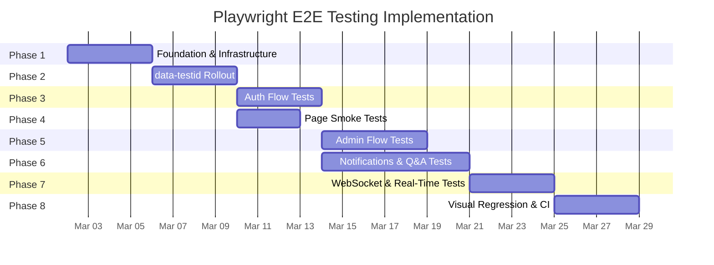

# Playwright E2E Testing — Implementation Plan

**Created**: 2026-02-23
**Status**: Planning Complete — Implementation deferred to v0.1.6
**Pattern**: Pattern 1 (Multi-Phase Implementation)
**Phases**: 8 | **Tasks**: ~78 | **Timeline**: ~5 weeks

---

## Implementation Constraint

**DO NOT IMPLEMENT until development branch v0.1.6.**
All code changes, package installs, and test writing are deferred.
This document tracks what to build and in what order.

---

## Phase Summary

| Phase | Name | Duration | Tasks | Dependencies | Risk |
|-------|------|----------|-------|--------------|------|
| 1 | Foundation & Infrastructure | 3-4 days | 8 | None | Low |
| 2 | data-testid Rollout | 3-4 days | 14 | Phase 1 | Low |
| 3 | Auth Flow Tests | 3-4 days | 10 | Phases 1, 2 | Medium |
| 4 | Page Smoke Tests | 2-3 days | 6 | Phases 1, 2 | Low |
| 5 | Admin Flow Tests | 4-5 days | 12 | Phases 2, 3 | Medium |
| 6 | Notifications & Q&A Tests | 5-7 days | 12 | Phases 2, 3 | High |
| 7 | WebSocket & Real-Time Tests | 3-4 days | 8 | Phases 1, 3, 6 | High |
| 8 | Visual Regression & CI | 3-4 days | 8 | All prior | Medium |



---

## Phase 1: Foundation & Infrastructure (3-4 days)

**Objective**: Install Playwright, create E2E test directory structure, write conftest.py fixtures

**Risk**: Low — well-documented setup, clear patterns from integration tests

### Tasks

- [x] **1.1** Add Playwright deps to `requirements-test.txt`: `pytest-playwright>=0.7.0` (visual snapshot deferred — starlette conflict)
- [x] **1.2** Install Playwright browser: `playwright install chromium` (no `--with-deps`, no sudo)
- [x] **1.3** Create `src/tests/e2e_ui/__init__.py` (renamed from `e2e/`)
- [x] **1.4** Create `src/tests/e2e_ui/conftest.py` with:
  - `verify_test_environment`, `clean_test_db`, test credentials, PAGE_URLS registry
  - `fill_login_form`, `fill_register_form`, `assert_error_message`, `assert_success_message`
  - `logged_in_page`, `admin_page` fixtures
  - `PUBLIC_PAGES`, `AUTH_PAGES`, `HYBRID_PAGES`, `ADMIN_PAGES` classifications
- [x] **1.5** Create `src/scripts/run-e2e-ui-tests.sh` (hot-swap pattern, `$VENV_PYTHON`, cleanup trap)
- [x] **1.6** Write trivial verification test: `test_trivial_verification.py`
- [x] **1.7** Verify: trivial test passes via `run-e2e-ui-tests.sh`
- [x] **1.8** Verify: existing test suites unaffected (2094 unit tests passed)

### Phase 1 Exit Criteria
- [x] `run-e2e-ui-tests.sh` starts server, runs 1 test, stops server
- [x] `pytest src/tests/unit/` still passes (2094 tests)
- [x] No new dependencies break existing tests

---

## Phase 2: data-testid Rollout (3-4 days)

**Objective**: Add `data-testid` attributes to all interactive elements across 12 HTML pages

**Risk**: Low — HTML-only changes, no logic affected

**Naming Convention**: `data-testid="page-element-type"` (e.g., `login-email-input`, `admin-users-search-input`)

**Reference**: See [03-data-testid-inventory.md](03-data-testid-inventory.md) for complete element inventory

### Tasks

- [x] **2.1** Add data-testids to `login.html` (8 elements)
- [x] **2.2** Add data-testids to `register.html` (16 elements)
- [x] **2.3** Add data-testids to `change-password.html` (14 elements)
- [x] **2.4** Add data-testids to `profile.html` (16 elements)
- [x] **2.5** Add data-testids to `landing.html` (11 elements)
- [x] **2.6** Add data-testids to `notifications.html` (83 elements)
- [x] **2.7** Add data-testids to `admin/dashboard.html` (7 elements)
- [x] **2.8** Add data-testids to `admin/snapshots.html` (31 elements)
- [x] **2.9** Add data-testids to `auth/admin/users.html` (16 elements)
- [x] **2.10** Add data-testids to `auth/admin/proxy-ratify.html` (25 elements)
- [x] **2.11** Add data-testids to `auth/admin/proxy-dashboard.html` (12 elements)
- [x] **2.12** Add data-testids to `dev-tools.html` (14 elements)
- [x] **2.13** Add data-testids to `lupin-nav.js` shared nav component (13 runtime elements)
- [x] **2.14** ~266 total testids across 13 files

### Phase 2 Exit Criteria
- [x] ~266 interactive elements have `data-testid` attributes
- [x] No visual or behavioral regressions
- [x] Inventory complete

---

## Phase 3: Auth Flow Tests (3-4 days)

**Objective**: E2E tests for the highest-risk user journeys — authentication

**Risk**: Medium — auth flows involve server state, DB cleanup needed

**Dependencies**: Phase 1 (infrastructure), Phase 2 (data-testids on auth pages)

### Tasks

- [x] **3.1** Create `src/tests/e2e_ui/test_login.py` (8 tests): valid/invalid login, token storage, form elements, navigation
- [x] **3.2** Create `src/tests/e2e_ui/test_register.py` (7 tests): registration, strength meter, duplicate email, mismatch
- [x] **3.3** Create `src/tests/e2e_ui/test_profile.py` (7 tests): user info display, admin section visibility, nav actions
- [x] **3.4** Create `src/tests/e2e_ui/test_change_password.py` (7 tests): form elements, strength meter, successful change + re-login, wrong password, cancel
- [x] **3.5** Create `src/tests/e2e_ui/test_session.py` (8 tests): token storage, user_data, persistence, logout, unauthenticated redirect
- [x] **3.6** Create `logged_in_page` fixture (register → login → wait for localStorage token)
- [x] **3.7** Create `admin_page` fixture (register → DB role assign with `flag_modified()` → login)
- [x] **3.8** Shared auth helpers: `fill_login_form`, `fill_register_form`, `assert_error_message`, `assert_success_message`
- [x] **3.9** All 37 auth tests pass
- [x] **3.10** No regressions

### Phase 3 Exit Criteria
- [x] 37 auth E2E tests passing (exceeds 20+ target)
- [x] Auth fixtures reusable by subsequent phases
- [x] Covers: login, register, profile, change-password, session management

---

## Phase 4: Page Smoke Tests (2-3 days)

**Objective**: Verify all 12 pages load, render correctly, have no console errors

**Risk**: Low — straightforward page-load verification

**Dependencies**: Phase 1, Phase 2

### Tasks

- [x] **4.1** Create `src/tests/e2e_ui/test_page_smoke.py` (13 tests): parametrized PUBLIC/AUTH+HYBRID/ADMIN pages, unauthenticated redirect
- [x] **4.2** Create `src/tests/e2e_ui/test_navigation.py` (5 tests): nav email, logout, mobile toggle, admin links
- [x] **4.3** Create `src/tests/e2e_ui/test_landing.py` (9 tests): greeting, stats, card visibility/navigation, admin section
- [x] **4.4** Page URL registry + `PUBLIC_PAGES`, `AUTH_PAGES`, `HYBRID_PAGES`, `ADMIN_PAGES` classifications in conftest.py
- [x] **4.5** All 27 page smoke tests pass
- [x] **4.6** No regressions

### Phase 4 Exit Criteria
- [x] All 12 pages verified: load, correct content
- [x] Navigation tested for both user roles
- [x] Landing page E2E tests complete

---

## Phase 5: Admin Flow Tests (4-5 days)

**Objective**: E2E tests for admin-only user journeys

**Risk**: Medium — admin role assignment requires DB fixture

**Dependencies**: Phase 3 (auth fixtures), Phase 2 (data-testids on admin pages)

### Tasks

- [x] **5.1** Create `src/tests/e2e_ui/test_admin_dashboard.py` (8 tests): email display, 4 cards, breadcrumb, 4 card navigation, logout
- [x] **5.2** Create `src/tests/e2e_ui/test_admin_users.py` (13 tests): search/filters, pagination, table content, 4 modal existence, back nav
- [x] **5.3** Create `src/tests/e2e_ui/test_admin_snapshots.py` (14 tests): search controls, STT button, dropdowns, 3 modals, breadcrumbs, email, logout
- [x] **5.4** Create `src/tests/e2e_ui/test_admin_proxy_dashboard.py` (9 tests): mode controls, cards grid, category filter, table, pagination, breadcrumbs, nav
- [x] **5.5** Create `src/tests/e2e_ui/test_admin_proxy_ratify.py` (13 tests): summary cards, 3 filters, bulk actions, table, pagination, 2 modals, clear filters, nav
- [x] **5.6** Create `src/tests/e2e_ui/test_role_gating.py` (12 tests): parametrized for all 6 ADMIN_PAGES × 2 (non-admin + unauthenticated)
- [x] **5.7** Admin seed: `_seed_users()` helper in test_admin_users.py (API-based seeding)
- [x] **5.8-5.9** Modal/table helpers: Used `get_by_test_id` + `.count()` pattern for DOM existence checks
- [x] **5.10** All 69 admin tests pass
- [x] **5.11** No regressions
- [x] **5.12** Implementation doc updated

### Phase 5 Exit Criteria
- [x] 69 admin E2E tests passing (exceeds 30+ target)
- [x] All 6 admin pages fully tested (dashboard, users, snapshots, proxy-dashboard, proxy-ratify, dev-tools)
- [x] Role-based access control verified E2E (12 role-gating tests)
- [x] DOM existence pattern reusable for modal/table checks

---

## Phase 6: Notifications & Q&A Tests (5-7 days)

**Objective**: E2E tests for the most complex page — notifications.html with 11 sections

**Risk**: High — complex page, WebSocket dependencies, agent pipeline interactions

**Dependencies**: Phase 3 (auth), Phase 2 (data-testids), running server with agents

### Tasks

- [x] **6.1** Create `src/tests/e2e_ui/test_qa_submission.py` (9 tests): mode selector, input, STT, TTS mode, submit, metrics, typing, mode change
- [x] **6.2** Create `src/tests/e2e_ui/test_job_dispatch.py` (23 tests): CC card (10), Research card (5), Podcast card (3), SWE Team card (5)
- [x] **6.3** Create `src/tests/e2e_ui/test_notifications_sections.py` (13 tests): 11 toolbar buttons, 7 parametrized clickable, 5 section element checks
- [x] **6.4** Create `src/tests/e2e_ui/test_tts_controls.py` (11 tests): pause/play/clear, active slot, pending queue, direct TTS input/buttons
- [x] **6.5** Create `src/tests/e2e_ui/test_system_status.py` (7 tests): WS queue/audio status, auth status, logout/refresh/reload buttons
- [x] **6.6** Create `src/tests/e2e_ui/test_queue_display.py` (12 tests): 4 queue sections, 4 expand buttons + clickable, own/all filter buttons
- [x] **6.7** Create `src/tests/e2e_ui/test_action_required.py` (5 tests): section, active slot, pending queue, initial empty states
- [x] **6.8** Create `src/tests/e2e_ui/test_time_saved.py` (6 tests): total, others, solutions, replays, top solutions, clean DB defaults
- [x] **6.9-6.10** Helpers and fixtures: Used existing `logged_in_page` fixture; `get_by_test_id` pattern for DOM checks
- [x] **6.11** All 86 Phase 6 tests pass (225 total E2E)
- [x] **6.12** No regressions

### Phase 6 Exit Criteria
- [x] 86 notifications E2E tests passing (exceeds 40+ target)
- [x] All 11 sections tested via toolbar + element presence
- [x] Q&A interface verified (mode, input, STT, TTS, submit, metrics)
- [x] Job dispatch for all 4 card types verified (CC, Research, Podcast, SWE)

---

## Phase 7: WebSocket & Real-Time Tests (3-4 days)

**Objective**: Verify WebSocket connections and real-time UI updates in browser context

**Risk**: High — timing-sensitive, requires WebSocket server running

**Dependencies**: Phase 1, Phase 3 (auth), Phase 6 (notifications page)

### Tasks

- [x] **7.1** Create `src/tests/e2e_ui/test_websocket_connection.py` (11 tests):
  - WebSocket connects on page load (queue + audio endpoints)
  - URLs contain session IDs with correct ws:// protocol
  - Status indicators update to "Connected" with "status-good" CSS class
  - Auth status shows "Authenticated" with success class
- [x] **7.2** DROPPED: `test_websocket_heartbeat.py` — sys_ping timing already covered by 50 Python WebSocket smoke tests; timing assertions in Playwright are inherently flaky
- [x] **7.3** DROPPED: `test_websocket_reconnect.py` — requires killing WS mid-connection (fragile); reconnection logic already tested server-side
- [x] **7.4** DROPPED: `test_realtime_updates.py` — requires running agent pipeline (not available in Testing config)
- [x] **7.5** Create `src/tests/e2e_ui/test_websocket_session_persistence.py` (10 tests):
  - Session ID stored in localStorage (queue + audio)
  - Session ID format: "adjective animal" space-separated pattern
  - Queue and audio session IDs are different
  - Page reload preserves same session ID
  - Navigation away and back preserves session ID
  - Session ID reused in WebSocket URL after reload
  - Session IDs displayed in DOM match localStorage
- [x] **7.6** Create WebSocket test helpers in conftest.py:
  - `capture_websockets( page )` — register WS listener before navigation
  - `wait_for_ws_connected( page, timeout )` — poll queue-ws-status DOM element
  - `get_ws_status( page, ws_type )` — read status text and CSS class
  - `notifications_page` fixture — logged-in page on notifications with WS connected
- [x] **7.7** Create `src/tests/e2e_ui/test_websocket_auth_handshake.py` (7 tests):
  - auth_request frame sent on queue WS with token, session_id, subscribed_events
  - Token has Bearer prefix stripped for WS auth
  - auth_success updates user display and triggers loadInitialData
  - Unauthenticated access redirects to login
- [x] **7.8** Verify: 253/253 E2E tests pass (28 new + 225 existing), zero regressions

### Phase 7 Exit Criteria
- [x] 28 WebSocket E2E tests passing (exceeds 15+ target)
- [x] Connection lifecycle, session persistence, auth handshake verified
- [x] Session persistence across reloads confirmed
- [x] Full regression suite: 253/253 passing

---

## Phase 8: Visual Regression & CI Integration (3-4 days)

**Objective**: Screenshot baselines and CI pipeline integration

**Risk**: Medium — screenshot flakiness requires threshold tuning

**Dependencies**: All prior phases (pages must be stable)

### Tasks

- [ ] **8.1** Configure `pytest-playwright-visual-snapshot`:
  - Set comparison threshold (e.g., 0.1% pixel difference)
  - Configure snapshot directory: `src/tests/e2e/snapshots/`
  - Set viewport size: 1280x720 (standard)
- [ ] **8.2** Create `src/tests/e2e/test_visual_regression.py`:
  - Parametrized test for all 12 pages
  - Full-page screenshot per page
  - Compare against baseline with configured threshold
  - Generate diff images on failure
- [ ] **8.3** Generate baseline screenshots:
  - All 12 pages in default state (light mode)
  - Auth pages: login, register, change-password (unauthenticated)
  - Protected pages: with logged-in user context
  - Admin pages: with admin user context
- [ ] **8.4** Create `src/tests/e2e/snapshots/` directory with baselines
- [ ] **8.5** Add E2E stage to CI pipeline (if CI exists):
  - Install Playwright in CI environment
  - Run E2E tests as separate stage after unit + integration
  - Store screenshots as artifacts on failure
- [ ] **8.6** Update `CLAUDE.md` TESTING section:
  - Add E2E tier to test types table
  - Add E2E commands to running tests section
  - Update test count totals
  - Add E2E to pre-merge checklist
- [ ] **8.7** Update `src/tests/README.md`:
  - Add E2E testing section with examples
  - Document Playwright setup and configuration
  - Add visual regression workflow
- [ ] **8.8** Verify: full test suite green (all 7 tiers)

### Phase 8 Exit Criteria
- [ ] Visual baselines for all 12 pages
- [ ] Screenshot comparison tests passing
- [ ] Documentation updated (CLAUDE.md, README.md)
- [ ] Full 7-tier test suite green

---

## Test Directory Structure (Final)

```
src/tests/e2e/
├── conftest.py                         # Browser fixtures, auth helpers, server management
├── __init__.py
├── test_login.py                       # Phase 3
├── test_register.py                    # Phase 3
├── test_profile.py                     # Phase 3
├── test_change_password.py             # Phase 3
├── test_session.py                     # Phase 3
├── test_page_smoke.py                  # Phase 4
├── test_navigation.py                  # Phase 4
├── test_landing.py                     # Phase 4
├── test_admin_dashboard.py             # Phase 5
├── test_admin_users.py                 # Phase 5
├── test_admin_snapshots.py             # Phase 5
├── test_admin_proxy_dashboard.py       # Phase 5
├── test_admin_proxy_ratify.py          # Phase 5
├── test_role_gating.py                 # Phase 5
├── test_qa_submission.py               # Phase 6
├── test_job_dispatch.py                # Phase 6
├── test_notifications_sections.py      # Phase 6
├── test_tts_controls.py                # Phase 6
├── test_system_status.py              # Phase 6
├── test_queue_display.py               # Phase 6
├── test_action_required.py             # Phase 6
├── test_time_saved.py                  # Phase 6
├── test_websocket_connection.py        # Phase 7
├── test_websocket_heartbeat.py         # Phase 7
├── test_websocket_reconnect.py         # Phase 7
├── test_realtime_updates.py            # Phase 7
├── test_session_persistence.py         # Phase 7
├── test_visual_regression.py           # Phase 8
└── snapshots/                          # Phase 8: Baseline screenshots
    ├── login.png
    ├── register.png
    ├── change-password.png
    ├── profile.png
    ├── landing.png
    ├── notifications.png
    ├── admin-dashboard.png
    ├── admin-snapshots.png
    ├── admin-users.png
    ├── admin-proxy-ratify.png
    ├── admin-proxy-dashboard.png
    └── dev-tools.png
```

---

## Verification Strategy

After each phase:
1. Run `src/scripts/run-e2e-tests.sh` — all E2E tests pass
2. Run existing test suites — no regressions:
   - `pytest src/tests/unit/` (1534+ tests)
   - `./src/scripts/run-websocket-smoke-tests.sh` (50 tests)
   - `./src/tests/run-integration-tests.sh -v` (85+ tests)
3. Final gate before merge: all 7 test tiers green

---

## Dependencies to Add (`requirements-test.txt`)

```
pytest-playwright>=0.7.0
pytest-playwright-visual-snapshot>=0.2.0
```

Plus system install: `playwright install chromium --with-deps`

---

## Round 2: Claude Code + Playwright MCP (Post v0.1.6)

**Prerequisite**: Phases 1-8 complete — traditional Playwright E2E suite established and green.

### Round 2 Goals

| Capability | Tool | Value |
|------------|------|-------|
| Intelligent test generation | Playwright MCP (`browser_generate_playwright_test`) | Auto-generate test code from browser exploration |
| Self-healing selectors | Playwright MCP snapshot mode (accessibility tree) | AI identifies replacement selectors when UI changes |
| Visual regression triage | Claude Code + screenshots | AI classifies screenshot diffs as intentional vs. regression |
| Exploratory testing | Claude Code + Chrome integration | AI explores app like a user, finds edge cases |
| Test maintenance | Playwright MCP + Claude Code | AI proposes fixes for broken tests after UI changes |

### Round 2 Phases (Estimated 2-3 weeks)

- [ ] **R2-1**: MCP Setup — Install Playwright MCP, verify Claude Code can drive browser (1-2 days)
- [ ] **R2-2**: Test Generation — Use `browser_generate_playwright_test` to scaffold uncovered flows (3-4 days)
- [ ] **R2-3**: Self-Healing — Implement selector healing workflow (3-4 days)
- [ ] **R2-4**: Visual Triage — AI-assisted visual regression review (2-3 days)
- [ ] **R2-5**: Exploratory — AI-driven exploratory testing sessions (2-3 days)

Round 2 planning documents will be created as a separate P-is-P Pattern 3 (Feature Development) when the traditional Playwright foundation is complete and stable.
