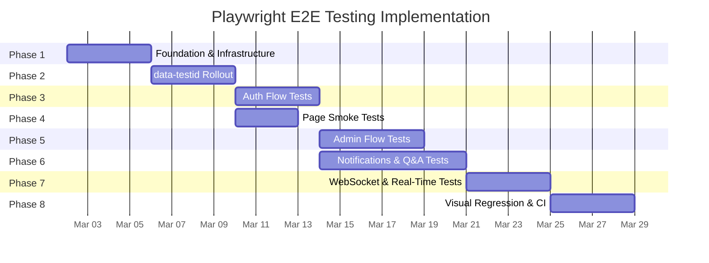

# Playwright E2E Testing — Implementation Plan

**Created**: 2026-02-23
**Status**: Planning Complete — Implementation deferred to v0.1.6
**Pattern**: Pattern 1 (Multi-Phase Implementation)
**Phases**: 8 | **Tasks**: ~78 | **Timeline**: ~5 weeks

---

## Implementation Constraint

**DO NOT IMPLEMENT until development branch v0.1.6.**
All code changes, package installs, and test writing are deferred.
This document tracks what to build and in what order.

---

## Phase Summary

| Phase | Name | Duration | Tasks | Dependencies | Risk |
|-------|------|----------|-------|--------------|------|
| 1 | Foundation & Infrastructure | 3-4 days | 8 | None | Low |
| 2 | data-testid Rollout | 3-4 days | 14 | Phase 1 | Low |
| 3 | Auth Flow Tests | 3-4 days | 10 | Phases 1, 2 | Medium |
| 4 | Page Smoke Tests | 2-3 days | 6 | Phases 1, 2 | Low |
| 5 | Admin Flow Tests | 4-5 days | 12 | Phases 2, 3 | Medium |
| 6 | Notifications & Q&A Tests | 5-7 days | 12 | Phases 2, 3 | High |
| 7 | WebSocket & Real-Time Tests | 3-4 days | 8 | Phases 1, 3, 6 | High |
| 8 | Visual Regression & CI | 3-4 days | 8 | All prior | Medium |



---

## Phase 1: Foundation & Infrastructure (3-4 days)

**Objective**: Install Playwright, create E2E test directory structure, write conftest.py fixtures

**Risk**: Low — well-documented setup, clear patterns from integration tests

### Tasks

- [ ] **1.1** Add Playwright deps to `requirements-test.txt`: `pytest-playwright>=0.7.0`, `pytest-playwright-visual-snapshot>=0.2.0`
- [ ] **1.2** Install Playwright browser: `playwright install chromium --with-deps`
- [ ] **1.3** Create `src/tests/e2e/__init__.py`
- [ ] **1.4** Create `src/tests/e2e/conftest.py` with:
  - Session-scoped server fixture (reuse pattern from `run-integration-tests.sh`)
  - Browser/page fixtures with Chromium config
  - Auth helper fixtures (`logged_in_page`, `admin_page`)
  - Base URL configuration (port 7999)
  - `clean_test_db()` per-test fixture (import from integration conftest)
- [ ] **1.5** Create `src/scripts/run-e2e-tests.sh` (server lifecycle + pytest)
  - Check port 7999 availability
  - Start PostgreSQL + FastAPI with Testing config
  - Wait for health check (max 30s)
  - Run `pytest src/tests/e2e/` with pass-through args
  - Automatic cleanup on EXIT/INT/TERM
- [ ] **1.6** Write trivial verification test: navigate to `/app/auth/login`, assert page title
- [ ] **1.7** Verify: trivial test passes via `run-e2e-tests.sh`
- [ ] **1.8** Verify: existing test suites unaffected (unit, integration, WebSocket)

### Phase 1 Exit Criteria
- [ ] `run-e2e-tests.sh` starts server, runs 1 test, stops server
- [ ] `pytest src/tests/unit/` still passes (1534+ tests)
- [ ] No new dependencies break existing tests

---

## Phase 2: data-testid Rollout (3-4 days)

**Objective**: Add `data-testid` attributes to all interactive elements across 12 HTML pages

**Risk**: Low — HTML-only changes, no logic affected

**Naming Convention**: `data-testid="page-element-type"` (e.g., `login-email-input`, `admin-users-search-input`)

**Reference**: See [03-data-testid-inventory.md](03-data-testid-inventory.md) for complete element inventory

### Tasks

- [ ] **2.1** Add data-testids to `login.html` (~5 elements)
- [ ] **2.2** Add data-testids to `register.html` (~12 elements)
- [ ] **2.3** Add data-testids to `change-password.html` (~11 elements)
- [ ] **2.4** Add data-testids to `profile.html` (~11 elements)
- [ ] **2.5** Add data-testids to `landing.html` (~8 elements)
- [ ] **2.6** Add data-testids to `notifications.html` (~95 elements)
- [ ] **2.7** Add data-testids to `admin/dashboard.html` (~8 elements)
- [ ] **2.8** Add data-testids to `admin/snapshots.html` (~30 elements)
- [ ] **2.9** Add data-testids to `auth/admin/users.html` (~20 elements)
- [ ] **2.10** Add data-testids to `auth/admin/proxy-ratify.html` (~25 elements)
- [ ] **2.11** Add data-testids to `auth/admin/proxy-dashboard.html` (~15 elements)
- [ ] **2.12** Add data-testids to `dev-tools.html` (~14 elements)
- [ ] **2.13** Add data-testids to `lupin-nav.js` shared nav component (~12 elements)
- [ ] **2.14** Update `03-data-testid-inventory.md` with final assigned testids

### Phase 2 Exit Criteria
- [ ] All 180+ interactive elements have `data-testid` attributes
- [ ] No visual or behavioral regressions (manual spot-check)
- [ ] Inventory document updated with final assignments

---

## Phase 3: Auth Flow Tests (3-4 days)

**Objective**: E2E tests for the highest-risk user journeys — authentication

**Risk**: Medium — auth flows involve server state, DB cleanup needed

**Dependencies**: Phase 1 (infrastructure), Phase 2 (data-testids on auth pages)

### Tasks

- [ ] **3.1** Create `src/tests/e2e/test_login.py`:
  - Login with valid credentials → redirect to notifications
  - Login with invalid email → error message displayed
  - Login with wrong password → error message displayed
  - Login form validation (empty fields)
  - "Register" link navigation
- [ ] **3.2** Create `src/tests/e2e/test_register.py`:
  - Registration with valid data → success message + redirect
  - Password strength meter updates as user types
  - Password requirement indicators (length, uppercase, lowercase, number, special)
  - Duplicate email → error message
  - Password mismatch → error message
  - Confirm password validation
- [ ] **3.3** Create `src/tests/e2e/test_profile.py`:
  - View profile displays user email, ID, roles
  - Admin section visible for admin users
  - Admin section hidden for regular users
  - Navigation links work (Change Password, Logout)
  - Admin links work (Dashboard, Users, Snapshots, Ratification, Trust)
- [ ] **3.4** Create `src/tests/e2e/test_change_password.py`:
  - Change password with valid current + new password → success
  - Wrong current password → error message
  - New password strength meter + requirements
  - Weak new password → blocked
  - Successful change → can login with new password
- [ ] **3.5** Create `src/tests/e2e/test_session.py`:
  - Login stores tokens in localStorage
  - Page reload preserves session (no re-login)
  - Logout clears localStorage
  - Expired token triggers redirect to login
  - Token refresh works transparently
- [ ] **3.6** Create `logged_in_page` fixture in conftest.py:
  - Register new user via browser UI
  - Login via browser UI
  - Return authenticated page object
- [ ] **3.7** Create `admin_page` fixture in conftest.py:
  - Register new user via browser UI
  - Assign admin role via DB fixture
  - Login via browser UI
  - Return admin-authenticated page object
- [ ] **3.8** Create shared auth helpers:
  - `fill_login_form( page, email, password )`
  - `fill_register_form( page, email, password )`
  - `assert_error_message( page, expected_text )`
  - `assert_success_message( page, expected_text )`
- [ ] **3.9** Verify: all auth tests pass via `run-e2e-tests.sh`
- [ ] **3.10** Verify: no regressions in unit/integration tests

### Phase 3 Exit Criteria
- [ ] 20+ auth E2E tests passing
- [ ] Auth fixtures reusable by subsequent phases
- [ ] Covers: login, register, profile, change-password, session management

---

## Phase 4: Page Smoke Tests (2-3 days)

**Objective**: Verify all 12 pages load, render correctly, have no console errors

**Risk**: Low — straightforward page-load verification

**Dependencies**: Phase 1, Phase 2

### Tasks

- [ ] **4.1** Create `src/tests/e2e/test_page_smoke.py`:
  - Parametrized test for all 12 pages
  - Assert: page loads (no network errors)
  - Assert: no JavaScript console errors
  - Assert: key heading element present
  - Assert: page title correct
  - Assert: navigation bar rendered
- [ ] **4.2** Create `src/tests/e2e/test_navigation.py`:
  - Nav bar renders for authenticated user
  - All public links work (Home, Notifications, Profile)
  - Admin links visible only for admin users
  - Admin links hidden for regular users
  - Mobile hamburger menu toggle works
  - Logout button clears session
- [ ] **4.3** Create `src/tests/e2e/test_landing.py`:
  - Landing page displays user greeting
  - Cards section renders with correct links
  - Admin section visible for admin users only
  - Stats section displays values
  - Card navigation works (click → correct page)
- [ ] **4.4** Create page URL registry constant in conftest.py:
  - Map of page name → URL path for parametrized tests
  - Include auth requirements per page (public, logged-in, admin)
- [ ] **4.5** Verify: all page smoke tests pass
- [ ] **4.6** Verify: no regressions

### Phase 4 Exit Criteria
- [ ] All 12 pages verified: load, no JS errors, correct content
- [ ] Navigation tested for both user roles
- [ ] Landing page E2E tests complete

---

## Phase 5: Admin Flow Tests (4-5 days)

**Objective**: E2E tests for admin-only user journeys

**Risk**: Medium — admin role assignment requires DB fixture

**Dependencies**: Phase 3 (auth fixtures), Phase 2 (data-testids on admin pages)

### Tasks

- [ ] **5.1** Create `src/tests/e2e/test_admin_dashboard.py`:
  - Dashboard loads for admin user
  - All 4 admin tool cards rendered
  - Card links navigate to correct pages
  - User email displayed in header
  - Logout works from dashboard
- [ ] **5.2** Create `src/tests/e2e/test_admin_users.py`:
  - User list loads with table rows
  - Search by email filters results
  - Role filter (Admin/User) works
  - Status filter (Active/Inactive) works
  - Clear filters resets all
  - Pagination (next/previous) works
  - Click user row → detail modal opens
  - Edit roles modal → save changes
  - Toggle user status (active/inactive)
  - Reset password → temp password displayed
- [ ] **5.3** Create `src/tests/e2e/test_admin_snapshots.py`:
  - Search input + submit returns results
  - Threshold slider filters by similarity
  - Limit selector controls result count
  - Results table renders with data
  - Click row → detail modal opens
  - Detail modal shows all fields
  - Find Similar button → similarity modal
  - Delete snapshot → confirmation modal → delete
- [ ] **5.4** Create `src/tests/e2e/test_admin_proxy_dashboard.py`:
  - Trust mode selector displays current mode
  - Change trust mode → API call + UI update
  - Trust cards grid renders per category
  - Category selector filters decisions table
  - Decisions table pagination works
- [ ] **5.5** Create `src/tests/e2e/test_admin_proxy_ratify.py`:
  - Summary cards show correct counts
  - Filter by category/trust level/action
  - Select individual decisions via checkbox
  - Select all checkbox toggles all
  - Bulk approve → confirmation → success
  - Bulk reject → confirmation modal → feedback → reject
  - Click decision → detail modal
  - Detail modal approve/reject with feedback
  - Clear filters resets all
  - Pagination works
- [ ] **5.6** Create `src/tests/e2e/test_role_gating.py`:
  - Non-admin user → admin dashboard returns 403 or redirect
  - Non-admin user → users page blocked
  - Non-admin user → snapshots page blocked
  - Non-admin user → proxy dashboard blocked
  - Non-admin user → proxy ratify blocked
  - Admin section in profile hidden for non-admin
  - Admin nav links hidden for non-admin
- [ ] **5.7** Create admin DB seed fixture:
  - Seed test users with various roles
  - Seed sample proxy decisions for ratify tests
  - Seed sample snapshots for search tests
- [ ] **5.8** Create modal test helpers:
  - `open_modal( page, trigger_testid )`
  - `close_modal( page, modal_testid )`
  - `assert_modal_visible( page, modal_testid )`
  - `assert_modal_hidden( page, modal_testid )`
- [ ] **5.9** Create table test helpers:
  - `get_table_row_count( page, tbody_testid )`
  - `click_table_row( page, tbody_testid, row_index )`
  - `assert_pagination( page, expected_page )`
- [ ] **5.10** Verify: all admin tests pass
- [ ] **5.11** Verify: no regressions
- [ ] **5.12** Update implementation doc with Phase 5 status

### Phase 5 Exit Criteria
- [ ] 30+ admin E2E tests passing
- [ ] All 5 admin pages fully tested
- [ ] Role-based access control verified E2E
- [ ] Modal and table helpers reusable

---

## Phase 6: Notifications & Q&A Tests (5-7 days)

**Objective**: E2E tests for the most complex page — notifications.html with 11 sections

**Risk**: High — complex page, WebSocket dependencies, agent pipeline interactions

**Dependencies**: Phase 3 (auth), Phase 2 (data-testids), running server with agents

### Tasks

- [ ] **6.1** Create `src/tests/e2e/test_qa_submission.py`:
  - Select agent mode from dropdown
  - Type question in Q&A input
  - Submit via button click
  - Verify response appears in done queue
  - Verify metrics update after response
  - Test with different agent modes (Math, Calendar, etc.)
- [ ] **6.2** Create `src/tests/e2e/test_job_dispatch.py`:
  - Claude Code card: fill prompt, select project, task type, execution mode
  - Claude Code: dry-run checkbox works
  - Claude Code: submit → job appears in todo/running queue
  - Research card: fill topic, set budget, submit
  - Research: with-podcast checkbox toggles
  - Podcast card: fill source, submit
  - SWE Team card: fill task, set budget, timeout, trust mode, submit
  - All cards: dry-run submissions complete without errors
- [ ] **6.3** Create `src/tests/e2e/test_notifications_sections.py`:
  - All 11 section toolbar buttons render
  - Click toolbar button → corresponding section toggles
  - Section collapse/expand animation
  - Multiple sections can be open simultaneously
  - Default section state on page load
- [ ] **6.4** Create `src/tests/e2e/test_tts_controls.py`:
  - TTS mode selector (Instant/Reliable)
  - TTS queue section renders
  - Pause/Play/Clear buttons functional
  - Direct TTS test input + submit (audio muted in tests)
- [ ] **6.5** Create `src/tests/e2e/test_system_status.py`:
  - System Status section renders
  - WebSocket status indicators present
  - Auth status indicator shows state
  - Refresh button triggers status update
  - Config reload button works
  - Logout button clears session
- [ ] **6.6** Create `src/tests/e2e/test_queue_display.py`:
  - Todo/Running/Done/Dead queue categories render
  - Queue expand/collapse toggles
  - Job items display in correct queue
  - Filter buttons (My Jobs / All Users) toggle
- [ ] **6.7** Create `src/tests/e2e/test_action_required.py`:
  - Action Required section renders
  - Active notification slot displays
  - Pending queue shows items
  - Response buttons functional
- [ ] **6.8** Create `src/tests/e2e/test_time_saved.py`:
  - Time Saved dashboard renders
  - Stats values display (total, others, created, replays)
  - Top solutions list renders
- [ ] **6.9** Create notifications page test helpers:
  - `submit_qa_question( page, question, mode )`
  - `submit_claude_code_job( page, prompt, project, task_type )`
  - `submit_research_job( page, topic, budget )`
  - `wait_for_queue_item( page, queue_type, timeout )`
  - `toggle_section( page, section_testid )`
- [ ] **6.10** Create mock data fixtures:
  - Seed Q&A responses for done queue display
  - Seed job submissions for queue display
- [ ] **6.11** Verify: all notifications tests pass
- [ ] **6.12** Verify: no regressions

### Phase 6 Exit Criteria
- [ ] 40+ notifications E2E tests passing
- [ ] All 11 sections tested
- [ ] Q&A submission flow verified end-to-end
- [ ] Job dispatch for all 4 card types verified

---

## Phase 7: WebSocket & Real-Time Tests (3-4 days)

**Objective**: Verify WebSocket connections and real-time UI updates in browser context

**Risk**: High — timing-sensitive, requires WebSocket server running

**Dependencies**: Phase 1, Phase 3 (auth), Phase 6 (notifications page)

### Tasks

- [ ] **7.1** Create `src/tests/e2e/test_websocket_connection.py`:
  - WebSocket connects on page load (queue + audio endpoints)
  - Auth handshake completes successfully
  - Status indicator shows "connected"
  - Connection fails gracefully without auth
- [ ] **7.2** Create `src/tests/e2e/test_websocket_heartbeat.py`:
  - sys_ping events received periodically
  - Health indicator stays green during session
  - No stale connection warnings in console
- [ ] **7.3** Create `src/tests/e2e/test_websocket_reconnect.py`:
  - Reconnection after simulated disconnect
  - Status indicator shows reconnecting state
  - Up to 5 retry attempts
  - Recovery after successful reconnect
- [ ] **7.4** Create `src/tests/e2e/test_realtime_updates.py`:
  - Submit Q&A → response appears in real-time (not just on refresh)
  - Job status changes reflected in queue display
  - Notification events update UI elements
  - Queue counts update dynamically
- [ ] **7.5** Create `src/tests/e2e/test_session_persistence.py`:
  - Session ID stored in localStorage
  - Session ID format: "adjective noun" pattern
  - Page reload preserves same session ID
  - Session ID used in WebSocket connection URL
  - New tab gets new session or shares existing
- [ ] **7.6** Create WebSocket test helpers:
  - `wait_for_ws_connected( page, timeout )`
  - `get_ws_status( page )`
  - `simulate_ws_disconnect( page )` (via devtools protocol)
  - `wait_for_ws_event( page, event_type, timeout )`
- [ ] **7.7** Verify: all WebSocket tests pass
- [ ] **7.8** Verify: no regressions

### Phase 7 Exit Criteria
- [ ] 15+ WebSocket E2E tests passing
- [ ] Connection, heartbeat, reconnect, real-time updates all verified
- [ ] Session persistence across reloads confirmed

---

## Phase 8: Visual Regression & CI Integration (3-4 days)

**Objective**: Screenshot baselines and CI pipeline integration

**Risk**: Medium — screenshot flakiness requires threshold tuning

**Dependencies**: All prior phases (pages must be stable)

### Tasks

- [ ] **8.1** Configure `pytest-playwright-visual-snapshot`:
  - Set comparison threshold (e.g., 0.1% pixel difference)
  - Configure snapshot directory: `src/tests/e2e/snapshots/`
  - Set viewport size: 1280x720 (standard)
- [ ] **8.2** Create `src/tests/e2e/test_visual_regression.py`:
  - Parametrized test for all 12 pages
  - Full-page screenshot per page
  - Compare against baseline with configured threshold
  - Generate diff images on failure
- [ ] **8.3** Generate baseline screenshots:
  - All 12 pages in default state (light mode)
  - Auth pages: login, register, change-password (unauthenticated)
  - Protected pages: with logged-in user context
  - Admin pages: with admin user context
- [ ] **8.4** Create `src/tests/e2e/snapshots/` directory with baselines
- [ ] **8.5** Add E2E stage to CI pipeline (if CI exists):
  - Install Playwright in CI environment
  - Run E2E tests as separate stage after unit + integration
  - Store screenshots as artifacts on failure
- [ ] **8.6** Update `CLAUDE.md` TESTING section:
  - Add E2E tier to test types table
  - Add E2E commands to running tests section
  - Update test count totals
  - Add E2E to pre-merge checklist
- [ ] **8.7** Update `src/tests/README.md`:
  - Add E2E testing section with examples
  - Document Playwright setup and configuration
  - Add visual regression workflow
- [ ] **8.8** Verify: full test suite green (all 7 tiers)

### Phase 8 Exit Criteria
- [ ] Visual baselines for all 12 pages
- [ ] Screenshot comparison tests passing
- [ ] Documentation updated (CLAUDE.md, README.md)
- [ ] Full 7-tier test suite green

---

## Test Directory Structure (Final)

```
src/tests/e2e/
├── conftest.py                         # Browser fixtures, auth helpers, server management
├── __init__.py
├── test_login.py                       # Phase 3
├── test_register.py                    # Phase 3
├── test_profile.py                     # Phase 3
├── test_change_password.py             # Phase 3
├── test_session.py                     # Phase 3
├── test_page_smoke.py                  # Phase 4
├── test_navigation.py                  # Phase 4
├── test_landing.py                     # Phase 4
├── test_admin_dashboard.py             # Phase 5
├── test_admin_users.py                 # Phase 5
├── test_admin_snapshots.py             # Phase 5
├── test_admin_proxy_dashboard.py       # Phase 5
├── test_admin_proxy_ratify.py          # Phase 5
├── test_role_gating.py                 # Phase 5
├── test_qa_submission.py               # Phase 6
├── test_job_dispatch.py                # Phase 6
├── test_notifications_sections.py      # Phase 6
├── test_tts_controls.py                # Phase 6
├── test_system_status.py              # Phase 6
├── test_queue_display.py               # Phase 6
├── test_action_required.py             # Phase 6
├── test_time_saved.py                  # Phase 6
├── test_websocket_connection.py        # Phase 7
├── test_websocket_heartbeat.py         # Phase 7
├── test_websocket_reconnect.py         # Phase 7
├── test_realtime_updates.py            # Phase 7
├── test_session_persistence.py         # Phase 7
├── test_visual_regression.py           # Phase 8
└── snapshots/                          # Phase 8: Baseline screenshots
    ├── login.png
    ├── register.png
    ├── change-password.png
    ├── profile.png
    ├── landing.png
    ├── notifications.png
    ├── admin-dashboard.png
    ├── admin-snapshots.png
    ├── admin-users.png
    ├── admin-proxy-ratify.png
    ├── admin-proxy-dashboard.png
    └── dev-tools.png
```

---

## Verification Strategy

After each phase:
1. Run `src/scripts/run-e2e-tests.sh` — all E2E tests pass
2. Run existing test suites — no regressions:
   - `pytest src/tests/unit/` (1534+ tests)
   - `./src/scripts/run-websocket-smoke-tests.sh` (50 tests)
   - `./src/tests/run-integration-tests.sh -v` (85+ tests)
3. Final gate before merge: all 7 test tiers green

---

## Dependencies to Add (`requirements-test.txt`)

```
pytest-playwright>=0.7.0
pytest-playwright-visual-snapshot>=0.2.0
```

Plus system install: `playwright install chromium --with-deps`

---

## Round 2: Claude Code + Playwright MCP (Post v0.1.6)

**Prerequisite**: Phases 1-8 complete — traditional Playwright E2E suite established and green.

### Round 2 Goals

| Capability | Tool | Value |
|------------|------|-------|
| Intelligent test generation | Playwright MCP (`browser_generate_playwright_test`) | Auto-generate test code from browser exploration |
| Self-healing selectors | Playwright MCP snapshot mode (accessibility tree) | AI identifies replacement selectors when UI changes |
| Visual regression triage | Claude Code + screenshots | AI classifies screenshot diffs as intentional vs. regression |
| Exploratory testing | Claude Code + Chrome integration | AI explores app like a user, finds edge cases |
| Test maintenance | Playwright MCP + Claude Code | AI proposes fixes for broken tests after UI changes |

### Round 2 Phases (Estimated 2-3 weeks)

- [ ] **R2-1**: MCP Setup — Install Playwright MCP, verify Claude Code can drive browser (1-2 days)
- [ ] **R2-2**: Test Generation — Use `browser_generate_playwright_test` to scaffold uncovered flows (3-4 days)
- [ ] **R2-3**: Self-Healing — Implement selector healing workflow (3-4 days)
- [ ] **R2-4**: Visual Triage — AI-assisted visual regression review (2-3 days)
- [ ] **R2-5**: Exploratory — AI-driven exploratory testing sessions (2-3 days)

Round 2 planning documents will be created as a separate P-is-P Pattern 3 (Feature Development) when the traditional Playwright foundation is complete and stable.
