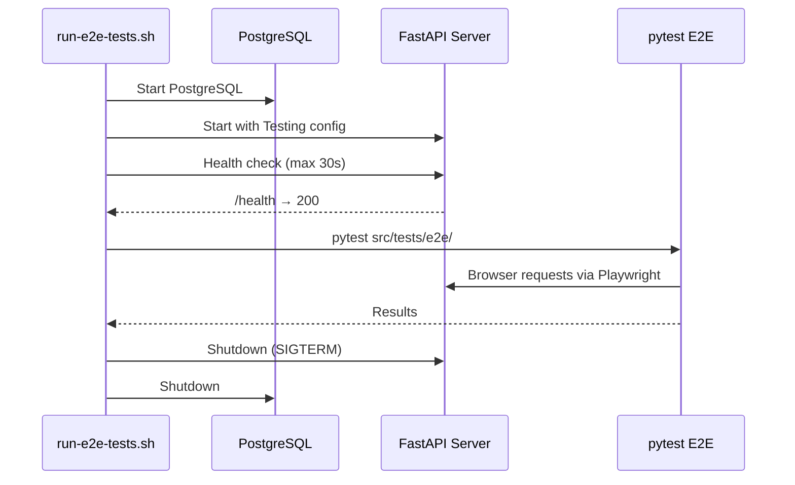
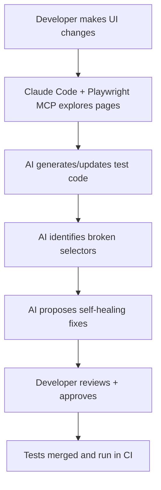

# Playwright E2E Testing — Architecture Decisions

**Created**: 2026-02-23
**Status**: Planning Complete — Implementation deferred to v0.1.6

---

## Decision Log

| ID | Decision | Status |
|----|----------|--------|
| AD-01 | [Test Runner Strategy](#ad-01-test-runner-strategy) | Approved |
| AD-02 | [Server Management](#ad-02-server-management) | Approved |
| AD-03 | [conftest.py Organization](#ad-03-conftestpy-organization) | Approved |
| AD-04 | [data-testid Naming Convention](#ad-04-data-testid-naming-convention) | Approved |
| AD-05 | [Auth in E2E Tests](#ad-05-auth-in-e2e-tests) | Approved |
| AD-06 | [Visual Regression Strategy](#ad-06-visual-regression-strategy) | Approved |
| AD-07 | [Test Isolation](#ad-07-test-isolation) | Approved |
| AD-08 | [WebSocket Testing](#ad-08-websocket-testing) | Approved |
| AD-09 | [AI Augmentation Boundary](#ad-09-ai-augmentation-boundary) | Approved (Round 2) |

---

## AD-01: Test Runner Strategy

**Decision**: Create separate `run-e2e-tests.sh` script (not merge into `run-integration-tests.sh`)

**Rationale**:
- E2E tests are significantly slower (Playwright browser startup, page navigation, rendering)
- May need headed mode (`--headed`) for debugging — integration tests never need this
- Require Playwright browser binaries (Chromium) — separate dependency not needed by integration tests
- Independent execution allows running only E2E tests during UI-focused development
- Consistent with the pattern of separate runners for each test tier

**Implementation**:
```bash
# run-e2e-tests.sh follows same structure as run-integration-tests.sh:
# 1. Check port 7999 availability
# 2. Start PostgreSQL + FastAPI with Testing config
# 3. Wait for health check (max 30s)
# 4. Run: pytest src/tests/e2e/ "$@"
# 5. Cleanup on EXIT/INT/TERM
```

**Alternatives Considered**:
- Merge into `run-integration-tests.sh` with `--e2e` flag — rejected: conflates different test tiers, harder to debug
- No runner script (manual server management) — rejected: inconsistent with existing patterns, error-prone

---

## AD-02: Server Management

**Decision**: Reuse the `run-integration-tests.sh` pattern — session-scoped pytest fixture starts server, tears down after all E2E tests complete.

**Rationale**:
- Consistent with existing integration test infrastructure
- E2E tests need a real running server (unlike unit tests which mock everything)
- Session scope ensures server starts once, not per-test (performance)
- The existing pattern handles PostgreSQL, FastAPI startup, health checks, and cleanup

**Key Configuration**:
```python
# conftest.py (session-scoped)
LUPIN_CONFIG_MGR_CLI_ARGS = (
    "config_path=/src/conf/lupin-app.ini "
    "splainer_path=/src/conf/lupin-app-splainer.ini "
    "config_block_id=Lupin:+Testing"
)
```

**Server Lifecycle**:


---

## AD-03: conftest.py Organization

**Decision**: Create `src/tests/e2e/conftest.py` with E2E-specific fixtures. Import shared helpers from integration conftest where possible.

**Rationale**:
- E2E tests need browser-specific fixtures (`page`, `context`, `browser`) that don't belong in the integration conftest
- Shared DB cleanup logic (`clean_test_db`) should be importable from a common location
- Separating E2E fixtures from integration fixtures prevents accidental cross-contamination

**Fixture Hierarchy**:
```
src/tests/conftest.py              ← Bootstrap (LUPIN_ROOT, PYTHONPATH)
src/tests/integration/conftest.py  ← Integration fixtures (HTTP client, auth headers)
src/tests/e2e/conftest.py          ← E2E fixtures (browser, page, logged_in_page)
```

**Key E2E Fixtures**:

| Fixture | Scope | Purpose |
|---------|-------|---------|
| `browser` | session | Chromium browser instance |
| `context` | function | Fresh browser context per test |
| `page` | function | Fresh page per test |
| `base_url` | session | `http://localhost:7999/app` |
| `clean_test_db` | function | Fresh database per test |
| `logged_in_page` | function | Authenticated page (regular user) |
| `admin_page` | function | Authenticated page (admin user) |

**Auth Fixtures** (detailed in AD-05):
```python
@pytest.fixture
def logged_in_page( page, base_url, clean_test_db ):
    """Register + login via browser, return authenticated page."""
    # Navigate to register
    # Fill form with test credentials
    # Submit → redirect to login
    # Fill login form
    # Submit → redirect to notifications
    return page

@pytest.fixture
def admin_page( page, base_url, clean_test_db ):
    """Register + DB admin role + login, return admin page."""
    # Same as logged_in_page but add admin role via DB
    return page
```

---

## AD-04: data-testid Naming Convention

**Decision**: `data-testid="page-element-type"` format.

**Rationale**:
- **Page prefix** prevents collisions across pages (e.g., both login and register have an "email" input)
- **Element suffix** clarifies purpose for test readability
- Follows Playwright best practices (recommends `data-testid` over CSS selectors or XPath)
- Consistent with industry conventions (React Testing Library, Cypress)

**Convention Rules**:

| Rule | Example | Why |
|------|---------|-----|
| Page prefix | `login-`, `register-`, `admin-users-` | Prevents collisions |
| Element name | `-email-`, `-search-`, `-submit-` | Describes purpose |
| Type suffix | `-input`, `-btn`, `-select`, `-link`, `-modal` | Clarifies element type |
| Section scope | `notifications-qa-input` | For complex pages with sections |
| Modal scope | `modal-user-detail-save-btn` | For modal-specific elements |

**Examples**:
```html
<!-- Login page -->
<input data-testid="login-email-input" type="email" id="email">
<input data-testid="login-password-input" type="password" id="password">
<button data-testid="login-submit-btn" id="login-button">Login</button>

<!-- Admin Users page -->
<input data-testid="admin-users-search-input" id="user-search">
<select data-testid="admin-users-role-filter-select" id="role-filter">
<button data-testid="admin-users-clear-filters-btn">Clear</button>

<!-- Notifications page (section-scoped) -->
<input data-testid="notifications-qa-input" id="qa-input">
<button data-testid="notifications-qa-submit-btn" id="submit-qa">
<select data-testid="notifications-cc-project-select" id="cc-project">

<!-- Navigation (shared) -->
<a data-testid="nav-home-link">Home</a>
<a data-testid="nav-notifications-link">Notifications</a>
<button data-testid="nav-logout-btn">Logout</button>
```

**Playwright Usage**:
```python
# Clean, readable test code
page.get_by_test_id( "login-email-input" ).fill( "test@example.com" )
page.get_by_test_id( "login-submit-btn" ).click()
expect( page.get_by_test_id( "login-error-message" ) ).to_be_visible()
```

---

## AD-05: Auth in E2E Tests

**Decision**: Create `logged_in_page` and `admin_page` fixtures that perform real browser login (not token injection).

**Rationale**:
- Tests the actual auth flow as users experience it
- Token injection would skip UI validation (form rendering, button clicks, redirects)
- Browser login is fast with Playwright's auto-wait (no manual sleeps)
- Catches auth UI regressions that token injection would miss

**Implementation Pattern**:
```python
@pytest.fixture
def logged_in_page( page, base_url, clean_test_db ):
    """
    Register a new test user and login via browser UI.

    Requires:
        - Server running with Testing config
        - Clean database (no existing users)

    Ensures:
        - Returns page with valid auth session
        - Page is on notifications page (post-login redirect)
        - localStorage contains valid tokens
    """
    email    = f"test-{uuid.uuid4().hex[:8]}@example.com"
    password = "TestPassword123!"

    # Register
    page.goto( f"{base_url}/auth/register" )
    page.get_by_test_id( "register-email-input" ).fill( email )
    page.get_by_test_id( "register-password-input" ).fill( password )
    page.get_by_test_id( "register-confirm-password-input" ).fill( password )
    page.get_by_test_id( "register-submit-btn" ).click()

    # Login
    page.goto( f"{base_url}/auth/login" )
    page.get_by_test_id( "login-email-input" ).fill( email )
    page.get_by_test_id( "login-password-input" ).fill( password )
    page.get_by_test_id( "login-submit-btn" ).click()

    # Wait for redirect to notifications
    page.wait_for_url( "**/notifications" )

    return page
```

**Admin Role Assignment**:
```python
@pytest.fixture
def admin_page( page, base_url, clean_test_db ):
    """Register user, assign admin role via DB, login via browser."""
    email    = f"admin-{uuid.uuid4().hex[:8]}@example.com"
    password = "AdminPassword123!"

    # Register via browser
    # ... (same as logged_in_page)

    # Assign admin role directly via database
    # (import from integration conftest or shared helper)
    assign_admin_role( email )

    # Login via browser
    # ... (same flow)

    return page
```

**Alternatives Considered**:
- Token injection via `page.evaluate()` to set localStorage — rejected: skips actual auth UI, hides bugs
- API-only registration + token generation — rejected: doesn't test browser rendering of auth forms
- Shared test user with known credentials — rejected: couples tests, prevents parallel execution

---

## AD-06: Visual Regression Strategy

**Decision**: Start with `pytest-playwright-visual-snapshot` (Python-native), defer Percy/Chromatic to later.

**Rationale**:
- **Free** — no external service dependency or subscription cost
- **Local** — baselines stored in repo, diffs generated locally
- **Sufficient** — Lupin's internal-use UI doesn't need cross-browser/cross-device testing
- **Python-native** — integrates directly with pytest without additional tooling
- Can scale up to Percy/Chromatic later if cross-browser needs emerge

**Configuration**:
```python
# conftest.py
@pytest.fixture( scope="session" )
def snapshot_config():
    return {
        "threshold"      : 0.001,  # 0.1% pixel difference tolerance
        "snapshot_dir"   : "src/tests/e2e/snapshots",
        "viewport_width" : 1280,
        "viewport_height": 720,
    }
```

**Baseline Workflow**:
```bash
# Generate baselines (first time or after intentional UI changes)
pytest src/tests/e2e/test_visual_regression.py --update-snapshots

# Compare against baselines (regular test runs)
pytest src/tests/e2e/test_visual_regression.py
```

**Diff Image Generation**:
On failure, generates a diff image highlighting changed pixels for easy visual inspection.

---

## AD-07: Test Isolation

**Decision**: Use `clean_test_db()` fixture per test (same as integration tests), fresh browser context per test.

**Rationale**:
- Prevents state leakage between tests (DB data, browser cookies/localStorage)
- Each test gets a clean slate — no ordering dependencies
- Consistent with integration test isolation pattern
- Fresh browser context per test is Playwright's recommended approach

**Implementation**:
```python
@pytest.fixture( autouse=True )
def clean_test_db():
    """Drop and recreate all tables before each test."""
    # Import from shared test utilities
    from tests.integration.conftest import reset_database
    reset_database()
    yield
    # Optional: cleanup after test

@pytest.fixture
def context( browser ):
    """Fresh browser context per test (clean cookies, localStorage)."""
    ctx = browser.new_context(
        viewport       = { "width": 1280, "height": 720 },
        ignore_https_errors = True,
    )
    yield ctx
    ctx.close()

@pytest.fixture
def page( context ):
    """Fresh page per test."""
    pg = context.new_page()
    yield pg
    pg.close()
```

**State Isolation Matrix**:

| State | Isolation Mechanism |
|-------|---------------------|
| Database | `clean_test_db()` — drops and recreates all tables |
| Cookies | Fresh browser context per test |
| localStorage | Fresh browser context per test |
| WebSocket connections | Fresh page per test (new connections) |
| Browser cache | Fresh context (no cache sharing) |

---

## AD-08: WebSocket Testing

**Decision**: Test WebSocket behavior through the browser (not direct WebSocket client). Verify UI indicators update.

**Rationale**:
- E2E tests should validate **what users see**, not protocol details
- WebSocket unit tests already cover the protocol layer (50 tests in `websocket_smoke/`)
- Testing through the browser catches real integration issues (JS client code, DOM updates, event handling)
- Avoids duplicating WebSocket test coverage

**What E2E WebSocket Tests Cover**:
- Connection status indicator changes color (green/yellow/red)
- Real-time job updates appear without page refresh
- Session persistence across page reloads
- Reconnection behavior visible in UI
- Heartbeat keeps connection alive (status stays green)

**What E2E WebSocket Tests Do NOT Cover** (already in `websocket_smoke/`):
- Raw WebSocket protocol messages
- Event subscription/unsubscription logic
- Message serialization/deserialization
- Server-side WebSocket handler behavior
- Load testing with multiple concurrent connections

**Implementation Pattern**:
```python
def test_websocket_connects_on_page_load( logged_in_page ):
    """Verify WebSocket connection established after login."""
    page = logged_in_page

    # Wait for WebSocket status indicator to show connected
    ws_status = page.get_by_test_id( "notifications-ws-queue-status" )
    expect( ws_status ).to_have_text( "Connected", timeout=10000 )
```

---

## AD-09: AI Augmentation Boundary (Round 2)

**Decision**: AI generates test scaffolds and proposes fixes; humans review and approve all changes.

**Rationale**:
- Community consensus (2025-2026): "AI is a powerful augmentation tool, not a replacement for test strategy"
- Self-healing and test generation reduce maintenance burden
- Strategic control remains with developers (what to test, when to test, quality definition)
- AI-generated tests require human review before merging — no autonomous commits

**Boundary Definition**:

| Responsibility | Owner |
|---------------|-------|
| Test strategy (what to test) | Human |
| Test scaffolding (how to test) | AI-generated, human-reviewed |
| Selector healing (fixing broken tests) | AI-proposed, human-approved |
| Visual regression classification | AI-triaged, human-confirmed |
| Test execution and CI | Automated (no AI in loop) |
| Quality standards | Human-defined |

**Round 2 Workflow**:


**Guardrails**:
- AI never commits directly to the test suite
- All AI-generated tests go through standard code review
- AI proposals include confidence scores and reasoning
- Human can reject AI proposals at any step

---

## Cross-Cutting Conventions

### File Naming
- Test files: `test_<feature>.py` (snake_case, `test_` prefix)
- Test classes: `TestFeatureName` (PascalCase, `Test` prefix)
- Test methods: `test_specific_behavior` (snake_case, `test_` prefix)
- Helper modules: `helpers_<domain>.py` (if needed)

### Assertion Style
```python
# Use Playwright's expect() for all assertions
from playwright.sync_api import expect

expect( page.get_by_test_id( "login-error-message" ) ).to_be_visible()
expect( page.get_by_test_id( "login-error-message" ) ).to_have_text( "Invalid credentials" )
expect( page ).to_have_url( "**/notifications" )
```

### Timeout Strategy
```python
# Default timeouts
DEFAULT_NAVIGATION_TIMEOUT = 10_000  # 10s for page navigation
DEFAULT_ACTION_TIMEOUT     =  5_000  # 5s for element interactions
DEFAULT_WS_TIMEOUT         = 15_000  # 15s for WebSocket events (higher due to network)
DEFAULT_POLL_TIMEOUT       = 30_000  # 30s for queue polling (jobs take time)
```

### Console Error Monitoring
```python
# Capture and assert no console errors
@pytest.fixture( autouse=True )
def check_console_errors( page ):
    errors = []
    page.on( "console", lambda msg: errors.append( msg.text ) if msg.type == "error" else None )
    yield
    assert len( errors ) == 0, f"Console errors detected: {errors}"
```
