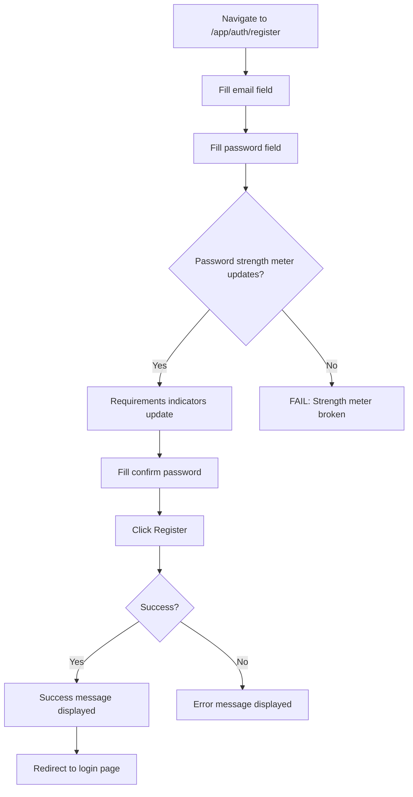
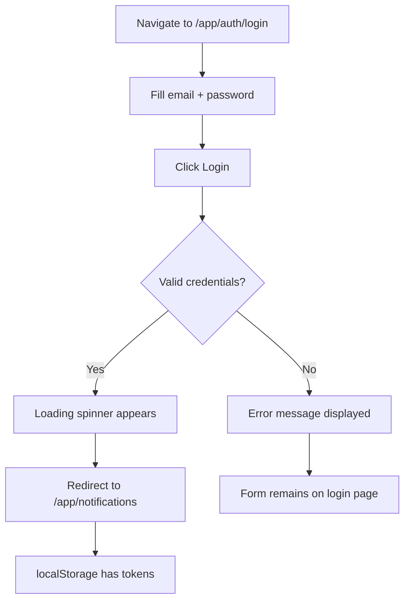
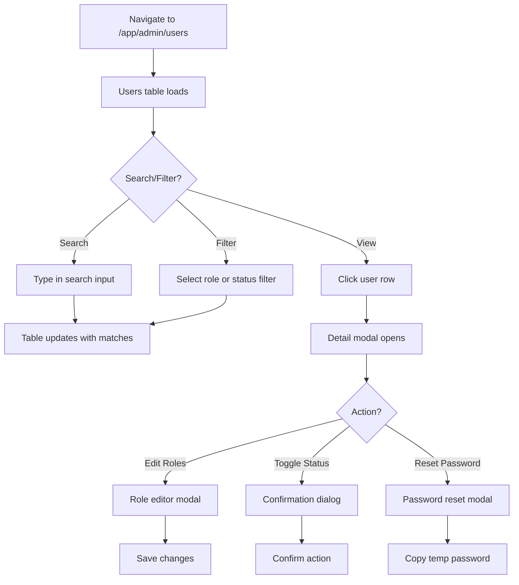
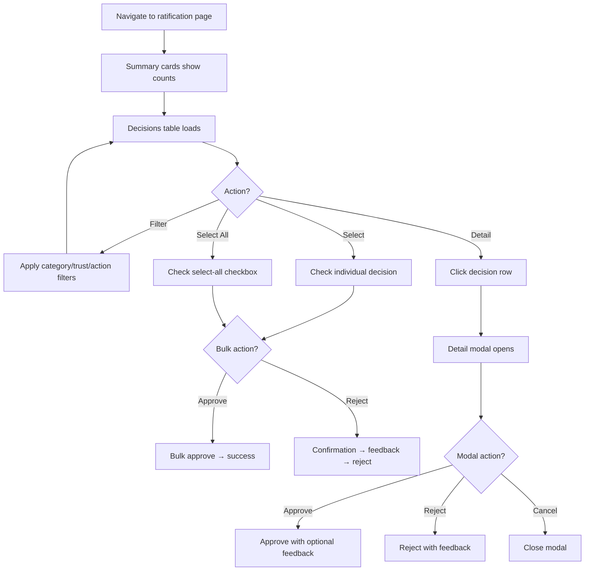
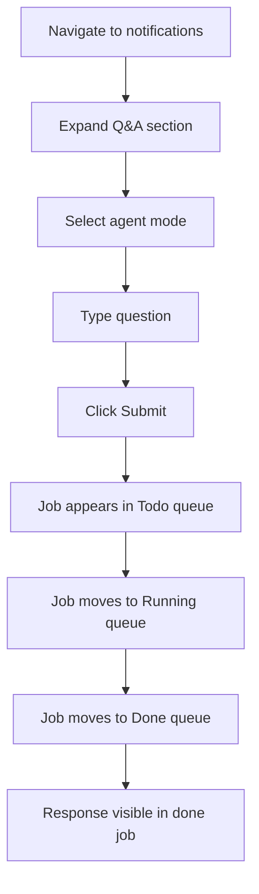

# Playwright E2E Testing — Test Journey Specifications

**Created**: 2026-02-23
**Status**: Planning Complete — Implementation deferred to v0.1.6
**Total Journeys**: 12 major user journeys across 6 test categories

---

## Journey Categories

| Category | Phase | Journeys | Est. Tests |
|----------|-------|----------|------------|
| [Auth Flows](#1-auth-flows) | 3 | 5 journeys | 25-30 |
| [Page Smoke](#2-page-smoke) | 4 | 3 journeys | 15-20 |
| [Admin Flows](#3-admin-flows) | 5 | 6 journeys | 30-40 |
| [Notifications & Q&A](#4-notifications--qa) | 6 | 8 journeys | 40-50 |
| [WebSocket & Real-Time](#5-websocket--real-time) | 7 | 5 journeys | 15-20 |
| [Visual Regression](#6-visual-regression) | 8 | 1 journey | 12 |
| **Total** | | **28 journeys** | **~140-170** |

---

## 1. Auth Flows

### Journey 1.1: New User Registration

**File**: `test_register.py`
**Priority**: Critical
**Preconditions**: Clean database, no existing users



**Test Cases**:

| # | Test | Steps | Expected Result |
|---|------|-------|-----------------|
| 1 | Valid registration | Fill valid email + strong password + confirm | Success message, redirect to login |
| 2 | Password strength meter | Type progressively stronger passwords | Meter updates: Weak → Fair → Good → Strong |
| 3 | Requirement indicators | Type password missing each requirement | Corresponding indicator stays red/unchecked |
| 4 | All requirements met | Type password meeting all 5 requirements | All indicators green/checked |
| 5 | Password mismatch | Fill different confirm password | Error: "Passwords do not match" |
| 6 | Duplicate email | Register with already-registered email | Error: "Email already registered" |
| 7 | Invalid email format | Enter "notanemail" | Form validation error |
| 8 | Weak password blocked | Enter "123" only | Submit blocked, requirements unsatisfied |
| 9 | Login link navigation | Click "Already have an account?" | Redirect to login page |

---

### Journey 1.2: User Login

**File**: `test_login.py`
**Priority**: Critical
**Preconditions**: Registered user exists in DB



**Test Cases**:

| # | Test | Steps | Expected Result |
|---|------|-------|-----------------|
| 1 | Valid login | Fill registered email + correct password | Redirect to notifications, tokens in localStorage |
| 2 | Wrong password | Fill registered email + wrong password | Error message, stay on login page |
| 3 | Unregistered email | Fill non-existent email | Error message |
| 4 | Empty email | Submit with empty email field | Form validation prevents submit |
| 5 | Empty password | Submit with empty password field | Form validation prevents submit |
| 6 | Loading state | Click Login with valid creds | Loading spinner appears briefly |
| 7 | Register link | Click "Create an account" link | Navigate to register page |

---

### Journey 1.3: Profile Viewing

**File**: `test_profile.py`
**Priority**: High
**Preconditions**: Logged-in user

**Test Cases**:

| # | Test | Steps | Expected Result |
|---|------|-------|-----------------|
| 1 | Profile displays user info | Navigate to /app/auth/profile | Email, ID, roles visible |
| 2 | Role badges render | View user-roles section | Correct role badges (user, admin) |
| 3 | Admin section visible (admin) | Login as admin, view profile | Admin tools section visible |
| 4 | Admin section hidden (user) | Login as regular user, view profile | Admin tools section hidden |
| 5 | Change password link | Click "Change Password" | Navigate to change-password page |
| 6 | Logout button | Click "Logout" | Clear localStorage, redirect to login |
| 7 | Admin dashboard link | (Admin) Click "Admin Dashboard" | Navigate to admin dashboard |
| 8 | Admin users link | (Admin) Click "Manage Users" | Navigate to user management |

---

### Journey 1.4: Password Change

**File**: `test_change_password.py`
**Priority**: High
**Preconditions**: Logged-in user

**Test Cases**:

| # | Test | Steps | Expected Result |
|---|------|-------|-----------------|
| 1 | Valid password change | Fill current + valid new + confirm | Success, can login with new password |
| 2 | Wrong current password | Fill incorrect current password | Error: "Current password is incorrect" |
| 3 | Weak new password | Fill weak new password | Requirements unsatisfied, submit blocked |
| 4 | Password mismatch | New ≠ confirm | Error: "Passwords do not match" |
| 5 | Strength meter | Type new password progressively | Meter updates dynamically |
| 6 | Cancel button | Click Cancel | Navigate back to profile |
| 7 | Post-change login | Change password, logout, login with new | Successful login with new password |

---

### Journey 1.5: Session Management

**File**: `test_session.py`
**Priority**: High
**Preconditions**: Logged-in user

**Test Cases**:

| # | Test | Steps | Expected Result |
|---|------|-------|-----------------|
| 1 | Token storage | Login, inspect localStorage | access_token and refresh_token present |
| 2 | Session persistence | Login, reload page | Still authenticated (no redirect to login) |
| 3 | Logout clears session | Click logout | localStorage cleared, redirect to login |
| 4 | Protected page redirect | Navigate to /app/notifications without auth | Redirect to /app/auth/login |
| 5 | Token in API requests | Navigate to protected page | API calls include Authorization header |

---

## 2. Page Smoke

### Journey 2.1: All Pages Load Successfully

**File**: `test_page_smoke.py`
**Priority**: Critical
**Preconditions**: Authenticated user (admin role for admin pages)

**Parametrized Test** — runs for each of the 12 pages:

```python
@pytest.mark.parametrize( "page_path, requires_admin, expected_heading", [
    ( "/app",                         False, "Welcome"           ),
    ( "/app/notifications",           False, "Notifications"     ),
    ( "/app/auth/login",              False, "Login"             ),
    ( "/app/auth/register",           False, "Create Account"    ),
    ( "/app/auth/change-password",    False, "Change Password"   ),
    ( "/app/auth/profile",            False, "Profile"           ),
    ( "/app/admin",                   True,  "Admin Dashboard"   ),
    ( "/app/admin/snapshots",         True,  "Solution Snapshots"),
    ( "/app/admin/users",             True,  "User Management"   ),
    ( "/app/admin/proxy-ratify",      True,  "Decision Ratification" ),
    ( "/app/admin/proxy-dashboard",   True,  "Trust Dashboard"   ),
    ( "/app/admin/dev-tools",         True,  "Dev Tools"         ),
])
```

**Assertions per page**:

| Check | Method |
|-------|--------|
| No network errors | `page.on( "response", check_status )` |
| No JS console errors | `page.on( "console", collect_errors )` |
| Main heading present | `expect( page.locator( "h1, h2" ) ).to_be_visible()` |
| Navigation bar rendered | `expect( page.get_by_test_id( "nav-home-link" ) ).to_be_visible()` |

---

### Journey 2.2: Navigation Bar

**File**: `test_navigation.py`
**Priority**: High
**Preconditions**: Various auth states

**Test Cases**:

| # | Test | Auth State | Expected Result |
|---|------|-----------|-----------------|
| 1 | Public links (user) | Regular user | Home, Notifications, Profile visible |
| 2 | Admin links (admin) | Admin user | All links visible including admin section |
| 3 | Admin links hidden (user) | Regular user | Admin links NOT visible |
| 4 | Logout visible | Any logged-in | Logout button and email visible |
| 5 | Login link (unauthenticated) | Not logged in | Login link visible, logout hidden |
| 6 | Mobile toggle | Narrow viewport | Hamburger menu toggles nav links |
| 7 | Link navigation | Click each nav link | Correct page loads |

---

### Journey 2.3: Landing Page

**File**: `test_landing.py`
**Priority**: Medium
**Preconditions**: Authenticated user

**Test Cases**:

| # | Test | Steps | Expected Result |
|---|------|-------|-----------------|
| 1 | Greeting displays | Navigate to /app | Personalized greeting visible |
| 2 | Stats visible | View landing page | Time saved + replays stats rendered |
| 3 | User cards | View cards section | Notifications + Profile cards visible |
| 4 | Admin cards (admin) | Login as admin, view landing | Admin tool cards visible |
| 5 | Admin cards hidden (user) | Login as regular user | Admin cards NOT visible |
| 6 | Card navigation | Click each card | Correct destination page loads |

---

## 3. Admin Flows

### Journey 3.1: Admin Dashboard Navigation

**File**: `test_admin_dashboard.py`
**Priority**: High
**Preconditions**: Admin-authenticated user

**Test Cases**:

| # | Test | Steps | Expected Result |
|---|------|-------|-----------------|
| 1 | Dashboard loads | Navigate to /app/admin | 4 tool cards rendered |
| 2 | User email displayed | View header | Admin email shown |
| 3 | Users card | Click User Management card | Navigate to /app/admin/users |
| 4 | Snapshots card | Click Solution Snapshots card | Navigate to /app/admin/snapshots |
| 5 | Ratification card | Click Decision Ratification card | Navigate to /app/admin/proxy-ratify |
| 6 | Trust card | Click Trust Dashboard card | Navigate to /app/admin/proxy-dashboard |
| 7 | Logout | Click logout button | Session cleared, redirect to login |

---

### Journey 3.2: User Management

**File**: `test_admin_users.py`
**Priority**: High
**Preconditions**: Admin-authenticated, seeded users in DB



**Test Cases**:

| # | Test | Steps | Expected Result |
|---|------|-------|-----------------|
| 1 | Table loads | Navigate to users page | User rows visible in table |
| 2 | Search by email | Type partial email in search | Table filters to matching users |
| 3 | Filter by role | Select "Admin" from role filter | Only admin users shown |
| 4 | Filter by status | Select "Active" from status filter | Only active users shown |
| 5 | Combined filters | Search + role filter | Both filters applied |
| 6 | Clear filters | Click Clear Filters | All users visible again |
| 7 | Pagination | Click next/previous | Page changes, different users shown |
| 8 | Detail modal | Click user row | Modal shows user details |
| 9 | Edit roles | Open modal → Edit Roles → toggle admin | Role updated in DB |
| 10 | Toggle status | Open modal → Toggle Status → Confirm | Status flipped in DB |
| 11 | Reset password | Open modal → Reset Password | Temp password displayed, can copy |
| 12 | Close modals | Press X or click outside | Modal closes cleanly |

---

### Journey 3.3: Solution Snapshots

**File**: `test_admin_snapshots.py`
**Priority**: Medium
**Preconditions**: Admin-authenticated, seeded snapshots in DB

**Test Cases**:

| # | Test | Steps | Expected Result |
|---|------|-------|-----------------|
| 1 | Search returns results | Type query, click Search | Results table populated |
| 2 | Threshold filter | Adjust threshold slider | Results filtered by similarity |
| 3 | Limit selector | Change to Top 25 | Result count changes |
| 4 | Results count | After search | Counter shows correct number |
| 5 | Detail modal | Click result row | Modal shows full snapshot details |
| 6 | Find Similar | Click Find Similar in detail modal | Similarity modal opens with matches |
| 7 | Delete snapshot | Click delete → confirm | Snapshot removed, table updates |
| 8 | Cancel delete | Click delete → cancel | Snapshot preserved |
| 9 | Empty search | Search with no matches | Empty state / "No results" message |

---

### Journey 3.4: Trust Dashboard

**File**: `test_admin_proxy_dashboard.py`
**Priority**: High
**Preconditions**: Admin-authenticated

**Test Cases**:

| # | Test | Steps | Expected Result |
|---|------|-------|-----------------|
| 1 | Dashboard loads | Navigate to trust dashboard | Mode selector + cards visible |
| 2 | Current mode displayed | View mode selector | Shows current trust mode |
| 3 | Change trust mode | Select different mode from dropdown | API call succeeds, UI updates |
| 4 | Trust cards render | View cards grid | Category cards with stats |
| 5 | Category filter | Select category from dropdown | Decisions table filters |
| 6 | Decisions table | View recent decisions | Table rows with decision data |
| 7 | Pagination | Navigate pages | Different decisions shown |

---

### Journey 3.5: Decision Ratification

**File**: `test_admin_proxy_ratify.py`
**Priority**: High
**Preconditions**: Admin-authenticated, pending proxy decisions in DB



**Test Cases**:

| # | Test | Steps | Expected Result |
|---|------|-------|-----------------|
| 1 | Summary cards | View page | Pending/Approved/Rejected counts correct |
| 2 | Filter by category | Select category | Table filters |
| 3 | Filter by trust level | Select trust level | Table filters |
| 4 | Filter by action | Select action type | Table filters |
| 5 | Clear filters | Click Clear | All decisions shown |
| 6 | Select individual | Check checkbox on row | Selected count updates |
| 7 | Select all | Check select-all checkbox | All visible rows selected |
| 8 | Bulk approve | Select decisions → Approve Selected | Decisions approved, removed from pending |
| 9 | Bulk reject | Select decisions → Reject Selected | Confirmation modal → confirm |
| 10 | Detail modal | Click decision row | Modal shows full decision details |
| 11 | Modal approve | Open detail → approve with feedback | Decision approved |
| 12 | Modal reject | Open detail → reject with feedback | Decision rejected |
| 13 | Pagination | Navigate pages | Correct page displayed |

---

### Journey 3.6: Role-Based Access Control (RBAC)

**File**: `test_role_gating.py`
**Priority**: Critical
**Preconditions**: Both admin and regular user accounts

**Test Cases**:

| # | Test | Steps | Expected Result |
|---|------|-------|-----------------|
| 1 | Non-admin → admin dashboard | Regular user navigates to /app/admin | Blocked (403 or redirect) |
| 2 | Non-admin → users page | Regular user navigates to /app/admin/users | Blocked |
| 3 | Non-admin → snapshots | Regular user navigates to /app/admin/snapshots | Blocked |
| 4 | Non-admin → proxy dashboard | Regular user navigates to /app/admin/proxy-dashboard | Blocked |
| 5 | Non-admin → proxy ratify | Regular user navigates to /app/admin/proxy-ratify | Blocked |
| 6 | Admin section hidden | Regular user on profile page | Admin section div not visible |
| 7 | Admin nav hidden | Regular user on any page | Admin nav links not visible |
| 8 | Admin access granted | Admin user navigates to admin pages | All pages accessible |

---

## 4. Notifications & Q&A

### Journey 4.1: Q&A Submission

**File**: `test_qa_submission.py`
**Priority**: Critical
**Preconditions**: Authenticated user, server with agents running



**Test Cases**:

| # | Test | Steps | Expected Result |
|---|------|-------|-----------------|
| 1 | Submit math question | Select Math mode, type "2+2" | Response appears in done queue |
| 2 | Submit calendar question | Select Calendar mode, type query | Response with date/time |
| 3 | Agent mode selector | Change dropdown selection | Mode updates correctly |
| 4 | TTS mode selector | Change Instant/Reliable | Selector updates |
| 5 | Empty submit blocked | Click Submit with empty input | No job created / validation error |
| 6 | Metrics update | Submit question, wait for response | Metrics section shows timing data |

---

### Journey 4.2: Claude Code Job Dispatch

**File**: `test_job_dispatch.py` (Claude Code section)
**Priority**: High
**Preconditions**: Authenticated user

**Test Cases**:

| # | Test | Steps | Expected Result |
|---|------|-------|-----------------|
| 1 | Fill all fields | Select project, enter prompt, select task type + execution mode | All fields populated |
| 2 | Dry-run submit | Enable dry-run checkbox, submit | Job appears in queue, completes fast |
| 3 | Project selector | Change project dropdown | Options: lupin, cosa, plan |
| 4 | Task type selector | Change task type | Options: Bounded, Interactive |
| 5 | Execution mode | Change execution mode | Options: CJ Flow, Socket |
| 6 | Interactive controls | Submit interactive job | Inject/Interrupt/End buttons appear |

---

### Journey 4.3: Research Job Dispatch

**File**: `test_job_dispatch.py` (Research section)
**Priority**: Medium

**Test Cases**:

| # | Test | Steps | Expected Result |
|---|------|-------|-----------------|
| 1 | Submit research job | Fill topic + budget, submit | Job appears in queue |
| 2 | Dry-run research | Enable dry-run, submit | Completes without LLM calls |
| 3 | With podcast option | Enable with-podcast checkbox | Job includes podcast generation |
| 4 | Budget range | Set budget to min/max | Validated within $0.50-$20.00 |

---

### Journey 4.4: Podcast Job Dispatch

**File**: `test_job_dispatch.py` (Podcast section)
**Priority**: Medium

**Test Cases**:

| # | Test | Steps | Expected Result |
|---|------|-------|-----------------|
| 1 | Submit podcast job | Fill source, submit | Job appears in queue |
| 2 | Dry-run podcast | Enable dry-run, submit | Completes without processing |

---

### Journey 4.5: SWE Team Job Dispatch

**File**: `test_job_dispatch.py` (SWE Team section)
**Priority**: High

**Test Cases**:

| # | Test | Steps | Expected Result |
|---|------|-------|-----------------|
| 1 | Submit SWE job | Fill task + budget + timeout, submit | Job appears in queue |
| 2 | Dry-run SWE | Enable dry-run, submit | Completes with mock data |
| 3 | Trust mode selector | Change trust mode dropdown | Options: disabled, shadow, suggest, active |
| 4 | Budget + timeout | Set values | Validated within expected ranges |

---

### Journey 4.6: Section Toggling

**File**: `test_notifications_sections.py`
**Priority**: Medium
**Preconditions**: Authenticated user on notifications page

**Test Cases**:

| # | Test | Steps | Expected Result |
|---|------|-------|-----------------|
| 1 | All toolbar buttons render | Count buttons | 11 section buttons visible |
| 2 | Toggle Q&A section | Click Q&A toolbar button | Q&A section expands/collapses |
| 3 | Toggle Job Submission | Click Job Submit button | Section toggles |
| 4 | Toggle each section | Click each of 11 buttons | Corresponding section toggles |
| 5 | Multiple sections open | Open Q&A, then Job Submit | Both sections visible |
| 6 | Default state | Fresh page load | Default sections open/closed |

---

### Journey 4.7: TTS Controls

**File**: `test_tts_controls.py`
**Priority**: Low
**Preconditions**: Authenticated user

**Test Cases**:

| # | Test | Steps | Expected Result |
|---|------|-------|-----------------|
| 1 | TTS mode selection | Change Instant/Reliable | Mode updates |
| 2 | TTS queue renders | View TTS Queue section | Active slot + pending queue visible |
| 3 | Pause button | Click Pause | Pause state indicated |
| 4 | Play button | Click Play | Play state indicated |
| 5 | Clear button | Click Clear All | Queue emptied |
| 6 | Direct TTS test | Type text, click submit | TTS request sent (audio muted in tests) |

---

### Journey 4.8: System Status

**File**: `test_system_status.py`
**Priority**: Medium
**Preconditions**: Authenticated user on notifications page

**Test Cases**:

| # | Test | Steps | Expected Result |
|---|------|-------|-----------------|
| 1 | Status section renders | Open System Status section | WS + auth indicators visible |
| 2 | WebSocket queue status | View queue-ws-status | Shows Connected/Disconnected |
| 3 | WebSocket audio status | View audio-ws-status | Shows Connected/Disconnected |
| 4 | Auth status | View auth-status | Shows authentication state |
| 5 | Refresh button | Click refresh | Status indicators update |
| 6 | Config reload | Click reload config | Config reinitialized |

---

## 5. WebSocket & Real-Time

### Journey 5.1: WebSocket Connection

**File**: `test_websocket_connection.py`
**Priority**: Critical
**Preconditions**: Authenticated user, WebSocket server active

**Test Cases**:

| # | Test | Steps | Expected Result |
|---|------|-------|-----------------|
| 1 | Queue WS connects | Login, navigate to notifications | Queue WS status shows "Connected" |
| 2 | Audio WS connects | Login, navigate to notifications | Audio WS status shows "Connected" |
| 3 | Auth handshake | Check WS messages in devtools | Auth request sent with Bearer token |
| 4 | Connection without auth | Navigate without login | WS fails to connect or rejected |

---

### Journey 5.2: Heartbeat

**File**: `test_websocket_heartbeat.py`
**Priority**: Medium
**Preconditions**: Connected WebSocket session

**Test Cases**:

| # | Test | Steps | Expected Result |
|---|------|-------|-----------------|
| 1 | Heartbeat received | Wait on page for heartbeat interval | sys_ping events received |
| 2 | Status stays green | Wait 30+ seconds | Queue WS status remains "Connected" |
| 3 | No stale warnings | Monitor console for 60 seconds | No "connection stale" warnings |

---

### Journey 5.3: Reconnection

**File**: `test_websocket_reconnect.py`
**Priority**: High
**Preconditions**: Connected WebSocket session

**Test Cases**:

| # | Test | Steps | Expected Result |
|---|------|-------|-----------------|
| 1 | Reconnect on disconnect | Simulate WS disconnect | Status shows reconnecting → connected |
| 2 | Status indicator updates | During reconnection | Visual indicator changes color |
| 3 | Max retries | Block WS endpoint | Up to 5 retry attempts visible |
| 4 | Recovery after reconnect | Reconnect successfully | Events flow again, UI updates resume |

---

### Journey 5.4: Real-Time UI Updates

**File**: `test_realtime_updates.py`
**Priority**: High
**Preconditions**: Authenticated, connected, server with agents

**Test Cases**:

| # | Test | Steps | Expected Result |
|---|------|-------|-----------------|
| 1 | Job status live update | Submit Q&A, watch queue | Job moves todo → running → done without refresh |
| 2 | Queue count updates | Submit job | Queue category counts update dynamically |
| 3 | Notification appears | Trigger notification event | Notification shows in real-time |

---

### Journey 5.5: Session Persistence Across Reloads

**File**: `test_session_persistence.py`
**Priority**: Medium
**Preconditions**: Authenticated user with active session

**Test Cases**:

| # | Test | Steps | Expected Result |
|---|------|-------|-----------------|
| 1 | Session ID in localStorage | Login, check localStorage | Session ID present (adjective-noun format) |
| 2 | Session survives reload | Reload page | Same session ID used |
| 3 | Session in WS URL | Check WS connection URL | Session ID appears in `/ws/queue/{session_id}` |
| 4 | New tab behavior | Open new tab to notifications | Session handling (shared or new) |

---

## 6. Visual Regression

### Journey 6.1: Screenshot Comparison

**File**: `test_visual_regression.py`
**Priority**: Low (Phase 8)
**Preconditions**: All pages stable, baseline screenshots generated

**Parametrized Test** — one screenshot per page:

| Page | Screenshot Name | Auth Required | Viewport |
|------|-----------------|---------------|----------|
| Login | `login.png` | No | 1280x720 |
| Register | `register.png` | No | 1280x720 |
| Change Password | `change-password.png` | Yes | 1280x720 |
| Profile | `profile.png` | Yes | 1280x720 |
| Landing | `landing.png` | Yes | 1280x720 |
| Notifications | `notifications.png` | Yes | 1280x720 |
| Admin Dashboard | `admin-dashboard.png` | Admin | 1280x720 |
| Snapshots | `admin-snapshots.png` | Admin | 1280x720 |
| Users | `admin-users.png` | Admin | 1280x720 |
| Ratification | `admin-proxy-ratify.png` | Admin | 1280x720 |
| Trust Dashboard | `admin-proxy-dashboard.png` | Admin | 1280x720 |
| Dev Tools | `admin-dev-tools.png` | Admin | 1280x720 |

**Comparison Configuration**:
- Threshold: 0.1% pixel difference tolerance
- Mask dynamic content (timestamps, session IDs, greeting names)
- Generate diff images on failure

---

## Test Helper Functions

### Auth Helpers (conftest.py)

```python
def fill_login_form( page, email, password ):
    """Fill and submit the login form."""
    page.get_by_test_id( "login-email-input" ).fill( email )
    page.get_by_test_id( "login-password-input" ).fill( password )
    page.get_by_test_id( "login-submit-btn" ).click()

def fill_register_form( page, email, password ):
    """Fill and submit the registration form."""
    page.get_by_test_id( "register-email-input" ).fill( email )
    page.get_by_test_id( "register-password-input" ).fill( password )
    page.get_by_test_id( "register-confirm-password-input" ).fill( password )
    page.get_by_test_id( "register-submit-btn" ).click()

def assert_error_message( page, expected_text ):
    """Assert error message is visible with expected text."""
    # Works across pages that have error-message elements
    error = page.locator( "[data-testid$='error-message']" )
    expect( error ).to_be_visible()
    expect( error ).to_contain_text( expected_text )

def assert_success_message( page, expected_text ):
    """Assert success message is visible with expected text."""
    success = page.locator( "[data-testid$='success-message']" )
    expect( success ).to_be_visible()
    expect( success ).to_contain_text( expected_text )
```

### Modal Helpers

```python
def open_modal( page, trigger_testid ):
    """Click a trigger element to open its associated modal."""
    page.get_by_test_id( trigger_testid ).click()
    # Wait for modal animation
    page.wait_for_timeout( 300 )

def close_modal( page, modal_testid ):
    """Close a modal by clicking its close button."""
    close_btn = page.get_by_test_id( modal_testid ).locator( "button.close, [aria-label='Close']" )
    close_btn.click()
    page.wait_for_timeout( 300 )

def assert_modal_visible( page, modal_testid ):
    """Assert that a modal is visible."""
    expect( page.get_by_test_id( modal_testid ) ).to_be_visible()

def assert_modal_hidden( page, modal_testid ):
    """Assert that a modal is hidden."""
    expect( page.get_by_test_id( modal_testid ) ).to_be_hidden()
```

### Table Helpers

```python
def get_table_row_count( page, tbody_testid ):
    """Count visible rows in a table body."""
    return page.get_by_test_id( tbody_testid ).locator( "tr" ).count()

def click_table_row( page, tbody_testid, row_index ):
    """Click a specific row in a table."""
    page.get_by_test_id( tbody_testid ).locator( "tr" ).nth( row_index ).click()

def assert_pagination_page( page, page_info_testid, expected_text ):
    """Assert pagination shows expected page info."""
    expect( page.get_by_test_id( page_info_testid ) ).to_have_text( expected_text )
```

### Queue Helpers

```python
def wait_for_queue_item( page, queue_testid, timeout=30000 ):
    """Wait for at least one item to appear in a queue category."""
    page.get_by_test_id( queue_testid ).locator( ".job-item" ).first.wait_for(
        state="visible", timeout=timeout
    )

def get_queue_count( page, queue_testid ):
    """Get the number of items in a queue category."""
    return page.get_by_test_id( queue_testid ).locator( ".job-item" ).count()

def submit_qa_question( page, question, mode="system" ):
    """Submit a Q&A question and return."""
    page.get_by_test_id( "notifications-qa-mode-select" ).select_option( mode )
    page.get_by_test_id( "notifications-qa-input" ).fill( question )
    page.get_by_test_id( "notifications-qa-submit-btn" ).click()
```

---

## Test Data Requirements

### Phase 3 (Auth)
- No pre-seeded data needed — tests register their own users
- Each test starts with clean DB

### Phase 5 (Admin)
- **Users**: 10+ seeded users with mixed roles (admin, user) and statuses (active, inactive)
- **Snapshots**: 5+ seeded solution snapshots with varied similarity scores
- **Proxy Decisions**: 10+ seeded decisions with mixed categories, trust levels, and statuses

### Phase 6 (Notifications)
- Server with agents running (at minimum: Math, Calendar, Date/Time)
- For dry-run tests: agents configured to accept dry-run flag

### Phase 7 (WebSocket)
- WebSocket server must be active
- Heartbeat interval configured (default: 30s in production, 5s with `app_debug=true`)

---

## Risk Matrix

| Journey | Risk | Mitigation |
|---------|------|------------|
| Q&A Submission | Agent response time variability | Use generous timeouts (30s+), test with Math agent (fastest) |
| WebSocket Reconnect | Timing sensitivity | Use Playwright's auto-wait, avoid manual sleep() |
| Visual Regression | Screenshot flakiness | Mask dynamic content, set appropriate threshold |
| Admin User Management | DB state complexity | Fresh DB per test, seed minimal required data |
| Real-Time Updates | Race conditions | Wait for specific DOM changes, not timeouts |
| Job Dispatch | Pipeline dependencies | Primarily test with dry-run mode to avoid LLM dependencies |
