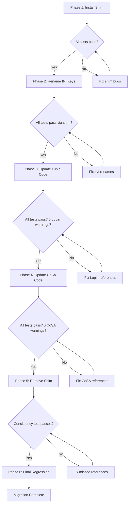

# INI Config Key Naming Convention — Design Document

**Status**: DESIGN COMPLETE — Implementation deferred to v0.1.6
**Created**: 2026-02-23 (Session 256)
**Author**: Claude Code + Ricardo Ruiz
**Scope**: `lupin-app.ini`, `lupin-app-splainer.ini`, and all referencing Python files

---

## Table of Contents

1. [Current State Analysis](#1-current-state-analysis)
2. [Target Convention](#2-target-convention)
3. [The 85 Underscore Keys — Complete Inventory](#3-the-85-underscore-keys--complete-inventory)
4. [Collision-Safe Replacement Strategy](#4-collision-safe-replacement-strategy)
5. [ConfigurationManager Backward Compatibility Shim](#5-configurationmanager-backward-compatibility-shim)
6. [Pre-Migration Testing Baseline](#6-pre-migration-testing-baseline)
7. [Phased Migration Plan](#7-phased-migration-plan)
8. [Verification Strategy](#8-verification-strategy)

---

## 1. Current State Analysis

### 1.1 Key Count Summary

The `[Lupin: Baseline]` section (inherited by Development, Testing, and Production) plus section-specific overrides contain **~195 active configuration keys** across all sections.

| Separator Style | Count | Percentage |
|-----------------|-------|------------|
| **Underscore** (`app_debug`) | ~85 | ~44% |
| **Space** (`jwt access token expire minutes`) | ~110 | ~56% |

### 1.2 Key Access Pattern

All configuration keys are accessed as **hardcoded string literals** via `ConfigurationManager`:

```python
# Typical usage pattern — no constants, no abstraction
debug    = config_mgr.get( "app_debug", default=False )
strategy = config_mgr.get( "tts_generation_strategy", default="local" )
timeout  = config_mgr.get( "notification timeout default seconds", default=120 )
```

There is no constants file, no enum, and no key registry. Every file that reads config embeds the key name directly as a string literal.

### 1.3 ConfigParser Behavior

Python's `ConfigParser` (which `ConfigurationManager` wraps):
- **Case**: Lowercases all keys automatically on read
- **Spaces/Underscores**: Preserved exactly — `app_debug` and `app debug` are **two different keys**
- **No normalization**: ConfigParser does NOT treat underscores and spaces as equivalent

This means renaming `app_debug` to `app debug` requires updating the INI file AND every file that reads that key.

### 1.4 File Impact Analysis

| Repository | Files Affected | Percentage |
|------------|---------------|------------|
| **Lupin** (non-CoSA) | ~18 files | 22.5% |
| **CoSA** (submodule) | ~62 files | 77.5% |
| **Total** | **~80 files** | 100% |

**Key insight**: CoSA dominates config key usage. 62 of 80 affected files (77.5%) are in the CoSA submodule, which is a **separate Git repository**. This means the migration requires coordinated commits across two repos.

### 1.5 File Category Breakdown

| Category | Lupin | CoSA | Total |
|----------|-------|------|-------|
| Agent system | 0 | 18 | 18 |
| Configuration | 0 | 1 | 1 |
| CRUD operations | 0 | 3 | 3 |
| Memory/Storage | 0 | 8 | 8 |
| REST/Routers | 1 | 10 | 11 |
| Tests (smoke) | 3 | 2 | 5 |
| Tests (unit) | 8 | 10 | 18 |
| Tests (integration) | 3 | 0 | 3 |
| Tests (migration/other) | 0 | 5 | 5 |
| Scripts | 2 | 0 | 2 |
| FastAPI main | 1 | 0 | 1 |
| Training/Utilities | 0 | 2 | 2 |
| **Total** | **18** | **62** | **80** |

### 1.6 Historical Context

The inconsistency arose organically:
- **Early keys** (2024-2025) used underscores, following Python naming convention
- **Newer keys** (2025.10+) adopted spaces as the project matured and readability became a priority
- The comment at line 60 of `lupin-app.ini` explicitly marks this shift: `; Plain English configuration keys (new preferred style)`

No existing deprecation or migration pattern exists for config keys.

---

## 2. Target Convention

### 2.1 Separator Rule

**All keys use spaces** as the word separator.

```ini
# BEFORE (inconsistent)
app_debug                = True
jwt access token expire minutes = 30

# AFTER (consistent)
app debug                = True
jwt access token expire minutes = 30
```

### 2.2 Naming Pattern

Keys follow a `category subcategory descriptor` pattern using natural English:

```
{category} {subcategory} {descriptor}
```

Examples:
- `app debug` (category: app, descriptor: debug)
- `jwt access token expire minutes` (category: jwt, subcategory: access token, descriptor: expire minutes)
- `agent prompt for math` (category: agent, subcategory: prompt, descriptor: for math)
- `tts generation strategy` (category: tts, descriptor: generation strategy)

### 2.3 Sorting Rule

Within each INI section, keys are organized by **logical groups** (authentication, agents, formatters, etc.), then alphabetically within each group. No global alphabetical sort — logical grouping takes precedence.

### 2.4 Splainer Parity

Every key in `lupin-app.ini` **must** have a matching entry in `lupin-app-splainer.ini`. The splainer file serves as living documentation. After migration, both files must have identical key names.

### 2.5 Model/Path Keys — Exception

Keys that represent model identifiers or HuggingFace paths retain their natural format:

```ini
# These are NOT config keys — they are model identifiers. Leave as-is.
deepily/ministral_8b_2410_ft_lora        = vllm://...
deepily/ministral_8b_2410_ft_lora_params = { ... }
kaitchup/phi_4_14b                       = vllm://...
kaitchup/phi_4_14b_params                = { ... }
mistralai/Ministral-8B-Instruct-2410     = vllm://...
```

These keys are model registry entries, not application config. They use slashes and underscores as part of model naming conventions and should not be renamed.

---

## 3. The 85 Underscore Keys — Complete Inventory

### 3.1 Category: `app_*` (Application Core)

| # | Current Key (underscore) | Proposed Key (space) | Sections |
|---|--------------------------|---------------------|----------|
| 1 | `app_debug` | `app debug` | Baseline, Testing, Testing-GCS |
| 2 | `app_verbose` | `app verbose` | Baseline, Testing, Testing-GCS |
| 3 | `app_silent` | `app silent` | Baseline |
| 4 | `app_testing` | `app testing` | Baseline, Testing, Testing-GCS |
| 5 | `app_timezone` | `app timezone` | Baseline |
| 6 | `app_config_server_name` | `app config server name` | Development |

### 3.2 Category: `auto_*` / `inject_*` (Debugging Flags)

| # | Current Key | Proposed Key | Sections |
|---|-------------|-------------|----------|
| 7 | `auto_debug` | `auto debug` | Baseline |
| 8 | `inject_bugs` | `inject bugs` | Baseline |

### 3.3 Category: `debug_*` (Category Debug Flags)

| # | Current Key | Proposed Key | Sections |
|---|-------------|-------------|----------|
| 9 | `debug_embedding` | `debug embedding` | Baseline |
| 10 | `debug_cache` | `debug cache` | Baseline |
| 11 | `debug_tts` | `debug tts` | Baseline |
| 12 | `debug_queue` | `debug queue` | Baseline |
| 13 | `debug_gister` | `debug gister` | Baseline |
| 14 | `debug_local_embedding` | `debug local embedding` | Baseline |
| 15 | `debug_normalizer` | `debug normalizer` | Baseline |
| 16 | `debug_stats` | `debug stats` | Baseline |

### 3.4 Category: `tts_*` / `stt_*` (Speech Services)

| # | Current Key | Proposed Key | Sections |
|---|-------------|-------------|----------|
| 17 | `tts_generation_strategy` | `tts generation strategy` | Baseline, Production |
| 18 | `tts_local_url_template` | `tts local url template` | Development |
| 19 | `stt_device_id` | `stt device id` | Development |
| 20 | `stt_model_id` | `stt model id` | Development |

### 3.5 Category: `agent_model_name_for_*` (DEPRECATED Agent Models)

These keys are marked DEPRECATED in the INI file but are still present. Migration should rename them for consistency, with a note that they remain deprecated.

| # | Current Key | Proposed Key | Sections |
|---|-------------|-------------|----------|
| 21 | `agent_model_name_for_calendaring` | `agent model name for calendaring` | Development |
| 22 | `agent_model_name_for_date_and_time` | `agent model name for date and time` | Development |
| 23 | `agent_model_name_for_math` | `agent model name for math` | Development |
| 24 | `agent_model_name_for_debugger` | `agent model name for debugger` | Development |
| 25 | `agent_model_name_for_weather` | `agent model name for weather` | Development |
| 26 | `agent_model_name_for_todo_list` | `agent model name for todo list` | Development |
| 27 | `agent_model_name_for_receptionist` | `agent model name for receptionist` | Development |
| 28 | `agent_model_name_for_bug_injector` | `agent model name for bug injector` | Development |
| 29 | `agent_model_name_for_function_mapping` | `agent model name for function mapping` | Development |
| 30 | `agent_model_name_for_math_refactoring` | `agent model name for math refactoring` | Development |

### 3.6 Category: `agent_prompt_for_*` (Agent Prompt Paths)

| # | Current Key | Proposed Key | Sections |
|---|-------------|-------------|----------|
| 31 | `agent_prompt_for_calendaring` | `agent prompt for calendaring` | Development |
| 32 | `agent_prompt_for_date_and_time` | `agent prompt for date and time` | Development |
| 33 | `agent_prompt_for_math` | `agent prompt for math` | Development |
| 34 | `agent_prompt_for_receptionist` | `agent prompt for receptionist` | Development |
| 35 | `agent_prompt_for_weather` | `agent prompt for weather` | Development |
| 36 | `agent_prompt_for_todo_list` | `agent prompt for todo list` | Development |
| 37 | `agent_prompt_for_debugger` | `agent prompt for debugger` | Development |
| 38 | `agent_prompt_for_debugger_minimalist` | `agent prompt for debugger minimalist` | Development |
| 39 | `agent_prompt_for_bug_injector` | `agent prompt for bug injector` | Development |
| 40 | `agent_prompt_for_function_mapping` | `agent prompt for function mapping` | Development |
| 41 | `agent_prompt_for_math_refactoring` | `agent prompt for math refactoring` | Development |

### 3.7 Category: `agent_*` (Other Agent Config)

| # | Current Key | Proposed Key | Sections |
|---|-------------|-------------|----------|
| 42 | `agent_todo_list_serialize_prompt_to_json` | `agent todo list serialize prompt to json` | Development |
| 43 | `agent_todo_list_serialize_code_to_json` | `agent todo list serialize code to json` | Development |
| 44 | `agent_receptionist_serialize_prompt_to_json` | `agent receptionist serialize prompt to json` | Development |
| 45 | `agent_function_mapping_tools_path_wo_root` | `agent function mapping tools path wo root` | Development |
| 46 | `agent_router_prompt_path_wo_root` | `agent router prompt path wo root` | (splainer only) |

### 3.8 Category: `formatter_model_name_for_*` (DEPRECATED Formatter Models)

| # | Current Key | Proposed Key | Sections |
|---|-------------|-------------|----------|
| 47 | `formatter_model_name_for_calendaring` | `formatter model name for calendaring` | Development |
| 48 | `formatter_model_name_for_date_and_time` | `formatter model name for date and time` | Development |
| 49 | `formatter_model_name_for_math` | `formatter model name for math` | Development |
| 50 | `formatter_model_name_for_weather` | `formatter model name for weather` | Development |
| 51 | `formatter_model_name_for_todo_list` | `formatter model name for todo list` | Development |
| 52 | `formatter_model_name_for_receptionist` | `formatter model name for receptionist` | Development |

### 3.9 Category: `formatter_prompt_for_*` (Formatter Prompt Paths)

| # | Current Key | Proposed Key | Sections |
|---|-------------|-------------|----------|
| 53 | `formatter_prompt_for_math_terse` | `formatter prompt for math terse` | Development |
| 54 | `formatter_prompt_for_calendaring` | `formatter prompt for calendaring` | Development |
| 55 | `formatter_prompt_for_date_and_time` | `formatter prompt for date and time` | Development |
| 56 | `formatter_prompt_for_math` | `formatter prompt for math` | Development |
| 57 | `formatter_prompt_for_weather` | `formatter prompt for weather` | Development |
| 58 | `formatter_prompt_for_todo_list` | `formatter prompt for todo list` | Development |
| 59 | `formatter_prompt_for_receptionist` | `formatter prompt for receptionist` | Development |

### 3.10 Category: `path_to_*` (File Paths)

| # | Current Key | Proposed Key | Sections |
|---|-------------|-------------|----------|
| 60 | `path_to_debugger_prompts_wo_root` | `path to debugger prompts wo root` | Development |
| 61 | `path_to_events_df_wo_root` | `path to events df wo root` | Development |
| 62 | `path_to_event_prompts_wo_root` | `path to event prompts wo root` | Development |
| 63 | `path_to_todolist_df_wo_root` | `path to todolist df wo root` | Development |
| 64 | `path_to_todolist_prompts_wo_root` | `path to todolist prompts wo root` | Development |
| 65 | `path_to_search_function_mapping_data_wo_root` | `path to search function mapping data wo root` | Development |
| 66 | `database_path_wo_root` | `database path wo root` | Development |
| 67 | `code_execution_file_path` | `code execution file path` | Development |
| 68 | `audio_recording_file_path` | `audio recording file path` | Development |

### 3.11 Category: `similarity_*` (Search Thresholds)

| # | Current Key | Proposed Key | Sections |
|---|-------------|-------------|----------|
| 69 | `similarity_threshold_confirmation` | `similarity threshold confirmation` | Baseline |
| 70 | `similarity_confirmation_enabled` | `similarity confirmation enabled` | Baseline |
| 71 | `similarity_threshold_admin_search` | `similarity threshold admin search` | Baseline |

### 3.12 Category: `normalization_*` / `storage_*` / `enable_*`

| # | Current Key | Proposed Key | Sections |
|---|-------------|-------------|----------|
| 72 | `normalization_version` | `normalization version` | Baseline |
| 73 | `storage_backend` | `storage backend` | Development, Production, Testing-GCS |
| 74 | `enable_lancedb_warmup` | `enable lancedb warmup` | Production, Testing-GCS |
| 75 | `enable_dynamic_xml_templates` | `enable dynamic xml templates` | Development |

### 3.13 Category: `prompt_format_*` (Prompt Format Configuration)

| # | Current Key | Proposed Key | Sections |
|---|-------------|-------------|----------|
| 76 | `prompt_format_template_directory` | `prompt format template directory` | Development |
| 77 | `prompt_format_default` | `prompt format default` | Development |
| 78 | `prompt_format_default_openai` | `prompt format default openai` | Development |
| 79 | `prompt_format_default_groq` | `prompt format default groq` | Development |
| 80 | `prompt_format_default_anthropic` | `prompt format default anthropic` | Development |
| 81 | `prompt_format_default_phi` | `prompt format default phi` | Development |
| 82 | `prompt_format_default_mistral` | `prompt format default mistral` | Development |
| 83 | `prompt_format_default_llama` | `prompt format default llama` | Development |
| 84 | `prompt_format_llm_deepily_ministral_8b_2410` | `prompt format llm deepily ministral 8b 2410` | Development |
| 85 | `prompt_format_llm_deepily_phi_4_14b` | `prompt format llm deepily phi 4 14b` | Development |
| 86 | `prompt_format_groq_llama_3_1_8b` | `prompt format groq llama 3 1 8b` | Development |

### 3.14 Category: `router_and_vox_command_*` / `vox_*` (Voice Commands)

| # | Current Key | Proposed Key | Sections |
|---|-------------|-------------|----------|
| 87 | `router_and_vox_command_llm_name` | `router and vox command llm name` | Development |
| 88 | `router_and_vox_command_is_completion` | `router and vox command is completion` | Development |
| 89 | `router_and_vox_command_model` | `router and vox command model` | Development |
| 90 | `vox_command_prompt_path_wo_root` | `vox command prompt path wo root` | Development |

### 3.15 Category: `xml_parsing_global_strategy` (XML Config)

| # | Current Key | Proposed Key | Sections |
|---|-------------|-------------|----------|
| 91 | `xml_parsing_global_strategy` | `xml parsing global strategy` | Development |

### 3.16 Category: `llm_*` (LLM Debugger Config)

| # | Current Key | Proposed Key | Sections |
|---|-------------|-------------|----------|
| 92 | `llm_model_keys_for_debugger` | `llm model keys for debugger` | Development |
| 93 | `llm_debugger_params_google_gemini_pro` | `llm debugger params google gemini pro` | (splainer only) |
| 94 | `llm_debugger_params_groq_llama2_70b` | `llm debugger params groq llama2 70b` | (splainer only) |
| 95 | `llm_debugger_params_groq_mixtral_8x78` | `llm debugger params groq mixtral 8x78` | (splainer only) |
| 96 | `llm_debugger_params_openai_gpt_3_5` | `llm debugger params openai gpt 3 5` | (splainer only) |
| 97 | `llm_debugger_params_openai_gpt_4` | `llm debugger params openai gpt 4` | (splainer only) |
| 98 | `llm_debugger_params_phi_4_14b` | `llm debugger params phi 4 14b` | (splainer only) |

### 3.17 Model/Path Keys (EXCLUDED from rename)

The following keys use underscores as part of **model naming conventions** (HuggingFace IDs, vendor paths) and are NOT application config keys. They should **not** be renamed:

```
deepily/ministral_8b_2410_ft_lora
deepily/ministral_8b_2410_ft_lora_params
deepily/qwen3_4b_ft_lora
deepily/qwen3_4b_ft_lora_params
deepily/llama_3_2_3b_ft_lora
deepily/llama_3_2_3b_ft_lora_params
kaitchup/phi_4_14b
kaitchup/phi_4_14b_params
mistralai/Ministral-8B-Instruct-2410
mistralai/Ministral-8B-Instruct-2410_params
```

### 3.18 Summary Count

| Category | Keys to Rename |
|----------|---------------|
| app_* | 6 |
| auto_/inject_ | 2 |
| debug_* | 8 |
| tts_/stt_* | 4 |
| agent_model_name_for_* (DEPRECATED) | 10 |
| agent_prompt_for_* | 11 |
| agent_* (other) | 5 |
| formatter_model_name_for_* (DEPRECATED) | 6 |
| formatter_prompt_for_* | 7 |
| path_to_* / database_ / code_ / audio_ | 9 |
| similarity_* | 3 |
| normalization_ / storage_ / enable_* | 4 |
| prompt_format_* | 11 |
| router_and_vox_command_* / vox_* | 4 |
| xml_parsing_global_strategy | 1 |
| llm_* (debugger) | 7 |
| **TOTAL** | **98** |

**Note**: The actual count is ~98 rather than the original estimate of ~85. The discrepancy comes from splainer-only keys (6 `llm_debugger_params_*` entries) and section-override duplicates being counted once per unique key name.

---

## 4. Collision-Safe Replacement Strategy

### 4.1 The Problem: Substring Collisions

When performing find-and-replace across ~80 files, shorter key names can be substrings of longer key names:

```
agent_todo_list_serialize_prompt_to_json    (42 chars)
agent_todo_list_serialize_code_to_json      (40 chars)
agent_todo_list                             (15 chars — DANGEROUS prefix)
```

If we replace `agent_todo` before `agent_todo_list_serialize_prompt_to_json`, the longer key gets corrupted:

```python
# BEFORE: correct
config_mgr.get( "agent_todo_list_serialize_prompt_to_json" )

# AFTER broken replacement of "agent_todo" → "agent todo":
config_mgr.get( "agent todo_list_serialize_prompt_to_json" )  # WRONG!
```

### 4.2 The Solution: Longest-Match-First Ordering

Sort all 98 underscore keys by **string length descending**. Replace the longest keys first. This guarantees that no shorter prefix match corrupts a longer key name.

```
# Replacement order (longest first):
1. path_to_search_function_mapping_data_wo_root  (49 chars)
2. agent_receptionist_serialize_prompt_to_json    (48 chars)
3. agent_todo_list_serialize_prompt_to_json       (42 chars)
4. agent_function_mapping_tools_path_wo_root      (42 chars)
5. agent_todo_list_serialize_code_to_json         (40 chars)
...
97. app_debug                                     (9 chars)
98. foo                                           (3 chars — the default section test key)
```

### 4.3 Migration Mapping File

Generate a machine-readable mapping file (`src/conf/config-key-migration-map.json`) for programmatic use:

```json
{
  "version": "1.0",
  "description": "INI config key rename mapping: underscore → space",
  "mappings": [
    {
      "old": "path_to_search_function_mapping_data_wo_root",
      "new": "path to search function mapping data wo root",
      "length": 49,
      "deprecated": false
    },
    {
      "old": "agent_receptionist_serialize_prompt_to_json",
      "new": "agent receptionist serialize prompt to json",
      "length": 48,
      "deprecated": false
    }
  ]
}
```

This mapping file can be consumed by a migration script for automated replacement.

### 4.4 Automated Migration Script

Create a Python script (`src/scripts/migrate-config-keys.py`) that:

1. Reads the mapping file
2. Sorts by length descending (longest-match-first)
3. For each Python file in the target directory:
   - Reads file content
   - Applies replacements in order (longest first)
   - Only replaces within string literals (between quotes)
   - Writes modified file
4. Reports changes per file

The script should support `--dry-run` mode for safety.

---

## 5. ConfigurationManager Backward Compatibility Shim

### 5.1 Purpose

Allow **gradual migration** — old key names continue to work during the transition period, with deprecation warnings logged to catch stragglers.

### 5.2 Implementation Sketch

Add a `_key_aliases` dict to `ConfigurationManager` and modify the `get()` method:

```python
class ConfigurationManager:

    # Populated from config-key-migration-map.json at init time
    _key_aliases = {
        "app_debug"              : "app debug",
        "tts_generation_strategy": "tts generation strategy",
        # ... all 98 mappings
    }

    def get( self, key, default=None, section=None, ... ):
        """
        Requires:
            - key is a non-empty string
        Ensures:
            - returns value for key, checking aliases if primary lookup fails
            - logs deprecation warning when alias is used
        """
        # Primary lookup (new key name)
        value = self._get_raw( key, section=section )

        if value is None and key in self._key_aliases:
            # Old key used — lookup via new name, log warning
            new_key = self._key_aliases[ key ]
            value   = self._get_raw( new_key, section=section )
            if value is not None:
                print( f"DEPRECATION WARNING: Config key '{key}' renamed to '{new_key}'. "
                       f"Update your code to use the new name." )

        if value is None:
            return default

        return value
```

### 5.3 Shim Lifecycle

| Phase | Shim State | Behavior |
|-------|------------|----------|
| Phase 1 | Installed, active | Old keys work via alias + deprecation warning |
| Phase 2-4 | Active, warnings logged | Migration in progress across Lupin + CoSA |
| Phase 5 | Assertion mode | Old keys trigger `AssertionError` instead of warning |
| Phase 6 | Removed | Clean codebase, no aliases |

### 5.4 Key Alias Source

The alias dict should be loaded from `src/conf/config-key-migration-map.json` at startup rather than hardcoded, so it can be maintained in one place.

---

## 6. Pre-Migration Testing Baseline

### 6.1 Required Green Baseline

Before any migration changes, all test suites must pass:

| Test Suite | Command | Expected |
|------------|---------|----------|
| Unit tests | `pytest src/tests/unit/` | 1534+ pass |
| WebSocket smoke tests | `./src/scripts/run-websocket-smoke-tests.sh` | 50 pass |
| Integration tests | `./src/tests/run-integration-tests.sh -v` | 85+ pass |
| Interactive proxy tests | `python src/tests/smoke/test_proxy_integration.py --group all --auto-proxy --no-confirm` | 12 scenarios pass |

### 6.2 New Tests to Add Pre-Migration

#### Config Key Coverage Test

A new test that verifies all 195+ keys in `lupin-app.ini` are reachable from at least one Python file:

```python
def test_all_config_keys_reachable():
    """
    Requires:
        - lupin-app.ini is parseable
        - All Python source files are readable
    Ensures:
        - Every non-commented key in lupin-app.ini appears in at least one .py file
        - Reports orphaned keys (defined in INI but never referenced)
    """
```

#### Config Key Consistency Test

A test that asserts no underscore-separated keys remain (to be added in Phase 5):

```python
def test_no_underscore_keys_in_ini():
    """
    Requires:
        - lupin-app.ini and lupin-app-splainer.ini are parseable
    Ensures:
        - No key contains an underscore character
        - Model/path keys (containing '/') are exempt
    """
```

---

## 7. Phased Migration Plan

### Phase 1: Backward-Compat Shim (~1 day)

**Goal**: Install safety net before any renames.

**Tasks**:
1. Create `src/conf/config-key-migration-map.json` with all 98 mappings
2. Modify `ConfigurationManager.get()` to check aliases on miss
3. Add deprecation warning logging
4. Write unit tests for the shim itself (alias lookup, warning emission, primary key priority)
5. Run full test suite — must pass with zero changes elsewhere

**Verification**: All existing tests pass. The shim is dormant (no aliases triggered yet because INI still has old names).

### Phase 2: Rename Keys in INI + Splainer (~1 day)

**Goal**: Update both INI files simultaneously.

**Tasks**:
1. In `lupin-app.ini`: rename all 98 underscore keys to space-separated equivalents
2. In `lupin-app-splainer.ini`: rename matching keys
3. Verify both files parse correctly
4. Run full test suite — **all tests should still pass** because the shim catches old key references in Python code

**Verification**: All tests pass via the backward-compat shim. Deprecation warnings logged for every underscore key access.

### Phase 3: Update Lupin Code References (~2-3 days)

**Goal**: Fix all 18 Lupin-only files.

**Tasks**:
1. Run migration script in dry-run mode on Lupin files
2. Review proposed changes
3. Apply changes
4. Run full test suite
5. Verify zero deprecation warnings from Lupin files

**Files** (18):
- `src/fastapi_app/main.py`
- `src/scripts/init_test_database.py`
- `src/scripts/migrate_synonymous_questions.py`
- `src/tests/integration/run_gcs_tests_standalone.py`
- `src/tests/integration/test_lancedb_gcs_integration.py`
- `src/tests/integration/test_lancedb_local_isolation.py`
- `src/tests/smoke/test_proxy_integration.py`
- `src/tests/smoke/test_simple_agents_instantiation_smoke.py`
- `src/tests/smoke/test_vllm_dynamic_client_smoke.py`
- `src/tests/smoke/utilities/live_pipeline_base.py`
- `src/tests/unit/test_answer_is_correct.py`
- `src/tests/unit/test_calculator_mock_pipeline.py`
- `src/tests/unit/test_crud_for_dataframes_agent.py`
- `src/tests/unit/test_crud_mock_pipeline.py`
- `src/tests/unit/test_crud_queue_integration.py`
- `src/tests/unit/test_lancedb_gcs_manager.py`
- `src/tests/unit/test_local_embedding_engine.py`
- `src/tests/unit/test_swe_team_delegation.py`

**Verification**: All tests pass. Zero deprecation warnings from Lupin code.

### Phase 4: Update CoSA Code References (~3-4 days, separate repo)

**Goal**: Fix all 62 CoSA files. This is the largest phase.

**Important**: CoSA is a separate Git repository. Changes must be committed separately.

**Tasks**:
1. Run migration script in dry-run mode on CoSA files
2. Review proposed changes (high file count — review by category)
3. Apply changes in batches:
   - Batch 1: Agent system (18 files)
   - Batch 2: Memory system (8 files)
   - Batch 3: REST framework (10 files)
   - Batch 4: CRUD operations (3 files) + configuration (1 file)
   - Batch 5: Tests (22 files)
   - Batch 6: Training + utilities (2 files)
4. Run full test suite after each batch
5. Commit to CoSA repo after all batches verified

**Verification**: All tests pass. Zero deprecation warnings from CoSA code.

### Phase 5: Remove Backward-Compat Shim + Add Consistency Test (~1 day)

**Goal**: Clean finish — remove migration infrastructure, add guardrail tests.

**Tasks**:
1. Switch shim from deprecation-warning mode to assertion mode
2. Run full test suite — any assertion failure means a missed reference
3. If clean, remove the shim entirely
4. Add `test_no_underscore_keys_in_ini()` as a permanent guardrail
5. Optionally archive `config-key-migration-map.json` (or delete)
6. Update CLAUDE.md to document the "spaces only" convention

**Verification**: All tests pass. Consistency test passes. No shim code remains.

### Phase 6: Final Regression Run (~0.5 day)

**Goal**: Full confidence before closing the migration.

**Tasks**:
1. Run complete test suite across all tiers:
   - `pytest src/tests/unit/`
   - `./src/scripts/run-websocket-smoke-tests.sh`
   - `./src/tests/run-integration-tests.sh -v`
   - `python src/tests/smoke/test_proxy_integration.py --group all --auto-proxy --no-confirm`
2. Manual spot-check: start FastAPI server, exercise a few agent queries
3. Verify `lupin-app.ini` and `lupin-app-splainer.ini` have identical key names

---

## 8. Verification Strategy

### 8.1 Per-Phase Verification

After each phase, the full test suite must pass:



### 8.2 Deprecation Warning Tracking

During Phases 2-4, track deprecation warnings by source file:

```
DEPRECATION WARNING: Config key 'app_debug' renamed to 'app debug'.
  Source: src/fastapi_app/main.py:42
```

The count of unique warning sources should decrease as each phase completes:
- After Phase 2: ~80 files (all Python code using old names)
- After Phase 3: ~62 files (CoSA code only)
- After Phase 4: 0 files
- After Phase 5: Shim removed, no warnings possible

### 8.3 Permanent Guardrail

After Phase 5, the `test_no_underscore_keys_in_ini()` test runs as part of the standard unit test suite. Any future addition of underscore keys to the INI file will fail CI.

### 8.4 Rollback Plan

At any phase, rollback is straightforward:
- **Phase 1**: Remove shim code from ConfigurationManager
- **Phase 2**: `git checkout` the INI files
- **Phase 3-4**: `git checkout` modified Python files
- **Phase 5**: Re-install shim if needed

The backward-compat shim is specifically designed to make Phase 2 (the riskiest change) **safe** — if any reference is missed, the shim catches it at runtime.

---

## Appendix A: Risk Assessment

| Risk | Likelihood | Impact | Mitigation |
|------|-----------|--------|------------|
| Missed reference in CoSA | Medium | Medium | Backward-compat shim catches at runtime |
| Model/path key accidentally renamed | Low | High | Explicit exclusion list + review |
| Test suite has hardcoded old key names | High | Low | Tests are updated in same phase as source |
| Splainer file out of sync with INI | Medium | Low | Parity check test added |
| CoSA repo commit coordination | Medium | Medium | Phase 4 is dedicated to CoSA |

## Appendix B: Decision to Standardize on Spaces (Not Underscores)

Why spaces and not underscores?

1. **Majority already uses spaces** (56% of existing keys)
2. **Readability**: `jwt access token expire minutes` reads more naturally than `jwt_access_token_expire_minutes`
3. **Consistency with existing new-style keys**: The project explicitly adopted spaces for new keys (line 60 comment in INI)
4. **ConfigParser preserves spaces**: No technical limitation preventing space-separated keys
5. **Precedent**: The most complex, well-thought-out keys (ElevenLabs, podcast, decision proxy) all use spaces

## Appendix C: Estimated Timeline

| Phase | Effort | Calendar Days |
|-------|--------|--------------|
| Phase 1: Shim | 1 day | Day 1 |
| Phase 2: INI renames | 1 day | Day 2 |
| Phase 3: Lupin code | 2-3 days | Days 3-5 |
| Phase 4: CoSA code | 3-4 days | Days 6-9 |
| Phase 5: Cleanup | 1 day | Day 10 |
| Phase 6: Regression | 0.5 day | Day 10 |
| **Total** | **8.5-10.5 days** | **~2 weeks** |

---

*End of design document.*
