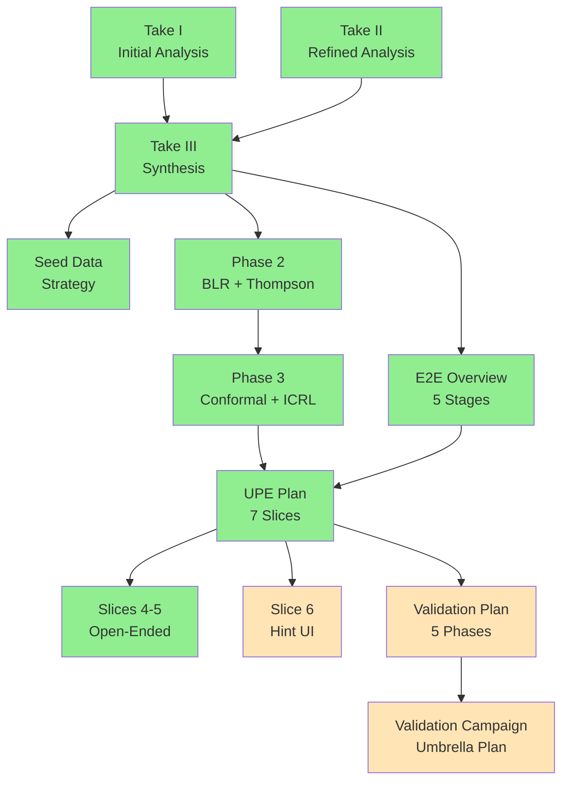

# Trust Proxy Preference Learning — Index

**Created**: 2026-03-25 | **Last Updated**: 2026-03-25

## Quick Links

| # | Document | Purpose |
|---|----------|---------|
| — | [This File](00-index.md) | Navigation hub |
| 1 | [Preference Learning Analysis — Take I](2026.02.23-decision-proxy-preference-learning-analysis-take-I.md) | Initial analysis of preference learning approaches |
| 2 | [Preference Learning Analysis — Take II](2026.02.23-decision-proxy-preference-learning-analysis-take-II.md) | Refined analysis with alternative approaches |
| 3 | [Preference Learning Synthesis — Take III](2026.02.24-decision-proxy-preference-learning-analysis-take-III-synthesis.md) | Synthesis of Takes I-II into actionable plan |
| 4 | [Phase 2: BLR + Thompson Sampling](2026.02.24-phase-2-blr-thompson-sampling-plan.md) | Bayesian Logistic Regression + Thompson Sampling design |
| 5 | [Phase 3: Conformal + ICRL](2026.02.24-phase-3-conformal-icrl-plan.md) | Conformal prediction + In-Context RL design |
| 6 | [Seed Data Strategy](2026.02.24-preference-learning-seed-data-plan.md) | Bootstrap strategy for 50 seed scenarios |
| 7 | [End-to-End Trust Proxy Overview](2026.02.27-end-to-end-trust-proxy-overview.md) | Full conceptual walkthrough (5 stages) |
| 8 | [Universal Prediction Engine Plan](2026.02.27-universal-prediction-engine-plan.md) | UPE master plan — 7 vertical slices |
| 9 | [Slices 4-5: Open-Ended Prediction](2026.03.02-slices-4-5-open-ended-prediction.md) | Two-tier strategy: CBR retrieval + LLM synthesis |
| 10 | [Slice 6: Prediction Hint UI Rendering](2026.03.02-slice-6-prediction-hint-ui-rendering.md) | Browser display of prediction hints in notification cards |
| 11 | [UPE Live E2E Validation Plan](2026.03.11-upe-live-e2e-validation-plan.md) | 5-phase validation campaign for all 7 slices |
| 12 | [Prediction System Validation Campaign](2026.03.25-prediction-system-validation-campaign.md) | Umbrella plan: consolidated UPE + SWE proxy validation |

## Phase Overview

| Phase | Description | Status | Sessions |
|-------|-------------|--------|----------|
| 1 | CBR Foundation — Case-Based Reasoning with LanceDB embeddings | DONE | 258-262 |
| 2 | BLR + Thompson Sampling — Bayesian trust escalation | DONE | 264-265 |
| 3 | Conformal + ICRL — Coverage guarantees + LLM reasoning | DONE | 266 |
| 4 | Universal Prediction Engine — 7 slices for all notification types | CODE COMPLETE | 267-340 |
| 5 | Live E2E Validation — Threshold tuning, gap tests, visual QA | PENDING | — |

## Document Dependency Graph

Legend: Green = complete, Yellow = pending

## Key Code References

| Resource | Path |
|----------|------|
| Prediction Engine | `src/cosa/agents/prediction_engine/` (5 files) |
| Decision Proxy Agent | `src/cosa/agents/decision_proxy/` (13 files) |
| CBR Decision Store | `src/cosa/agents/decision_proxy/cbr_decision_store.py` |
| Trust Tracker | `src/cosa/agents/decision_proxy/trust_tracker.py` |
| Category Classifier | `src/cosa/agents/prediction_engine/notification_category_classifier.py` |
| Accuracy Comparators | `src/cosa/agents/prediction_engine/accuracy_comparators.py` |
| DB Schema | `src/scripts/sql/2026.02.14-decision-proxy-schema.sql` |
| INI Config | `src/conf/lupin-app.ini` (decision proxy + prediction engine keys) |
| Unit Tests | `src/tests/unit/test_prediction_engine_*.py` (87 tests) |
| E2E Tests | `src/tests/integration/test_prediction_engine_e2e.py` (21 tests) |
| Visual QA | `src/tests/smoke/test_prediction_hint_visual_qa.py` (7 scenarios) |
| Production Docs | `src/docs/proxy-admin-guide.md` |

## Cross-References

### SWE Team Decision Proxy Architecture

The SWE-specific proxy extends the general decision proxy with domain-specific strategies:

- **Directory**: [`src/rnd/2026.02.14-swe-team-phase-4-decision-proxy-architecture/`](../2026.02.14-swe-team-phase-4-decision-proxy-architecture/00-index.md) (8 files, has own index)
- **Status**: All 8 phases DONE

### Scattered SWE Proxy Files (in `src/rnd/` root)

These SWE-specific docs live outside both directories:

- [`2026.02.23-swe-team-ui-bugfixes-dry-run-proxy-decisions.md`](../2026.02.23-swe-team-ui-bugfixes-dry-run-proxy-decisions.md) — UI fixes + dry-run decisions
- [`2026.02.25-swe-proxy-data-origin-and-workload-generator.md`](../2026.02.25-swe-proxy-data-origin-and-workload-generator.md) — Layer 1 dry-run + workload catalog
- [`2026.02.25-unbounded-vs-swe-team-comparative-analysis.md`](../2026.02.25-unbounded-vs-swe-team-comparative-analysis.md) — Architectural comparison
