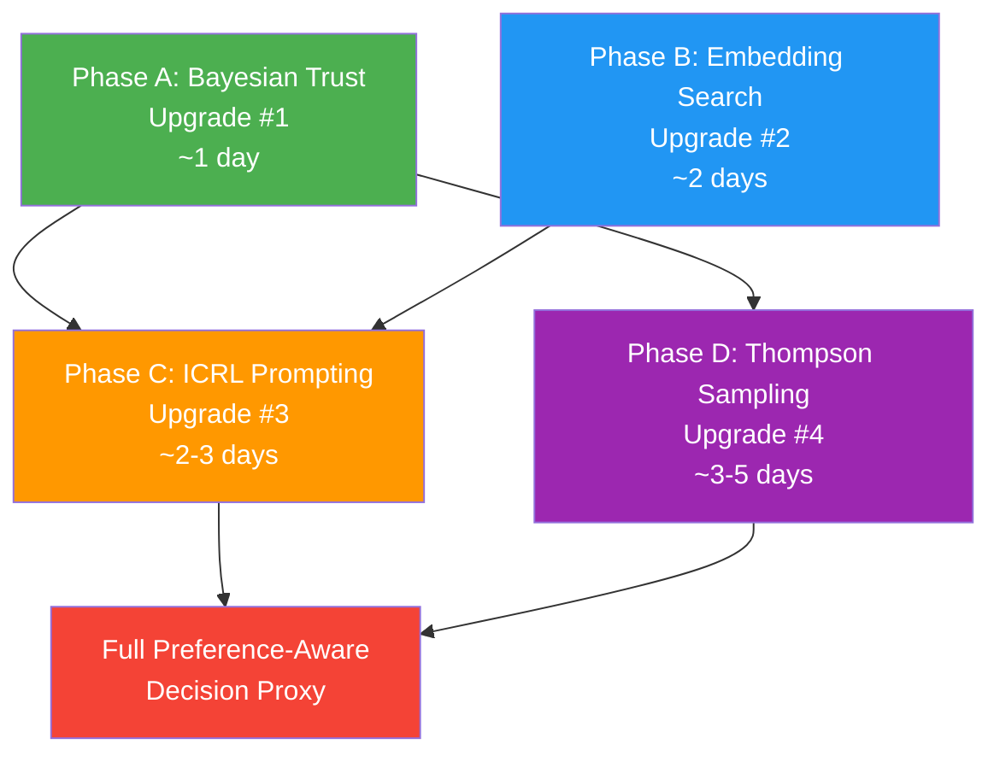

# Decision Proxy Preference Learning — Gap Analysis & Upgrade Paths

**Date**: 2026-02-23
**Status**: RESEARCH COMPLETE
**Author**: Claude Opus 4.6 + R. Ruiz
**Session**: 257
**Related**: [Decision Proxy Architecture (Phase 4)](../2026.02.14-swe-team-phase-4-decision-proxy-architecture/00-index.md)

---

## 1. Current Implementation Audit

The decision proxy implements a graduated autonomy system with a 7-stage feedback loop. Here is an end-to-end trace through the actual codebase:

### Stage 1: Event Ingestion

A notification arrives via WebSocket subscription. The proxy router receives events matching `SUBSCRIBED_EVENTS` (defined in `config.py:33-37`):

```python
# src/cosa/agents/decision_proxy/config.py:33-37
SUBSCRIBED_EVENTS = [
    "notification_queue_update",
    "job_state_transition",
    "sys_ping"
]
```

### Stage 2: Classification (Two-Pass)

The `EngineeringClassifier` (`engineering_classifier.py:28-152`) classifies the question text using a two-pass approach:

1. **Pass 1 — Sender ID prefix hint** (`engineering_classifier.py:76`): Sender prefixes like `swe.tester` map to category `"testing"` via `SENDER_CATEGORY_HINTS` (line 21-25).

2. **Pass 2 — Keyword analysis** (`engineering_classifier.py:79-95`): Each of the 6 engineering categories (`engineering_categories.py:36-87`) has a keyword list. The classifier counts keyword matches against the lowercased question, computes `base_confidence = min( 0.5 + ( match_count * 0.1 ), 0.95 )`, and optionally boosts by +0.15 for sender hint alignment.

3. **Fallback**: No keyword match and no sender hint returns `( "general", 0.3 )` (line 104).

### Stage 3: Trust Level Lookup

The `EngineeringStrategy.evaluate()` (`engineering_strategy.py:226-271`) retrieves the per-category trust level from `TrustTracker`:

```python
# engineering_strategy.py:251
trust_level = self.trust_tracker.get_level( category )
```

`TrustTracker` (`trust_tracker.py:221-391`) maintains a `categories` dict mapping category names to `CategoryTrust` instances. Each `CategoryTrust` (lines 21-218) tracks:
- Rolling decision history as `( timestamp, success_bool )` tuples (line 62)
- Time-weighted effective count via exponential decay (lines 149-171)
- Trust level derived from **counter thresholds**: L2=50, L3=200, L4=500, L5=1000 (lines 54-59)

### Stage 4: Trust-Gated Routing

The `gate()` method (`engineering_strategy.py:149-193`) routes based on trust level and operating mode:

| Mode | L1 | L2 | L3+ |
|------|----|----|-----|
| `shadow` | shadow | shadow | shadow |
| `suggest` | shadow | suggest | suggest |
| `active` | shadow | suggest | act |

Circuit breaker check happens first (line 173): if `CircuitBreaker.check()` returns `False`, the gate returns `"defer"`.

### Stage 5: Decision Production

For `"act"` or `"suggest"` actions, `decide()` (`engineering_strategy.py:195-224`) produces a value:
- High-risk categories (`deployment`, `destructive`, `architecture`) → `"requires_review"`
- All others → `"approved"`

This is a **static heuristic** — no learning, no historical awareness.

### Stage 6: Persistence

`ProxyDecisionRepository` (`proxy_decision_repository.py:22-371`) persists decisions to PostgreSQL:
- `log_shadow()` (lines 51-95): L1 observe-only records
- `log_decision()` (lines 97-148): L2+ decisions with ratification state

### Stage 7: Ratification Feedback Loop

The ratification endpoint (`decision_proxy.py:165-257`) receives human approve/reject signals:

```python
# decision_proxy.py:221-234
updated = decision_repo.ratify(
    decision_id = uuid.UUID( decision_id ),
    approved    = approved,
    ratified_by = user_email,
    feedback    = feedback
)
trust_repo.update_after_ratification(
    user_email = user_email,
    domain     = decision.domain,
    category   = decision.category,
    approved   = approved
)
```

The `TrustStateRepository.update_after_ratification()` (`proxy_decision_repository.py:459-494`) increments counters (`total_decisions`, `successful_decisions`, `rejected_decisions`), but these counters feed back into the `TrustTracker`'s `_effective_decision_count()` — which **only counts whether to promote trust level**, not what answers the user prefers.

### What the Current System Does Well

1. **Category isolation**: Bad performance in `destructive` doesn't affect `testing` trust (per-category `CategoryTrust` instances)
2. **Circuit breaker**: Automatic demotion on error rate spikes or confidence collapse (`circuit_breaker.py:27-263`) with configurable cooldown (`DEFAULT_CB_RECOVERY_COOLDOWN_SECONDS = 3600`)
3. **Shadow mode progression**: L1 observe → L2 suggest → L3 act follows the SAE J3016 pattern
4. **Time-weighted decay**: Exponential decay with configurable half-life prevents stale history from dominating (`trust_tracker.py:149-171`)
5. **Cap levels**: High-risk categories (`destructive` capped at L2, `deployment` at L3) can never reach full autonomy

### What the Current System Does NOT Do

1. **No preference learning**: The system learns *whether to act* (trust level), not *which answers users prefer*
2. **No semantic similarity**: `find_similar()` (`proxy_decision_repository.py:283-326`) uses `ILIKE` substring matching — `"refactor auth module"` will NOT match `"restructure authentication service"`
3. **No uncertainty modeling**: Trust levels are binary thresholds, not probability distributions
4. **No rate awareness**: 50 successes out of 50 total is treated the same as 50 successes out of 500 total
5. **No decision recall at decision time**: Historical decisions are stored but never consulted when making new decisions
6. **Static decision logic**: `decide()` returns hardcoded strings, not learned preferences

---

## 2. Published Foundations

The current architecture maps to three well-established patterns from the literature:

### SAE J3016 Graduated Autonomy (L0-L5)

The Society of Automotive Engineers' J3016 standard defines 6 levels of driving automation (L0-L5). The decision proxy's L1-L5 trust levels are a direct mapping:

| SAE Level | Description | Proxy Level | Proxy Description |
|-----------|-------------|-------------|-------------------|
| L0 | No automation | — | (not applicable) |
| L1 | Driver assistance | L1 Shadow | Predict only, log, don't act |
| L2 | Partial automation | L2 Suggest | Queue as provisional, human ratifies |
| L3 | Conditional automation | L3 Act + Notify | Commit decision, async audit |
| L4 | High automation | L4 Autonomous + Audit | 10% random audit |
| L5 | Full automation | L5 Full Autonomy | Circuit breaker only safety net |

This is a **valid scaffold** — the levels are well-motivated and the progression makes sense. The gap is not in the scaffold but in *how decisions within each level are made*.

### Circuit Breaker Pattern (Nygard, "Release It!")

Michael Nygard's circuit breaker pattern (from *Release It!*, 2007/2018) is a fault-tolerance mechanism that prevents cascading failures by "tripping" when error rates exceed thresholds. The proxy's `CircuitBreaker` class (`circuit_breaker.py:27-263`) is a faithful implementation:

- **Error rate check**: `cat.error_rate > self.error_rate_threshold` (line 182)
- **Confidence collapse check**: `avg_confidence < self.confidence_collapse_threshold` (line 190)
- **Auto-demotion**: `trust_tracker.demote_category()` on trip (line 216)
- **Cooldown recovery**: Time-based automatic recovery (lines 99-110)

### Shadow Mode from Autonomous Vehicles

"Shadow mode" (also called "ghost mode" or "silent testing") is a standard practice in autonomous vehicle development where the autonomous system runs in parallel with human control, logging what it *would have done* without taking action. Tesla, Waymo, and Cruise all used shadow mode before enabling autonomous driving.

The proxy's L1 shadow mode serves the same purpose: build confidence in the classifier and decision logic before granting authority.

---

## 3. Gap Analysis: Counter-Based vs Preference-Aware

### The "50 of 50 vs 50 of 500" Problem

The current trust level computation (`trust_tracker.py:67-86`) counts time-weighted successes against fixed thresholds:

```python
# trust_tracker.py:77-84
effective_count = self._effective_decision_count()
computed_level = 1
for lvl in ( 2, 3, 4, 5 ):
    if effective_count >= self.thresholds[ lvl ]:
        computed_level = lvl
    else:
        break
```

This means:
- **50 successes out of 50 total** → L2 (threshold met)
- **50 successes out of 500 total** → L2 (same threshold met, despite 90% rejection rate)

The circuit breaker partially addresses this by checking `error_rate`, but only reactively (after the damage is done) and with a hard threshold (`DEFAULT_CB_ERROR_RATE_THRESHOLD = 0.15`). There is no mechanism to express *how confident we are* in the trust level itself.

### Keyword Classification Misses Semantic Similarity

The classifier (`engineering_classifier.py:79-95`) uses exact substring matching:

```python
# engineering_classifier.py:85
match_count = sum( 1 for kw in keywords if kw in question_lower )
```

This means:
- `"refactor auth module"` → matches `"refactor"` → category `architecture` ✓
- `"restructure authentication service"` → matches `"restructure"` → category `architecture` ✓
- `"reorganize the login system"` → matches nothing → fallback `"general"` ✗

The keywords in `engineering_categories.py:36-87` are finite lists (10-15 terms per category). Any synonym, paraphrase, or domain-specific phrasing that isn't in the list is missed.

### No Mechanism to Learn WHAT Answers Are Preferred

The entire feedback loop (Stages 1-7 above) updates trust *counters* but never stores or retrieves *what the preferred answer was*. When a human rejects a decision:

1. `ratify( approved=False )` → increments `rejected_decisions` counter
2. `TrustTracker.record_decision( success=False )` → decrements effective count
3. That's it. The *actual preferred answer* (what the human chose instead) is never captured.

This means the system can never learn patterns like:
- "When the user is asked about `destructive` operations on test files, they usually approve"
- "When the user is asked about `deployment` to staging, they approve; to production, they reject"

### `find_similar()` Exists but Isn't Wired In

`ProxyDecisionRepository.find_similar()` (`proxy_decision_repository.py:283-326`) already exists but is never called during the decision pipeline. It's only available as an API query tool, not as an input to `decide()`.

---

## 4. Upgrade Path 1: Bayesian Beta-Bernoulli Trust

### Foundation

**Standard conjugate prior theory** (DeGroot, *Optimal Statistical Decisions*, 1970). The Beta distribution is the conjugate prior for the Bernoulli likelihood, meaning that updating beliefs about a success rate is simply:

```
Beta( α + successes, β + failures )
```

where α=β=1 gives a uniform (uninformative) prior.

### What It Replaces

The current `CategoryTrust.level` property (`trust_tracker.py:67-86`) uses fixed counter thresholds:

```python
# Current: trust_tracker.py:80-84
for lvl in ( 2, 3, 4, 5 ):
    if effective_count >= self.thresholds[ lvl ]:
        computed_level = lvl
```

### What It Adds

1. **Uncertainty quantification**: Instead of "50 successes → L2", we get "Beta(51, 1) → 95% credible interval [0.94, 1.00] → high confidence L2"
2. **Rate awareness**: Beta(51, 1) ≠ Beta(51, 451) — the first has 100% success rate with high confidence, the second has 10% success rate with high confidence
3. **Credible intervals**: Can require that the *lower bound* of the 95% credible interval exceeds a threshold, not just the point estimate

### Code Sketch

Drop-in replacement for `CategoryTrust.level`:

```python
import scipy.stats as stats

@property
def level( self ):
    """
    Bayesian trust level using Beta-Bernoulli conjugate model.

    Requires:
        - self.total_successes and self.total_rejections are non-negative
        - self.thresholds maps levels to success rate thresholds

    Ensures:
        - Returns trust level based on lower bound of 95% credible interval
        - Returns 1 if insufficient data or low confidence
    """
    alpha = self.total_successes + 1   # Beta prior α
    beta  = self.total_rejections + 1  # Beta prior β

    # Lower bound of 95% credible interval
    lower_bound = stats.beta.ppf( 0.05, alpha, beta )

    # Map to levels using rate thresholds instead of count thresholds
    computed_level = 1
    for lvl in ( 2, 3, 4, 5 ):
        rate_threshold = self.rate_thresholds.get( lvl, 1.0 )
        min_samples    = self.min_samples.get( lvl, 10 )

        if lower_bound >= rate_threshold and ( alpha + beta - 2 ) >= min_samples:
            computed_level = lvl
        else:
            break

    return min( computed_level, self.cap_level )
```

### Configuration

New thresholds in `config.py`:

```python
# Rate-based thresholds (replace count-based)
DEFAULT_L2_RATE_THRESHOLD = 0.70   # 70% success rate lower bound
DEFAULT_L3_RATE_THRESHOLD = 0.80   # 80%
DEFAULT_L4_RATE_THRESHOLD = 0.90   # 90%
DEFAULT_L5_RATE_THRESHOLD = 0.95   # 95%

# Minimum samples before considering promotion
DEFAULT_L2_MIN_SAMPLES = 20
DEFAULT_L3_MIN_SAMPLES = 50
DEFAULT_L4_MIN_SAMPLES = 100
DEFAULT_L5_MIN_SAMPLES = 200
```

### Effort Estimate

~1 day. The change is localized to `trust_tracker.py` (replace `level` property and `_effective_decision_count()`) and `config.py` (add rate thresholds). No changes to the classification pipeline, decision pipeline, or persistence layer.

### Affected Files

| File | Change |
|------|--------|
| `trust_tracker.py:67-86` | Replace `level` property with Bayesian computation |
| `trust_tracker.py:149-171` | Replace or remove `_effective_decision_count()` |
| `config.py:60-68` | Add rate thresholds alongside count thresholds |
| `config.py:89-122` | Add new INI keys in `trust_proxy_config_from_config_mgr()` |

---

## 5. Upgrade Path 2: Embedding-Based Decision Recall

### Foundation

**Karpukhin et al. 2020**, "Dense Passage Retrieval for Open-Domain Question Answering" (Facebook AI Research). Demonstrated that dense vector similarity outperforms sparse keyword matching (BM25) for passage retrieval, achieving 65.2% top-20 accuracy vs BM25's 59.1% on Natural Questions.

The core insight: encode both query and corpus into a shared embedding space, then use nearest-neighbor search to find semantically similar items — regardless of lexical overlap.

### What It Replaces

`ProxyDecisionRepository.find_similar()` (`proxy_decision_repository.py:283-326`) currently uses `ILIKE` substring matching:

```python
# proxy_decision_repository.py:308-322
words = [ w for w in question.split() if len( w ) > 3 ]
for word in words[ :3 ]:
    query = query.filter(
        ProxyDecision.question.ilike( f"%{word}%" )
    )
```

This will find `"run pytest"` when searching for `"run tests"` (shared word `"run"`), but will miss `"execute the test suite"` (no shared words).

### Existing Infrastructure

LanceDB is already used for solution snapshot embeddings in the Lupin project:
- `src/cosa/memory/lancedb_solution_manager.py` — vector similarity search for cached solutions
- Embedding generation already available via the `Llm` class

### What It Adds

Semantic matching for decision recall:
- `"refactor auth module"` ↔ `"restructure authentication service"` → high cosine similarity
- `"run the tests"` ↔ `"execute test suite"` → high cosine similarity
- `"deploy to staging"` ↔ `"push to production"` → moderate similarity (different targets)

### Code Sketch

**At decision persist time** — embed the question:

```python
# proxy_decision_repository.py — new method
def log_decision_with_embedding( self, ..., embedding_fn=None ):
    """
    Log decision and compute embedding for future similarity search.

    Requires:
        - embedding_fn is a callable that returns a vector for a string

    Ensures:
        - ProxyDecision created with question_embedding populated
    """
    decision = self.log_decision( ... )

    if embedding_fn:
        decision.question_embedding = embedding_fn( decision.question )
        self.session.flush()

    return decision
```

**At decision time** — query similar past decisions:

```python
# proxy_decision_repository.py — replace find_similar()
def find_similar( self, question, domain, category, limit=5, embedding_fn=None ):
    """
    Find semantically similar past decisions using vector search.

    Requires:
        - question: Question text to match
        - embedding_fn: Callable that returns embedding vector

    Ensures:
        - Returns decisions with cosine similarity > threshold
        - Falls back to ILIKE if no embedding_fn provided
    """
    if embedding_fn is None:
        return self._find_similar_keyword( question, domain, category, limit )

    query_embedding = embedding_fn( question )
    # Use LanceDB or pgvector for similarity search
    return self._find_similar_vector( query_embedding, domain, category, limit )
```

### Storage Options

| Option | Pros | Cons |
|--------|------|------|
| **LanceDB** (existing) | Already in use, proven | Separate from PostgreSQL, sync needed |
| **pgvector** (PostgreSQL extension) | Co-located with decisions | New dependency, needs extension install |
| **In-memory FAISS** | Fastest search | Not persistent, needs loading |

**Recommendation**: LanceDB (leverage existing infrastructure). Create a `proxy_decisions` table in LanceDB alongside `solution_snapshots`.

### Effort Estimate

~2 days. Day 1: Embedding generation at persist time, LanceDB table setup. Day 2: Replace `find_similar()` with vector search, wire into decision pipeline.

### Affected Files

| File | Change |
|------|--------|
| `proxy_decision_repository.py:283-326` | Replace `find_similar()` with vector search |
| `proxy_decision_repository.py:51-148` | Add embedding generation to `log_shadow()` and `log_decision()` |
| `engineering_strategy.py:195-224` | Wire similar decisions into `decide()` |
| New: `proxy_decision_embeddings.py` | LanceDB interface for decision embeddings |

---

## 6. Upgrade Path 3: In-Context Reinforcement Learning (ICRL)

### Foundation

**Song et al. 2025**, "Reinforcement Learning in LLMs at Inference Time" (Song, Xiong, Gao — Stanford/Google DeepMind). This paper demonstrates that LLMs can learn from feedback *within their context window*, without any weight updates. Key finding: including top-k similar past experiences (with outcomes) in the prompt enables the LLM to naturally adapt its decision-making.

The paper shows that for decision-making tasks:
- **Zero-shot**: LLM decides without history → baseline performance
- **Few-shot with outcomes**: LLM sees 5-10 similar past decisions with approve/reject labels → significant improvement
- **The improvement comes from the LLM's ability to identify patterns in the feedback**, not from any explicit learning algorithm

This is particularly relevant for API-based LLMs where fine-tuning is not an option.

### What It Adds

**This is the core preference learning upgrade.** Instead of the current `decide()` method returning hardcoded strings (`engineering_strategy.py:195-224`):

```python
# Current static decision logic
def decide( self, question, category, context=None ):
    if category in ( "deployment", "destructive", "architecture" ):
        return "requires_review"
    return "approved"
```

The upgraded version includes historical decisions (with outcomes) in the LLM prompt:

```python
# Proposed ICRL-augmented decision logic
def decide( self, question, category, context=None ):
    """
    Produce a decision informed by similar past decisions and their outcomes.

    Requires:
        - question is a non-empty string
        - self.decision_store has find_similar() with embedding search

    Ensures:
        - Returns decision value informed by historical preferences
        - Falls back to heuristic if no similar history available
    """
    # Step 1: Retrieve similar past decisions (from Upgrade #2)
    similar = self.decision_store.find_similar(
        question  = question,
        domain    = "swe",
        category  = category,
        limit     = 5,
        embedding_fn = self.embed
    )

    # Step 2: Format as ICRL context
    history_context = self._format_decision_history( similar )

    # Step 3: LLM decides with historical context
    prompt = ICRL_DECISION_PROMPT.format(
        question = question,
        category = category,
        history  = history_context
    )

    return self.llm.generate( prompt )
```

### Prompt Template

```
You are a decision proxy for a software engineering team. You are evaluating
a decision question and must recommend an action.

## Decision Question
{question}

## Category
{category}

## Similar Past Decisions (most recent first)
{history}

Each past decision shows:
- The question asked
- The action taken (approved/requires_review/rejected)
- Whether the human APPROVED or REJECTED the proxy's decision
- Any feedback provided

## Instructions
Based on the patterns in past decisions:
1. If similar questions were consistently approved → recommend "approved"
2. If similar questions were consistently rejected → recommend "requires_review"
3. If outcomes are mixed → recommend "requires_review" (err on caution)
4. If no similar history → use your judgment based on the category risk level

Respond with ONLY one of: "approved", "requires_review"
```

### Why This Works Without Fine-Tuning

The LLM doesn't need to be *trained* on the decision history — it just needs to *see* it. The in-context learning capability of modern LLMs (GPT-4, Claude, etc.) means they can extract patterns from a handful of examples and apply them to new situations. This is the key insight from Song et al. 2025.

### Dependency on Upgrade #2

ICRL depends on embedding-based retrieval (Upgrade #2) to find semantically similar decisions. Without good similarity search, the "top-k similar decisions" would be irrelevant keyword matches.

### Effort Estimate

~2-3 days. Day 1: Prompt template design and testing. Day 2: Wire into `decide()` and `engineering_strategy.py`. Day 3: Testing and threshold tuning. Depends on Upgrade #2 being complete.

### Affected Files

| File | Change |
|------|--------|
| `engineering_strategy.py:195-224` | Replace `decide()` with ICRL-augmented version |
| `engineering_strategy.py:48-55` | Add LLM client and embedding function to `__init__` |
| `engineering_classifier.py:53-113` | Optionally augment `classify()` with embedding similarity |
| New: `prompts/icrl_decision.py` | Prompt template for ICRL decision-making |
| New: `prompts/icrl_classify.py` | Optional: prompt template for ICRL-augmented classification |

---

## 7. Upgrade Path 4: Thompson Sampling for Decision Routing

### Foundation

**Thompson 1933**, "On the likelihood that one unknown probability exceeds another in view of the evidence of two samples" (Biometrika). **Chapelle & Li 2011**, "An Empirical Evaluation of Thompson Sampling" (NIPS).

Thompson Sampling is a Bayesian approach to the exploration-exploitation tradeoff. Instead of deterministically choosing the action with the highest expected reward (exploitation), it *samples* from the posterior distribution, which naturally balances exploration (trying uncertain options) and exploitation (choosing known-good options).

### What It Replaces

The current `gate()` method (`engineering_strategy.py:149-193`) uses fixed thresholds:

```python
# Current: fixed if/else routing
if trust_level <= 1:
    return "shadow"
elif trust_level == 2:
    return "suggest"
else:
    return "act"
```

### What It Adds

Instead of deterministic routing, sample from the Beta distribution (from Upgrade #1):

```python
import random
from scipy.stats import beta as beta_dist

def gate( self, category, trust_level, confidence ):
    """
    Thompson Sampling gate: sample from Beta posterior to decide action.

    Requires:
        - category is registered in trust_tracker
        - Upgrade #1 (Bayesian trust) is implemented

    Ensures:
        - Naturally explores uncertain categories
        - Converges to exploitation as evidence accumulates
        - Circuit breaker still takes precedence
    """
    # Circuit breaker check (unchanged)
    if not self.circuit_breaker.check( category ):
        return "defer"

    # Shadow mode override (unchanged)
    if self.trust_mode == "shadow":
        return "shadow"

    cat = self.trust_tracker.categories.get( category )
    if cat is None:
        return "shadow"

    alpha = cat.total_successes + 1
    beta  = cat.total_rejections + 1

    # Thompson sample: draw from Beta( α, β )
    sampled_rate = beta_dist.rvs( alpha, beta )

    # Route based on sampled rate
    if sampled_rate >= 0.90:
        return "act"
    elif sampled_rate >= 0.70:
        return "suggest"
    else:
        return "shadow"
```

### Why Thompson Sampling?

1. **Natural exploration**: When `α ≈ β` (uncertain), samples are spread across the range → the system naturally explores by sometimes acting and sometimes shadowing
2. **Natural exploitation**: When `α >> β` (high success rate, high confidence), samples concentrate near 1.0 → the system consistently acts
3. **Self-correcting**: If a category starts getting rejections, the Beta distribution shifts left → fewer "act" samples → automatic demotion without explicit thresholds
4. **No hyperparameter tuning**: The thresholds (0.90, 0.70) are softer than the current L1/L2/L3 system because the sampling handles the exploration automatically

### Effort Estimate

~3-5 days. This is the most architecturally significant change because it fundamentally alters the gating logic. Day 1-2: Implement sampling gate, unit tests. Day 3: Integration testing with existing pipeline. Day 4-5: Monitoring, logging, and rollback safeguards.

### Affected Files

| File | Change |
|------|--------|
| `base_decision_strategy.py:121-144` | Update `gate()` abstract interface documentation |
| `engineering_strategy.py:149-193` | Replace `gate()` with Thompson Sampling |
| `trust_tracker.py:21-218` | Ensure Beta parameters are accessible (already has `total_successes`, `total_rejections`) |
| `config.py` | Add sampling thresholds (act/suggest/shadow boundaries) |
| `decision_proxy.py` | Add monitoring endpoint for sampling diagnostics |

---

## 8. Techniques Evaluated but NOT Recommended

### RLHF (Reinforcement Learning from Human Feedback)

**Why not**: RLHF (Ouyang et al. 2022, "Training language models to follow instructions with human feedback") requires fine-tuning the LLM weights using a reward model trained on human preference data. This is:
- **Not applicable**: We use API-based LLMs (Claude, GPT-4) — cannot fine-tune
- **Expensive**: Requires thousands of preference pairs and multiple training runs
- **Overkill**: Our feedback loop generates ~50-1000 decisions per category, far below RLHF data requirements

### DPO (Direct Preference Optimization)

**Why not**: DPO (Rafailov et al. 2023, "Direct Preference Optimization: Your Language Model is Secretly a Reward Model") simplifies RLHF by eliminating the explicit reward model, but:
- **Still requires fine-tuning**: Needs access to model weights
- **Not applicable**: Same API-based LLM constraint as RLHF

### Full Iterated Distillation and Amplification (IDA)

**Why not**: IDA (Christiano et al. 2018, "Supervising strong learners by amplifying weak experts") is a recursive alignment technique:
- **Too complex**: Designed for aligning superintelligent systems, not domain-specific decision proxies
- **Requires multiple training loops**: Each iteration trains a new model on the previous iteration's output
- **Massive data requirements**: Far beyond our scale

### Constitutional AI (CAI)

**Why not**: CAI (Bai et al. 2022, "Constitutional AI: Harmlessness from AI Feedback") is about:
- **Safety, not preference**: Ensures AI outputs follow ethical principles, not user preferences
- **Orthogonal concern**: Our system already has safety mechanisms (circuit breaker, cap levels, shadow mode)
- **Would complement, not replace**: Could be layered on top of ICRL for safety constraints, but doesn't solve the preference learning gap

---

## 9. Phased Upgrade Roadmap



### Phase A: Bayesian Trust (Upgrade #1) — Standalone, Immediate Value

**Duration**: ~1 day
**Prerequisites**: None
**Unlocks**: Phase C (provides uncertainty quantification), Phase D (provides Beta parameters)

Replace counter-based trust levels with Beta-Bernoulli posterior. This is the *lowest risk, highest immediate value* change:
- Zero new dependencies (scipy is already available)
- Drop-in replacement for `CategoryTrust.level`
- Immediately fixes the "50 of 50 vs 50 of 500" problem
- Provides the Beta distribution needed by Upgrade #4

### Phase B: Embedding Search (Upgrade #2) — Prerequisite for ICRL

**Duration**: ~2 days
**Prerequisites**: None (but best done in parallel with Phase A)
**Unlocks**: Phase C (provides semantic retrieval for ICRL prompts)

Replace ILIKE substring matching with LanceDB vector similarity. This is the *foundation* for preference learning:
- Leverages existing LanceDB infrastructure
- Enables "refactor auth" to match "restructure authentication"
- Provides the retrieval mechanism that ICRL needs for relevant context

### Phase C: ICRL Prompting (Upgrade #3) — The Preference Learning Breakthrough

**Duration**: ~2-3 days
**Prerequisites**: Phase B (embedding search for retrieval)
**Unlocks**: True preference learning

This is the *core upgrade*. Including historical decisions (with outcomes) in the LLM prompt enables the system to learn *what answers users prefer*, not just *whether to act*. This turns the decision proxy from a graduated autonomy scaffold into a genuine learning system.

### Phase D: Thompson Sampling (Upgrade #4) — Optional Refinement

**Duration**: ~3-5 days
**Prerequisites**: Phase A (Beta distribution parameters)
**Unlocks**: Principled exploration-exploitation tradeoff

Replace fixed trust-level gating with probabilistic sampling. This is the most *elegant* upgrade but also the most *disruptive*. Recommend deferring until Phases A-C are stable.

### Total Estimated Effort

| Phase | Duration | Dependencies |
|-------|----------|-------------|
| A (Bayesian Trust) | ~1 day | None |
| B (Embedding Search) | ~2 days | None |
| C (ICRL) | ~2-3 days | B |
| D (Thompson Sampling) | ~3-5 days | A |
| **Total** | **~8-11 days** | A+B can parallelize |

With parallelization of A and B, critical path is: **B → C = ~4-5 days** for the preference learning core.

---

## 10. Key Thresholds & Configuration (Current vs Proposed)

### Trust Level Thresholds

| Parameter | Current Value | Current Source | Proposed (Bayesian) | Notes |
|-----------|--------------|----------------|---------------------|-------|
| L2 threshold | 50 decisions | `config.py:61` | 70% lower CI, 20+ samples | Rate-aware |
| L3 threshold | 200 decisions | `config.py:62` | 80% lower CI, 50+ samples | Rate-aware |
| L4 threshold | 500 decisions | `config.py:63` | 90% lower CI, 100+ samples | Rate-aware |
| L5 threshold | 1000 decisions | `config.py:64` | 95% lower CI, 200+ samples | Rate-aware |

### Circuit Breaker Parameters

| Parameter | Current Value | Current Source | Proposed | Notes |
|-----------|--------------|----------------|----------|-------|
| Error rate threshold | 0.15 (15%) | `config.py:71` | 0.15 (unchanged) | Already well-calibrated |
| Confidence collapse | 0.30 | `config.py:72` | 0.30 (unchanged) | Already well-calibrated |
| Auto-demotion levels | 2 | `config.py:73` | 2 (unchanged) | Aggressive enough |
| Recovery cooldown | 3600s (1 hr) | `config.py:74` | 3600s (unchanged) | Reasonable cooldown |

### New Configuration Keys (Proposed)

| INI Key | Default | Type | Phase |
|---------|---------|------|-------|
| `trust proxy l2 rate threshold` | 0.70 | float | A |
| `trust proxy l3 rate threshold` | 0.80 | float | A |
| `trust proxy l4 rate threshold` | 0.90 | float | A |
| `trust proxy l5 rate threshold` | 0.95 | float | A |
| `trust proxy l2 min samples` | 20 | int | A |
| `trust proxy l3 min samples` | 50 | int | A |
| `trust proxy l4 min samples` | 100 | int | A |
| `trust proxy l5 min samples` | 200 | int | A |
| `trust proxy embedding model` | (default) | str | B |
| `trust proxy icrl top k` | 5 | int | C |
| `trust proxy icrl enabled` | false | bool | C |
| `trust proxy thompson enabled` | false | bool | D |
| `trust proxy thompson act threshold` | 0.90 | float | D |
| `trust proxy thompson suggest threshold` | 0.70 | float | D |

### Category Cap Levels (Unchanged)

| Category | Current Cap | Source | Rationale |
|----------|------------|--------|-----------|
| `deployment` | L3 | `engineering_categories.py:43` | Production deploys need human oversight |
| `testing` | L5 | `engineering_categories.py:53` | Low-risk, high-frequency |
| `deps` | L4 | `engineering_categories.py:62` | Version changes can break things |
| `architecture` | L3 | `engineering_categories.py:69` | Design decisions need human input |
| `destructive` | L2 | `engineering_categories.py:79` | Irreversible operations — always suggest |
| `general` | L5 | `engineering_categories.py:84` | Catch-all, default behavior |

These cap levels are well-motivated and should remain unchanged through all upgrade phases. The Bayesian trust and Thompson Sampling upgrades affect *how fast* categories reach their cap, not *what* the cap is.
