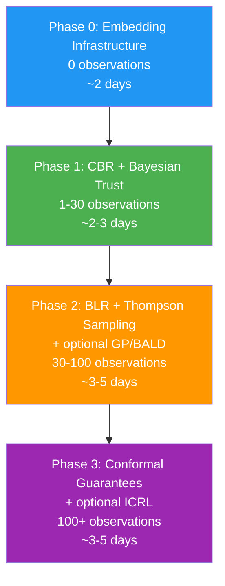

# Decision Proxy Preference Learning — Synthesis

**Date**: 2026-02-24
**Status**: RESEARCH COMPLETE
**Author**: Claude Opus 4.6 + R. Ruiz
**Session**: 259
**Synthesizes**:
- [Take I — Gap Analysis & Upgrade Paths](2026.02.23-decision-proxy-preference-learning-analysis-take-I.md) (Session 257)
- [Take II — Preference Learning Algorithms](2026.02.23-decision-proxy-preference-learning-analysis-take-II.md) (Session 258)
**Related**: [Decision Proxy Architecture (Phase 4)](../2026.02.14-swe-team-phase-4-decision-proxy-architecture/00-index.md)

> **Note on file paths**: This document references file names from the Phase 4 decision proxy architecture design (e.g., `engineering_classifier.py`, `engineering_strategy.py`, `proxy_decision_repository.py`). Some of these are designed target names from the Phase 4 light-up plan; the current codebase may use different names (e.g., `category_classifier.py`, `smart_router.py`, `responder.py`). File paths and line numbers trace the architecture as designed in Take I (Session 257), not necessarily the current Git HEAD. Cross-reference the [Phase 4 Architecture](../2026.02.14-swe-team-phase-4-decision-proxy-architecture/00-index.md) for the authoritative mapping.

---

## Table of Contents

1. [Current Implementation Audit](#1-current-implementation-audit)
2. [Published Foundations](#2-published-foundations)
3. [Gap Analysis](#3-gap-analysis)
4. [Algorithm Selection](#4-algorithm-selection)
5. [Techniques Rejected](#5-techniques-rejected)
6. [Cold-Start-Aware Phased Deployment](#6-cold-start-aware-phased-deployment)
7. [Affected Files — Complete Inventory](#7-affected-files--complete-inventory)
8. [Configuration Keys](#8-configuration-keys)
9. [References](#9-references)
10. [Recommendation Summary](#10-recommendation-summary)

---

## 1. Current Implementation Audit

The decision proxy implements a graduated autonomy system with a 7-stage feedback loop. Here is an end-to-end trace through the actual codebase:

### Stage 1: Event Ingestion

A notification arrives via WebSocket subscription. The proxy router receives events matching `SUBSCRIBED_EVENTS` (defined in `src/cosa/agents/decision_proxy/config.py:33-37`):

```python
# src/cosa/agents/decision_proxy/config.py:33-37
SUBSCRIBED_EVENTS = [
    "notification_queue_update",
    "job_state_transition",
    "sys_ping"
]
```

### Stage 2: Classification (Two-Pass)

The `EngineeringClassifier` (`src/cosa/agents/decision_proxy/engineering_classifier.py:28-152`) classifies the question text using a two-pass approach:

1. **Pass 1 — Sender ID prefix hint** (`engineering_classifier.py:76`): Sender prefixes like `swe.tester` map to category `"testing"` via `SENDER_CATEGORY_HINTS` (line 21-25).

2. **Pass 2 — Keyword analysis** (`engineering_classifier.py:79-95`): Each of the 6 engineering categories (`src/cosa/agents/decision_proxy/engineering_categories.py:36-87`) has a keyword list. The classifier counts keyword matches against the lowercased question, computes `base_confidence = min( 0.5 + ( match_count * 0.1 ), 0.95 )`, and optionally boosts by +0.15 for sender hint alignment.

3. **Fallback**: No keyword match and no sender hint returns `( "general", 0.3 )` (line 104).

### Stage 3: Trust Level Lookup

The `EngineeringStrategy.evaluate()` (`src/cosa/agents/decision_proxy/engineering_strategy.py:226-271`) retrieves the per-category trust level from `TrustTracker`:

```python
# src/cosa/agents/decision_proxy/engineering_strategy.py:251
trust_level = self.trust_tracker.get_level( category )
```

`TrustTracker` (`src/cosa/agents/decision_proxy/trust_tracker.py:221-391`) maintains a `categories` dict mapping category names to `CategoryTrust` instances. Each `CategoryTrust` (lines 21-218) tracks:
- Rolling decision history as `( timestamp, success_bool )` tuples (line 62)
- Time-weighted effective count via exponential decay (lines 149-171)
- Trust level derived from **counter thresholds**: L2=50, L3=200, L4=500, L5=1000 (lines 54-59)

### Stage 4: Trust-Gated Routing

The `gate()` method (`src/cosa/agents/decision_proxy/engineering_strategy.py:149-193`) routes based on trust level and operating mode:

| Mode | L1 | L2 | L3+ |
|------|----|----|-----|
| `shadow` | shadow | shadow | shadow |
| `suggest` | shadow | suggest | suggest |
| `active` | shadow | suggest | act |

Circuit breaker check happens first (line 173): if `CircuitBreaker.check()` returns `False`, the gate returns `"defer"`.

### Stage 5: Decision Production

For `"act"` or `"suggest"` actions, `decide()` (`src/cosa/agents/decision_proxy/engineering_strategy.py:195-224`) produces a value:
- High-risk categories (`deployment`, `destructive`, `architecture`) → `"requires_review"`
- All others → `"approved"`

This is a **static heuristic** — no learning, no historical awareness.

### Stage 6: Persistence

`ProxyDecisionRepository` (`src/cosa/agents/decision_proxy/proxy_decision_repository.py:22-371`) persists decisions to PostgreSQL:
- `log_shadow()` (lines 51-95): L1 observe-only records
- `log_decision()` (lines 97-148): L2+ decisions with ratification state

### Stage 7: Ratification Feedback Loop

The ratification endpoint (`src/cosa/agents/decision_proxy/decision_proxy.py:165-257`) receives human approve/reject signals:

```python
# src/cosa/agents/decision_proxy/decision_proxy.py:221-234
updated = decision_repo.ratify(
    decision_id = uuid.UUID( decision_id ),
    approved    = approved,
    ratified_by = user_email,
    feedback    = feedback
)
trust_repo.update_after_ratification(
    user_email = user_email,
    domain     = decision.domain,
    category   = decision.category,
    approved   = approved
)
```

The `TrustStateRepository.update_after_ratification()` (`src/cosa/agents/decision_proxy/proxy_decision_repository.py:459-494`) increments counters (`total_decisions`, `successful_decisions`, `rejected_decisions`), but these counters feed back into the `TrustTracker`'s `_effective_decision_count()` — which **only counts whether to promote trust level**, not what answers the user prefers.

### What the Current System Does Well

1. **Category isolation**: Bad performance in `destructive` doesn't affect `testing` trust (per-category `CategoryTrust` instances)
2. **Circuit breaker**: Automatic demotion on error rate spikes or confidence collapse (`src/cosa/agents/decision_proxy/circuit_breaker.py:27-263`) with configurable cooldown (`DEFAULT_CB_RECOVERY_COOLDOWN_SECONDS = 3600`)
3. **Shadow mode progression**: L1 observe → L2 suggest → L3 act follows the SAE J3016 pattern
4. **Time-weighted decay**: Exponential decay with configurable half-life prevents stale history from dominating (`src/cosa/agents/decision_proxy/trust_tracker.py:149-171`)
5. **Cap levels**: High-risk categories (`destructive` capped at L2, `deployment` at L3) can never reach full autonomy

### What the Current System Does NOT Do

1. **No preference learning**: The system learns *whether to act* (trust level), not *which answers users prefer*
2. **No semantic similarity**: `find_similar()` (`src/cosa/agents/decision_proxy/proxy_decision_repository.py:283-326`) uses `ILIKE` substring matching — `"refactor auth module"` will NOT match `"restructure authentication service"`
3. **No uncertainty modeling**: Trust levels are binary thresholds, not probability distributions
4. **No rate awareness**: 50 successes out of 50 total is treated the same as 50 successes out of 500 total
5. **No decision recall at decision time**: Historical decisions are stored but never consulted when making new decisions
6. **Static decision logic**: `decide()` returns hardcoded strings, not learned preferences

---

## 2. Published Foundations

### 2.1 Architectural Foundations

The current architecture maps to three well-established patterns from the literature:

#### SAE J3016 Graduated Autonomy (L0-L5)

The Society of Automotive Engineers' J3016 standard defines 6 levels of driving automation (L0-L5). The decision proxy's L1-L5 trust levels are a direct mapping:

| SAE Level | Description | Proxy Level | Proxy Description |
|-----------|-------------|-------------|-------------------|
| L0 | No automation | — | (not applicable) |
| L1 | Driver assistance | L1 Shadow | Predict only, log, don't act |
| L2 | Partial automation | L2 Suggest | Queue as provisional, human ratifies |
| L3 | Conditional automation | L3 Act + Notify | Commit decision, async audit |
| L4 | High automation | L4 Autonomous + Audit | 10% random audit |
| L5 | Full automation | L5 Full Autonomy | Circuit breaker only safety net |

This is a **valid scaffold** — the levels are well-motivated and the progression makes sense. The gap is not in the scaffold but in *how decisions within each level are made*.

#### Circuit Breaker Pattern (Nygard, "Release It!")

Michael Nygard's circuit breaker pattern (from *Release It!*, 2007/2018) is a fault-tolerance mechanism that prevents cascading failures by "tripping" when error rates exceed thresholds. The proxy's `CircuitBreaker` class (`src/cosa/agents/decision_proxy/circuit_breaker.py:27-263`) is a faithful implementation:

- **Error rate check**: `cat.error_rate > self.error_rate_threshold` (line 182)
- **Confidence collapse check**: `avg_confidence < self.confidence_collapse_threshold` (line 190)
- **Auto-demotion**: `trust_tracker.demote_category()` on trip (line 216)
- **Cooldown recovery**: Time-based automatic recovery (lines 99-110)

#### Shadow Mode from Autonomous Vehicles

"Shadow mode" (also called "ghost mode" or "silent testing") is a standard practice in autonomous vehicle development where the autonomous system runs in parallel with human control, logging what it *would have done* without taking action. Tesla, Waymo, and Cruise all used shadow mode before enabling autonomous driving.

The proxy's L1 shadow mode serves the same purpose: build confidence in the classifier and decision logic before granting authority.

### 2.2 Preference Learning Foundations

The following algorithms are organized by family. All are compatible with API-based LLMs (no fine-tuning required), run on CPU, and handle the low-data online setting this system operates in.

#### Bayesian Online Logistic Regression (BLR)

BLR places a Gaussian prior over weight vector θ and models approval probability as P(approve | x) = σ(θᵀx). After each approve/reject observation, the posterior p(θ | D) is updated via Bayes' rule. Since the logistic likelihood isn't conjugate to a Gaussian, the posterior is approximated using **Laplace approximation** — fitting a Gaussian at the posterior mode with covariance from the inverse Hessian. McCormick et al. (2012) developed a fully online variant using Kalman-filter-style recursive updates with **O(d²) per-step cost**.

Data requirements: **10-30 labeled examples** produce a usable posterior, with the prior preventing degenerate predictions even earlier.

**Key papers**: McCormick et al. (2012), Russo et al. (2018), Dwaracherla et al. (2024)

#### Gaussian Process (GP) Preference Learning

A GP prior is placed over a latent utility function f: f ~ GP(0, k(x, x')). The probability of approval is modeled via a probit link: P(approve | x) = Φ(f(x)). For pairwise preferences, Chu & Ghahramani (2005) showed that P(xᵢ ≻ xⱼ) = Φ((f(xᵢ) - f(xⱼ))/√2). Posterior inference uses Laplace approximation or Expectation Propagation. Benavoli et al. (2021) showed the exact posterior is a Skew-GP.

Data requirements: **2-5 preference observations** produce non-trivial predictions thanks to the kernel's inductive bias. 20-50 observations yield a well-calibrated model.

**Key papers**: Chu & Ghahramani (2005), Biyik & Sadigh (2018), Biyik et al. (2020, 2022), Simpson & Gurevych (2020)

#### BALD-Based Active Querying

Houlsby et al. (2011) introduced Bayesian Active Learning by Disagreement: BALD(x) = H[p(y|x, D)] − E_{p(θ|D)}[H[p(y|x, θ)]]. This selects queries where posterior samples maximally disagree — precisely the points where human feedback is most informative. For GPs, BALD has a closed-form approximation. **The BALD criterion doubles as a deferral mechanism**: decisions with high BALD scores are ones the model should ask a human about rather than handle autonomously. Experiments show convergence in **10-30 actively selected queries** — 2-5x fewer than random querying.

**Key papers**: Houlsby et al. (2011), Biyik et al. (2022)

#### Case-Based Reasoning (CBR)

CBR stores every past decision as a case: (context features, proposed action, human verdict). When a new decision arrives, it retrieves the k most similar past cases using a weighted similarity metric, then predicts the likely verdict based on retrieved case outcomes. The 4R cycle (Aamodt & Plaza, 1994) — Retrieve, Reuse, Revise, Retain — maps directly onto the proxy workflow.

Deferral emerges naturally: confidence = max_similarity × verdict_consistency. Three conditions trigger deferral: (1) no cases exceed a similarity threshold, (2) retrieved cases have mixed verdicts, or (3) the case base is too small. **No minimum data required** — the system starts by deferring 100% and builds its case base organically.

Interpretability is unmatched: "I approved this because the 3 most similar past decisions (similarity: 0.94, 0.89, 0.85) were all approved by you."

**Key papers**: Aamodt & Plaza (1994), Smyth (2007), Lenz et al. (2024), Burke (2000)

#### In-Context Reinforcement Learning (ICRL)

Song et al. (2025, Stanford/Google DeepMind) demonstrated that LLMs can learn from feedback *within their context window*, without weight updates. Including top-k similar past experiences (with outcomes) in the prompt enables the LLM to naturally adapt its decision-making. This is particularly relevant for API-based LLMs where fine-tuning is not an option.

**Key papers**: Song et al. (2025)

### 2.3 Supplementary Approaches

These techniques complement the primary algorithms and may be layered on as the system matures:

| Approach | Use Case | Phase | Key Insight |
|----------|----------|-------|-------------|
| **Contextual Thompson Sampling** | Act/defer routing as contextual bandit | Phase 2 | Joint optimization of routing policy outperforms two-stage (Gao et al. 2021) |
| **Conformal Prediction** | Distribution-free coverage guarantees | Phase 3 | Prediction sets ({approve}, {reject}, or {both}) with finite-sample guarantees; ~50-line addition via MAPIE |
| **Bayesian Bradley-Terry** | Ranking-based preferences | Future | Reduces to BLR for binary approve/reject (Caron & Doucet, 2012) |
| **Learning-to-Defer** | Joint classifier + deferral policy | Future | Consistent surrogate losses (Mozannar & Sontag, 2020) — requires labeled expert decisions |

---

## 3. Gap Analysis

### 3.1 The "50 of 50 vs 50 of 500" Problem

The current trust level computation (`src/cosa/agents/decision_proxy/trust_tracker.py:67-86`) counts time-weighted successes against fixed thresholds:

```python
# src/cosa/agents/decision_proxy/trust_tracker.py:77-84
effective_count = self._effective_decision_count()
computed_level = 1
for lvl in ( 2, 3, 4, 5 ):
    if effective_count >= self.thresholds[ lvl ]:
        computed_level = lvl
    else:
        break
```

This means:
- **50 successes out of 50 total** → L2 (threshold met)
- **50 successes out of 500 total** → L2 (same threshold met, despite 90% rejection rate)

The circuit breaker partially addresses this by checking `error_rate`, but only reactively (after the damage is done) and with a hard threshold (`DEFAULT_CB_ERROR_RATE_THRESHOLD = 0.15`). There is no mechanism to express *how confident we are* in the trust level itself.

### 3.2 Keyword Classification Misses Semantic Similarity

The classifier (`src/cosa/agents/decision_proxy/engineering_classifier.py:79-95`) uses exact substring matching:

```python
# src/cosa/agents/decision_proxy/engineering_classifier.py:85
match_count = sum( 1 for kw in keywords if kw in question_lower )
```

This means:
- `"refactor auth module"` → matches `"refactor"` → category `architecture` ✓
- `"restructure authentication service"` → matches `"restructure"` → category `architecture` ✓
- `"reorganize the login system"` → matches nothing → fallback `"general"` ✗

The keywords in `src/cosa/agents/decision_proxy/engineering_categories.py:36-87` are finite lists (10-15 terms per category). Any synonym, paraphrase, or domain-specific phrasing not in the list is missed.

### 3.3 No Mechanism to Learn WHAT Answers Are Preferred

The entire feedback loop (Stages 1-7) updates trust *counters* but never stores or retrieves *what the preferred answer was*. When a human rejects a decision:

1. `ratify( approved=False )` → increments `rejected_decisions` counter
2. `TrustTracker.record_decision( success=False )` → decrements effective count
3. That's it. The *actual preferred answer* (what the human chose instead) is never captured.

This means the system can never learn patterns like:
- "When the user is asked about `destructive` operations on test files, they usually approve"
- "When the user is asked about `deployment` to staging, they approve; to production, they reject"

### 3.4 `find_similar()` Exists but Isn't Wired In

`ProxyDecisionRepository.find_similar()` (`src/cosa/agents/decision_proxy/proxy_decision_repository.py:283-326`) already exists but is never called during the decision pipeline. It's only available as an API query tool, not as an input to `decide()`.

### 3.5 Deferral as Information Gathering

Take II's most important conceptual insight: **deferral is not a failure mode to minimize but an information-gathering mechanism** that Thompson Sampling and BALD can optimize to accelerate the path to trustworthy autonomy.

The current system treats deferral as the absence of confidence — "I don't know enough to act, so I'll ask a human." The preference-aware upgrade reframes this: every deferred decision is a learning opportunity. The system should:

1. **Defer strategically**: Use BALD to identify decisions where human feedback is most informative (not just where the model is most uncertain)
2. **Defer less over time**: As the posterior concentrates, Thompson Sampling naturally reduces deferral frequency
3. **Defer permanently for genuinely novel categories**: Some decision types should always involve a human — and the system should recognize this, not keep trying to learn past its competence

This reframing means the cold-start phase (100% deferral) is not a weakness but a feature — the system is actively gathering the most informative feedback to bootstrap itself.

---

## 4. Algorithm Selection

This section reconciles Take I's four upgrade paths with Take II's three algorithm contenders into a unified component architecture. The key synthesis decisions:

- **ICRL demoted** from "core preference learning breakthrough" (Take I) to "optional layer for ambiguous cases" — CBR is a more robust primary backbone
- **CBR added** as primary preference backbone (absent from Take I entirely) — works from day zero with no minimum data requirement
- **GP/BALD added** for data-efficient active learning (absent from Take I) — crucial for the early phase when every human interaction must count
- **Beta-Bernoulli and BLR are sequential**, not competing — Beta-Bernoulli first (simple), upgrade to BLR later (richer features)

### 4.1 Component A: Bayesian Trust Scoring

**Source**: Take I Upgrade #1 (Beta-Bernoulli) + Take II BLR as Phase 2 upgrade

**What it replaces**: Counter-based trust levels (`src/cosa/agents/decision_proxy/trust_tracker.py:67-86`)

**Phase 1 — Beta-Bernoulli** (conjugate prior, ~1 day):

Drop-in replacement for `CategoryTrust.level`:

```python
import scipy.stats as stats

@property
def level( self ):
    """
    Bayesian trust level using Beta-Bernoulli conjugate model.

    Requires:
        - self.total_successes and self.total_rejections are non-negative
        - self.rate_thresholds maps levels to success rate thresholds
        - self.min_samples maps levels to minimum sample counts

    Ensures:
        - Returns trust level based on lower bound of 95% credible interval
        - Returns 1 if insufficient data or low confidence
        - Never exceeds self.cap_level
    """
    alpha = self.total_successes + 1   # Beta prior α
    beta  = self.total_rejections + 1  # Beta prior β

    # Lower bound of 95% credible interval
    lower_bound = stats.beta.ppf( 0.05, alpha, beta )

    # Map to levels using rate thresholds instead of count thresholds
    computed_level = 1
    for lvl in ( 2, 3, 4, 5 ):
        rate_threshold = self.rate_thresholds.get( lvl, 1.0 )
        min_samples    = self.min_samples.get( lvl, 10 )

        if lower_bound >= rate_threshold and ( alpha + beta - 2 ) >= min_samples:
            computed_level = lvl
        else:
            break

    return min( computed_level, self.cap_level )
```

**Phase 2 — BLR upgrade** (richer feature model, ~2-3 days):

When the case base exceeds ~30 observations, upgrade from scalar Beta-Bernoulli to Bayesian Logistic Regression with feature vectors (category, question length, time of day, recent error rate, etc.). BLR provides:
- Feature-weighted predictions: learn *which features* predict approval
- Per-decision uncertainty: posterior variance x*ᵀΣx* indicates confidence
- Interpretable weights: reveal which features drive trust

Implementation: ~100-200 lines of NumPy/SciPy for Laplace BLR. Sub-millisecond inference.

### 4.2 Component B: Embedding-Based Decision Recall

**Source**: Take I Upgrade #2 (LanceDB architecture)

**What it replaces**: `ILIKE` substring matching in `find_similar()` (`src/cosa/agents/decision_proxy/proxy_decision_repository.py:283-326`)

**Architecture**: LanceDB (already used for solution snapshot embeddings in `src/cosa/memory/lancedb_solution_manager.py`)

At decision persist time — embed the question:

```python
# src/cosa/agents/decision_proxy/proxy_decision_repository.py — enhanced
def log_decision_with_embedding( self, ..., embedding_fn=None ):
    """
    Log decision and compute embedding for future similarity search.

    Requires:
        - embedding_fn is a callable that returns a vector for a string

    Ensures:
        - ProxyDecision created with question_embedding populated
    """
    decision = self.log_decision( ... )
    if embedding_fn:
        decision.question_embedding = embedding_fn( decision.question )
        self.session.flush()
    return decision
```

At decision time — query similar past decisions:

```python
# src/cosa/agents/decision_proxy/proxy_decision_repository.py — replace find_similar()
def find_similar( self, question, domain, category, limit=5, embedding_fn=None ):
    """
    Find semantically similar past decisions using vector search.

    Requires:
        - question is a non-empty string
        - embedding_fn is a callable returning an embedding vector

    Ensures:
        - Returns decisions with cosine similarity > threshold
        - Falls back to ILIKE if no embedding_fn provided
    """
    if embedding_fn is None:
        return self._find_similar_keyword( question, domain, category, limit )
    query_embedding = embedding_fn( question )
    return self._find_similar_vector( query_embedding, domain, category, limit )
```

**Storage recommendation**: LanceDB — leverage existing infrastructure. Create a `proxy_decisions` table alongside `solution_snapshots`.

### 4.3 Component C: Case-Based Reasoning with Bayesian Confidence

**Source**: Take II Contender #3 — primary preference backbone (NEW, absent from Take I)

**Why CBR is the primary backbone (not ICRL)**:

| Factor | CBR | ICRL |
|--------|-----|------|
| Cold start | Works from first interaction | Needs 5+ similar decisions to be useful |
| Latency | Sub-millisecond retrieval | Requires LLM API call (~500ms-2s) |
| Interpretability | Natural explanation: "3 most similar cases were all approved" | LLM reasoning is opaque |
| Cost | Zero LLM cost | Per-decision LLM cost |
| Reliability | Deterministic given case base | LLM responses are stochastic |

**Architecture**:

The CBR system implements the 4R cycle mapped to the proxy workflow:
1. **Retrieve**: Find k most similar past decisions (via Component B embeddings)
2. **Reuse**: Predict verdict based on retrieved case outcomes (weighted vote)
3. **Revise**: Human corrects via ratification → update case metadata
4. **Retain**: Store new case for future reference (automatic — every decision is a case)

**Confidence metric** (natural deferral trigger):

```python
confidence = max_similarity * verdict_consistency
```

Where:
- `max_similarity`: Cosine similarity of the best-matching case (0-1)
- `verdict_consistency`: Fraction of retrieved cases sharing the majority verdict:

```
verdict_consistency = count_of_majority_verdict / total_retrieved_cases

Example: 5 cases retrieved, 4 approved, 1 rejected
  → verdict_consistency = 4/5 = 0.80
  → if max_similarity = 0.92
  → confidence = 0.92 × 0.80 = 0.736
```

**Cold-start behavior**: If 0 cases are retrieved (empty case base), `confidence = 0.0` and the system defers unconditionally. This is the default state throughout Phase 0.

Three conditions trigger deferral:
1. No cases exceed similarity threshold (novel territory)
2. Retrieved cases have mixed approve/reject verdicts (ambiguous territory)
3. Case base is too small for the decision type

**Bayesian overlay**: A lightweight BLR trained on features of retrieved cases, weighted by similarity, combines CBR's structured retrieval with BLR's smooth probability estimates. The posterior variance from this local regression indicates whether to trust the CBR prediction or defer.

**Implementation**: ~150-200 lines for from-scratch CBR. CBRkit (`pip install cbrkit`) provides a production-ready alternative with custom similarity measures.

### 4.4 Component D: Thompson Sampling for Act/Defer Routing

**Source**: Take I Upgrade #4 + Take II's Thompson Sampling analysis (merged)

**What it replaces**: Fixed trust-level gating in `gate()` (`src/cosa/agents/decision_proxy/engineering_strategy.py:149-193`)

Instead of deterministic routing, sample from the Beta distribution:

```python
import random
from scipy.stats import beta as beta_dist

def gate( self, category, trust_level, confidence ):
    """
    Thompson Sampling gate: sample from Beta posterior to decide action.

    Requires:
        - category is registered in trust_tracker
        - Component A (Bayesian trust) is implemented

    Ensures:
        - Naturally explores uncertain categories
        - Converges to exploitation as evidence accumulates
        - Circuit breaker still takes precedence
    """
    # Circuit breaker check (unchanged)
    if not self.circuit_breaker.check( category ):
        return "defer"

    # Shadow mode override (unchanged)
    if self.trust_mode == "shadow":
        return "shadow"

    cat = self.trust_tracker.categories.get( category )
    if cat is None:
        return "shadow"

    alpha = cat.total_successes + 1
    beta  = cat.total_rejections + 1

    # Thompson sample: draw from Beta( α, β )
    sampled_rate = beta_dist.rvs( alpha, beta )

    # Route based on sampled rate
    if sampled_rate >= 0.90:
        return "act"
    elif sampled_rate >= 0.70:
        return "suggest"
    else:
        return "shadow"
```

**Why Thompson Sampling**:

1. **Natural exploration**: When α ≈ β (uncertain), samples spread → system naturally explores by sometimes acting and sometimes shadowing
2. **Natural exploitation**: When α >> β (high success rate), samples concentrate near 1.0 → system consistently acts
3. **Self-correcting**: Rejections shift the Beta distribution left → fewer "act" samples → automatic demotion without explicit thresholds
4. **Deferral as information-gathering**: Every deferred-and-ratified decision tightens the posterior, accelerating the path to autonomy

**Integration with CBR**: Thompson Sampling governs *whether* to act, CBR governs *how* to act. When TS decides to act, CBR provides the decision value. When TS decides to defer, the human's response becomes a new CBR case — optimizing information gain.

### 4.5 Component E: GP Preference Learning with BALD (Phase 2)

**Source**: Take II Contender #2 — data-efficient active learning (NEW, absent from Take I)

**Purpose**: Maximize the learning value of each human interaction during the critical early phase (1-100 observations).

**Core mechanism**: Place a GP prior over a latent utility function. The BALD criterion identifies which decisions are most informative to ask the human about:

```
BALD(x) = H[p(y|x, D)] − E_{p(θ|D)}[H[p(y|x, θ)]]
```

This selects queries where posterior samples maximally disagree. Experiments show convergence in **10-30 actively selected queries** — 2-5x fewer than random querying (Biyik et al., 2022).

**Integration**: BALD scores feed into Thompson Sampling as a tie-breaker. When TS produces a "suggest" action (neither clearly act nor shadow), BALD determines whether this particular decision is worth deferring for maximum information gain:

- High BALD score → defer (this decision is maximally informative)
- Low BALD score → suggest (we won't learn much from human feedback here)

**Implementation**: Standard GP computation is O(N³) for training — completely tractable for the few-hundred-observation regime. Libraries: prefGP, GPro, BoTorch (PairwiseGP), or Simpson & Gurevych's GPPL. ~300-500 lines with a library, all on CPU.

**Data requirements**: 2-5 preference observations produce non-trivial predictions. 20-50 observations yield well-calibrated uncertainty.

### 4.6 Optional Layer: ICRL Prompt Augmentation

**Source**: Take I Upgrade #3 — reclassified from "core breakthrough" to "optional layer"

**Why reclassified**: ICRL is powerful but adds latency and cost. CBR (Component C) provides the same core capability — learning from historical decisions — without requiring an LLM call per decision. ICRL becomes valuable only for **ambiguous cases** where CBR's retrieved cases have mixed verdicts and the LLM's reasoning can disambiguate.

**When to invoke ICRL**:
1. CBR confidence falls below threshold (e.g., `confidence < 0.6`)
2. Retrieved cases have mixed verdicts (e.g., 3 approved, 2 rejected)
3. The question is semantically complex (e.g., multi-step deployment with conditional approval)

**Prompt template** (from Take I):

```
You are a decision proxy for a software engineering team. You are evaluating
a decision question and must recommend an action.

## Decision Question
{question}

## Category
{category}

## Similar Past Decisions (most recent first)
{history}

Each past decision shows:
- The question asked
- The action taken (approved/requires_review/rejected)
- Whether the human APPROVED or REJECTED the proxy's decision
- Any feedback provided

## Instructions
Based on the patterns in past decisions:
1. If similar questions were consistently approved → recommend "approved"
2. If similar questions were consistently rejected → recommend "requires_review"
3. If outcomes are mixed → recommend "requires_review" (err on caution)
4. If no similar history → use your judgment based on the category risk level

Respond with ONLY one of: "approved", "requires_review"
```

**Dependency**: Requires Component B (embedding search) for relevant context retrieval.

**Effort**: ~2-3 days. LLM call adds ~500ms-2s latency, but only triggered for genuinely ambiguous decisions.

---

### 4.7 Build vs Import Analysis

**Question**: Which statistical/ML components should be built from scratch vs imported as libraries?

**Evaluation criteria**: Dependency weight, Python version compatibility, component complexity, existing infrastructure overlap.

#### Summary Table

| Library | Component | Verdict | Rationale |
|---------|-----------|---------|-----------|
| **scipy.stats** | A (Beta-Bernoulli) | **Use** (already installed) | `beta.ppf()`, `beta.rvs()` — 3-5 lines each |
| **numpy** | A (BLR), E (GP) | **Use** (already installed) | Matrix ops for Laplace approx, kernel computation |
| **LanceDB** | B (Embeddings) | **Use** (already installed) | Vector search infrastructure already in production |
| **MAPIE** | Conformal | **Import** (Phase 3 only) | Near-zero deps (numpy + sklearn already installed); statistical correctness matters too much to hand-roll |
| **prefGP** | E (GP) | **Reject** | Dual JAX + PyTorch dependency — massive install footprint |
| **BoTorch** | E (GP) | **Reject** | Requires GPyTorch — heavy dependency for a single optional component |
| **PyMC** | A (Bayesian) | **Reject** | Requires PyTensor backend — heavyweight for conjugate models scipy handles natively |
| **NumPyro** | A (Bayesian) | **Reject** | Requires JAX — same over-engineering concern as prefGP |
| **CBRkit** | C (CBR) | **Blocked** | Requires Python 3.12+ (Lupin runs 3.11) |
| **MABWiser** | D (Thompson) | **Optional** | Near-zero cost, but 2-arm Thompson Sampling is ~20 lines of scipy |
| **APReL** | E (GP/BALD) | **Reject** | Research library, limited maintenance, overlaps with hand-rolled GP |
| **sklearn** | Conformal | **Use** (already installed) | Required by MAPIE; already available for feature preprocessing |

#### Rationale by Component

**Component A — Bayesian Trust Scoring (~200 lines)**
Build from scipy/numpy. Beta-Bernoulli is `scipy.stats.beta.ppf()` for credible intervals and `beta.rvs()` for Thompson Sampling — literally 3-5 lines of math. BLR upgrade is ~150 lines of numpy (Laplace approximation over a 2-4 feature vector). PyMC and NumPyro are 100x overkill for conjugate models.

**Component B — Embedding-Based Decision Recall (existing infrastructure)**
LanceDB is already installed and in production for solution snapshots. The `EmbeddingProvider` (`src/cosa/memory/embedding_provider.py`) generates 768-dim vectors. Zero new dependencies.

**Component C — Case-Based Reasoning (~150-200 lines)**
Build from scratch. CBR is retrieve + score + adapt — straightforward with LanceDB vector search providing the retrieval step. CBRkit would have been ideal but is blocked on Python 3.12+ (Lupin runs 3.11). The custom implementation is simple enough that a library isn't necessary.

**Component D — Thompson Sampling (~20 lines)**
Build from scipy. Two-arm Thompson Sampling (act vs defer) is `scipy.stats.beta.rvs( alpha, beta )` — literally ~20 lines of code. MABWiser is a clean library but adds a dependency for something trivially implementable.

**Component E — GP/BALD (~200-300 lines)**
Build from numpy. The GP preference model is a 5x5 to 20x20 kernel matrix with Laplace approximation — well within hand-rolled numpy territory. prefGP (JAX+PyTorch dual dependency) and BoTorch (GPyTorch) are far too heavy. BALD is a single formula applied to GP posterior variance.

**Component F — ICRL Prompt Augmentation (existing infrastructure)**
Uses existing LLM client (`src/cosa/tools/openai_client.py` or equivalent). No new dependencies — it's a prompt template + embedding retrieval call.

**Conformal Prediction — Import MAPIE (Phase 3 only)**
MAPIE (`pip install mapie`) depends only on numpy and sklearn (both already installed). Conformal prediction's statistical guarantees require careful implementation of coverage calibration — this is one area where importing a well-tested library is strictly better than hand-rolling. Phase 3 means the dependency is deferred until actually needed.

#### Key Findings

- **Total custom code**: ~750-900 lines across Components A, C, D, E
- **New packages**: 0 for Phases 0-2; 1 (MAPIE) at Phase 3
- **Heavy frameworks rejected**: prefGP (JAX+PyTorch), BoTorch (GPyTorch), PyMC (PyTensor), NumPyro (JAX)
- **CBRkit blocked**: Python 3.12+ requirement vs Lupin's 3.11
- **Philosophy**: scipy/numpy for math that's well-understood; import only when statistical correctness demands it (conformal prediction)

---

## 5. Techniques Rejected

### RLHF (Reinforcement Learning from Human Feedback)

**Why not**: RLHF (Ouyang et al. 2022) requires fine-tuning the LLM weights using a reward model trained on human preference data. Not applicable: we use API-based LLMs (Claude, GPT-4) — cannot fine-tune. Requires thousands of preference pairs, far beyond our ~50-1000 decisions per category.

### DPO (Direct Preference Optimization)

**Why not**: DPO (Rafailov et al. 2023) simplifies RLHF by eliminating the explicit reward model, but still requires fine-tuning and access to model weights. Same API-based LLM constraint as RLHF.

### Full Iterated Distillation and Amplification (IDA)

**Why not**: IDA (Christiano et al. 2018) is a recursive alignment technique designed for aligning superintelligent systems. Too complex, requires multiple training loops, massive data requirements — far beyond our scale.

### Constitutional AI (CAI)

**Why not**: CAI (Bai et al. 2022) ensures AI outputs follow ethical principles, not user preferences. Orthogonal concern — our system already has safety mechanisms (circuit breaker, cap levels, shadow mode). Could complement ICRL for safety constraints but doesn't solve the preference learning gap.

### Learning-to-Defer

**Why not**: Mozannar & Sontag (2020) provide consistent surrogate losses for jointly learning a classifier and a deferral policy. Theoretically clean but requires labeled examples of expert decisions — a constraint that may not hold in the proxy system's early phase. Better suited as a Phase 3+ refinement when sufficient data has accumulated.

---

## 6. Cold-Start-Aware Phased Deployment

This roadmap restructures Take I's dependency-based phases around Take II's observation-count insight: **the system's behavior should be governed by how much data it has seen**, not just which components are implemented.

### Phase Overview



### Phase 0: Embedding Infrastructure (0 observations, ~2 days)

**Components deployed**: Component B (embedding search) infrastructure only

**What the system does**: Routes all decisions to the human (100% deferral). Every decision is stored as a case with its embedding vector, building the case base for Phase 1.

**Work items**:
- Set up LanceDB `proxy_decisions` table with the following schema:

```python
# LanceDB proxy_decisions table schema
{
    "id"                 : str,       # UUID from PostgreSQL proxy_decisions.id
    "question"           : str,       # Original question text
    "category"           : str,       # Engineering category
    "decision_value"     : str,       # "approved" | "requires_review"
    "ratification_state" : str,       # "pending" | "approved" | "rejected"
    "question_embedding" : list,      # 768-dim float vector from EmbeddingProvider
    "created_at"         : str,       # ISO timestamp
}
```

> **Embedding target**: Embed the `question` field (not `decision_value`), since similarity search matches new questions against past questions.

- Add embedding generation to `log_shadow()` and `log_decision()` (uses existing `EmbeddingProvider` — 768-dim vectors, no new model configuration needed)
- Replace `find_similar()` with vector search (backward-compatible fallback to ILIKE)
- Wire embedding generation into the persist pipeline

**Error handling (Phase 0)**:
- Embedding generation fails → log warning, store decision without embedding in LanceDB, skip vector search (fall back to ILIKE)
- LanceDB write fails → log error, decision still saved in PostgreSQL (source of truth); LanceDB is a secondary index, not the canonical store

**Why embeddings first**: The case base must be populated *before* CBR can make predictions. Every decision from Phase 0 onward has an embedding, so CBR has maximum history when it activates.

> **Effort note**: Phase 0 effort may be reduced since the `EmbeddingProvider` infrastructure (`src/cosa/memory/embedding_provider.py`) is already production-ready — embedding generation doesn't need to be built, only wired into the decision persistence pipeline.

> **Done when**: (1) All new decisions stored with 768-dim embeddings in LanceDB `proxy_decisions` table, (2) `find_similar()` returns vector-search results sorted by cosine similarity, (3) PostgreSQL remains source of truth with LanceDB as secondary vector index.

**Phase 0 tests**:
- Unit: `EmbeddingProvider` generates 768-dim vectors for decision questions
- Unit: LanceDB round-trip — write embedding, read back, verify dimensions match
- Unit: `find_similar()` returns cases sorted by descending cosine similarity
- Smoke: End-to-end shadow decision → stored with embedding → retrievable via vector search

### Phase 1: CBR + Bayesian Trust (1-30 observations, ~2-3 days)

**Components deployed**: Component A (Beta-Bernoulli), Component C (CBR)

**What the system does**: CBR begins making tentative predictions on highly similar cases. Beta-Bernoulli replaces counter-based trust levels. System handles ~10-20% of decisions autonomously (only high-similarity, high-consistency matches).

**Work items**:
- Implement CBR case retrieval with confidence scoring
- Replace `CategoryTrust.level` with Beta-Bernoulli computation
- Wire CBR predictions into `decide()` (with fallback to static heuristic)
- Add CBR confidence to decision logging

**Cold-start behavior**: With 5-10 cases, CBR can match highly similar decisions. By 20-30 cases, it has reasonable coverage of common decision types. Each new case immediately improves the system — no batch retraining.

**Error handling (Phase 1)**:
- CBR retrieval returns 0 cases → defer unconditionally (`confidence = 0.0`)
- Beta-Bernoulli `α + β < min_samples` → stay at L1 (no trust earned yet; insufficient data to promote)
- Division by zero in confidence calculation → clamp to `0.0` (e.g., `total_retrieved_cases == 0`)
- CBR prediction disagrees with static heuristic → log both, use static heuristic (shadow mode for CBR until validated)

> **Done when**: (1) Beta-Bernoulli computes trust levels from success rate + sample count, replacing counter-based levels, (2) CBR retrieves relevant cases with ≥0.75 similarity for common question types, (3) system handles ≥10% of decisions autonomously (only high-similarity, high-consistency matches), (4) CBR confidence is logged alongside every decision for auditability.

**Phase 1 tests**:
- Unit: `Beta(1,1)` → trust level L1 (no data = no trust)
- Unit: `Beta(20,2)` → trust level ≥ L2 (high success rate, sufficient samples)
- Unit: CBR `confidence = 0.0` when case base is empty
- Unit: CBR returns majority verdict when retrieved cases are consistent
- Smoke: Decision flow with CBR prediction vs static heuristic comparison — verify both paths produce valid decisions

### Phase 2: BLR + Thompson Sampling (30-100 observations, ~3-5 days)

**Components deployed**: Component A (BLR upgrade), Component D (Thompson Sampling), optionally Component E (GP/BALD)

**What the system does**: BLR provides smooth probability estimates with feature-weighted predictions. Thompson Sampling governs the act/defer transition. System handles ~40-60% of decisions autonomously.

**Work items**:
- Upgrade Beta-Bernoulli to BLR with feature vectors
- Implement Thompson Sampling gate replacing fixed thresholds
- Optionally: GP preference model with BALD for active query selection
- Add sampling diagnostics and monitoring endpoint

**Data transition**: At 30+ observations, the posterior is concentrated enough for meaningful Thompson Sampling. The system begins to earn autonomy through principled uncertainty management.

### Phase 3: Conformal Guarantees + Optional ICRL (100+ observations, ~3-5 days)

**Components deployed**: Conformal prediction wrapper, optionally Component F (ICRL) for ambiguous cases

**What the system does**: Conformal prediction provides statistical guarantees on prediction quality. System handles ~80-95% of routine decisions, deferring only on genuinely novel or ambiguous cases.

**Work items**:
- Wrap BLR classifier with conformal prediction (MAPIE, ~50 lines)
- Optionally: ICRL prompt augmentation for CBR-ambiguous decisions
- GP-based active learning identifies remaining areas of uncertainty
- System self-monitors prediction set widths and calibration quality

**Conformal prediction**: Prediction sets — {approve}, {reject}, or {approve, reject} — with finite-sample coverage guarantees. When the prediction set contains both classes, the system defers. Requires ~50-100 calibration examples for tight prediction sets.

### Effort Summary

| Phase | Duration | Observation Range | Autonomy Rate | Critical Path |
|-------|----------|-------------------|---------------|---------------|
| Phase 0 | ~2 days | 0 | 0% | ✓ (foundation) |
| Phase 1 | ~2-3 days | 1-30 | ~10-20% | ✓ |
| Phase 2 | ~3-5 days | 30-100 | ~40-60% | |
| Phase 3 | ~3-5 days | 100+ | ~80-95% | |
| **Total** | **~10-15 days** | — | — | **~7-10 days** |

Phases 0+1 are the critical path (~4-5 days). Phases 2 and 3 can be deferred until the system has accumulated sufficient observations.

---

## 7. Affected Files — Complete Inventory

### 7.0 Document Name → Current Codebase Mapping

The tables below use the Phase 4 design names. This mapping resolves them to current Git HEAD paths:

| Document Name | Current Codebase Name | Actual Path |
|---------------|----------------------|-------------|
| `engineering_classifier.py` | `category_classifier.py` | `src/cosa/agents/decision_proxy/category_classifier.py` |
| `engineering_strategy.py` | `smart_router.py` | `src/cosa/agents/decision_proxy/smart_router.py` |
| (SWE-specific strategy) | `engineering_strategy.py` | `src/cosa/agents/swe_team/proxy/engineering_strategy.py` |
| `engineering_categories.py` | `engineering_categories.py` | `src/cosa/agents/swe_team/proxy/engineering_categories.py` |
| `proxy_decision_repository.py` | `proxy_decision_repository.py` | `src/cosa/rest/db/repositories/proxy_decision_repository.py` |
| `decision_proxy.py` | `responder.py` | `src/cosa/agents/decision_proxy/responder.py` |
| `config.py` (proxy categories) | `config.py` | `src/cosa/agents/decision_proxy/config.py` |
| `config.py` (SWE categories) | `config.py` | `src/cosa/agents/swe_team/proxy/config.py` |

> **Note**: `engineering_strategy.py` exists at `swe_team/proxy/` (not `decision_proxy/`), confirming the architectural split between the generic proxy framework (`decision_proxy/`) and the SWE-specific implementation (`swe_team/proxy/`). When the document references `engineering_strategy.py` for CBR/Thompson Sampling changes, the target is actually `decision_proxy/smart_router.py` (the generic router).

### 7.1 Files Modified

| File | Phase | Changes |
|------|-------|---------|
| `src/cosa/agents/decision_proxy/trust_tracker.py` | Phase 1 | Replace `level` property with Beta-Bernoulli (lines 67-86); replace/remove `_effective_decision_count()` (lines 149-171); Phase 2: upgrade to BLR |
| `src/cosa/agents/decision_proxy/config.py` | Phase 0-2 | Add rate thresholds, embedding config, CBR config, Thompson Sampling config, BALD config (lines 60-68, 89-122) |
| `src/cosa/agents/decision_proxy/proxy_decision_repository.py` | Phase 0 | Add embedding generation to `log_shadow()` and `log_decision()` (lines 51-148); replace `find_similar()` with vector search (lines 283-326) |
| `src/cosa/agents/decision_proxy/engineering_strategy.py` | Phase 1-2 | Wire CBR predictions into `decide()` (lines 195-224); replace `gate()` with Thompson Sampling (lines 149-193); add LLM client and embedding function to `__init__` (lines 48-55) |
| `src/cosa/agents/decision_proxy/base_decision_strategy.py` | Phase 2 | Update `gate()` abstract interface documentation (lines 121-144) |
| `src/cosa/agents/decision_proxy/decision_proxy.py` | Phase 2 | Add monitoring endpoint for sampling diagnostics |

### 7.2 Files Created

| File | Phase | Purpose |
|------|-------|---------|
| `src/cosa/agents/decision_proxy/proxy_decision_embeddings.py` | Phase 0 | LanceDB interface for decision embeddings |
| `src/cosa/agents/decision_proxy/cbr_decision_store.py` | Phase 1 | CBR case store with similarity retrieval and confidence scoring |
| `src/cosa/agents/decision_proxy/bayesian_trust.py` | Phase 2 | BLR model with Laplace approximation and Thompson Sampling |
| `src/cosa/agents/decision_proxy/gp_preference.py` | Phase 2 | GP preference model with BALD active querying (optional) |
| `src/cosa/agents/decision_proxy/prompts/icrl_decision.py` | Phase 3 | ICRL prompt template for ambiguous decisions (optional) |
| `src/cosa/agents/decision_proxy/conformal_wrapper.py` | Phase 3 | Conformal prediction wrapper for coverage guarantees (optional) |

---

## 8. Configuration Keys

### Current vs Proposed Trust Thresholds

| Parameter | Current Value | Current Source | Proposed (Bayesian) | Notes |
|-----------|--------------|----------------|---------------------|-------|
| L2 threshold | 50 decisions | `config.py:61` | 70% lower CI, 20+ samples | Rate-aware |
| L3 threshold | 200 decisions | `config.py:62` | 80% lower CI, 50+ samples | Rate-aware |
| L4 threshold | 500 decisions | `config.py:63` | 90% lower CI, 100+ samples | Rate-aware |
| L5 threshold | 1000 decisions | `config.py:64` | 95% lower CI, 200+ samples | Rate-aware |

### Circuit Breaker Parameters (Unchanged)

| Parameter | Current Value | Current Source | Notes |
|-----------|--------------|----------------|-------|
| Error rate threshold | 0.15 (15%) | `config.py:71` | Already well-calibrated |
| Confidence collapse | 0.30 | `config.py:72` | Already well-calibrated |
| Auto-demotion levels | 2 | `config.py:73` | Aggressive enough |
| Recovery cooldown | 3600s (1 hr) | `config.py:74` | Reasonable cooldown |

### Category Cap Levels (Unchanged)

| Category | Cap | Source | Rationale |
|----------|-----|--------|-----------|
| `deployment` | L3 | `engineering_categories.py:43` | Production deploys need human oversight |
| `testing` | L5 | `engineering_categories.py:53` | Low-risk, high-frequency |
| `deps` | L4 | `engineering_categories.py:62` | Version changes can break things |
| `architecture` | L3 | `engineering_categories.py:69` | Design decisions need human input |
| `destructive` | L2 | `engineering_categories.py:79` | Irreversible operations — always suggest |
| `general` | L5 | `engineering_categories.py:84` | Catch-all, default behavior |

### New Configuration Keys (~19 keys, organized by phase)

All keys follow the space-separated naming convention per the [INI Config Key Naming Convention](../2026.02.23-ini-config-key-naming-convention.md) design document.

> **Note**: Embedding model and dimension are **not** configured here — they use the existing `EmbeddingProvider` infrastructure (`src/cosa/memory/embedding_provider.py`), configured via `embedding model name` and `embedding dimensions` in `lupin-app.ini:383-384`. All providers produce 768-dim vectors (OpenAI text-embedding-3-small with MRL truncation, CodeRankEmbed, nomic-embed-text-v1.5).

**Phase 0 — Embedding Infrastructure**:

| INI Key | Default | Type | Purpose |
|---------|---------|------|---------|
| `swe team trust proxy similarity threshold` | 0.75 | float | Minimum cosine similarity for case matching |

**Phase 1 — CBR + Bayesian Trust**:

| INI Key | Default | Type | Purpose |
|---------|---------|------|---------|
| `swe team trust proxy l2 rate threshold` | 0.70 | float | Success rate lower bound for L2 promotion |
| `swe team trust proxy l3 rate threshold` | 0.80 | float | Success rate lower bound for L3 promotion |
| `swe team trust proxy l4 rate threshold` | 0.90 | float | Success rate lower bound for L4 promotion |
| `swe team trust proxy l5 rate threshold` | 0.95 | float | Success rate lower bound for L5 promotion |
| `swe team trust proxy l2 min samples` | 20 | int | Minimum observations for L2 consideration |
| `swe team trust proxy l3 min samples` | 50 | int | Minimum observations for L3 consideration |
| `swe team trust proxy l4 min samples` | 100 | int | Minimum observations for L4 consideration |
| `swe team trust proxy l5 min samples` | 200 | int | Minimum observations for L5 consideration |
| `swe team trust proxy cbr top k` | 5 | int | Number of similar cases to retrieve |
| `swe team trust proxy cbr confidence threshold` | 0.60 | float | Minimum CBR confidence to act autonomously |

**Phase 2 — BLR + Thompson Sampling**:

| INI Key | Default | Type | Purpose |
|---------|---------|------|---------|
| `swe team trust proxy thompson enabled` | false | bool | Enable Thompson Sampling gate |
| `swe team trust proxy thompson act threshold` | 0.90 | float | Sampled rate threshold for "act" routing |
| `swe team trust proxy thompson suggest threshold` | 0.70 | float | Sampled rate threshold for "suggest" routing |
| `swe team trust proxy bald enabled` | false | bool | Enable GP/BALD active query selection |
| `swe team trust proxy bald defer threshold` | 0.50 | float | BALD score threshold for strategic deferral |

**Phase 3 — Conformal + ICRL**:

| INI Key | Default | Type | Purpose |
|---------|---------|------|---------|
| `swe team trust proxy icrl enabled` | false | bool | Enable ICRL prompt augmentation for ambiguous cases |
| `swe team trust proxy icrl top k` | 5 | int | Number of similar decisions to include in ICRL prompt |
| `swe team trust proxy conformal enabled` | false | bool | Enable conformal prediction wrapper |

---

## 9. References

### Architectural Foundations

1. **SAE J3016** — Society of Automotive Engineers, "Taxonomy and Definitions for Terms Related to Driving Automation Systems for On-Road Motor Vehicles" (2014/2021)
2. **Nygard, M.** — *Release It!: Design and Deploy Production-Ready Software*, Pragmatic Bookshelf (2007, 2nd ed. 2018)
3. **Shadow mode** — Standard practice in autonomous vehicle development (Tesla, Waymo, Cruise)

### Bayesian Learning

4. **DeGroot, M.** — *Optimal Statistical Decisions*, McGraw-Hill (1970). Beta-Bernoulli conjugate prior theory.
5. **Thompson, W.R.** (1933) — "On the likelihood that one unknown probability exceeds another in view of the evidence of two samples," *Biometrika*.
6. **Chapelle, O. & Li, L.** (2011) — "An Empirical Evaluation of Thompson Sampling," *NeurIPS*.
7. **McCormick, T., Raftery, A., Madigan, D. & Burd, R.** (2012) — "Dynamic Logistic Regression and Dynamic Model Averaging," *Biometrics*. Online BLR with Kalman-filter-style updates.
8. **Russo, D., Van Roy, B., Kazerouni, A., Osband, I. & Wen, Z.** (2018) — "A Tutorial on Thompson Sampling," *Foundations and Trends in ML*.
9. **Wu, H. & Liu, X.** (2016) — "Double Thompson Sampling for Dueling Bandits," *NeurIPS*.
10. **Dwaracherla, V., Asghari, S., Hao, B. & Van Roy, B.** (2024) — "Efficient Exploration for LLMs," *ICML 2024*.

### Gaussian Process Preference Learning

11. **Chu, W. & Ghahramani, Z.** (2005) — "Preference Learning with Gaussian Processes," *ICML*.
12. **Houlsby, N., Huszár, F., Ghahramani, Z. & Lengyel, M.** (2011) — "Bayesian Active Learning for Classification and Preference Learning." BALD criterion.
13. **Biyik, E. & Sadigh, D.** (2018) — "Batch Active Preference-Based Learning of Reward Functions," *CoRL*.
14. **Biyik, E., Huynh, N., Kochenderfer, M. & Sadigh, D.** (2020) — "Active Preference-Based Gaussian Process Regression for Reward Learning," *RSS*.
15. **Benavoli, A. et al.** (2021) — Skew-GP for exact preference posteriors.
16. **Biyik, E., Talati, D. & Sadigh, D.** (2022) — "APReL: A Library for Active Preference-based Reward Learning," *HRI*.
17. **Simpson, E. & Gurevych, I.** (2020) — "Scalable Bayesian Preference Learning," *Machine Learning*.
18. **Benavoli, A. & Azzimonti, D.** (2024) — prefGP library: 9 GP preference models in JAX/PyTorch.

### Case-Based Reasoning

19. **Aamodt, A. & Plaza, E.** (1994) — "Case-based reasoning: Foundational issues, methodological variations, and system approaches," *AI Communications*.
20. **Smyth, B.** (2007) — "Case-Based Recommendation," in *The Adaptive Web*, Springer.
21. **Burke, R.** (2000) — "A Case-Based Reasoning Approach to Collaborative Filtering," *EWCBR*.
22. **Lenz, R., Malburg, L. & Bergmann, R.** (2024) — "CBRkit: An Intuitive Case-Based Reasoning Toolkit for Python," *ICCBR 2024*.

### In-Context Reinforcement Learning

23. **Song, Y., Xiong, W. & Gao, J.** (2025) — "Reinforcement Learning in LLMs at Inference Time," Stanford/Google DeepMind. ICRL without weight updates.
24. **Karpukhin, V. et al.** (2020) — "Dense Passage Retrieval for Open-Domain Question Answering," Facebook AI Research.

### Deferral & Active Learning

25. **Mozannar, H. & Sontag, D.** (2020) — "Consistent Estimators for Learning to Defer to an Expert," *ICML*. Learning-to-defer with surrogate losses.
26. **Gao, Z. et al.** (2021) — "Human-AI Decision Making Under Bandit Feedback," *IJCAI*. Joint routing policy optimization.
27. **MAPIE** — Model Agnostic Prediction Interval Estimator. Conformal prediction library (`pip install mapie`).

### Rejected Approaches (with rationale)

28. **Ouyang, L. et al.** (2022) — "Training language models to follow instructions with human feedback." RLHF — requires fine-tuning.
29. **Rafailov, R. et al.** (2023) — "Direct Preference Optimization: Your Language Model is Secretly a Reward Model." DPO — requires fine-tuning.
30. **Christiano, P. et al.** (2018) — "Supervising strong learners by amplifying weak experts." IDA — too complex for domain-specific proxy.
31. **Bai, Y. et al.** (2022) — "Constitutional AI: Harmlessness from AI Feedback." CAI — safety, not preference.
32. **Caron, F. & Doucet, A.** (2012) — "Efficient Bayesian Inference for Generalized Bradley-Terry Models," *JCGS*. BT — reduces to BLR for binary case.

---

## 10. Recommendation Summary

Six key recommendations synthesizing both Takes:

### 1. Start with CBR (not ICRL) as the preference backbone

CBR provides the same core capability as ICRL — learning from historical decisions — without requiring an LLM call per decision. It works from the first interaction, provides natural explanations, and has zero inference cost. ICRL becomes an optional layer for genuinely ambiguous cases where LLM reasoning can disambiguate mixed CBR verdicts.

### 2. Beta-Bernoulli first, upgrade to BLR later

These are **sequential upgrades**, not competing approaches. Beta-Bernoulli (Phase 1) is a drop-in replacement for counter-based trust that immediately fixes the "50 of 50 vs 50 of 500" problem with ~1 day of effort. BLR (Phase 2) extends this to feature-weighted predictions when the case base exceeds ~30 observations.

### 3. Thompson Sampling governs act/defer routing

Thompson Sampling replaces fixed trust-level gating with probabilistic sampling that naturally balances exploration and exploitation. Combined with CBR confidence, it produces a system where deferral frequency decreases organically as the posterior concentrates — no manual threshold tuning.

### 4. GP/BALD for Phase 2 data-efficient active learning

The GP preference model with BALD criterion is not a preference predictor — it's an **active query selector**. BALD identifies which decisions are most informative to ask the human about, maximizing learning from each interaction. This is crucial in the early phase (1-100 observations) when every human interaction must count.

### 5. Conformal prediction for Phase 3 guarantees

When the case base exceeds ~100 observations, conformal prediction wraps the BLR classifier to provide **distribution-free coverage guarantees**. This is the only component that provides statistical guarantees on prediction quality, giving users a principled basis for trusting the system's autonomy.

### 6. Deferral is information-gathering, not failure

The most important conceptual shift: every deferred decision is a learning opportunity. Thompson Sampling and BALD optimize *which* decisions to defer for maximum information gain, accelerating the path to trustworthy autonomy. The cold-start phase (100% deferral) is not a weakness but a feature — the system is actively building the case base it needs.

---

*This document synthesizes [Take I](2026.02.23-decision-proxy-preference-learning-analysis-take-I.md) (codebase-grounded gap analysis, 4 upgrade paths, exact file paths/line numbers) and [Take II](2026.02.23-decision-proxy-preference-learning-analysis-take-II.md) (algorithm-focused research, 3 contenders, 18 academic citations, cold-start-aware deployment phases). No content from either Take has been lost — only reorganized, reconciled, and augmented with synthesis insights.*
