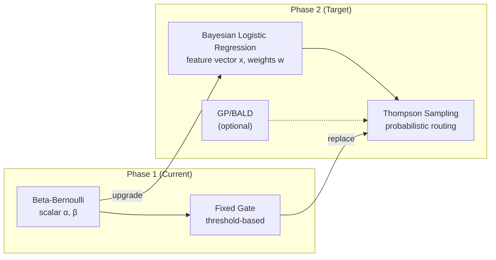
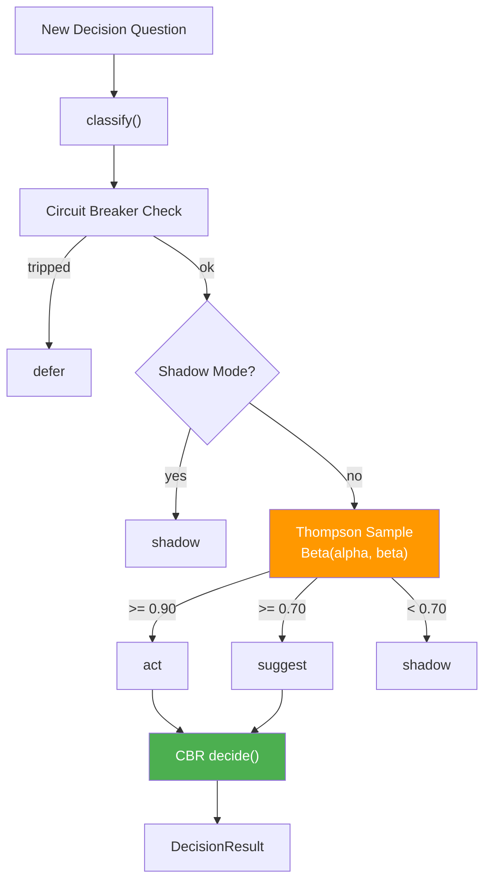

# Phase 2 Implementation Plan: BLR + Thompson Sampling

**Date**: 2026-02-24
**Status**: PLANNED
**Phase**: 2 of 4
**Prerequisites**: Phase 0+1 complete (commit `bcd5e4e`), 30+ accumulated observations
**Estimated Effort**: 3-5 days
**Observation Range**: 30-100 decisions
**Target Autonomy**: ~40-60% of routine decisions handled autonomously

**Parent Document**: [Take III Synthesis](2026.02.24-decision-proxy-preference-learning-analysis-take-III-synthesis.md)
**Depends On**: Phase 0+1 (Embedding Infrastructure + CBR + Beta-Bernoulli)

---

## Table of Contents

1. [Overview](#1-overview)
2. [Configuration Keys](#2-configuration-keys)
3. [Component A Upgrade: BLR Replacing Beta-Bernoulli](#3-component-a-upgrade-blr-replacing-beta-bernoulli)
4. [Component D: Thompson Sampling Gate](#4-component-d-thompson-sampling-gate)
5. [Component E (Optional): GP/BALD Active Query Selection](#5-component-e-optional-gpbald-active-query-selection)
6. [Step-by-Step Implementation](#6-step-by-step-implementation)
7. [Verification Plan](#7-verification-plan)
8. [Files Inventory](#8-files-inventory)
9. [Rollback Plan](#9-rollback-plan)
10. [Open Questions](#10-open-questions)

---

## 1. Overview

Phase 2 upgrades the trust scoring and routing layers of the decision proxy:



**Three components**:

| Component | Purpose | Effort | Required? |
|-----------|---------|--------|-----------|
| **A upgrade** (BLR) | Feature-weighted trust scoring | ~2 days | Yes |
| **D** (Thompson Sampling) | Probabilistic act/defer routing | ~1 day | Yes |
| **E** (GP/BALD) | Active query selection for informative deferral | ~2 days | Optional |

**Key principle**: BLR and Thompson Sampling are *independently valuable*. BLR improves trust accuracy even without Thompson Sampling, and Thompson Sampling improves routing even with the existing Beta-Bernoulli model. Implement them in sequence so each step is independently testable.

---

## 2. Configuration Keys

Five new INI keys in `lupin-app.ini` under `[Lupin: Baseline]`:

| INI Key | Default | Type | Purpose |
|---------|---------|------|---------|
| `swe team trust proxy thompson enabled` | `false` | bool | Enable Thompson Sampling gate (replaces fixed thresholds) |
| `swe team trust proxy thompson act threshold` | `0.90` | float | Sampled rate >= this → route to "act" |
| `swe team trust proxy thompson suggest threshold` | `0.70` | float | Sampled rate >= this → route to "suggest" |
| `swe team trust proxy bald enabled` | `false` | bool | Enable GP/BALD active query selection |
| `swe team trust proxy bald defer threshold` | `0.50` | float | BALD score >= this → strategic deferral |

**Corresponding defaults** to add to `src/cosa/agents/decision_proxy/config.py`:

```python
# ============================================================================
# Phase 2: Thompson Sampling
# ============================================================================

DEFAULT_THOMPSON_ENABLED           = False
DEFAULT_THOMPSON_ACT_THRESHOLD     = 0.90
DEFAULT_THOMPSON_SUGGEST_THRESHOLD = 0.70

# ============================================================================
# Phase 2: GP/BALD Active Query Selection (Optional)
# ============================================================================

DEFAULT_BALD_ENABLED               = False
DEFAULT_BALD_DEFER_THRESHOLD       = 0.50
```

**Corresponding splainer entries** for `lupin-app-splainer.ini`:

```ini
swe team trust proxy thompson enabled = Enable Thompson Sampling gate in EngineeringStrategy. When enabled, gate() samples from Beta(alpha, beta) posterior instead of using fixed trust-level thresholds. Requires Phase 1 Beta-Bernoulli to be active. Default: false
swe team trust proxy thompson act threshold = Sampled success rate threshold for autonomous action. When Thompson Sampling draws a rate >= this value, the system routes to "act". Higher = more conservative. Default: 0.90
swe team trust proxy thompson suggest threshold = Sampled success rate threshold for suggestion mode. When Thompson Sampling draws a rate >= this value (but below act threshold), the system routes to "suggest". Default: 0.70
swe team trust proxy bald enabled = Enable Gaussian Process / BALD active query selection. When enabled, the system uses Bayesian Active Learning by Disagreement to identify which deferred decisions are most informative. Optional Phase 2 component. Default: false
swe team trust proxy bald defer threshold = BALD information gain score threshold for strategic deferral. When a decision's BALD score exceeds this value and Thompson Sampling routes to "suggest", the system overrides to "defer" to maximize learning value. Default: 0.50
```

**Factory function update** — add to `trust_proxy_config_from_config_mgr()`:

```python
# Phase 2: Thompson Sampling
"thompson_enabled"           : config_mgr.get( "swe team trust proxy thompson enabled",           default=DEFAULT_THOMPSON_ENABLED,           return_type="boolean" ),
"thompson_act_threshold"     : config_mgr.get( "swe team trust proxy thompson act threshold",     default=DEFAULT_THOMPSON_ACT_THRESHOLD,     return_type="float" ),
"thompson_suggest_threshold" : config_mgr.get( "swe team trust proxy thompson suggest threshold", default=DEFAULT_THOMPSON_SUGGEST_THRESHOLD, return_type="float" ),
# Phase 2: GP/BALD (optional)
"bald_enabled"               : config_mgr.get( "swe team trust proxy bald enabled",               default=DEFAULT_BALD_ENABLED,               return_type="boolean" ),
"bald_defer_threshold"       : config_mgr.get( "swe team trust proxy bald defer threshold",       default=DEFAULT_BALD_DEFER_THRESHOLD,       return_type="float" ),
```

---

## 3. Component A Upgrade: BLR Replacing Beta-Bernoulli

### 3.1 What Changes

**Current** (Phase 1): `CategoryTrust._level_beta()` uses scalar Beta-Bernoulli — success rate from `Beta(total_successes + 1, total_rejections + 1)` with 95% credible interval lower bound.

**Target** (Phase 2): Bayesian Logistic Regression (BLR) with feature vectors — learn *which features* predict approval, with per-decision uncertainty via posterior covariance.

### 3.2 New File: `src/cosa/agents/decision_proxy/bayesian_trust.py`

**Estimated size**: ~150-200 lines

**Dependencies**: `numpy`, `scipy.stats`, `scipy.special` (all already installed)

**Class: `BayesianLogisticRegression`**

```python
class BayesianLogisticRegression:
    """
    Laplace-approximated Bayesian Logistic Regression for trust scoring.

    Requires:
        - numpy and scipy installed (already available)
        - Feature vectors are 4-dimensional: [category_idx, question_length, hour_of_day, recent_error_rate]

    Ensures:
        - predict() returns (probability, uncertainty) tuple
        - update() incorporates new observation via online Laplace approximation
        - Fallback to Beta-Bernoulli when n < 30 observations
    """
```

**Feature vector** (4 dimensions):

| Index | Feature | Source | Rationale |
|-------|---------|--------|-----------|
| 0 | `category_index` | `ENGINEERING_CATEGORIES` ordinal | Different categories have different base approval rates |
| 1 | `question_length` | `len( question.split() )` normalized | Longer questions may correlate with complexity |
| 2 | `hour_of_day` | `datetime.now().hour / 24.0` | User behavior may vary by time of day |
| 3 | `recent_error_rate` | `CircuitBreaker` sliding window | High recent errors should lower trust |

**Key methods**:

| Method | Signature | Purpose |
|--------|-----------|---------|
| `__init__()` | `__init__( n_features=4, prior_precision=1.0 )` | Initialize with isotropic Gaussian prior N(0, I/prior_precision) |
| `predict()` | `predict( x ) -> Tuple[float, float]` | Returns (approval_probability, uncertainty) via probit approximation |
| `update()` | `update( x, y )` | Online update: add (feature_vector, outcome) observation |
| `sample_rate()` | `sample_rate( x ) -> float` | Thompson sample: draw from approximate posterior, return predicted rate |
| `to_dict()` | `to_dict() -> Dict` | Serialize weights and covariance for persistence |
| `from_dict()` | `@classmethod from_dict( cls, d ) -> BayesianLogisticRegression` | Deserialize from dict |

**Mathematical details**:

1. **Prior**: `w ~ N( 0, (1/prior_precision) * I )`
2. **Likelihood**: `p( y=1 | x, w ) = sigma( w^T x )` where sigma is the logistic sigmoid
3. **Laplace approximation**: After N observations, posterior ~ `N( w_MAP, H^{-1} )` where H is the Hessian at MAP
4. **Online update**: Rank-1 update to Hessian inverse using Sherman-Morrison formula — O(d^2) per observation
5. **Thompson sample**: Draw `w_sample ~ N( w_MAP, H^{-1} )`, compute `sigma( w_sample^T x )`

### 3.3 Integration with `CategoryTrust`

**Modification to `trust_tracker.py`**: Add `trust_model="blr"` option alongside existing `"count"` and `"beta"`.

```python
# In CategoryTrust.__init__():
self.trust_model = trust_model  # "count", "beta", or "blr"

# New: BLR model instance (lazy initialization)
self._blr_model = None

# In CategoryTrust.level property — add dispatch:
if self.trust_model == "blr":
    return self._level_blr()
```

**New method `_level_blr()`**:

```python
def _level_blr( self ):
    """
    BLR trust level: use posterior probability + uncertainty for level assignment.

    Requires:
        - self._blr_model is initialized with >= 30 observations
        - Feature vector available for current context

    Ensures:
        - Returns trust level 1-5 based on predicted approval probability
        - Falls back to _level_beta() if < 30 observations
        - Never exceeds self.cap_level
    """
    n = self.total_decisions
    if n < 30 or self._blr_model is None:
        return self._level_beta()  # Fallback to Phase 1

    prob, uncertainty = self._blr_model.predict( self._last_feature_vector )

    # Use probability - uncertainty as conservative estimate
    # (analogous to Beta-Bernoulli lower bound)
    conservative_rate = max( 0.0, prob - uncertainty )

    computed_level = 1
    for lvl in ( 2, 3, 4, 5 ):
        rate_threshold = self.rate_thresholds.get( lvl, 1.0 )
        min_samples    = self.min_samples.get( lvl, 10 )
        if conservative_rate >= rate_threshold and n >= min_samples:
            computed_level = lvl
        else:
            break

    return min( computed_level, self.cap_level )
```

**Feature vector construction** — new method on `CategoryTrust`:

```python
def build_feature_vector( self, question="", category_index=0, hour_of_day=None ):
    """
    Build 4-dimensional feature vector for BLR prediction.

    Requires:
        - question is a string (can be empty)
        - category_index is a non-negative integer

    Ensures:
        - Returns numpy array of shape (4,)
        - All features normalized to [0, 1] range
    """
    import numpy as np
    if hour_of_day is None:
        from datetime import datetime
        hour_of_day = datetime.now().hour

    return np.array( [
        category_index / 6.0,                      # 6 categories in ENGINEERING_CATEGORIES
        min( len( question.split() ) / 50.0, 1.0 ),  # Normalize word count, cap at 50
        hour_of_day / 24.0,                         # Normalize hour
        self.error_rate,                            # Already 0-1
    ] )
```

### 3.4 Dual-Model Dispatch in `TrustTracker`

**Modification to `TrustTracker.__init__()`**: Accept `trust_model="blr"` and propagate to all registered categories.

```python
# In TrustTracker.__init__():
self.trust_model = trust_model  # "count", "beta", or "blr"

# In register_category():
cat = CategoryTrust(
    category_name,
    cap_level    = cap_level,
    trust_model  = self.trust_model,  # Propagate
    # ... other params
)
```

No changes needed to `get_level()`, `record_decision()`, or `get_all_levels()` — they delegate to `CategoryTrust.level` which handles the dispatch internally.

---

## 4. Component D: Thompson Sampling Gate

### 4.1 What Changes

**Current** (Phase 1): `EngineeringStrategy.gate()` uses deterministic trust-level thresholds:
- `trust_mode == "shadow"` → always shadow
- `trust_mode == "suggest"` → suggest if L2+, else shadow
- `trust_mode == "active"` → shadow at L1, suggest at L2, act at L3+

**Target** (Phase 2): When `thompson_enabled=True`, replace fixed routing with probabilistic sampling from the Beta posterior.

### 4.2 Modification to `EngineeringStrategy`

**File**: `src/cosa/agents/swe_team/proxy/engineering_strategy.py`

**Constructor changes**: Accept Thompson Sampling config:

```python
def __init__(
    self,
    trust_tracker=None,
    circuit_breaker=None,
    accepted_senders=None,
    trust_mode="shadow",
    cbr_store=None,
    embedding_provider=None,
    thompson_enabled=False,          # NEW
    thompson_act_threshold=0.90,     # NEW
    thompson_suggest_threshold=0.70, # NEW
    bald_enabled=False,              # NEW (Component E)
    bald_defer_threshold=0.50,       # NEW (Component E)
    debug=False
):
```

**New `gate()` logic** — Thompson Sampling path:

```python
def gate( self, category, trust_level, confidence ):
    """
    Route decision: shadow/suggest/act/defer.

    When thompson_enabled=True, samples from Beta(alpha, beta) posterior
    instead of using fixed trust-level thresholds. Naturally explores
    uncertain categories and converges to exploitation as evidence
    accumulates.

    Requires:
        - category is registered in trust_tracker
        - circuit_breaker is initialized

    Ensures:
        - Circuit breaker takes precedence over all routing
        - Shadow mode override takes precedence over Thompson Sampling
        - Returns one of: "shadow", "suggest", "act", "defer"
    """
    # Circuit breaker check (unchanged — always takes precedence)
    if not self.circuit_breaker.check( category ):
        return "defer"

    # Shadow mode override (unchanged)
    if self.trust_mode == "shadow":
        return "shadow"

    # --- Thompson Sampling path ---
    if self.thompson_enabled:
        return self._gate_thompson( category )

    # --- Legacy fixed-threshold path (unchanged) ---
    if self.trust_mode == "suggest":
        return "suggest" if trust_level >= 2 else "shadow"

    # Active mode
    if trust_level == 1:
        return "shadow"
    elif trust_level == 2:
        return "suggest"
    else:
        return "act"


def _gate_thompson( self, category ):
    """
    Thompson Sampling gate: draw from Beta posterior, route by sampled rate.

    Requires:
        - category is registered in self.trust_tracker.categories
        - self.thompson_act_threshold > self.thompson_suggest_threshold

    Ensures:
        - Sampled rate >= act_threshold → "act"
        - Sampled rate >= suggest_threshold → "suggest"
        - Otherwise → "shadow"
        - Falls back to "shadow" if category not found
    """
    from scipy.stats import beta as beta_dist

    cat = self.trust_tracker.categories.get( category )
    if cat is None:
        return "shadow"

    alpha = cat.total_successes + 1
    beta  = cat.total_rejections + 1

    # Thompson sample: draw from Beta( alpha, beta )
    sampled_rate = beta_dist.rvs( alpha, beta )

    # Route based on sampled rate
    if sampled_rate >= self.thompson_act_threshold:
        return "act"
    elif sampled_rate >= self.thompson_suggest_threshold:
        return "suggest"
    else:
        return "shadow"
```

### 4.3 Integration: TS Decides *Whether*, CBR Decides *How*

The existing `decide()` method already uses CBR via `_get_cbr_prediction()`. No changes needed to `decide()` — Thompson Sampling only affects `gate()`.

**Flow with Thompson Sampling**:



### 4.4 Sampling Diagnostics

Add a monitoring method to `EngineeringStrategy` for audit/debugging:

```python
def get_thompson_diagnostics( self ):
    """
    Return Thompson Sampling state for all categories.

    Ensures:
        - Returns dict keyed by category name
        - Each entry contains: alpha, beta, mean_rate, sampled_rate (last), action_probabilities
    """
    diagnostics = {}
    for name, cat in self.trust_tracker.categories.items():
        alpha = cat.total_successes + 1
        beta  = cat.total_rejections + 1
        mean  = alpha / ( alpha + beta )
        diagnostics[ name ] = {
            "alpha"       : alpha,
            "beta"        : beta,
            "mean_rate"   : round( mean, 4 ),
            "observations": cat.total_decisions,
            # Monte Carlo estimate of action probabilities (1000 samples)
            "p_act"       : self._estimate_action_probability( alpha, beta, self.thompson_act_threshold ),
            "p_suggest"   : self._estimate_action_probability( alpha, beta, self.thompson_suggest_threshold ) - self._estimate_action_probability( alpha, beta, self.thompson_act_threshold ),
            "p_shadow"    : 1.0 - self._estimate_action_probability( alpha, beta, self.thompson_suggest_threshold ),
        }
    return diagnostics


def _estimate_action_probability( self, alpha, beta, threshold, n_samples=1000 ):
    """
    Estimate P(sampled_rate >= threshold) via Monte Carlo.

    Requires:
        - alpha, beta > 0
        - 0 <= threshold <= 1

    Ensures:
        - Returns float in [0, 1]
    """
    from scipy.stats import beta as beta_dist
    samples = beta_dist.rvs( alpha, beta, size=n_samples )
    return float( ( samples >= threshold ).mean() )
```

---

## 5. Component E (Optional): GP/BALD Active Query Selection

### 5.1 Purpose

Maximize the learning value of each human interaction during the 30-100 observation window. BALD (Bayesian Active Learning by Disagreement) identifies which decisions are most informative to ask the human about.

### 5.2 New File: `src/cosa/agents/decision_proxy/gp_preference.py`

**Estimated size**: ~200-300 lines

**Dependencies**: `numpy`, `scipy` (already installed)

**Class: `GPPreferenceModel`**

```python
class GPPreferenceModel:
    """
    Gaussian Process preference model with BALD active query selection.

    Places a GP prior over a latent utility function. BALD criterion
    identifies decisions where posterior samples maximally disagree,
    indicating high information value for human feedback.

    Requires:
        - numpy and scipy installed (already available)
        - Observation count in range 5-300 (O(N^3) is tractable here)

    Ensures:
        - bald_score() returns information gain estimate for a query point
        - update() incorporates new preference observation
        - Kernel: RBF with automatic lengthscale
    """
```

**Key methods**:

| Method | Signature | Purpose |
|--------|-----------|---------|
| `__init__()` | `__init__( kernel_lengthscale=1.0, noise_variance=0.1 )` | Initialize GP with RBF kernel |
| `update()` | `update( x, y )` | Add observation (feature_vector, outcome) |
| `predict()` | `predict( x ) -> Tuple[float, float]` | Returns (mean, variance) at query point |
| `bald_score()` | `bald_score( x ) -> float` | BALD information gain: H[p(y\|x,D)] - E[H[p(y\|x,theta)]] |
| `should_defer()` | `should_defer( x, threshold=0.50 ) -> bool` | True if BALD score exceeds threshold |

**BALD computation**:

```python
def bald_score( self, x ):
    """
    Compute BALD information gain for query point x.

    BALD(x) = H[p(y|x, D)] - E_{p(theta|D)}[H[p(y|x, theta)]]

    The first term is the entropy of the predictive distribution
    (high when model is uncertain). The second term is the expected
    entropy under the posterior (high when data is noisy). BALD
    is maximized when the model is uncertain about y but individual
    posterior samples are confident — i.e., posterior samples DISAGREE.

    Requires:
        - At least 2 observations for meaningful GP posterior

    Ensures:
        - Returns float >= 0
        - Higher score = more informative query
    """
    mean, variance = self.predict( x )

    # Predictive entropy (Bernoulli with probit link)
    p = self._probit( mean / np.sqrt( 1 + variance ) )
    h_predictive = -p * np.log2( p + 1e-10 ) - ( 1 - p ) * np.log2( 1 - p + 1e-10 )

    # Expected entropy under posterior
    p_sharp = self._probit( mean / np.sqrt( 1 + self.noise_variance ) )
    h_expected = -p_sharp * np.log2( p_sharp + 1e-10 ) - ( 1 - p_sharp ) * np.log2( 1 - p_sharp + 1e-10 )

    return max( 0.0, h_predictive - h_expected )
```

### 5.3 Integration with Thompson Sampling

BALD acts as a tie-breaker for Thompson Sampling "suggest" decisions:

```python
# In EngineeringStrategy._gate_thompson():
if sampled_rate >= self.thompson_act_threshold:
    return "act"
elif sampled_rate >= self.thompson_suggest_threshold:
    # BALD tie-breaker (when enabled)
    if self.bald_enabled and self._gp_model is not None:
        feature_vector = self._build_feature_vector( category )
        bald_score = self._gp_model.bald_score( feature_vector )
        if bald_score >= self.bald_defer_threshold:
            if self.debug: print( f"BALD override: score={bald_score:.3f} >= {self.bald_defer_threshold}, deferring for max info gain" )
            return "defer"  # Strategic deferral for maximum learning
    return "suggest"
else:
    return "shadow"
```

---

## 6. Step-by-Step Implementation

Steps are dependency-ordered. Each step is independently testable.

### Step 1: Config Keys and Defaults (~0.5 day)

**Files modified**:
- `src/cosa/agents/decision_proxy/config.py` — Add 5 new defaults + update factory function
- `src/conf/lupin-app.ini` — Add 5 new keys (disabled by default)
- `src/conf/lupin-app-splainer.ini` — Add 5 matching explanations

**Test**: Unit test that `trust_proxy_config_from_config_mgr()` returns all 31 keys (26 existing + 5 new).

### Step 2: BLR Model (`bayesian_trust.py`) (~1.5 days)

**Files created**:
- `src/cosa/agents/decision_proxy/bayesian_trust.py`

**Implementation**:
1. `BayesianLogisticRegression` class with Laplace approximation
2. Online update via Sherman-Morrison rank-1 Hessian inverse update
3. `predict()` returns (probability, uncertainty) via probit approximation
4. `sample_rate()` draws from approximate posterior for Thompson Sampling
5. Serialization via `to_dict()` / `from_dict()`

**Test**: Unit test BLR math: known inputs → expected outputs, convergence with synthetic data.

### Step 3: Integrate BLR into TrustTracker (~0.5 day)

**Files modified**:
- `src/cosa/agents/decision_proxy/trust_tracker.py` — Add `_level_blr()` method, `build_feature_vector()`, lazy BLR model initialization

**Integration**:
1. `trust_model="blr"` dispatches to `_level_blr()`
2. `_level_blr()` falls back to `_level_beta()` when `n < 30`
3. `record_decision()` calls `_blr_model.update()` when model is "blr"

**Test**: Unit test dual-model dispatch: count/beta/blr all produce valid levels.

### Step 4: Thompson Sampling Gate (~1 day)

**Files modified**:
- `src/cosa/agents/swe_team/proxy/engineering_strategy.py` — Add `_gate_thompson()`, accept new config params in `__init__()`

**Implementation**:
1. `_gate_thompson()` method with Beta posterior sampling
2. `get_thompson_diagnostics()` monitoring method
3. Config-gated: only active when `thompson_enabled=True`

**Test**: Unit test Thompson Sampling produces expected action distributions for known alpha/beta values.

### Step 5 (Optional): GP/BALD Model (`gp_preference.py`) (~2 days)

**Files created**:
- `src/cosa/agents/decision_proxy/gp_preference.py`

**Implementation**:
1. `GPPreferenceModel` class with RBF kernel
2. GP posterior update via Cholesky decomposition
3. BALD criterion computation
4. `should_defer()` threshold check

**Integration**:
- Wire into `EngineeringStrategy._gate_thompson()` as tie-breaker
- Config-gated: only active when `bald_enabled=True`

**Test**: Unit test GP predictions, BALD scores, deferral logic.

### Step 6: Monitoring and Diagnostics (~0.5 day)

**Files modified**:
- `src/cosa/agents/decision_proxy/responder.py` — Expose Thompson diagnostics via existing status endpoint

**Implementation**:
1. Add `thompson_diagnostics` to proxy status response
2. Include per-category action probabilities and observation counts

---

## 7. Verification Plan

### 7.1 Unit Tests

**New test file**: `src/tests/unit/test_bayesian_trust.py`

| Test | Description | Expected |
|------|-------------|----------|
| `test_blr_prior_prediction` | BLR with no data predicts ~0.5 probability | prob in (0.45, 0.55) |
| `test_blr_positive_convergence` | 50 positive observations → high probability | prob > 0.85 |
| `test_blr_negative_convergence` | 50 negative observations → low probability | prob < 0.15 |
| `test_blr_mixed_observations` | 25 pos + 25 neg → moderate probability | prob in (0.35, 0.65) |
| `test_blr_uncertainty_decreases` | Uncertainty decreases with more data | uncertainty_50 < uncertainty_10 |
| `test_blr_serialization_roundtrip` | to_dict() → from_dict() preserves state | reconstructed == original |
| `test_blr_feature_vector_shape` | build_feature_vector() returns (4,) array | shape == (4,) |
| `test_blr_sample_rate_distribution` | 1000 samples from known posterior in expected range | mean within 2 std of true mean |

**New test file**: `src/tests/unit/test_thompson_sampling.py`

| Test | Description | Expected |
|------|-------------|----------|
| `test_ts_high_success_mostly_acts` | alpha=50, beta=3 → mostly "act" | p_act > 0.8 over 1000 trials |
| `test_ts_low_success_mostly_shadows` | alpha=3, beta=50 → mostly "shadow" | p_shadow > 0.8 over 1000 trials |
| `test_ts_uncertain_explores` | alpha=5, beta=5 → mixed actions | all three actions appear |
| `test_ts_circuit_breaker_overrides` | Circuit breaker tripped → "defer" regardless | action == "defer" |
| `test_ts_shadow_mode_overrides` | trust_mode="shadow" → "shadow" regardless | action == "shadow" |
| `test_ts_disabled_uses_fixed_thresholds` | thompson_enabled=False → legacy behavior | matches Phase 1 behavior |
| `test_ts_diagnostics` | get_thompson_diagnostics() returns valid structure | all categories present, probabilities sum to ~1.0 |

**New test file** (optional): `src/tests/unit/test_gp_preference.py`

| Test | Description | Expected |
|------|-------------|----------|
| `test_gp_prior_prediction` | GP with no data → high uncertainty | variance > 0.5 |
| `test_gp_positive_convergence` | GP with positive data → high mean | mean > 0.7 |
| `test_gp_bald_high_for_boundary` | BALD score high at decision boundary | score > 0.3 |
| `test_gp_bald_low_for_obvious` | BALD score low for clear approve/reject | score < 0.1 |
| `test_gp_should_defer` | should_defer() respects threshold | True when score > threshold |

### 7.2 Integration with Existing Tests

**Modified test file**: `src/tests/unit/test_trust_tracker.py`

| Test | Description | Expected |
|------|-------------|----------|
| `test_trust_model_blr_dispatch` | trust_model="blr" dispatches to `_level_blr()` | returns valid level 1-5 |
| `test_blr_fallback_under_30` | BLR model with < 30 observations falls back to Beta | matches `_level_beta()` |
| `test_blr_transitions_at_30` | BLR activates at exactly 30 observations | different result from `_level_beta()` |

### 7.3 Smoke Test

**File**: `src/tests/smoke/test_thompson_sampling_flow.py`

End-to-end test:
1. Create `EngineeringStrategy` with `thompson_enabled=True`
2. Simulate 50 decisions with 90% success rate
3. Verify Thompson Sampling converges toward "act" routing
4. Verify `get_thompson_diagnostics()` returns valid data
5. Print summary table to console

---

## 8. Files Inventory

### 8.1 Files Created

| File | Lines | Purpose |
|------|-------|---------|
| `src/cosa/agents/decision_proxy/bayesian_trust.py` | ~150-200 | BLR model with Laplace approximation |
| `src/cosa/agents/decision_proxy/gp_preference.py` | ~200-300 | GP/BALD active query selection (optional) |
| `src/tests/unit/test_bayesian_trust.py` | ~150 | BLR unit tests |
| `src/tests/unit/test_thompson_sampling.py` | ~150 | Thompson Sampling unit tests |
| `src/tests/unit/test_gp_preference.py` | ~100 | GP/BALD unit tests (optional) |
| `src/tests/smoke/test_thompson_sampling_flow.py` | ~80 | End-to-end smoke test |

### 8.2 Files Modified

| File | Changes |
|------|---------|
| `src/cosa/agents/decision_proxy/config.py` | Add 5 Phase 2 defaults, update factory function |
| `src/cosa/agents/decision_proxy/trust_tracker.py` | Add `_level_blr()`, `build_feature_vector()`, BLR model initialization |
| `src/cosa/agents/swe_team/proxy/engineering_strategy.py` | Add `_gate_thompson()`, `get_thompson_diagnostics()`, accept new config params |
| `src/conf/lupin-app.ini` | Add 5 new INI keys |
| `src/conf/lupin-app-splainer.ini` | Add 5 matching explanations |
| `src/tests/unit/test_trust_tracker.py` | Add BLR dispatch tests |

---

## 9. Rollback Plan

All Phase 2 components are config-gated and backward-compatible:

| Component | Rollback Action |
|-----------|----------------|
| BLR model | Set `trust_model="beta"` in TrustTracker → reverts to Phase 1 Beta-Bernoulli |
| Thompson Sampling | Set `thompson_enabled=false` in INI → reverts to fixed threshold gate |
| GP/BALD | Set `bald_enabled=false` in INI → disables entirely (already optional) |

**No data migration needed** — BLR model state is ephemeral (rebuilt from decision history on startup). Thompson Sampling uses the same Alpha/Beta counters as Beta-Bernoulli.

---

## 10. Open Questions

1. **BLR feature engineering**: The 4-feature vector is a starting point. Should we include additional features (e.g., sender_id, CBR confidence from Phase 1)?

2. **Thompson Sampling warmup**: Should Thompson Sampling be automatically enabled when a category reaches 30 observations, or require explicit operator opt-in via config?

3. **GP/BALD priority**: Is GP/BALD worth the ~2 day investment for Phase 2, or should it be deferred to a Phase 2.5?

4. **Persistence**: Should BLR model weights be persisted to database (fast restart) or rebuilt from decision history on startup (simpler, always consistent)?

5. **Monitoring endpoint**: Should Thompson diagnostics be exposed via the existing proxy status API or a new dedicated endpoint?

---

*This plan derives from [Take III Synthesis](2026.02.24-decision-proxy-preference-learning-analysis-take-III-synthesis.md) Sections 4.1, 4.4, 4.5, 6 (Phase 2), 7, and 8. All file paths and class names verified against Phase 0+1 implementation (commit `bcd5e4e`).*
