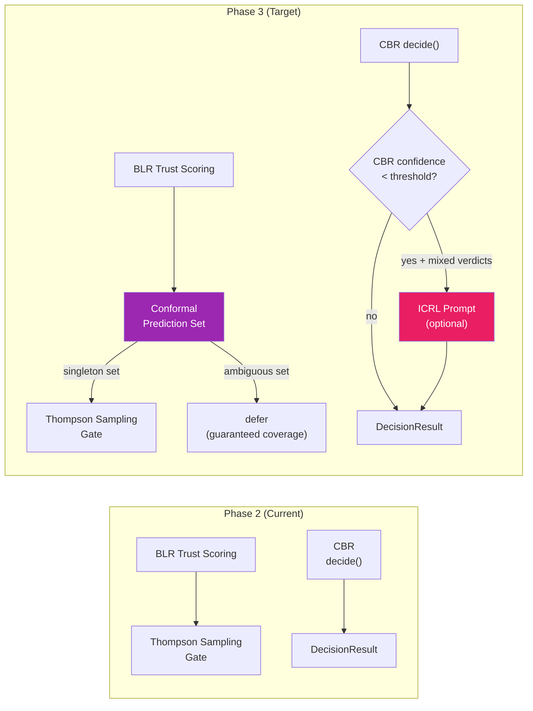
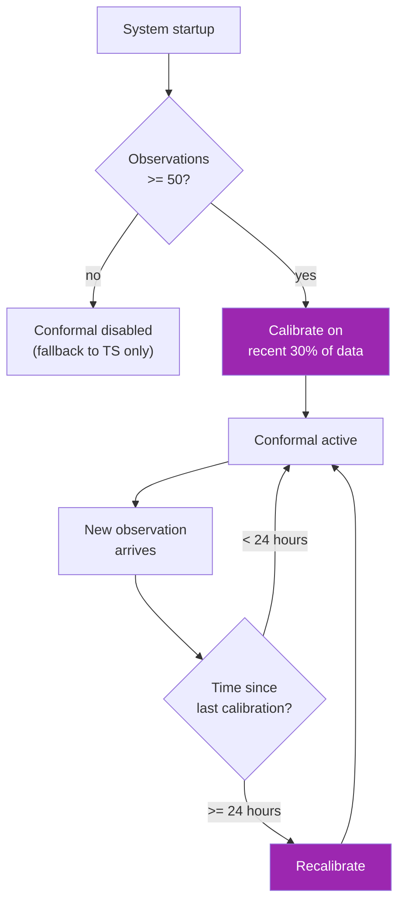

# Phase 3 Implementation Plan: Conformal Guarantees + Optional ICRL

**Date**: 2026-02-24
**Status**: PLANNED
**Phase**: 3 of 4
**Prerequisites**: Phase 2 complete (BLR + Thompson Sampling), 100+ accumulated observations
**Estimated Effort**: 3-5 days
**Observation Range**: 100+ decisions
**Target Autonomy**: ~80-95% of routine decisions handled autonomously

**Parent Document**: [Take III Synthesis](2026.02.24-decision-proxy-preference-learning-analysis-take-III-synthesis.md)
**Depends On**: Phase 2 (BLR + Thompson Sampling)

---

## Table of Contents

1. [Overview](#1-overview)
2. [Configuration Keys](#2-configuration-keys)
3. [Conformal Prediction Wrapper](#3-conformal-prediction-wrapper)
4. [Optional ICRL Prompt Augmentation](#4-optional-icrl-prompt-augmentation)
5. [Step-by-Step Implementation](#5-step-by-step-implementation)
6. [Verification Plan](#6-verification-plan)
7. [Files Inventory](#7-files-inventory)
8. [Rollback Plan](#8-rollback-plan)
9. [Open Questions](#9-open-questions)

---

## 1. Overview

Phase 3 adds statistical guarantees and LLM-augmented reasoning to the decision proxy:



**Two components**:

| Component | Purpose | Effort | Required? | New Dependencies |
|-----------|---------|--------|-----------|------------------|
| **Conformal wrapper** | Distribution-free coverage guarantees | ~1.5 days | Yes | `mapie` (pip) |
| **ICRL prompt augmentation** | LLM reasoning for ambiguous cases | ~1.5 days | Optional | None (uses existing LLM client) |

**Key principle**: Conformal prediction provides *mathematical guarantees* that the system's deferral rate is bounded. When the prediction set contains both {approve, reject}, the system *must* defer — this is not a heuristic but a statistical guarantee with user-specified coverage probability.

---

## 2. Configuration Keys

Three new INI keys in `lupin-app.ini` under `[Lupin: Baseline]`:

| INI Key | Default | Type | Purpose |
|---------|---------|------|---------|
| `swe team trust proxy conformal enabled` | `false` | bool | Enable conformal prediction wrapper |
| `swe team trust proxy icrl enabled` | `false` | bool | Enable ICRL prompt augmentation for ambiguous cases |
| `swe team trust proxy icrl top k` | `5` | int | Number of similar past decisions to include in ICRL prompt |

**Corresponding defaults** to add to `src/cosa/agents/decision_proxy/config.py`:

```python
# ============================================================================
# Phase 3: Conformal Prediction
# ============================================================================

DEFAULT_CONFORMAL_ENABLED = False

# ============================================================================
# Phase 3: ICRL Prompt Augmentation (Optional)
# ============================================================================

DEFAULT_ICRL_ENABLED = False
DEFAULT_ICRL_TOP_K   = 5
```

**Corresponding splainer entries** for `lupin-app-splainer.ini`:

```ini
swe team trust proxy conformal enabled = Enable conformal prediction wrapper around BLR classifier. When enabled, produces prediction sets ({approve}, {reject}, or {approve, reject}) with finite-sample coverage guarantees. The system defers whenever the prediction set contains both classes. Requires Phase 2 BLR and >= 50 calibration examples. Uses MAPIE library. Default: false
swe team trust proxy icrl enabled = Enable In-Context Reinforcement Learning prompt augmentation. When enabled and CBR confidence is below threshold with mixed-verdict retrieved cases, the system queries an LLM with the top-k most similar past decisions as context. Adds ~500ms-2s latency per invocation. Only triggered for genuinely ambiguous decisions. Default: false
swe team trust proxy icrl top k = Number of similar past decisions to include in the ICRL prompt context. These are retrieved from the CBR case base (LanceDB) using the same embedding similarity search. More cases provide richer context but increase prompt length and latency. Default: 5
```

**Factory function update** — add to `trust_proxy_config_from_config_mgr()`:

```python
# Phase 3: Conformal prediction
"conformal_enabled" : config_mgr.get( "swe team trust proxy conformal enabled", default=DEFAULT_CONFORMAL_ENABLED, return_type="boolean" ),
# Phase 3: ICRL (optional)
"icrl_enabled"      : config_mgr.get( "swe team trust proxy icrl enabled",      default=DEFAULT_ICRL_ENABLED,      return_type="boolean" ),
"icrl_top_k"        : config_mgr.get( "swe team trust proxy icrl top k",        default=DEFAULT_ICRL_TOP_K,        return_type="int" ),
```

---

## 3. Conformal Prediction Wrapper

### 3.1 What It Does

Conformal prediction wraps the BLR classifier to produce **prediction sets** instead of point predictions. A prediction set at confidence level 1-alpha contains the true class with probability >= 1-alpha, guaranteed for any data distribution.

| Prediction Set | Interpretation | Action |
|---------------|----------------|--------|
| `{approve}` | Strong evidence for approval | Continue to Thompson Sampling gate |
| `{reject}` | Strong evidence for rejection | Continue to Thompson Sampling gate |
| `{approve, reject}` | Ambiguous — both classes possible | **Defer** (guaranteed coverage) |

**Why this matters**: Unlike BLR's point predictions, conformal prediction sets have **finite-sample coverage guarantees**. If we set alpha=0.10, then the prediction set contains the true class at least 90% of the time — regardless of the data distribution.

### 3.2 New Dependency: MAPIE

**Package**: `mapie` (Model Agnostic Prediction Interval Estimator)

**Install**: `pip install mapie`

**Dependencies**: `numpy`, `scikit-learn` (both already installed)

**Why import, not hand-roll**: Conformal prediction's statistical correctness depends on careful implementation of coverage calibration. MAPIE is a well-tested library maintained by the Conformal Prediction community. Hand-rolling risks subtle bugs in quantile computation that would silently break coverage guarantees.

**Version compatibility**: MAPIE supports Python 3.8+ and scikit-learn 1.0+. Lupin runs Python 3.11 — fully compatible.

### 3.3 New File: `src/cosa/agents/decision_proxy/conformal_wrapper.py`

**Estimated size**: ~50-80 lines

```python
"""
Conformal prediction wrapper for BLR trust scoring.

Wraps the BLR classifier from Phase 2 to produce prediction sets with
finite-sample coverage guarantees. Uses MAPIE for calibration.

Dependencies:
    - mapie (pip install mapie)
    - numpy (already installed)
    - sklearn (already installed)
"""
import numpy as np


class ConformalDecisionWrapper:
    """
    Conformal prediction wrapper for binary approve/reject decisions.

    Uses split conformal inference: calibrate on held-out observations,
    then produce prediction sets with guaranteed coverage.

    Requires:
        - BLR model from Phase 2 is trained with >= 50 observations
        - Calibration set of (feature_vector, outcome) pairs
        - mapie library installed

    Ensures:
        - predict_set() returns a set: {"approve"}, {"reject"}, or {"approve", "reject"}
        - Coverage guarantee: true class in prediction set >= (1 - alpha) of the time
        - Defers when prediction set is ambiguous (contains both classes)
    """

    def __init__( self, blr_model, alpha=0.10, calibration_fraction=0.30 ):
        """
        Initialize conformal wrapper.

        Requires:
            - blr_model is a trained BayesianLogisticRegression instance
            - 0 < alpha < 1 (significance level; 0.10 = 90% coverage)
            - 0 < calibration_fraction < 1

        Ensures:
            - Wrapper is ready for calibration
        """
        self.blr_model              = blr_model
        self.alpha                  = alpha
        self.calibration_fraction   = calibration_fraction
        self._calibration_scores    = None
        self._quantile              = None

    def calibrate( self, X, y ):
        """
        Calibrate conformal scores on held-out data.

        Uses the simple split conformal method: compute nonconformity scores
        on calibration set, then use the (1-alpha)-quantile as threshold.

        Requires:
            - X is numpy array of shape (n, 4) — feature vectors
            - y is numpy array of shape (n,) — binary outcomes (0 or 1)
            - n >= 20 for meaningful calibration

        Ensures:
            - self._quantile is set for prediction set construction
            - Returns calibration summary dict
        """
        n = len( y )
        cal_size = max( 10, int( n * self.calibration_fraction ) )

        # Split: last cal_size examples for calibration
        X_cal, y_cal = X[ -cal_size: ], y[ -cal_size: ]

        # Compute nonconformity scores: 1 - p(true_class)
        scores = []
        for xi, yi in zip( X_cal, y_cal ):
            prob, _ = self.blr_model.predict( xi )
            p_true  = prob if yi == 1 else ( 1.0 - prob )
            scores.append( 1.0 - p_true )

        self._calibration_scores = np.array( scores )

        # Quantile: ceil((cal_size + 1) * (1 - alpha)) / cal_size
        adjusted_quantile_idx = int( np.ceil( ( cal_size + 1 ) * ( 1.0 - self.alpha ) ) )
        adjusted_quantile_idx = min( adjusted_quantile_idx, cal_size ) - 1
        sorted_scores         = np.sort( self._calibration_scores )
        self._quantile        = sorted_scores[ adjusted_quantile_idx ]

        return {
            "calibration_size" : cal_size,
            "quantile"         : float( self._quantile ),
            "alpha"            : self.alpha,
            "mean_score"       : float( self._calibration_scores.mean() ),
        }

    def predict_set( self, x ):
        """
        Produce conformal prediction set for a new query point.

        Requires:
            - calibrate() has been called
            - x is a numpy array of shape (4,)

        Ensures:
            - Returns set: {"approve"}, {"reject"}, or {"approve", "reject"}
            - Coverage guarantee: true class in set >= (1 - alpha) of the time
        """
        if self._quantile is None:
            # Not calibrated — defer by default (safe fallback)
            return { "approve", "reject" }

        prob, _ = self.blr_model.predict( x )

        prediction_set = set()

        # Include "approve" if score for approve <= quantile
        score_approve = 1.0 - prob
        if score_approve <= self._quantile:
            prediction_set.add( "approve" )

        # Include "reject" if score for reject <= quantile
        score_reject = 1.0 - ( 1.0 - prob )  # = prob
        if score_reject <= self._quantile:
            prediction_set.add( "reject" )

        # Safety: empty set should not happen, but default to ambiguous
        if len( prediction_set ) == 0:
            prediction_set = { "approve", "reject" }

        return prediction_set

    def should_defer( self, x ):
        """
        Check if this decision should be deferred based on conformal prediction.

        Requires:
            - x is a numpy array of shape (4,)

        Ensures:
            - Returns True if prediction set contains both classes
            - Returns False if prediction set is singleton (confident)
        """
        return len( self.predict_set( x ) ) > 1

    def get_status( self ):
        """
        Return conformal wrapper status for monitoring.

        Ensures:
            - Returns dict with calibration state and parameters
        """
        return {
            "calibrated"       : self._quantile is not None,
            "alpha"            : self.alpha,
            "quantile"         : float( self._quantile ) if self._quantile is not None else None,
            "calibration_size" : len( self._calibration_scores ) if self._calibration_scores is not None else 0,
        }
```

### 3.4 Integration with EngineeringStrategy

**Modification to `EngineeringStrategy`** — conformal check before Thompson Sampling:

```python
# In EngineeringStrategy.__init__():
self.conformal_enabled = conformal_enabled
self._conformal_wrapper = None  # Lazy initialization

# In EngineeringStrategy.gate():
def gate( self, category, trust_level, confidence ):
    # Circuit breaker (unchanged)
    if not self.circuit_breaker.check( category ):
        return "defer"

    # Shadow mode override (unchanged)
    if self.trust_mode == "shadow":
        return "shadow"

    # --- Conformal prediction check (Phase 3) ---
    if self.conformal_enabled and self._conformal_wrapper is not None:
        feature_vector = self._build_feature_vector( category )
        if self._conformal_wrapper.should_defer( feature_vector ):
            if self.debug: print( f"Conformal defer: prediction set is ambiguous for {category}" )
            return "defer"

    # --- Thompson Sampling path (Phase 2) ---
    if self.thompson_enabled:
        return self._gate_thompson( category )

    # --- Legacy fixed-threshold path ---
    # ... (unchanged)
```

### 3.5 Calibration Lifecycle

Conformal prediction requires periodic recalibration as new observations arrive:



**Recalibration trigger**: Every 24 hours or every 50 new observations, whichever comes first.

---

## 4. Optional ICRL Prompt Augmentation

### 4.1 What It Does

ICRL (In-Context Reinforcement Learning) augments the CBR decision with LLM reasoning when CBR alone is insufficient. It includes the top-k most similar past decisions (with outcomes) in the LLM prompt, allowing the LLM to learn decision patterns from context.

### 4.2 When ICRL is Triggered

ICRL is invoked only when **all three conditions** are met:

1. `icrl_enabled=True` in config
2. CBR confidence < `cbr_confidence_threshold` (default 0.60)
3. Retrieved CBR cases have mixed verdicts (not unanimous)

This means ICRL fires for genuinely ambiguous cases — where the case base contains conflicting precedents and CBR cannot resolve them through majority vote alone.

**Estimated invocation rate**: ~5-15% of decisions (only ambiguous cases)

### 4.3 New File: `src/cosa/agents/decision_proxy/prompts/icrl_decision.py`

**Estimated size**: ~60-80 lines

```python
"""
ICRL (In-Context Reinforcement Learning) prompt template for ambiguous decisions.

Triggered when CBR confidence is low and retrieved cases have mixed verdicts.
Uses the existing LLM client to reason about the decision based on historical
context, without requiring model fine-tuning.

Reference: Song et al. (2025) — "Reinforcement Learning in LLMs at Inference Time"
"""


ICRL_DECISION_PROMPT = """You are a decision proxy for a software engineering team. You are evaluating
a decision question and must recommend an action.

## Decision Question
{question}

## Category
{category}

## Similar Past Decisions (most recent first)
{history}

Each past decision shows:
- The question asked
- The action taken (approved/requires_review/rejected)
- Whether the human APPROVED or REJECTED the proxy's decision
- Any feedback provided

## Instructions
Based on the patterns in past decisions:
1. If similar questions were consistently approved -> recommend "approved"
2. If similar questions were consistently rejected -> recommend "requires_review"
3. If outcomes are mixed -> recommend "requires_review" (err on caution)
4. If no similar history -> use your judgment based on the category risk level

Respond with ONLY one of: "approved", "requires_review"
"""


def format_case_history( similar_cases ):
    """
    Format CBR retrieved cases into the ICRL prompt history section.

    Requires:
        - similar_cases is a list of dicts, each with keys:
          question, decision_value, ratification_state, created_at
        - List is sorted by similarity (highest first)

    Ensures:
        - Returns formatted string with numbered case entries
        - Each entry shows question, action, and outcome
    """
    if not similar_cases:
        return "(No similar past decisions found)"

    lines = []
    for i, case in enumerate( similar_cases, 1 ):
        question     = case.get( "question", "Unknown" )
        action       = case.get( "decision_value", "Unknown" )
        ratification = case.get( "ratification_state", "unknown" )
        created      = case.get( "created_at", "Unknown date" )
        similarity   = case.get( "similarity_pct", 0 )

        outcome = "APPROVED" if ratification == "approved" else "REJECTED" if ratification == "rejected" else "PENDING"

        lines.append(
            f"{i}. [{created}] (similarity: {similarity:.0f}%)\n"
            f"   Question: {question}\n"
            f"   Action: {action}\n"
            f"   Human verdict: {outcome}"
        )

    return "\n\n".join( lines )


def build_icrl_prompt( question, category, similar_cases ):
    """
    Build the complete ICRL prompt with question and case history.

    Requires:
        - question is a non-empty string
        - category is a valid engineering category name
        - similar_cases is a list of case dicts from CBR retrieval

    Ensures:
        - Returns formatted prompt string ready for LLM submission
    """
    history = format_case_history( similar_cases )
    return ICRL_DECISION_PROMPT.format(
        question = question,
        category = category,
        history  = history,
    )
```

### 4.4 Integration with `EngineeringStrategy.decide()`

**Modification to `src/cosa/agents/swe_team/proxy/engineering_strategy.py`**:

```python
# In EngineeringStrategy.__init__():
self.icrl_enabled = icrl_enabled
self.icrl_top_k   = icrl_top_k
self.llm_client   = llm_client  # Existing LLM client (e.g., openai_client)

# In EngineeringStrategy.decide():
def decide( self, question, category, context=None ):
    """
    Decide: use heuristic, CBR prediction, or ICRL fallback.

    Phase 3 addition: When CBR confidence is low AND cases have mixed
    verdicts AND ICRL is enabled, invoke LLM with historical context
    for disambiguation.
    """
    # Heuristic decision (unchanged)
    if category in ( "deployment", "destructive", "architecture" ):
        heuristic_value = "requires_review"
    else:
        heuristic_value = "approved"

    # CBR prediction (Phase 1, unchanged)
    cbr_prediction = None
    if self.cbr_store is not None:
        cbr_prediction = self._get_cbr_prediction( question, category )

    # --- ICRL fallback (Phase 3, new) ---
    if ( self.icrl_enabled
         and cbr_prediction is not None
         and cbr_prediction.confidence < self.cbr_store.confidence_threshold
         and self._has_mixed_verdicts( cbr_prediction ) ):

        icrl_value = self._get_icrl_decision( question, category, cbr_prediction )
        if icrl_value is not None:
            if self.debug: print( f"ICRL override: {icrl_value} (CBR conf={cbr_prediction.confidence:.3f})" )
            return icrl_value

    # Return CBR prediction or heuristic fallback
    if cbr_prediction is not None and cbr_prediction.confidence >= self.cbr_store.confidence_threshold:
        return cbr_prediction.verdict
    return heuristic_value


def _has_mixed_verdicts( self, cbr_prediction ):
    """
    Check if CBR retrieved cases have mixed verdicts.

    Requires:
        - cbr_prediction is a CBRPrediction instance
        - cbr_prediction.similar_cases is a list of case dicts

    Ensures:
        - Returns True if not all cases share the same decision_value
        - Returns False if cases are unanimous or empty
    """
    if not cbr_prediction.similar_cases:
        return False
    verdicts = { case.get( "decision_value" ) for case in cbr_prediction.similar_cases }
    return len( verdicts ) > 1


def _get_icrl_decision( self, question, category, cbr_prediction ):
    """
    Invoke ICRL: query LLM with historical context for disambiguation.

    Requires:
        - self.llm_client is an initialized LLM client
        - cbr_prediction.similar_cases contains the context cases

    Ensures:
        - Returns "approved" or "requires_review" (or None on error)
        - Adds ~500ms-2s latency (LLM API call)
    """
    from cosa.agents.decision_proxy.prompts.icrl_decision import build_icrl_prompt

    prompt = build_icrl_prompt( question, category, cbr_prediction.similar_cases )

    try:
        response = self.llm_client.query( prompt )
        value    = response.strip().lower()
        if value in ( "approved", "requires_review" ):
            return value
        if self.debug: print( f"ICRL returned unexpected value: {value}" )
        return None
    except Exception as e:
        if self.debug: print( f"ICRL error: {e}" )
        return None  # Graceful degradation — fall through to heuristic
```

### 4.5 Latency and Cost Considerations

| Metric | Without ICRL | With ICRL (when triggered) |
|--------|-------------|---------------------------|
| Decision latency | ~5-50ms (CBR + Thompson) | ~500-2000ms (LLM API call) |
| Cost per decision | $0 (all local) | ~$0.001-0.01 (LLM tokens) |
| Trigger rate | N/A | ~5-15% of decisions |

**Mitigation**: ICRL is only triggered for genuinely ambiguous cases. The vast majority of decisions are handled by CBR + Thompson Sampling at zero cost and sub-50ms latency.

---

## 5. Step-by-Step Implementation

Steps are dependency-ordered. Each step is independently testable.

### Step 1: Config Keys and Defaults (~0.5 day)

**Files modified**:
- `src/cosa/agents/decision_proxy/config.py` — Add 3 new defaults + update factory function
- `src/conf/lupin-app.ini` — Add 3 new keys (disabled by default)
- `src/conf/lupin-app-splainer.ini` — Add 3 matching explanations

**Test**: Unit test that `trust_proxy_config_from_config_mgr()` returns all 34 keys (31 from Phase 2 + 3 new).

### Step 2: Install MAPIE (~0.25 day)

**Action**: `pip install mapie` in the project virtual environment.

**Verification**: `python -c "from mapie.classification import MapieClassifier; print('MAPIE OK')"`.

**Note**: MAPIE's only dependencies are numpy and scikit-learn, both already installed. No new transitive dependencies.

### Step 3: Conformal Wrapper (`conformal_wrapper.py`) (~1 day)

**Files created**:
- `src/cosa/agents/decision_proxy/conformal_wrapper.py`

**Implementation**:
1. `ConformalDecisionWrapper` class with split conformal inference
2. `calibrate()` computes quantile from held-out nonconformity scores
3. `predict_set()` returns singleton or ambiguous set
4. `should_defer()` checks prediction set cardinality

**Test**: Unit test coverage guarantee: generate synthetic data, verify empirical coverage >= 1-alpha.

### Step 4: Integrate Conformal into EngineeringStrategy (~0.5 day)

**Files modified**:
- `src/cosa/agents/swe_team/proxy/engineering_strategy.py` — Add conformal check in `gate()` before Thompson Sampling

**Integration**:
1. Conformal check runs first — if ambiguous, defer immediately
2. If singleton, proceed to Thompson Sampling as normal
3. Recalibration on timer (24h or 50 new observations)

**Test**: Integration test: conformal defer overrides Thompson Sampling "act" when prediction set is ambiguous.

### Step 5: ICRL Prompts Directory (~0.5 day)

**Files created**:
- `src/cosa/agents/decision_proxy/prompts/__init__.py`
- `src/cosa/agents/decision_proxy/prompts/icrl_decision.py`

**Implementation**:
1. `ICRL_DECISION_PROMPT` template string
2. `format_case_history()` formats CBR cases for prompt context
3. `build_icrl_prompt()` assembles complete prompt

**Test**: Unit test prompt formatting with mock cases.

### Step 6: ICRL Integration into decide() (~1 day)

**Files modified**:
- `src/cosa/agents/swe_team/proxy/engineering_strategy.py` — Add ICRL fallback in `decide()`, accept LLM client in `__init__()`

**Implementation**:
1. `_has_mixed_verdicts()` checks CBR case unanimity
2. `_get_icrl_decision()` invokes LLM with formatted prompt
3. Graceful degradation on LLM error (fall through to heuristic)
4. Config-gated: only active when `icrl_enabled=True`

**Test**: Unit test with mocked LLM client, verify ICRL triggers on mixed verdicts only.

### Step 7: Monitoring and Diagnostics (~0.5 day)

**Files modified**:
- `src/cosa/agents/decision_proxy/responder.py` — Expose conformal status and ICRL stats

**Implementation**:
1. Add `conformal_status` to proxy status response (calibrated/uncalibrated, quantile, alpha)
2. Add `icrl_stats` (invocations, success_rate, avg_latency)
3. Self-monitoring: track prediction set width distribution

---

## 6. Verification Plan

### 6.1 Unit Tests

**New test file**: `src/tests/unit/test_conformal_wrapper.py`

| Test | Description | Expected |
|------|-------------|----------|
| `test_conformal_uncalibrated_defers` | Uncalibrated wrapper → always defers | `should_defer() == True` |
| `test_conformal_calibration_sets_quantile` | calibrate() with valid data sets quantile | `_quantile is not None` |
| `test_conformal_singleton_approve` | High-confidence approve → `{"approve"}` | `len(predict_set) == 1` |
| `test_conformal_singleton_reject` | High-confidence reject → `{"reject"}` | `len(predict_set) == 1` |
| `test_conformal_ambiguous_defers` | Borderline case → `{"approve", "reject"}` | `should_defer() == True` |
| `test_conformal_coverage_guarantee` | Empirical coverage >= 1-alpha on held-out set | coverage >= 0.89 (with margin) |
| `test_conformal_recalibration` | Recalibrate with new data updates quantile | `new_quantile != old_quantile` |
| `test_conformal_status` | get_status() returns valid dict | all expected keys present |

**Coverage guarantee test** (statistical):
```python
def test_conformal_coverage_guarantee():
    """
    Statistical test: empirical coverage should be >= (1 - alpha) - epsilon.

    Generate 500 synthetic observations from known distribution.
    Split 70/30 for training/calibration.
    Test on 200 fresh samples.
    Verify empirical coverage >= 0.85 (alpha=0.10, with finite-sample tolerance).
    """
```

**New test file**: `src/tests/unit/test_icrl_prompt.py`

| Test | Description | Expected |
|------|-------------|----------|
| `test_format_empty_cases` | No cases → "(No similar past decisions found)" | default message |
| `test_format_single_case` | One case formatted correctly | contains question, action, verdict |
| `test_format_multiple_cases` | Multiple cases numbered and formatted | entries numbered 1-N |
| `test_build_prompt_structure` | Complete prompt has all sections | contains "Decision Question", "Category", "Similar Past Decisions" |
| `test_icrl_approved_response` | Mock LLM returns "approved" → returns "approved" | `result == "approved"` |
| `test_icrl_requires_review_response` | Mock LLM returns "requires_review" → returns "requires_review" | `result == "requires_review"` |
| `test_icrl_invalid_response` | Mock LLM returns garbage → returns None | `result is None` |
| `test_icrl_error_handling` | Mock LLM raises exception → returns None | `result is None` |
| `test_icrl_not_triggered_unanimous` | All CBR cases agree → ICRL not invoked | LLM client not called |
| `test_icrl_triggered_mixed` | CBR cases disagree + low confidence → ICRL invoked | LLM client called once |

### 6.2 Integration with Existing Tests

**Modified test file**: `src/tests/unit/test_trust_tracker.py`

| Test | Description | Expected |
|------|-------------|----------|
| `test_conformal_config_round_trip` | Config factory returns all 34 keys | 34 keys in dict |

### 6.3 Smoke Test

**File**: `src/tests/smoke/test_conformal_icrl_flow.py`

End-to-end test:
1. Create `EngineeringStrategy` with `conformal_enabled=True`, `icrl_enabled=True`
2. Simulate 100 decisions with varying success rates per category
3. Calibrate conformal wrapper
4. Verify conformal defers on ambiguous decisions
5. Simulate mixed-verdict CBR scenario, verify ICRL is invoked (with mock LLM)
6. Print summary: deferral rate, conformal coverage, ICRL invocation count

---

## 7. Files Inventory

### 7.1 Files Created

| File | Lines | Purpose |
|------|-------|---------|
| `src/cosa/agents/decision_proxy/conformal_wrapper.py` | ~50-80 | Conformal prediction wrapper |
| `src/cosa/agents/decision_proxy/prompts/__init__.py` | ~1 | Package marker |
| `src/cosa/agents/decision_proxy/prompts/icrl_decision.py` | ~60-80 | ICRL prompt template and formatting |
| `src/tests/unit/test_conformal_wrapper.py` | ~150 | Conformal unit tests (including coverage guarantee) |
| `src/tests/unit/test_icrl_prompt.py` | ~150 | ICRL prompt + integration unit tests |
| `src/tests/smoke/test_conformal_icrl_flow.py` | ~80 | End-to-end smoke test |

### 7.2 Files Modified

| File | Changes |
|------|---------|
| `src/cosa/agents/decision_proxy/config.py` | Add 3 Phase 3 defaults, update factory function |
| `src/cosa/agents/swe_team/proxy/engineering_strategy.py` | Add conformal check in `gate()`, ICRL fallback in `decide()`, accept new config params |
| `src/conf/lupin-app.ini` | Add 3 new INI keys |
| `src/conf/lupin-app-splainer.ini` | Add 3 matching explanations |

### 7.3 Dependencies Added

| Package | Version | Purpose | Transitive Deps |
|---------|---------|---------|-----------------|
| `mapie` | latest | Conformal prediction | numpy, scikit-learn (both already installed) |

---

## 8. Rollback Plan

All Phase 3 components are config-gated and backward-compatible:

| Component | Rollback Action |
|-----------|----------------|
| Conformal wrapper | Set `conformal_enabled=false` → reverts to Thompson Sampling only |
| ICRL prompt | Set `icrl_enabled=false` → disables entirely (already optional) |
| MAPIE dependency | `pip uninstall mapie` if needed (no other component depends on it) |

**No data migration needed** — conformal calibration is recomputed from existing decision history. ICRL is stateless (prompt-based, no persistent state).

---

## 9. Open Questions

1. **Conformal alpha**: Should the coverage level (alpha=0.10 → 90% coverage) be configurable via INI, or is 90% the right default for all deployments?

2. **Recalibration frequency**: Every 24h or every 50 observations — which trigger should take priority? Should recalibration be lazy (on next decision) or eager (background timer)?

3. **ICRL model selection**: Which LLM should ICRL use? The same model as the main agent pipeline, or a dedicated smaller/cheaper model for lower latency?

4. **ICRL prompt evolution**: Should the ICRL prompt template be configurable (stored in INI or a template file), or is the hardcoded template sufficient?

5. **Conformal + Thompson interaction**: When conformal says "singleton {approve}" but Thompson Sampling draws a low rate, should we trust conformal (act) or Thompson (shadow)? Current design: conformal filters first, then Thompson routes within the surviving set.

6. **MAPIE vs hand-rolled**: The current plan uses a custom split conformal implementation (~50 lines) rather than MAPIE's full API. Should we use MAPIE's `MapieClassifier` directly for production-grade calibration, or is the custom implementation sufficient for binary classification?

---

*This plan derives from [Take III Synthesis](2026.02.24-decision-proxy-preference-learning-analysis-take-III-synthesis.md) Sections 4.6, 6 (Phase 3), 7, and 8. All file paths and class names verified against Phase 0+1 implementation (commit `bcd5e4e`) and Phase 2 plan (this directory).*
